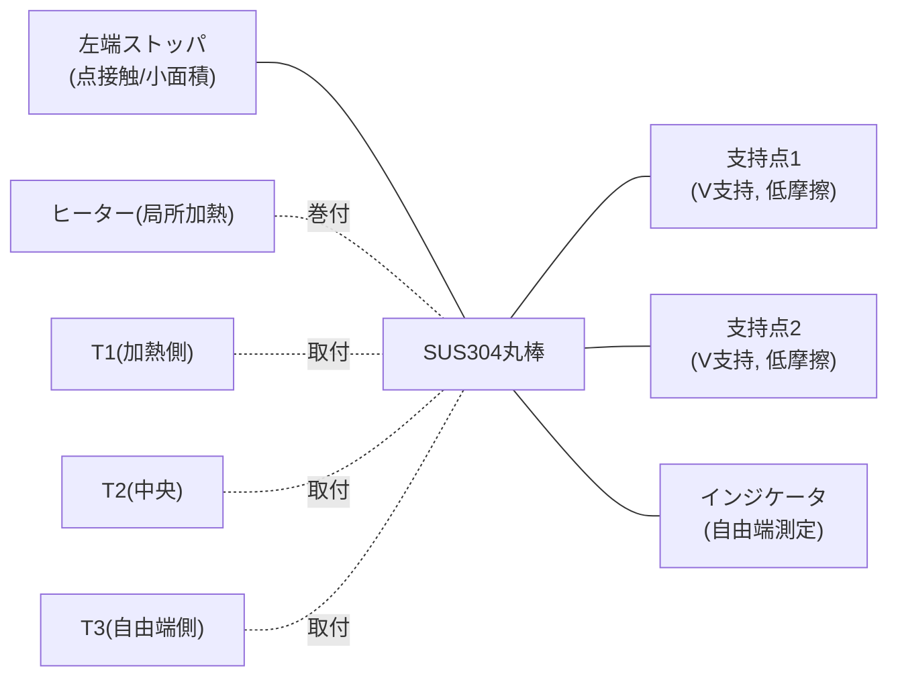

# 治具 上面図（概念図）

詳細な設計方針は `docs/03_mechanical_fixture.md` を参照。

```
   ┌──────────────────────────────────────────────────────────────┐
   │                                                                │
   │  左端ストッパ   支持点1(V支持)        支持点2(V支持)   インジケータ │
   │      ┃              △                      △            ●──┤ │
   │      ┃        ▓▓▓▓▓▓▓▓▓▓▓▓（ヒーター巻付範囲）                  │
   │      ┃================================================□    │
   │      ┃         T1          T2                 T3            │
   │      ┃      (加熱側)      (中央)            (自由端側)          │
   │                                                                │
   │  ※断熱材はヒーター〜基台間（図では省略、側面図参照）              │
   └──────────────────────────────────────────────────────────────┘

   凡例:
     ┃ : 左端ストッパ（丸棒端面が軽く当たる、強くクランプしない）
     △ : 低摩擦支持（ベアリングV支持 or Vブロック）
     = : SUS304丸棒 (φ20×300)
     ▓ : ヒーター巻付範囲（左寄り＝加熱側）
     ● : インジケータ測定子（自由端に接触）
```

## Mermaid版（構成要素の関係）


