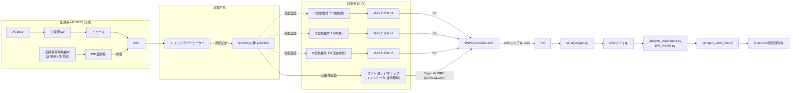

# システムブロック図

```mermaid
flowchart LR
    subgraph Specimen["試験片系"]
        ROD["SUS304丸棒 φ20x300"]
        HEATER["シリコンラバーヒーター"]
        HEATER -- "局所加熱" --> ROD
    end

    subgraph Sensing["計測系 (3.3V)"]
        TC1["K型熱電対 T1(加熱側)"] --> M1["MAX31856 #1"]
        TC2["K型熱電対 T2(中央)"] --> M2["MAX31856 #2"]
        TC3["K型熱電対 T3(自由端側)"] --> M3["MAX31856 #3"]
        IND["ミツトヨ デジマチック<br/>インジケータ(電池駆動)"]
    end

    ROD -. "表面温度" .-> TC1
    ROD -. "表面温度" .-> TC2
    ROD -. "表面温度" .-> TC3
    ROD -- "自由端変位" --> IND

    M1 -- SPI --> ESP32["ESP32-DevKitC-32E"]
    M2 -- SPI --> ESP32
    M3 -- SPI --> ESP32
    IND -- "Digimatic/SPC (DATA,CLOCK)" --> ESP32

    ESP32 -- "USBシリアル CSV" --> PC["PC"]
    PC --> LOGGER["serial_logger.py"]
    LOGGER --> CSVFILE["CSVファイル"]
    CSVFILE --> ANALYZE["analyze_experiment.py<br/>plot_results.py"]
    ANALYZE --> COMPARE["compare_with_fem.py"]
    COMPARE --> REPORT["OpenCAE発表資料等"]

    subgraph Heating["加熱系 (AC100V, 分離)"]
        AC["AC100V"] --> SW["主電源SW"] --> FUSE["ヒューズ"] --> SSR["SSR"] --> HEATER
        PID["PID温調器"] -- "制御" --> SSR
        TCCTRL["温調器専用熱電対<br/>(計測用と別系統)"] --> PID
    end
```

- 計測系(3.3Vロジック)とAC100V加熱系は物理的に分離する（`docs/04_electrical_wiring.md`, `docs/10_safety.md`）。
- インジケータはESP32から給電せず、電池駆動とする（`docs/05_digimatic_protocol.md`）。
