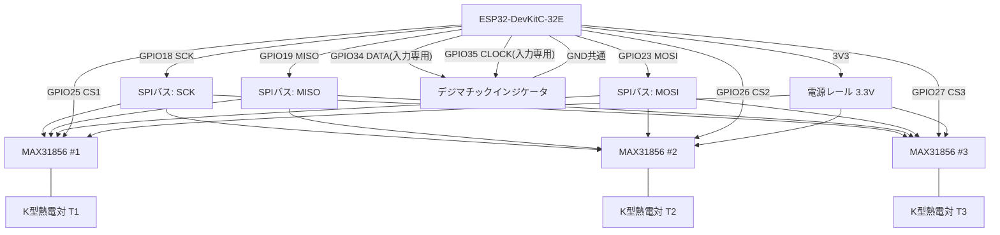

# 配線図（結線表は docs/04_electrical_wiring.md 参照）

## Mermaidによる結線イメージ



## ASCII結線図（詳細はdocs/04_electrical_wiring.md）

```
                        ┌──────────────┐
   K型熱電対T1 ──T+/T−→│  MAX31856 #1 │
   (加熱側)             │  CS=GPIO25   │──┐
                        └──────────────┘  │
                        ┌──────────────┐  │   SPIバス共通
   K型熱電対T2 ──T+/T−→│  MAX31856 #2 │──┤   SCK  = GPIO18
   (中央)                │  CS=GPIO26   │  │   MISO = GPIO19
                        └──────────────┘  │   MOSI = GPIO23
                        ┌──────────────┐  │
   K型熱電対T3 ──T+/T−→│  MAX31856 #3 │──┘
   (自由端側)            │  CS=GPIO27   │
                        └──────────────┘

   デジマチックインジケータ (電池駆動、ESP32から給電しない)
        DATA  ───────────→ GPIO34 (入力専用)
        CLOCK ───────────→ GPIO35 (入力専用)
        GND   ───────────── GND共通

   すべてのMAX31856: VIN→3V3, GND→GND
```

## 注意（再掲）

- Digimatic側の配線・保護回路は`docs/05_digimatic_protocol.md`の安全確認手順を先に実施してから通電すること。
- AC100V配線はこの図には含めない（別系統、`docs/04_electrical_wiring.md`4.5節・`docs/10_safety.md`参照）。
