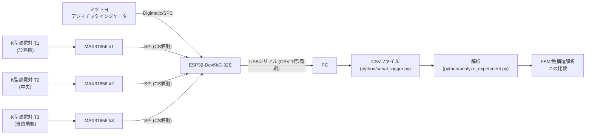

# 01. システム概要

更新日: 2026-07-27
状態: 設計段階（未実機確認の項目多数。各所の「要実機確認」「要確認」表記を参照）

## 1.1 目的

SUS304丸棒を局所的に加熱し、以下を同時に自動計測する。

- 軸方向熱膨張量（自由端変位）
- 丸棒温度3点（T1: 加熱側、T2: 中央、T3: 自由端側）
- 経過時間
- 各センサの正常・異常状態

得られた実験結果を、理論式 `ΔL = ∫α(T)[T(x,t)-T0(x)]dx` およびFEM／熱構造解析結果と比較し、OpenCAE関連の発表・技術資料に使えるデータセットを作ることを目的とする。

本プロジェクトは `IoT/` フォルダ配下の独立サブプロジェクトとして構築する。既存の `IoT/arduino/sketches/esp32_thermal_logger`（住居内温湿度ロガー、BME280+microSD）とはセンサ構成・目的が異なるため独立させている。共有できる知見（SPIバス共有の考え方、熱電対固定のコツ等）は `IoT/docs/wiring.md` や `IoT/docs/memo.md` も参照のこと。

## 1.2 全体構成（データフロー）

詳細な結線は `diagrams/system_block_diagram.md`、`diagrams/wiring_diagram.md`、`04_electrical_wiring.md` を参照。

**重要**: センサが個別にCSVを送るのではなく、ESP32が温度3点・変位1点・経過時間を1つのCSV行に集約してUSBシリアル経由でPCへ送る（要件3節）。

## 1.3 測定対象と測定項目

| 項目 | センサ/手段 | 記号 | 単位 |
|---|---|---|---|
| 加熱側温度 | K型熱電対 T1 + MAX31856 #1 | T1 | ℃ |
| 中央温度 | K型熱電対 T2 + MAX31856 #2 | T2 | ℃ |
| 自由端側温度 | K型熱電対 T3 + MAX31856 #3 | T3 | ℃ |
| 軸方向変位（自由端） | ミツトヨ デジマチックインジケータ | disp_mm | mm |
| 経過時間 | ESP32内部クロック(millis) | elapsed_ms | ms |
| センサ正常/異常 | MAX31856フォルトフラグ、SPC受信有効フラグ | fault1-3, spc_valid | - |

## 1.4 試験片（概要、詳細は `config/material_properties_sus304.json`）

- 材質: SUS304
- 形状: 丸棒、直径約20mm、長さ約300mm
- 想定熱膨張量: 約0.4mm程度（線膨張係数17.3e-6/K、ΔT≈80℃の場合の目安。`11_fem_comparison.md` 参照）
- 加熱: シリコンラバーヒーターによる片側/局所加熱

## 1.5 治具の基本方針（詳細は `03_mechanical_fixture.md`）

- 丸棒は水平配置、2点支持（完全片持ちにしない、縦吊りも採用しない）
- 軸方向は片側端面のみをストッパで基準化し、反対側は自由端としてインジケータで測定
- 丸棒を強くクランプしない（熱膨張・支持部の再現性を優先）

## 1.6 比較対象（実験 vs 解析）

- 温度履歴（T1, T2, T3 の時系列）
- 丸棒軸方向の温度分布（3点からの近似、可能ならFEM温度分布との比較）
- 自由端変位の時系列
- 理論熱膨張量 `ΔL = αLΔT`（一定物性近似）と `ΔL = ∫α(T)[T(x,t)-T0(x)]dx`（分布近似）
- FEM/熱構造解析結果
- 実験値との誤差（誤差要因の内訳は `09_error_budget.md`）

## 1.7 ドキュメント構成

| ファイル | 内容 |
|---|---|
| `02_parts_list.md` | 部品表・価格目安・購入時注意 |
| `03_mechanical_fixture.md` | 治具設計（支持方式、ストッパ、たわみ計算） |
| `04_electrical_wiring.md` | ピン割当、結線表、AC100V部の隔離 |
| `05_digimatic_protocol.md` | Digimatic/SPC信号の扱い方と安全策 |
| `06_esp32_setup.md` | 開発環境構築、ライブラリ、書き込み手順 |
| `07_experiment_procedure.md` | 準備〜無加熱試験〜加熱試験〜繰返し試験の手順 |
| `08_calibration.md` | インジケータ・熱電対・治具の校正手順 |
| `09_error_budget.md` | 誤差要因の定量化・評価方法 |
| `10_safety.md` | 安全上の注意（AC100V、高温部、断線時対応） |
| `11_fem_comparison.md` | 理論式・FEM比較の考え方、平均温度の求め方 |

## 1.8 未確定事項（サマリ、詳細は各ドキュメント内の「要確認」表記）

- インジケータ型番の最終適合（`02_parts_list.md`, `08_calibration.md`）
- Digimatic/SPC信号の電気仕様と保護回路の要否（`05_digimatic_protocol.md`）
- ヒーター容量・目標最高温度・温調器/SSR型番（`04_electrical_wiring.md`, `10_safety.md`）
- 熱電対固定方法・支持部材質の最終選定（`03_mechanical_fixture.md`）
- FEM側の境界条件（`11_fem_comparison.md`）

これらは「仮案」「要確認」と明示した上で、作業を止めずに推奨案を提示している。実機確認後にこのドキュメント一式を更新すること。
