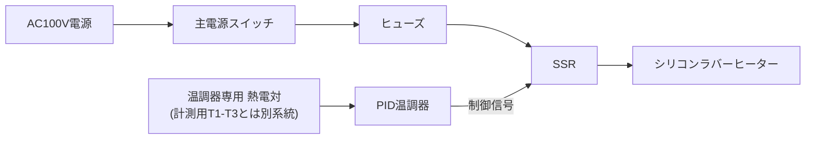

# 04. 配線資料

更新日: 2026-07-27

本ドキュメントは計測系（ESP32・MAX31856・Digimatic）の配線と、加熱系（AC100V）の分離方針をまとめる。回路図は `diagrams/wiring_diagram.md` も参照。

## 4.1 全体の考え方

- **計測系（3.3Vロジック）とAC100V系（ヒーター・SSR・温調器）は物理的に分離する。** ブレッドボード上でAC100Vを扱わない。
- MAX31856は3枚とも共通SPIバス（SCK/MISO/MOSI）に相乗りし、**CSのみ個別**にする。
- Digimatic/SPC信号は一般的なUARTではないため、専用の受信方式（GPIO入力＋割込み）で扱う。詳細は`05_digimatic_protocol.md`。
- Digimatic側にはESP32から給電しない。インジケータは内蔵電池で動作させ、ESP32とインジケータのGNDのみ共通化する。

## 4.2 ピン割当（計測系、ESP32-DevKitC）

| 役割 | ESP32ピン | 接続先 | 備考 |
|---|---|---|---|
| SPIクロック | GPIO18 (SCK) | MAX31856 #1-#3 共通 | |
| SPIデータ入力 | GPIO19 (MISO) | MAX31856 #1-#3 共通 | |
| SPIデータ出力 | GPIO23 (MOSI) | MAX31856 #1-#3 共通 | MAX31856はレジスタ設定にMOSIを使用（MAX31855と異なり読み書き両対応） |
| CS: T1 (加熱側) | GPIO25 | MAX31856 #1 CS | |
| CS: T2 (中央) | GPIO26 | MAX31856 #2 CS | |
| CS: T3 (自由端側) | GPIO27 | MAX31856 #3 CS | |
| (拡張用) CS: 治具温度等 | GPIO33 | MAX31856 #4 CS（任意） | `03_mechanical_fixture.md`3.8節の基台温度測定を追加する場合用。未使用ならオープンでよい |
| Digimatic DATA | GPIO34 | インジケータ SPC DATA線 | 入力専用ピン。内部プルなし |
| Digimatic CLOCK | GPIO35 | インジケータ SPC CLOCK線 | 入力専用ピン。内部プルなし |
| (任意) Digimatic REQ | GPIO32（仮案） | インジケータ SPC REQ線（存在する場合） | 一部機種は受信要求信号が必要。**要信号波形確認** |
| 電源 | 3V3 | MAX31856 ×3 の VIN | |
| グラウンド | GND | MAX31856 ×3 の GND、Digimatic GND | 共通GND必須 |

**GPIO34/35についての注意（要確認）:**
ESP32のGPIO34〜39は入力専用で、**内部プルアップ・プルダウン抵抗を持たない**。Digimatic信号がオープンドレイン的な出力である場合、外付けのプルアップ抵抗（値は要確認、仮案10kΩ程度を3.3V側に）が必要になる可能性がある。ロジックレベルも1.5V系である可能性が指摘されており（`05_digimatic_protocol.md`参照）、そのままESP32(3.3V系)へ直結してよいかは信号実測で確認すること。

## 4.3 MAX31856 結線表（×3、共通パターン）

| MAX31856ピン | ESP32ピン | 備考 |
|---|---|---|
| VIN | 3V3 | |
| GND | GND | |
| SCK | GPIO18 | 全個共通 |
| SDO (MISO) | GPIO19 | 全個共通 |
| SDI (MOSI) | GPIO23 | 全個共通 |
| CS | GPIO25 / 26 / 27（個体ごと） | |
| T+ / T− | K型熱電対 | 極性あり。先端を指でつまみ温度上昇を確認 |

- 3本の熱電対を同じ場所（例: 同じ金属ブロックや同一の氷水容器）に束ねて配置し、3チャンネル間のオフセットを比較する「校正モード」を`08_calibration.md`に定義する。

## 4.4 Digimaticインジケータ結線（安全策込み、詳細は`05_digimatic_protocol.md`）

| インジケータ/ケーブル側 | ESP32側 | 備考 |
|---|---|---|
| DATA | GPIO34 | **入力のみ**。ESP32からHIGH出力しない |
| CLOCK | GPIO35 | **入力のみ** |
| GND | GND | 共通化必須 |
| (電源線がある場合) | **接続しない** | ESP32から給電しない。インジケータは内蔵電池で動作 |

安全上の要点（再掲、詳細は`05_digimatic_protocol.md`・`10_safety.md`）:
- SPC信号端子へ3.3Vを直接印加しない
- 入力ピンをOUTPUT HIGHにしない（ファームウェア側でも`pinMode(..., INPUT)`のみを使う設計にする）
- 直接接続の安全性が確認できるまでは、保護回路（抵抗分圧、レベル変換IC、コンパレータ等）の追加を前提に検討する

## 4.5 加熱系（AC100V、概要）

詳細な回路定数（ヒーター容量、SSR型番等）は未確定（`10_safety.md`参照）だが、基本構成は以下の通り。

- 温調器側の熱電対と、計測用のT1〜T3は**目的を分離**する。同じ熱電対をMAX31856と温調器へ**並列接続しない**（信号品質・安全性の両面で非推奨）。
- SSR・ヒューズ・主電源スイッチ・非常停止手段はすべてAC100V側（金属ケース内）に収める。
- ESP32・MAX31856・ブレッドボードなどの計測系は、AC100V部から離れた場所に設置する。

## 4.6 配線時の注意（まとめ）

1. ブレッドボードの電源レールに3.3VとGNDを先に引き、各モジュールはレールから取る。
2. SPI共通線（SCK/MISO/MOSI）は数珠つなぎでよいが、配線は短めにする。
3. 熱電対の補償導線を途中で他の金属線に継がない（異種金属接点が新たな熱電対になり誤差要因となる）。
4. Digimatic側の配線は本ドキュメント単体で完結させず、必ず`05_digimatic_protocol.md`の安全確認手順を実施してから通電する。
5. AC100Vとロジック回路の配線・工具・作業スペースは物理的に分けて作業する。
