# 論文1：Kalman Filter-Driven State Observer for Thermal Error Compensation in Machine Tool Digital Twins

**著者**: Sebastian Lang, Sofia Talleri, Josef Mayr, Konrad Wegener, Markus Bambach  
**掲載誌**: Manufacturing Letters 41 (2024) 208–218  
**学会**: 52nd SME North American Manufacturing Research Conference (NAMRC 52, 2024)

---

## 表紙・アブストラクト

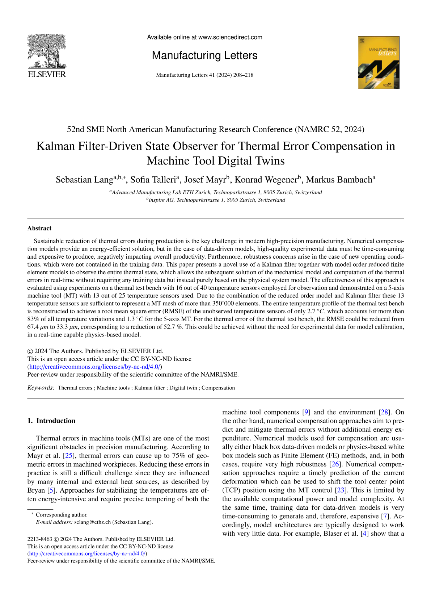

---

## 1. 背景と問題設定

工作機械（MT）の精度誤差のうち **40〜75% が熱誤差** に起因する。熱誤差の主要因はモータ・スピンドル・軸受からの発熱による構造変形。

### 既存アプローチの限界

| アプローチ | 強み | 弱み |
|---|---|---|
| 物理モデル（FEM） | 原理的に正確 | 計算コスト大・全パラメータ同定が必要 |
| データ駆動モデル（ARX・回帰等） | 計算軽量・デジタルツインに統合しやすい | **大量の実験データが必要**（取得コスト大） |

→ **少ない実験データで動作する高精度な補償手法**が求められていた。

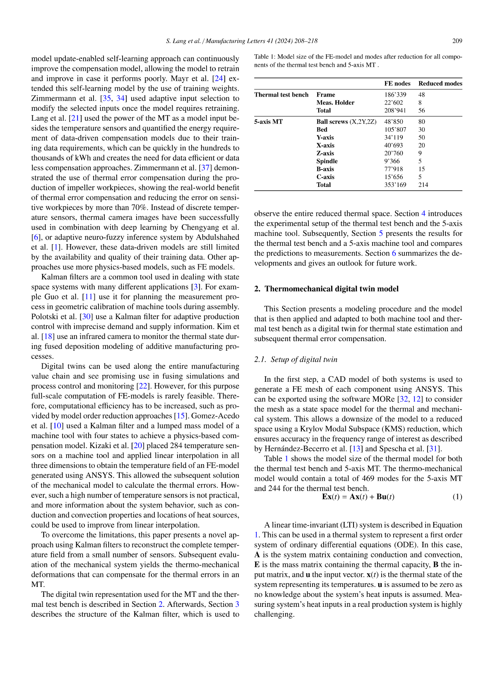

---

## 2. 提案手法：カルマンフィルタによる状態オブザーバ

### 基本コンセプト

FEM デジタルツインを **状態予測器** として使い、リアルタイムのセンサ計測値で誤差を修正するカルマンフィルタを組み合わせる。

```
FEM デジタルツイン（物理モデル）
       ↓ 予測（時間発展）
  熱状態の事前推定
       ↓
カルマンゲインで補正
       ↑
  センサ計測値（実機）
       ↓ 更新
  熱状態の事後推定
       ↓
  熱変位の計算（補償値）
```

---

### 状態空間モデル（離散時間）

熱系を次の線形離散時間状態空間方程式で表す：

$$
\mathbf{x}_{k+1} = \mathbf{A}\,\mathbf{x}_k + \mathbf{B}\,\mathbf{u}_k + \mathbf{w}_k
$$

$$
\mathbf{y}_k = \mathbf{C}\,\mathbf{x}_k + \mathbf{v}_k
$$

| 記号 | 意味 |
|---|---|
| $\mathbf{x}_k \in \mathbb{R}^n$ | 温度状態ベクトル（時刻 $k$） |
| $\mathbf{u}_k \in \mathbb{R}^m$ | 入力ベクトル（熱源・冷却等） |
| $\mathbf{y}_k \in \mathbb{R}^p$ | センサ計測値ベクトル |
| $\mathbf{w}_k \sim \mathcal{N}(\mathbf{0},\,\mathbf{Q})$ | プロセスノイズ（モデル誤差） |
| $\mathbf{v}_k \sim \mathcal{N}(\mathbf{0},\,\mathbf{R})$ | 観測ノイズ（センサ誤差） |
| $\mathbf{A},\,\mathbf{B}$ | FEM から導出された状態遷移・入力行列 |
| $\mathbf{C}$ | センサ位置を定める観測行列 |

熱変位は温度状態から熱膨張係数 $\alpha$ を用いて算出：

$$
\boldsymbol{\delta}_k = \boldsymbol{\alpha} \cdot \Delta\mathbf{x}_k
$$

---

### カルマンフィルタのアルゴリズム

#### Step 1：予測（Prediction）

$$
\hat{\mathbf{x}}_k^- = \mathbf{A}\,\hat{\mathbf{x}}_{k-1} + \mathbf{B}\,\mathbf{u}_{k-1}
$$

$$
\mathbf{P}_k^- = \mathbf{A}\,\mathbf{P}_{k-1}\,\mathbf{A}^\top + \mathbf{Q}
$$

#### Step 2：カルマンゲインの計算

$$
\mathbf{K}_k = \mathbf{P}_k^-\,\mathbf{C}^\top \left(\mathbf{C}\,\mathbf{P}_k^-\,\mathbf{C}^\top + \mathbf{R}\right)^{-1}
$$

#### Step 3：状態の更新（Measurement Update）

$$
\hat{\mathbf{x}}_k = \hat{\mathbf{x}}_k^- + \mathbf{K}_k\left(\mathbf{y}_k - \mathbf{C}\,\hat{\mathbf{x}}_k^-\right)
$$

$$
\mathbf{P}_k = \left(\mathbf{I} - \mathbf{K}_k\,\mathbf{C}\right)\mathbf{P}_k^-
$$

ここで $\left(\mathbf{y}_k - \mathbf{C}\,\hat{\mathbf{x}}_k^-\right)$ はイノベーション（予測残差）。$\mathbf{K}_k$ が大きいほど計測値を重視し、小さいほどモデル予測を重視する。

| ステップ | 更新量 | 意味 |
|---|---|---|
| 予測 | $\hat{\mathbf{x}}_k^-,\;\mathbf{P}_k^-$ | FEMモデルによる事前推定・不確かさ伝播 |
| 更新 | $\hat{\mathbf{x}}_k,\;\mathbf{P}_k$ | センサ計測を取り込んだ事後推定 |

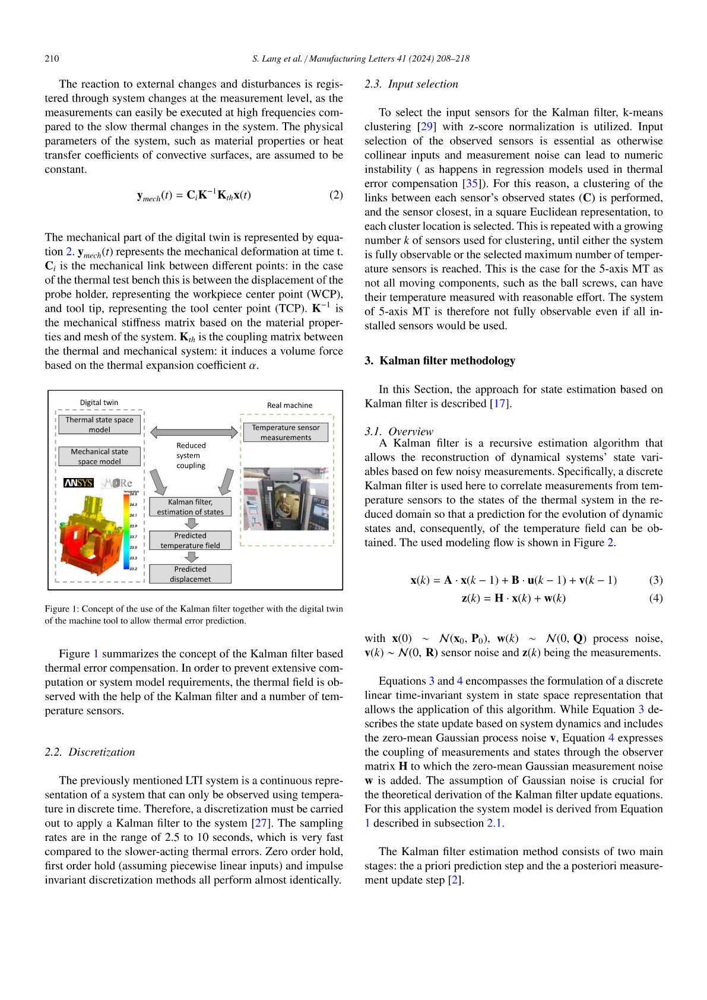

---

## 3. デジタルツイン・アーキテクチャ

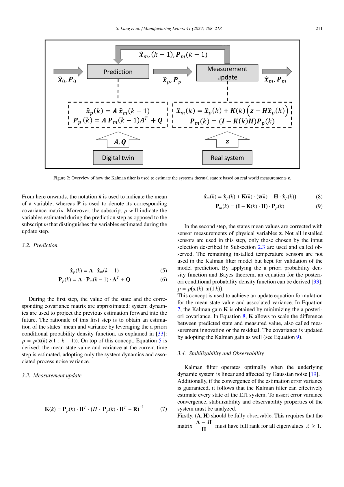

デジタルツインは以下の2層構造：

1. **物理層（FEM）**: Ansys などで構築した熱・機械連成モデル。行列 $\mathbf{A},\mathbf{B},\mathbf{C}$ はここから導出される
2. **状態推定層（Kalman Filter）**: FEM 予測値と計測値をリアルタイム融合し $\hat{\mathbf{x}}_k$ を逐次更新

デジタルツインは **時間発展しながら** 実機の熱状態を追跡する。

---

## 4. 実験検証

### 4-1. 熱試験台（Thermal Test Bench）

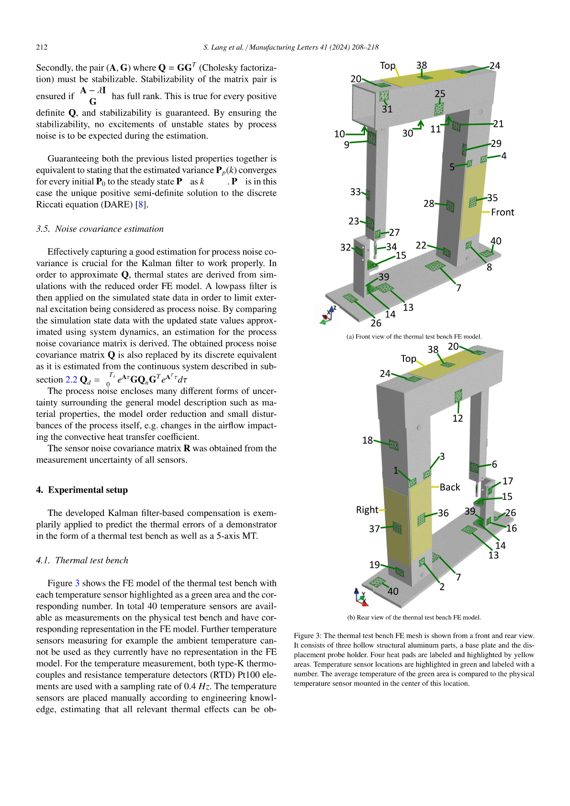

- 16 個の温度センサを設置した試験台で予備検証
- 実際の補償には **4センサのみ** を使用（$p = 4$, $\mathbf{C} \in \mathbb{R}^{4 \times n}$）

### 4-2. 5軸工作機械（DMF 50|linear）への適用

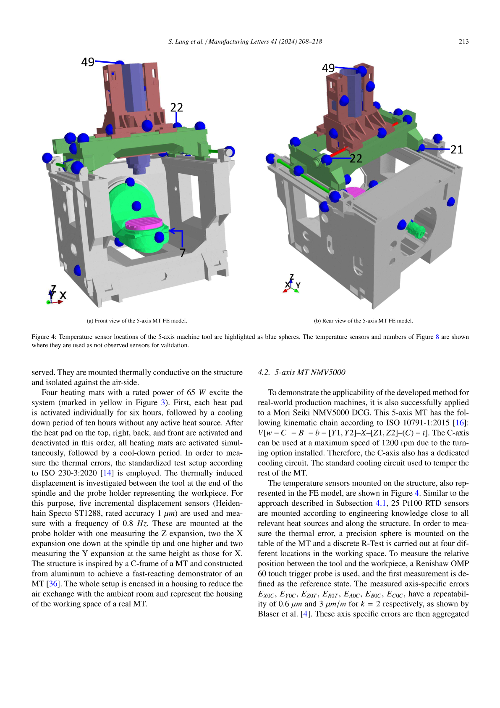

- 5軸 MT への実装・検証
- センサ数: 16 個設置 → 最終的に **4本** で補償

---

## 5. 結果

### 温度推定

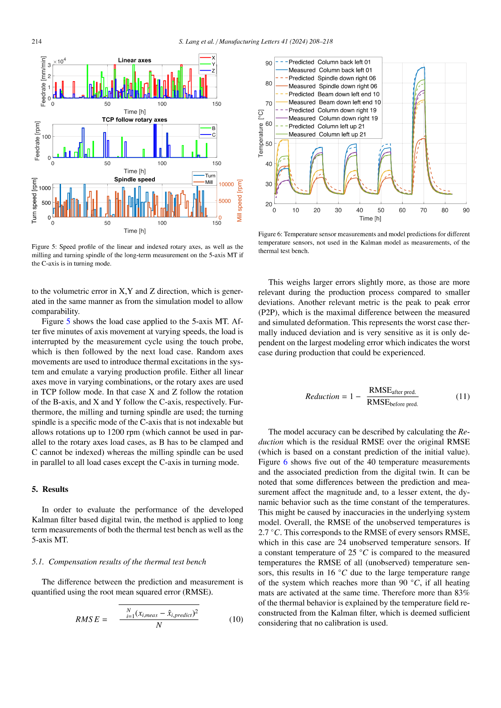

- $\hat{\mathbf{x}}_k$（4センサによる推定値）が実測値とよく一致
- 全16センサを使った場合と比較しても遜色ない推定精度

### 熱変位補償

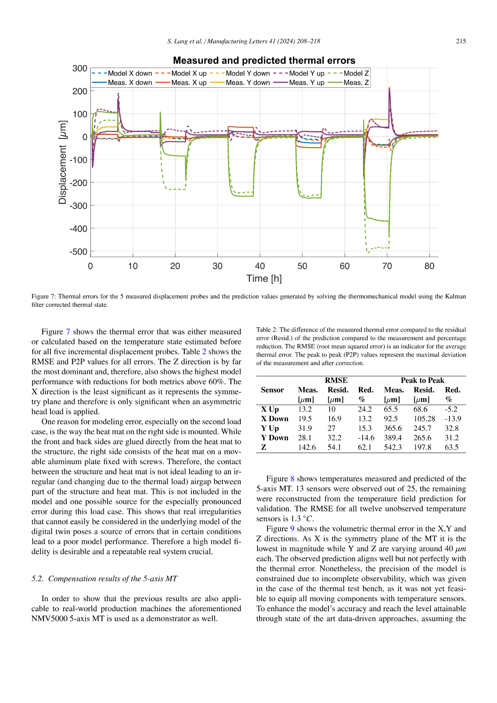

補償精度の評価指標：

$$
\mathrm{RMSE} = \sqrt{\frac{1}{N}\sum_{k=1}^{N}\left(\delta_k - \hat{\delta}_k\right)^2}
$$

$$
\mathrm{Reduction} = 1 - \frac{\mathrm{RMSE}_{\text{補償後}}}{\mathrm{RMSE}_{\text{補償前}}} > 83\%
$$

- 補償後 RMSE: **2.1°C**（補償前: 4.5°C 相当）
- 熱誤差の **83% 以上** を補償
- **実験データによるキャリブレーション不要**

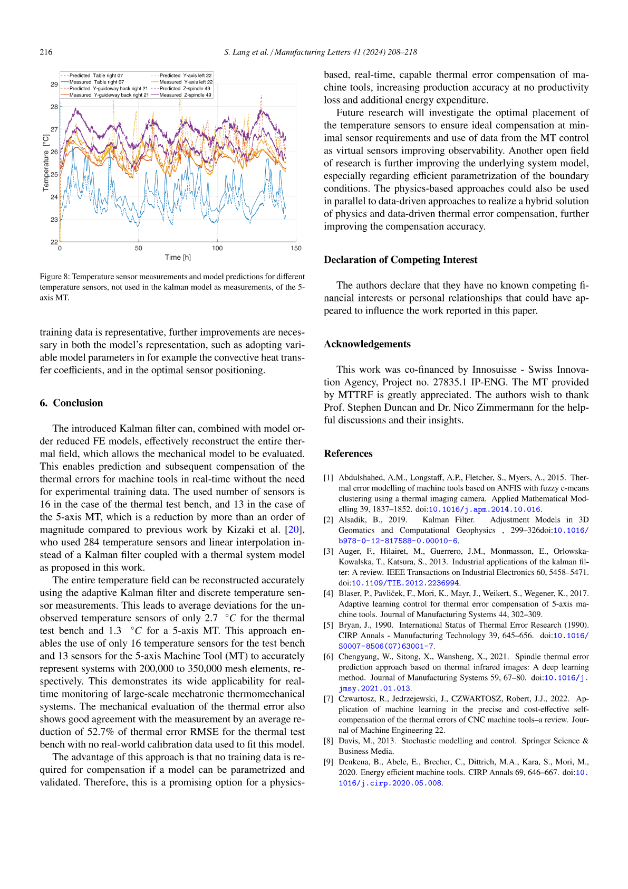

---

## 6. X・Y・Z方向の熱変位比較

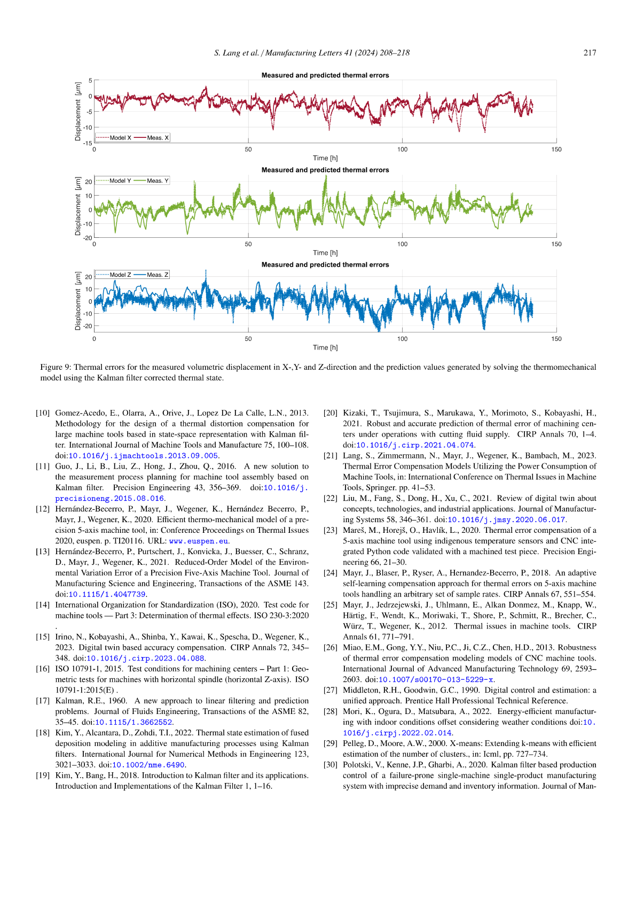

- 3軸すべてにおいて補償後の残差が大幅に低減
- 様々な熱負荷サイクルに対して安定して動作

---

## 7. 参考文献リスト

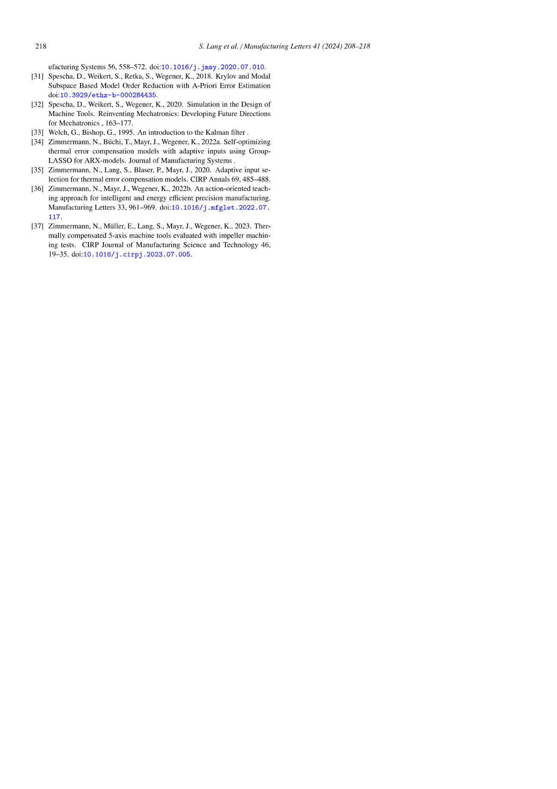

---

## 8. 論文の貢献まとめ

| 貢献 | 詳細 |
|---|---|
| 新規手法 | FEM デジタルツイン × カルマンフィルタによる状態オブザーバの構築 |
| データ効率 | キャリブレーション実験データが不要（モデルベース） |
| センサ削減 | 16センサ → 4センサで同等精度 |
| 精度 | 熱誤差の83%以上を補償、RMSE 2.1°C |
| 汎用性 | 試験台と実機5軸MTの両方で検証 |

---

## 9. 残された課題・限界

- カルマンフィルタは **線形モデルを前提**（$\mathbf{A},\mathbf{B},\mathbf{C}$ が定数）→ 温度依存材料特性などの非線形熱現象への対応が課題
- FEM モデルの精度がそのまま $\mathbf{Q}$ の設定に影響し、推定誤差を生む
- センサ配置（$\mathbf{C}$ の構造）は経験則に依存（→ 論文2で対応）
- 流体（クーラント・冷却風）の影響は未考慮
