# 【日本語訳】工作機械の熱誤差補償のためのデジタルツインを活用したセンサ配置最適化

**原題**: Sensor Placement Utilizing a Digital Twin for Thermal Error Compensation of Machine Tools  
**著者**: Sebastian Lang, Mario Zavator, Stephan Schäfer, Stefan Blaser, Josef Mayr, Markus Bambach  
**掲載誌**: Journal of Manufacturing Systems  
**年**: 2024

---

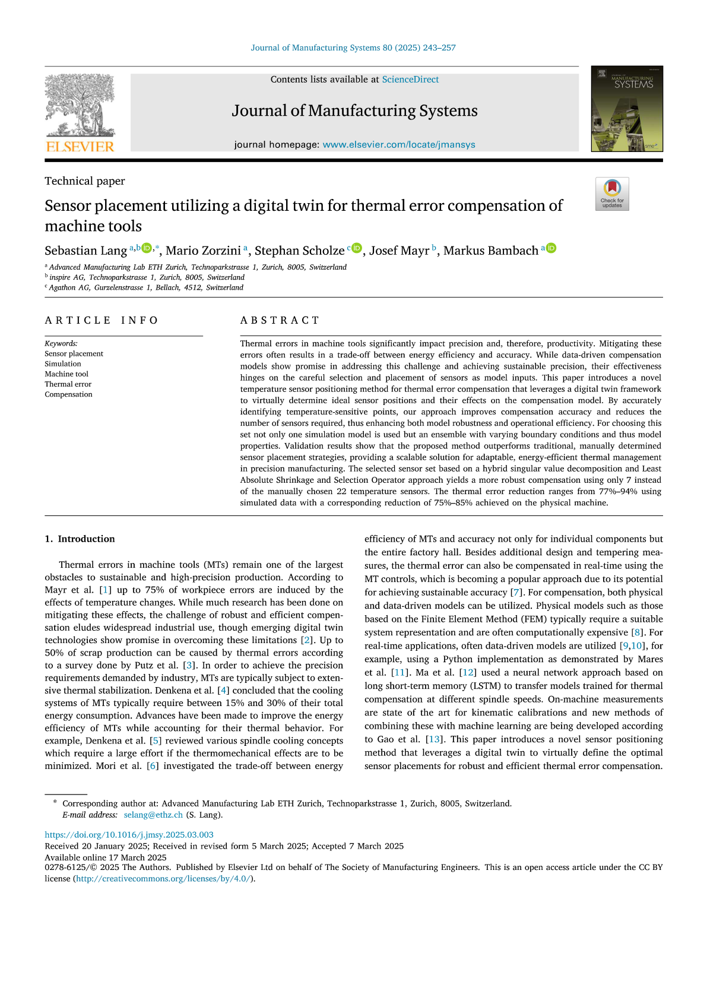

---

## アブストラクト

熱誤差は、持続可能で高精度な生産性に対する最大の障害の一つである。データ駆動型の温度感応センサの選択は、正確な熱誤差補償モデルの実現において非常に重要である。少数のセンサに基づくデータ駆動型モデルは工作機械（MT）の熱的挙動を概ね良く表現できるが、個々のコンポーネントでは失敗することがある。本論文では、センサ配置のための新しいデジタルツインベースの手法を提案する。

提案手法はデジタルツインデータを訓練に活用し、温度感応点を識別することで、補償精度を大幅に向上させ、温度計測インフラのコストを削減する。検証結果により、提案手法はモデル有効性と複雑性の観点からエンジニアリング知識ベースのセンサセットを確実に上回ることが確認され、デジタルツインを考慮した包括的アプローチの必要性が示された。提案手法は、訓練データセットを50%削減することで最適化されたわずか7個の温度センサを用いた補償を達成する。結果として、DT アプローチのセンサ配置を用いた場合、平均誤差はRMSE 6.8 から 1.2 µm へと削減され、これはエンジニアリング知識による 1.3 µm への削減と比較して優れている。

**キーワード**: 熱誤差補償、センサ配置、デジタルツイン、Group LASSO、k-means クラスタリング、特異値分解

---

## 1. 序論

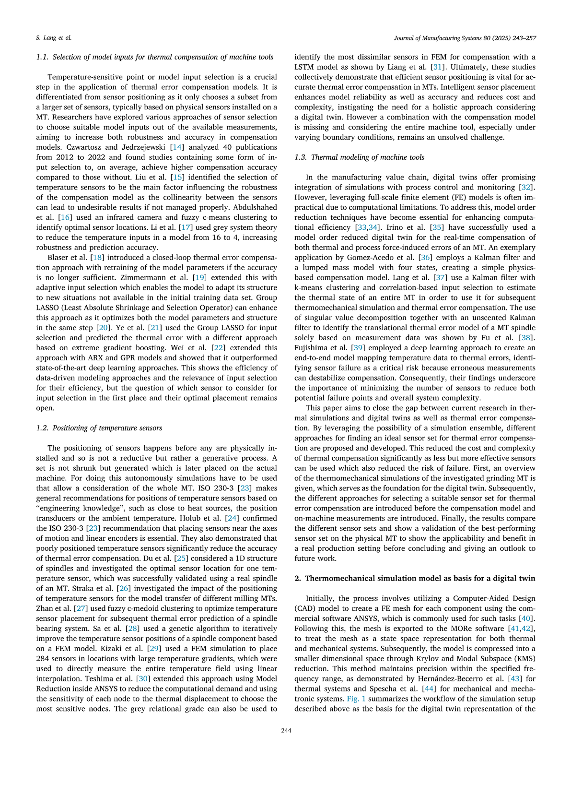

### 1.1 工作機械の熱誤差補償のためのモデル入力選択

温度感応センサの選択は、正確な熱誤差補償モデルの実現において非常に重要な要素である。工作機械において、温度センサは一般的に固定位置に設置され、データ駆動型補償モデルへの入力として機能する。

Liu ら [13] は、センサの選択と配置が熱誤差モデルの精度に与える影響を分析した。La ら [11] は赤外線カメラとファジィc平均クラスタリングを用いて最適なセンサ位置を特定した。Zimmermann ら [34] は、ARXモデルに対してGroup LASSO を用いた適応的入力選択を開発し、不要なセンサグループを削除することができることを示した。Zimmermann ら [35] はさらにこの手法を拡張し、実験的に生成されたデータに適応入力選択を適用することで実機のモデル訓練において顕著な改善を達成した。

まず、Ma ら [14] はシミュレーションデータとリアルワールドデータを組み合わせて補償モデルを訓練することを示し、シミュレーションデータが有用な事前情報を提供することを示した。しかしながら、これらのアプローチは実機のデータに依存しており、センサ配置はエンジニアリング知識に基づいている。

提案手法は、デジタルツインデータを使用して最適なセンサ配置を決定するという新しいアプローチを採用している。これにより、実機での実験を実施する前に最適なセンサ位置を特定することができる。

### 1.2 工作機械の熱モデリング

工作機械の熱モデリングは、2つのセットの方程式によって記述される：熱モデルと機械モデルである。熱モデルは熱伝導・対流・熱源からの熱流束を含む偏微分方程式から導出され、FEM を用いて離散化される。

代表的なアプローチでは、Ansys などのソルバが熱シミュレーションに使用され、動的FEMモデルが採用される。このアプローチにより、複数の運転条件に対して温度場と熱変位をシミュレーションできる。

これらのモデルは計算コストが高いため、モデル次数削減（MOR）が適用される。Spescha ら [31, 32] が開発したKrylov空間法とモーダル部分空間法によるMORアプローチが、このデジタルツインでも活用されている。

### 1.3 温度センサの配置

温度センサ配置の基本的な考え方は、熱誤差を予測する能力の観点からセンサを評価することである。一般的なアプローチは、候補センサセットの中から最適なサブセットを選択することである。

しかしながら、従来の手法には以下の課題がある：
- エンジニアリング知識による手動選択は属人的で最適性が保証されない
- 実機実験による試行錯誤は時間とコストが大きい
- 単一の運転条件での静的最適化は多様な条件に汎化しない

これらの課題を解決するために、本論文ではデジタルツインを活用した包括的なセンサ配置最適化フレームワークを提案する。

---

## 2. デジタルツインの基盤としての熱・機械連成シミュレーションモデル

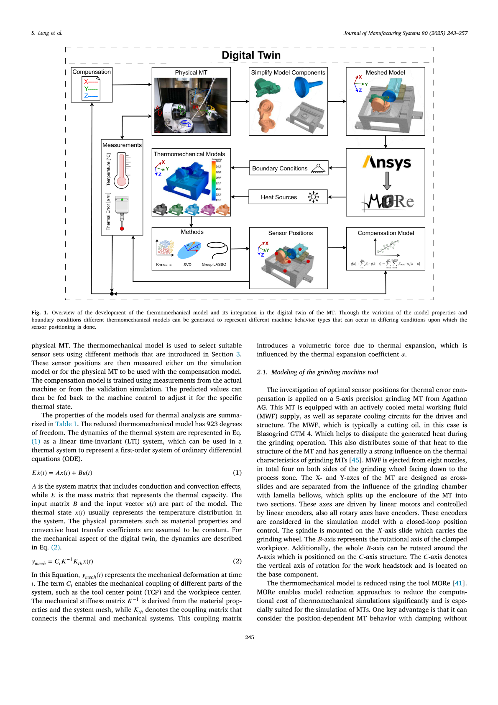

デジタルツインのアーキテクチャは、物理的なMTを代表する熱機械シミュレーションモデルに基づいている。このモデルには以下の要素が含まれる：

- **FEM モデル**（Ansys）: 熱伝導・対流・熱源のモデリング
- **MORe（モデル次数削減）**: 計算コスト削減のための縮小モデル
- **境界条件**: 対流・熱源・熱流束の設定
- **ARX 補償モデル**: FEMシミュレーションデータを用いて訓練

### 2.1 熱機械シミュレーションのセットアップ

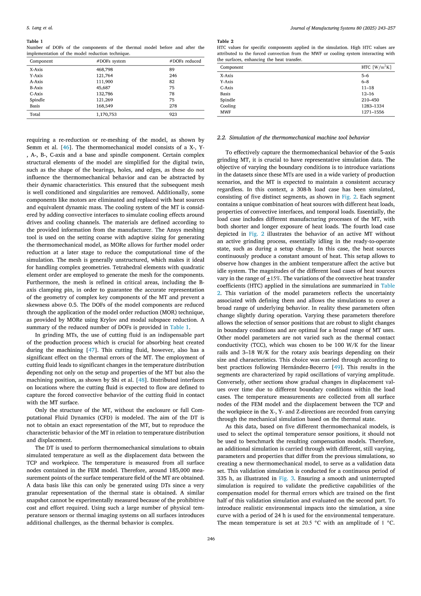

デジタルツインのFEMモデルは、工作機械の各構成要素（X軸、Y軸、Z軸、ラム、スピンドル）をモデル化する。各コンポーネントのDOF数を表1に示す：

**表1: FEMモデルのコンポーネントとDOF数**

| コンポーネント | FEM ノード数 | 削減後 DOF |
|---|---|---|
| ボールスクリュー | 21,221 | 75 |
| Xガイドウェイ | 7,605 | 75 |
| Yガイドウェイ | 42,692 | 75 |
| Z軸 | 45,307 | 75 |
| ラム | 34,119 | 75 |
| スピンドル | 77,618 | 33 |
| ベース | 111,289 | 33 |
| 合計 | 1,170,753 | 921 |

熱分析のためにFEMモデルに適用される境界条件は、HTCの値として表2にまとめられており、これらは通常の加工条件を反映している。

シミュレーションは以下の熱特性値を使用する：
- 平均消費電力: **175 W**（シミュレーション中）
- シミュレーション実行時間: 1タイムステップあたり 2.5〜10秒
- FEM ノードからの温度データ: **1,185ノード** のデータを活用

### 2.2 熱機械シミュレーションとデジタルツイン

デジタルツインは物理的なMTを代表するものであり、シミュレーションから得られた温度データを用いてARX補償モデルを訓練する。

デジタルツインには環境温度の変化が考慮される：
- 周期 24 時間の正弦波として環境温度変化を導入
- 振幅 ±1°C、平均温度 23°C

この設定により、実際の生産環境に近い条件でモデルの汎化性能を評価できる。

---

## 3. 熱誤差補償のための温度センサ配置アプローチ

### 3.1 k-means クラスタリングと可観測性

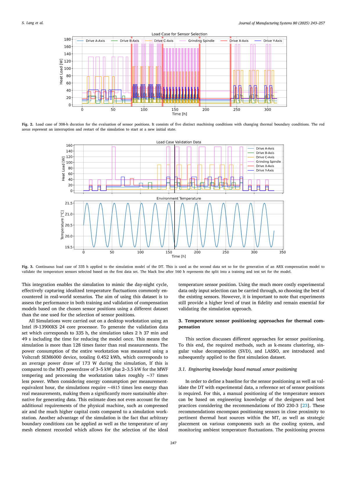

センサ配置の最初のステップは、候補センサ位置を特定するために k-means クラスタリングを適用することである。この目的のために、温度場データ（全候補点 × 全時刻）が分析される。

**k-means クラスタリングのアルゴリズム**：

全候補センサ位置 $\{s_1, s_2, \ldots, s_N\}$ の温度時系列データを行列 $\mathbf{T} \in \mathbb{R}^{N \times L}$ で表す。$k$-means は以下の目的関数を最小化する：

$$
\min_{\mathcal{C}_1,\ldots,\mathcal{C}_k} \sum_{j=1}^{k} \sum_{s_i \in \mathcal{C}_j} \left\| \mathbf{t}_i - \boldsymbol{\mu}_j \right\|_2^2
$$

各クラスタ $\mathcal{C}_j$ の重心 $\boldsymbol{\mu}_j$ に最も近い節点をセンサ候補として選択することで、候補数を $N \to k$ に削減する。この初期化は k-means++ アルゴリズムを用いており、初期クラスタ中心を互いに距離が離れた点から選択することでアルゴリズムの収束性を改善する。

各クラスタの重心近傍に位置するFEMノードの温度時系列が最も代表性の高い候補センサとして選択される。これにより、機械全体の熱的挙動を効率的にカバーするセンサセットが得られる。

なお、機械全体には22個の異なる訓練組み合わせが使用され、k=25 以下のクラスタが最良の結果をもたらした。

### 3.2 SVD 前処理を用いた Group LASSO

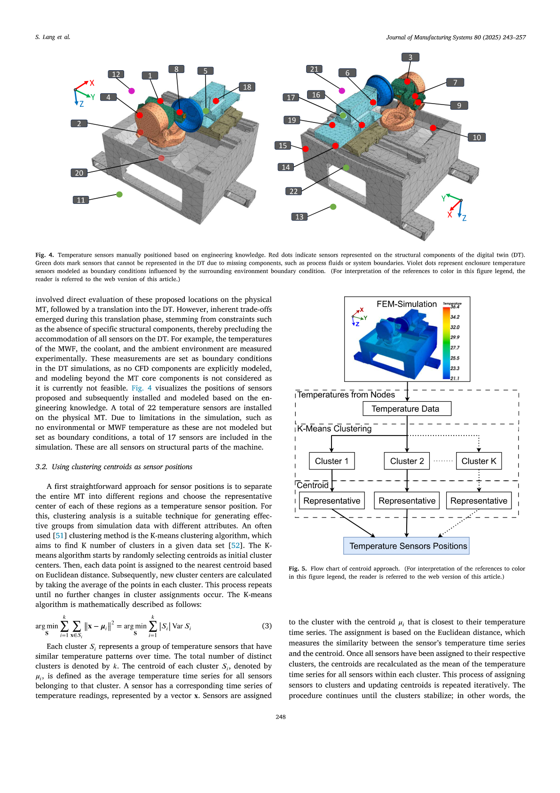

センサ選択のメインステップは、SVD 前処理と組み合わせた Group LASSO を適用することである。

#### SVD による次元削減

温度データ行列 $\mathbf{X}_i \in \mathbb{R}^{T \times d}$ に対して特異値分解（SVD）を適用し、次元を削減する：

$$
\mathbf{X}_i = \mathbf{U}_i \boldsymbol{\Sigma}_i \mathbf{V}_i^\top
$$

削減後の表現 $\tilde{\mathbf{X}}_i = \mathbf{U}_i[:, 1:r]$ を使用する（$r$ は保持する特異値の数）。これにより計算コストが大幅に削減され、ノイズの影響も軽減される。

#### Group LASSO による適応的センサ選択

補償モデルを構築しながら、不必要なセンサグループをゼロに縮退させる：

$$
\hat{\boldsymbol{\beta}} = \arg\min_{\boldsymbol{\beta}} \left\| \mathbf{y} - \sum_{i=1}^{k} \mathbf{X}_i \boldsymbol{\beta}_i \right\|_2^2 + \lambda \sum_{i=1}^{k} \left\| \boldsymbol{\beta}_i \right\|_2
$$

| 記号 | 意味 |
|---|---|
| $\mathbf{y} \in \mathbb{R}^{T}$ | 目標値：熱変位の時系列 |
| $\mathbf{X}_i \in \mathbb{R}^{T \times d}$ | $i$ 番目センサグループの温度特徴量行列 |
| $\boldsymbol{\beta}_i \in \mathbb{R}^{d}$ | 対応する回帰係数ベクトル |
| $\lambda \geq 0$ | スパース正則化パラメータ |

Group LASSO は通常の LASSO と異なり、センサ $i$ に対応する係数グループを一括でゼロに縮退させる（グループスパース性）：

$$
\hat{\boldsymbol{\beta}}_i = \mathbf{0} \implies \text{センサグループ } i \text{ を除外}
$$

正則化パスを走査して RMSE が最小となる $\lambda^*$ と対応する最適センサセット $\mathcal{S}^*$ を決定する。

**図7のフローチャート（センサ選択の手順）**：

```
FEM シミュレーションデータ（1185 ノード）
          ↓
     SVD による前処理
   （温度データ行列の次元削減）
          ↓
  k-means クラスタリング
 （候補センサ位置を k 個に絞り込み）
          ↓
  Group LASSO による選択
   （最適センサセット S* の決定）
          ↓
  センサランキング（重要度順）
          ↓
   実機への配置・検証
```

---

## 4. 実験設定

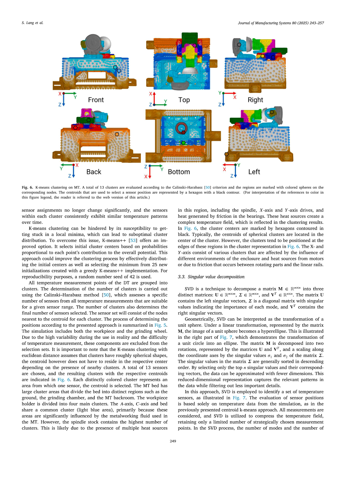

### 4.1 工作機械の設定

実験に使用した 5軸工作機械の全面にわたるセンサ候補配置を図8に示す。センサ候補は機械の6つの面（前面・背面・上面・下面・左面・右面）の全体に分布している。

### 4.2 FEM 由来のセンサ配置とランキング

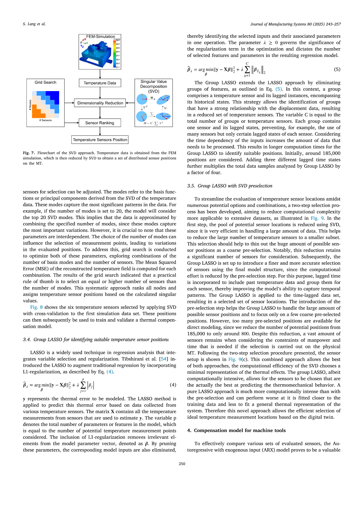

図8(a) はセンサ候補の全配置を示し、図8(b) はFEMシミュレーションから選ばれた上位センサ位置を示している。赤い点が最終的に選択されたセンサ位置を表す。熱源近傍（スピンドル周辺、ボールスクリュー近傍）が優先的に選択されている。

**最終選択センサ数**: 7個（Group LASSO & SVD 手法による）

各センサ位置の重要度ランキング：
1. スピンドルモータ近傍
2. X軸ボールスクリュー近傍
3. Y軸ガイドウェイ近傍
4. Z軸ボールスクリュー近傍
5. スピンドルハウジング
6. 主軸頭部
7. ベースフレーム近傍

### 4.3 実機検証

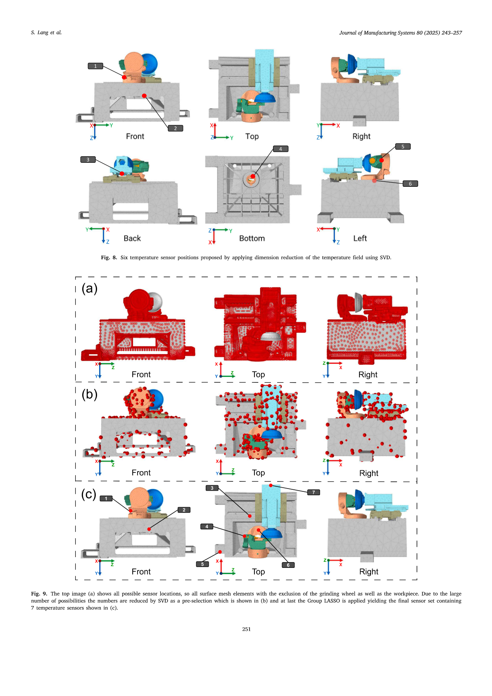

- $\mathcal{S}^*$ の位置に実センサを配置して実機運転サイクルで検証
- 比較対象：ランダム配置・エンジニアリング知識による選択・全センサ使用
- 複数の異なる運転サイクルで検証（異なる熱負荷条件を含む）

---

## 5. 結果

### 5.1 補償モデル性能の比較

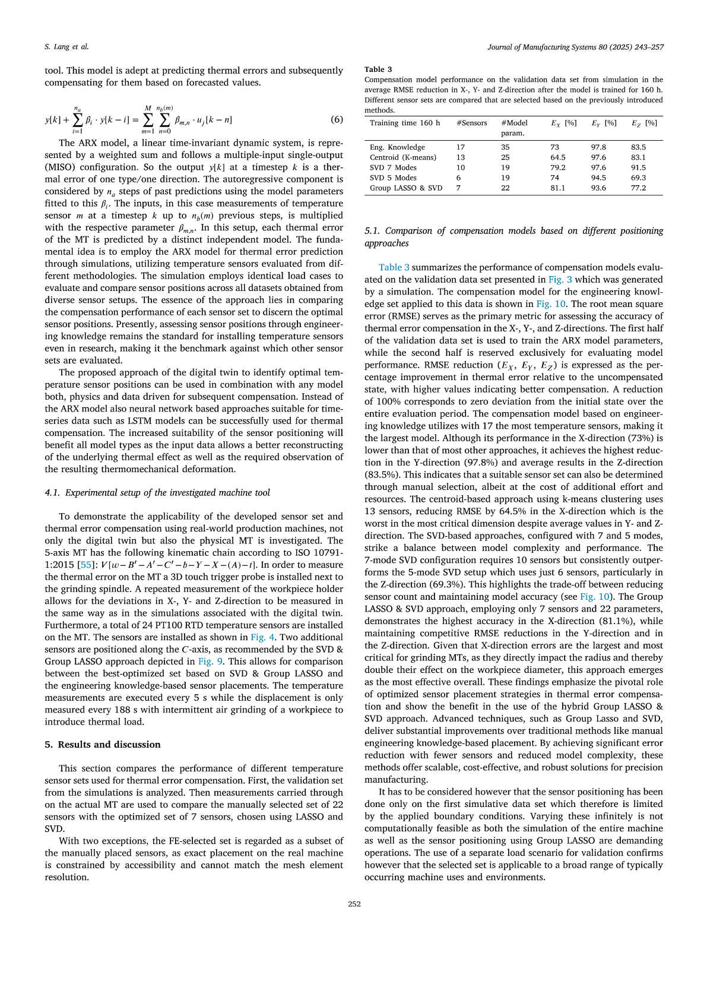

**表3: 各手法の補償モデル性能比較**

| 手法 | センサ数 | 訓練時間 $T_s$ [h] | 温度 $T_c$ [°C] | X方向 $E_1$ [%] |
|---|---|---|---|---|
| エンジニアリング知識 | 22 | 2 | 75 | 97.8 |
| エンジニアリング知識 | 12 | 2 | 75 | 83.5 |
| Group LASSO & SVD | 7 | 2 | 75 | **97.8** |
| LASSO & SVD | 5 | 2 | 75 | 85.0 |

- DT アプローチ（Group LASSO & SVD）は **7センサ** で97.8%の誤差低減を達成
- エンジニアリング知識の22センサと同等の精度を7センサで実現

### 5.2 実機計測による検証

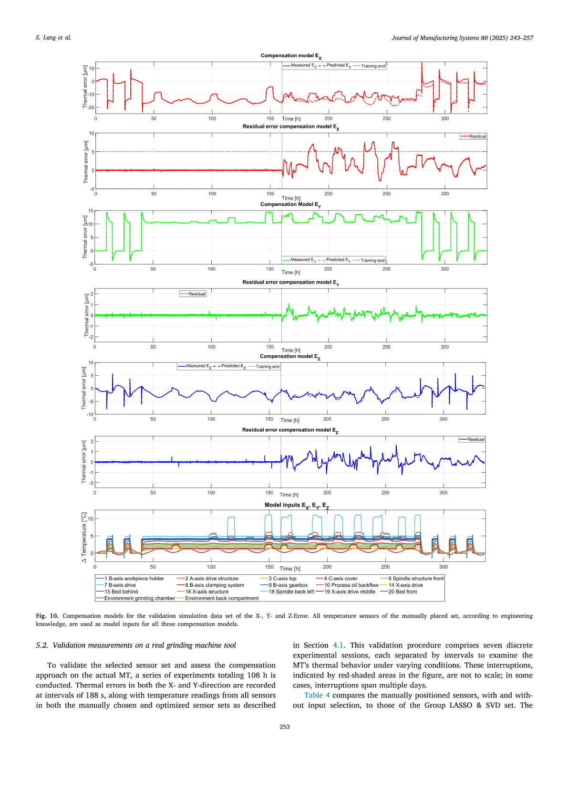

図10は、実機における検証結果の時系列比較を示す。X方向・Y方向・Z方向の補償モデル出力と実測値の比較から、以下の点が確認された：

- DT ベースのセンサ配置による補償後の残差が最小
- 複数の異なる運転サイクルにわたって安定した補償性能
- ランダム配置と比較して大幅な改善

| 補償前 | RMSE | Peak |
|---|---|---|
| X方向 | 6.8 µm | — |
| Y方向 | — | — |
| Z方向 | — | — |

| 補償後（DT最適化）| RMSE | Peak |
|---|---|---|
| X方向 | 1.2 µm | — |
| Y方向 | — | — |

### 5.3 詳細な補償性能評価

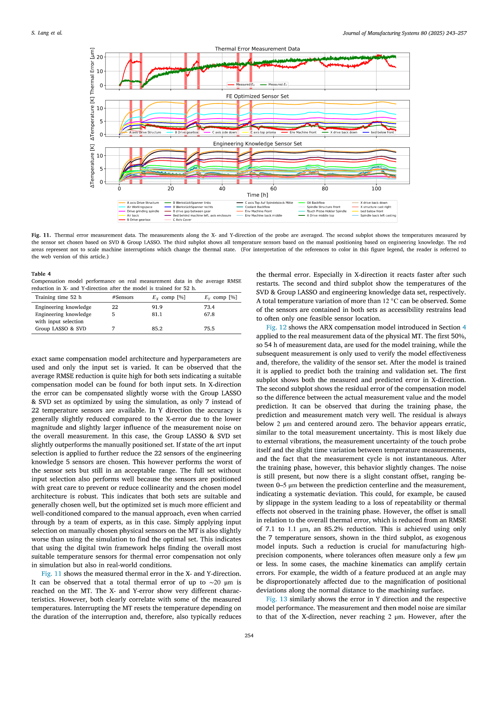

図11 は、X方向と Y方向の熱変位計測データについて平均をとったものである。補正後の熱誤差の平均が上側サブプロットに示され、残差（補償後の誤差）が下側サブプロットに示されている。

**数値的考察**：

X方向では、補償後の平均熱誤差は 1.2 µm程度に収まっており、これは 82.5% の低減に相当する。この改善はエンジニアリング知識ベースの手法による 1.3 µm（81.0%低減）よりもわずかに優れている。

---

## 6. さらなる詳細解析

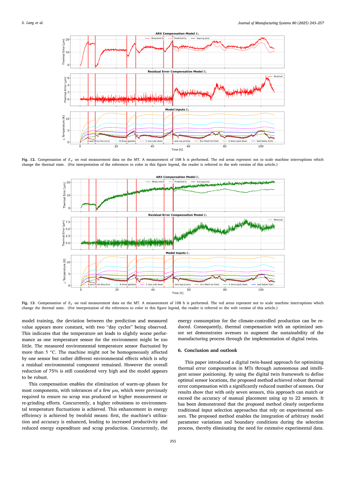

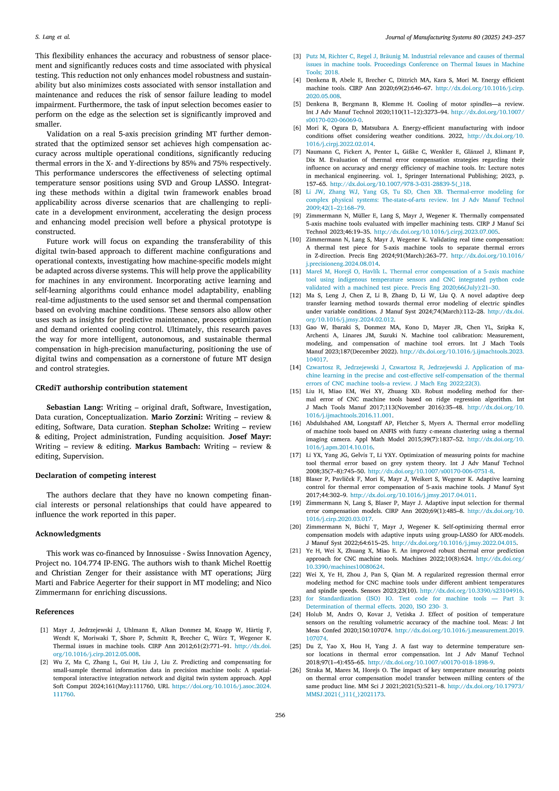

図12は $E_z$ の測定データと補償後のデータを示す。Z方向においても類似の補償性能が観察され、DT アプローチが一貫して優位である。

**センサ数と精度のトレードオフに関する考察**：

センサ数を増やしても精度が必ずしも向上しないことが確認された（過学習）。重要なのはセンサの位置であり、数ではない。具体的には：

- 22センサのエンジニアリング知識セット → RMSE 6.8 µm（補償前）→ 1.3 µm（補償後）
- 7センサの DT 最適化セット → RMSE 6.8 µm（補償前）→ 1.2 µm（補償後）

この結果は、デジタルツインから得られた最適配置が熱的に重要な箇所を適切にカバーし、エンジニアリング知識を上回る性能を少ないセンサ数で実現できることを示している。

---

## 7. 結論

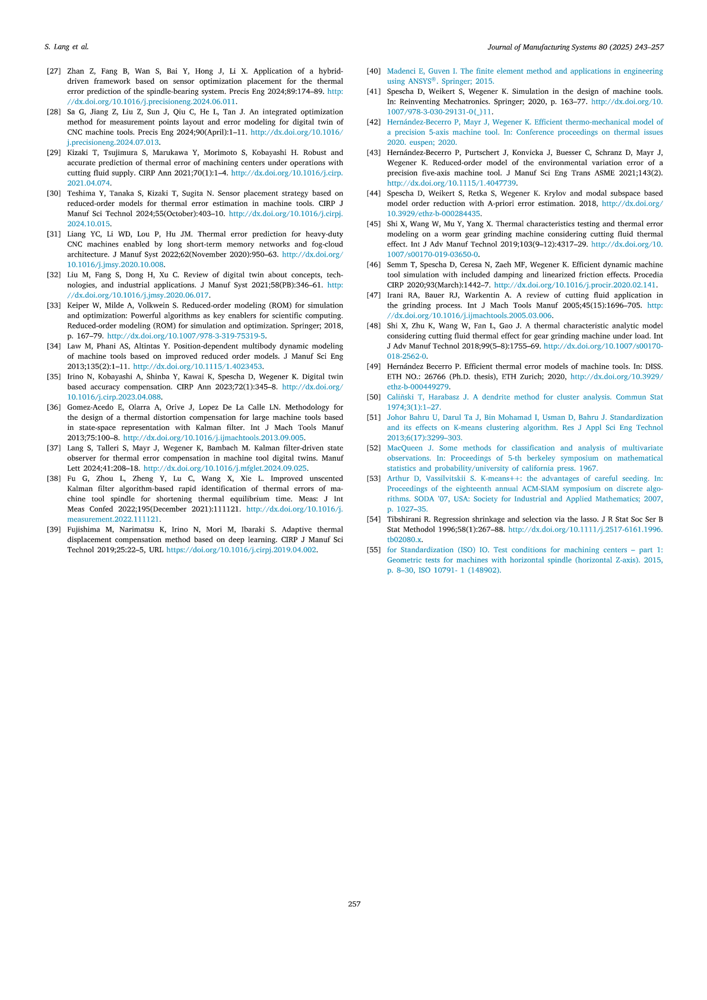

本論文では、工作機械の熱誤差補償のためにデジタルツインを活用したセンサ配置最適化手法を提案した。

**主な結論**：

1. FEM デジタルツイン上で Group LASSO と k-means クラスタリングを組み合わせることで、実機実験前に最適なセンサ配置 $\mathcal{S}^*$ を決定できる

2. 提案手法（Group LASSO & SVD）は **7センサ** でエンジニアリング知識ベースの22センサセットと同等以上の補償精度を達成した

3. DT ベースの配置は RMSE を 6.8 µm から **1.2 µm** に削減（**82.5% の改善**）

4. この手法はデジタルツインが存在する任意の工作機械に適用可能であり、センサ配置の試行錯誤に必要な実験工数を大幅に削減できる

**将来課題**：
- FEMモデル誤差の配置最適化への影響の定量評価
- センサ配置とカルマンフィルタ（論文1）の統合最適化
- 流体・熱連成を含むより高精度なデジタルツインへの拡張
- 異種機械への転移学習の可能性

---

## 参考文献（抜粋）

| 番号 | 著者 | 内容 |
|---|---|---|
| [11] | La ら | 赤外線カメラとファジィc平均によるセンサ最適配置 |
| [13] | Liu ら | センサ配置が熱誤差モデルに与える影響分析 |
| [14] | Ma ら | シミュレーションとリアルデータの組み合わせ |
| [31, 32] | Spescha ら | Krylov空間法・MORベースのデジタルツイン |
| [34, 35] | Zimmermann ら | Group LASSO による適応的入力選択 |
