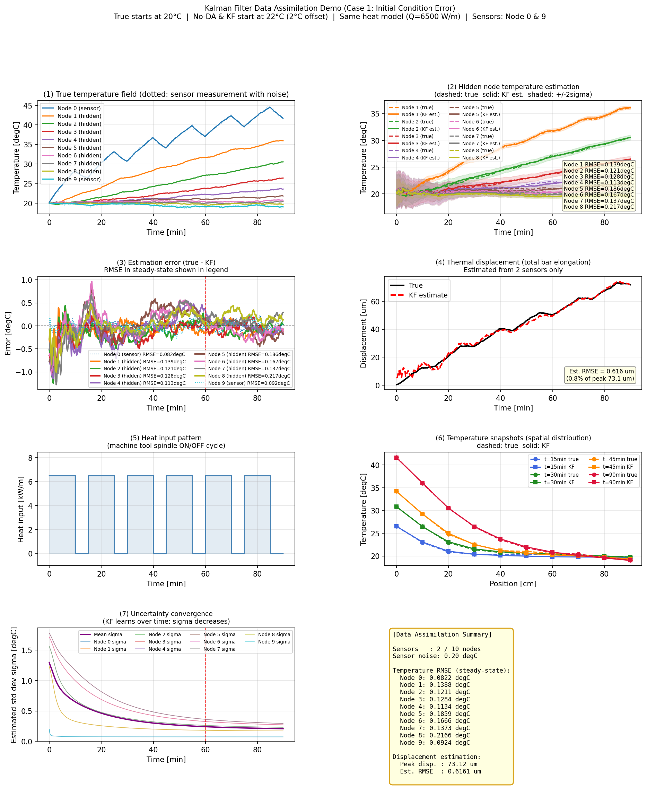
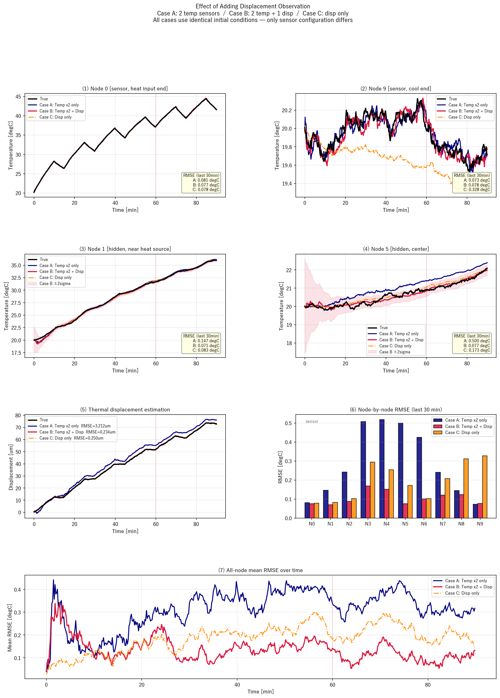

# 2つの温度センサから熱棒全体の温度を推定する

## この記事を読んでほしい人

この記事は、次のような人に向けて書いています。

- データ同化やカルマンフィルタを、実際の物理モデルと結びつけて理解したい人
- 温度センサが少ない状況で、測っていない場所の温度を推定したい人
- 工作機械や構造物の熱変形を、限られたセンサ情報から補償したい人
- 「モデルだけの予測」と「実測値で補正する推定」の違いをグラフで見たい人
- 数式だけでなく、Pythonプログラムのどこに対応しているかまで確認したい人

## 読むと何が分かるのか

この記事を読むと、次のことが分かります。

- 2つの温度センサだけで、10節点の温度分布をどう推定するか
- データ同化を使わない場合、熱伝導モデルだけではどのようにずれるか
- カルマンフィルタが、モデル予測とセンサ観測をどのように混ぜるか
- 「真値」「モデルのみ」「データ同化あり」の違い
- 熱変位の推定に、内部温度の推定精度がなぜ効くのか
- 変位センサなどを追加すると、推定がどう発展するか

## 対象とする課題

工作機械や構造物では、温度変化によって部材が伸び縮みします。これが加工精度や位置決め精度に影響します。

本当は部材全体の温度分布が分かればよいのですが、現実には全ての場所にセンサを置くことはできません。今回の例では、1次元の熱棒を10個の節点に分け、温度センサは両端の2点だけに置きます。

```text
Sensor                                      Sensor
 Node 0   Node 1   Node 2   ...   Node 8   Node 9
  [S]------[ ]------[ ]-------------[ ]------[S]
   ↑
 heat input
```

知りたいのは、センサがない `Node 1` から `Node 8` の温度です。さらに、全節点の温度上昇から熱変位も計算します。

今回の課題はこうです。

> 両端2点の温度センサだけを使って、10節点の温度分布と熱変位をどこまで推定できるか。

## 使った手法

使った手法は、**1次元熱伝導モデル + 線形カルマンフィルタ**です。

熱伝導モデルは、「熱が隣の節点へ伝わる」「端部から外気へ逃げる」「左端に熱入力が入る」という物理を表します。

カルマンフィルタは、次の2つを組み合わせます。

- モデルによる予測
- センサによる観測

モデルだけでは、発熱量や境界条件の見積もりがずれると予測もずれます。一方で、センサ値だけでは測っていない内部節点は分かりません。カルマンフィルタは、この2つを確率的に重み付けして、全節点の温度を推定します。

## 手法の位置づけ

今回の手法は、いわば「物理モデルをベースに、少数の実測データで補正する方法」です。

分類すると、次のような位置づけになります。

| 方法 | 特徴 |
|---|---|
| センサ値だけを見る | 測った場所しか分からない |
| 熱伝導モデルだけで予測する | 全体は計算できるが、モデル誤差に弱い |
| データ同化 | モデルで全体を予測し、センサで補正する |
| 機械学習モデル | 大量データがあれば強いが、物理的な解釈が難しい場合がある |

今回のデータ同化は、物理モデルを捨てずに使うのがポイントです。センサが少なくても、熱伝導方程式が「隣接節点は急には無関係に変化しない」という拘束を与えてくれます。

## 熱伝導モデルの理論

1次元熱伝導は、連続系では次のように書けます。

$$
\frac{\partial T}{\partial t}
= \alpha \frac{\partial^2 T}{\partial x^2}
$$

ここで、`T` は温度、`alpha` は熱拡散率です。

これを10個の節点に離散化します。内部節点 `i` では、温度変化は左右の節点との差で決まります。

$$
\frac{dT_i}{dt}
= \frac{\alpha}{\Delta x^2}
\left(T_{i-1} - 2T_i + T_{i+1}\right)
$$

端部では、隣接節点からの熱伝導に加えて、外気への対流放熱を入れます。左端 `Node 0` には熱入力も入れます。

この連続時間モデルを行列で書くと、

$$
\dot{x} = A_c x + B_c u
$$

です。

プログラムでは、前進オイラー法で離散化しています。

$$
x_{k+1} = A_d x_k + B_d u_k
$$

$$
A_d = I + A_c \Delta t
$$

$$
B_d = B_c \Delta t
$$

対応するコードは [thermal_model.py](../thermal_model.py) です。

```python
A_d = np.eye(self.n) + self.A_c * self.dt
B_d = self.B_c * self.dt
```

1ステップ進める処理は次です。

```python
x_next = self.A_d @ x + self.B_d @ u
```

今回のシミュレーションでは、真値側には小さな外乱も加えています。

```python
if noise_std > 0.0:
    x_next = x_next + np.random.randn(self.n) * noise_std
```

## カルマンフィルタの理論

カルマンフィルタでは、状態方程式と観測方程式を使います。

状態方程式:

$$
x_{k+1} = A x_k + B u_k + w_k
$$

観測方程式:

$$
y_k = H x_k + v_k
$$

今回の状態 `x` は、10節点の温度です。

```text
x = [T0, T1, T2, ..., T9]^T
```

観測 `y` は、センサがある `Node 0` と `Node 9` の温度だけです。

```text
y = [T0_sensor, T9_sensor]^T
```

したがって観測行列 `H` は、10個の状態から0番目と9番目だけを取り出す行列になります。

```python
SENSOR_NODES = [0, N_NODES - 1]  # [0, 9]

H = np.zeros((len(SENSOR_NODES), N_NODES))
for i, node in enumerate(SENSOR_NODES):
    H[i, node] = 1.0
```

カルマンフィルタは、まずモデルで予測します。

$$
\hat{x}_k^- = A \hat{x}_{k-1} + B u_{k-1}
$$

$$
P_k^- = A P_{k-1} A^T + Q
$$

次に、センサ値で補正します。

$$
K_k =
P_k^- H^T
\left(H P_k^- H^T + R\right)^{-1}
$$

$$
\hat{x}_k =
\hat{x}_k^- + K_k
\left(y_k - H\hat{x}_k^-\right)
$$

対応するコードは [kalman_filter.py](../kalman_filter.py) です。

```python
self.x = self.A @ self.x + self.B @ u
self.P = self.A @ self.P @ self.A.T + self.Q
```

```python
S = self.H @ self.P @ self.H.T + self.R
K = self.P @ self.H.T @ np.linalg.inv(S)
innov = y - self.H @ self.x
self.x = self.x + K @ innov
```

`innov` は「予測したセンサ値」と「実際のセンサ値」の差です。つまり、モデル予測のずれです。カルマンフィルタはこのずれを使って、センサのない節点も含めた全体の温度を補正します。

## True、Model only、DA の意味

今回の比較グラフには、主に3つの線が出ます。

| 表記 | 意味 |
|---|---|
| `True` | シミュレーション上の答え合わせ用の真値 |
| `Model only (no DA)` | センサ補正なしで、熱伝導モデルだけで予測した結果 |
| `Kalman filter (DA)` | 熱伝導モデルで予測し、2点センサで補正した結果 |

ここで注意が必要なのは、`True` は現実実験で直接分かるものではない、という点です。今回はシミュレーションなので、答え合わせ用に「真の熱棒」をコンピュータ内で作っています。

```python
x_true = model.step(x_true, u_true, noise_std=PROC_NOISE_STD)
true_T[k] = x_true
```

その `true_T` から、センサ位置だけを取り出して観測値を作ります。

```python
y = H @ x_true + np.random.randn(len(SENSOR_NODES)) * OBS_NOISE_STD
```

現実では、未観測節点の `True` は分かりません。現実で妥当性を確認するには、高密度センサの検証実験、赤外線カメラ、詳細FEMなどを参照解として使う必要があります。

## 今回つまずきやすかった疑問

ここは、今回実際に疑問として出てきた大事な点を、少し丁寧に整理します。

### Q1. `True` とは何か

`results_compare_da.png` の `(1) Node 1 hidden temperature` などに出てくる `True` は、センサで測った値ではありません。

`True` は、シミュレーション上で「これを本当の熱棒の温度変化だったことにしよう」として作った、答え合わせ用の温度です。

プログラムでは、次のように作っています。

```python
x_true = model.step(x_true, u_true, noise_std=PROC_NOISE_STD)
true_T[k] = x_true
```

つまり、熱伝導モデルを使って温度を進め、そこに小さな外乱を足したものを `true_T` としています。

現実の実験では、センサがない `Node 1` や `Node 5` の真の温度は分かりません。だから `True` は、現実の実測値ではなく、シミュレーションだから用意できる「正解データ」です。

### Q2. どうやって「真の熱棒の温度」を作ったのか

今回の「真の熱棒」は、実験から得たものではありません。コンピュータの中で、熱伝導方程式を使って作っています。

熱棒は10個の節点に分けています。各ステップで、次のような計算をします。

```text
次の温度
= 熱伝導で隣の節点へ熱が伝わった結果
+ 左端から入る熱入力の影響
+ 端部から外気へ逃げる熱の影響
+ 小さなランダム外乱
```

コードでは、この部分です。

```python
x_next = self.A_d @ x + self.B_d @ u
if noise_std > 0.0:
    x_next = x_next + np.random.randn(self.n) * noise_std
```

ここで `A_d @ x` は、現在の温度分布が熱伝導によって次の時刻へ進む部分です。`B_d @ u` は、熱入力の影響です。最後のランダム項は、現実の外乱やモデル化しきれない揺らぎを簡単に表したものです。

つまり `True` は、実験で直接分かったものではなく、**正しい条件で熱伝導モデルを回した仮想的な正解**です。

### Q3. `Model only (no DA)` も熱伝導方程式を使った結果ではないのか

はい、その理解で合っています。

`Model only (no DA)` は、熱伝導方程式を使った予測です。ただし、センサ値による補正を一切行いません。

今回の比較では、差を分かりやすくするために、`Model only` 側には少し間違った条件を入れています。

```python
MODEL_INPUT_SCALE = 0.90
u_model = np.array([u_series[k] * MODEL_INPUT_SCALE])
```

これは、推定側のモデルが発熱量を10%低く見積もっている、という意味です。

したがって比較の構図はこうです。

```text
True:
  正しい熱入力で作った仮想的な真値

Model only:
  10%低く見積もった熱入力で、熱伝導モデルだけを進めた結果

Kalman filter:
  10%低く見積もった熱入力で予測しつつ、
  Node 0 と Node 9 のセンサ値で補正した結果
```

つまり、`Model only` も熱伝導方程式の結果です。ただし、現実にありがちな「入力条件や境界条件の見積もり誤差」を持った、不完全なモデルの結果として扱っています。

### Q4. なぜわざと違う条件を入れるのか

もし `True` と `Model only` にまったく同じ熱モデル、同じ熱入力、同じ境界条件を使うと、両者はかなり近くなります。そうすると、データ同化のありがたみが見えにくくなります。

しかし現実では、モデル条件を完全には知ることができません。

例えば工作機械では、次のような不確かさがあります。

- 主軸やモータの実際の発熱量
- 冷却風や周囲温度の変化
- 対流熱伝達率
- 材料物性
- 接触熱抵抗
- 機械内部の熱流路

そのため、熱伝導方程式を使っていても、モデルだけでは温度予測がずれます。

今回の `MODEL_INPUT_SCALE = 0.90` は、そのような現実のモデル誤差を簡単に再現するための設定です。あえて少し間違ったモデルを使い、そこにセンサ値を入れることで、データ同化がどのように補正するかを見ています。

### Q5. データ同化を使えば、すべての節点で必ず正しい答えに近づくのか

ここは慎重に言う必要があります。

データ同化を使うと、多くの場合、モデルだけの予測より正しい温度分布に近づきやすくなります。しかし、**すべての節点で必ず改善する**とは限りません。

理由は、センサが2点しかないからです。

今回の設定では、センサは `Node 0` と `Node 9` にあります。両端に近い節点はセンサ情報の影響を受けやすいですが、中央付近の節点は、2点センサだけでは補正しきれない場合があります。

今回の比較結果でも、センサ節点の近くでは改善が大きく、中央付近では改善が弱くなる様子が見えます。

したがって、正確な言い方は次のようになります。

> データ同化により、限られた温度センサ情報を熱伝導モデルに反映し、モデルだけの場合より未観測節点の温度推定精度を改善できる可能性がある。ただし改善量は、センサ配置、センサ数、モデル誤差、ノイズ設定に依存する。

### Q6. 現実では `True` が分からないなら、どう評価するのか

現実では、未観測点の真温度は基本的に分かりません。だから、シミュレーションのように全節点で `True` と比較することはできません。

現実で評価するには、次のような方法を使います。

- 検証実験では一時的にセンサを増やして、推定値と比較する
- 赤外線カメラで表面温度分布を測る
- 詳細なFEMやCFD解析を参照解として使う
- 一部のセンサを推定には使わず、検証用に残す
- 最終的な熱変位や加工誤差が改善したかで評価する

つまり、シミュレーションでは `True` と直接比較して手法の性質を確認し、実機では別の測定や性能指標で妥当性を確認します。

## なぜ Model only にわざと誤差を入れたのか

`main_compare_da.py` では、比較を分かりやすくするために、推定側のモデルに熱入力を10%低く見積もる誤差を入れています。

```python
MODEL_INPUT_SCALE = 0.90
u_model = np.array([u_series[k] * MODEL_INPUT_SCALE])
```

これは「ずる」ではなく、現実でよく起きる状況を簡単に表しています。

現実では、次の値を完全には知ることができません。

- 実際の発熱量
- 対流熱伝達率
- 周囲温度の変化
- 材料物性
- 接触条件や境界条件

そのため、熱伝導方程式を使っていても、モデルだけではずれます。データ同化の役割は、このモデル誤差をセンサ値で補正することです。

今回の比較は、次の構図です。

```text
True:
  正しい熱入力 + 小さな外乱で作った仮想的な真値

Model only:
  10%低く見積もった熱入力で、熱伝導モデルだけを進めた結果

Kalman filter:
  10%低く見積もった熱入力で予測しつつ、
  Node 0 と Node 9 のセンサ値で補正した結果
```

## 得られた結果

### 基本デモ

`main.py` では、10節点モデルに対して、両端2点のセンサを使って全節点温度を推定しました。



定常域のRMSEは次の通りです。

| 節点 | 種別 | RMSE [degC] |
|---:|---|---:|
| Node 0 | センサ節点 | 0.0823 |
| Node 1 | 未観測節点 | 0.1295 |
| Node 2 | 未観測節点 | 0.1069 |
| Node 3 | 未観測節点 | 0.1159 |
| Node 4 | 未観測節点 | 0.1262 |
| Node 5 | 未観測節点 | 0.1787 |
| Node 6 | 未観測節点 | 0.1353 |
| Node 7 | 未観測節点 | 0.1604 |
| Node 8 | 未観測節点 | 0.2296 |
| Node 9 | センサ節点 | 0.0925 |

熱変位推定RMSEは **0.6380 um** でした。

### データ同化あり/なしの比較

`main_compare_da.py` では、モデルだけの場合と、データ同化を行った場合を比較しました。


結果は次の通りです。

| ケース | Node 0 | Node 1 | Node 2 | Node 3 | Node 4 | Node 5 | Node 6 | Node 7 | Node 8 | Node 9 | 変位 [um] |
|---|---:|---:|---:|---:|---:|---:|---:|---:|---:|---:|---:|
| Model only (no DA) | 2.3984 | 1.5419 | 1.0168 | 0.6498 | 0.4246 | 0.2284 | 0.0869 | 0.1479 | 0.1790 | 0.1779 | 7.6333 |
| Kalman filter (DA) | 0.1051 | 0.5571 | 0.8033 | 0.8889 | 0.8031 | 0.7444 | 0.6117 | 0.2270 | 0.1238 | 0.0925 | 5.3642 |

この結果から、次のことが分かります。

- センサ節点の近くでは、データ同化により大きく改善する
- モデル誤差がある場合、モデルだけの予測は大きくずれる
- ただし、2点センサだけでは中央付近を完全には補正しきれない
- 「データ同化すれば全節点で必ず良くなる」ではなく、「センサ配置とモデル誤差に依存する」

この点は重要です。データ同化は魔法ではありません。センサ情報が届きにくい場所では改善が弱くなることがあります。逆に言えば、センサ配置を設計する余地があります。

### 変位観測を追加した比較

`main_disp_obs.py` では、温度センサ2点に加えて、棒全体の熱変位を観測に入れるケースも試しました。



結果は次の通りです。

| ケース | 未観測平均 RMSE [degC] | 最大 RMSE [degC] | 変位 RMSE [um] |
|---|---:|---:|---:|
| 温度2点のみ | 0.3413 | 0.5191 | 3.2121 |
| 温度2点 + 変位1点 | 0.1130 | 0.1691 | 0.2339 |
| 変位1点のみ | 0.1914 | 0.3116 | 0.2497 |

変位は全節点温度の和に関係します。そのため、変位観測を入れると「全体として温度がどれくらい上がっているか」という情報が追加されます。10節点のように未観測節点が多い場合、この情報はかなり効きます。

## 応用できること

今回の例は単純な1次元熱棒ですが、考え方はより現実的な問題に広げられます。

### 工作機械の熱変位補償

工作機械では、主軸や送り軸、ベッドの温度変化によって工具先端位置がずれます。全ての場所に温度センサを置くのは難しいため、少数センサとFEMモデルを組み合わせて熱変位を推定できます。

### 構造物や設備の状態推定

橋梁、配管、熱交換器、炉、半導体製造装置などでも、センサは限られます。物理モデルとセンサ値を組み合わせることで、測っていない場所の状態を推定できます。

### センサ配置の最適化

今回、両端2点センサでは中央付近の補正が弱くなることが分かりました。これは、センサ配置を最適化する問題につながります。

例えば次の問いが考えられます。

- `Node 0` と `Node 9` より、`Node 0` と `Node 5` の方が良いか
- 3点置けるなら、どこに置くべきか
- 温度センサと変位センサを組み合わせるなら、どの構成が良いか

### 2次元・3次元FEMへの拡張

今回のモデルは1次元10節点ですが、状態ベクトルを2次元や3次元FEMの節点温度にすれば、より現実的な熱分布推定へ拡張できます。

ただし状態数が増えると、通常のカルマンフィルタでは行列計算が重くなります。その場合は、次のような発展形が候補になります。

- 拡張カルマンフィルタ
- アンサンブルカルマンフィルタ
- 低次元化モデル
- モード分解やPODを使ったモデル縮約
- FEMと実測データを組み合わせたデジタルツイン

## まとめ

今回行ったことを一言で言うと、次の通りです。

> 熱伝導モデルだけではずれる温度予測を、2点の温度センサで補正し、未観測節点の温度と熱変位を推定した。

重要なポイントは3つです。

1. 熱伝導モデルにより、センサがない場所の温度も物理的に予測できる
2. カルマンフィルタにより、モデル予測をセンサ値で逐次補正できる
3. 推定精度は、センサ数、センサ配置、モデル誤差、観測ノイズに強く依存する

データ同化は、「モデルかデータか」の二択ではありません。モデルの物理的な構造を使いながら、実測データで現実へ引き戻すための方法です。

今回の小さな10節点モデルは、その入口として分かりやすい例になっています。
