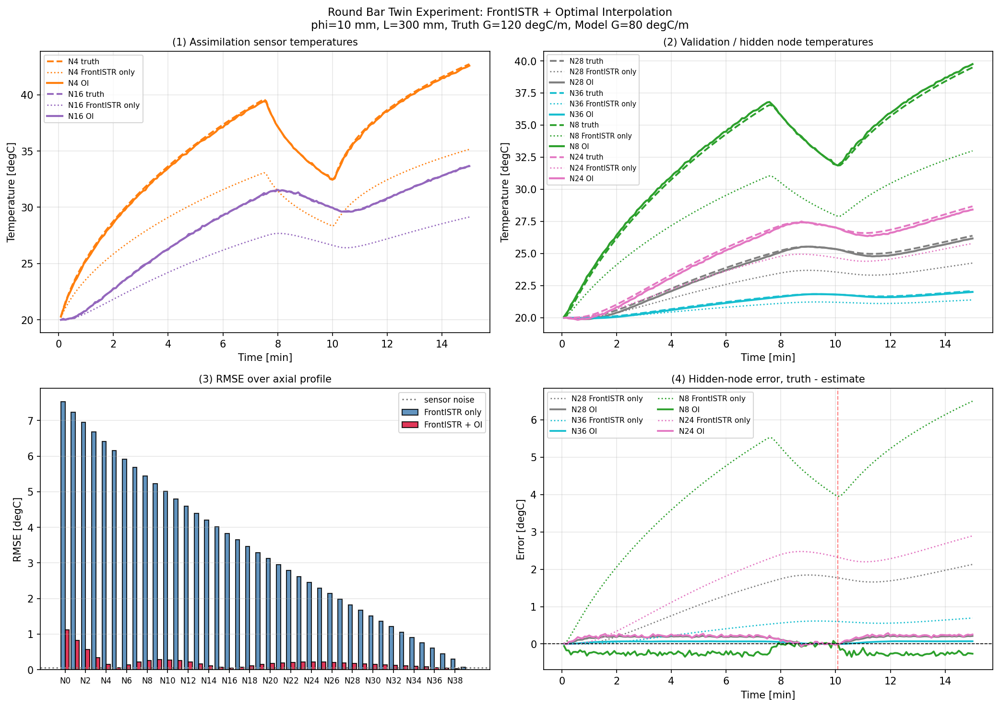
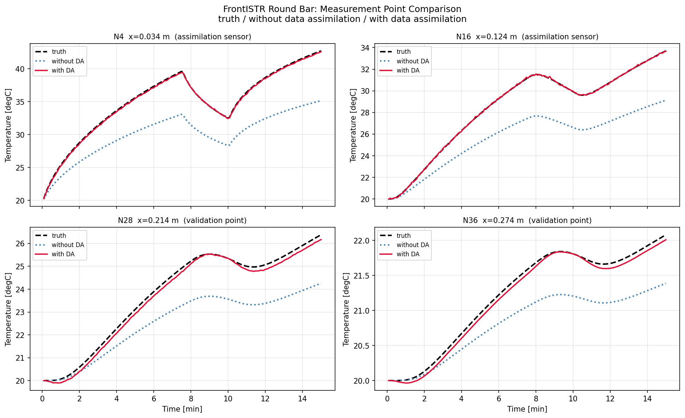

# 002-1 FrontISTR round bar data assimilation

`002-1_laplacian_da_round_bar` と同じ丸棒データ同化を、FrontISTR の熱伝導解析で行うための準備フォルダです。

FrontISTR は `/home/kamakiri/local/frontistr/bin/fistr1` にビルド済みです。
このフォルダでは、その `fistr1` を使って丸棒の熱伝導ツイン実験と OI データ同化を実行します。

## 目的

OpenFOAM 版で行っている次の流れを FrontISTR に置き換えます。

```text
丸棒温度場を FrontISTR で1ステップ予測
  ↓
同化用センサ温度で OI 補正
  ↓
補正後温度場を次ステップ初期温度として書き戻す
  ↓
DAなし / OIあり / truth を比較してグラフ化
```

## 丸棒条件

OpenFOAM 版 `sample/002-1_laplacian_da_round_bar` と同じ条件を使う予定です。

| 項目 | 値 |
|---|---:|
| 丸棒長さ | 0.30 m |
| 丸棒直径 | 0.01 m |
| 軸方向分割 | 40 |
| 時間刻み | 1 s |
| 計算時間 | 900 s |
| 熱拡散率 | 6.6e-5 m2/s |
| 同化センサ | N1, N4 |
| 検証センサ | N28, N36 |

## 実行方法

```bash
cd "$(git rev-parse --show-toplevel)/sample/002-1-FrontISTR_round_bar_da/oi"
./run.sh
```

結果は次に出力されます。画像は `oi/results/img/` に集約します。

| 出力 | 内容 |
|---|---|
| `case/round_bar.cnt` | FrontISTR の熱解析条件。実行時に Python が同じ名前で更新します |
| `oi/results/img/results_frontistr_da.png` | truth / FrontISTR-only / OI の比較グラフ |
| `oi/results/img/measurement_points_frontistr_da.png` | 代表測定点の比較グラフ |
| `oi/results/img/all_axial_nodes_timeseries_frontistr_da.png` | 全 axial node の時刻歴 |
| `oi/results/img/axial_nodes_heatmap_frontistr_da.png` | 全 axial node の温度ヒートマップ |
| `oi/results/img/axial_nodes_error_heatmap_frontistr_da.png` | 全 axial node の誤差ヒートマップ |
| `oi/results/summary_rmse.csv` | 軸方向 RMSE |
| `oi/results/*/temperature_history.csv` | 節点温度履歴 |
| `oi/results/*/axial_temperature_history.csv` | 軸方向平均温度履歴 |
| `oi/results/vtk/*/*.vtk` | ParaView 用の 1 秒刻み VTK 連番 |

## 関連リンク

- 
- 
- [FrontISTR の cnt 設定](case/round_bar.cnt)
- [OpenFOAM 版スライド](../002-1_laplacian_da_round_bar/slides.html)

`case/round_bar.cnt` はテンプレートとして置いてあり、`fistr_interface.py` が各ステップで上書きします。
上書きするのは主に次の部分です。

- `!INITIAL_CONDITION,TYPE=TEMPERATURE` 配下の全ノード初期温度
- `!FIXTEMP` の右端境界温度
- `!DFLUX` の左端境界熱流束

## OI パラメータの勘所

`oi/da_main.py` の次の 3 つは、同化の効き方を大きく左右します。

| パラメータ | 今の値 | 役割 | 調整の勘所 |
|---|---:|---|---|
| `OBS_NOISE_STD` | `0.05` | センサ観測ノイズの標準偏差 [degC] | センサの再現性を表します。小さくしすぎると観測を過信し、大きくしすぎると同化が弱くなります。まずは「測定のばらつきとして妥当な値」を置きます。 |
| `BACKGROUND_ERROR_STD` | `3.0` | 背景誤差の大きさ [degC] | 予測場が観測からどれだけずれているかの大きさです。大きいほど補正が強く、小さいほど補正が弱くなります。まずは「モデル誤差の初期見積もり」として置き、検証点 RMSE を見て調整します。 |
| `CORRELATION_LENGTH_M` | `0.05` | 背景誤差の空間相関長 [m] | どこまで補正を広げるかを決めます。長くしすぎると遠方の節点まで引っ張りすぎ、短くしすぎるとセンサ近傍しか直りません。今回の丸棒では、まず 1/3 長さ程度の 0.05 m を起点にし、N1 など近傍点と N28/N36 など遠方点の両方を見ながら詰めるのが現実的です。 |

この 3 つは独立ではなく、実際にはセットで効きます。

- `OBS_NOISE_STD` を下げると、同じ `B` でも観測の重みが増えます
- `BACKGROUND_ERROR_STD` を上げると、観測差をより強く空間へ広げます
- `CORRELATION_LENGTH_M` を上げると、補正範囲が広がります

今回の丸棒では、`N1` の改善を見たいのに `N28` や `N36` を崩してしまう場合は、まず `CORRELATION_LENGTH_M` を短くして、次に `BACKGROUND_ERROR_STD` を少し下げる順で調整するのが分かりやすいです。

## インストール

FrontISTR の導入方法は [INSTALL.md](INSTALL.md) を参照してください。

## 作業ログ

今回行ったことは [WORK_LOG.md](WORK_LOG.md) に記録しています。
