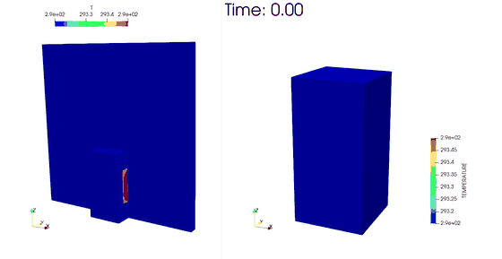
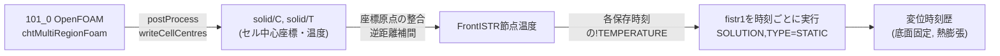

# 101_1: FrontISTR 熱膨張解析(101_0の固体温度分布を引き継ぎ)

更新日: 2026-07-28

## 目的

`../101_0_openfoam_cht_radiation_box`(OpenFOAM chtMultiRegionFoam、CHT+輻射+ヒートマット発熱源)で計算した**固体ブロックの温度分布**を取り込み、OpenFOAMと同じ保存時刻ごとにFrontISTRで**熱膨張(線形静解析)**を計算する。**底面(floor)をXYZ全固定**した状態での変形時刻歴を求める。

**OpenFOAM/FrontISTRが未セットアップの場合は先に`../101_0_openfoam_cht_radiation_box/docs/01_setup_openfoam_and_frontistr.md`を参照(GitHub clone後の詳細な手順)。**

この連携はOpenFOAMからFrontISTRへの**一方向・準静的連成**である。各保存時刻を独立した静解析として扱い、構造変形をOpenFOAMへ戻す反復計算は行わない。

## 計算結果プレビュー



左はOpenFOAMの温度場、右は同じ温度を節点へ写像したFrontISTRモデルです。
0～600秒の計算結果から4フレームおきに抽出した25フレームのGitHub表示用GIFです。
元GIFは1514x782、100フレーム、約17MBでしたが、560x289、64色、約0.86MBへ
圧縮しています。公開用GIFは次のコマンドで再生成できます。

```bash
cd sample/101_1_frontistr_cht_box_thermal_expansion
python3 python/compress_preview_gif.py
```

## 全体の流れ



## フォルダ構成

| パス | 役割 | 人が編集するか |
|---|---|---|
| `config/` | 材料物性と基準温度をYAMLで管理 | 実材料に合わせて編集する |
| `python/` | 温度読込み、座標整合、節点補間、FrontISTR入力生成・実行 | 解析手順を変更するときに編集する |
| `docs/` | 連成手順とFrontISTRキーワードの詳細説明 | 通常は参照のみ |
| `tests/` | 温度読込み・座標変換・補間の単体テスト | コード変更時に実行する |
| `case/` | 時刻ごとのFrontISTR入力・結果 | 自動生成。直接編集しない |
| `data/` | 時刻歴CSV、グラフ、PVD、要約、公開用GIF | 自動生成。一部だけGitHubへ収録 |
| `ani/` | 可視化用PNG連番と元GIF | 自動生成。容量が大きいためGitHub対象外 |

最初に読むファイルはこの `README.md` です。実行コマンドを詳しく確認する場合は
[`docs/00_openfoam_frontistr_coupling_workflow.md`](docs/00_openfoam_frontistr_coupling_workflow.md)、
FrontISTRの入力語句を調べる場合は
[`docs/01_frontistr_input_keywords.md`](docs/01_frontistr_input_keywords.md)へ進みます。

## OpenFOAMの温度を引き継ぐ方法

FrontISTRへ渡しているのは、温度の画像や領域平均値ではなく、**各保存時刻の
OpenFOAM固体セル温度**です。1時刻について次の順番で処理します。

1. `postProcess -func writeCellCentres -region solid -time <時刻>`で、各セルの中心座標`C`を出力する。
2. `python/openfoam_temperature.py`の`load_solid_cell_temperatures()`が`solid/C`と`solid/T`を読み込む。ヒートマット領域があれば`heaterMat/C`と`heaterMat/T`も結合する。
3. OpenFOAMとFrontISTRで原点が異なるため、`align_cell_centers_to_node_mesh()`が両モデルの中心を一致させる平行移動を行う。
4. `interpolate_to_nodes()`が、各FrontISTR節点の近くにあるOpenFOAMセルを8個選び、逆距離加重平均で節点温度を求める。
5. `python/fistr_case.py`の`write_cnt()`が節点番号と節点温度をFrontISTRの`!TEMPERATURE`へ書く。
6. `fistr1`が、節点ごとの温度差から熱ひずみと変位を計算する。

節点$n$へ渡す温度$T_n$は、近傍セル$i$までの距離$d_i$を使って次式で求めます。

$$
w_i = \frac{1}{d_i}, \qquad
T_n = \frac{\sum_{i=1}^{k} w_i T_i}{\sum_{i=1}^{k} w_i}, \qquad k=8
$$

つまり、節点に近いOpenFOAMセルほど強く、遠いセルほど弱く反映されます。
節点とセル中心が同じ位置なら、そのセル温度をそのまま使います。この計算は
`python/openfoam_temperature.py`の`interpolate_to_nodes()`、呼出しは
`python/run_thermal_expansion.py`の`run_one_time()`にあります。

実際の補間部分は次のコードです。

```python
for idx in range(n_nodes):
    d = np.linalg.norm(cell_centers - node_coords[idx], axis=1)
    nearest = np.argsort(d)[:k_eff]
    dn = d[nearest]
    if dn[0] < 1e-9:
        result[idx] = cell_temperatures[nearest[0]]
        continue
    w = 1.0 / dn
    result[idx] = np.sum(w * cell_temperatures[nearest]) / np.sum(w)
```

得られた`node_temps`は、次の呼出しで`.cnt`の`!TEMPERATURE`へ渡します。

```python
node_temps = interpolate_to_nodes(node_coords, aligned_centers, temps, k=8)
fistr_case.write_cnt(case_dir, node_ids, node_temps, ...)
```

FrontISTR側の自由熱ひずみは、線膨張係数$\alpha$、節点温度$T_n$、
基準温度$T_{\mathrm{ref}}$から次の関係で決まります。

$$
\varepsilon_{\mathrm{th},n} = \alpha\left(T_n-T_{\mathrm{ref}}\right)
$$

本ケースの$\alpha$と$T_{\mathrm{ref}}$は
`config/material_properties_steel.yaml`にあります。底面拘束があるため、この自由膨張が
そのまま変位になるのではなく、FrontISTRが弾性方程式との釣合いを解いて変位と応力を求めます。

### 時刻歴をFrontISTRへ渡す仕組み

FrontISTRがOpenFOAMの時刻フォルダを直接認識しているわけではありません。
`run_thermal_expansion_timehistory.py`が数値名のフォルダを時刻順に並べ、
**OpenFOAMの1時刻につきFrontISTRの静解析を1回**実行します。

```text
OpenFOAM                         Python変換                         FrontISTR
0/solid/{C,T}     ----------->  補間して節点温度を作る  ------->  case/t_0/*.cnt   -> fistr1
5/solid/{C,T}     ----------->  補間して節点温度を作る  ------->  case/t_5/*.cnt   -> fistr1
10/solid/{C,T}    ----------->  補間して節点温度を作る  ------->  case/t_10/*.cnt  -> fistr1
...                              ...                               ...
600/solid/{C,T}   ----------->  補間して節点温度を作る  ------->  case/t_600/*.cnt -> fistr1
```

たとえば300秒のOpenFOAM温度は
`../101_0_openfoam_cht_radiation_box/300/solid/T`から読み込まれ、
`case/t_300/box_thermal_expansion.cnt`へ次の形式で書かれます。

```text
!TEMPERATURE, GRPID=1
 1, 293.1500123
 2, 293.1500456
 ...
```

左列がFrontISTRの節点番号、右列がその節点へ補間した温度[K]です。
したがってFrontISTRが認識するのはOpenFOAM形式ではなく、変換後の
`!TEMPERATURE`です。

各解析は`!SOLUTION, TYPE=STATIC`の独立した準静的解析です。前時刻の変位や応力を
次時刻へ状態として引き継ぐ過渡構造解析ではありません。一方、温度分布は各時刻の
OpenFOAM結果を使うため、温度上昇・冷却に応じた熱変形の変化を時系列として得られます。

最後に`write_pvd_collection()`が各時刻のPVTUを次のように束ねます。

```xml
<DataSet timestep="0" file="../case/t_0/...pvtu"/>
<DataSet timestep="5" file="../case/t_5/...pvtu"/>
<DataSet timestep="10" file="../case/t_10/...pvtu"/>
```

この`data/thermal_expansion_timehistory.pvd`をParaViewで開くことで、
OpenFOAMと同じ`0, 5, 10, ..., 600秒`の時間スライダーとして表示できます。

## 前提・設計

- FrontISTR側のメッシュは、101_0の固体ブロック(既定200x200x400mm)と**同じ寸法・同じ分割数**(既定4x4x8)の構造六面体メッシュを`python/box_mesh.py`で新規生成する(101_0のOpenFOAMメッシュそのものを流用するのではなく、対応する寸法のFEMメッシュを別途作る)。
- 温度の引き継ぎは、101_0側で`postProcess -func writeCellCentres -region solid`により得られるセル中心座標`C`と温度`T`を、FrontISTR節点座標へ最近傍k点の逆距離加重平均で写像する(`python/openfoam_temperature.py`)。メッシュ分割数を揃えているため、内部節点はおおむね隣接8セルの平均値になる。
- 101_0の固体は流体領域中央、101_1の構造メッシュは原点始まりなので、補間前に両点群の中心を一致させる**平行移動**を自動適用する。既定の移動量は`(-0.4, -0.4, 0)m`で、回転・拡大縮小は行わない。
- 底面(z=0、`BOTTOM`節点群)をX,Y,Z全方向固定する(`!BOUNDARY, BOTTOM,1,1 / BOTTOM,2,2 / BOTTOM,3,3`)。101_0側でも同じ底面が(熱的には断熱としているが)物理的な設置面という想定になっており、整合している。
- 熱ひずみは `alpha × (TEMPERATURE − REFTEMP)` で計算される(FrontISTRの`!REFTEMP`機構)。REFTEMPは101_0の初期温度`293.15K`(20℃)に合わせている。
- 材料物性(弾性係数・ポアソン比・線膨張係数)は`config/material_properties_steel.yaml`に一般構造用鋼材の代表値を設定している(101_0の熱物性と同じ「鋼材相当」という前提)。**実材料が決まったら要更新**。

## 使い方

```bash
# 0. 初回だけPython依存ライブラリを導入
cd sample/101_1_frontistr_cht_box_thermal_expansion
python3 -m pip install -r requirements.txt

# 1. 101_0側でOpenFOAMを実行済みであること(Allrun等)
cd ../101_0_openfoam_cht_radiation_box
source <OpenFOAM環境>/etc/bashrc   # 例: /usr/lib/openfoam/openfoam2512/etc/bashrc
./Allrun   # または ./Allrun.pre → chtMultiRegionFoam

# 2. 101_1側でOpenFOAMと同じ全保存時刻をFrontISTR解析
cd ../101_1_frontistr_cht_box_thermal_expansion/python
export FISTR1=/home/kamakiri/local/frontistr/bin/fistr1
python3 run_thermal_expansion_timehistory.py --of-case ../../101_0_openfoam_cht_radiation_box
```

既定では`0`秒を含む全保存時刻を処理する。単一時刻だけ確認する場合は
`python3 run_thermal_expansion.py --time 300`を使う。

コマンドを一つずつ理解して再実行するための資料:

- [`docs/00_openfoam_frontistr_coupling_workflow.md`](docs/00_openfoam_frontistr_coupling_workflow.md): OpenFOAMの準備、全コマンド、温度写像、実行、結果確認
- [`docs/01_frontistr_input_keywords.md`](docs/01_frontistr_input_keywords.md): `.msh`、`.cnt`、`hecmw_ctrl.dat`のキーワード解説

## 出力

- `case/t_<OpenFOAM時刻>/box_thermal_expansion.msh` : 時刻別FrontISTRメッシュ
- `case/t_<OpenFOAM時刻>/box_thermal_expansion.cnt` : 時刻別の節点温度・拘束・材料
- `case/t_<OpenFOAM時刻>/box_thermal_expansion.res.0.*` : 時刻別変位結果
- `case/t_<OpenFOAM時刻>/*pvtu, *.vtu` : ParaView可視化結果
- `case/t_<OpenFOAM時刻>/summary.yaml` : その時刻の温度・変位・座標移動量
- `data/timehistory.csv` : 全保存時刻の温度・変位一覧
- `data/timehistory.png` : 温度と熱膨張の時刻歴グラフ
- `data/thermal_expansion_timehistory.pvd` : 全時刻をOpenFOAM時刻値で束ねたParaView用ファイル。`TEMPERATURE`、`DISPLACEMENT`、応力を切替表示可能

## GitHubへ収録するもの

| 区分 | GitHub | 理由 |
|---|---|---|
| OpenFOAM・FrontISTRの入力設定 | 収録 | 同じ条件を再構築するために必要 |
| Python連携・GIF圧縮スクリプト | 収録 | 温度写像、時刻歴解析、公開画像を再生成できる |
| 詳細手順書・キーワード解説・テスト | 収録 | AIを使わずに再実行・変更できるようにする |
| `timehistory.csv`、`timehistory.png`、圧縮GIF | 収録 | 計算済み結果をGitHub上で確認できる |
| 101_0の時刻フォルダ | 除外 | 約1GB。OpenFOAMを実行すれば再生成できる |
| 101_1の`case/t_*` | 除外 | 約91MB。時刻歴スクリプトで再生成できる |
| 元GIFとPNG連番 | 除外 | 元GIFだけで約17MB。圧縮版を収録する |

GitHubから取得した直後はPVDがありません。OpenFOAM計算後に
`run_thermal_expansion_timehistory.py`を実行すると、全時刻のPVTU/VTUと
`data/thermal_expansion_timehistory.pvd`が生成されます。

## 想定される結果の解釈(要確認)

ヒートマットは固体の片側面(+X面)にあり、床(floor)は断熱・固定という構成のため、単純な軸方向の一様熱膨張ではなく、**片側だけが温まることによる「反り(曲げ変形)」が支配的になる可能性が高い**。`summary.yaml`の`top_face_ux_spread_mm`(上面各節点のX方向変位のばらつき)が大きい場合は、この反りが顕著に出ていることを示す。定量的な妥当性は、101_0の温度分布(`postProcessing/solidSurfaceProbes`等)と合わせて確認すること。

## 実行確認(2026-07-28)

101_0の`0～600秒`、5秒間隔の全121保存時刻を引き継ぎ、121ケースすべてで`fistr1`が正常終了することを確認した。

- 初期温度: 293.15K。0秒では全変位が0となる。
- OpenFOAM固体側最高温度: 293.7681K(300秒)。ヒーター停止後は低下する。
- 写像後の節点最高温度: 293.6414K(300秒)。逆距離平均によりセル最高温度より滑らかになる。
- 上面平均Z変位の最大: 0.0005317mm(320秒)。温度ピークより20秒遅れて最大となる。
- 全節点の最大変位量: 0.0017452mm(300秒)。
- 上面X変位幅(反り指標): 600秒で0.0002115mm。
- 全時刻でOpenFOAMからFrontISTRへの座標平行移動は`(-0.4, -0.4, 0)m`、PVDから参照する121個のPVTUに欠落なし。

変形はマイクロメートル級で小さい。これは約126kgの鋼材相当ブロックに20Wを300秒入力する条件によるもので、結果を大きく見せるために荷重を変更してはいない。定量評価へ使う場合は、実際の寸法、材料、発熱量、固定条件へ更新する。

## FrontISTRの.msh/.cnt形式に関する詰まった点(記録)

`!SECTION`が参照する`MATERIAL`名は、**メッシュ読み込み時点(.cntを読む前)に解決される**ため、.mshファイル自身にも同名のMATERIALが必要だった。ただし.msh側のMATERIALパーサは`!ELASTIC`/`!EXPANSION_COEFF`のようなFrontISTR制御ファイル固有の簡易記法を受け付けず、汎用の`!ITEM=n`形式(`fistr1/src/lib/physics/material.f90`の内部配列位置に対応、`sample/002_2_frontistr_round_bar_da`の熱伝導ケースと同じ考え方)でしか書けなかった。そのため、同じ物性値を.msh(`!ITEM=n`形式)と.cnt(`!ELASTIC`/`!EXPANSION_COEFF`形式)の両方に重複して書いている(`python/fistr_case.py`の`write_mesh`/`write_cnt`のdocstring参照)。実際に動く`tests/lib/static_LIB_C3D8_Bbar/elastic_beam_thermal.msh`+`.cnt`の組を確認して倣った。

## 未確定・要確認事項

- 実材料の物性値(現状は代表値)
- FrontISTRメッシュの分割数(既定は101_0と同じ4x4x8だが、精度が必要な場合は増やすこと。101_0側のcellSizeを変えた場合はこちらの`--nx/--ny/--nz`も合わせて変更すること)
- 温度写像の補間方法(最近傍k=8の逆距離加重平均という簡易近似。ヒートマットのように局所的な発熱源の場合、ピーク値が周囲で薄まる点に注意。より局所性を保ちたい場合は`interpolate_to_nodes`の`k`を小さくする(例: k=1〜3)ことを検討)
- 境界面付近では101_0側のOpenFOAMメッシュの境界条件の影響を受けている点に留意
