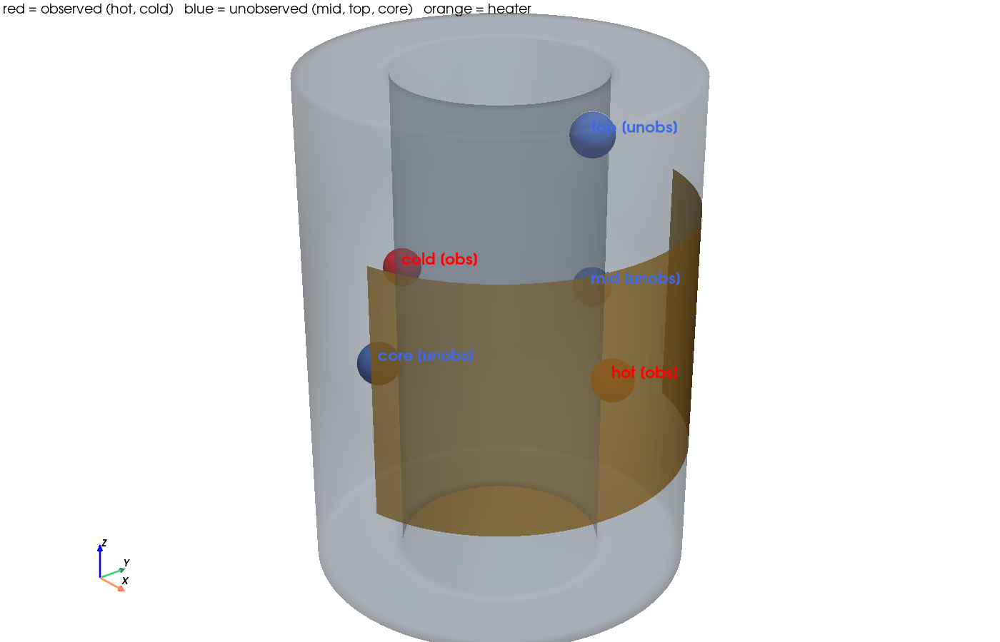

# 双子実験(OSSE)の問題設定 ― 何を、どこで観測し、何を推定するか

## 1. ねらい

**数点の温度観測だけを頼りに、でたらめな初期状態から出発しても、データ同化で
固体温度場が真値へ補正されていく時刻歴を見る。**

ベースは `102_0_openfoam_hollow_cylinder_heat_transfer`(中空円筒を外周ヒータで温める
chtMultiRegionFoam・輻射あり CHT)。その解析を**データ同化のループの中で実際に回す**。

## 2. 双子実験(OSSE)とは

「真の状態」を人工的に用意し、そこから作った観測でデータ同化を検証する方法。

1. **真値ラン**: 真のヒータ発熱 `Q_true`、真の初期温度(20 ℃一様)で OpenFOAM を回し、
   各時刻の真の固体温度場を得る。
2. **合成観測**: 真値場のうち観測点(数セル)だけを取り出し、観測ノイズを加える。
3. **アンサンブル**: でたらめな初期温度場＋誤った `Q` から出発し、上の数点観測だけで
   データ同化する。真値を知っているので、補正がどれだけ効いたかを厳密に評価できる。

## 3. ジオメトリと観測点

中空円筒(外径75 / 内径40 / 高さ100.5 mm)。外周 +X 側にヒータ。
ROM プロトタイプでは固体を5ノードに縮約するが、OpenFOAM 版では**固体全セル(約2万セル)**が状態。

観測点(既定)と未観測点は下図のとおり(`run/plot_probe_locations.py` で生成):



- **赤 = 観測点**: `hot`(+X, ヒータ直下)と `cold`(−X, 反ヒータ側)の2点
- **青 = 未観測点**: `mid`(+Y 90°)、`top`(上面近傍)、`core`(肉厚中心) ― 観測しないが
  データ同化で補正されるかを見る対象
- **橙 = ヒータ領域**(外周 +X 側)

観測点は各座標に最も近い固体セルへ対応づける(既定では hot→セル7663、cold→セル7582)。

## 4. 状態ベクトルと観測演算子

拡大状態(augmented state):

```
x = [ T_1, T_2, ..., T_Nc ,  Q ]          （Nc ≈ 20696 セル ＋ ヒータ発熱 Q）
```

- 温度場を状態にすることで、**観測していないセルも、観測セルとの相関を通じて補正**される。
- `Q` を状態に含める(パラメータ同時推定)ことで、**誤ったヒータ発熱も観測から修正**される。

観測演算子 `H` は観測セルの温度を抜き出す線形写像:

```
y = H x + ε ,   ε ~ N(0, R),   R = σ² I ,  σ = 0.30 K
```

## 5. 「でたらめな初期状態」の作り方

- **温度場**: 各メンバーに一様乱数温度(既定 280–320 K)を与える。真の 293.15 K を知らない。
- **ヒータ発熱 Q**: 一様乱数(既定 5–30 W)。真値 15 W からずらす。

この状態から、hot/cold の2点観測だけで真値場へ収束できるかを見る。

## 6. OpenFOAM ケースの用意(既存メッシュの再利用)

「メッシュは今あるものを使う」方針に従い、`102_0` が生成済みの polyMesh をそのまま使う。

```
cd sample/103_0_openfoam_da_enkf/openfoam
sh setup_base_case.sh          # ../102_0 から constant/system/0 をコピーして base_case を作る
```

ベースケース(`openfoam/base_case`)は輻射あり(fvDOM)・直列前提で、ヒータ発熱は
`externalWallHeatFluxTemperature`(mode=power)。データ同化ドライバがメンバーごとに
初期温度場と `Q` を書き換えて短ウィンドウずつ回す。

## 7. 設定ファイル

`openfoam/da_openfoam_config.yaml` に、時間範囲・観測間隔・観測点・観測ノイズ・
アンサンブル数・初期分布・フィルタ調整値をまとめている。既定は「最小実行」
(N=5、0→20 s、観測2回)。規模を上げたいときはこのファイルの数値を増やすだけでよい。

手法の理論と OpenFOAM 連成の実装は `02_enkf_method.md`、実行手順は `03_run_procedure.md` を参照。
