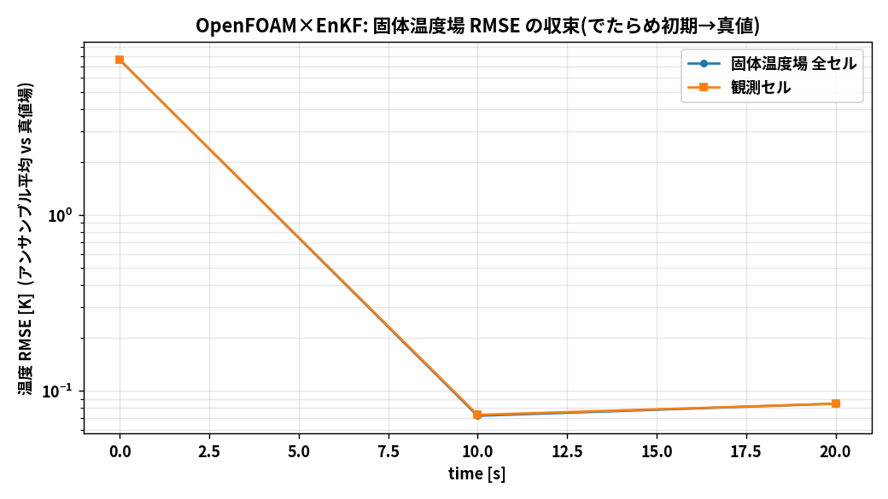
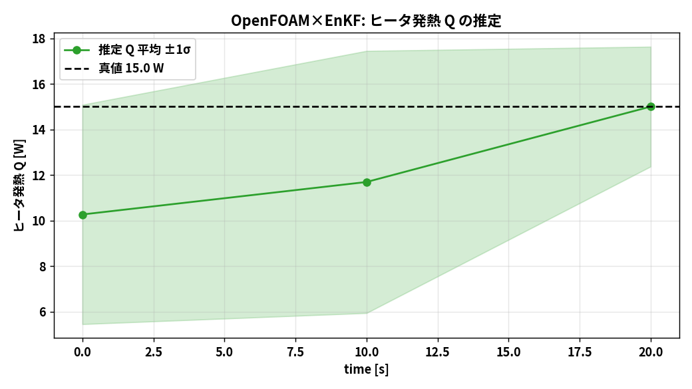

# アンサンブルカルマンフィルタ(EnKF)― 理論と OpenFOAM 連成

## 1. なぜ EnKF か

OpenFOAM の CHT には随伴モデルが無く、状態(温度場)は約2万次元。共分散を陽に持つ
KF/EKF は不可能で、随伴が要る 4D-Var も非現実的。EnKF は

- **共分散をアンサンブル(標本)で近似**するのでヤコビアン・随伴が不要
- モデルは**前進計算だけ**できればよい(OpenFOAM をそのまま使える)
- メンバーは独立に回せる

という理由で、CFD/CHT データ同化の事実上の標準になっている。

## 2. アルゴリズム(確率的 EnKF・摂動観測法)

`N` メンバーのアンサンブル `{x^(i)}` を持つ。

**予報:** 各メンバーを OpenFOAM で `t_k → t_{k+1}` まで前進積分

```
x_f^(i) = M(x_a^(i))
```

**解析:** 予報アンサンブルから標本共分散を作り、観測へ引き寄せる

```
x̄_f = (1/N) Σ x_f^(i)
P_f ≈ (1/(N-1)) Σ (x_f^(i) − x̄_f)(x_f^(i) − x̄_f)ᵀ      （陽には作らない）

K = P_f Hᵀ (H P_f Hᵀ + R)⁻¹                             （カルマンゲイン）

x_a^(i) = x_f^(i) + K ( y + ε^(i) − H x_f^(i) ),   ε^(i) ~ N(0, R)
```

- `ε^(i)` は各メンバー独立の観測摂動(摂動観測法)。これにより解析共分散が理論値に一致する。
- 実装では `P_f` を作らず、状態アノマリ `dX` と観測アノマリ `dY = H dX` から
  `C_zy = dX dYᵀ/(N−1)`、`C_yy = dY dYᵀ/(N−1)` を求め、`K = C_zy (C_yy+R)⁻¹` とする
  (観測数だけの小さな逆行列で済む)。

**共分散インフレーション:** 標本数が少ないと `P_f` を過小評価するため、平均まわりに
わずかに広げる `x_f^(i) ← x̄_f + λ (x_f^(i) − x̄_f)`(既定 λ=1.05)。

コード: `dacore/enkf.py`(モデル非依存。ROM 版・OpenFOAM 版で共通)。

## 3. OpenFOAM をループで回す仕組み

`daof/` が OpenFOAM 連成を担う。1メンバー = 1つの chtMultiRegionFoam ケース。

| ファイル | 役割 |
|----------|------|
| `daof/of_io.py` | フィールドファイルの読み書き(internalField・セル中心)、controlDict のウィンドウ設定 |
| `daof/of_case.py` | メンバー生成(base_case 複製)・固体温度場と Q の書き込み・ソルバ実行・場の読み出し |
| `daof/of_twin.py` | 真値/観測生成、アンサンブルの前進と EnKF/PF 解析、場の書き戻し、記録 |

**1サイクルの流れ:**

1. 各メンバーの `controlDict` を `startTime=t_k, endTime=t_{k+1}` に設定し
   (`writeControl adjustableRunTime` で終端時刻を正確に踏む)、`chtMultiRegionFoam` を直列実行。
2. 各メンバーの `t_{k+1}/solid/T` から固体温度場(全セル)を読み、`Q` と合わせて状態 `x_f^(i)` を作る。
3. `dacore.enkf.enkf_update` で解析 `x_a^(i)` を計算。
4. 温度を物理範囲へクリップ、`Q≥0` にクリップ。
5. 解析場を `t_{k+1}/solid/T` へ**書き戻す**(次ウィンドウはここから再開)。

観測(数点)しか使っていないのに、共分散 `C_zy` を通じて未観測セルと `Q` まで更新される点が要。

## 4. 結果

最小実行(N=5、0→20 s、観測2回、hot/cold の2点観測)の結果:

- 固体温度場 RMSE の収束(アンサンブル平均 vs 真値場):

  

- ヒータ発熱 `Q` の推定(真値 15 W への収束):

  

- 温度場スナップショット(でたらめ初期 → データ同化後 → 真値):

  

数値の要約は `results/openfoam_enkf_summary.yaml`、時刻歴は
`results/openfoam_enkf_history.csv` に出力される。

> **メンバー数と精度**: 最小実行は N=5 と少ないため、約2万次元の場に対して
> アンサンブルが張る部分空間は 5 次元しかない。観測点付近と全体オフセット・Q は
> よく補正されるが、細かな空間構造まで完全には復元できない。メンバー数を増やす
> (`da_openfoam_config.yaml` の `n_members`)ほど場の再現性は上がる(その分計算は重くなる)。

## 5. 高速プロトタイプ(ROM)

OpenFOAM 連成は1メンバーでも数分かかるため、アルゴリズム確認用に
**集中定数モデル(ROM)版**を `dacore/` に用意している(数秒で完走)。ROM は
102_0 の温度履歴に校正済みで、同じ `dacore/enkf.py` を使う。
詳細と実行は `03_run_procedure.md` を参照。
