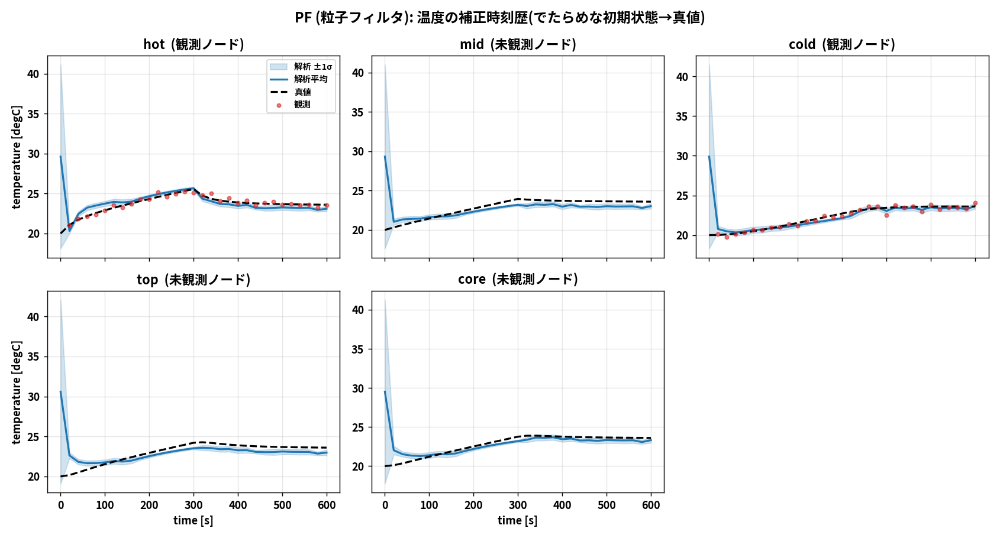
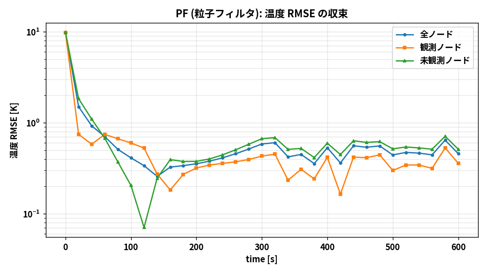

# 粒子フィルタ(PF)― 理論と OpenFOAM 連成

## 1. なぜ PF を試すのか

EnKF は事後分布をガウスで近似する。PF(粒子フィルタ)は**分布を重み付き粒子で表現**するため、
非ガウス・多峰な事後分布も扱える。一方で**次元の呪い**(高次元で必要粒子数が急増)という
弱点がある。EnKF と同じ問題で PF を回すことで、両手法の長所・短所を実地で比較できる。

## 2. アルゴリズム(ブートストラップ / SIR)

`N` 個の粒子 `{x^(i)}` を持つ。

**予報:** 各粒子を OpenFOAM で `t_k → t_{k+1}` まで前進積分。

**重み付け:** 観測尤度で重みを更新

```
w^(i) ∝ exp( −1/2 (y − H x^(i))ᵀ R⁻¹ (y − H x^(i)) )
Σ w^(i) = 1
```

**リサンプリング:** 有効サンプル数 `ESS = 1 / Σ (w^(i))²` が閾値(既定 0.5N)を下回ったら、
重みに比例して粒子を**系統リサンプリング**し、重みを一様に戻す。

**正則化(ジッタ):** リサンプリングで同一粒子が重複するため、温度場と `Q` に微小な
ランダム擾乱を加えて多様性を回復する(正則化粒子フィルタ)。

コード: `dacore/pf.py`(モデル非依存。系統リサンプリング＋温度ジッタ)。
`Q` のジッタはリサンプリング時に `daof/of_twin.py` 側で加える。

## 3. OpenFOAM をループで回す仕組み

EnKF 版とまったく同じ連成基盤(`daof/`)を使い、解析ステップだけ `pf_update` に差し替える。
1サイクル = [全粒子を chtMultiRegionFoam で前進 → 尤度で重み付け → 必要ならリサンプリング
→ 温度場と Q を書き戻す]。真値・観測は EnKF 版と seed が同じなので、**同一の観測**を同化する。

## 4. 次元の呪いに注意

固体温度場は約2万次元。厳密には PF は高次元で破綻しやすく、少数粒子だと1粒子に重みが集中
(`ESS→1`)して**粒子貧困化**が起きる。本ケースの拡大状態は「全体オフセット＋Q」が
支配的な低ランク構造なので少数粒子でもある程度動くが、EnKF ほど安定ではない。
これは PF の性質を理解するうえで重要な観察点である。

## 5. 結果

### 5.1 高速プロトタイプ(ROM)版

集中定数モデルで PF を回した結果(数秒で完走、`run/run_pf.py`):





観測点(hot, cold)はよく追随するが、未観測ノードでは EnKF よりバイアス・過信
(分散の過小評価)が出やすい。EnKF との比較は `04_enkf_vs_pf.md`。

### 5.2 OpenFOAM 連成版

`run/run_openfoam_pf.py` を実行すると以下が生成される:

- `docs/img/openfoam_pf_rmse.png`(固体温度場 RMSE の収束)
- `docs/img/openfoam_pf_Q.png`(ヒータ発熱 Q の推定)
- `docs/img/openfoam_pf_field.png`(温度場スナップショット)
- `results/openfoam_pf_history.csv` / `openfoam_pf_summary.yaml`

実行手順は `03_run_procedure.md` を参照。
