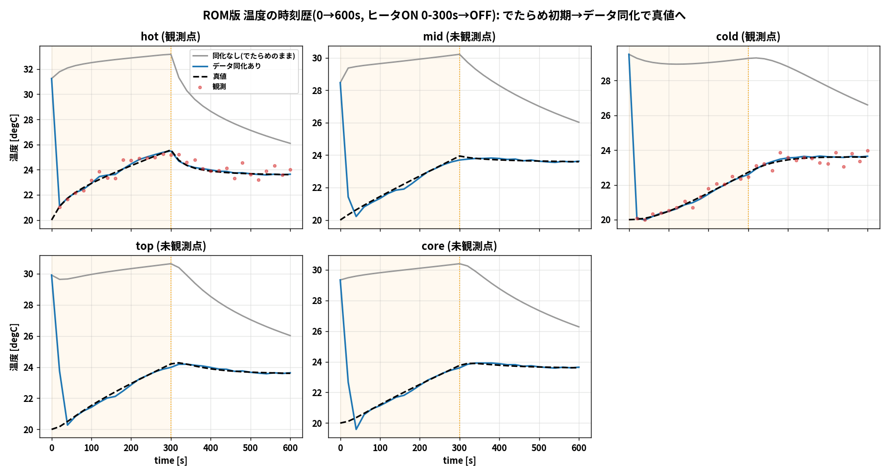
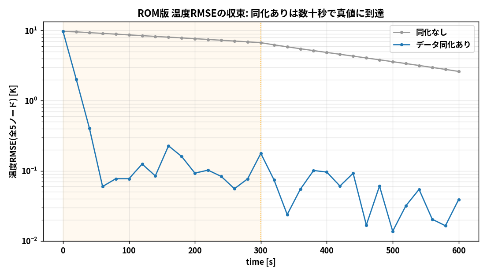

# はじめてのデータ同化 ― 大学初学者のための超ていねい解説

この文書は「データ同化って結局なにをしているの？」を、予備知識ゼロから
順番に理解するためのものです。数式は最後にだけ出てきます。まずは絵と言葉で。

---

## 0. ひとことで言うと

> **たった数個の測定値を使って、間違った予測を正しい状態へ「引き戻す」技術**

このフォルダ(104)がやっているのは、次の実験のシミュレーション版です。

- 金属の円筒を、横からヒーターで温める(102_0 の設定)
- 温度計を数個、変位センサを数個だけ貼る
- **中身の温度分布は直接は測れない**(センサは表面の数点だけ)
- それでも「数点の測定」から**全体の温度分布**を推定したい

これを可能にするのがデータ同化です。

---

## 1. なぜ難しいのか(問題の設定)

シミュレーション(OpenFOAM)は、初期状態を与えれば温度がどう変化するか計算できます。
でも現実には:

- **初期状態が正確にわからない**(部屋の温度ムラ、材料のばらつき…)
- **ヒーターの発熱量が正確にわからない**(安物ヒーターは表示どおり出ない)

初期状態や発熱量が少しでも違うと、計算した温度は本物とズレていきます。
下の灰色の線(同化なし)がそれです ― **でたらめな初期値から出発すると、
ずっと間違ったまま**。



黒い破線が「本物(真値)」、灰色が「間違った初期値のまま計算した結果」。
600秒たっても真値に戻りません。これをどうにかしたい、というのが出発点です。

---

## 2. データ同化のアイデア(気持ち)

料理でたとえます。

- レシピ(モデル)どおり作っても、オーブンの癖で焼き上がりがズレる
- だから**途中で味見(観測)**して、火加減(状態)を直す
- 味見は数回だけ。でも、その情報で全体を調整できる

データ同化はこれを数学的にやります:

```
   予測する  →  数点だけ測る  →  測定と予測のズレから全体を直す  →  また予測する …
  (シミュレーション)  (観測)          (これがキモ)
```

ポイントは「**数点しか測っていないのに、測っていない場所まで直せる**」こと。
なぜそんなことができるのか? ― それは「温度分布には物理的なつながりがあって、
ヒーター側が熱ければ隣も熱い、という**相関**を使うから」です(§6で数式に)。

上の図の青い線(データ同化あり)を見てください。**でたらめな初期値から出発しても、
数点の観測(赤い点)を使うと、数十秒で真値(黒破線)にピタッと張り付きます**。
しかも hot/cold(観測点)だけでなく、**測っていない mid/top/core まで直っています**。

---

## 3. 「ROM」とは何か、なぜ使うのか

ROM = Reduced Order Model = **縮約モデル**(軽い代用モデル)。

本物の OpenFOAM は、円筒を約2万個の小さなマス(セル)に分けて計算します。
とても正確ですが、**1回の計算に数分〜1時間**かかります。データ同化では
同じ計算を何十回も繰り返すので、これでは重すぎます。

そこで、円筒の温度を**5点の代表温度**(hot/mid/cold/top/core)だけで表す
超シンプルな模型を作ります。これが ROM です。中身は「熱の伝わりやすさ」で
つないだ5個の点の温度方程式(§6)。**計算は一瞬**(0→600秒が数秒)。

- ROM は本物のOpenFOAM(102_0)の温度履歴に**校正済み**(誤差 0.01℃)なので、
  挙動は本物そっくり
- だから「データ同化の考え方を、待たずに何度でも試せる」教材になる

> 本物どおりの精度が要るときは OpenFOAM 版(`run/run_openfoam_fem_enkf.py`)、
> 仕組みを理解したいときは ROM 版(`run/run_rom_fem.py`)、と使い分けます。

---

## 4. 「双子実験(そうじじっけん)」とは

手法が本当に効くか確かめるには、「正解」を知っている必要があります。
そこで**わざと自分で正解を作ります**。これを双子実験(OSSE)と呼びます。

1. **正解を作る**: 正しい発熱量・正しい初期温度で ROM を1回動かす → これが「真値」
2. **観測を作る**: 真値の温度・変位のうち**数点だけ**を取り出し、
   わざと**測定誤差(ノイズ)**を少し足す → これが「観測データ」
3. **わざと間違える**: 全然違うでたらめな初期温度(10〜50℃バラバラ)と
   間違った発熱量から、たくさんの計算(アンサンブル)を start
4. **直せるか見る**: 数点の観測だけで、でたらめが真値に戻るか?

正解を握っているので、「どれだけ直ったか」を数字(RMSE)で採点できます。

---

## 5. 「アンサンブル」とは ― たくさんの分身で不確かさを表す

初期状態がわからない、を**1つの値**で表すのは無理です。そこで
「ありえそうな初期状態」を**たくさん(例: 60個)ばらまきます**。この分身の集団を
アンサンブルと呼びます。

- 分身がバラバラ = 不確かさが大きい
- 分身がまとまっている = 自信がある

観測が来るたびに、**各分身を観測に近づけ、集団をキュッと真値に寄せます**。
これがアンサンブルカルマンフィルタ(EnKF)。分身の**ばらつき**から
「どの向きに直すべきか(相関)」を自動で学ぶのがミソです。

---

## 6. 変位も使う(104 の新しいところ)

温度計だけでなく、**熱で伸びた変位**も観測に使えます(実験の変位センサ)。
金属は温まると伸びるので、上面の持ち上がり(変位)は温度の情報を持っています。


この図は「温度を直したら、そこから予測される変位も自動的に真値に一致した」
ことを示しています(灰=でたらめ、青=同化後、黒破線=真値)。

**ただし大事な注意**: この5点ROMでは、変位は「全体が一様に伸びる量」に
ほぼ比例し、すでに測っている温度2点と**ほとんど同じ情報**になってしまいます。
だからROMでは変位を「同化」に足しても効果が薄い(むしろ数値的に不安定)。
→ **ROMでは温度を同化し、変位は予測に使う**、という設計にしています。

変位が**本当に効く**のは、2万セルの温度場を丸ごと積分する OpenFOAM 版です。
そちらでは、温度2点だけの場合より温度場の推定が約4倍鋭くなりました
(RMSE 0.085K → 0.020K、`00_temp_displacement_da.md`)。
「模型を粗くすると、ある観測の価値が消える」― これはモデル縮約の良い教訓です。

---

## 7. 採点(どれだけ直ったか)



RMSE(誤差の代表値)の時刻歴です。**同化あり(青)は数十秒で誤差がストンと落ち**、
以降ずっと小さいまま。同化なし(灰)は誤差が大きいまま。これが効果の証拠です。

---

## 8. ようやく数式(§2〜5を式にすると)

状態(推定したいもの)を1本のベクトルにまとめます:

$$x = [\, T_\mathrm{hot}, T_\mathrm{mid}, T_\mathrm{cold}, T_\mathrm{top}, T_\mathrm{core},\ q,\ h \,]$$

温度5点に加え、未知の発熱倍率 $q$ と放熱係数 $h$ も一緒に推定します
(拡大状態=パラメータも状態に入れる)。

観測 $y$(数点の温度)は、状態から観測を取り出す行列 $H$ で表せます:

$$y = H x + \varepsilon,\qquad \varepsilon \sim N(0, R)$$

$\varepsilon$ は測定ノイズ、$R$ はその大きさ(分散)。

**予測(前進)**: ROM の熱方程式でアンサンブルを時間発展。
各ノードのエネルギー収支は

$$C_i \frac{dT_i}{dt} = \sum_j K_{ij}(T_j - T_i) + q_i(t) - h(T_i - T_\mathrm{air})$$

(熱容量 × 温度変化 = 隣から流入する熱 + ヒーター − 逃げる熱)。

**修正(解析)**: 観測が来たら、各分身を次式で直します(カルマン更新):

$$x_a = x_f + K\,(y - H x_f)$$

- $x_f$: 予測(まだ直していない)、$x_a$: 修正後
- $y - H x_f$: 観測と予測のズレ(イノベーション)
- $K$: カルマンゲイン = 「ズレをどれだけ信じて直すか」の重み

$K$ は、アンサンブルのばらつき(標本共分散 $P_f$)と観測ノイズ $R$ の
兼ね合いで決まります:

$$K = P_f H^\top \left(H P_f H^\top + R\right)^{-1}$$

$P_f$ に「温度どうしの相関」が入っているので、**観測点の温度を直すと、
相関を通じて未観測点の温度まで直る**。これが §2 の「数点で全体が直る」の正体です。

詳しい導出と実装対応は `../103_0_openfoam_da_enkf/docs/05_theory_to_code.md`
(EnKF/PF の全数式↔コード対応表)を参照。

---

## 9. 自分で動かす(数秒で完了)

```
cd sample/104_0_openfoam_frontistr_da_enkf
pip install --user -r requirements.txt

# ROM を 102_0 の温度履歴に校正(初回のみ)
OMP_NUM_THREADS=4 OPENBLAS_NUM_THREADS=4 python3 dacore/calibrate.py
# 変位オペレータを 102_1 の FrontISTR に校正(初回のみ)
OMP_NUM_THREADS=4 OPENBLAS_NUM_THREADS=4 python3 -m dacore.displacement
# 本体(温度＋変位の 0→600s データ同化)
OMP_NUM_THREADS=4 OPENBLAS_NUM_THREADS=4 python3 run/run_rom_fem.py
```

出てくる図(`docs/img/`):
- `rom_fem_temperature.png` … 5点温度の時刻歴(でたらめ/同化/真値)
- `rom_fem_displacement.png` … 上面変位の時刻歴
- `rom_fem_rmse.png` … 誤差の収束

---

## 10. まとめ(この教材で分かること)

1. **データ同化 = 数点の測定で、間違った予測を正解へ引き戻す**
2. **アンサンブル** = 分身の集団で不確かさと相関を表す
3. **相関のおかげで、測っていない場所まで直る**
4. **ROM** = 一瞬で回る代用モデル。仕組みの理解に最適(本物は OpenFOAM 版)
5. **変位観測**の価値はモデルの細かさ次第 ― 粗いROMでは効かないが、
   全セルを積分する OpenFOAM では強力に効く
6. パラメータ(発熱量など)も**状態に混ぜて同時推定**できる

次のステップ: 手法の数式を深めるなら
`../103_0_openfoam_da_enkf/docs/05_theory_to_code.md`、
本物の OpenFOAM 連成は `01_method_walkthrough.md` へ。
