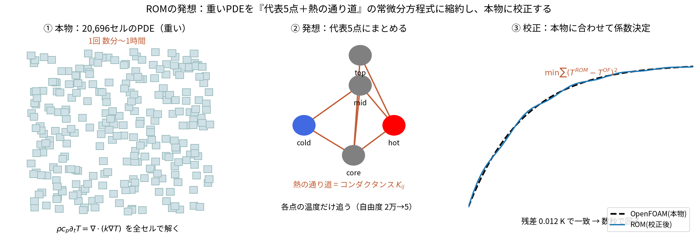

# ROMをどういう発想で考えたか（図解）

「なぜ・どうやって ROM（縮約モデル）を思いついたか」を、順を追って図解する。
数学的な導出は `03_rom_derivation.md`、データ同化での使い方は `02_beginner_guide.md`。

---

## 1. 出発点の困りごと：本物は重い

データ同化は「予測 → 観測で補正」を**何十回も繰り返す**。ところが本物の
OpenFOAM（chtMultiRegionFoam）は 20,696 セルの偏微分方程式（PDE）を解くので、
1回に数分〜1時間かかる。これでは同化のたびに待てない。

> **発想の種**：「補正の実験をするだけなら、そんなに細かい温度分布は要らないのでは？
> 代表的な数点の温度だけ、うんと軽く追えれば十分ではないか。」

---

## 2. 発想：代表5点＋熱の通り道に置き換える

3ステップの発想:

1. **① 本物**：全セルで $\rho c_p\,\partial_t T=\nabla\cdot(k\nabla T)$ を解く（重い）。
2. **② 縮約**：温度を測りたい**代表5点**（hot/mid/cold/top/core）だけにまとめ、
   点どうしを「熱の通り道（コンダクタンス $K_{ij}$）」でつなぐ。
   自由度が **2万 → 5** に激減する。
3. **③ 校正**：この5点モデルの係数（熱容量 C・コンダクタンス K・放熱 h）を、
   本物の温度履歴に**最小二乗で合わせる**。

---

## 3. なぜ「同じ物理」と言えるのか

これは思いつきの別モデルではない。**有限体積法で PDE を離散化し、
セルを極端に粗く（2万→5）した極限**が、次の集中定数の常微分方程式:

$$C_i\frac{dT_i}{dt}=\sum_j K_{ij}(T_j-T_i)-h(T_i-T_{air})+Q_i(t)$$

（熱容量×温度変化 ＝ 隣から流入する熱 ＋ ヒータ − 逃げる熱）。
つまり ROM は「**同じ熱収支の式を、粗く離散化したもの**」。だから校正すれば本物に一致する。

- 校正の当てはめ残差：**RMSE 0.012 K**
- 校正で得た全熱容量 $\sum C_i\approx1191$ J/K は、鋼2.49kgの $\rho c_p V\approx1195$ J/K と一致
  （数字合わせでなく物理的に正しい）
- 0→600 s が **数秒**で回る

「速い」「本物と一致」の両立ができたので、データ同化の考え方を待たずに何度でも試せる。

> **「代表点は5個で足りるのか」「縮約で温度分布は失われないか」を、
> 元のOpenFOAM計算をPOD（固有直交分解）で分析して数値で検証した記録は
> [14_pod_and_rom_dof.md](14_pod_and_rom_dof.md) にある**
> （結論：この場は2〜3モードで99%説明でき5自由度は十分。5点IDW復元の損失は最大0.6K）。

### 係数 C・k・h をどう決めるか、そしてどれを同化で直すか（設計判断）

ROMの係数 [熱容量 C（5個）, コンダクタンス k_circ/k_core/k_axial, 放熱 h] は、
まず**最小二乗フィット（校正）**で本物の温度履歴に合わせて決める
（`dacore/calibrate.py`, `scipy.optimize.least_squares`。残差0.012K）。

その上で、**データ同化のときに"直し続けるもの"と"固定するもの"を分ける**のが重要な設計判断:

| 係数 | 同化中の扱い | 理由 |
|---|---|---|
| **C（熱容量）** | **固定**（状態に入れない） | 材料と形状で決まる安定量（$C=\rho c_p V$）。条件が変わっても不変で、知れる |
| **k（コンダクタンス）** | **固定** | 同上（$k=\lambda A/L$）。校正で正確に合わせておく |
| **h（放熱）** | **同化で推定**（状態に入れる） | 物理的に見積もりが難しく、条件でも変わりうる |
| **Q（発熱）** | **同化で推定** | そもそも推定したい未知量（外乱） |

状態ベクトルは $[T\times5,\;Q,\;h]$（7次元）。**C・k はこの中に無いので、データ同化は直さない。**

思想は「**知れる/安定なもの（C, k）は校正で固定、知りたい/難しいもの（Q, h）だけ同化で推定**」。
注意すべきは、**「同化が温度を直すから C・k は適当でよい」は誤り**な点:
C・k は同化が直さない固定値なので、間違っていれば毎サイクル"誤ったダイナミクス"と戦い続ける
（観測点は引き戻せても未観測域や過渡でずれが残る）。だから **C・k は校正で正確に合わせる**。
逆に h・Q は同化が推定するので、初期値は大体でよい。
（何でも状態に入れて推定しようとすると、可観測性が悪化して個々が決まらなくなる。
知れるものは固定するのが正解。）

実機でOpenFOAMが無い場合、C・k は①材料物性＋形状から計算、②一度のステップ応答試験に校正、
のいずれでも決められる（どちらも準備段階で1回だけ、条件が変わっても作り直さない）。

---

## 4. 変位をROM同化に使う ― 2つのバグを潰したら成功した

「ROMでも変位を同化すれば、もっと当たるのでは？」を段階的に試した。**2つのバグ**を
経て、最終的に**変位は効く**ことが分かった（試行錯誤の記録）。

### バグ①：校正した線形写像 D → 発散

最初は変位を $u_z=D\,(T-T_{ref})$（D は 102_1 に最小二乗校正）で同化 →
**発散（RMSE 280 K）**。D が最小二乗の悪条件解で、係数が非物理的に巨大だった。

### 修正①：あなたのアイデア「点群→メッシュ→FrontISTR」で演算子 M を作る

5点をIDWでメッシュに再構成してから FrontISTR で変位を計算する。FrontISTR は線形なので、
**5つの単位温度モードの変位応答**を並べた行列 $M$（2×5）で厳密に表せる:

$$u_z = M\,(T_{node}-T_{ref}),\qquad M[:,i]=\text{FrontISTR}\bigl(\text{IDW}(e_i)\bigr)$$

M は物理的に妥当（0.05〜0.47 µm/K）で、未観測点(top/mid/core)の成分も持つ。**正しい演算子**。

### バグ②：観測を $M\,T$（絶対温度）で作っていた → 発散

予報観測を $M\,T$ と絶対温度に適用していたが、正しくは $M\,(T-T_{ref})$。
差の $M\,T_{ref}\approx$ 数百µm が定数オフセットになり、毎回巨大なイノベーションを
生んで発散していた。各メンバーで **アフィン $M(T-T_{ref})$ を評価**するのが正解。

### 成功：両バグ修正後、変位は効く（特に温度点が少ないほど）

| ROM の同化（正しい実装） | 最終 温度RMSE |
|---|---|
| 温度2点のみ | 0.076 K |
| 温度2点＋変位M | **0.004 K（約18倍改善）** ✅ |
| 温度1点のみ | 0.236 K |
| 温度1点＋変位M | **0.002 K（約100倍改善）** ✅ |

温度点が少ないほど変位が独立情報として効く（未観測点まで大きく改善）。

> **教訓**：変位はROMでも使える。ただし ①観測演算子を物理的に正しく作る（IDW→FrontISTRのM）、
> ②アフィン $M(T-T_{ref})$ で評価する、の2点が必須。どちらを外しても発散する。
> 「観測が効かない」ように見えても、多くは実装バグ（悪条件な演算子・基準温度の抜け）である。

再現：`python3 run/compute_M_operator.py`（M構築）→ `python3 run/compare_rom_disp.py`（比較図）。

---

## 5. まとめ：発想の要点

1. **重いPDEを、代表数点の軽いODEに縮約する**（有限体積を粗くした極限）。
2. **本物に校正**して係数を決める → 速さと正確さを両立。
3. データ同化の**理解・全時間(0-600s)の可視化**はROMが担う。
4. ただし**縮約すると一部の観測（変位）の価値が消える** → 変位活用は本物のOpenFOAM版。

再現: `python3 run/run_rom_fem.py`（本体）、`python3 run/compare_rom_disp.py`（変位比較）。
