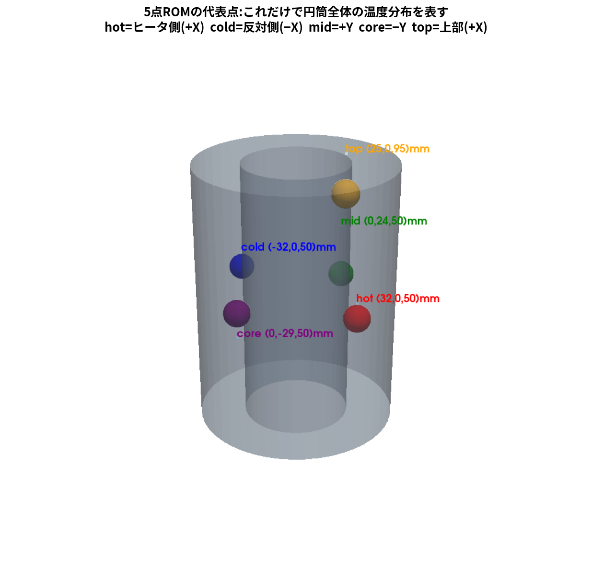
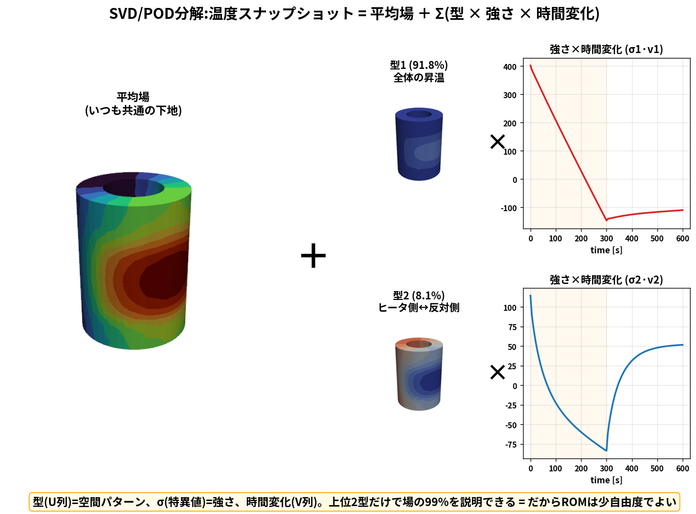
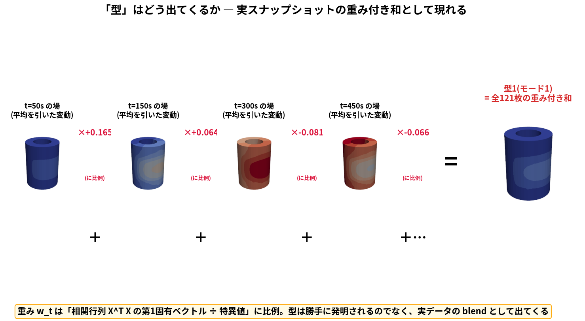
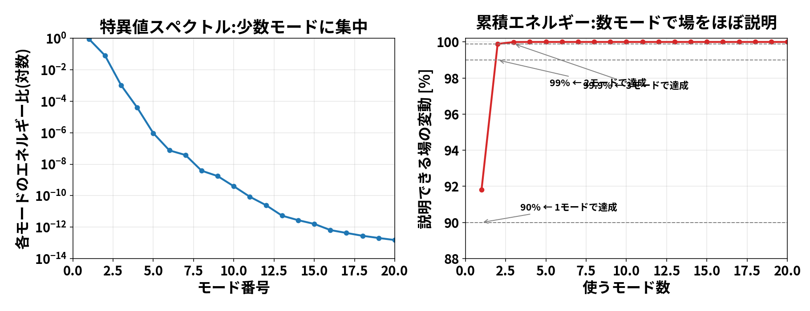
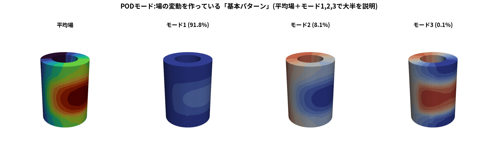
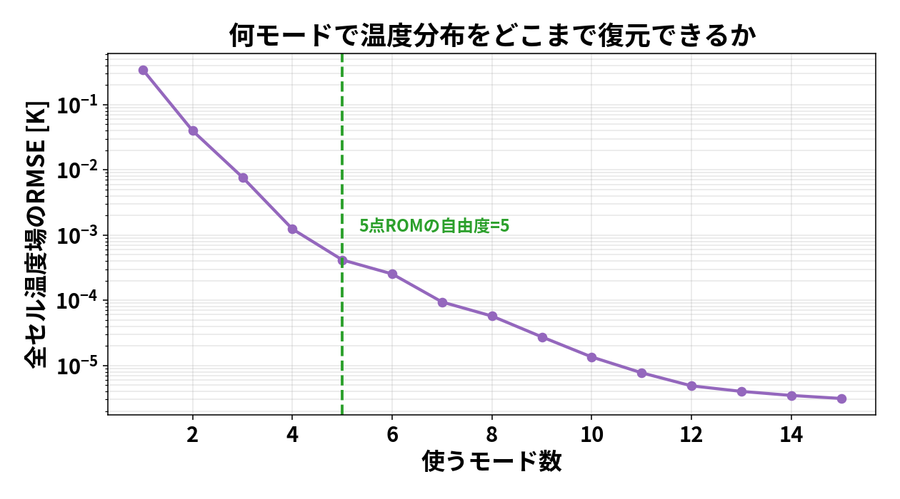
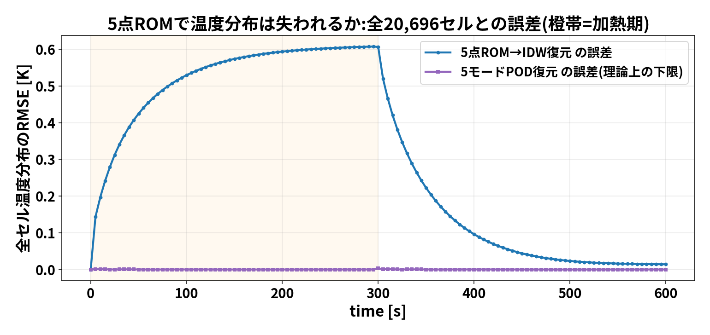
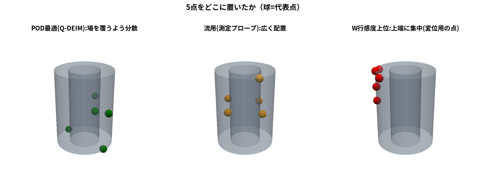
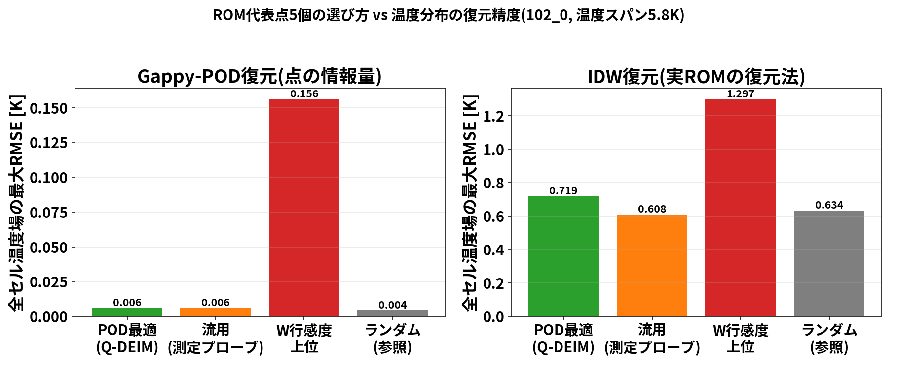
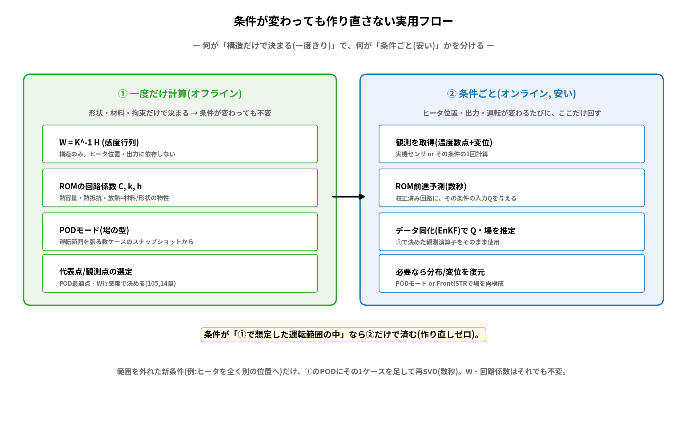

# ROMは何自由度いる？温度分布は失われる？ ― PODで実データ検証

「5点ROMは温度分布を捨てていないか」「代表点は何個必要か」を、
勘ではなく**元のOpenFOAM計算そのもの**を分析して数値で答える。
使う道具が **POD（固有直交分解）** と、その中身の **SVD（特異値分解）**。

元データ: 102_0 の chtMultiRegionFoam 固体温度場（20,696セル）を
0→600秒・5秒間隔で121枚スナップショット。（再現: `run/pod_analysis.py`）

---

## 1. まず5点ROMの「5点」はどこか



円筒を5つのゾーンに分け、各ゾーンを**1点の温度**で代表させている:

| 点 | 位置(mm) | 役割（どの温度差を担うか） |
|---|---|---|
| **hot** | (32, 0, 50) | ヒータ側外周・中央高さ（熱源の温度） |
| **cold** | (−32, 0, 50) | 反対側外周（周方向の温度差を hot と作る） |
| **mid** | (0, 24, 50) | +Y・やや内側（周方向90°方向） |
| **core** | (0, −29, 50) | −Y外周（周方向270°方向） |
| **top** | (25, 0, 95) | ヒータ側の上部（軸方向の温度差を担う） |

考え方は「**その系に立つ温度差の方向を一通り張る**」。ヒータ側↔反対側（hot/cold）、
周方向（mid/core）、上下（top）で主要な勾配をカバーしている。5点の温度から
全セルへは **IDW補間**で温度分布を復元する。

> **IDW（逆距離加重, Inverse Distance Weighting）とは**
> 「知りたい場所の値を、近くの既知点ほど強く効かせた重み平均で埋める」補間法。
> あるセル $x$ の温度は、5つの代表点 $p_i$ の温度 $T_i$ から
> $$T(x)=\frac{\sum_i w_i T_i}{\sum_i w_i},\qquad w_i=\frac{1}{\|x-p_i\|^2}$$
> で決める（重み $w_i$ ＝距離の逆二乗。近い点ほど大きく効く）。
> 長所：単純で速い。短所：代表点の**間**や**外側**は苦手で、勾配が急な所ほど粗くなる
> （§6で最大0.6Kずれる原因がこれ）。

では、この5点で本当に分布が表せているのか？——を以下で検証する。

---

## 2. SVDとは何か（じっくり）

### 2.1 一言でいうと

**特異値分解 (SVD)** は「たくさんの温度スナップショットを、
**少数の代表的な模様（型）× その強さ × 時間変化** の重ね合わせにばらす」操作。
下の図が全てを表している:



温度場（左の複雑な模様）は、実は
**「平均場」＋「型1（全体の昇温）×その時間変化」＋「型2（ヒータ側↔反対側）×その時間変化」**
というたった数個の足し算で、99%再現できてしまう。この「型」を見つけるのがSVD。

### 2.2 式で書くと

全時刻の温度場を1枚の表（行列 $X$）に並べる。列が時刻、行が場所（セル）:

$$
X=\begin{bmatrix} | & | & & | \\ u(t_1) & u(t_2) & \cdots & u(t_{121}) \\ | & | & & | \end{bmatrix}
\quad(20{,}696\text{行}\times121\text{列})
$$

この表はどんな行列でも、必ず次の3つの積に分解できる（線形代数の定理）:

$$X = U\,\Sigma\,V^\top$$

| 記号 | 中身 | 図での対応 |
|---|---|---|
| $U$ の第k列 $\varphi_k$ | **空間パターン（型）**。円筒上の温度模様 | 図の「型1」「型2」の円筒 |
| $\Sigma$ の対角 $\sigma_k$ | **特異値＝その型の強さ**（大きいほど支配的） | 型の下の (%) |
| $V^\top$ の第k行 $a_k(t)$ | その型の**時間変化**（強さが時間でどう動くか） | 図の右の時間グラフ |

### U と V は具体的にどんな行列か

本ケース（$X$ は 20,696セル × 121時刻）だと、各行列の大きさと中身はこう:

| 行列 | 大きさ | 各列が意味するもの | 住んでいる世界 |
|---|---|---|---|
| **$U$** | 20,696 × 121 | 1列 = **空間の型**（全セル上の温度模様1枚） | **空間**（長さ＝セル数） |
| **$\Sigma$** | 121 × 121（対角） | 対角に強さ $\sigma_1\ge\sigma_2\ge\cdots$ | 橋渡し（強さ） |
| **$V$** | 121 × 121 | 1列 = **時間の型**（その模様の121時刻ぶんの振幅） | **時間**（長さ＝時刻数） |

ポイントは **U＝空間側、V＝時間側** という対称性:

- **$U$ の第k列**は「セルごとに1つ値を持つ」＝**円筒上に描ける模様**（だから図で円筒になる）。
  列同士は直交（互いに独立な別方向の模様）で、長さ1に正規化されている。
- **$V$ の第k列**は「時刻ごとに1つ値を持つ」＝**その模様の強さの時間履歴**
  （だから図で時間グラフになる）。こちらも列同士が直交・正規化。
- **$\Sigma$** は両者を結ぶ強さ。第k番目の空間模様 $u_k$ と時間履歴 $v_k$ が、
  強さ $\sigma_k$ でペアになっている。

つまり $X=U\Sigma V^\top$ は「**空間の型 $u_k$ × 強さ $\sigma_k$ × 時間の型 $v_k$**」を
k=1,2,… と足したもの（各項は $\sigma_k\,u_k v_k^\top$ という"模様×時間履歴"の外積）。

つまり温度場は次の**足し算**にほどける:

$$u(x,t)\;\approx\;\bar u(x)\;+\;\sigma_1\varphi_1(x)\,a_1(t)\;+\;\sigma_2\varphi_2(x)\,a_2(t)\;+\cdots$$

- $\bar u(x)$：平均場（いつも共通の下地）
- 第1項：型1の模様 $\varphi_1$ が、時間 $a_1(t)$ に合わせて強くなったり弱くなったり
- 第2項：型2も同様……

各 $\varphi_k$ は**互いに直交**（別方向の独立な模様）で、$\sigma_1\ge\sigma_2\ge\cdots$ と
**強い順に並ぶ**。だから「上位いくつ取れば何%再現できるか」が自動で分かる。

### 2.3 なぜ「型」がエネルギー順に出るのか（少し中身）

「場を最もよく表す型を1本選べ」という問題は、数式にすると
「スナップショット全体に対する当てはまりを最大化する方向 $\varphi$ を探せ」になり、
これは**空間相関行列 $C=XX^\top$ の固有値問題** $C\varphi=\lambda\varphi$ に化ける。
その固有ベクトルが型（$U$の列）、固有値 $\lambda=\sigma^2$ がエネルギー。
SVDはこの固有値問題を、巨大な $C$（2万×2万）を作らずに直接解いてくれる
（＝スナップショット法。空間2万≫時間121なので実際は121×121の小問題で済み、一瞬）。

そして**上位rモードで打ち切った近似が、rローの近似の中で誤差最小**（Eckart–Youngの定理）。
これが「POD＝最もエネルギー効率の良いモード分解」の数学的な裏付け。

### 2.4 計算プログラム

特別なライブラリは不要。numpy標準の1行（内部でLAPACKを呼ぶ）:

```python
Xc = X - X.mean(axis=1, keepdims=True)          # 平均場を引く
U, S, Vt = np.linalg.svd(Xc, full_matrices=False)  # ← これがSVD/モード分解
energy = S**2 / (S**2).sum()                     # 各型のエネルギー比
```

（実装: `run/pod_analysis.py`／図の生成: `run/make_svd_figs.py`）

### 2.5 「型」はどうやって出てきたのか（模様の正体）

「あの円筒の模様はどこから来たのか、勝手に発明したのか？」——いいえ。
**型は、実際のスナップショットたちの"重み付き和（ブレンド）"として出てきます**:



具体的な作り方（スナップショット法）:

1. 121枚のスナップショットの**似ている度合いの表**（相関行列 $G=X^\top X$、121×121）を作る
2. その表の**固有ベクトル $v_k$** を求める（121×121の小さい固有値問題、一瞬）
3. 型は「各スナップショットに $v_k[t]$ を掛けて全部足したもの」：
   $$\varphi_k \;=\; \frac{1}{\sigma_k}\sum_{t} v_k[t]\,\big(u(t)-\bar u\big)$$

図の例だと、型1は「t=50sの場×(+0.165) ＋ t=150s×(+0.064) ＋ t=300s×(−0.081) ＋ …」
という**121枚のブレンド**。だから型は絵空事でなく、必ず実データの中に含まれていた模様。

> **よくある誤解：「各時刻ごとにモード分解している」わけではない。**
> PODは**全時刻で共通の型（固定した空間パターン）を1組だけ**見つける。
> スナップショットのブレンドは、その**固定した型を1回作るための操作**であって、
> 時刻ごとにやり直すものではない。時間で変わるのは**型の強さ（振幅）だけ**:
> $$u(x,t)=\bar u(x)+\underbrace{a_1(t)}_{強さ}\underbrace{\varphi_1(x)}_{型1(固定)}+a_2(t)\varphi_2(x)+\cdots$$
> 型 $\varphi_1(x)$ は t=50sでも t=300sでも**同じ模様**。t=50sでは強さ $a_1$ が大きく、
> t=300s（加熱ピーク）ではさらに大きく…と**係数だけ**が動く。
> （＝上の `svd_decomposition.png` の「型（固定の円筒）× 時間グラフ（強さ）」の関係）
> だから状態はたった数個の「強さ $a_k(t)$」で済み、これがROMの少自由度につながる。

なぜこのブレンドが「一番効率のいい型」になるかというと、
$G$ の固有ベクトルは「スナップショット群の散らばりが最大の方向」を指すから
（＝データ雲の主軸）。第1固有ベクトル＝最も大きく散らばる方向＝型1、という具合。

## 3. PODとは（SVDの使い方）

**POD（固有直交分解, Proper Orthogonal Decomposition）** は、
「時系列の場データを並べた行列にSVDをかけて、**場を最も効率よく表す型を順に取り出す**」手法。
やることは3ステップ:

1. 各時刻の全セル温度を1本の縦ベクトルにして横に並べる
   → スナップショット行列 $X$（20,696行 × 121列）
2. 時間平均を引く（変動成分だけ見る）
3. SVDする → 特異値の大きい順に「場を説明する型（POD モード）」が出る

得られる特異値の大きさが「そのモードが場の変動の何%を担うか」を教えてくれるので、
**「何モード（＝何自由度）で場の何%を再現できるか」が数値で分かる**。

---

## 4. 結果①：この温度場は「たった数モード」でほぼ説明できる



- 左：特異値は**急落**（対数軸で数モードで桁が落ちる）＝少数の型に情報が集中
- 右：累積すると **1モードで90%、2モードで99%、3モードで99.9%**

つまりこの円筒の温度場は、実質的に**2〜3個の数字で表せる**ほど単純
（＝内在自由度がとても小さい）。これが「5自由度のROMで足りる」ことの**数値的な根拠**。

### モードの正体（何を表す型か）



- **モード1（91.8%）**：ほぼ一様な模様＝**全体の昇温**（何度上がったか）
- **モード2（8.1%）**：ヒータ側が赤・反対側が青＝**周方向の温度勾配**
- モード3以降（0.1%以下）：より細かい高次パターン（ほとんど効かない）

物理直観（hot/coldで周方向、topで軸方向…）が、データからも裏付けられている。

## 5. 結果②：何モードで分布をどこまで復元できるか



モード数を増やすと全セル温度分布の復元誤差（RMSE）が下がる。
5モード使えば **0.0003K**（温度変化5.8Kに対し0.005%）まで一致する。
**5自由度は、この場を表すには十分すぎる**ことが分かる。

---

## 6. 結果③：では5点ROMで温度分布は失われるのか？（本題）

> **「5自由度」と「5つの固定点」は別物** ― ここが肝。
> 「5自由度」＝状態が5つの数、という意味。その5つの数の**使い方**が2通りある:
> - **(a) 5つの固定点＋IDW**：5点の温度をそのまま状態にし、距離補間で場を復元 ← 実際の5点ROM
> - **(b) 5つのPODモード**：5つの「型の強さ」を状態にし、モード形状で場を復元
>
> **どちらも同じ5自由度**だが、(a)は最大0.6K、(b)は0.003Kと**200倍違う**。
> だから「5自由度で足りるか？」の答えは**YES**（(b)が証明）だが、
> 「5点＋IDWという使い方」は、その5自由度の実力を出し切れていない、という話。

実際に5点ROM(a)の復元を全セル真値と突き合わせた:



- **青＝5点→IDW復元**：加熱期に誤差が育ち、最大 **0.61K**（t=300s）。冷却で減衰
- **紫＝5モードPOD復元**：ほぼ0（0.003K）＝5自由度で理論上到達できる下限

### 何が言えるか

1. **分布は「ほぼ」保たれるが、少し失われる**：5点ROMは最大0.61K・平均0.31K
   （温度スパン5.8Kの5〜10%）ずれる。完全ではない。
2. **その損失は「自由度が5では足りない」からではない**：同じ5自由度でも、
   最適な型（POD 5モード）なら0.003Kまで一致する。**5という数は十分**。
3. **損失の正体は「固定点＋IDW」という復元の粗さ**：
   代表点を決め打ちしIDWで補間する方式は、最適なPODモードより荒い。
   特に温度勾配が最大になる加熱ピーク（t=300s）で差が開く。
4. **データ同化の精度には十分**：104の同化最終RMSEは0.011K（実機）〜0.004K（ROM）。
   ROM自体の復元誤差0.3K級は、Qとhを推定してから縮むので実用上問題にならない。
   （ROMは「速い前進モデル」であって、最終的な分布は必要ならFrontISTR等で作り直す）

> **結論**: 5点ROMは温度分布を捨てていない（主要な2〜3モードは保持）。
> 失うのは高次の細部で最大0.6K程度。もし精度を詰めたいなら、
> 代表点を増やすより **POD モードを状態にとる（POD-Galerkin ROM）** ほうが効率的。

---

## 7. 「流用した測定点」は最適だったのか？ ― 3つの選び方を実測比較

「代表点は測定プローブを流用しただけ＝たまたまでは？」を確かめるため、
**5点の選び方を変えて、全セル温度場の復元精度を同じ土俵で比べた**
（`run/rom_point_selection.py`）。選び方は3種＋参照:

- **POD最適 (Q-DEIM)**：PODモードに枢軸QRを当て、場を最も覆う補間点を選ぶ（理論最適）
- **流用（測定プローブ）**：現行の5点（hot/mid/cold/top/core）
- **W行感度上位**：105のW=K⁻¹H行感度が高い点（＝変位が温度によく応答する点）
- ランダム（参照）

### どこに置かれたか



POD最適と流用は**場全体に散る**。一方W行感度上位は**上端リムに固まる**
（W行感度は「自由端の変位応答」を測る指標なので、拘束から遠い上端に集中する）。

### 復元精度



| 選び方 | Gappy-POD復元(情報量) | IDW復元(実ROM) |
|---|---|---|
| POD最適 (Q-DEIM) | 0.006 K | 0.72 K |
| **流用（測定プローブ）** | **0.006 K** | **0.61 K** |
| W行感度上位 | 0.156 K | 1.30 K |
| ランダム | 0.004 K | 0.63 K |

### 3つの発見（正直な結論）

1. **流用点はPOD最適と同等**（むしろIDWでは最良）。「たまたま良かった」のではなく、
   **場の内在自由度が2〜3と小さいので、広く散った5点なら何でもほぼ最適**になる。
   流用プローブは物理直観で広く配置されていたので、この条件を満たしていた。
2. **W行感度は温度代表点には不向き**（Gappyで26倍・IDWで2倍悪い）。
   上端に固まって場のカバレッジが悪いため。**W行感度は「変位計をどこに貼るか」の指標であって、
   「温度分布をどの点で代表させるか」の指標ではない**——別物なので流用してはいけない。
3. **温度代表点を最適に選ぶなら POD（Q-DEIM）** が正しい道具。ただし今回の系では
   流用点で既に十分で、差はつかなかった。

> 補足：当初「W行感度が高い場所は温度代表点としても有力かも」と考えたが、
> この実験で**温度場に関しては誤り**（W行感度は変位観測点の指標であって
> 温度代表点の指標ではない）と判明した。§8の指針はこの結果に沿って書いている。

---

## 8. 実務への持ち帰り：代表点／モード数の決め方

1. **元計算のスナップショットにPODをかけて累積エネルギーを見る** → 必要モード数が数値で出る
   （この系は2〜3モードで99%。だから5点で余裕）
2. **物理直観の代表点で作ったら、必ずPOD/全セルと突き合わせて損失を測る**
   （今回は最大0.6K＝スパンの1割と定量化できた）
3. **代表点を最適化したいなら POD（Q-DEIM）** で選ぶ。場を広く覆う点が出る。
   逆に**W行感度は温度代表点には使わない**（§7で実証。あれは変位観測点の指標）
4. **精度が足りなければ**：固定点を増やすより POD モードを状態にとるROM（POD-Galerkin）へ

再現: `OMP_NUM_THREADS=4 python3 run/pod_analysis.py` →
`python3 run/rom_point_selection.py`
（102_0のOpenFOAM時刻ディレクトリを読む。結果は `results/pod_summary.yaml`, `rom_point_selection.yaml`）

---

## 9. 条件が変わったら全部やり直し？ ― 実用計算フロー

「ヒータの位置や運転条件が変わったら、この計算は全部やり直しでは？」——**大半はやり直し不要**。
鍵は「**何が構造だけで決まり（一度きり）、何が条件ごとか（安い）**」を分けること。



### ① 一度だけ計算する（オフライン・条件によらない）

これらは**形状・材料・拘束だけ**で決まり、ヒータ位置や出力が変わっても不変:

| 計算 | なぜ条件によらないか |
|---|---|
| **W = K⁻¹H**（感度行列） | 剛性K・熱ひずみHは構造の性質。熱源の位置・強さと無関係 |
| **ROMの回路係数 C, k, h** | 熱容量・熱抵抗・放熱＝材料と形状の物性。入力Qの場所が変わっても回路自体は同じ |
| **PODモード（場の型）** | 運転範囲を張る数ケースのスナップショットから作れば、範囲内は使い回せる |
| **代表点／観測点の選定** | POD最適点・（変位なら）W行感度で一度決めれば固定 |

### ② 条件ごとに回す（オンライン・安い）

ヒータ位置・出力・運転が変わるたびに動かすのは**ここだけ**:

1. その条件の**観測を取得**（実機センサ、またはその条件で1回だけ計算）
2. 校正済みROMに**その条件の入力Q**を与えて前進予測（数秒）
3. **データ同化（EnKF）**でQ・温度場を推定（①で決めた観測演算子をそのまま使う）
4. 必要なら分布・変位を復元（PODモード or FrontISTR）

### 「やり直し」が必要になる唯一のケース

②で扱う条件が**①で想定した運転範囲の中**なら、①はそのまま。作り直しゼロ。

範囲を**外れた新条件**（例：ヒータを全く別の位置に移す）のときだけ、
**①のPODにその1ケースを足して再SVD**（数秒）すれば型が更新される。
それでも **W・ROM回路係数は不変**（構造が変わらない限り）。
だから「新しい運転点ごとにOpenFOAMをフル実行し直す」必要はない、というのが実用上の要点。

> **まとめ**：重い物理（W・ROM係数・PODモード）は構造由来なので**資産として一度作れば使い回せる**。
> 条件変化で走るのは軽いDAループだけ。これが「実験前に設計し、運転中はリアルタイムで回す」を
> 可能にする計算フロー。
