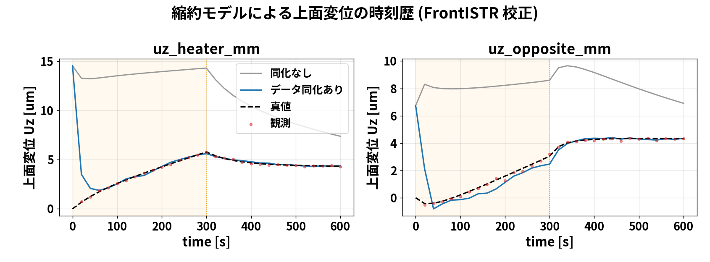

# 学会発表資料：温度・変位観測を用いた熱状態推定

## 01. 少数の温度・変位観測から
温度分布と発熱量を推定できるか

**中空円筒を対象とした104の数値実験**

初期温度とヒーター発熱量を外した予測を、観測で補正する

OpenFOAM × FrontISTR × EnKF

発表者・所属：［記入欄］

**要点：知りたい量は、円筒内部を含む温度分布と、実際のヒーター発熱量。**

出典：対象：sample/104_0_openfoam_frontistr_da_enkf

---

## 02. 第1部　OpenFOAM ＋ FrontISTR でデータ同化

**実ソルバで温度と変位を観測し、状態を補正（正確だが重い）**

**要点：**

出典：104ケースの設定・実装を基に作成

---

## 03. 出発点：内部の温度と、実際の発熱量がわからない

円筒を片側からヒーターで温める状況を考える。

- **直接測れる量**：表面近傍の温度と、上面の伸び。
- **知りたい量**：内部を含む温度分布と、ヒーター発熱量Q。
- **不明な条件**：初期温度とQが、正確にはわからない。

そのまま計算すると、予測する温度と変形が正解から外れる。

**要点：「測れる数か所」から「測れない全体と入力」を推定したい。**

出典：README.md; docs/02_beginner_guide.md

---

## 04. 解析対象：片側から加熱する中空円筒

| 項目 | 設定 |
|---|---|
| 外径／内径 | 75 mm／40 mm |
| 高さ | 100.5 mm |
| 真の初期温度 | 20 ℃（293.15 K） |
| 真の発熱量 | 15 W |
| 固体温度の自由度 | 20,696セル |

**要点：熱流動解析と構造解析のメッシュ間で、温度を受け渡す。**

出典：102_1/python/run_thermal_expansion.py; 104/results/openfoam_fem_enkf_summary.yaml

---

## 05. 104で確かめたいこと：外した予測を修正できるか

**初期温度とQを間違えていても、温度・変位の観測を使えば、温度分布とQを正解に近づけられるか？**

| 確かめること | 判定に使う量 |
|---|---|
| 温度分布を補正できるか | 全セルの温度場RMSE |
| 発熱量も推定できるか | Qの推定値と真値15 Wとの差 |
| 連成して繰り返せるか | 予報→同化→再開の動作 |

**要点：目的はソルバをつなぐことだけでなく、未知の温度場とQを推定すること。**

出典：daof/of_fem_twin.py; results/openfoam_fem_enkf_summary.yaml

---

## 06. なぜ変位も使うのか：温度とは別の手がかりを得たい

- 103では、温度観測だけを使っていた。
- 104では、**熱膨張による上面変位も同化に使う**。
- 円筒全体の温度の高さや偏りは、伸びや傾きに影響する。
- 温度計だけでは得にくい情報を、変位から得ることを狙う。

**温度のみより良いか、という比較は今回まだ行っていない。**

**要点：104の追加点は変位の利用。その追加効果の定量評価は次の課題。**

出典：README.md; docs/00_temp_displacement_da.md; fem/fem_obs.py

---

## 07. OpenFOAMで何を計算したか：固体の温度場

**chtMultiRegionFoam ＝ 固体・流体・輻射を同時に解く連成ソルバ**（熱伝導だけではない）:

- **固体**：熱伝導 <eq>\rho c_p\,\partial_t T=\nabla\cdot(k\nabla T)</eq>（ヒータ面に発熱Q）
- **流体**：ナビエ・ストークス＋エネルギー＋浮力（自然対流、式は次ページ）
- **輻射**：fvDOM（RTE）

**出力：固体全 20,696 セルの温度場 T(x,t)。** 下は0→600sの断面アニメ（加熱→冷却）。


**要点：chtMultiRegionFoamは固体伝導＋流体NS＋輻射の連成。出力は固体温度場。**

出典：sample/102_0（CHT）

---

## 08. 流体の支配方程式（OpenFOAM）

流体側は**連続・運動量（ナビエ・ストークス＋浮力）・エネルギー**を解く：

<eq>\nabla\cdot(\rho\mathbf{U})=0</eq>

<eq>\partial_t(\rho\mathbf{U})+\nabla\cdot(\rho\mathbf{U}\mathbf{U})=-\nabla p+\nabla\cdot\tau+\rho\mathbf{g}</eq>

<eq>\partial_t(\rho h)+\nabla\cdot(\rho\mathbf{U}h)=\nabla\cdot(\alpha_{eff}\nabla h)+S_{rad}</eq>

**要点：流体はNS＋浮力＋エネルギー。浮力項ρgが自然対流を生む。**

出典：sample/102_0（CHT・流体）

---

## 09. OpenFOAMは流体も解く：自然対流の流速分布

ヒータで温まった壁面付近に上昇流（自然対流プルーム）が生じ、固体を冷やす。

断面の流速 |U|（最大約 0.1 m/s、矢印=向き）を 0→600 s で表示（加熱0-300s→遮断300-600s）。


**要点：流体もNSで解いており、自然対流が温度場に効く。**

出典：sample/102_0 の流体U(0-600s)

---

## 10. FrontISTRで何を計算したか：熱膨張の変位

**FrontISTR ＝ 変形（変位）の計算**

OpenFOAMの温度を入力に線形熱弾性静解析。熱ひずみ <eq>\varepsilon_{th}=\alpha(T-T_{ref})</eq>、つり合い <eq>\nabla\cdot\sigma=0,\ \sigma=C:(\varepsilon-\varepsilon_{th})</eq> を底面固定で解く。

**出力：各節点の変位 U（特に上面 Uz）。** 温度→変位の一方向。


**要点：FrontISTRは温度から変形（変位）を計算するソルバ。**

出典：sample/102_1

---

## 11. 連成前進モデルの全体像（どのソルバが何を解くか）

各スライドの支配方程式を一覧にすると：

| ソルバ | 領域 | 解く式 |
|---|---|---|
| OpenFOAM | 流体 | 連続・運動量(NS＋浮力)・エネルギー |
| OpenFOAM | 固体 | 熱伝導 ＋ ヒータ発熱 Q |
| OpenFOAM | 輻射 | fvDOM（放射伝達方程式 RTE） |
| FrontISTR | 構造 | 熱膨張・線形静解析 |

**連成の向き：** 熱流体で温度 T → その温度で FrontISTR が変位 U（一方向）。

**要点：OpenFOAMが熱流体＋輻射、FrontISTRが変形。温度→変位の一方向連成。**

出典：104の連成(daof・fem)

---

## 12. 構造解析の物性と支持条件

| 項目 | 設定 |
|---|---|
| ヤング率／ポアソン比 | 205 GPa／0.3 |
| 線膨張係数 | 1.2 × 10⁻⁵ /K |
| 熱ひずみの基準温度 | 293.15 K |
| 変位拘束 | FIX_XYZ、FIX_YZ、FIX_Zの節点群 |

物性・支持条件は固定した既知条件として扱う。

**要点：変位を温度の手がかりにする際、支持条件と基準温度も推定に影響する。**

出典：102_1/config/material_properties_steel.yaml; python/fistr_case.py: write_cnt()

---

## 13. 観測ベクトル：温度2成分と変位2成分

<eq>y=[T_{hot},T_{cold},u_{z,heater},u_{z,opposite}]^{\mathsf{T}}</eq>

| 観測 | 定義 | ノイズ標準偏差 |
|---|---|---|
| hot / cold温度 | 指定座標の最近傍固体セル | 0.30 K |
| ヒータ側／反対側Uz | 各側の上面節点群の平均 | 10⁻⁴ mm＝0.1 µm |

**要点：変位の「2点」は、実装上は2つの上面節点群の平均値である。**

出典：openfoam/da_openfoam_config.yaml; fem/fem_obs.py; 102_1/run_one_time()

---

## 14. どの点を観測に、どの点を確認に使ったか

**観測（EnKFに渡す4点）**
- 温度2点：hot（+X ヒータ側）・cold（−X 反対側）… 赤
- 変位2点：上面 Uz（heater側・opposite側）… 橙

**確認（未観測、DAの当たりを検証）**
- mid（+Y 90°）・top（上面近傍）・core（肉厚中心）… 青

未観測点が真値に一致するかで、データ同化の効果を確かめる。


**要点：観測=温度2点＋変位2点。未観測のmid/top/coreで効果を検証する。**

出典：104のnode_locations

---

## 15. 状態ベクトル：温度場とQを一緒に更新

<eq>z=[T_0,T_1,\ldots,T_{20695},Q]^{\mathsf{T}}</eq>

- 1メンバーあたり **20,697成分**。
- 温度：K、発熱量：W。
- Qは各予報区間では一定とし、同化時に更新する。
- 流体場は各メンバーの計算状態を継続する。

**要点：温度と観測の相関だけでなく、Qと観測の相関も利用する。**

出典：daof/of_fem_twin.py: n_aug, iQ, Z; of_case.set_solid_state()

---

## 16. 観測演算子：温度場から予報観測を作る

```text
各メンバーの固体温度場
   ├─ 最近傍セルの抜き出し ──────────→ 温度2成分
   └─ IDW補間 → FrontISTR静解析 → 上面平均 → 変位2成分
                                      ↓
                                 Yf の1行に格納
```

EnKFには、各メンバーで評価した **Yf** を渡す。

**要点：観測演算子を巨大な行列として明示せず、ソルバ評価で実装する。**

出典：daof/of_fem_twin.py: member_obs(); fem/fem_obs.py: displacement_obs()

---

## 17. 平均と偏差をメンバー方向に計算する

<eq>\bar{z}_j=\frac{1}{N}\sum_{i=1}^{N}z_j^{(i)},\quad dZ_{ij}=z_j^{(i)}-\bar{z}_j</eq>

```python
zbar = Zf.mean(axis=0)
ybar = Yf.mean(axis=0)
dZ = Zf - zbar
dY = Yf - ybar
```

**要点：同じセル・同じ観測成分の5個の値から平均とばらつきを得る。**

出典：dacore/enkf.py: enkf_update(); Evensen (2003)

---

## 18. 偏差を1.05倍して、過度な収縮を緩和する

<eq>z^{(i)}\leftarrow\bar{z}+1.05(z^{(i)}-\bar{z})</eq>

- 平均値を変えず、平均からの差を拡大する。
- 渡された予報観測Yfの偏差も1.05倍する。
- 共分散は拡大前の **1.05²＝1.1025倍**。
- この段階でFrontISTRを再実行はしない。

**要点：設定値1.05は、このコードでは「偏差」に掛ける倍率である。**

出典：openfoam/da_openfoam_config.yaml: inflation; dacore/enkf.py

---

## 19. 共分散は N−1＝4 で割る

<eq>C_{zy}=\frac{dZ^{\mathsf{T}}dY}{N-1},\qquad C_{yy}=\frac{dY^{\mathsf{T}}dY}{N-1}</eq>

```python
C_zy = dZ.T @ dY / (n_ens - 1)  # 20,697 × 4
C_yy = dY.T @ dY / (n_ens - 1)  # 4 × 4
```

Cyyの対角は各観測成分の標本分散、非対角は成分間の標本共分散。

**要点：温度場・Qと観測の「一緒に変わる関係」を、5ケースから推定する。**

出典：dacore/enkf.py: C_zy, C_yy

---

## 20. 観測誤差共分散Rは、想定した測定誤差

<eq>R=\mathrm{diag}(0.30^2,0.30^2,10^{-8},10^{-8})</eq>

| 成分 | 分散の単位 | 設定 |
|---|---|---|
| 温度 | K² | 0.09 |
| 変位 | mm² | 10⁻⁸ |

異なる観測の測定誤差は、ここでは無相関と仮定する。

**要点：Cyyは予報のばらつき、Rは測定誤差。由来が異なる。**

出典：daof/of_fem_twin.py: R = np.diag(...)

---

## 21. カルマンゲインを求め、各メンバーを更新

<eq>K=C_{zy}(C_{yy}+R)^{-1}</eq>
<eq>z_a^{(i)}=z_f^{(i)}+K(y+\varepsilon^{(i)}-y_f^{(i)})</eq>

観測摂動：各メンバーで ε⁽ⁱ⁾ ∼ N(0, R) を生成。

実装は逆行列を作らず、`np.linalg.solve()` で4×4の系を解く。

**要点：平均だけでなく、5個のメンバーそれぞれを補正する。**

出典：dacore/enkf.py: eps, innov, gain_T, Za; Evensen (2003)

---

## 22. 同化後の書き戻しが、次の予報に反映される

```python
Za = enkf_update(Z, y, None, R, rng,
                 inflation=1.05, Yf=Yf)
# 温度とQの範囲を制限した後
for i, m in enumerate(members):
    of_case.set_solid_state(m, t1, Za[i, :Nc], Za[i, iQ])
```

温度：250〜400 K、Q：0〜60 Wにクリップする。

**要点：5ケースを平均場で置き換えず、それぞれの同化後状態から再開する。**

出典：daof/of_fem_twin.py; daof/of_case.py: set_solid_state()

---

## 23. 発熱量 Q はどう求めたか（前ページの H・K を使う）

Qは直接測れない。**Qを状態に入れ、温度との相関から逆算**する（既出のH・R・Kをそのまま使う）。

・状態にQを含める：<eq>z=[T_1,\dots,T_{N_c},\,Q]</eq>。各メンバーは違うQ→「Q大→温度高」の相関。

・その相関は共分散 <eq>C_{zy}=\frac{1}{N-1}\sum_i(z_f^{(i)}-\bar z)(y_f^{(i)}-\bar y)^{T}</eq> の**Qの行** cov(Q,T) に入る。

・前ページの <eq>K=C_{zy}(C_{yy}+R)^{-1}</eq> の**Qの行**が K_Q（1×4）:

<eq>K_Q=[C_{zy}]_{Q,:}\,(C_{yy}+R)^{-1}</eq>（[C_{zy}]_{Q,:}=Qと各観測の共分散の行）

<eq>Q_a^{(i)}=Q_f^{(i)}+K_Q\,(y+\varepsilon^{(i)}-H(z_f^{(i)}))</eq>

cov(Q,T)>0 なので、温度が観測より高すぎ→Q下げ、低すぎ→Q上げ。

**要点：Qは温度との相関で逆算。10.3→14.4 W（真値15）へ収束（加熱中のみ推定可）。詳細=docs/10。**

出典：dacore/enkf.py・of_fem_twin.py

---

## 24. フォルダ構成（実ソルバ版）

実ソルバ版のデータ同化はこの構成（104フォルダ内）：

- `daof/` … OpenFOAM連成（ケース生成・実行・場の読み書き・双子実験ドライバ）
- `fem/` … FrontISTR 変位の観測演算子
- `openfoam/run_fem_enkf/` … 真値＋5メンバーのOpenFOAMケース（**計算現場**）
- `run/run_openfoam_fem_enkf.py` … 実行の入口
- `dacore/enkf.py` … **EnKF解析（ROMと共通）**

**要点：実ソルバ版=daof+fem+openfoam。EnKF解析はdacore/enkf.pyを共有。**

出典：104のフォルダ

---

## 25. 計算の流れ：温度→変位→観測→補正

① OpenFOAMで温度場 → ② その温度からFrontISTRで変位。

観測は **温度2点（温度場から直接）＋ 変位2点（FrontISTR）**。

③ EnKFがこの4観測で状態（温度場とQ）を補正 → ④ 書き戻して次サイクルへ。真値＋5メンバーで繰り返す。


**要点：温度2点は温度場から直接、変位2点はFrontISTR経由でEnKFへ。**

出典：104の連成構成

---

## 26. 5ケースを順番に前進し、そろってから同化する

```text
0 → 10 s   member_00: OpenFOAM → FrontISTR
            member_01: OpenFOAM → FrontISTR
            …
            member_04: OpenFOAM → FrontISTR
            ↓ 5個の結果から EnKF 更新・各ケースへ書き戻し
10 → 20 s  同じ5ケースを継続し、再び EnKF 更新
```

`subprocess.run(..., cwd=member_dir)` で各計算の終了を待つ。

**要点：5メンバーは逐次実行。同じ5ケースを2区間にわたり継続する。**

出典：daof/of_fem_twin.py: for i, m in enumerate(members); daof/of_case.py: run_window()

---

## 27. 何をしたか②：5通りの予測を、観測で2回補正した

1. 初期温度とQを変えた**5ケース**を用意する。
2. 各ケースをOpenFOAMで前進し、FrontISTRで変位を求める。
3. 予測した温度・変位と観測を比較し、**EnKFで温度場とQを更新**する。
4. **10秒後と20秒後**に更新し、温度場の誤差とQを評価する。

**要点：5つの予測のばらつきから、観測のずれを全温度場とQの補正に変える。**

出典：daof/of_fem_twin.py; dacore/enkf.py

---

## 28. 計算回数とコストの構造

| 対象 | OpenFOAMの区間計算 | FrontISTR静解析 |
|---|---:|---:|
| 5メンバー × 2区間 | 10回 | 10回 |
| 真値 × 2区間 | 2回 | 2回 |
| 合計 | **12回** | **12回** |

同化処理の行列計算に加えて、各メンバーで物理ソルバを評価する。

**要点：計算時間の評価では、メンバー数×区間数×ソルバ評価を数える。**

出典：daof/of_fem_twin.py; openfoam/run_fem_enkf/member_*/log.run_*

---

## 29. EnKFへ渡す配列のサイズ

| 配列 | 行 × 列 | 内容 |
|---|---|---|
| Zf | 5 × 20,697 | 全セル温度＋Q |
| Yf | 5 × 4 | 各ケースの予報観測 |
| y | 4成分 | 合成観測 |
| Za | 5 × 20,697 | 同化後の全メンバー |

**行＝メンバー、列＝同じ物理量**。

**要点：平均を取る方向はメンバー方向。空間平均や時間平均ではない。**

出典：daof/of_fem_twin.py: Z, Yf; dacore/enkf.py: enkf_update()

---

## 30. 温度場RMSEは、2回の同化で大きく低下

- 初期：**7.609 K**
- 10秒：0.03081 K
- 20秒：**0.02030 K**

5メンバー・単一シードの結果。


**要点：この双子実験では、初期の大きな温度ずれを補正できた。**

出典：results/openfoam_fem_enkf_history.csv（発表用に再描画）

---

## 31. 発熱量Qは、真値15 Wの近傍へ

- 初期平均：10.264 W
- 10秒：16.359 W
- 20秒：**14.444 W**

最終偏差：−0.556 W
（真値に対し約−3.71%）


**要点：Qを直接観測せず、温度・変位との関係から推定した。**

出典：results/openfoam_fem_enkf_history.csv; summary.yaml（発表用に再描画）

---

## 32. 3次元温度分布：同化後と真値を比較

初期平均は **t＝0秒**、同化後と真値は **t＝20秒**。同化なし20秒の比較ではない。


**要点：温度分布の改善は、観測点以外を含むセル全体のRMSEでも評価した。**

出典：run/plot_da_temperature_field3d.py; fields/ensmean_t0.npy, ensmean_t20.npy, truth_final.npy

---

## 33. 予報変位：次の区間ではメンバーの散らばりが縮小

10秒予報：−10.70〜32.48 µm。20秒予報：0.61〜0.97 µm（ヒータ側上面）。


**要点：10秒の同化後状態から進めた20秒予報では、変位のばらつきも小さい。**

出典：openfoam/run_fem_enkf.log（予報値の丸め値から再描画）

---

## 34. 補正した平均温度場から、変位分布も再計算

温度場の補正を構造応答へ反映。図は保存温度場を使った**後処理のFrontISTR解析**。


**要点：同化ループ中の予報変位と、同化後平均場からの再解析を区別する。**

出典：run/plot_da_displacement_field.py

---

## 35. 結果の数値を一表で確認する

| 時刻 [s] | 温度場RMSE [K] | Q平均 [W] | Q標準偏差 [W] |
|---|---:|---:|---:|
| 0 | 7.60909 | 10.2642 | 4.81694 |
| 10 | 0.0308066 | 16.3594 | 2.94875 |
| 20 | 0.0202975 | 14.4442 | 0.878855 |

真値Q＝15 W。10秒・20秒は同化後。

**要点：温度場の誤差と、Qの推定値・散らばりを別々に評価する。**

出典：results/openfoam_fem_enkf_history.csv

---

## 36. 第1部まとめ：正確だが計算が重い

- 温度2点＋変位2点の観測で、固体温度場（20,696セル）とQを補正（**RMSE 7.6→0.02 K、Q→15 W**）。
- ただし1メンバー数分×5×サイクルで、**20秒ぶんでも数十分**。0→600 s 全時間は現実的でない。
- → 同じデータ同化を**軽い代用モデル（ROM）**でも回せるようにする（第2部）。

**要点：実ソルバ版は正確だが重い。全時間・多数試行には軽いROMが要る。**

出典：results/openfoam_fem_enkf_summary

---

## 37. 第2部　ROM にした

**同じ方程式を5点に縮約した軽い前進モデル（数秒）**

**要点：**

出典：104ケースの設定・実装を基に作成

---

## 38. 何の方程式を、どうROMにしたか

実ソルバは重いので、**同じ物理を5点に縮約**した軽い前進モデル(ROM)を作る。

固体の熱伝導PDEを有限体積で粗くし、5つの代表ノードの常微分方程式にする：

<eq>C_i\frac{dT_i}{dt}=\sum_j K_{ij}(T_j-T_i)-h(T_i-T_{air})+Q_i(t)</eq>

係数 C・K・**h は102_0の温度履歴に最小二乗で校正**（h≈0.0236 W/K、残差0.012 K）。0→600 s が数秒。

**要点：同じ熱収支をセル2万→5点に粗くした軽い版。C・K・hは校正で決定。**

出典：104のdacore

---

## 39. ROMの発想（図解）：重いPDEを5点のODEに縮約し校正する

① 本物は20,696セルのPDE（重い）→ ② 代表5点を熱の通り道でつなぐ → ③ 本物に最小二乗校正。

「同じ熱収支を粗く離散化したもの」なので、校正すれば本物に一致（残差0.012 K）、0→600 sが数秒。


**要点：重いPDEを『代表5点＋熱の通り道』のODEに縮約し、本物に校正する。**

出典：104のdacore

---

## 40. ROM：温度を5つの代表ノードで近似する

- hot：ヒータ側、mid：側面中間、cold：反ヒータ側。
- top：上面近傍、core：内部の潜在ノード。
- 熱容量と熱コンダクタンスを持つ熱回路としてモデル化。
- OpenFOAMの温度履歴に合わせて係数を校正。

**要点：同じ熱収支の形を使う低次元の代用モデルで、反復検証を軽くする。**

出典：dacore/cht_rom.py; dacore/calibrate.py; docs/03_rom_derivation.md

---

## 41. ROMの熱収支と校正

<eq>C_i\frac{dT_i}{dt}=\sum_j K_{ij}(T_j-T_i)-h(T_i-T_{air})+\dot{Q}_i</eq>

- 校正対象：OpenFOAMの4点温度履歴。
- 温度履歴の当てはめRMSE：**0.01189 K**。
- 総熱容量：約1191 J/K。
- この誤差は**校正データへの当てはめ誤差**。

**要点：校正誤差と、未知条件に対する予測精度は分けて評価する。**

出典：config/rom_calibrated.yaml; dacore/calibrate.py

---

## 42. ROMで温度・変位の分布を作る手順

5点しか持たないが、**逆距離加重補間(IDW)**でメッシュ全体へ再構成できる。

重み行列 W（節点数×5、行和1）を1度作り、各時刻は行列積1発：

<eq>T_{mesh}=W\,T_{node},\quad W_{p,i}=\frac{1/|p-x_i|^2}{\sum_j 1/|p-x_j|^2}</eq>

変位は再構成温度をFrontISTRに通す（または線形写像 <eq>u_z=D(T-T_{ref})</eq>）。分布・アニメを数秒で生成。

**要点：5点→IDWで全メッシュに再構成。分布・動画もROMで作れる（粗いが高速）。**

出典：104のexport_paraview

---

## 43. ROM版のアンサンブルは60行×7列

| 項目 | 内容 |
|---|---|
| 状態 | 5温度＋発熱倍率q＋放熱h |
| 同化用 | Zda：60×7 |
| 比較用 | Zfree：同じ初期値の60×7 |
| 更新観測 | hot・coldの温度のみ |
| 共分散の分母 | 60−1＝59 |
| 偏差拡大倍率 | 1.02 |

**要点：60個のケースフォルダではなく、メモリ上の配列として前進する。**

出典：dacore/twin_fem.py; ensemble.py; cht_rom.py; config/da_config.yaml

---

## 44. フォルダ構成（ROM版）

軽いROM版はこの構成（`dacore/` だけで完結）：

- `dacore/cht_rom.py` … 5点の前進モデル（常微分方程式）
- `dacore/calibrate.py`／`displacement.py` … 102_0・102_1へ校正
- `dacore/twin_fem.py` … 双子実験ドライバ、`dacore/enkf.py` … **EnKF解析（共通）**
- `run/run_rom_fem.py` … 実行の入口（数秒）

実ケースフォルダは作らず、メモリ上のNumPy配列（60×7）で計算する。

**要点：ROM版=dacore/だけで完結（純NumPy、実ケース不要）。EnKFは共通。**

出典：104のdacore

---

## 45. ROM：未観測ノードの温度も真値に近づく

同化するのはhot・cold。mid・top・coreは観測に含めない。0〜300秒で加熱し、300〜600秒で遮断。


**要点：温度観測とモデルの結合を通じて、未観測の代表温度を推定する。**

出典：run/run_rom_fem.py; dacore/twin_fem.py

---

## 46. ROM：同化あり・なしの誤差を比較

再計算による確認値

- 初期：9.738 K
- 同化あり最終：**0.03885 K**
- 同化なし最終：**2.614 K**

同じ初期アンサンブルから比較。


**要点：ROMでは、同化なしの比較軌道に対して温度推定が改善した。**

出典：dacore/twin_fem.py: run_rom_fem_twin(); config/da_config.yaml

---

## 47. ROMの変位は、同化後温度からの予測

変位は校正済みの線形写像 **u＝D(T−Tref)** で算出。図中の変位観測は表示用で、更新には使わない。



**要点：ROMの変位精度を、変位観測追加の同化効果として解釈しない。**

出典：dacore/twin_fem.py; displacement.py; config/displacement_operator.yaml

---

## 48. ROM：温度分布の時刻歴（データ同化 vs 真値, 0→600s）

でたらめ初期からデータ同化した温度分布（左）と真値（右）を、加熱→冷却の全過程で比較。5点をIDWでメッシュに再構成して表示。同化後は分布まで真値に一致する。


**要点：でたらめ初期→同化で温度分布が真値に一致（全時間）。**

出典：104のmake_da_gifs

---

## 49. ROM：変位分布の時刻歴（データ同化 vs 真値, 0→600s）

同化後の温度から計算した変形（左）と真値の変形（右）。温度が真値に一致するにつれ、そこから決まる変位分布も真値に一致していく。


**要点：温度が直れば、そこから決まる変位分布も真値に一致。**

出典：104のmake_da_gifs

---

## 50. ROMでも変位を同化に使えた（2つのバグ修正後）

当初は発散したが、原因は実装バグ2つ：①校正Dが悪条件→IDW→FrontISTRの演算子Mに、②観測を M(T-T_ref) とアフィンで評価。修正後は変位が効く：

温度2点のみ 0.076 K → **温度2点＋変位 0.004 K（18倍）**、温度1点のみ 0.236 K → **温度1点＋変位 0.002 K（100倍）**。温度点が少ないほど効く。


**要点：正しい演算子M＋アフィン評価なら、ROMでも変位は効く（特に温度点が少ないほど）。**

出典：104のcompare_rom_disp

---

## 51. 第2部まとめ：軽くて全時間を可視化できる

- 同じEnKFをROMで回すと **0→600 s が数秒**。加熱→冷却の全ストーリーを可視化。
- 未観測点も真値に収束（**RMSE 9.7→0.04 K**）。分布・アニメも5点→補間で生成。
- 注意：5点縮約なので分布は粗い。細かい分布は実ソルバ版が正確。

**要点：ROMは軽く全時間を見られる。分布は粗いが仕組み理解に最適。**

出典：results/rom

---

## 52. 全体のまとめ

**少数観測で温度場とQを推定。実ソルバ=正確・重い/ROM=軽い・全時間**

**要点：**

出典：104ケースの設定・実装を基に作成

---

## 53. 全体のまとめ

- **目的**：少数の温度・変位観測から、円筒内部を含む温度分布と発熱量Qを推定。
- **手法**：アンサンブルカルマンフィルタ（EnKF）。前進モデルを観測で補正。
- **2つの前進モデル**：OpenFOAM＋FrontISTR（実ソルバ・正確・重い）／ ROM（5点・軽い・全時間）。
- **結果**：でたらめな初期状態から、数点観測で温度場・Q・変位が真値へ収束。
- **使い分け**：正確な分布→実ソルバ、理解と全時間可視化→ROM。

**要点：少数観測＋EnKFで温度場とQを推定。実ソルバとROMを使い分ける。**

出典：104全体

---

## 54. 目的への答え：この条件では温度場とQを推定できた

**問い**：初期温度とQを外しても、少数観測から補正できるか。

**実施**：温度2＋変位2を用い、5ケースをEnKFで2回更新した。

**結果**：温度場RMSEは7.609→0.0203 K、Qは14.444 W（真値15 W）。

**次の問い**：変位を使うと、温度のみよりどれだけ改善するか。

**要点：温度・変位を併用した推定の成立を確認し、観測追加の効果検証へ進む。**

出典：results/openfoam_fem_enkf_summary.yaml; 本資料の検証範囲

---

## 55. 現在の結果から言えること

- OpenFOAM → FrontISTR → EnKF → 書き戻しの処理が動作した。
- 5メンバーの標本統計により、温度場とQを同時に更新できた。
- 保存された実ソルバ版の双子実験では、温度場誤差が低下した。
- ROM版では、同化なしとの温度推定誤差の比較を確認した。

**要点：本段階の成果は、実装の成立と限定条件での数値的な改善である。**

出典：results/openfoam_fem_enkf_summary.yaml; ROM再計算結果

---

## 56. 変位観測の追加効果は、統制比較で検証する

| 比較群 | そろえる条件 | 比較指標 |
|---|---|---|
| 同化なし | 初期値・真値・Q設定 | 温度RMSE・Q誤差 |
| 温度のみ同化 | 同じ温度観測・乱数条件 | 同上 |
| 温度＋変位同化 | 同じ初期アンサンブル | 同上＋変位予測誤差 |

複数シードとメンバー数で、平均的な効果とばらつきを評価する。

**要点：次の主要課題は、変位追加による改善量を同条件で測ることである。**

出典：今後の検証計画（本発表で未実施）

---

## 57. 何がわかり、何がまだわからないか

| 今回わかったこと | まだ検証していないこと |
|---|---|
| 温度＋変位を使う連成同化が動く | 温度のみより、どれだけ良いか |
| この双子実験で温度場とQが改善 | 実物の測定値でも同じ精度か |
| 同化後から次の予報へ継続できる | 初期分布・物性・条件が違っても有効か |

次は**同じ条件で「温度のみ」と「温度＋変位」を比較**する。

**要点：今回の答えは「限定条件では推定できた」。変位追加の優位性は未確定。**

出典：104の保存結果と実装に基づく検証範囲

---

## 58. 補足資料

**数式・実装・検証条件・文献**

**要点：**

出典：104ケースの設定・実装を基に作成

---

## 59. 何をしたか①：正解を作り、4成分だけを観測した

1. **初期20 ℃・発熱量15 W**で、正解用の熱解析を行う。
2. 正解温度から、FrontISTRで熱膨張変位を計算する。
3. 温度2成分・上面変位2成分を取り出し、ノイズを加える。
4. その4成分を、推定側に渡す「観測」とする。

全温度場の正解は、推定精度を採点するために別に保持する。

**要点：実物を測定する前に、正解がわかる双子実験で仕組みを試した。**

出典：daof/of_fem_twin.py: truth loop, obs_values

---

## 60. 得られた結果：温度分布と発熱量が正解に近づいた

| 知りたかった量 | 推定開始時 | 20秒後 |
|---|---:|---:|
| 温度場の誤差（RMSE） | 7.609 K | **0.0203 K** |
| 発熱量Qの推定平均 | 10.264 W | **14.444 W** |

Qの正解は **15 W**。最終的な差は約 **−0.556 W**。

温度場の誤差は、観測していないセルも含めて計算した。

**要点：この条件では、少数観測によって温度場と発熱量を補正できた。**

出典：results/openfoam_fem_enkf_history.csv; openfoam_fem_enkf_summary.yaml

---

## 61. 何ケース、どこで計算したか

```text
openfoam/run_fem_enkf/
  truth/       真値専用（統計には含めない）
  member_00/   推定用ケース0
  member_01/   推定用ケース1
  member_02/   推定用ケース2
  member_03/   推定用ケース3
  member_04/   推定用ケース4
  fields/      平均温度場などの保存先
```

**要点：アンサンブルは、初期条件を変えた5個の独立したケースフォルダである。**

出典：run/run_openfoam_fem_enkf.py: WORKDIR; daof/of_case.py: prepare_member()

---

## 62. 初期アンサンブルの具体値

| ケース | 一様な初期温度 [℃] | 初期Q [W] |
|---|---:|---:|
| member_00 | 46.8108 | 8.4225 |
| member_01 | 25.4481 | 11.1967 |
| member_02 | 10.9867 | 6.2731 |
| member_03 | 17.5002 | 19.1881 |
| member_04 | 37.2997 | 6.2407 |
| 真値 | 20.0000 | 15.0000 |

**要点：各ケース内は一様温度で開始し、ケース間にばらつきを与えた。**

出典：daof/of_fem_twin.py: rng.uniform(); docs/06_ensemble_calculation.md

---

## 63. 熱解析と構造解析の役割

| 構成要素 | この実装で行うこと |
|---|---|
| OpenFOAM | chtMultiRegionFoamで各ケースを前進 |
| 温度の転送 | セル中心温度→構造節点温度（IDW、近傍8点） |
| FrontISTR | 温度荷重による線形静的な熱膨張解析 |
| 観測抽出 | 温度2セルと上面2領域の平均Uz |

構造変形をOpenFOAMメッシュへ戻す処理は、この連成には含まれない。

**要点：熱→構造の一方向評価を、EnKFの観測演算子として使う。**

出典：daof/of_case.py; fem/fem_obs.py; 102_1/python/run_thermal_expansion.py

---

## 64. 結果表示用の標準偏差は、分母がN

| 統計量 | 分母 | 使用箇所 |
|---|---:|---|
| EnKFの標本共分散 | N−1＝4 | 更新量を計算 |
| 表示用の分散 | N＝5 | Q.std()など |

初期Qの例：平均 **10.2642 W**、表示用標準偏差 **4.81694 W**。

表示用分散：23.20295 W²／標本分散：29.00369 W²。

**要点：図中の帯はメンバーの散らばりであり、推定平均の信頼区間ではない。**

出典：daof/of_fem_twin.py: Q.std(), Yf.std(); docs/06_ensemble_calculation.md

---

## 65. 評価指標：平均温度場と真値のRMSE

<eq>\mathrm{RMSE}_T=\sqrt{\frac{1}{N_c}\sum_{j=1}^{N_c}(\bar{T}_{a,j}-T_{true,j})^2}</eq>

- Nc＝20,696セルで等重みに評価する。
- 観測していないセルも含む。
- メンバー間のばらつきとは異なる指標。
- 10秒・20秒の値は**同化後**の平均場から算出。

**要点：RMSEの低下は、数値的な真値に対する温度場推定の改善を示す。**

出典：daof/of_fem_twin.py: rmse(); run/run_openfoam_fem_enkf.py: hist_c

---

## 66. 5メンバーで20,696セルを扱う意味

- 偏差行列のランクは **最大N−1＝4**。
- 初期のばらつきは、一様温度とQの2種類の入力から生じる。
- 任意の温度分布を4成分の観測だけで一意に復元したわけではない。
- 局所化・メンバー数依存性・複数シードの評価は未実施。

**要点：高次元の場を更新しているが、不確かさを表す自由度は限定される。**

出典：dacore/enkf.py; daof/of_fem_twin.py: initial ensemble

---

## 67. 実験に進む前に評価すべき誤差

| 誤差要因 | 推定への影響を調べる方法 |
|---|---|
| 支持条件・線膨張係数 | 真値側と推定側を変えた双子実験 |
| 変位計のゼロ点・温度ドリフト | バイアス項の追加・感度評価 |
| 補間・メッシュ | IDW設定・解像度の変更比較 |
| ノイズ水準・観測配置 | Rと観測位置の感度評価 |

**要点：実観測では、測定ノイズに加えてモデル誤差・系統誤差も扱う必要がある。**

出典：今後の検証計画（本発表で未実施）

---

## 68. 再現性：保存される情報と不足する情報

| 保存されるもの | 現在は保存しないもの |
|---|---|
| ケース・ソルバログ | 同化時のCzy、Cyy、ゲイン |
| 同化後の平均温度場 | 観測摂動εの全配列 |
| Q平均・標準偏差・RMSE | 同化前の全Zfの専用コピー |

各時刻のsolid/Tは同化後に上書きされる。

**要点：共分散の事後検証に向け、更新直前の配列保存を追加する余地がある。**

出典：docs/06_ensemble_calculation.md; daof/of_fem_twin.py; dacore/enkf.py

---

## 69. プログラムを追う順番

| ファイル | 主な関数・役割 |
|---|---|
| run/run_openfoam_fem_enkf.py | main：設定・実行・結果保存 |
| daof/of_fem_twin.py | run_fem_twin：全体の同化ループ |
| daof/of_case.py | run_window / set_solid_state |
| fem/fem_obs.py | displacement_obs：変位評価 |
| dacore/enkf.py | enkf_update：平均・共分散・更新 |

**要点：平均と共分散を計算する中心ファイルは dacore/enkf.py。**

出典：docs/06_ensemble_calculation.md

---

## 70. 観測ノイズとEnKFの観測摂動は別

```text
真の観測値 h(z_true)
  + 模擬測定ノイズ（rng_obs）
  = 合成観測 y（全メンバーで共通）

各メンバーの更新
  y + ε_i（rng） − y_f_i
```

rng_obs：seed、初期値・更新用rng：seed＋1。

**要点：実験を模したノイズと、確率的EnKFの更新用ノイズを区別する。**

出典：daof/of_fem_twin.py: rng_obs, rng; dacore/enkf.py: eps

---

## 71. どの「平均」を見ているか

| 平均 | 集計方向 | 目的 |
|---|---|---|
| 上面節点群のUz平均 | 1ケース内の節点群 | 変位観測1成分を定義 |
| アンサンブル平均 | 同じ量を5ケース間 | 状態推定の代表値 |
| 温度RMSEの二乗平均 | 平均場と真値の差を全セル | 場全体の誤差を評価 |

**要点：節点平均・メンバー平均・誤差の空間集計は別の操作である。**

出典：102_1/run_one_time(); daof/of_fem_twin.py

---

## 72. 「観測演算子は非線形か」という問い

- EnKFの実装は、観測演算子の行列を明示せずYfを受け取る。
- 今回の構造解析は、一定物性・線形静解析。
- 固定された補間・拘束条件では、温度差→変位は線形に扱える。
- 熱ソルバを含む時間発展全体の非線形性とは区別する。

**要点：ソルバ評価型の実装であることと、写像の非線形性は同義ではない。**

出典：fem/fem_obs.py; 102_1/python/fistr_case.py: TYPE=STATIC; dacore/enkf.py

---

## 73. 可視化の由来を混同しない

| 図・データ | 由来 |
|---|---|
| 20秒の3D温度分布 | OpenFOAM全セル場 |
| 同化後の3D変位分布 | 保存平均温度場をFrontISTRで再解析 |
| 600秒の温度・変位履歴 | ROMによる計算 |
| ParaViewの600秒温度アニメ | ROMの5温度を空間へ補間 |

**要点：見た目が3次元でも、元データが全セル解析とは限らない。**

出典：run/export_paraview.py; plot_da_temperature_field3d.py; plot_da_displacement_field.py

---

## 74. 文献と結果の一次資料

- G. Evensen (1994), *Sequential data assimilation with a nonlinear quasi-geostrophic model using Monte Carlo methods to forecast error statistics*, JGR. [DOI: 10.1029/94JC00572](https://doi.org/10.1029/94JC00572)
- G. Evensen (2003), *The Ensemble Kalman Filter: theoretical formulation and practical implementation*, Ocean Dynamics, 53, 343–367. [ECMWF掲載資料](https://www.ecmwf.int/en/elibrary/74424-ensemble-kalman-filter-theoretical-formulation-and-practical-implementation)
- 本ケースの結果：`results/openfoam_fem_enkf_history.csv`、`summary.yaml`、`openfoam/run_fem_enkf.log`。

**要点：手法の文献と、本ケース固有の結果データを分けて参照する。**

出典：文献掲載元を2026-09-10確認; 104ケースのローカル一次資料

---
