# 学会発表資料：温度・変位観測を用いた熱状態推定

## 01. 少数の温度・変位観測から
温度分布と発熱量を推定できるか

**中空円筒を対象とした104の数値実験**

初期温度とヒーター発熱量を外した予測を、観測で補正する

OpenFOAM × FrontISTR × EnKF

発表者・所属：［記入欄］

**要点：知りたい量は、円筒内部を含む温度分布と、実際のヒーター発熱量。**

出典：対象：sample/104_0_openfoam_frontistr_da_enkf

---

## 02. 第0部　予報と観測を統合する理論

**OI → KF → EnKF → PF**

記号 → 仮定 → 式の展開 → 数値例 → 104の実装

理論式と具体例を両方残し、式の各項が何をしているかを追う。

**要点：前提を置き、導出し、数値を代入する。この順で理解する。**

出典：Särkkä & Svensson, Bayesian Filtering and Smoothing (2023)

---

## 03. まず、何を推定する問題なのか

観測できない状態xを、時刻kまでの観測から推定する。

<eq>x_k=f_k(x_{k-1})+\eta_k,\qquad y_k=h_k(x_k)+\nu_k</eq>

x：温度場など、f：時間発展、h：観測に対応する量の計算。

η：モデル・過程の誤差、ν：測定誤差。状態と観測は次元が違ってよい。

**要点：104ではxに固体温度と発熱量Qを含め、hで温度・変位を計算する。**

出典：Särkkä & Svensson, Bayesian Filtering and Smoothing (2023)

---

## 04. 記号と単位：発熱量Qと誤差共分散を混同しない

| 記号 | 意味 |
|---|---|
| xᶠ, xᵃ | 観測を使う前の予報／使った後の解析（同化結果） |
| Pᶠ, Pᵃ | 状態の予報／解析誤差共分散 |
| B | OIで与える背景誤差共分散 |
| Ω, R | 過程ノイズ／観測ノイズの共分散 |
| F, H | 線形な時間発展／観測の行列 |
| K | カルマンゲイン（残差から状態補正への係数） |

**要点：過程ノイズ共分散はΩと表記する。104の発熱量Q [W]とは別物。**

出典：Särkkä & Svensson, Bayesian Filtering and Smoothing (2023)

---

## 05. 分散と共分散が表すもの


<eq>\bar{x}=\mathrm{E}[x],\qquad P=\mathrm{E}[(x-\bar{x})(x-\bar{x})^T]</eq>


<eq>P_{ij}=\mathrm{E}[(x_i-\bar{x}_i)(x_j-\bar{x}_j)]</eq>

対角Piiは成分iの分散。非対角Pijはiとjの変動の関係。

相関係数は Pij / √(Pii Pjj)。共分散には単位があり、相関係数は無次元。

**要点：未観測の温度やQを更新できるのは、観測量との共分散を使うため。**

出典：Särkkä & Svensson, Bayesian Filtering and Smoothing (2023)

---

## 06. 逐次推定：予報してから、新しい観測で更新する

```text
前時刻の解析 → モデルで予報 → 現時刻の観測を同化 → 現時刻の解析
      ↑                                                    │
      └──────────────── 次の時刻へ ───────────────────────┘
```

KF・EnKF・PFは、状態と不確かさをこのループで伝える。
OIも逐次解析に使えるが、通常は予報誤差共分散を所与のBで近似する。

**要点：「逐次」は観測が来るたびに更新すること。OI単独は時間発展の方程式ではない。**

出典：Särkkä & Svensson, Bayesian Filtering and Smoothing (2023)

---

## 07. ベイズ更新：どの状態が観測を説明しやすいか


<eq>p(x_k\mid y_{1:k})=\frac{p(y_k\mid x_k)\,p(x_k\mid y_{1:k-1})}{p(y_k\mid y_{1:k-1})}</eq>

右辺の分子は **尤度 × 事前分布**、左辺が事後分布。

尤度：その状態なら、この観測が出る確からしさ。
事前分布：観測を使う前の状態の不確かさ。
分母：全体の確率を1にする正規化。

**要点：予報に合うかと、観測に合うかを合わせて状態を評価する。**

出典：Särkkä & Svensson, Bayesian Filtering and Smoothing (2023)

---

## 08. 予報分布：前の事後分布をモデルで伝える


<eq>p(x_k\mid y_{1:k-1})=\int p(x_k\mid x_{k-1})p(x_{k-1}\mid y_{1:k-1})\,dx_{k-1}</eq>

全ての前状態について「そこにいる確率×そこから進む確率」を足す。

KF：線形ガウスの平均・共分散を計算する。
EnKF：各メンバーを前進する。PF：各粒子を前進し、重みを引き継ぐ。

**要点：同じ予報・更新の問題を、違う表現と近似で解く。**

出典：Särkkä & Svensson, Bayesian Filtering and Smoothing (2023)

---

## 09. 第0部A　最適内挿法（OI）

**Optimal Interpolation：最適内挿法／最適補間法**

背景値と観測を、誤差共分散に基づいて統合する。

まず1時刻での「最も妥当な補正」を導出する。

**要点：IDWの距離補間とOIの統計的な解析は、目的も重みの由来も異なる。**

出典：Bouttier & Courtier, Data Assimilation Concepts and Methods, §4–7 (ECMWF)

---

## 10. OIの前提：背景と観測は誤差を持つ


<eq>x^b=x^{true}+e_b,\qquad y=Hx^{true}+e_o</eq>


<eq>\mathrm{E}[e_b]=\mathrm{E}[e_o]=0,\quad\mathrm{Cov}(e_b)=B,\quad\mathrm{Cov}(e_o)=R</eq>

背景誤差と観測誤差は無相関とする。Hは既知の線形観測行列。
BとRは正定値として導出する。

**要点：不偏な誤差と共分散を仮定し、どちらをどれだけ信頼するかを決める。**

出典：Bouttier & Courtier, Data Assimilation Concepts and Methods, §4–7 (ECMWF)

---

## 11. OI導出①：背景と観測からのずれを評価する


<eq>J(x)=\frac{1}{2}(x-x^b)^TB^{-1}(x-x^b)+\frac{1}{2}(y-Hx)^TR^{-1}(y-Hx)</eq>

第1項：背景からのずれ。第2項：観測からのずれ。

誤差分散が小さい方向のずれほど、強く罰する。
ガウス仮定なら、これは事後確率の負の対数（定数を除く）。

**要点：背景と観測の両方を、誤差の大きさで重み付けして合わせる。**

出典：Bouttier & Courtier, Data Assimilation Concepts and Methods, §4–7 (ECMWF)

---

## 12. OI導出②：Jを微分して0と置く


<eq>\nabla_xJ=B^{-1}(x-x^b)-H^TR^{-1}(y-Hx)</eq>


<eq>\nabla_xJ=0\ \Longrightarrow\ (B^{-1}+H^TR^{-1}H)x^a=B^{-1}x^b+H^TR^{-1}y</eq>

転置Hᵀは、観測空間の残差を状態空間へ戻す役割を持つ。

**要点：最小化の条件から、解析値xᵃの連立一次方程式が得られる。**

出典：Bouttier & Courtier, Data Assimilation Concepts and Methods, §4–7 (ECMWF)

---

## 13. OI導出③：背景との差δxで書き直す


<eq>\delta x=x^a-x^b,\qquad d=y-Hx^b</eq>


<eq>(B^{-1}+H^TR^{-1}H)\delta x=H^TR^{-1}d</eq>


<eq>\delta x=(B^{-1}+H^TR^{-1}H)^{-1}H^TR^{-1}d</eq>

dは観測−背景の残差（イノベーション）。

**要点：状態全体を解き直す式を、「背景＋残差に応じた補正」の式へ変える。**

出典：Bouttier & Courtier, Data Assimilation Concepts and Methods, §4–7 (ECMWF)

---

## 14. OI導出④：観測空間の逆行列へ変形する


<eq>A=B^{-1}+H^TR^{-1}H,\quad S=HBH^T+R</eq>


<eq>A(BH^TS^{-1})=H^TR^{-1}(R+HBH^T)S^{-1}=H^TR^{-1}</eq>


<eq>A^{-1}H^TR^{-1}=BH^TS^{-1}</eq>

候補BHᵀS⁻¹を左辺に代入すると同じ連立方程式を満たす。

**要点：状態数nの逆行列から、観測数mの系へ計算を移せる。**

出典：Bouttier & Courtier, Data Assimilation Concepts and Methods, §4–7 (ECMWF)

---

## 15. OIの更新式とゲイン


<eq>K=BH^T(HBH^T+R)^{-1}</eq>


<eq>x^a=x^b+K(y-Hx^b)</eq>

B：n×n、H：m×n、R：m×m、K：n×m。

Kの第i行は、m個の残差から状態iをどれだけ直すかを表す。

**要点：104のQ更新も「ゲインのQ行×4成分の残差」という同じ構造。**

出典：Bouttier & Courtier, Data Assimilation Concepts and Methods, §4–7 (ECMWF)

---

## 16. OI導出⑤：更新後の誤差共分散


<eq>e_a=(I-KH)e_b+Ke_o</eq>


<eq>P^a=(I-KH)B(I-KH)^T+KRK^T</eq>


<eq>P^a=B-BH^T(HBH^T+R)^{-1}HB</eq>

無相関なので交差項が消える。第2式はJoseph形で、最適Kなら第3式へ簡約できる。

**要点：観測誤差Rの寄与を残すことが、解析の不確かさを正しく計算する要点。**

出典：Bouttier & Courtier, Data Assimilation Concepts and Methods, §4–7 (ECMWF)

---

## 17. 「最適」の意味：線形不偏推定の誤差を最小化する


<eq>P^a=B-KHB-BH^TK^T+KSK^T</eq>


<eq>\frac{\partial\,\mathrm{tr}(P^a)}{\partial K}=-2BH^T+2KS=0</eq>


<eq>K=BH^TS^{-1}</eq>

共分散のトレースは、各状態成分の誤差分散の和。

**要点：ガウス性がなくても、ここで仮定した線形不偏推定の範囲で最適なKを導ける。**

出典：Bouttier & Courtier, Data Assimilation Concepts and Methods, §4–7 (ECMWF)

---

## 18. OIの数値例：温度予報20 ℃、観測22 ℃


<eq>x^b=20,\quad B=4,\quad y=22,\quad R=1,\quad H=1</eq>


<eq>K=\frac{4}{4+1}=0.8,\qquad x^a=20+0.8(22-20)=21.6</eq>


<eq>P^a=(1-0.8)^2\,4+0.8^2\,1=0.8</eq>

予報の標準偏差2 K、観測の標準偏差1 Kなので、観測に近い側へ補正する。

**要点：重み0.8は任意の調整値ではなく、背景と観測の誤差分散から決まる。**

出典：Bouttier & Courtier, Data Assimilation Concepts and Methods, §4–7 (ECMWF)

---

## 19. OIは何を省略しているか

通常のOIではBを統計・相関モデルなどから与える。

- 背景の状態はモデルで時間発展させてもよい。
- ただしBそのものを、毎時刻のモデルで厳密に予報するわけではない。
- 場所・季節などでBを変える実装もある。

次のKFは、**誤差共分散の時間発展**も計算する。

**要点：OIとKFの解析式は共通。違いは主に背景・予報共分散の作り方にある。**

出典：Bouttier & Courtier, Data Assimilation Concepts and Methods, §4–7 (ECMWF)

---

## 20. 第0部B　カルマンフィルタ（KF）

**状態の平均と誤差共分散を、時刻ごとに予報・更新する。**

線形モデルとガウス誤差なら、ベイズフィルタを平均と共分散だけで厳密に表せる。

**要点：OIの解析式に、状態と共分散の予報式を組み合わせる。**

出典：Kalman (1960); Särkkä & Svensson (2023)

---

## 21. KFの線形状態空間モデル


<eq>x_k=F_kx_{k-1}+b_k+\eta_k,\qquad y_k=H_kx_k+\nu_k</eq>


<eq>\eta_k\sim\mathcal{N}(0,\Omega_k),\quad\nu_k\sim\mathcal{N}(0,R_k)</eq>

初期状態もガウス。ノイズは過去の状態推定誤差と独立、時刻間でも独立とする。
bkは既知入力による項。

**要点：未知の発熱量を推定したい場合は、入力を固定せず状態へ含める拡張が必要。**

出典：Kalman (1960); Särkkä & Svensson (2023)

---

## 22. KF導出①：平均の予報


<eq>\hat{x}_{k-1}^a=\mathrm{E}[x_{k-1}\mid y_{1:k-1}]</eq>


<eq>\hat{x}_k^f=\mathrm{E}[F_kx_{k-1}+b_k+\eta_k\mid y_{1:k-1}]</eq>


<eq>\hat{x}_k^f=F_k\hat{x}_{k-1}^a+b_k</eq>

線形変換では期待値とFの積を入れ替えられ、平均0のηは消える。

**要点：観測を受け取る前に、前時刻の解析平均をモデルで進める。**

出典：Kalman (1960); Särkkä & Svensson (2023)

---

## 23. KF導出②：共分散の予報


<eq>e_k^f=F_ke_{k-1}^a-\eta_k</eq>


<eq>P_k^f=\mathrm{E}[(F_ke_{k-1}^a-\eta_k)(F_ke_{k-1}^a-\eta_k)^T]</eq>


<eq>P_k^f=F_kP_{k-1}^aF_k^T+\Omega_k</eq>

独立・平均0のため交差項は0。既存誤差を伝播する項と、新たなモデル誤差の項が残る。

**要点：KFは状態だけでなく、不確かさが時間とともにどう変わるかも予報する。**

出典：Kalman (1960); Särkkä & Svensson (2023)

---

## 24. KF導出③：予報を背景としてOIの式を適用


<eq>S_k=H_kP_k^fH_k^T+R_k,\qquad K_k=P_k^fH_k^TS_k^{-1}</eq>


<eq>\hat{x}_k^a=\hat{x}_k^f+K_k(y_k-H_k\hat{x}_k^f)</eq>


<eq>P_k^a=(I-K_kH_k)P_k^f(I-K_kH_k)^T+K_kR_kK_k^T</eq>

OIのBを、その時刻に予報したPᶠへ置き換えた式。

**要点：解析値と解析共分散の両方を、次の時刻へ引き継ぐ。**

出典：Kalman (1960); Särkkä & Svensson (2023)

---

## 25. KFの数値例①：1回目の予報と更新


<eq>F=0.9,\ b=2,\ \Omega=0.16,\ H=1,\ R=1</eq>


<eq>\hat{x}_0^a=20,\ P_0^a=4\ \Longrightarrow\ \hat{x}_1^f=20,\ P_1^f=0.9^2\cdot4+0.16=3.4</eq>


<eq>y_1=22,\ K_1=\frac{3.4}{4.4}=0.772727</eq>


<eq>\hat{x}_1^a=21.545455,\qquad P_1^a=0.772727</eq>

説明用の1温度モデル。Fとbは20 ℃へ緩和する時間発展を表す。

**要点：同じ22 ℃の観測でも、OI例と予報共分散が違えば重みも変わる。**

出典：Kalman (1960); Särkkä & Svensson (2023)

---

## 26. KFの数値例②：2回目は前回の結果から再開


<eq>\hat{x}_2^f=0.9\cdot21.545455+2=21.390909</eq>


<eq>P_2^f=0.9^2\cdot0.772727+0.16=0.785909</eq>


<eq>y_2=21,\qquad K_2=\frac{0.785909}{1.785909}=0.440061</eq>


<eq>\hat{x}_2^a=21.218885,\qquad P_2^a=0.440061</eq>

前回の同化で誤差が減ったため、今回のゲインも変わる。

**要点：同じRでもKは固定とは限らない。予報Pᶠに応じて変わる。**

出典：Kalman (1960); Särkkä & Svensson (2023)

---

## 27. 非線形・高次元になると何が難しいか

非線形fでは、一般に **E[f(x)] ≠ f(E[x])**。

- 平均と共分散だけで分布の変化を閉じられない。
- 拡張KFはヤコビアンで線形化する近似。
- 104の20,697状態ではPに約4.28億要素。倍精度なら約3.43 GB。

EnKFは、各メンバーの前進と標本共分散を使う。

**要点：高次元の共分散を全要素で保持する代わりに、有限個の状態で近似する。**

出典：Kalman (1960); Särkkä & Svensson (2023)

---

## 28. 第0部C　アンサンブルカルマンフィルタ（EnKF）

**多数の状態候補を前進し、そのばらつきからKを計算する。**

非線形モデルは各メンバーで直接実行できる。

ただし、観測更新は共分散を使うカルマン型の近似である。

**要点：非線形モデルを前進できることと、任意の非ガウス事後分布を厳密に求めることは別。**

出典：Evensen (2003); 104/dacore/enkf.py

---

## 29. EnKF導出①：各メンバーを予報する


<eq>x_k^{f,(i)}=f_k(x_{k-1}^{a,(i)})+\eta_k^{(i)},\qquad i=1,\ldots,N</eq>


<eq>\bar{x}_k^f=\frac{1}{N}\sum_i x_k^{f,(i)}</eq>

予報分布をN個の状態候補で表す。
104の実ソルバ版は5ケースを個別に前進。明示的な全状態過程ノイズは加えず、初期ばらつき等を使う。

**要点：104の1メンバー＝1つのOpenFOAMケース。EnKF本体はPython側。**

出典：Evensen (2003); 104/dacore/enkf.py

---

## 30. EnKF導出②：KFのPを標本共分散で近似する


<eq>a_x^{(i)}=x^{f,(i)}-\bar{x}^f</eq>


<eq>\widehat{P}^f=\frac{1}{N-1}\sum_i a_x^{(i)}(a_x^{(i)})^T</eq>

平均を同じN標本から推定するので、偏差の和は0で自由度が1減る。

独立同分布の標本なら、この分母で共分散推定は不偏。フィルタ中のメンバーは更新により依存し得る。

**要点：N−1は標本共分散の正規化。有限メンバーによる推定誤差は残る。**

出典：Evensen (2003); 104/dacore/enkf.py

---

## 31. EnKF導出③：予報観測の偏差を作る


<eq>y_f^{(i)}=h(x^{f,(i)}),\quad\bar{y}_f=\frac{1}{N}\sum_i y_f^{(i)},\quad a_y^{(i)}=y_f^{(i)}-\bar{y}_f</eq>


<eq>\widehat{C}_{xy}=\frac{1}{N-1}\sum_i a_x^{(i)}(a_y^{(i)})^T</eq>


<eq>\widehat{C}_{yy}=\frac{1}{N-1}\sum_i a_y^{(i)}(a_y^{(i)})^T</eq>

104ではhが温度の抜き出しとFrontISTRによる変位評価を含む。

**要点：状態の全共分散を作らず、観測との交差共分散だけを計算できる。**

出典：Evensen (2003); 104/dacore/enkf.py

---

## 32. EnKF導出④：線形観測ならKFの式に一致する構造


<eq>h(x)=Hx+c\ \Longrightarrow\ a_y^{(i)}=Ha_x^{(i)}</eq>


<eq>\widehat{C}_{xy}=\widehat{P}^fH^T,\qquad\widehat{C}_{yy}=H\widehat{P}^fH^T</eq>


<eq>\widehat{K}=\widehat{C}_{xy}(\widehat{C}_{yy}+R)^{-1}</eq>

定数cは偏差を取ると消える。非線形hでは、同じ式を標本による近似として使う。

**要点：KFのPᶠを標本から作るとEnKFのゲインになる。**

出典：Evensen (2003); 104/dacore/enkf.py

---

## 33. EnKF導出⑤：確率的EnKFのメンバー更新


<eq>\varepsilon^{(i)}\sim\mathcal{N}(0,R)</eq>


<eq>x^{a,(i)}=x^{f,(i)}+\widehat{K}(y+\varepsilon^{(i)}-y_f^{(i)})</eq>

実観測yは全メンバー共通。各メンバーに独立の観測摂動εを与える。

これは観測を作る際の模擬測定ノイズとは別。

**要点：各メンバーを更新し、更新後の分布を次の予報へ残す。**

出典：Evensen (2003); 104/dacore/enkf.py

---

## 34. なぜ観測摂動を入れるのか：共分散の展開


<eq>a_a^{(i)}=(I-KH)a_f^{(i)}+K(\varepsilon^{(i)}-\bar{\varepsilon})</eq>


<eq>\mathrm{E}[\widehat{P}^a\mid\mathrm{ensemble}]=(I-KH)\widehat{P}^f(I-KH)^T+KRK^T</eq>

線形H・摂動が予報アンサンブルから独立という条件で、摂動について期待値を取る。

εを単に省くとKRKᵀが失われ、ばらつきを小さく見積もる。

**要点：有限Nの1回の更新では理論共分散と厳密一致しない。期待値・近似を区別する。**

出典：Evensen (2003); 104/dacore/enkf.py

---

## 35. 理論の列ベクトルを、NumPyの行配列へ直す


<eq>Z_f\in\mathbb{R}^{N\times n},\quad Y_f\in\mathbb{R}^{N\times m}</eq>


<eq>C_{zy}=\frac{dZ^TdY}{N-1},\qquad C_{yy}=\frac{dY^TdY}{N-1}</eq>


<eq>Z_a=Z_f+(\mathbf{1}y^T+E-Y_f)K^T</eq>

Zfの1行が1メンバー。Eの1行が観測摂動。
104：N＝5、n＝20,697、m＝4。

**要点：式のKがコードではK.Tとして右から掛かるのは、行と列の持ち方が違うため。**

出典：Evensen (2003); 104/dacore/enkf.py

---

## 36. 低ランク・インフレーション・局所化


<eq>\mathrm{rank}(dZ)\le N-1,\qquad a^{(i)}\leftarrow\lambda a^{(i)}</eq>

- 5メンバーでは、表現できる偏差の方向は最大4。
- 偏差をλ倍すると共分散はλ²倍。104はλ＝1.05。
- 局所化は遠隔の見かけの相関を抑える工夫。今回の実ソルバ実装では使用していない。

**要点：高次元の場を更新していても、全ての独立した誤差を表現できるわけではない。**

出典：Evensen (2003); 104/dacore/enkf.py

---

## 37. 未知のQも状態に入れる：拡大状態


<eq>z=[T_1,\ldots,T_{N_c},Q]^T</eq>


<eq>[C_{zy}]_{Q,:}=\frac{1}{N-1}\sum_i(Q^{(i)}-\bar Q)(y_f^{(i)}-\bar y_f)^T</eq>


<eq>K_Q=[C_{zy}]_{Q,:}(C_{yy}+R)^{-1}</eq>


<eq>Q_a^{(i)}=Q_f^{(i)}+K_Q(y+\varepsilon^{(i)}-y_f^{(i)})</eq>

Qと観測の共分散が0なら、この更新式ではQを補正できない。

**要点：Qの更新方向は、ゲインのQ行と全観測残差の内積で決まる。**

出典：Evensen (2003); 104/dacore/enkf.py

---

## 38. 第0部D　粒子フィルタ（PF）

**状態候補に重みを付けて、事後分布を表す。**

EnKF：候補をゲインで移動する。
PF：候補の尤度から重みを変え、必要に応じて再標本化する。

**要点：ガウス分布に限定しない表現ができるが、有限粒子で十分に表せるとは限らない。**

出典：Särkkä & Svensson (2023); 104/dacore/pf.py（実装との相違は本文参照）

---

## 39. PF導出①：確率分布を重み付き粒子で近似


<eq>p(x_k\mid y_{1:k})\approx\sum_{i=1}^{N}w_k^{(i)}\delta(x_k-x_k^{(i)})</eq>


<eq>w_k^{(i)}\ge0,\qquad\sum_iw_k^{(i)}=1</eq>


<eq>\hat{x}_k=\sum_iw_k^{(i)}x_k^{(i)}</eq>

δは粒子位置に集中した確率質量を表す記号。重み付きの分布が主役。

**要点：重みが不均一なら、状態の平均も単純平均ではなく重み付き平均。**

出典：Särkkä & Svensson (2023); 104/dacore/pf.py（実装との相違は本文参照）

---

## 40. PF導出②：提案分布から粒子を生成する


<eq>x_k^{(i)}\sim q_k(x_k\mid x_{k-1}^{(i)},y_k)</eq>


<eq>\widetilde w_k^{(i)}=w_{k-1}^{(i)}\frac{p(y_k\mid x_k^{(i)})p(x_k^{(i)}\mid x_{k-1}^{(i)})}{q_k(x_k^{(i)}\mid x_{k-1}^{(i)},y_k)}</eq>

目標の「尤度×遷移密度」と、実際に標本を引いた提案密度の比で補正する。

これは祖先を同じ番号で引き継ぐ逐次重要度サンプリングの式。

**要点：一般のPFは、モデル予報からしか粒子を出せないわけではない。**

出典：Särkkä & Svensson (2023); 104/dacore/pf.py（実装との相違は本文参照）

---

## 41. PF導出③：ブートストラップPFでは遷移密度が消える


<eq>q_k(x_k\mid x_{k-1},y_k)=p(x_k\mid x_{k-1})</eq>


<eq>\widetilde w_k^{(i)}=w_{k-1}^{(i)}p(y_k\mid x_k^{f,(i)})</eq>


<eq>w_k^{(i)}=\frac{\widetilde w_k^{(i)}}{\sum_j\widetilde w_k^{(j)}}</eq>

モデルで前進し、観測の尤度を前の重みに掛ける。
前回に再標本化していれば、開始重みは1/N。

**要点：再標本化しない場合、前の重みを引き継ぐ必要がある。**

出典：Särkkä & Svensson (2023); 104/dacore/pf.py（実装との相違は本文参照）

---

## 42. PF導出④：ガウス観測誤差から尤度を作る


<eq>r^{(i)}=y-h(x^{f,(i)})</eq>


<eq>L^{(i)}=\frac{\exp[-\tfrac12(r^{(i)})^TR^{-1}r^{(i)}]}{(2\pi)^{m/2}|R|^{1/2}}</eq>


<eq>\log\widetilde w^{(i)}=\log w_{prev}^{(i)}-\tfrac12(r^{(i)})^TR^{-1}r^{(i)}+c</eq>

Rが全粒子で同じなら、定数cは正規化で消える。

**要点：ガウスなのはこの例の観測ノイズ。PFの状態事後分布をガウスに限定していない。**

出典：Särkkä & Svensson (2023); 104/dacore/pf.py（実装との相違は本文参照）

---

## 43. PFの数値例①：5つの温度候補に尤度を付ける

候補温度：[18, 19, 20, 21, 22] ℃。観測21.5 ℃、σ＝0.5 K。初期重みは1/5。

<eq>\log L_i=c-\frac{(21.5-x_i)^2}{2\cdot0.5^2}</eq>

```text
候補       18        19        20       21       22
log L−c  −24.5     −12.5      −4.5     −0.5     −0.5
重み      ≈0      0.000003   0.009075  0.495461  0.495461
```

観測を説明しやすい21 ℃・22 ℃へ、重みが集まる。

**要点：PFでは、この段階で粒子の温度そのものをゲインで変更していない。**

出典：Särkkä & Svensson (2023); 104/dacore/pf.py（実装との相違は本文参照）

---

## 44. PFの数値例②：重み付き平均とESS


<eq>\hat{x}=\sum_iw_ix_i=21.486380\ ^\circ\mathrm{C}</eq>


<eq>N_{eff}=\frac{1}{\sum_iw_i^2}=2.036470</eq>

ESSは有効サンプル数の指標。
等重みならN、1粒子に全重みが集まれば1。
閾値をN/2＝2.5とすれば、この例では再標本化する。

**要点：粒子が5個あっても、実質的には約2個に重みが集中している。**

出典：Särkkä & Svensson (2023); 104/dacore/pf.py（実装との相違は本文参照）

---

## 45. PF導出⑤：系統リサンプリングを具体的に追う


<eq>c_j=\sum_{i=1}^{j}w_i,\quad u_i=u_0+\frac{i-1}{N},\quad u_0\sim U(0,1/N)</eq>

```text
累積重み ≈ [0, 0.000003, 0.009078, 0.504539, 1]
u₀=0.08 とすると位置=[0.08, 0.28, 0.48, 0.68, 0.88]
選ぶ粒子温度       =[21,   21,   21,   22,   22]
新しい重み         =[1/5, 1/5, 1/5, 1/5, 1/5]
```

**要点：累積重みが各位置を初めて超える粒子を選び、重みを等しく戻す。**

出典：Särkkä & Svensson (2023); 104/dacore/pf.py（実装との相違は本文参照）

---

## 46. PFの弱点：重みの退化と粒子の重複

- 多数の観測に同時に合う粒子が少ないと、重みが一部へ集中する。
- 再標本化は重みを均等にするが、同じ粒子が複製される。
- モデル誤差や移動ステップがなければ、多様性が戻らない場合がある。
- ジッタは多様性を増やすが、事後分布も変えるため設定根拠が必要。

**要点：非ガウスを扱える利点と、高次元で必要粒子数が増える難しさを併せて理解する。**

出典：Särkkä & Svensson (2023); 104/dacore/pf.py（実装との相違は本文参照）

---

## 47. 104のPF参考コードと、標準理論の差

`dacore/pf.py` は尤度・ESS・系統再標本化を実装している。

ただし、現状は **前時刻の重みを引数で受け取らない**。
`dacore/twin.py` も返った重みを平均計算に使わず、単純平均する。

再標本化しない時刻では、一般の逐次重要度更新を正しく表すには修正が必要。

**要点：PFの理論は解説するが、現コードをそのまま標準PFの検証済み結果とは扱わない。**

出典：Särkkä & Svensson (2023); 104/dacore/pf.py（実装との相違は本文参照）

---

## 48. 4手法の違いを、同じ軸で比較する

| 方法 | 不確かさの表現 | 観測で行う処理 |
|---|---|---|
| OI | 所与の背景共分散B | 共分散からKを作り補正 |
| KF | 予報する平均・共分散 | Kで平均と共分散を更新 |
| EnKF | 等重みメンバーの標本統計 | メンバーをKで移動 |
| PF | 粒子と重み | 尤度で重み更新・再標本化 |

**要点：どれも観測を使うが、不確かさの伝え方と更新の近似が異なる。**

出典：Särkkä & Svensson, Bayesian Filtering and Smoothing (2023)

---

## 49. 「最適」「非線形」「非ガウス」の意味を整理する

- OI：与えた共分散と線形不偏推定の範囲で最小分散。
- KF：線形ガウスなら事後分布を平均・共分散で厳密に計算。
- EnKF：非線形モデルを使えても、更新は共分散に基づく近似。
- PF：非ガウス・多峰な分布を表現できるが、有限粒子の近似誤差がある。

どの方法でも、モデル・観測誤差の設定が間違えば推定は偏り得る。

**要点：手法の名前だけで精度が保証されるわけではない。**

出典：Särkkä & Svensson, Bayesian Filtering and Smoothing (2023)

---

## 50. 104の説明を読む順番：式→行列→ファイル

1. EnKFの理論式で、どの共分散と残差を使うかを把握する。
2. 5メンバーの具体行列で、平均→偏差→共分散→K→Q更新を計算する。
3. `dacore/enkf.py` と `daof/of_fem_twin.py` で実装を確認する。
4. 実ソルバ結果とROMの別実験を、各条件の下で読む。

**要点：理論章はここまで。次は同じ式を104の物理量とコードに結び付ける。**

出典：Särkkä & Svensson, Bayesian Filtering and Smoothing (2023)

---

## 51. 理論の参考資料と本資料の位置付け

- [OI：Bouttier & Courtier, ECMWF講義 §4–7](https://www.ecmwf.int/sites/default/files/elibrary/2002/16928-data-assimilation-concepts-and-methods.pdf)
- [KF：Kalman (1960)](https://doi.org/10.1115/1.3662552)
- [EnKF：Evensen (2003)](https://doi.org/10.1007/s10236-003-0036-9)
- [ベイズフィルタ・PF：Särkkä & Svensson (2023), 著者公開版](https://users.aalto.fi/~ssarkka/pub/bfs_book_2023_online.pdf)

式は本資料の記号に統一して展開。数値例は説明用で、104の解析結果とは区別する。

**要点：出典の文章や図を転載せず、導出・数値例・実装対応を組み合わせて説明した。**

出典：Särkkä & Svensson, Bayesian Filtering and Smoothing (2023)

---

## 52. 第1部　OpenFOAM ＋ FrontISTR でデータ同化

**実ソルバで温度と変位を観測し、状態を補正（正確だが重い）**

**要点：**

出典：104ケースの設定・実装を基に作成

---

## 53. 出発点：内部の温度と、実際の発熱量がわからない

円筒を片側からヒーターで温める状況を考える。

- **直接測れる量**：表面近傍の温度と、上面の伸び。
- **知りたい量**：内部を含む温度分布と、ヒーター発熱量Q。
- **不明な条件**：初期温度とQが、正確にはわからない。

そのまま計算すると、予測する温度と変形が正解から外れる。

**要点：「測れる数か所」から「測れない全体と入力」を推定したい。**

出典：README.md; docs/02_beginner_guide.md

---

## 54. 解析対象：片側から加熱する中空円筒

| 項目 | 設定 |
|---|---|
| 外径／内径 | 75 mm／40 mm |
| 高さ | 100.5 mm |
| 真の初期温度 | 20 ℃（293.15 K） |
| 真の発熱量 | 15 W |
| 固体温度の自由度 | 20,696セル |

**要点：熱流動解析と構造解析のメッシュ間で、温度を受け渡す。**

出典：102_1/python/run_thermal_expansion.py; 104/results/openfoam_fem_enkf_summary.yaml

---

## 55. 104で確かめたいこと：外した予測を修正できるか

**初期温度とQを間違えていても、温度・変位の観測を使えば、温度分布とQを正解に近づけられるか？**

| 確かめること | 判定に使う量 |
|---|---|
| 温度分布を補正できるか | 全セルの温度場RMSE |
| 発熱量も推定できるか | Qの推定値と真値15 Wとの差 |
| 連成して繰り返せるか | 予報→同化→再開の動作 |

**要点：目的はソルバをつなぐことだけでなく、未知の温度場とQを推定すること。**

出典：daof/of_fem_twin.py; results/openfoam_fem_enkf_summary.yaml

---

## 56. なぜ変位も使うのか：温度とは別の手がかりを得たい

- 103では、温度観測だけを使っていた。
- 104では、**熱膨張による上面変位も同化に使う**。
- 円筒全体の温度の高さや偏りは、伸びや傾きに影響する。
- 温度計だけでは得にくい情報を、変位から得ることを狙う。

**温度のみより良いか、という比較は今回まだ行っていない。**

**要点：104の追加点は変位の利用。その追加効果の定量評価は次の課題。**

出典：README.md; docs/00_temp_displacement_da.md; fem/fem_obs.py

---

## 57. OpenFOAMで何を計算したか：固体の温度場

**chtMultiRegionFoam ＝ 固体・流体・輻射を同時に解く連成ソルバ**（熱伝導だけではない）:

- **固体**：熱伝導 <eq>\rho c_p\,\partial_t T=\nabla\cdot(k\nabla T)</eq>（ヒータ面に発熱Q）
- **流体**：ナビエ・ストークス＋エネルギー＋浮力（自然対流、式は次ページ）
- **輻射**：fvDOM（RTE）

**出力：固体全 20,696 セルの温度場 T(x,t)。** 下は0→600sの断面アニメ（加熱→冷却）。

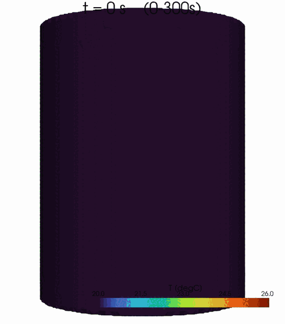

**要点：chtMultiRegionFoamは固体伝導＋流体NS＋輻射の連成。出力は固体温度場。**

出典：sample/102_0（CHT）

---

## 58. 流体の支配方程式（OpenFOAM）

流体側は**連続・運動量（ナビエ・ストークス＋浮力）・エネルギー**を解く：

<eq>\nabla\cdot(\rho\mathbf{U})=0</eq>

<eq>\partial_t(\rho\mathbf{U})+\nabla\cdot(\rho\mathbf{U}\mathbf{U})=-\nabla p+\nabla\cdot\tau+\rho\mathbf{g}</eq>

<eq>\partial_t(\rho h)+\nabla\cdot(\rho\mathbf{U}h)=\nabla\cdot(\alpha_{eff}\nabla h)+S_{rad}</eq>

**要点：流体はNS＋浮力＋エネルギー。浮力項ρgが自然対流を生む。**

出典：sample/102_0（CHT・流体）

---

## 59. OpenFOAMは流体も解く：自然対流の流速分布

ヒータで温まった壁面付近に上昇流（自然対流プルーム）が生じ、固体を冷やす。

断面の流速 |U|（最大約 0.1 m/s、矢印=向き）を 0→600 s で表示（加熱0-300s→遮断300-600s）。

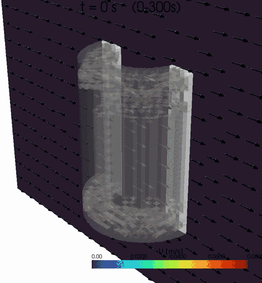

**要点：流体もNSで解いており、自然対流が温度場に効く。**

出典：sample/102_0 の流体U(0-600s)

---

## 60. FrontISTRで何を計算したか：熱膨張の変位

**FrontISTR ＝ 変形（変位）の計算**

OpenFOAMの温度を入力に線形熱弾性静解析。熱ひずみ <eq>\varepsilon_{th}=\alpha(T-T_{ref})</eq>、つり合い <eq>\nabla\cdot\sigma=0,\ \sigma=C:(\varepsilon-\varepsilon_{th})</eq> を底面固定で解く。

**出力：各節点の変位 U（特に上面 Uz）。** 温度→変位の一方向。

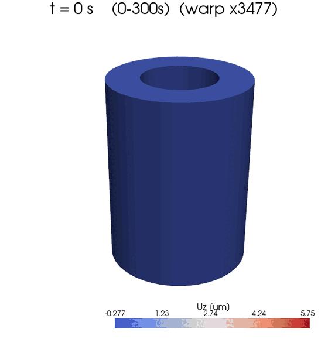

**要点：FrontISTRは温度から変形（変位）を計算するソルバ。**

出典：sample/102_1

---

## 61. 連成前進モデルの全体像（どのソルバが何を解くか）

各スライドの支配方程式を一覧にすると：

| ソルバ | 領域 | 解く式 |
|---|---|---|
| OpenFOAM | 流体 | 連続・運動量(NS＋浮力)・エネルギー |
| OpenFOAM | 固体 | 熱伝導 ＋ ヒータ発熱 Q |
| OpenFOAM | 輻射 | fvDOM（放射伝達方程式 RTE） |
| FrontISTR | 構造 | 熱膨張・線形静解析 |

**連成の向き：** 熱流体で温度 T → その温度で FrontISTR が変位 U（一方向）。

**要点：OpenFOAMが熱流体＋輻射、FrontISTRが変形。温度→変位の一方向連成。**

出典：104の連成(daof・fem)

---

## 62. 構造解析の物性と支持条件

| 項目 | 設定 |
|---|---|
| ヤング率／ポアソン比 | 205 GPa／0.3 |
| 線膨張係数 | 1.2 × 10⁻⁵ /K |
| 熱ひずみの基準温度 | 293.15 K |
| 変位拘束 | FIX_XYZ、FIX_YZ、FIX_Zの節点群 |

物性・支持条件は固定した既知条件として扱う。

**要点：変位を温度の手がかりにする際、支持条件と基準温度も推定に影響する。**

出典：102_1/config/material_properties_steel.yaml; python/fistr_case.py: write_cnt()

---

## 63. 観測ベクトル：温度2成分と変位2成分

<eq>y=[T_{hot},T_{cold},u_{z,heater},u_{z,opposite}]^{\mathsf{T}}</eq>

| 観測 | 定義 | ノイズ標準偏差 |
|---|---|---|
| hot / cold温度 | 指定座標の最近傍固体セル | 0.30 K |
| ヒータ側／反対側Uz | 各側の上面節点群の平均 | 10⁻⁴ mm＝0.1 µm |

**要点：変位の「2点」は、実装上は2つの上面節点群の平均値である。**

出典：openfoam/da_openfoam_config.yaml; fem/fem_obs.py; 102_1/run_one_time()

---

## 64. どの点を観測に、どの点を確認に使ったか

**観測（EnKFに渡す4点）**
- 温度2点：hot（+X ヒータ側）・cold（−X 反対側）… 赤
- 変位2点：上面 Uz（heater側・opposite側）… 橙

**確認（未観測、DAの当たりを検証）**
- mid（+Y 90°）・top（上面近傍）・core（肉厚中心）… 青

未観測点が真値に一致するかで、データ同化の効果を確かめる。


**要点：観測=温度2点＋変位2点。未観測のmid/top/coreで効果を検証する。**

出典：104のnode_locations

---

## 65. 状態ベクトル：温度場とQを一緒に更新

<eq>z=[T_0,T_1,\ldots,T_{20695},Q]^{\mathsf{T}}</eq>

- 1メンバーあたり **20,697成分**。
- 温度：K、発熱量：W。
- Qは各予報区間では一定とし、同化時に更新する。
- 流体場は各メンバーの計算状態を継続する。

**要点：温度と観測の相関だけでなく、Qと観測の相関も利用する。**

出典：daof/of_fem_twin.py: n_aug, iQ, Z; of_case.set_solid_state()

---

## 66. 観測演算子：温度場から予報観測を作る

```text
各メンバーの固体温度場
   ├─ 最近傍セルの抜き出し ──────────→ 温度2成分
   └─ IDW補間 → FrontISTR静解析 → 上面平均 → 変位2成分
                                      ↓
                                 Yf の1行に格納
```

EnKFには、各メンバーで評価した **Yf** を渡す。

**要点：観測演算子を巨大な行列として明示せず、ソルバ評価で実装する。**

出典：daof/of_fem_twin.py: member_obs(); fem/fem_obs.py: displacement_obs()

---

## 67. 平均・偏差の理論式を確認してから、数値を代入する


<eq>\bar z=\frac1N\sum_i z_f^{(i)},\quad\bar y_f=\frac1N\sum_i y_f^{(i)}</eq>


<eq>dZ_{i,:}=(z_f^{(i)}-\bar z)^T,\quad dY_{i,:}=(y_f^{(i)}-\bar y_f)^T</eq>

実コードは先に偏差拡大を行う。次の説明用数値例では、手計算を追うため倍率1で示す。

**要点：理論式の各成分を、次の5行の行列で確認する。**

出典：dacore/enkf.py: enkf_update(); 理論章のEnKF導出

---

## 68. 平均の具体例①：5メンバーを行に並べる

::: numeric-example
**説明用の仮想データ**。全20,696温度の代わりに温度2列だけを表示。

行：member_00〜04。列：T₁ [K]、T₂ [K]、Q [W]。
```text
Zf (5×3) =
[ 290  296  10 ]
[ 292  294  14 ]
[ 294  298  12 ]
[ 296  300  18 ]
[ 298  292  16 ]
```

`axis=0` は、各列を上から下へ5個集計する指定。
:::

**要点：この例は計算手順の説明用。104の計算結果ではない（偏差拡大倍率は1）。**

出典：説明用仮想例：presentation/ensemble_numeric_example.py ／ 実装：dacore/enkf.py

---

## 69. 平均の具体例②：列ごとの合計を5で割る

::: numeric-example

```text
T₁: (290 + 292 + 294 + 296 + 298) / 5 = 294 K
T₂: (296 + 294 + 298 + 300 + 292) / 5 = 296 K
 Q: ( 10 +  14 +  12 +  18 +  16) / 5 =  14 W

zbar = [ 294  296  14 ]       # 3成分
zbar = Zf.mean(axis=0)
```

温度とQを混ぜて平均せず、**同じ列の5メンバー**を平均する。
:::

**要点：平均は「1ケースの全セル平均」でも「時刻平均」でもない。**

出典：説明用仮想例：presentation/ensemble_numeric_example.py ／ 実装：dacore/enkf.py

---

## 70. 偏差の具体例：各行から同じ平均ベクトルを引く

::: numeric-example

```text
dZ = Zf - zbar

[ 290  296  10 ]  -  [294  296  14]  =  [ -4   0  -4 ]
[ 292  294  14 ]  -  [294  296  14]  =  [ -2  -2   0 ]
[ 294  298  12 ]  -  [294  296  14]  =  [  0   2  -2 ]
[ 296  300  18 ]  -  [294  296  14]  =  [  2   4   4 ]
[ 298  292  16 ]  -  [294  296  14]  =  [  4  -4   2 ]
```

member_00では `[290−294, 296−296, 10−14] = [−4, 0, −4]`。

NumPyは `zbar` を5行に共通適用する（broadcast）。
:::

**要点：偏差の各列を足すと0。平均から上・下にどれだけ外れるかを表す。**

出典：説明用仮想例：presentation/ensemble_numeric_example.py ／ 実装：dacore/enkf.py

---

## 71. 予報観測も同じ計算：Yf → ybar → dY

::: numeric-example
列：温度2成分 [K]、上面変位2成分 [mm]。`ybar` は予報の平均。
```text
Yf (5×4) =
[ 290  296  0.001  -0.002 ]
[ 292  294  0.002  -0.001 ]
[ 294  298  0.003       0 ]
[ 296  300  0.004   0.001 ]
[ 298  292  0.005   0.002 ]

ybar = [294  296  0.003  0]
ybar = Yf.mean(axis=0)
```

変位1列目の平均：(0.001＋0.002＋0.003＋0.004＋0.005) / 5。
:::

**要点：ybarは5ケースの予報観測平均。センサから得る観測yとは別。**

出典：説明用仮想例：presentation/ensemble_numeric_example.py ／ 実装：dacore/enkf.py

---

## 72. 観測偏差dY：温度と変位を列ごとに中心化する

::: numeric-example

```text
dY = Yf - ybar

[ -4   0  -0.002  -0.002 ]
[ -2  -2  -0.001  -0.001 ]
[  0   2       0       0 ]
[  2   4   0.001   0.001 ]
[  4  -4   0.002   0.002 ]
```

member_00：`[290−294, 296−296, 0.001−0.003, −0.002−0]`。

**dZ：5×3、dY：5×4**。同じ行が同じメンバーに対応する。
:::

**要点：次に、このdZとdYの列同士を掛けて足し、共分散を作る。**

出典：説明用仮想例：presentation/ensemble_numeric_example.py ／ 実装：dacore/enkf.py

---

## 73. 偏差を1.05倍して、過度な収縮を緩和する

<eq>z^{(i)}\leftarrow\bar{z}+1.05(z^{(i)}-\bar{z})</eq>

- 平均値を変えず、平均からの差を拡大する。
- 渡された予報観測Yfの偏差も1.05倍する。
- 共分散は拡大前の **1.05²＝1.1025倍**。
- この段階でFrontISTRを再実行はしない。

**要点：設定値1.05は、このコードでは「偏差」に掛ける倍率である。**

出典：openfoam/da_openfoam_config.yaml: inflation; dacore/enkf.py

---

## 74. 共分散の理論式：成分の和を行列積へ書き直す


<eq>[C_{zy}]_{ja}=\frac1{N-1}\sum_i dZ_{ij}dY_{ia},\quad C_{zy}=\frac{dZ^TdY}{N-1}</eq>


<eq>[C_{yy}]_{ab}=\frac1{N-1}\sum_i dY_{ia}dY_{ib},\quad C_{yy}=\frac{dY^TdY}{N-1}</eq>

添字i：メンバー、j：状態成分、a・b：観測成分。

**要点：成分表示と行列表示は同じ式。次は各項に数値を入れる。**

出典：dacore/enkf.py: enkf_update(); 理論章のEnKF導出

---

## 75. 共分散①：転置すると、状態ごとの偏差が1行になる

::: numeric-example

```text
dZ.T (3×5) =
[ -4  -2   0  2   4 ]
[  0  -2   2  4  -4 ]
[ -4   0  -2  4   2 ]

dY (5×4) =
[ -4   0  -0.002  -0.002 ]
[ -2  -2  -0.001  -0.001 ]
[  0   2       0       0 ]
[  2   4   0.001   0.001 ]
[  4  -4   0.002   0.002 ]
```

`dZ.T @ dY`：各状態の偏差と各観測の偏差を、同じメンバー同士で掛けて合計。
:::

**要点：行列積は (3×5) @ (5×4) → (3×4)。5メンバー分を内積で集約する。**

出典：説明用仮想例：presentation/ensemble_numeric_example.py ／ 実装：dacore/enkf.py

---

## 76. 共分散②：C_zyの全要素を計算する

::: numeric-example

```text
dZ.T @ dY =
[ 40  -4    0.02    0.02 ]
[ -4  40  -0.002  -0.002 ]
[ 32   4   0.016   0.016 ]

C_zy = (dZ.T @ dY) / 4 =
[ 10  -1    0.005    0.005 ]
[ -1  10  -0.0005  -0.0005 ]
[  8   1    0.004    0.004 ]
```

行：T₁、T₂、Q。列：温度1、温度2、変位1、変位2。

例：`cov(Q,T₁) = {(-4)(-4)+0(-2)+(-2)0+4×2+2×4}/4 = 8`。
:::

**要点：N−1＝4で割る。Qの行 [8, 1, 0.004, 0.004] もここで得られる。**

出典：説明用仮想例：presentation/ensemble_numeric_example.py ／ 実装：dacore/enkf.py

---

## 77. 共分散③：C_yyは、dY同士の内積から作る

::: numeric-example

```text
dY.T @ dY =
[   40      -4    0.02    0.02 ]
[   -4      40  -0.002  -0.002 ]
[ 0.02  -0.002   1e-05   1e-05 ]
[ 0.02  -0.002   1e-05   1e-05 ]

C_yy = (dY.T @ dY) / 4 =
[    10       -1    0.005    0.005 ]
[    -1       10  -0.0005  -0.0005 ]
[ 0.005  -0.0005  2.5e-06  2.5e-06 ]
[ 0.005  -0.0005  2.5e-06  2.5e-06 ]
```

`2.5e-06 = 0.0000025`。単位は温度同士K²、温度×変位K·mm、変位同士mm²。
:::

**要点：C_yyは4×4の対称行列。対角は分散、非対角は異なる成分間の共分散。**

出典：説明用仮想例：presentation/ensemble_numeric_example.py ／ 実装：dacore/enkf.py

---

## 78. 共分散④：対角と非対角を1要素ずつ手計算する

::: numeric-example

```text
温度1の分散（対角）
[(-4)² + (-2)² + 0² + 2² + 4²] / 4 = 10 K²

温度1と変位1の共分散（非対角）
[(-4)(-0.002) + (-2)(-0.001) + 0×0
             + 2×0.001 + 4×0.002] / 4 = 0.005 K·mm

変位1の分散（対角）
[(-0.002)² + (-0.001)² + 0² + 0.001² + 0.002²] / 4
= 0.0000025 mm²
```

平均を標本から求めたため、偏差には「合計0」の制約が1個あり、分母はN−1。
:::

**要点：偏差拡大1.05を実施すれば、この例のC_zyとC_yyは1.1025倍になる。**

出典：説明用仮想例：presentation/ensemble_numeric_example.py ／ 実装：dacore/enkf.py

---

## 79. 観測誤差共分散Rは、想定した測定誤差

<eq>R=\mathrm{diag}(0.30^2,0.30^2,10^{-8},10^{-8})</eq>

| 成分 | 分散の単位 | 設定 |
|---|---|---|
| 温度 | K² | 0.09 |
| 変位 | mm² | 10⁻⁸ |

異なる観測の測定誤差は、ここでは無相関と仮定する。

**要点：Cyyは予報のばらつき、Rは測定誤差。由来が異なる。**

出典：daof/of_fem_twin.py: R = np.diag(...)

---

## 80. ゲインと更新の理論式：なぜsolveを使うのか


<eq>S=C_{yy}+R,\quad K=C_{zy}S^{-1}\ \Longleftrightarrow\ SK^T=C_{zy}^T</eq>


<eq>z_a^{(i)}=z_f^{(i)}+K(y+\varepsilon^{(i)}-y_f^{(i)})</eq>

Sは対称。コードは右の連立方程式を解いてKᵀを得る。
4個の観測ならSは4×4。次の数値例でも同じ操作を行う。

**要点：solveは理論式を省略した別手法ではなく、同じ式を安定に計算する実装。**

出典：dacore/enkf.py: enkf_update(); 理論章のEnKF導出

---

## 81. ゲイン①：観測誤差Rを足してSを作る

::: numeric-example
説明用の観測：`y = [293, 295, 0.0025, −0.0005]`（K、K、mm、mm）。
```text
R = diag(0.09, 0.09, 1e-08, 1e-08)

S = C_yy + R =
[ 10.09       -1     0.005     0.005 ]
[    -1    10.09   -0.0005   -0.0005 ]
[ 0.005  -0.0005  2.51e-06   2.5e-06 ]
[ 0.005  -0.0005   2.5e-06  2.51e-06 ]
```

Rはセンサ誤差の想定。C_yyは5メンバーの予報のばらつき。
:::

**要点：この例のC_yyには従属する列があるが、正の対角Rを足してSを解く。**

出典：説明用仮想例：presentation/ensemble_numeric_example.py ／ 実装：dacore/enkf.py

---

## 82. ゲイン②：S @ K.T = C_zy.T を解く

::: numeric-example

```text
gain_T = np.linalg.solve(S, C_zy.T)   # 4×3
K = gain_T.T                         # 3×4

K ≈
[    0.181518  -0.00016353    816.832    816.832 ]
[ -0.00016353     0.990991  -0.735885  -0.735885 ]
[    0.148485     0.180046    668.183    668.183 ]
```

行：T₁、T₂、Q。列：温度1、温度2、変位1、変位2。

変位列の大きな値はmm単位の残差に掛かる係数。数値の大きさだけで寄与を比べない。
:::

**要点：逆行列を保存する代わりに、4元連立方程式を3列分まとめて解く。**

出典：説明用仮想例：presentation/ensemble_numeric_example.py ／ 実装：dacore/enkf.py

---

## 83. 更新①：member_00の「観測−予報」を計算する

::: numeric-example

```text
y       = [293      295       0.0025       -0.0005     ]
Yf[0]   = [290      296       0.001        -0.002      ]
eps[0] ≈ [0.168635  0.168060 -0.000062246 -0.000000982]

innov[0] = y + eps[0] - Yf[0]
         ≈ [3.168635  -0.831940  0.001437754  0.001499018]
```

観測摂動は `default_rng(104)` と `multivariate_normal(0, R, size=5)` で生成。

他の4メンバーも、それぞれ別の摂動と予報から残差を作る。
:::

**要点：観測yは共通。各メンバーのYfと観測摂動epsが異なる。**

出典：説明用仮想例：presentation/ensemble_numeric_example.py ／ 実装：dacore/enkf.py

---

## 84. 更新②：全メンバーにゲインを掛けて補正する

::: numeric-example

```text
Za = Zf + innov @ K.T

 member     T₁: 予報 → 更新 [K]   T₂: 予報 → 更新 [K]   Q: 予報 → 更新 [W]
   00       290 → 292.974          296 → 295.173         10 → 12.283
   01       292 → 293.153          294 → 295.007         14 → 15.127
   02       294 → 293.037          298 → 294.892         12 → 10.647
   03       296 → 292.984          300 → 295.310         18 → 14.679
   04       298 → 293.211          292 → 295.060         16 → 12.638
```

行列サイズ：`(5×4) @ (4×3) → (5×3)` の補正を、元の5×3行列に加える。
:::

**要点：更新後も5つの状態を保持する。全メンバーを同じ平均値に置き換えない。**

出典：説明用仮想例：presentation/ensemble_numeric_example.py ／ 実装：dacore/enkf.py

---

## 85. 実データで手計算：変位1点がメンバー全員を真値へ戻す

600s計算サイクル1の**実ログ値**で、変位による補正を手計算再現:

| member | T@hot | uz予報(FrontISTR) | ズレ(観測1.79µm−予報) | 補正後 |
|---|---|---|---|---|
| 0 | 47.8℃ | +32.96µm | −31.2µm | **22.0℃** |
| 2 | 11.9℃ | −10.05µm | +11.8µm | **21.7℃** |
| 4 | 38.1℃ | +21.38µm | −19.6µm | **21.9℃** |

5メンバーの並びから <eq>K=\frac{\mathrm{cov}(T,u_z)}{\mathrm{var}(u_z)+R}=0.827\ \mathrm{K/\mu m}</eq>、更新 <eq>T_a=T_f+K(u_z^{obs}-u_z^{f})</eq> だけで**47.8℃も11.9℃も全員22℃前後（真値）へ**。

本番はこれを全20,696セルで同時に行う（セルごとに cov(T_cell, uz)）。

**要点：『伸びすぎ→冷やす／縮みすぎ→温める』が相関から自動で決まる（docs/13で再現コード）。**

出典：run_enkf_600.log 実測値／docs/13_displacement_correction_by_hand.md

---

## 86. 同化後の書き戻しが、次の予報に反映される

```python
Za = enkf_update(Z, y, None, R, rng,
                 inflation=1.05, Yf=Yf)
# 温度とQの範囲を制限した後
for i, m in enumerate(members):
    of_case.set_solid_state(m, t1, Za[i, :Nc], Za[i, iQ])
```

温度：250〜400 K、Q：0〜60 Wにクリップする。

**要点：5ケースを平均場で置き換えず、それぞれの同化後状態から再開する。**

出典：daof/of_fem_twin.py; daof/of_case.py: set_solid_state()

---

## 87. Q更新の理論式：4成分の残差の重み付き和


<eq>K_Q=[C_{zy}]_{Q,:}(C_{yy}+R)^{-1}</eq>


<eq>\Delta Q^{(i)}=\sum_{a=1}^{4}(K_Q)_a(y_a+\varepsilon_a^{(i)}-y_{f,a}^{(i)})</eq>


<eq>Q_a^{(i)}=Q_f^{(i)}+\Delta Q^{(i)}</eq>

次の例で各成分の寄与を1つずつ計算する。

**要点：cov(Q,T)の符号だけではなく、KのQ行と全残差から更新方向が決まる。**

出典：dacore/enkf.py: enkf_update(); 理論章のEnKF導出

---

## 88. Qの更新①：C_zyとKの「Qの行」を取り出す

::: numeric-example

```text
C_zy のQ行 = [8      1      0.004       0.004]

K_Q ≈ [0.148485  0.180046  668.183134  668.183134]

member_00 の残差
r₀ ≈ [3.168635  -0.831940  0.001437754  0.001499018]
```

`K_Q = C_zy[Q, :] @ S⁻¹`（実装では連立方程式として解く）。

**Qの共分散は、Qの偏差と各観測の偏差から計算した値**。
:::

**要点：Qは観測しない。Qと4成分の観測の関係を使って更新する。**

出典：説明用仮想例：presentation/ensemble_numeric_example.py ／ 実装：dacore/enkf.py

---

## 89. Qの更新②：4成分の寄与を足してQを修正する

::: numeric-example

```text
ΔQ₀ = K_Q @ r₀
 ≈ 0.148485 × 3.168635      （温度1）
  + 0.180046 × (-0.831940)   （温度2）
  + 668.183134 × 0.001437754 （変位1）
  + 668.183134 × 0.001499018 （変位2）
 ≈ 0.470495 - 0.149788 + 0.960683 + 1.001619
 = 2.283009 W

Q_a[0] = 10 + 2.283009 = 12.283009 W
```

単一温度観測なら、正の共分散・正の残差はQを増やす。
**4成分同時の場合はゲインの符号と全残差で決まり、cov(Q,T)だけでは決まらない。**
:::

**要点：この例のmember_00はQを増やす。他のメンバーでは下がる場合もある。**

出典：説明用仮想例：presentation/ensemble_numeric_example.py ／ 実装：dacore/enkf.py

---

## 90. フォルダ構成（実ソルバ版）

実ソルバ版のデータ同化はこの構成（104フォルダ内）：

- `daof/` … OpenFOAM連成（ケース生成・実行・場の読み書き・双子実験ドライバ）
- `fem/` … FrontISTR 変位の観測演算子
- `openfoam/run_fem_enkf/` … 真値＋5メンバーのOpenFOAMケース（**計算現場**）
- `run/run_openfoam_fem_enkf.py` … 実行の入口
- `dacore/enkf.py` … **EnKF解析（ROMと共通）**

**要点：実ソルバ版=daof+fem+openfoam。EnKF解析はdacore/enkf.pyを共有。**

出典：104のフォルダ

---

## 91. 計算の流れ：温度→変位→観測→補正

① OpenFOAMで温度場 → ② その温度からFrontISTRで変位。

観測は **温度2点（温度場から直接）＋ 変位2点（FrontISTR）**。

③ EnKFがこの4観測で状態（温度場とQ）を補正 → ④ 書き戻して次サイクルへ。真値＋5メンバーで繰り返す。

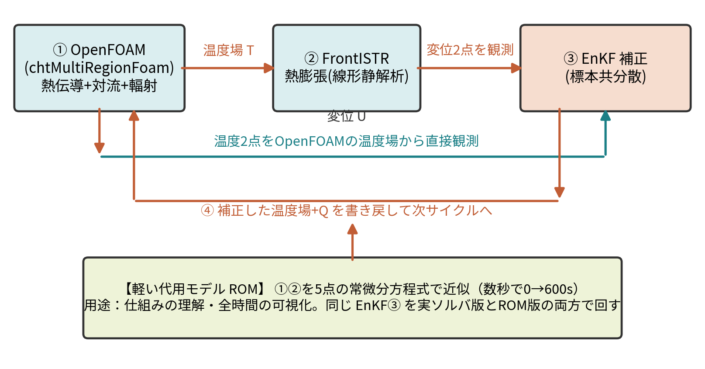

**要点：温度2点は温度場から直接、変位2点はFrontISTR経由でEnKFへ。**

出典：104の連成構成

---

## 92. 5ケースを順番に前進し、そろってから同化する

```text
0 → 10 s   member_00: OpenFOAM → FrontISTR
            member_01: OpenFOAM → FrontISTR
            …
            member_04: OpenFOAM → FrontISTR
            ↓ 5個の結果から EnKF 更新・各ケースへ書き戻し
10 → 20 s  同じ5ケースを継続し、再び EnKF 更新
```

`subprocess.run(..., cwd=member_dir)` で各計算の終了を待つ。

**要点：5メンバーは逐次実行。同じ5ケースを2区間にわたり継続する。**

出典：daof/of_fem_twin.py: for i, m in enumerate(members); daof/of_case.py: run_window()

---

## 93. 何をしたか②：5通りの予測を、観測で2回補正した

1. 初期温度とQを変えた**5ケース**を用意する。
2. 各ケースをOpenFOAMで前進し、FrontISTRで変位を求める。
3. 予測した温度・変位と観測を比較し、**EnKFで温度場とQを更新**する。
4. **10秒後と20秒後**に更新し、温度場の誤差とQを評価する。

**要点：5つの予測のばらつきから、観測のずれを全温度場とQの補正に変える。**

出典：daof/of_fem_twin.py; dacore/enkf.py

---

## 94. 計算回数とコストの構造

| 対象 | OpenFOAMの区間計算 | FrontISTR静解析 |
|---|---:|---:|
| 5メンバー × 2区間 | 10回 | 10回 |
| 真値 × 2区間 | 2回 | 2回 |
| 合計 | **12回** | **12回** |

同化処理の行列計算に加えて、各メンバーで物理ソルバを評価する。

**要点：計算時間の評価では、メンバー数×区間数×ソルバ評価を数える。**

出典：daof/of_fem_twin.py; openfoam/run_fem_enkf/member_*/log.run_*

---

## 95. EnKFへ渡す配列のサイズ

| 配列 | 行 × 列 | 内容 |
|---|---|---|
| Zf | 5 × 20,697 | 全セル温度＋Q |
| Yf | 5 × 4 | 各ケースの予報観測 |
| y | 4成分 | 合成観測 |
| Za | 5 × 20,697 | 同化後の全メンバー |

**行＝メンバー、列＝同じ物理量**。

**要点：平均を取る方向はメンバー方向。空間平均や時間平均ではない。**

出典：daof/of_fem_twin.py: Z, Yf; dacore/enkf.py: enkf_update()

---

## 96. 温度場RMSEは、2回の同化で大きく低下

- 初期：**7.609 K**
- 10秒：0.03081 K
- 20秒：**0.02030 K**

5メンバー・単一シードの結果。

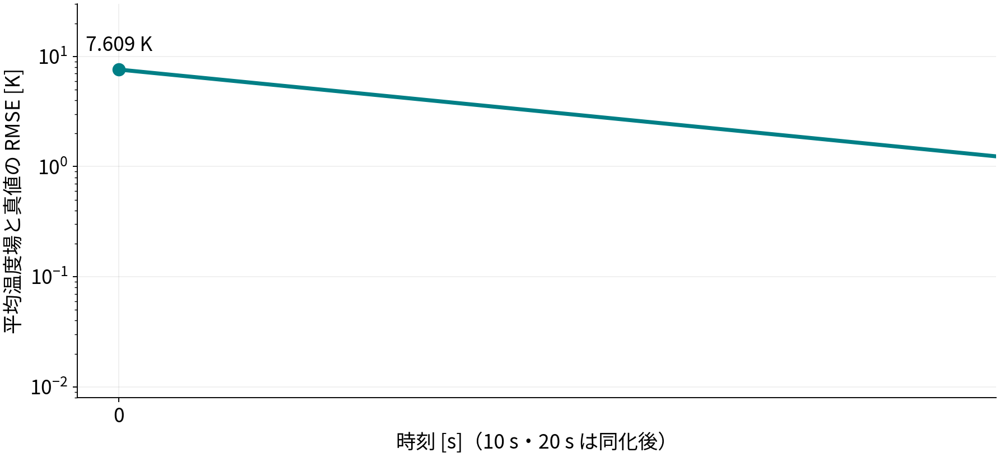

**要点：この双子実験では、初期の大きな温度ずれを補正できた。**

出典：results/openfoam_fem_enkf_history.csv（発表用に再描画）

---

## 97. 発熱量Qは、真値15 Wの近傍へ

- 初期平均：10.264 W
- 10秒：16.359 W
- 20秒：**14.444 W**

最終偏差：−0.556 W
（真値に対し約−3.71%）

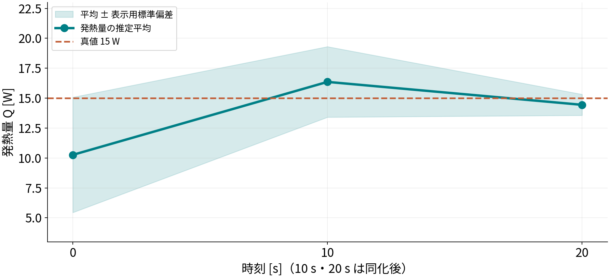

**要点：Qを直接観測せず、温度・変位との関係から推定した。**

出典：results/openfoam_fem_enkf_history.csv; summary.yaml（発表用に再描画）

---

## 98. 3次元温度分布：同化後と真値を比較

初期平均は **t＝0秒**、同化後と真値は **t＝20秒**。同化なし20秒の比較ではない。

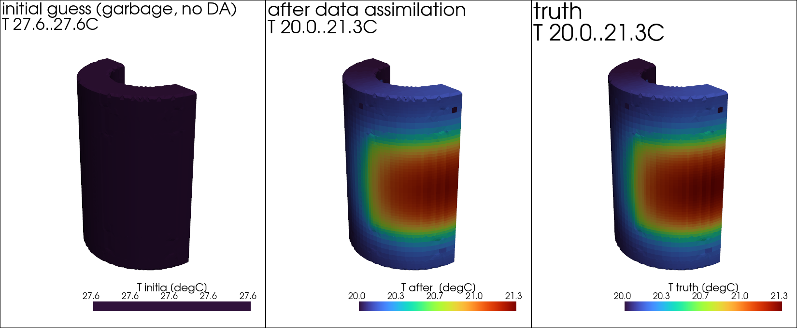

**要点：温度分布の改善は、観測点以外を含むセル全体のRMSEでも評価した。**

出典：run/plot_da_temperature_field3d.py; fields/ensmean_t0.npy, ensmean_t20.npy, truth_final.npy

---

## 99. 予報変位：次の区間ではメンバーの散らばりが縮小

10秒予報：−10.70〜32.48 µm。20秒予報：0.61〜0.97 µm（ヒータ側上面）。

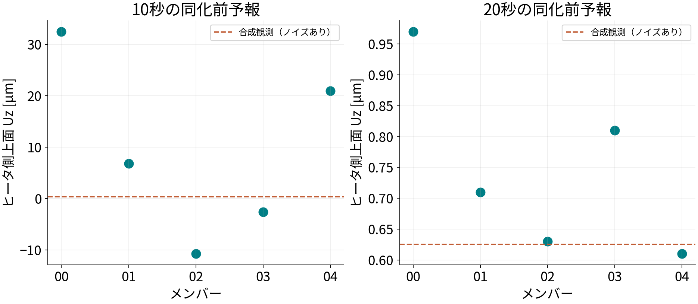

**要点：10秒の同化後状態から進めた20秒予報では、変位のばらつきも小さい。**

出典：openfoam/run_fem_enkf.log（予報値の丸め値から再描画）

---

## 100. 補正した平均温度場から、変位分布も再計算

温度場の補正を構造応答へ反映。図は保存温度場を使った**後処理のFrontISTR解析**。


**要点：同化ループ中の予報変位と、同化後平均場からの再解析を区別する。**

出典：run/plot_da_displacement_field.py

---

## 101. 結果の数値を一表で確認する

| 時刻 [s] | 温度場RMSE [K] | Q平均 [W] | Q標準偏差 [W] |
|---|---:|---:|---:|
| 0 | 7.60909 | 10.2642 | 4.81694 |
| 10 | 0.0308066 | 16.3594 | 2.94875 |
| 20 | 0.0202975 | 14.4442 | 0.878855 |

真値Q＝15 W。10秒・20秒は同化後。

**要点：温度場の誤差と、Qの推定値・散らばりを別々に評価する。**

出典：results/openfoam_fem_enkf_history.csv

---

## 102. 第1部まとめ：正確だが計算が重い

- 温度2点＋変位2点の観測で、固体温度場（20,696セル）とQを補正（**RMSE 7.6→0.02 K、Q→15 W**）。
- ただし1メンバー数分×5×サイクルで、**20秒ぶんでも数十分**。0→600 s 全時間は現実的でない。
- → 同じデータ同化を**軽い代用モデル（ROM）**でも回せるようにする（第2部）。

**要点：実ソルバ版は正確だが重い。全時間・多数試行には軽いROMが要る。**

出典：results/openfoam_fem_enkf_summary

---

## 103. 第2部　ROM にした

**同じ方程式を5点に縮約した軽い前進モデル（数秒）**

**要点：**

出典：104ケースの設定・実装を基に作成

---

## 104. ROM章の目的：軽いモデルで、何を比較するのか

**目的：600秒の推定を軽く試し、観測の組合せと可視化の意味を確かめる。**

1. **A：モデルの校正** — 5点ROMはOpenFOAMの温度履歴を近似できるか。
2. **B：温度のみ同化** — 同化なしに比べ、温度と予測変位がどう変わるか。
3. **C：変位追加の比較** — 温度1点／2点に変位を加えると、温度RMSEはどう変わるか。
4. **D：分布の可視化** — 5温度をIDW補間し、温度・変位のGIFにする。

**要点：この章の図は同じ計算の出力ではない。A〜Dの目的と入力を分けて読む。**

出典：dacore/calibrate.py; run/run_rom_fem.py; compare_rom_disp.py; make_da_gifs.py

---

## 105. ROM章の図の地図：何を入力し、何と比較するか

| 計算 | 同化・入力 | 比較する相手 | 示す量 |
|---|---|---|---|
| A 校正 | OpenFOAMの温度履歴 | ROMの温度履歴 | 当てはめ誤差 |
| B 温度のみ | hot・cold温度 | 同化なし／ROM真値 | 温度履歴・RMSE・Dの変位 |
| C 観測条件比較 | 温度1/2点、変位の有無 | 4つの観測条件 | 全5温度のRMSE |
| D 分布GIF | 現行は温度＋変位同化 | 真値ROMも同じ後処理 | 補間温度・FEM変位 |

**要点：Bの変位はDによる予測、Cの観測はM、Dの全変位分布はFrontISTRで求める。**

出典：計算A〜Dの生成プログラムに対応

---

## 106. 何の方程式を、どうROMにしたか

実ソルバは重いので、**同じ物理を5点に縮約**した軽い前進モデル(ROM)を作る。

固体の熱伝導PDEを有限体積で粗くし、5つの代表ノードの常微分方程式にする：

<eq>C_i\frac{dT_i}{dt}=\sum_j K_{ij}(T_j-T_i)-h(T_i-T_{air})+Q_i(t)</eq>

係数 C・K・**h は102_0の温度履歴に最小二乗で校正**（h≈0.0236 W/K、残差0.012 K）。0→600 s が数秒。

**要点：同じ熱収支をセル2万→5点に粗くした軽い版。C・K・hは校正で決定。**

出典：104のdacore

---

## 107. ROMの発想（図解）：重いPDEを5点のODEに縮約し校正する

① 本物は20,696セルのPDE（重い）→ ② 代表5点を熱の通り道でつなぐ → ③ 本物に最小二乗校正。

「同じ熱収支を粗く離散化したもの」なので、校正すれば本物に一致（残差0.012 K）、0→600 sが数秒。


**要点：重いPDEを『代表5点＋熱の通り道』のODEに縮約し、本物に校正する。**

出典：104のdacore

---

## 108. ROM：温度を5つの代表ノードで近似する

- hot：ヒータ側、mid：側面中間、cold：反ヒータ側。
- top：上面近傍、core：内部の潜在ノード。
- 熱容量と熱コンダクタンスを持つ熱回路としてモデル化。
- OpenFOAMの温度履歴に合わせて係数を校正。

**要点：同じ熱収支の形を使う低次元の代用モデルで、反復検証を軽くする。**

出典：dacore/cht_rom.py; dacore/calibrate.py; docs/03_rom_derivation.md

---

## 109. ROMの熱収支と校正

<eq>C_i\frac{dT_i}{dt}=\sum_j K_{ij}(T_j-T_i)-h(T_i-T_{air})+\dot{Q}_i</eq>

- 校正対象：OpenFOAMの4点温度履歴。
- 温度履歴の当てはめRMSE：**0.01189 K**。
- 総熱容量：約1191 J/K。
- この誤差は**校正データへの当てはめ誤差**。

**要点：校正誤差と、未知条件に対する予測精度は分けて評価する。**

出典：config/rom_calibrated.yaml; dacore/calibrate.py

---

## 110. ROM版のアンサンブルは60行×7列

| 項目 | 内容 |
|---|---|
| 状態 | 5温度＋発熱倍率q＋放熱h |
| 同化用 | Zda：60×7 |
| 比較用 | Zfree：同じ初期値の60×7 |
| 更新観測 | hot・coldの温度のみ |
| 共分散の分母 | 60−1＝59 |
| 偏差拡大倍率 | 1.02 |

**要点：60個のケースフォルダではなく、メモリ上の配列として前進する。**

出典：dacore/twin_fem.py; ensemble.py; cht_rom.py; config/da_config.yaml

---

## 111. フォルダ構成（ROM版）

軽いROM版はこの構成（`dacore/` だけで完結）：

- `dacore/cht_rom.py` … 5点の前進モデル（常微分方程式）
- `dacore/calibrate.py`／`displacement.py` … 102_0・102_1へ校正
- `dacore/twin_fem.py` … 双子実験ドライバ、`dacore/enkf.py` … **EnKF解析（共通）**
- `run/run_rom_fem.py` … 実行の入口（数秒）

実ケースフォルダは作らず、メモリ上のNumPy配列（60×7）で計算する。

**要点：ROM版=dacore/だけで完結（純NumPy、実ケース不要）。EnKFは共通。**

出典：104のdacore

---

## 112. 計算Bの条件：温度2点だけで同化し、同化なしと比較

| 条件 | 設定 |
|---|---|
| 状態・メンバー | 5温度＋q＋h、60メンバー |
| 時間 | 0〜600秒、20秒ごとに30回更新 |
| 同化入力 | hot・coldの温度、ノイズ標準偏差0.30 K |
| 比較 | 同じ初期分布の同化なし、別計算のROM真値 |
| 変位の扱い | 補正後温度からDで上面2値を予測（同化には不使用） |

**要点：次の温度履歴・RMSE・Dの計算例は「温度のみ同化」の計算B。**

出典：run/run_rom_fem.py → run_rom_fem_twin(...), assim_disp=False

---

## 113. 計算Bの結果：観測していない代表温度も補正される

同化するのはhot・cold。mid・top・coreは観測に含めない。0〜300秒で加熱し、300〜600秒で遮断。

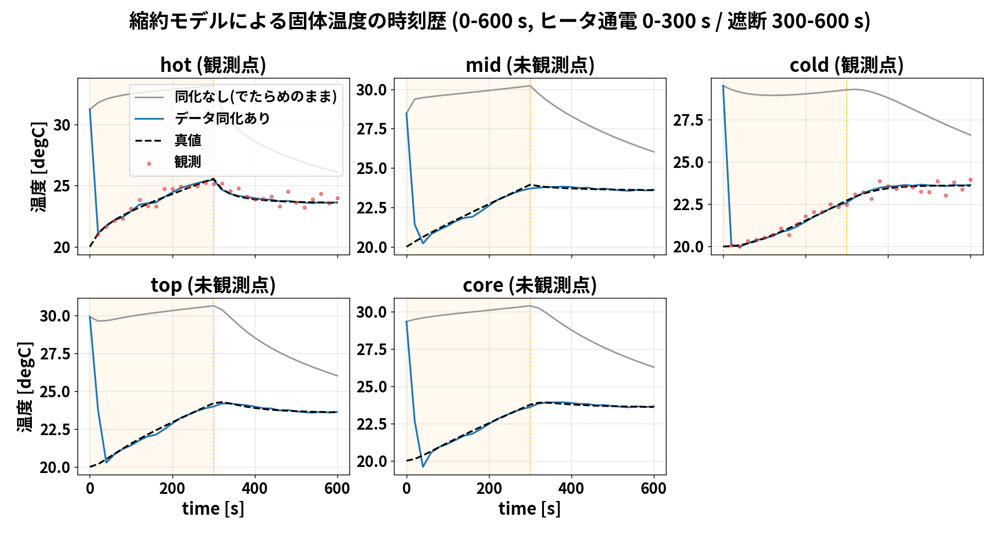

**要点：温度観測とモデルの結合を通じて、未観測の代表温度を推定する。**

出典：run/run_rom_fem.py; dacore/twin_fem.py

---

## 114. 計算Bの結果：同化なしと温度RMSEを比較

再計算による確認値

- 初期：9.738 K
- 同化あり最終：**0.03885 K**
- 同化なし最終：**2.614 K**

同じ初期アンサンブルから比較。

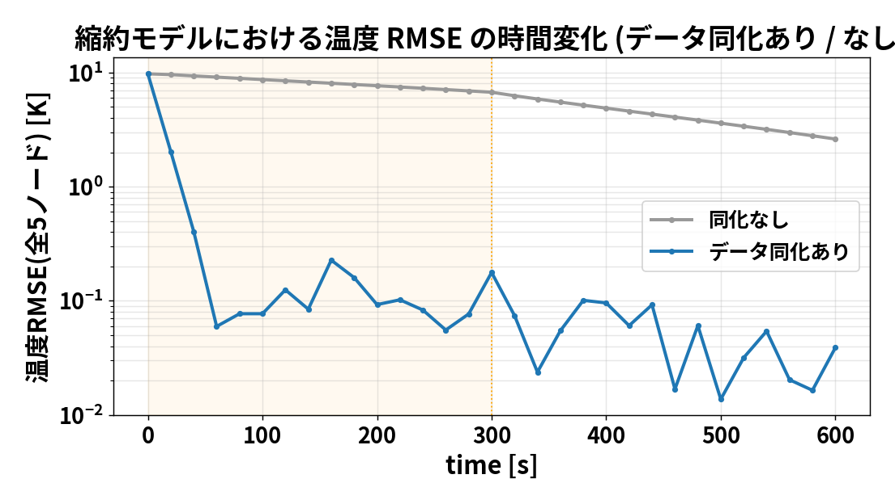

**要点：ROMでは、同化なしの比較軌道に対して温度推定が改善した。**

出典：dacore/twin_fem.py: run_rom_fem_twin(); config/da_config.yaml

---

## 115. ROM変位の理論式：温度差の線形写像


<eq>\Delta T=T-T_{ref}\mathbf1,\qquad u=D\Delta T</eq>


<eq>u_a=\sum_{i=1}^{5}D_{ai}(T_i-T_{ref}),\qquad a=1,2</eq>

Dは2×5の校正行列。単位はmm/K。基準温度で全成分の変位を0とする。
次の例は実際のDに説明用温度差を代入する。

**要点：Dによる上面2成分の予測と、FrontISTRでの全変位場の計算は別。**

出典：dacore/enkf.py: enkf_update(); 理論章のEnKF導出

---

## 116. ROM変位①：実際のDと、説明用の温度差を用意する

::: numeric-example
ノード順：hot、mid、cold、top、core。基準温度20 ℃（293.15 K）。
```text
T      = [25, 23, 21, 24, 22] ℃
ΔT     = [ 5,  3,  1,  4,  2] K

D_um = 1000 × D_mm   （表示をµm/Kに換算）
     ≈
[ 0.702239  -0.859683  0.693381  1.932833  -1.265536 ]
[-1.267132   2.957526  0.082972  0.760667  -1.325910 ]
```

1行目：ヒータ側上面Uz。2行目：反対側上面Uz。DはFrontISTR結果に校正した係数。
:::

**要点：実装のDはmm/K。ここでは読みやすさのため1000倍し、µm/Kで表示する。**

出典：実座標・校正D＋説明用温度：presentation/rom_numeric_example.py

---

## 117. ROM変位②：ヒータ側はDの1行目と温度差の内積

::: numeric-example

```text
u_heater = D_um[0] @ ΔT
 ≈ 0.702239 × 5 - 0.859683 × 3 + 0.693381 × 1
  + 1.932833 × 4 - 1.265536 × 2
 ≈ 3.511193 - 2.579048 + 0.693381 + 7.731332 - 2.531072
 = 6.825786 µm
 = 0.006825786 mm
```

係数には正負がある。Wのような非負・行和1の補間重みではなく、**変位を近似する回帰係数**。
:::

**要点：温度そのものではなく「基準20 ℃からの温度差」を掛ける。**

出典：実座標・校正D＋説明用温度：presentation/rom_numeric_example.py

---

## 118. ROM変位③：2行まとめて計算すると、上面2成分が得られる

::: numeric-example

```text
u_opposite ≈ (-1.267132)×5 + 2.957526×3 + 0.082972×1
             + 0.760667×4 - 1.325910×2
           = 3.010740 µm

u = D_um (2×5) @ ΔT (5×1)
  = [6.825786, 3.010740].T  µm

実装：u_mm = (T_K - 293.15) @ D_mm.T
```

これは**上面の2成分**だけ。全節点の変位分布が必要なら、別途FrontISTRで解析する。
:::

**要点：Dによる2成分予測と、FrontISTRによる全変位場の計算を区別する。**

出典：実座標・校正D＋説明用温度：presentation/rom_numeric_example.py

---

## 119. ROM変位④：同化との関係を数値例で確認する

::: numeric-example
温度同化で得られた5温度が、仮に `[25,23,21,24,22] ℃` なら、
```text
温度5成分 → 基準温度を引く → Dに掛ける
          → 上面Uz = [6.825786, 3.010740] µm
```

- 既定のROMグラフ（assim_disp=False）が使うのは **hot・coldの温度観測**。
- 変位は補正後の温度から予測し、図で比較する。
- 上の温度は説明用であり、特定時刻の同化結果ではない。
:::

**要点：Dによる温度のみ同化のグラフと、assim_disp=Trueで作る現在のGIFを区別する。**

出典：実座標・校正D＋説明用温度：presentation/rom_numeric_example.py

---

## 120. 計算Cの目的：温度観測に変位を足すとどう変わるか

**比較するのは4条件。出力は全5温度のRMSEで統一する。**

| 条件 | 同化する温度 | 同化する変位 | 変位ノイズσ |
|---|---|---|---|
| C1 | hot・cold | なし | — |
| C2 | hot・cold | 上面2点（M） | 0.30 µm |
| C3 | hotのみ | なし | — |
| C4 | hotのみ | 上面2点（M） | 0.10 µm |

**要点：基本比較はC1↔C2とC3↔C4。C2とC4では変位ノイズも違う。**

出典：run/compare_rom_disp.py: main(), run()

---

## 121. 計算Cの前処理：Dではなく、単位応答からMを作る

1. hotだけ＋1 K、ほかは基準温度にする。
2. IDWで構造節点へ補間し、FrontISTRで上面2点のUzを求める。
3. mid、cold、top、coreも同様に計算し、5列を並べる。
4. **Mは2×5**。各メンバーの予報変位を `M @ (T − Tref)` で評価する。

上面2点は指定座標の最近傍節点。Dの上面節点群平均と観測位置の定義も異なる。

**要点：Mは固定モデルの単位温度応答。Dは温度・変位履歴から当てはめた係数。**

出典：run/compute_M_operator.py; config/M_frontistr_operator.npy（m/K）

---

## 122. 計算Cの読み方：同じRMSEでも、計算Bとは別系列

- Cは `compare_rom_disp.py`、Bは `run_rom_fem.py` で計算する。
- BとCでは観測ノイズの乱数消費順序が異なるため、温度2点のみの数値も異なる。
- Cの4条件は同じ初期アンサンブルから始めるが、観測数が違うためノイズ系列は完全共通ではない。
- まず個々の条件での結果として読む。追加効果の安定性には複数シードの検証が必要。

**要点：0.039 Kと0.076 Kを、同じ計算の矛盾した値として扱わない。**

出典：dacore/twin_fem.py; run/compare_rom_disp.py の乱数生成・呼出順序

---

## 123. 計算Cの結果：4つの観測条件で温度RMSEを比較

C1 温度2点：0.076 K → C2 ＋変位：0.004 K。

C3 温度1点：0.236 K → C4 ＋変位：0.002 K。

演算子をMに変更し、基準温度を引いて評価した設定での結果。C2とC4は変位ノイズが異なるため、「温度点が少ないほど効く」とは断定しない。

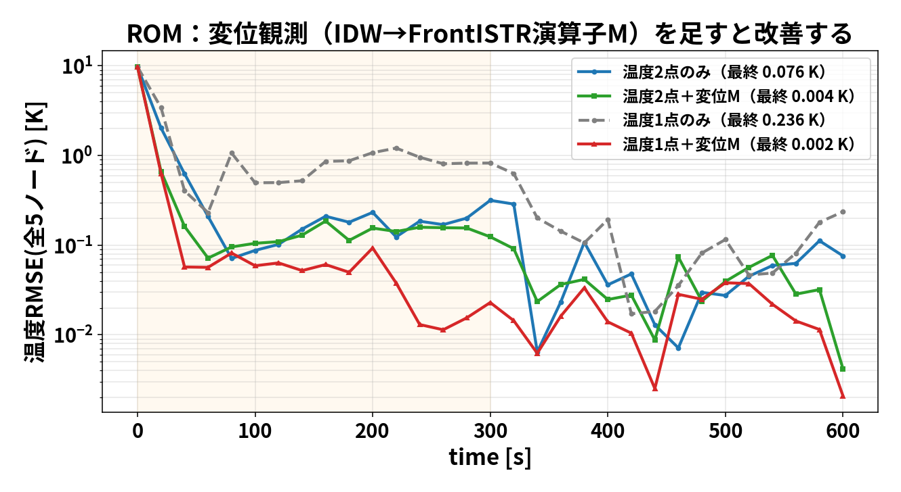

**要点：このROMの各比較では誤差が低下。実ソルバ版の比較結果とは別。**

出典：run/compare_rom_disp.py; docs/11_rom_concept.md（保存図の丸め値）

---

## 124. IDWの理論式：距離の重みから温度場へ


<eq>d_{pi}=\|p-x_i\|,\quad W_{pi}=\frac{d_{pi}^{-2}}{\sum_{j=1}^{5}d_{pj}^{-2}}</eq>


<eq>T_{mesh,p}=\sum_{i=1}^{5}W_{pi}T_i,\qquad T_{mesh}=WT</eq>

距離0に近い場合は一致ノードの重みを1にする。Wは非負・行和1。

**要点：この補間の式と、OIの誤差共分散に基づく解析の式を区別する。**

出典：dacore/enkf.py: enkf_update(); 理論章のEnKF導出

---

## 125. IDW①：5点の座標と、補間したい位置を決める

::: numeric-example
ROMの実座標を使用。温度は**説明用に25、23、21、24、22 ℃**とする。
```text
           hot      mid      cold     top       core
x [mm]      32        0       -32       25          0
y [mm]       0       24         0        0      -28.75
z [mm]   50.25    50.25     50.25       95       50.25
T [℃]       25       23        21       24         22

補間先 p₁ = (30, 0, 50.25) mm
各点までの距離 d₁ ≈ [2, 38.4187, 62, 45.0285, 41.5519] mm
```

:::

**要点：温度の観測を増やすのではなく、5つの代表温度から空間上の値を補間する。**

出典：実座標・校正D＋説明用温度：presentation/rom_numeric_example.py

---

## 126. IDW②：距離の二乗の逆数を、合計1に正規化する

::: numeric-example

```text
w₁ᵢ = 1 / d₁ᵢ²      （距離をmで計算）

w₁ ≈ [250000, 677.5068, 260.1457, 493.2030, 579.1855]
sum(w₁) ≈ 252010.0410

W₁ = w₁ / sum(w₁)
   ≈ [0.99202397, 0.00268841, 0.00103228, 0.00195708, 0.00229826]

例：hotの重み = 250000 / 252010.0410 ≈ 0.99202397
```

近いhot（距離2 mm）の重みが大きい。重みは全て非負で、行の合計は1。
:::

**要点：コード：w = 1.0 / d**2、W[i] = w / w.sum()。単位をそろえれば距離比で決まる。**

出典：実座標・校正D＋説明用温度：presentation/rom_numeric_example.py

---

## 127. IDW③：Wの1行と5温度の内積で、1点の温度を求める

::: numeric-example

```text
T(p₁) = W₁ @ T
 ≈ 0.99202397 × 25 + 0.00268841 × 23
  + 0.00103228 × 21 + 0.00195708 × 24
  + 0.00229826 × 22
 = 24.981642 ℃
```

**補間先がROMノードと一致する場合**は、距離0で割らない。

例：p₃＝topなら `W₃ = [0, 0, 0, 1, 0]` とし、`T(p₃)=24 ℃`。
:::

**要点：実装は最短距離が10⁻⁹ m未満なら、一致ノードの重みを1にする。**

出典：実座標・校正D＋説明用温度：presentation/rom_numeric_example.py

---

## 128. IDW④：補間先を並べれば、温度分布は行列積になる

::: numeric-example
説明用の3点：p₁=(30,0,50.25)、p₂=(−30,0,50.25)、p₃=top［mm］。
```text
W (3×5) ≈
[0.992024  0.002688  0.001032  0.001957  0.002298]
[0.001033  0.002692  0.993184  0.000790  0.002301]
[0         0         0         1         0       ]

T_mesh = W @ [25, 23, 21, 24, 22].T
       ≈ [24.981642, 21.014189, 24.000000].T  ℃
```

実際は節点数だけ行を作る。位置が固定ならWは共通で、各時刻のTだけ更新する。
:::

**要点：これは5点から作る可視化用の補間場。全セルで熱方程式を解いた結果とは異なる。**

出典：実座標・校正D＋説明用温度：presentation/rom_numeric_example.py

---

## 129. 温度GIFの生成過程①：各時刻の5温度をメッシュへ補間

::: numeric-example

```text
run_rom_fem_twin(...)
  → da_T[k]    ：同化後の60メンバー平均、5成分 [K]
  → truth_T[k] ：真値用ROMの5成分 [K]

k = 0, 1, ..., 30   （t = 0, 20, ..., 600 s）
  左：T_mesh_da = W @ (da_T[k] - 273.15)
  右：T_mesh_tr = W @ (truth_T[k] - 273.15)
  → メッシュを断面表示 → PNG → 31枚をGIFへ
```

**現行生成設定**は `assim_disp=True`（温度＋変位同化）。温度のみの既定ROMグラフと別。
:::

**要点：GIFの左右とも、5温度を同じWで補間した場。右も高解像度OpenFOAM解ではない。**

出典：run/make_da_gifs.py: main, temperature_gif, displacement_gif; rom_animation_numeric_example.json

---

## 130. 温度GIFの生成過程②：20秒の温度で1フレームを追う

::: numeric-example
現行生成設定でROMを再計算した例。前のIDW例と同じ補間先3点を使う。
```text
ノード順：hot, mid, cold, top, core
同化後 [℃] ≈ [21.05307, 20.22698, 20.04302, 19.54085, 20.00176]
真値   [℃] ≈ [21.07532, 20.32450, 20.01729, 20.17473, 20.11592]

W @ T_da    ≈ [21.044427, 20.044064, 19.540852] ℃
W @ T_truth ≈ [21.068238, 20.019562, 20.174733] ℃
```

差の場も `W @ (T_da − T_truth)`。補間は独立した観測情報を追加しない。
:::

**要点：温度5点の差が重み付きで空間へ広がる。「分布の完全一致」を保証する計算ではない。**

出典：run/make_da_gifs.py: main, temperature_gif, displacement_gif; rom_animation_numeric_example.json

---

## 131. ROM：温度分布の時刻歴（データ同化 vs 真値, 0→600s）

左：同化後ROMの5温度をIDW補間。右：真値ROMの5温度を同じWで補間。0〜600秒の31フレームを比較する。

現行生成コードは温度＋変位同化（assim_disp=True）。既存GIFの作成設定はファイルだけでは確定できない。

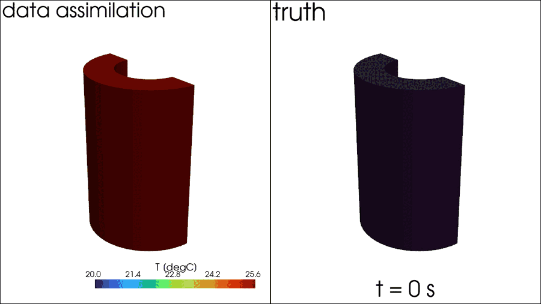

**要点：補間した2つの温度場の比較であり、高解像度の真値場との独立検証ではない。**

出典：104のmake_da_gifs

---

## 132. 変位GIFの生成過程①：補間した節点温度をFrontISTRへ渡す

::: numeric-example

```text
同化後5温度 [K]  → W @ da_T[k]    → 全節点温度 [K]
真値の5温度 [K]  → W @ truth_T[k] → 全節点温度 [K]

それぞれについて fistr_U(node_T_K) を実行
  1. write_cnt(...)         温度荷重・物性・拘束を書き出す
  2. run_fistr(...)         線形静的な熱膨張解析
  3. read_displacement(...) 節点ごとのUx, Uy, Uz [m]を読む
```

作業先：`openfoam/fem_gif/`。Wは全構造節点数×5。Dによる上面2値だけの予測とは別。
:::

**要点：質問への答え：はい。ROMの同化温度 → IDW補間 → FrontISTR → 全変位場、の順。**

出典：run/make_da_gifs.py: main, temperature_gif, displacement_gif; rom_animation_numeric_example.json

---

## 133. 変位GIFの生成過程②：熱ひずみ・構造解析・描画

::: numeric-example

```text
例：20秒、p₁の補間温度 = 21.044426 ℃ = 294.194426 K
温度差 = 294.194426 - 293.15 = 1.044426 K
熱ひずみ αΔT = 1.2e-5 × 1.044426 ≈ 1.25331e-5

FrontISTR：各節点温度を使い、拘束条件下で全体の変位を解く
描画座標：coords + U × scale    （変形を拡大して表示）
色の値  ：Uz [µm] = U[:, 2] × 1e6
```

31時刻×左右2ケース＝**62回の静解析**を呼ぶ設計。全フレームの真値から共通色範囲を決める。
:::

**要点：各フレームは温度荷重に対する静的応答。変位の動的時間積分をしているわけではない。**

出典：run/make_da_gifs.py: main, temperature_gif, displacement_gif; rom_animation_numeric_example.json

---

## 134. ROM：変位分布の時刻歴（データ同化 vs 真値, 0→600s）

左：同化後の5温度→IDW→FrontISTR。右：真値ROMの5温度→IDW→FrontISTR。各時刻に全節点変位を計算して描画する。

変形は拡大表示。上面2成分をDで求める折れ線グラフとは別の生成経路。

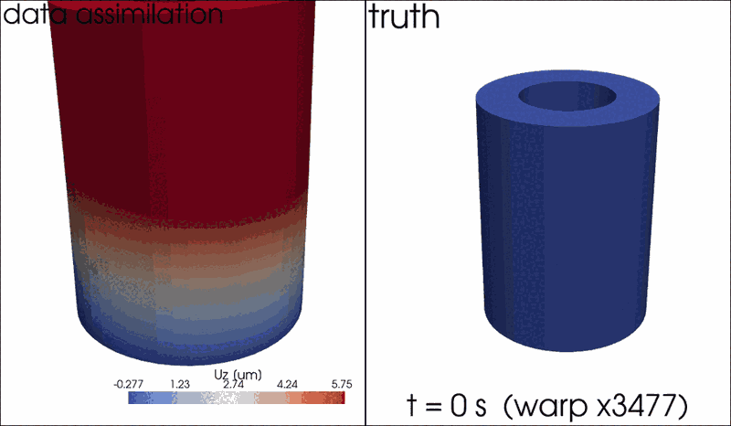

**要点：このGIFは補間温度を荷重として、FrontISTRで求めた全変位場を表示する。**

出典：104のmake_da_gifs

---

## 135. 第2部まとめ：軽くて全時間を可視化できる

- **A**：OpenFOAM温度履歴に合わせて、5点のROMを校正した。
- **B**：温度のみ同化と同化なしを比較し、Dで上面変位を予測した。
- **C**：温度1点／2点にMによる変位観測を追加し、4条件のRMSEを比較した。
- **D**：温度をIDW補間し、変位はFrontISTRで求めてGIFにした。

**要点：モデルの校正・観測追加の比較・分布の可視化は、それぞれ別の検証。**

出典：results/rom

---

## 136. 全体のまとめ

**少数観測で温度場とQを推定。実ソルバ=正確・重い/ROM=軽い・全時間**

**要点：**

出典：104ケースの設定・実装を基に作成

---

## 137. 全体のまとめ

- **目的**：少数の温度・変位観測から、円筒内部を含む温度分布と発熱量Qを推定。
- **手法**：アンサンブルカルマンフィルタ（EnKF）。前進モデルを観測で補正。
- **2つの前進モデル**：OpenFOAM＋FrontISTR（実ソルバ・正確・重い）／ ROM（5点・軽い・全時間）。
- **結果**：でたらめな初期状態から、数点観測で温度場・Q・変位が真値へ収束。
- **使い分け**：正確な分布→実ソルバ、理解と全時間可視化→ROM。

**要点：少数観測＋EnKFで温度場とQを推定。実ソルバとROMを使い分ける。**

出典：104全体

---

## 138. 目的への答え：この条件では温度場とQを推定できた

**問い**：初期温度とQを外しても、少数観測から補正できるか。

**実施**：温度2＋変位2を用い、5ケースをEnKFで2回更新した。

**結果**：温度場RMSEは7.609→0.0203 K、Qは14.444 W（真値15 W）。

**次の問い**：変位を使うと、温度のみよりどれだけ改善するか。

**要点：温度・変位を併用した推定の成立を確認し、観測追加の効果検証へ進む。**

出典：results/openfoam_fem_enkf_summary.yaml; 本資料の検証範囲

---

## 139. 現在の結果から言えること

- OpenFOAM → FrontISTR → EnKF → 書き戻しの処理が動作した。
- 5メンバーの標本統計により、温度場とQを同時に更新できた。
- 保存された実ソルバ版の双子実験では、温度場誤差が低下した。
- ROM版では、同化なしとの温度推定誤差の比較を確認した。

**要点：本段階の成果は、実装の成立と限定条件での数値的な改善である。**

出典：results/openfoam_fem_enkf_summary.yaml; ROM再計算結果

---

## 140. 変位観測の追加効果は、統制比較で検証する

| 比較群 | そろえる条件 | 比較指標 |
|---|---|---|
| 同化なし | 初期値・真値・Q設定 | 温度RMSE・Q誤差 |
| 温度のみ同化 | 同じ温度観測・乱数条件 | 同上 |
| 温度＋変位同化 | 同じ初期アンサンブル | 同上＋変位予測誤差 |

複数シードとメンバー数で、平均的な効果とばらつきを評価する。

**要点：次の主要課題は、変位追加による改善量を同条件で測ることである。**

出典：今後の検証計画（本発表で未実施）

---

## 141. 何がわかり、何がまだわからないか

| 今回わかったこと | まだ検証していないこと |
|---|---|
| 温度＋変位を使う連成同化が動く | 温度のみより、どれだけ良いか |
| この双子実験で温度場とQが改善 | 実物の測定値でも同じ精度か |
| 同化後から次の予報へ継続できる | 初期分布・物性・条件が違っても有効か |

次は**同じ条件で「温度のみ」と「温度＋変位」を比較**する。

**要点：今回の答えは「限定条件では推定できた」。変位追加の優位性は未確定。**

出典：104の保存結果と実装に基づく検証範囲

---

## 142. 補足資料

**数式・実装・検証条件・文献**

**要点：**

出典：104ケースの設定・実装を基に作成

---

## 143. 何をしたか①：正解を作り、4成分だけを観測した

1. **初期20 ℃・発熱量15 W**で、正解用の熱解析を行う。
2. 正解温度から、FrontISTRで熱膨張変位を計算する。
3. 温度2成分・上面変位2成分を取り出し、ノイズを加える。
4. その4成分を、推定側に渡す「観測」とする。

全温度場の正解は、推定精度を採点するために別に保持する。

**要点：実物を測定する前に、正解がわかる双子実験で仕組みを試した。**

出典：daof/of_fem_twin.py: truth loop, obs_values

---

## 144. 得られた結果：温度分布と発熱量が正解に近づいた

| 知りたかった量 | 推定開始時 | 20秒後 |
|---|---:|---:|
| 温度場の誤差（RMSE） | 7.609 K | **0.0203 K** |
| 発熱量Qの推定平均 | 10.264 W | **14.444 W** |

Qの正解は **15 W**。最終的な差は約 **−0.556 W**。

温度場の誤差は、観測していないセルも含めて計算した。

**要点：この条件では、少数観測によって温度場と発熱量を補正できた。**

出典：results/openfoam_fem_enkf_history.csv; openfoam_fem_enkf_summary.yaml

---

## 145. 何ケース、どこで計算したか

```text
openfoam/run_fem_enkf/
  truth/       真値専用（統計には含めない）
  member_00/   推定用ケース0
  member_01/   推定用ケース1
  member_02/   推定用ケース2
  member_03/   推定用ケース3
  member_04/   推定用ケース4
  fields/      平均温度場などの保存先
```

**要点：アンサンブルは、初期条件を変えた5個の独立したケースフォルダである。**

出典：run/run_openfoam_fem_enkf.py: WORKDIR; daof/of_case.py: prepare_member()

---

## 146. 初期アンサンブルの具体値

| ケース | 一様な初期温度 [℃] | 初期Q [W] |
|---|---:|---:|
| member_00 | 46.8108 | 8.4225 |
| member_01 | 25.4481 | 11.1967 |
| member_02 | 10.9867 | 6.2731 |
| member_03 | 17.5002 | 19.1881 |
| member_04 | 37.2997 | 6.2407 |
| 真値 | 20.0000 | 15.0000 |

**要点：各ケース内は一様温度で開始し、ケース間にばらつきを与えた。**

出典：daof/of_fem_twin.py: rng.uniform(); docs/06_ensemble_calculation.md

---

## 147. 熱解析と構造解析の役割

| 構成要素 | この実装で行うこと |
|---|---|
| OpenFOAM | chtMultiRegionFoamで各ケースを前進 |
| 温度の転送 | セル中心温度→構造節点温度（IDW、近傍8点） |
| FrontISTR | 温度荷重による線形静的な熱膨張解析 |
| 観測抽出 | 温度2セルと上面2領域の平均Uz |

構造変形をOpenFOAMメッシュへ戻す処理は、この連成には含まれない。

**要点：熱→構造の一方向評価を、EnKFの観測演算子として使う。**

出典：daof/of_case.py; fem/fem_obs.py; 102_1/python/run_thermal_expansion.py

---

## 148. 結果表示用の標準偏差は、分母がN

| 統計量 | 分母 | 使用箇所 |
|---|---:|---|
| EnKFの標本共分散 | N−1＝4 | 更新量を計算 |
| 表示用の分散 | N＝5 | Q.std()など |

初期Qの例：平均 **10.2642 W**、表示用標準偏差 **4.81694 W**。

表示用分散：23.20295 W²／標本分散：29.00369 W²。

**要点：図中の帯はメンバーの散らばりであり、推定平均の信頼区間ではない。**

出典：daof/of_fem_twin.py: Q.std(), Yf.std(); docs/06_ensemble_calculation.md

---

## 149. 評価指標：平均温度場と真値のRMSE

<eq>\mathrm{RMSE}_T=\sqrt{\frac{1}{N_c}\sum_{j=1}^{N_c}(\bar{T}_{a,j}-T_{true,j})^2}</eq>

- Nc＝20,696セルで等重みに評価する。
- 観測していないセルも含む。
- メンバー間のばらつきとは異なる指標。
- 10秒・20秒の値は**同化後**の平均場から算出。

**要点：RMSEの低下は、数値的な真値に対する温度場推定の改善を示す。**

出典：daof/of_fem_twin.py: rmse(); run/run_openfoam_fem_enkf.py: hist_c

---

## 150. 5メンバーで20,696セルを扱う意味

- 偏差行列のランクは **最大N−1＝4**。
- 初期のばらつきは、一様温度とQの2種類の入力から生じる。
- 任意の温度分布を4成分の観測だけで一意に復元したわけではない。
- 局所化・メンバー数依存性・複数シードの評価は未実施。

**要点：高次元の場を更新しているが、不確かさを表す自由度は限定される。**

出典：dacore/enkf.py; daof/of_fem_twin.py: initial ensemble

---

## 151. 実験に進む前に評価すべき誤差

| 誤差要因 | 推定への影響を調べる方法 |
|---|---|
| 支持条件・線膨張係数 | 真値側と推定側を変えた双子実験 |
| 変位計のゼロ点・温度ドリフト | バイアス項の追加・感度評価 |
| 補間・メッシュ | IDW設定・解像度の変更比較 |
| ノイズ水準・観測配置 | Rと観測位置の感度評価 |

**要点：実観測では、測定ノイズに加えてモデル誤差・系統誤差も扱う必要がある。**

出典：今後の検証計画（本発表で未実施）

---

## 152. 再現性：保存される情報と不足する情報

| 保存されるもの | 現在は保存しないもの |
|---|---|
| ケース・ソルバログ | 同化時のCzy、Cyy、ゲイン |
| 同化後の平均温度場 | 観測摂動εの全配列 |
| Q平均・標準偏差・RMSE | 同化前の全Zfの専用コピー |

各時刻のsolid/Tは同化後に上書きされる。

**要点：共分散の事後検証に向け、更新直前の配列保存を追加する余地がある。**

出典：docs/06_ensemble_calculation.md; daof/of_fem_twin.py; dacore/enkf.py

---

## 153. プログラムを追う順番

| ファイル | 主な関数・役割 |
|---|---|
| run/run_openfoam_fem_enkf.py | main：設定・実行・結果保存 |
| daof/of_fem_twin.py | run_fem_twin：全体の同化ループ |
| daof/of_case.py | run_window / set_solid_state |
| fem/fem_obs.py | displacement_obs：変位評価 |
| dacore/enkf.py | enkf_update：平均・共分散・更新 |

**要点：平均と共分散を計算する中心ファイルは dacore/enkf.py。**

出典：docs/06_ensemble_calculation.md

---

## 154. 観測ノイズとEnKFの観測摂動は別

```text
真の観測値 h(z_true)
  + 模擬測定ノイズ（rng_obs）
  = 合成観測 y（全メンバーで共通）

各メンバーの更新
  y + ε_i（rng） − y_f_i
```

rng_obs：seed、初期値・更新用rng：seed＋1。

**要点：実験を模したノイズと、確率的EnKFの更新用ノイズを区別する。**

出典：daof/of_fem_twin.py: rng_obs, rng; dacore/enkf.py: eps

---

## 155. どの「平均」を見ているか

| 平均 | 集計方向 | 目的 |
|---|---|---|
| 上面節点群のUz平均 | 1ケース内の節点群 | 変位観測1成分を定義 |
| アンサンブル平均 | 同じ量を5ケース間 | 状態推定の代表値 |
| 温度RMSEの二乗平均 | 平均場と真値の差を全セル | 場全体の誤差を評価 |

**要点：節点平均・メンバー平均・誤差の空間集計は別の操作である。**

出典：102_1/run_one_time(); daof/of_fem_twin.py

---

## 156. 「観測演算子は非線形か」という問い

- EnKFの実装は、観測演算子の行列を明示せずYfを受け取る。
- 今回の構造解析は、一定物性・線形静解析。
- 固定された補間・拘束条件では、温度差→変位は線形に扱える。
- 熱ソルバを含む時間発展全体の非線形性とは区別する。

**要点：ソルバ評価型の実装であることと、写像の非線形性は同義ではない。**

出典：fem/fem_obs.py; 102_1/python/fistr_case.py: TYPE=STATIC; dacore/enkf.py

---

## 157. 可視化の由来を混同しない

| 図・データ | 由来 |
|---|---|
| 20秒の3D温度分布 | OpenFOAM全セル場 |
| 同化後の3D変位分布 | 保存平均温度場をFrontISTRで再解析 |
| 600秒の温度・変位履歴 | ROMによる計算 |
| ParaViewの600秒温度アニメ | ROMの5温度を空間へ補間 |

**要点：見た目が3次元でも、元データが全セル解析とは限らない。**

出典：run/export_paraview.py; plot_da_temperature_field3d.py; plot_da_displacement_field.py

---

## 158. 文献と結果の一次資料

- G. Evensen (1994), *Sequential data assimilation with a nonlinear quasi-geostrophic model using Monte Carlo methods to forecast error statistics*, JGR. [DOI: 10.1029/94JC00572](https://doi.org/10.1029/94JC00572)
- G. Evensen (2003), *The Ensemble Kalman Filter: theoretical formulation and practical implementation*, Ocean Dynamics, 53, 343–367. [ECMWF掲載資料](https://www.ecmwf.int/en/elibrary/74424-ensemble-kalman-filter-theoretical-formulation-and-practical-implementation)
- 本ケースの結果：`results/openfoam_fem_enkf_history.csv`、`summary.yaml`、`openfoam/run_fem_enkf.log`。

**要点：手法の文献と、本ケース固有の結果データを分けて参照する。**

出典：文献掲載元を2026-09-10確認; 104ケースのローカル一次資料

---
