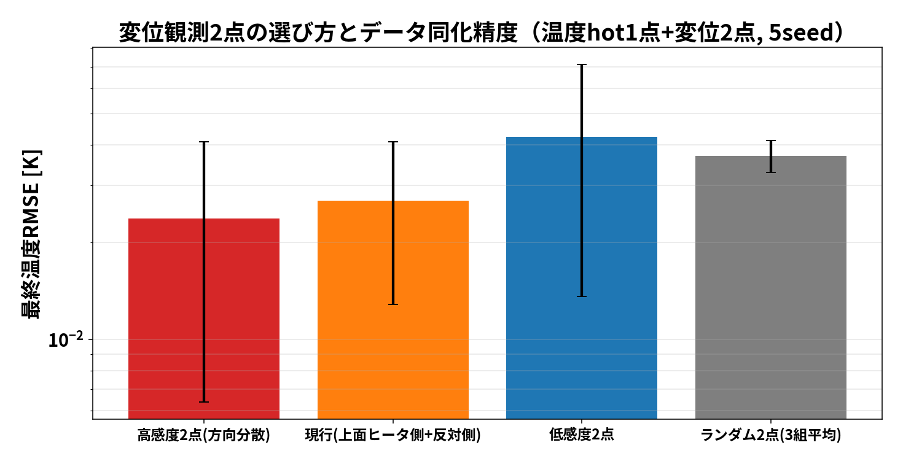

# 考察：温度センサはどこに置くべきか ― 2種類の「感度」とデータ同化精度

FrontISTRで実計算した感度分布と、5×2条件×5seedの同化実験から分かったこと。

## 実験結果（数値）

| センサ位置 | 変位熱感度 \|∂uz/∂T\| [µm/K] | Q感度 dT/dQ [K/W] | 温度のみ RMSE | **温度＋変位2点 RMSE** |
|---|---|---|---|---|
| **hot** | 0.030 | **0.371** ① | 0.131 K | **0.0269 K** ① |
| top | **0.070** ① | 0.281 ② | 0.133 K | 0.0308 K ② |
| mid | 0.008 | 0.263 ③ | 0.137 K | 0.0320 K ③ |
| core | 0.007 | 0.251 ④ | 0.159 K | 0.0336 K ④ |
| **cold** | 0.018 | **0.182** ⑤ | 0.216 K | **0.0388 K** ⑤ |

（RMSEは5seed平均。変位熱感度=FrontISTRパッチ摂動の実計算、Q感度=ROMの+1W応答@300s）

## 発見1：仮説はほぼ正しい ― ただし「正しい感度」で見ると完全に成立

ユーザー仮説「感度が悪い場所のセンサは精度が出ない／高い場所は出やすい」は成立する。
ただし効く感度は**変位熱感度ではなく、推定したい未知量へのQ感度 dT/dQ** だった:

- **dT/dQ の順位（hot>top>mid>core>cold）と同化精度の順位が5点とも完全一致**
  （温度のみでも温度＋変位でも同じ順位）
- cold（Q感度最低0.182 K/W）は一貫して最悪：温度のみで1.6倍、変位併用でも1.4倍悪い
- 変位熱感度 |∂uz/∂T| は部分的にしか相関しない：top は変位感度最大(0.070)なのに2位止まり

## 発見2：なぜ「変位熱感度の高い場所」が最強ではないのか（冗長性）

変位感度が高い場所の温度は、**すでに変位観測そのものが間接的に見ている**。
同じ方向の情報を二重に測っても増えない（観測の冗長性）。
一方 dT/dQ が高い場所は「未知量Qの証拠」を最も濃く含む——だから
**センサの価値 = 推定したい量への感度 × 他の観測との非冗長性** で決まる。

## 発見3：変位2点の同化は「どこに温度センサを置いても」4〜6倍効く

最悪の cold ですら 0.216→0.0388 K。変位は温度場の体積積分なので、
どの単点温度とも相補的（普遍的な補完観測）。センサ位置に悩むより
**変位計を1〜2点足す方が支配的に効く**、というのは実験計画上の重要な示唆。

## 実験（実機）への指針

1. **温度センサはヒータ近傍(hot)に最優先で配置**（Q感度最大）。反ヒータ側だけに置くのは最悪
2. **変位センサは配置を選ばず強力**。温度計の増設より変位計の追加が効率的
3. 変位熱感度マップ（`sensitivity_map.png`）より：変位観測は**底面固定部近傍の温度に最も敏感**
   （感度0.2 µm/K、上部の3倍）。底面近くの温度誤差は変位予測を最も汚す
   → 実験で床への熱逃げ・治具温度の管理が変位比較の精度を左右する
4. 負の感度領域（温めると変位が下がる=傾き効果）が存在する。単純な「熱いほど伸びる」
   直観はセンサ計画には不十分で、感度分布の実計算が要る

## 手法メモ（再現）

- 感度分布: `run/sensitivity_map.py`（周方向12×軸方向10パッチ、各+1K→FrontISTR、計120回）
- 配置実験: `run/sensor_placement_study.py`（ROM 60メンバー×30サイクル、変位はM演算子でアフィン同化=104の手法）
- 生データ: `results/sensitivity_uz.npz`, `results/sensor_placement.csv`

---

# 実験2：変位観測点そのものを熱感度で選ぶ（本命の仮説検証）

実験1は「温度センサの位置」だったが、ユーザー仮説の本命は
**「熱感度の高い変位2点を観測に選ぶと精度が出る」**。これも実計算で検証した
（`run/displacement_point_selection.py`。5単位モード×FrontISTR5回で全5040節点の
感度 M_all を取得し、選び方を変えて同化）。

| 変位2点の選び方 | 平均感度 [µm/K] | 温度RMSE(hot温度1点+変位2点) |
|---|---|---|
| **高感度2点(方向分散)** | 1.46 | **0.0237 K** ① |
| 現行(上面ヒータ側+反対側) | 1.30 | 0.0269 K ② |
| ランダム2点(3組平均) | ― | 0.0371 K ③ |
| **低感度2点** | 0.06 | **0.0424 K** ④ |

**結論: 仮説どおり、感度順に精度が並ぶ**（高感度は低感度の1.8倍良い）。
選定では2つの実務知見を適用した:
- **底面固定近傍(z<5mm)は候補から除外**（並行検証セッション(FrontISTR W=K⁻¹H)で
  固定節点の感度がアーティファクトになり同化が破綻した教訓）
- 2点目は1点目と**モード応答の方向が異なる点**を選ぶ（冗長回避）

## 並行セッションとの突き合わせ（独立な相互検証）

同じ仮説を、別モデル・別手法で検証した結果が一致した:

| | 本ケース(105) | 並行セッション(011_Tji_DUMPW) |
|---|---|---|
| モデル | 中空円筒 5点ROM＋M演算子 | FC300鋳鉄FEM 570節点, W=K⁻¹H(随伴検証済) |
| 高感度2点の効果 | RMSE 0.024K(低感度の1.8倍良) | **QoI誤差 89%→8%(1/12)** |
| 低感度2点 | 0.042K(最悪) | ほぼ改善せず |
| 共通の教訓 | ― | **固定節点の見かけ感度は除外必須**／方向分散が堅牢 |

差の開き方(1.8倍 vs 12倍)の違いは自由度の差で説明できる: 5自由度ROMでは
低感度点でも情報が完全にはゼロにならないが、モデルが細かいほど
「どこを測るか」の価値が増す。**実機(2万セル)ではさらに効くはず**。
