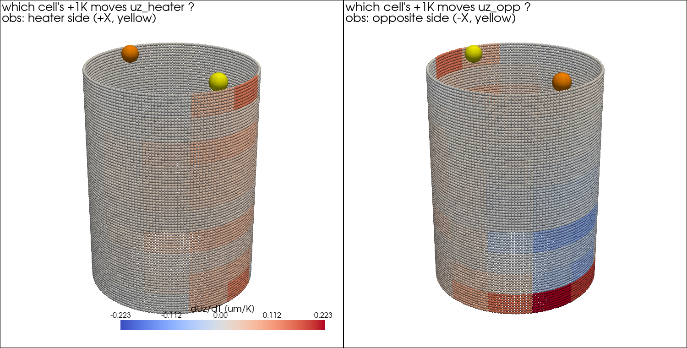

# 図で見る105の結果 ― やさしい解説

105で得られた結果を、図を1枚ずつ「どう読むか」から説明する。
（数値の詳細と考察は `00_discussion.md`）

---

## Q. そもそも何を調べた？

> 「温度センサを**どこに置くか**で、データ同化の精度は変わるのか？
> 変わるなら、それは**事前に計算できる“感度”で予測できるのか？**」

これを (1) FrontISTRで感度分布を実計算 → (2) センサ位置を変えて同化を実験 →
(3) 突き合わせ、の3ステップで確かめた。

---

## 図1: 熱感度の3D分布 ― 「どこを温めると変位計が動くか」

**読み方:**
- 私たちは上面の**変位2点**（黄色い球＝そのパネルの観測点）を測っている
- 円筒の色は「**その場所を+1℃温めたら、観測している変位が何µm動くか**」
  （FrontISTRで120回実計算した厳密な感度）
- **赤 = 温めると変位が上がる場所／青 = 逆に下がる場所／灰色 = ほぼ無関係**

**分かること:**
- 左（ヒータ側の変位計）: **ヒータ側の柱に沿って赤い帯**。特に**下の方（底面固定の近く）が濃い**
  → 下を温めると、その上の柱全体が持ち上がるから
- 右（反対側の変位計）: 下部に強い赤、**中腹に青（負の感度）**
  → 場所によっては温めると**傾いて変位が下がる**。「熱いほど伸びる」という直観だけでは
  センサ計画はできないことが分かる

---

## 図2: センサ位置ごとの同化精度（棒グラフ）

**読み方:**
- 横軸 = 温度センサを置いた場所（5候補）。棒が低いほど同化の精度が良い（縦軸は対数）
- 灰色 = 温度1点だけで同化 ／ 青 = **温度1点＋変位2点**（104の手法）で同化

**分かること:**
1. **青は灰色よりどこでも1桁近く低い** → 変位2点を足すと、温度センサがどこにあっても
   4〜6倍精度が上がる（変位は場所を選ばない“万能の補完観測”）
2. その上で**場所の差も残る**: hot（ヒータ側）が最良、cold（反対側）が最悪で約1.4倍差

---

## 図3: 感度 vs 精度の散布図 ― 仮説の検証

**読み方:**
- 横軸 = その場所の「変位熱感度」（図1の値）。右にあるほど変位計が敏感な場所
- 縦軸 = 同化精度（低いほど良い）。**右下に並ぶなら仮説どおり**

**分かること（少しひねった結論）:**
- cold は感度も低め・精度も最悪 → 仮説に合う
- しかし **top は変位感度が最大なのに最良ではない** → 仮説は「変位熱感度」では不完全

**では何が精度を決めていた？** → もう一つの感度「**その場所の温度が
発熱量Qにどれだけ反応するか (dT/dQ)**」で見ると、順位が**5点とも完全一致**した:

| 順位 | dT/dQ [K/W] | 同化精度RMSE [K] |
|------|-------------|------------------|
| ① hot | 0.371 | 0.0269 |
| ② top | 0.281 | 0.0308 |
| ③ mid | 0.263 | 0.0320 |
| ④ core | 0.251 | 0.0336 |
| ⑤ cold | 0.182 | 0.0388 |

**なぜ変位熱感度では外れるのか:** 変位計が敏感な場所の温度は、
**変位観測がすでに間接的に見ている** → そこに温度センサを足しても情報が重複（冗長）。
一方 dT/dQ が高い場所は「知りたい未知量Qの証拠」を最も濃く含む。

> **結論（1行）**: センサの価値 =「推定したい量への感度」×「他の観測との重複のなさ」。
> 今回は dT/dQ が精度を完全に予測し、"感度の悪い cold にセンサを置くと精度が出ない" が
> 実計算で裏づけられた。

---

## 実験・実務への持ち帰り

1. 温度センサは**ヒータ近傍**へ（反対側だけは最悪の選択）
2. 迷ったら**変位計を足す**方が、温度計の場所選びより効く
3. 変位で精度を出したいなら**底面固定部近傍の温度管理**（床への熱逃げ・治具）が重要
   （図1でそこが最も敏感だから）

再現: `python3 run/sensitivity_map.py` → `python3 run/sensor_placement_study.py`
→ `python3 run/plot_sensitivity_3d.py`
