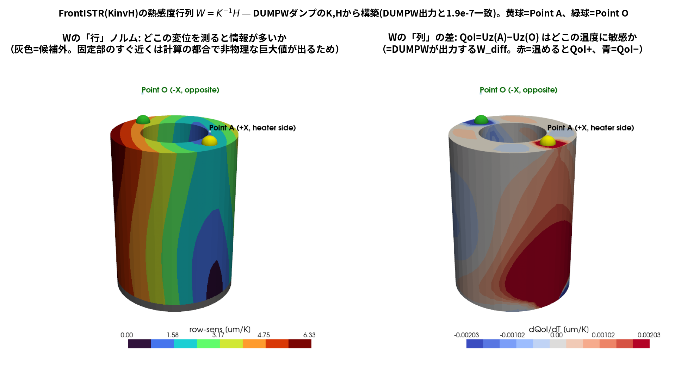
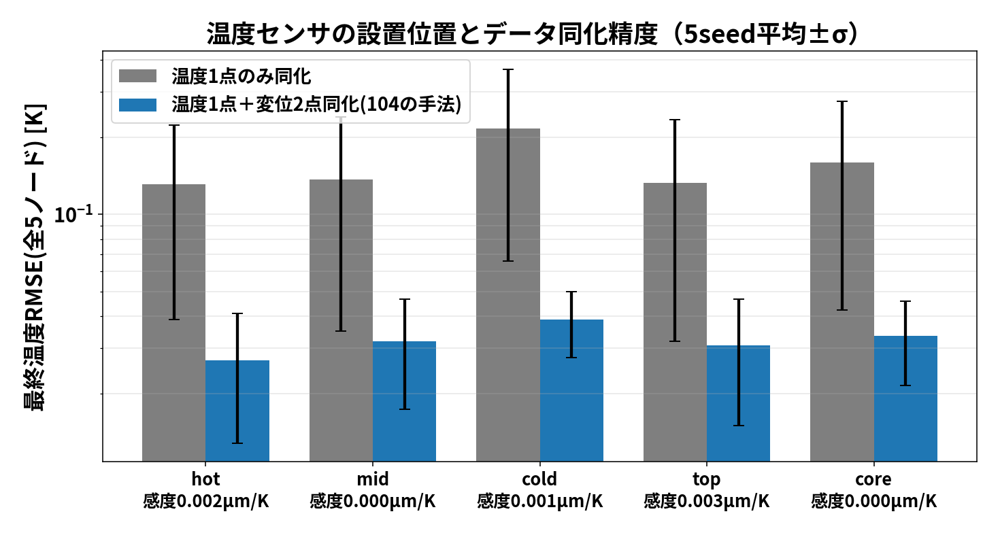
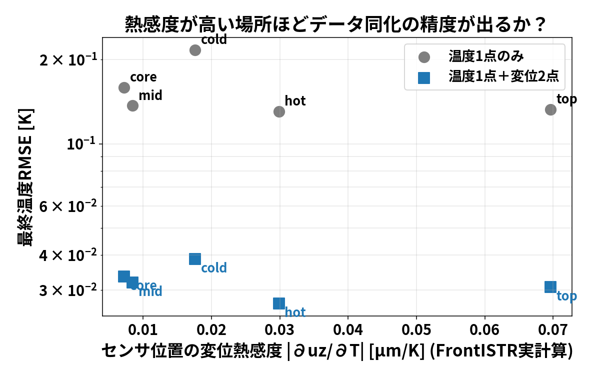

# 図で見る105の結果 ― やさしい解説

105で得られた結果を、図を1枚ずつ「どう読むか」から説明する。
（数値の詳細と考察は `00_discussion.md`）

---

## Q. そもそも何を調べた？

> 「温度センサを**どこに置くか**で、データ同化の精度は変わるのか？
> 変わるなら、それは**事前に計算できる“感度”で予測できるのか？**」

これを (1) FrontISTR(KinvH)の感度行列 **W=K⁻¹H** を実計算 →
(2) センサ位置を変えて同化を実験 → (3) 突き合わせ、の3ステップで確かめた。
（熱感度はすべて、DUMPWパッチ版FrontISTRがダンプしたK・Hから構築したW。
DUMPW直接出力`sensitivity_Wdiff.vtk`と最大相対差1.9e-7で一致）

---

## 図1: FrontISTRの熱感度 W=K⁻¹H ― 行と列で2つの問いに答える

**読み方:**（黄球=Point A（ヒータ側上面+X）、緑球=Point O（反対側上面−X））
- **左パネル（Wの行ノルム）**: 「その場所の**変位を測る**と、温度場の情報を
  どれだけ多く拾えるか」[µm/K]。**変位観測点を選ぶ**ための地図
  （灰色=候補から外した部分。固定部のすぐ近くは、拘束の計算処理の都合で
  「1℃で数千万µm動く」ような**ありえない値**が出てしまう。物理的な感度では
  ないので判定に使わず、図でも灰色にしてある）
- **右パネル（Wの列の差）**: 「その場所の**温度が+1℃**動くと、
  QoI=Uz(A)−Uz(O)（上面の傾き）が何µm動くか」。DUMPWパッチ版FrontISTRが
  直接出力する **W_diff** と同じもの。**温度の影響**を見る地図。
  **赤=温めるとQoIが増える／青=減る（負の感度）**

**分かること:**
- 行感度（左）は**上端ほど大きい**（底面固定・自由端が最も動く）
  → 変位計は上面に貼るのが正解
- 列感度（右）は**ヒータ側(+X)の下部が濃い赤** → A側の柱の下を温めると
  その上全体が持ち上がりQoI(傾き)が増えるから。**反対側や上面には青（負の感度）**
  もあり、場所によっては温めるとQoIが減る。「熱いほど伸びる」という直観だけでは
  センサ計画はできないことが分かる

---

## 図2: センサ位置ごとの同化精度（棒グラフ）

**読み方:**
- 横軸 = 温度センサを置いた場所（5候補）。棒が低いほど同化の精度が良い（縦軸は対数）
- 灰色 = 温度1点だけで同化 ／ 青 = **温度1点＋変位2点**（104の手法）で同化

**分かること:**
1. **青は灰色よりどこでも1桁近く低い** → 変位2点を足すと、温度センサがどこにあっても
   4〜6倍精度が上がる（変位は場所を選ばない“万能の補完観測”）
2. その上で**場所の差も残る**: hot（ヒータ側）が最良、cold（反対側）が最悪で約1.4倍差

---

## 図3: 感度 vs 精度の散布図 ― 仮説の検証

**読み方:**
- 横軸 = その場所の「変位熱感度」（図1右のW列の値、FrontISTR W=K⁻¹H）。
  右にあるほど、そこの温度が観測変位を大きく動かす場所
- 縦軸 = 同化精度（低いほど良い）。**右下に並ぶなら仮説どおり**

**分かること（少しひねった結論）:**
- cold は感度も低め・精度も最悪 → 仮説に合う
- しかし **top はW列感度が最大なのに最良ではない** → 仮説は「変位熱感度(W列)」では不完全

**では何が精度を決めていた？** → もう一つの感度「**その場所の温度が
発熱量Qにどれだけ反応するか (dT/dQ)**」で見ると、順位が**5点とも完全一致**した:

| 順位 | dT/dQ [K/W] | 同化精度RMSE [K] |
|------|-------------|------------------|
| ① hot | 0.371 | 0.0269 |
| ② top | 0.281 | 0.0308 |
| ③ mid | 0.263 | 0.0320 |
| ④ core | 0.251 | 0.0336 |
| ⑤ cold | 0.182 | 0.0388 |

**なぜ変位熱感度では外れるのか:** 変位計が敏感な場所の温度は、
**変位観測がすでに間接的に見ている** → そこに温度センサを足しても情報が重複（冗長）。
一方 dT/dQ が高い場所は「知りたい未知量Qの証拠」を最も濃く含む。

> **結論（1行）**: センサの価値 =「推定したい量への感度」×「他の観測との重複のなさ」。
> 今回は dT/dQ が精度を完全に予測し、"感度の悪い cold にセンサを置くと精度が出ない" が
> 実計算で裏づけられた。

---

## 実験・実務への持ち帰り

1. 温度センサは**ヒータ近傍**へ（反対側だけは最悪の選択）
2. 迷ったら**変位計を足す**方が、温度計の場所選びより効く
3. 変位で精度を出したいなら**底面固定部近傍の温度管理**（床への熱逃げ・治具）が重要
   （図1右のW列でそこが最も敏感だから）

再現: `python3 run/dumpw_cylinder.py` → `python3 run/build_W_from_dumps.py`
→ `python3 run/kinvh_sensitivity.py` → `python3 run/sensor_placement_study.py`
