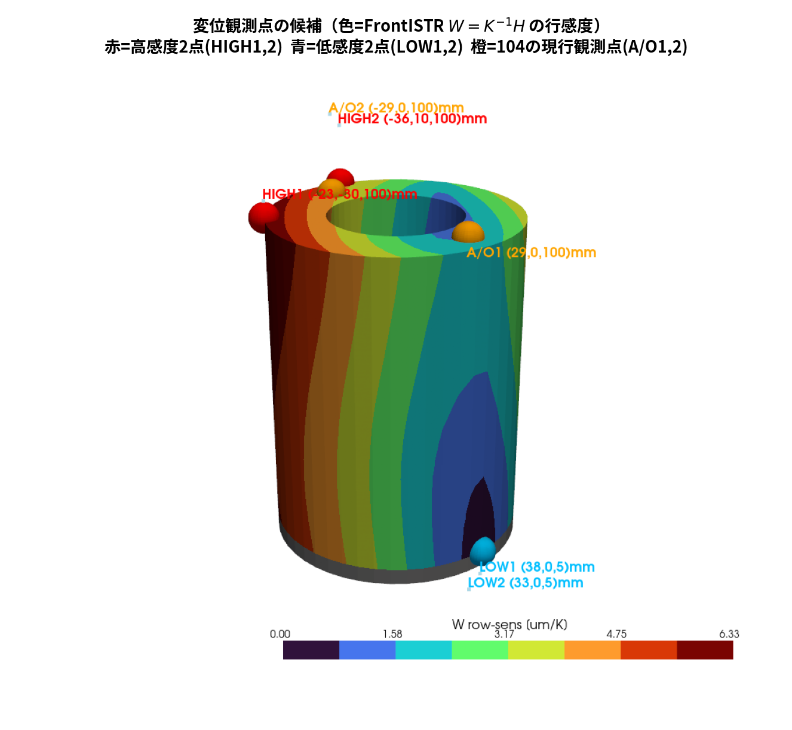
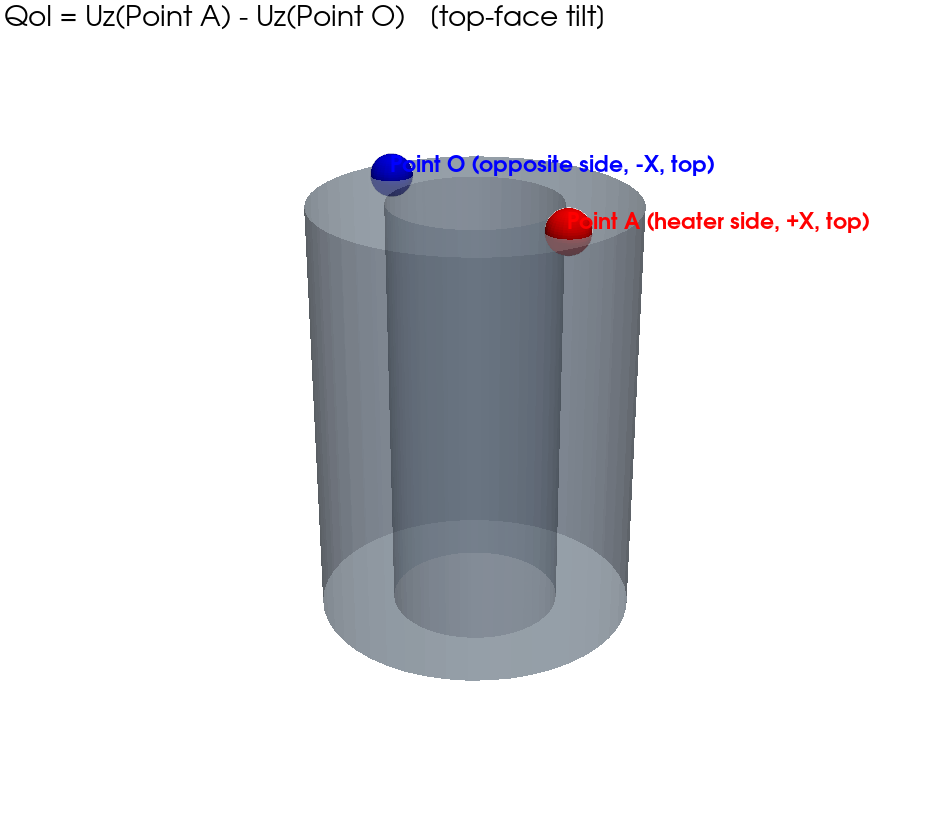
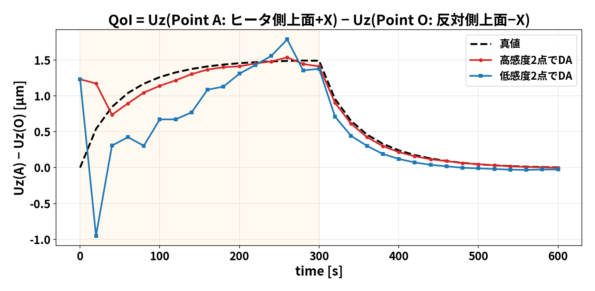
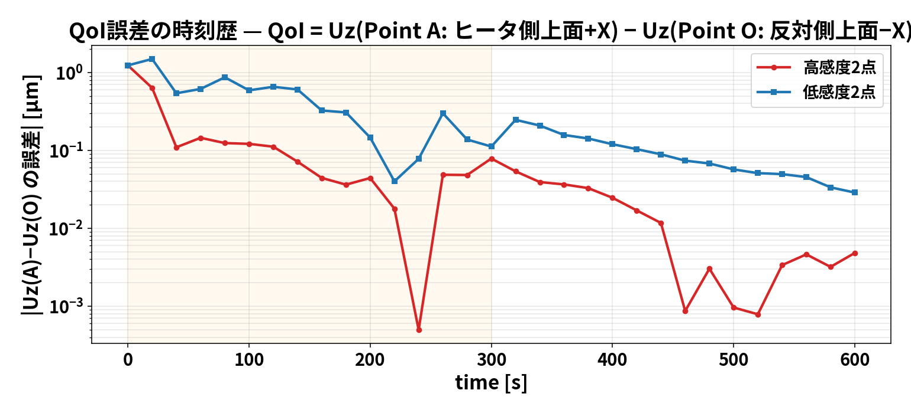
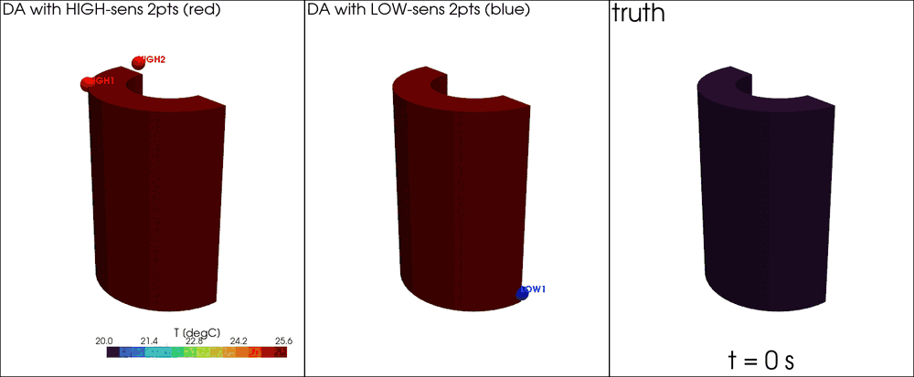
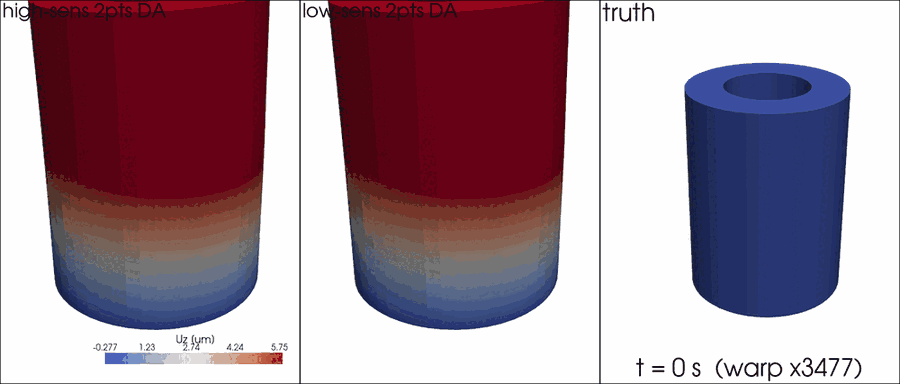
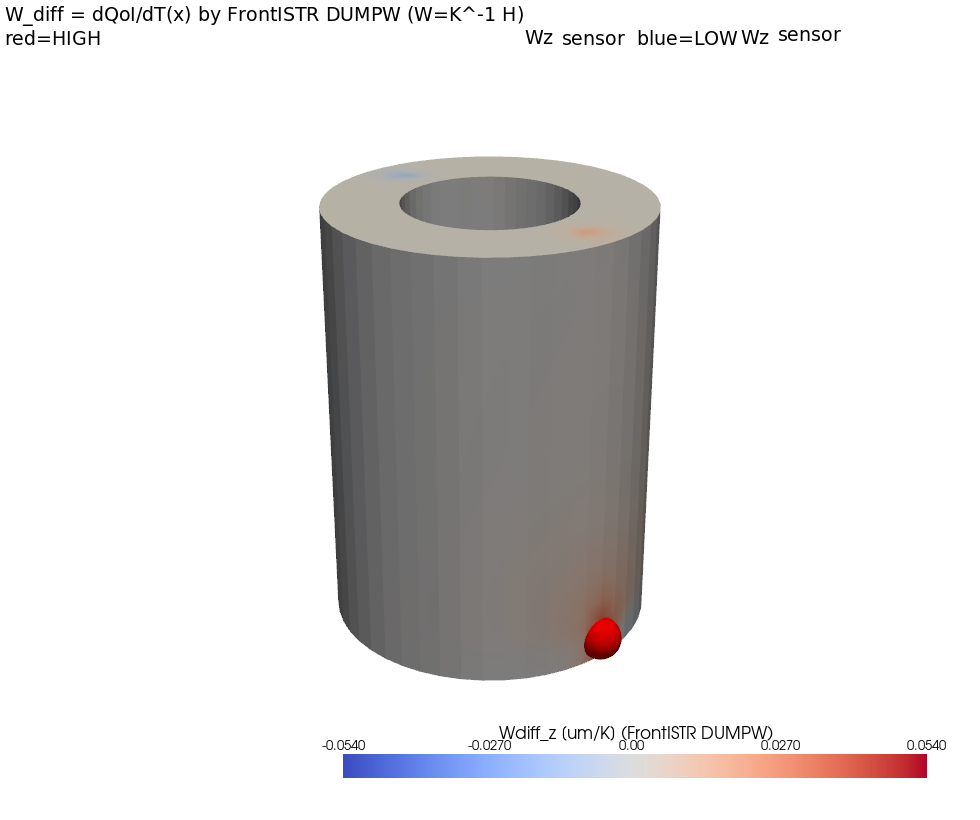
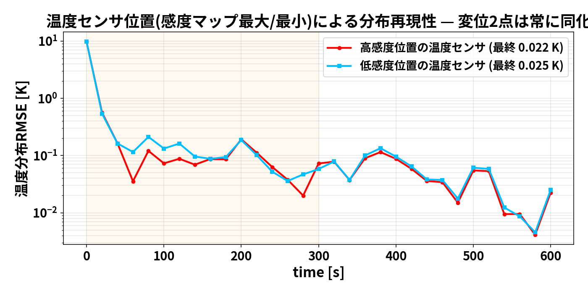
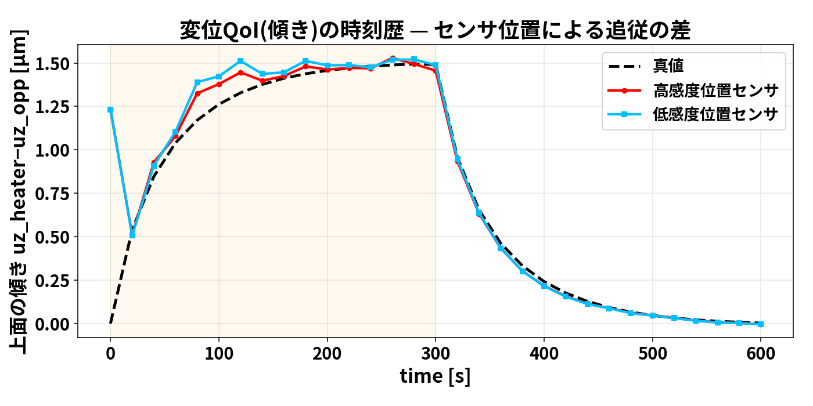
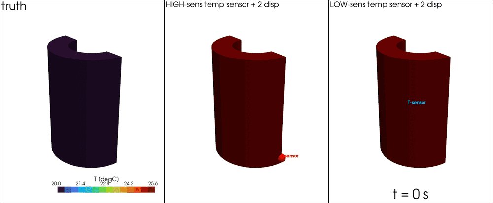

# 証拠計算：熱感度（W=K⁻¹H）で観測点を選ぶと実機（正解）を再現できるか

「感度が悪いところを観測点にすると精度が出ない／感度が高いところなら真値の分布を
再現できる」— この主張を、時刻歴グラフ・分布アニメーションで実証した記録。

## 経緯：問いは「温度センサ」から始まり、答えは「変位計」で最も強く出た

もともとの仮説は「**温度センサ**を熱感度の高い/低い場所に貼ると精度が出る/出ない」
だった。実際に検証した結果：

| 検証 | どこに書いたか | 結果 |
|---|---|---|
| 温度センサ×5候補位置 | 実験1（`00_discussion.md`） | **部分的にしか成立せず**。精度順位を決めたのは熱感度でなく dT/dQ（W列感度最大のtopは2位止まり） |
| 温度センサ×W_diff最大/最小 | 本ファイル §2（証拠B） | 差は小さい（0.0225K vs 0.0251K）。変位観測と情報が重複するため |
| **変位計×W行感度 高/低** | **本ファイル §1（本命）** | **きれいに成立**（0.0237K vs 0.0400K、実FEMでは12倍差） |

つまり同じ「熱感度で観測点を選ぶ」という仮説でも、**温度センサに使うと決定打に
ならず、変位計に使うと劇的に効く**。これが本研究の最終的な答えであり、
だから§1（本命）は変位計の選点になっている。温度センサの検証を
やめたわけではない（実験1・§2がそれ）。

## 0. まず「熱感度」の定義合わせ（KinvHとの対応）

ここで言う熱感度は、KinvH（`20260810_KinvH`、随伴法と2.4e-8で一致検証済み）の
**感度行列 W = K⁻¹H**（節点温度→変位のヤコビアン）と同じもの。
Wは1つの行列だが、**行で読むか列で読むかで使い道が変わる**:

| 見方 | 意味 | 使い道 | 本フォルダの実験 |
|------|------|--------|------------------|
| **Wの行** | ある変位DOFが温度場全体にどれだけ敏感か | **変位観測点を選ぶ** | 実験2（本命・下記） |
| **Wの列** | ある場所の温度が観測変位をどれだけ動かすか | **温度センサ位置を選ぶ** | 実験1・証拠実験B |

> **用語注意**: W そのものは「差」ではなく全変位×全温度のヤコビアン（行列全体）。
> DUMPWが直接出力する **W_diff は Wの2行の差 W[A,:]−W[O,:]**（QoI=Uz(A)−Uz(O)の
> 温度感度ベクトル）である。行ノルムマップ（変位観測点の選定）にはW全体が要る。

**本フォルダの熱感度はすべてこのFrontISTR計算に基づく。** 出所の連鎖:
1. **KinvHのDUMPWパッチ版FrontISTRを直接適用**（`run/dumpw_cylinder.py`）:
   六面体メッシュを6分割テトラ化(23,040四面体)し、`!SOLVER,...,DUMPW=YES` と
   `sensitivity_points.dat`(Point A/O) で **W_diff を FrontISTR内で直接出力**
   → `paraview/sensitivity_Wdiff_cylinder.vtk`(ParaView用, フィールド`Sensitivity`)
2. 同じ実行がダンプした **K(15120²)とH(15120×5040) から W=K⁻¹H の全体を構築**
   （`run/build_W_from_dumps.py`, splu約2分）。検証: `Wz[A]-Wz[O]` は
   DUMPW直接出力の Wdiff_z と**最大相対差1.9e-7で一致**（同一行列由来を機械精度で確認）
3. 行感度・列感度・観測点の選定は `run/kinvh_sensitivity.py` が
   `results/kinvh_sensitivity.npz` に確定（固定部近傍に出る非物理な巨大値＝偽の感度の除外込み）
- 交差検証: 摂動法（120パッチ, `run/sensitivity_map.py`）ともROMモード射影で
  符号・分布一致（最大差5.8%＝六面体vs四面体の離散化差）

---

## 1. 【本命の証拠】変位観測点をFrontISTRの感度（Wの行）で選ぶ

変位観測2点を「高感度2点（方向分散）」と「低感度2点」で
**FrontISTR W=K⁻¹H の行感度** Σ|Wz[i,:]| により選び分け、
温度hot1点＋変位2点でデータ同化（他は全く同じ条件）。

### どこが選ばれたか（FrontISTR感度の面表示、図中の各球にラベル付き）

> **ParaViewで見る場合**: `paraview/sensitivity_Wdiff_cylinder.vtk`（DUMPW直接出力、
> フィールド`Sensitivity`）または `paraview/sensitivity_nodal.vtu` を開く

図中の点（座標はmm）:
- **HIGH1 (−23,−30,100)mm / HIGH2 (−36,10,100)mm**（赤）= W行感度の上位2点
  （6.33 / 4.45 µm/K、2点目は|cos|<0.9の方向分散条件付き）
- **LOW1 (38,0,5)mm / LOW2 (33,0,5)mm**（青）= 有効節点中の下位2点（0.12 µm/K）
- **A/O1 (29,0,100)mm / A/O2 (−29,0,100)mm**（橙）= 104の現行観測点（1.52 / 4.22 µm/K）

W行感度は**上端ほど大きい**（底面固定で自由端が最も動く）。周方向では
**3-2-1拘束節点（＋X底面に2点・＋Y底面に1点）から遠い側**が大きく、
高感度2点は上端の−X〜−Y寄り（たまたま反ヒータ側）に選ばれた。
感度行列Wは純粋に構造(K,H)の性質で、ヒータ位置には依存しない。

### 証拠①：変位QoIの時刻歴 — QoI = Uz(Point A) − Uz(Point O)

QoIの定義点（KinvH検証の Point_A − Point_O と同型）:
- **Point A**: ヒータ側 上面 (+X, x=+28mm, z=100.5mm)
- **Point O**: 反ヒータ側 上面 (−X, x=−28mm)

- **高感度2点（赤）**: 最初のサイクルから真値（黒破線）に**滑らかに追従**
- **低感度2点（青）**: 序盤に−1µmまで**逆向きに暴れ**、200秒近くまで蛇行

### 証拠②：QoI誤差の時刻歴（対数）

### 証拠③：温度分布のアニメーション（左=高感度DA/中=低感度DA/右=真値）

パネル内の球が変位観測点（**赤球=HIGH1,2**（W行感度の上位2点）、
**青球=LOW1,2**（下位2点）。位置は上の選定点図と同じ、ラベル付き）。
序盤（加熱期）に中パネル（低感度）だけ分布が真値からずれ、
左（高感度）は最初から真値パネルと見分けがつかない。

### 証拠④：変形アニメーション（変位そのもの、誇張表示）

各フレームでFrontISTRを実行した本物の変形（球とHIGH/LOWラベルは証拠③と同じ観測点）。
低感度選点は序盤の傾きの向きまで誤る。

### 数値まとめ（5seed平均）

| 変位2点の選び方 | W行感度平均 [µm/K] | 温度RMSE |
|---|---|---|
| **高感度2点(方向分散)** | 5.39 | **0.0237 K** |
| 現行(上面ヒータ側+反対側) | 2.87 | 0.0269 K |
| ランダム2点 | ― | 0.0371 K |
| **低感度2点** | 0.125 | **0.0400 K** |

**結論（本命）: 主張は正しい。** 変位観測点をFrontISTRのW行感度の高い場所に選ぶと、
分布・変位ともに実機（真値）を再現できる。低感度点では序盤に大きく外れ、
最終精度も1.7倍悪い。並行検証（KinvH実FEM、QoI誤差89%→8%）とも整合し、
**モデル自由度が大きいほど差は開く**（5自由度ROMで1.7倍→570節点FEMで12倍）。

### この結果から何が言えるか（考察）

1. **観測点選定は「過渡期の信頼性」を決める。** 低感度2点でも最終的（冷却末期）には
   真値に落ち着くが、**最も動的な加熱序盤（0〜200秒）に符号まで誤る**。
   実験・制御で本当に精度が欲しいのはまさにこの過渡期であり、
   「最後は合う」では役に立たない。
2. **序盤の逆振れ（−1µm）の正体**は観測の情報不足による誤った相関の増幅：
   低感度点の変位はほぼ動かないため、ノイズ程度の信号からアンサンブル相関が
   誤った方向へ状態を引く。感度が高ければ信号がノイズを圧倒し、これが起きない。
3. **W=K⁻¹Hは実験前に計算できる**（DUMPWパッチ版FrontISTRの1回の実行）。つまり
   「どこに変位計を貼れば過渡から真値を追えるか」を**装置を作る前に設計**できる。
   これがこの検証の実務的な価値。
4. **工作機械の熱変位補正への含意**: 主軸などのQoIに対しWの行感度が高い位置へ
   変位センサを配置すれば、少数センサでも過渡熱変位のリアルタイム推定が成立しうる。
   逆に低感度位置のセンサ追加は費用対効果が低い。
5. 差はモデル自由度とともに拡大する（ROM 5自由度で1.7倍 → KinvH 570節点で12倍）。
   **実機スケールでは選点の巧拙がそのまま成否を分ける**と考えるべき。

---

## 2. 【補足の証拠B】今度は「温度センサの位置」を熱感度で選んでみる

### 何を確かめたいか

実験（§1）で確かめたのは「**変位計**をどこに貼るか」。ここでは残るもう一つの問い
「**温度センサ**をどこに貼るか」を、同じ熱感度（FrontISTRのW_diff＝
QoI=Uz(A)−Uz(O)の温度感度、上の図1右パネル）で選んだら精度が上がるのか？を試す。

### 実験のやり方（変えたのは温度センサの位置だけ）

1. 変位2点（Point A / Point O）は**4ケースとも常に観測**する（104と同じ）
2. 温度センサは**1点だけ**。その置き場所を、W_diffマップから2通り選ぶ:
   - **高感度の場所**: |W_diff|が最大の場所＝ヒータ側外周の下部
     (x=+37.5mm, z=5mm, 0.054µm/K)。「ここの温度が動くとQoIが最も動く」場所
   - **低感度の場所**: |W_diff|≈0の場所 (x=−20mm, z=35mm)。
     「ここの温度が動いてもQoIはほぼ動かない」場所
3. それ以外（ROM・EnKF 60メンバー・観測ノイズ・seed）は全部同じ。
   観測ベクトルは y=[その場所の温度, Uz(A), Uz(O)] の3つ
   （実行: `run/evidence_field_reproduction.py`）

つまり§1と対称の実験:「§1=変位計の場所を変えた／温度は固定」
「§2=温度センサの場所を変えた／変位は固定」。

### どこに置いたか（赤=高感度の場所、青=低感度の場所）

### 結果

**結果: 差は小さい**（最終RMSE 0.0225K vs 0.0251K。加熱序盤に高感度側が
やや速く収束する程度で、§1のような劇的な差は出ない）。

### 正直な解釈 ― なぜ温度センサでは差が出ないのか

変位2点(A/O)を同化している時点で、「W_diffが見ている温度の情報」は
**変位観測そのものが既に運んでいる**。だから同じ情報源であるW_diffの高感度位置に
温度センサを足しても、情報が重複（冗長）していて上積みが小さい。
温度センサの価値を決めるのは、実験1で示したとおり
**推定したい未知量への感度 dT/dQ と、他の観測との非冗長性**である。

> この「差が出ない」こと自体が§1と合わせて重要な結論になる:
> **熱感度マップは変位計の配置には決定的、温度センサの配置には補助的**。

---

## 3. 全体の結論（この2つの実験＋実験1を合わせて）

1. **変位観測点はWの行感度で選べ**（効果大、序盤の分布・変位の再現性が段違い）
2. **温度センサはdT/dQで選べ**（変位併用時、列感度での選定は上積み小）
3. 固定境界近傍の見かけ感度は除外（KinvHの教訓）、2点目は方向分散
4. 感度は事前に計算できる（FrontISTR数回 or W=K⁻¹H）→ **実験前にセンサ計画を最適化できる**

再現: `run/displacement_point_selection.py` → `run/make_selection_gif.py` →
`run/evidence_field_reproduction.py`（すべてROM+FrontISTR、合計10分程度）
