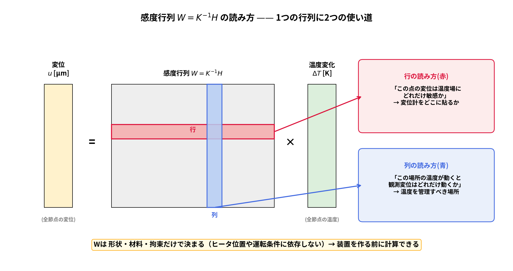
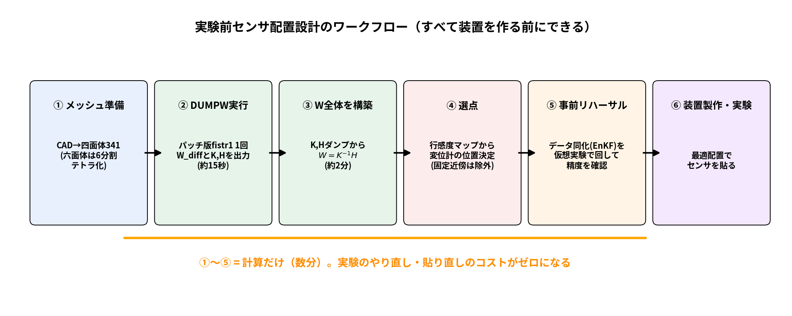
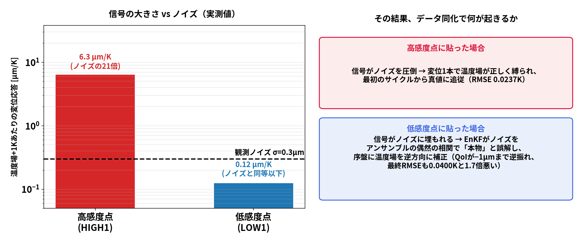

# 実務ガイド：W=K⁻¹H を使った「実験前のセンサ配置設計」（図解版）

105の検証で得られた、**装置を作る前にセンサ計画を最適化する**方法を、
図を使って順に説明する。今後の資料作り・実験計画にそのまま使える。

---

## 1. まず結論の1枚

> **感度行列 W=K⁻¹H を実験前に1回計算しておけば、
> 「どこに変位計を貼れば、1本の測定で温度場をよく縛れるか」が
> 装置を作る前に分かる。**

なぜそんなことができるのか、順に見ていく。

---

## 2. W=K⁻¹H とは何か ― 「温度を入れると変位が出てくる」変換表

構造の熱変形は（線形弾性なら）次の1本の式で書ける：

$$u = W \, \Delta T, \qquad W = K^{-1} H$$

- $\Delta T$：全節点の温度変化（入力）
- $u$：全節点の変位（出力）
- $W$：その変換表（K=剛性行列、H=熱ひずみ荷重行列。FEMの行列そのもの）

つまり **W は「どこが何℃上がると、どこが何µm動くか」を全組み合わせで持っている表**。
この表は行で読むか列で読むかで、答えてくれる質問が変わる：

- **行で読む（赤）**：「この点の変位を測ったら、温度場の情報をどれだけ拾えるか」
  → **変位計をどこに貼るか**を決める地図になる
- **列で読む（青）**：「この場所の温度が動くと、観測している変位がどれだけ動くか」
  → **温度を管理すべき場所**（治具・床への熱逃げ）を教える地図になる

一番大事な性質はこれ：
**Wは形状・材料・拘束（固定方法）だけで決まる。ヒータの位置や運転条件には依存しない。**
だから CADとメッシュさえあれば、装置がまだ存在しなくても計算できる。

### 本ケースで実際に計算したW（行の地図と列の地図）

- 左=行の地図：**上端ほど赤い**（底面で固定されているので、自由端の変位が
  温度に最も敏感）→ 変位計は上面に貼るべき、と装置を作る前に分かる
- 右=列の地図（W_diff）：QoI=Uz(A)−Uz(O)（上面の傾き）は
  **Point A側(+X)の下部の温度**に最も敏感 → そこの温度誤差が変位予測を最も汚す

> **誤読注意：この地図に温度は掛かっていない。** 表示しているのは純粋な感度
> ∂QoI/∂T [µm/K]（「もしそこが1℃動いたら」の係数）だけで、ヒータ位置や
> 実際の温度分布は入っていない。実際の変位誤差はこの感度×温度誤差
> （ΔQoI = Σ W_diff[j]·ΔT[j]）で決まる。ヒータを反対側に移してもこの地図は変わらない。

**では、なぜこの模様になるのか？（右の地図の読み解き）**

1. **+X側が赤／−X側が青なのは、QoIの定義点 Point A をたまたまヒータ側(+X)に
   選んだから。** QoI = Uz(A)−Uz(O) なので、Aの真下の柱の温度が上がると
   Aが持ち上がりQoIが増える（＋X側が赤）。逆にOの真下が温まるとOが持ち上がって
   QoIは減る（−X側が青＝負の感度）。つまり赤/青の分かれ方はヒータではなく
   「QoIをどの2点の差で定義したか」で決まっている。
2. **下部ほど濃い（効く）のは、下を温めるとその上の柱全体が持ち上がるから。**
   底面近くの1層が伸びれば、その上に載っている全部が一緒に持ち上がる。
   逆に上端を温めても、持ち上げる相手（その上の材料）がないので
   上面の変位への効きは小さい。

---

## 3. どうやって計算するか ― 実験前設計のワークフロー

かかるのは計算だけ（合計数分）。センサを貼ってから「場所が悪かった」と
やり直すコストがゼロになる。各ステップは本フォルダのスクリプトで再現できる：

| ステップ | スクリプト | 時間 |
|---|---|---|
| ① メッシュ準備（六面体→6分割テトラ化） | `run/dumpw_cylinder.py`（前半） | 数秒 |
| ② DUMPWパッチ版fistr1で1回実行 → W_diff + K,Hダンプ | 同上（後半） | 約15秒 |
| ③ K,HからW全体を構築 | `run/build_W_from_dumps.py` | 約2分 |
| ④ 行感度マップから変位計の位置決定 | `run/kinvh_sensitivity.py` | 数十秒 |
| ⑤ データ同化(EnKF)で事前リハーサル | `run/displacement_point_selection.py`ほか | 数分 |

---

## 4. なぜ貼る場所でそんなに差が出るのか ― 信号とノイズの闘い

変位計の読み値には必ずノイズが乗る（今回は σ=0.3µm）。
データ同化が使えるのは「ノイズより大きい信号」だけ。
W行感度の高い点と低い点では、この信号の大きさが**50倍**違う：

ポイントは「低感度点は**役に立たないだけでなく害になる**」こと。
信号がノイズに埋もれると、EnKFはノイズをアンサンブルの偶然の相関で
「本物の信号」と誤解し、温度場を**逆方向に**補正してしまう。

### 実際にそうなった証拠（同じ計算、変位計の場所だけ変えた）

QoI（上面の傾き）の時刻歴。低感度2点（青）は加熱序盤に**逆向きに−1µmまで暴れる**：

温度分布のアニメーション（左=高感度2点でDA / 中=低感度2点でDA / 右=真値）。
中パネルだけ序盤に真値からずれる：

変形そのもののアニメーション（低感度選点は傾きの向きまで誤る）：

---

## 5. 選点の設計則（今回の実証で確認した教訓）

どこが選ばれたか（全点にラベル付き）：

1. **W行感度の高い場所に変位計を貼る**（今回は上端。拘束から遠い側ほど感度大）
2. **固定部のすぐ近くに出る「異常に大きい感度」は捨てる**。
   固定点は「絶対に動かない」という条件を計算に無理やり入れている場所で、
   その処理の副作用として、すぐ隣の節点に「1℃で6×10⁷µm（=63m！）動く」
   ような**物理的にありえない値**が出る。これは計算処理が生んだ偽の感度なので、
   本物と区別して除外する（目安：全体の中央値の100倍を超えたら偽物と判定）
3. **2本目は「方向の違う」点を選ぶ**。1本目とWの行ベクトルの方向が近い点は
   同じ情報の二度測り。|cosθ|<0.9 を目安にすると堅牢
4. **温度センサは熱感度ではなく「推定したい未知量への感度」(dT/dQ)で選ぶ**。
   変位計を併用するなら、熱感度の高い場所の温度は変位計が既に間接的に
   見ている（冗長）。熱源近傍に置き、感度最小の場所だけは必ず避ける
5. **W列(W_diff)の地図は「温度管理すべき場所」を教える**。今回は底面固定部
   近傍が最も敏感 → 床への熱逃げ・治具温度の管理が変位精度を左右する

---

## 6. 効果の実証データ（スライド引用用）

| 検証 | 条件 | 結果 |
|---|---|---|
| 本ケース(105) ROM | 変位2点を高感度/低感度で選び分け | RMSE **0.0237K vs 0.0400K**（1.7倍） |
| KinvH 実FEM(570節点) | 同上 | QoI誤差 **89%→8%**（12倍） |
| 傾向 | モデル自由度が大きいほど | **差は拡大**（実機スケールでは死活問題） |
| 温度センサ側(証拠B) | W_diff最大/最小に温度計を置き分け | 0.0225K vs 0.0251K（差小＝変位と冗長） |

---

## 7. 工作機械への応用イメージ

- 主軸先端変位などの**QoIを `sensitivity_points.dat` に指定**すれば、
  W_diff がそのまま「主軸熱変位の温度感度マップ」になる
- QoIに対する**W行感度の高い位置へ変位センサを少数配置**すれば、
  過渡熱変位のリアルタイム推定（データ同化）が成立しうる
- 逆に「低感度位置へのセンサ増設は費用対効果が低い」と**定量的に**言える

## 8. 検証の信頼性（この数字の出所）

- W は DUMPWパッチ版FrontISTR（随伴法と2.4e-8一致検証済み, 20260810_KinvH）の
  K・Hダンプから構築し、DUMPW直接出力 W_diff と**最大相対差1.9e-7で一致**
- 独立な摂動法（120パッチ+1K×FrontISTR実行）とも**最大差5.8%**で整合
  （六面体vs四面体の離散化差）

解説図の再生成: `python3 run/make_guide_figs.py`
