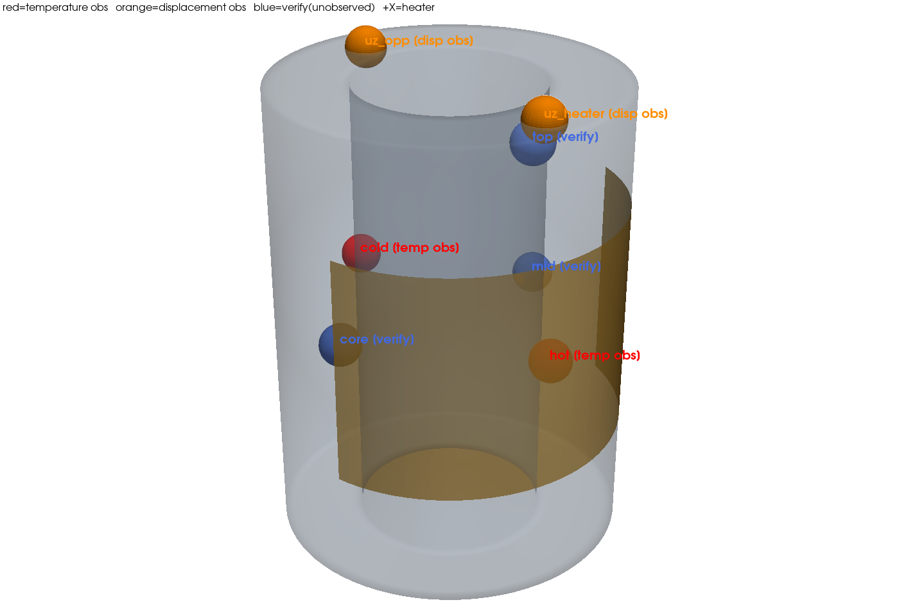
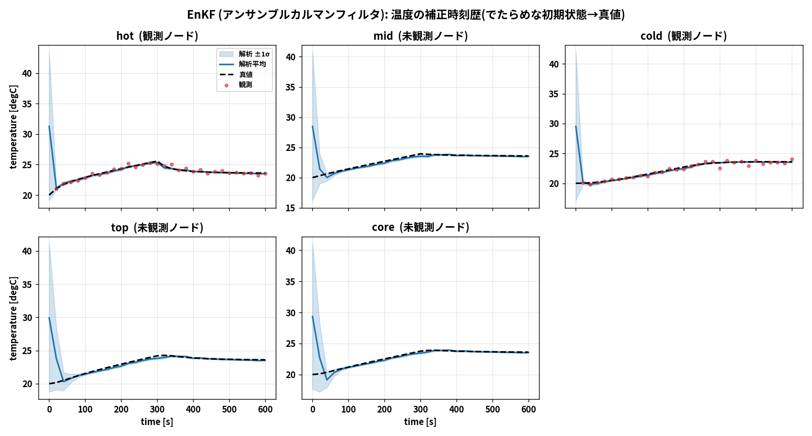
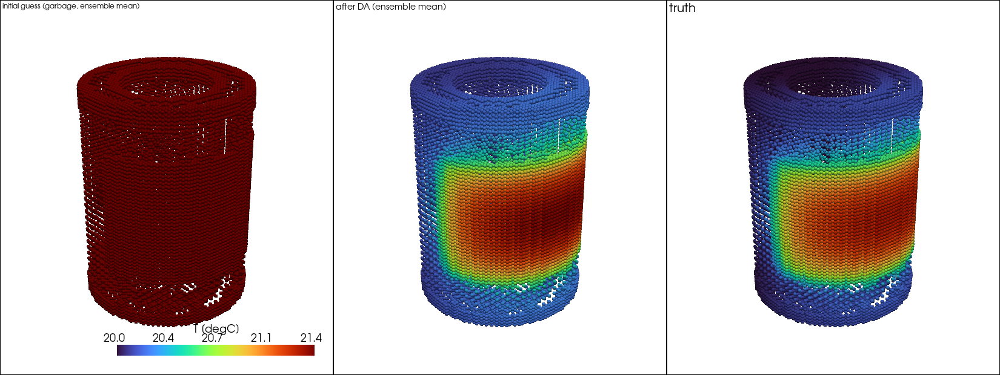
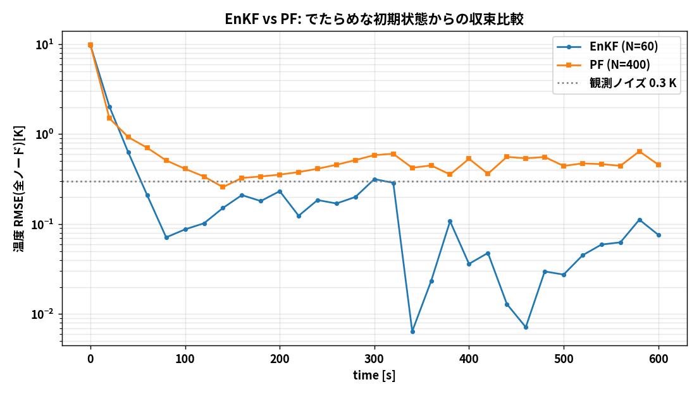
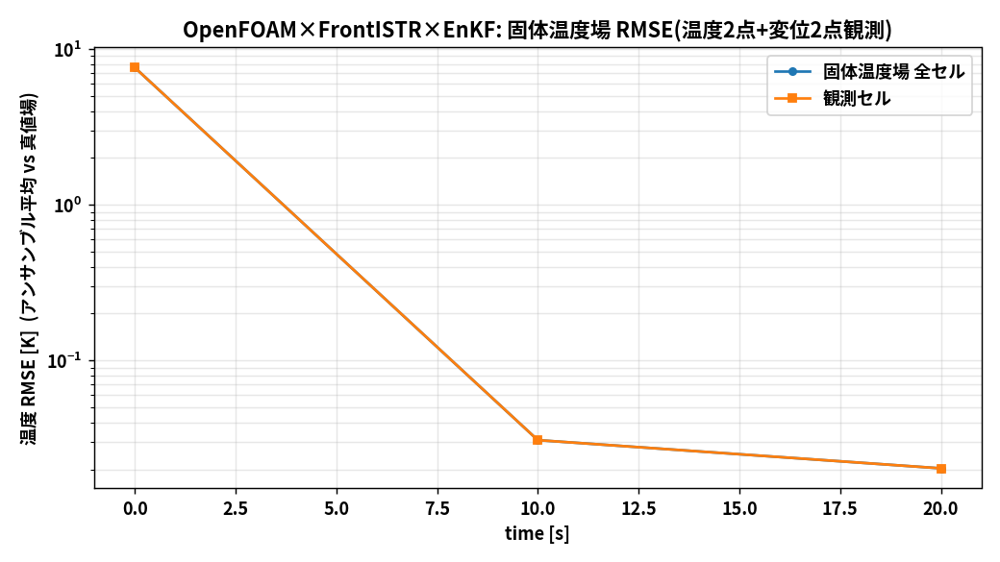
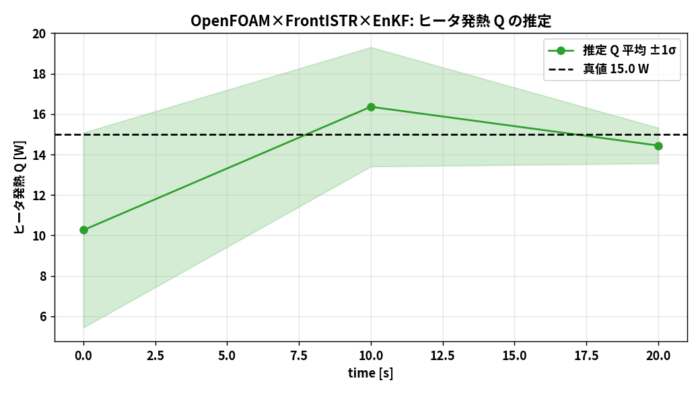
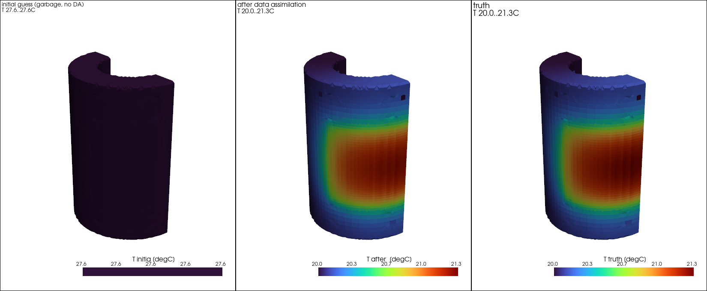
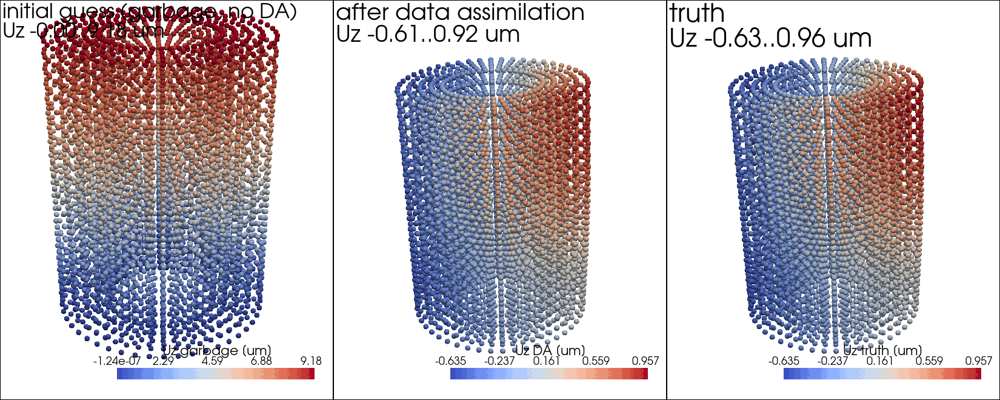

# データ同化開発 全作業ログ（103〜105）― 何をどこで行い、何に失敗し、何が成功したか

作業期間: 2026-09-08〜09-11（Claude Codeセッション）。
このドキュメントは「どのフォルダで・どんな手法/理論で・何を失敗し・何が成功したか」を
**失敗も含めて**時系列で正直に記録し、次回同じことを再現できるようにするもの。

---

## 0. 全体像（何を作ったか）

ベース: `sample/102_0`（中空円筒＋外周ヒータのchtMultiRegionFoam CHT）と
`sample/102_1`（その温度でFrontISTR熱膨張）。この2つを土台に:

| フォルダ | 内容 | 状態 |
|---------|------|------|
| `sample/103_0_openfoam_da_enkf` | 温度観測のみのEnKFデータ同化（ROM版＋OpenFOAM実機版） | 完了 |
| `sample/103_1_openfoam_da_pf` | 同じ問題を粒子フィルタで（EnKFとの比較） | 完了 |
| `sample/104_0_openfoam_frontistr_da_enkf` | **温度＋FrontISTR変位を観測に加えたEnKF**。ROM版・実機版・0→600sフル実行・GIF・発表スライド | 完了 |
| `sample/105_0_sensor_placement_sensitivity` | 変位観測の熱感度分布とセンサ配置の研究 | 完了 |

**解析条件（対象と観測点）:**

*中空円筒(外径75/内径40/高さ100.5mm)。赤=温度観測(hot/cold)、橙=変位観測(上面2点)、青=検証用未観測点。+X側にヒータ(0-300s通電15W)*

**全体の流れ:**

共通理論: 双子実験(OSSE) ＋ 拡大状態EnKF（状態=温度場＋パラメータQ,h、
標本共分散 $C_{zy}=\frac{1}{N-1}\sum\delta z\,\delta y^T$、ゲイン $K=C_{zy}(C_{yy}+R)^{-1}$、
摂動観測更新）。数式の全定義は `104_0/docs/10_q_estimation_explained.md` と
`103_0/docs/05_theory_to_code.md`。

2系統の前進モデルを使い分けた:
- **ROM**: 固体熱伝導PDEを有限体積の極限まで粗くした5ノード集中定数ODE
  （`dacore/cht_rom.py`）。102_0の温度履歴に最小二乗校正（残差0.012K）。数秒で0→600s
- **実機**: chtMultiRegionFoam（102_0の既存メッシュ20,696固体セル・輻射fvDOM・直列）
  ＋FrontISTR（変位観測）。1メンバー1ウィンドウ数分〜十数分

---

## 1. 103: 温度のみのデータ同化（EnKF vs PF）

### やったこと
- `dacore/`: ROM・校正・EnKF(`enkf.py`)・PF(`pf.py`)・双子実験ドライバ
- `daof/`: OpenFOAM連成（フィールド読み書き`of_io.py`・メンバー実行`of_case.py`・
  ドライバ`of_twin.py`）。状態=固体全セル温度＋Q、観測=hot/cold温度2点
- 実行規模: ROM 60メンバー×30サイクル(0-600s)、実機 5メンバー×2サイクル(0-20s)

### 成功
- ROM校正: 残差0.012K、全熱容量ΣC≈1191 J/K が鋼2.49kgのρcpV≈1195と一致（物理的に正）
- ROM-EnKF: RMSE 9.74→0.076K、未観測ノードも0.079K（2点観測で全体が直る）
- 実機EnKF: 場RMSE 7.61→0.085K、Q 15.00W回復
**103の結果図:**

*ROM-EnKF: でたらめ初期(10-50℃)が2点観測で真値に収束。未観測ノード(mid/top/core)も一致*

*実機EnKF(20s): でたらめ→同化後→真値。同化後と真値はほぼ見分けがつかない*

*同一観測でのEnKF(N=60)とPF(N=400)の比較。PFは次元の呪いで収束が浅い*

- **PFの退化を実証**（103_1）: N=5・2万次元でESS=1に崩壊、2.38K止まり。
  「なぜCFD同化はEnKFか」の生きた教材（`103_1/docs/04_enkf_vs_pf.md`）

### 失敗と対処
| 失敗 | 原因 | 対処 |
|------|------|------|
| 実機の時刻ディレクトリが`2.001591`になり再開失敗 | `adjustTimeStep yes`で`writeControl runTime`だと終端時刻を踏めない | `adjustableRunTime`に変更（`of_io.py set_control_window`） |
| 最初のROM実装で変位もどきの検討→勘違い | ―(後の104で本格化) | ― |
| VTKの点ラベルで日本語が消え`()`表示 | VTKにCJKグリフなし | ラベルをASCII化 |
| matplotlibで日本語豆腐 | フォント未登録 | `~/.fonts`のNoto CJKを`fontManager.addfont`（`dacore/plots.py`） |

### 再現
`103_0/docs/03_run_procedure.md` 参照。ROM=`run/run_enkf.py`（数秒）、
実機=`sh openfoam/setup_base_case.sh`→`run/run_openfoam_enkf.py`（〜1時間）。

---

## 2. 104: 温度＋変位観測のEnKF（本命）

104には**2系統**ある。混同しやすいので分けて書く:
- **(A) 実機版** = 前進モデルが **OpenFOAM(chtMultiRegionFoam)＋FrontISTR** そのもの
  （フォルダ `openfoam/run_fem_enkf`、1サイクル約80分）
- **(B) ROM版** = 前進モデルが5点ROM、変位はM演算子（FrontISTR応答を事前計算した行列）
  （フォルダ `run/`、数十秒。105の実験はすべてこのROM版の枠組み）

### やったこと (A) 実機版: OpenFOAM＋FrontISTRのEnKF
- 変位の観測演算子: 各メンバーの温度場→IDW補間→**FrontISTR線形静解析**→上面Uz2点
  （`fem/fem_obs.py`、102_1の連成コードをimport再利用。1評価16秒）
- `dacore/enkf.py`を非線形観測対応に拡張（H行列でなく**予報観測Yfをメンバーごと実評価**して渡す）
- ドライバ`daof/of_fem_twin.py`: 観測 y=[T_hot,T_cold,uz_heater,uz_opp]、
  R=diag(0.3²,0.3²,(1e-4mm)²,(1e-4mm)²)
- 可視化: 3D温度分布(実メッシュclip)・変位分布(FrontISTR変形)・da_vs_truth GIF・
  流速/固体温度/変形の0-600sアニメ・ParaView書き出し(vtu/pvd)

### やったこと (B) ROM版: 5点ROM＋M演算子のEnKF
- ROM側にも変位: 校正線形写像D(`dacore/displacement.py`)→のちM演算子へ（下記失敗参照）
- da_vs_truth系GIFはROM版で生成（実機は重いため）

### 共通(発表・docs)
- 発表: reveal.js(章=横/枚=縦, MathJax)＋weasyprint PDF。GitHub Pagesで公開
- docs 00〜13（初学者ガイド・ROM導出・Q推定の全記号・アニメ種明かし・手計算再現ほか）

### 成功
- **(A)実機20s**: 温度のみ0.085K→**温度+変位0.020K（4倍改善）**。変位がでたらめ判別に強力
  （+27Kのメンバーはuz≈+33µm vs 真値0.6µm）
- **(A)実機600sフル実行**（5メンバー×10サイクル、約13時間）:
  場RMSE **13K→0.011K**、Qはt=240sで15.08±0.16W→最終14.93W。
  ヒータOFF後（Q感度消失後）も真値追従を維持
- **(B)ROM変位同化も最終的に成功**: 温度2点0.076K→+変位0.004K(18倍)、
  温度1点0.236K→0.002K(100倍)。→ GIFも変位同化版で再生成

**104の結果図:**

*【(A)実機 OpenFOAM+FrontISTR】600sフル実行: 13K→0.011K。ヒータOFF(300s)後も維持*

*【(A)実機】Qの推定: 60sで急収束、240s以降は真値15Wに固定*

*【(A)実機】データ同化後の3D温度分布(中央)は真値(右)と一致。左はでたらめ初期*

*【(A)実機】データ同化された変位分布: 傾き方まで真値と一致*

*【(B)ROM版】温度分布の時刻歴(左=同化/右=真値, 0-600s)。最初の観測で吸い付き以後一致し続ける*

*【(B)ROM版】失敗1-3を修正した後のROM変位同化: 温度のみ0.076K→+変位0.004K*

### 失敗と対処（ここが一番学びが多い）
| # | 失敗 | 原因 | 対処・教訓 |
|---|------|------|-----------|
| 1 | ROMで変位を同化すると**発散(RMSE 280K)** | 校正線形写像Dが最小二乗の**悪条件解**（係数700〜2900µm/Kと非物理） | ユーザー案「5点→IDW→FrontISTR」で演算子Mを構築（単位温度モード5本の応答、0.05〜0.47µm/Kで物理的に妥当） |
| 2 | Mでも一度「改善」に見えた→**単位バグ** | Dはmm、Mはmで取り違え。変位観測が実質無視されて偽の改善 | 全部µmに統一して再検証（すると正しく発散が再現） |
| 3 | 単位統一後もMで**発散(289K)** | 予報観測を`M@T`（絶対温度）で作っていた。`M@Tref`≈数百µmの定数オフセットが毎回巨大イノベーションに | **アフィン`M@(T-Tref)`で各メンバー評価**に修正→ここで初めて成功。教訓:「観測が効かない」の多くは演算子の悪条件or基準量の抜け |
| 4 | 予報場が解析で上書きされ**保存されていない**（ユーザー指摘） | 設計時に補正前後比較を想定せず | 3ドライバ全部に`foremean_t*.npy`保存を追加（解析直前に保存） |
| 5 | `.gitignore`の行末コメントで`base_case/`29MBがstageされかけた | gitは行末コメント非対応 | コメントを行頭に分離。push前のリークチェックで捕捉 |
| 6 | GIFの解析ジャンプが「斜め線」に見える | プローブ出力5s間隔で補正の不連続が補間された | 解析直後の値を書き戻し場から読みNaN区切りで挿入 |
| 7 | PDFビルドが外部スライドの`\le`等で**クラッシュ** | matplotlib mathtextの非対応記法 | `\le/\ge`置換＋描画失敗時はTeX原文表示のフォールトトレラント化 |
| 8 | スライド再構成が外部セッションの158枚拡張と衝突しかけた | scratchpadの再生成スクリプトが古いバックアップ基準 | 「現行slides.jsonへ**追記のみ**」方針に変更 |
| 9 | 600sは当初20sだけで「よくわからない」（ユーザー指摘） | 実機が重く最小デモにしていた | ヒータをON/OFFテーブル化し600s×10サイクルを実行(13h)。ROM側で先に0-600s可視化も提供 |

### 再現
- 実機20s: `104_0/docs/01_method_walkthrough.md`
- 実機600s: `openfoam/da_openfoam_config.yaml`の`t_end_s:600, obs_interval_s:60`で
  `run/run_openfoam_fem_enkf.py`（直列約13時間）
- ROM(変位同化): `run/run_rom_fem.py`（twin_femの`assim_disp=True`）、
  M構築=`run/compute_M_operator.py`、比較=`run/compare_rom_disp.py`
- GIF: `run/make_da_gifs.py`ほか。スライド: `presentation/build_reveal.py`(+`build_presentation.py`)

---

## 3. 105: センサ配置×熱感度（ユーザー発案の研究）

### やったこと
- **熱感度 = FrontISTR(KinvH)の感度行列 W=K⁻¹H** を本ケース円筒に適用:
  1. 六面体メッシュを0-6対角で6分割テトラ化(23,040四面体, DUMPWは341専用)し、
     **DUMPWパッチ版fistr1**(`~/src/FrontISTR-dumpw`)で `sensitivity_Wdiff.vtk` と
     K・HのMatrixMarketダンプを出力（`run/dumpw_cylinder.py`、DIRECTソルバ15秒）
  2. ダンプしたK,Hから**W全体(5040×5040)を構築**（`run/build_W_from_dumps.py`、splu約2分）
     → DUMPW出力Wdiff_zと**最大相対差1.9e-7で一致**（出所の同一性を機械精度で確認）
  3. 行感度(変位観測点選定)・列感度(温度位置の影響)・選点を `run/kinvh_sensitivity.py` が確定
- 補助: 摂動法（120パッチ+1K、`run/sensitivity_map.py`）と5単位モードM_all
  （`run/displacement_point_selection.py`内）は**交差検証用**（W射影と最大差5.8%＝六面体vs四面体）
- **センサ配置実験**: 温度センサ1点をhot/mid/cold/top/coreに置き分け、
  (a)温度のみ (b)温度+変位2点(104のM同化) を5seedで実行（`run/sensor_placement_study.py`）
- 各位置の**Q感度dT/dQ**もROMで計算し、2種類の感度と精度を突き合わせ

### 成功（発見）
1. **仮説成立**——ただし効く感度は「変位熱感度」でなく**未知量へのQ感度dT/dQ**:
   その順位(hot>top>mid>core>cold)が同化精度の順位と**5点完全一致**。
   cold(最低感度)は一貫して最悪(1.4〜1.6倍)
2. 変位熱感度最大のtopが1位でない理由=**冗長性**（変位観測がすでに見ている場所の
   温度センサは情報が重複）。センサ価値=未知量への感度×非冗長性
3. 変位2点はどのセンサ位置でも**4〜6倍**効く（普遍的な補完観測）
4. W列(温度→観測変位)の知見: 変位は**底面固定部近傍の温度に最も敏感**
   （下を温めると上の柱全体が持ち上がる）、**負の感度領域**（温めると変位が
   下がる=傾き）が存在。W行(観測点選定)は**上端ほど大きい**（自由端が最も動く）
5. 固定節点まわりのW行感度は**偽の値（拘束処理の副作用）**（今回も最大6×10⁷µm/Kが出現、
   KinvHの教訓どおり除外。有効範囲は0.12〜6.3µm/K）
**105の結果図:**

*FrontISTR(KinvH)の感度行列W=K⁻¹H。左=行感度(どこの変位を測るべきか)、右=W列(どこの温度が観測変位を動かすか)*

*センサ位置別の同化精度。変位2点(青)はどこでも4-6倍効き、その上でhot>...>coldの序列*

*変位熱感度とは部分相関どまり。dT/dQで見ると5点完全一致(本文表)*

実機実験への指針も`105_0/docs/00_discussion.md`に記載。

### 失敗
- 特になし（104での失敗1〜3を previously 解決済みだったため一発で動いた）

### 再現
`105_0/README.md`。dumpw_cylinder(15秒)→build_W_from_dumps(2分)→kinvh_sensitivity(数秒)
→sensor_placement_study(数十秒)→displacement_point_selection→make_selection_gif。

---

## 4. 主要な数値まとめ（最終）

| 実験 | 初期 | 最終 |
|------|------|------|
| 103 ROM EnKF (温度2点) | 9.74K | 0.076K |
| 103 実機 EnKF 20s | 7.61K | 0.085K / Q15.00W |
| 103_1 実機 PF 20s | 7.61K | 2.38K（ESS=1退化の実証） |
| 104 実機 20s 温度+変位 | 7.61K | **0.020K** / Q14.44W |
| **104 実機 600s 温度+変位** | 13K | **0.011K / Q14.93W** |
| 104 ROM 温度+変位(M同化) | ~10K | **0.004K** |
| 105 センサ位置 best(hot)/worst(cold) | ― | 0.0269K / 0.0388K |

## 5. 公開物

- GitHub: https://github.com/kamakiri1225/thermal-da-demo （103/104/105全ソース・docs・図）
- スライド(ブラウザ): https://kamakiri1225.github.io/thermal-da-demo/sample/104_0_openfoam_frontistr_da_enkf/presentation/conference_reveal.html
- 重い生成物（メッシュ入りケース・時間ディレクトリ・VTU）は各`.gitignore`で除外、
  すべて`setup_base_case.sh`＋runスクリプトで再生成可能

## 6. 環境メモ（再現の前提）

- WSL2 / OpenFOAM v2512（`chtMultiRegionFoam`）/ FrontISTR `fistr1` / Python3.12
  (numpy, scipy, matplotlib, pyvista, yaml) / ImageMagick `convert` / pandoc / weasyprint
- WSL2では`OMP_NUM_THREADS=4 OPENBLAS_NUM_THREADS=4`必須（numpyハング対策）
- 日本語図: `~/.fonts/NotoSansCJKjp-*.otf`をmatplotlibに登録（`dacore/plots.py`が自動）
