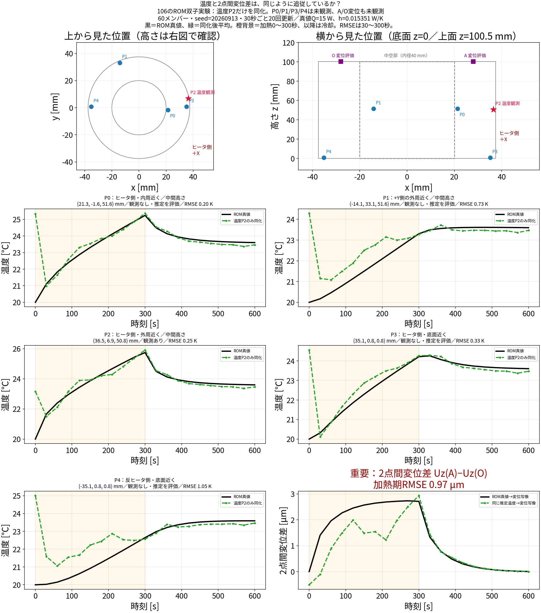
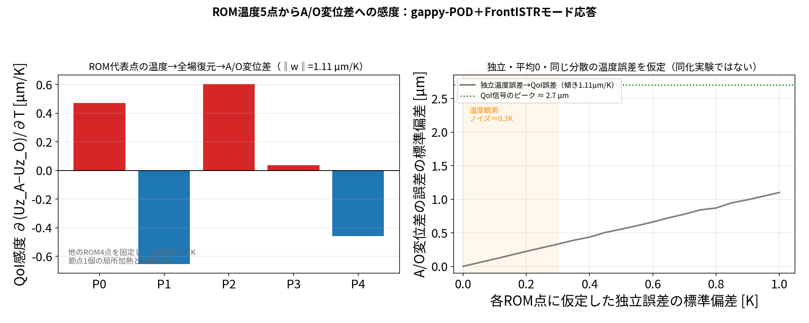
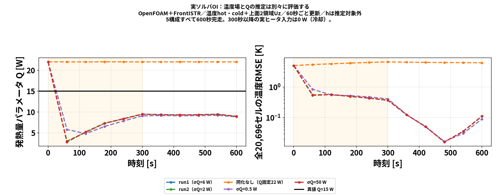
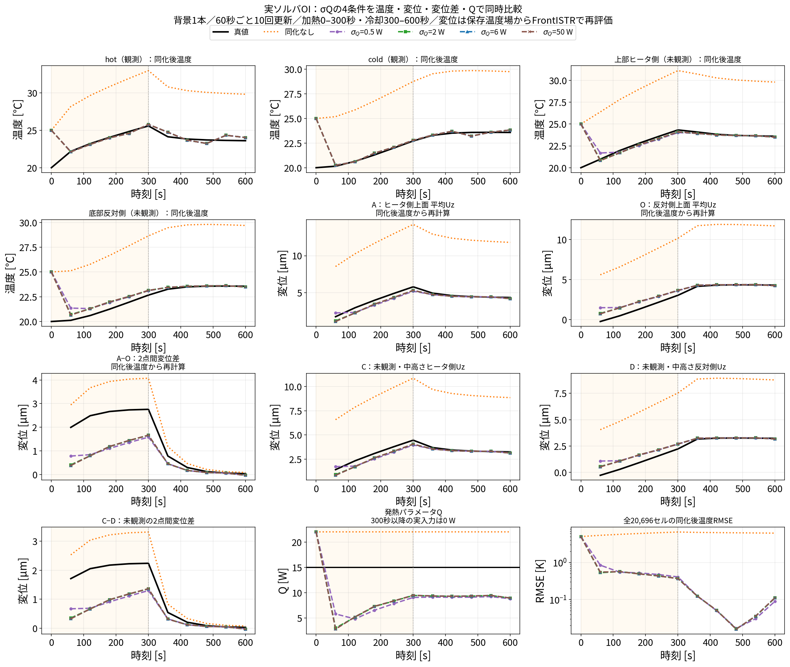
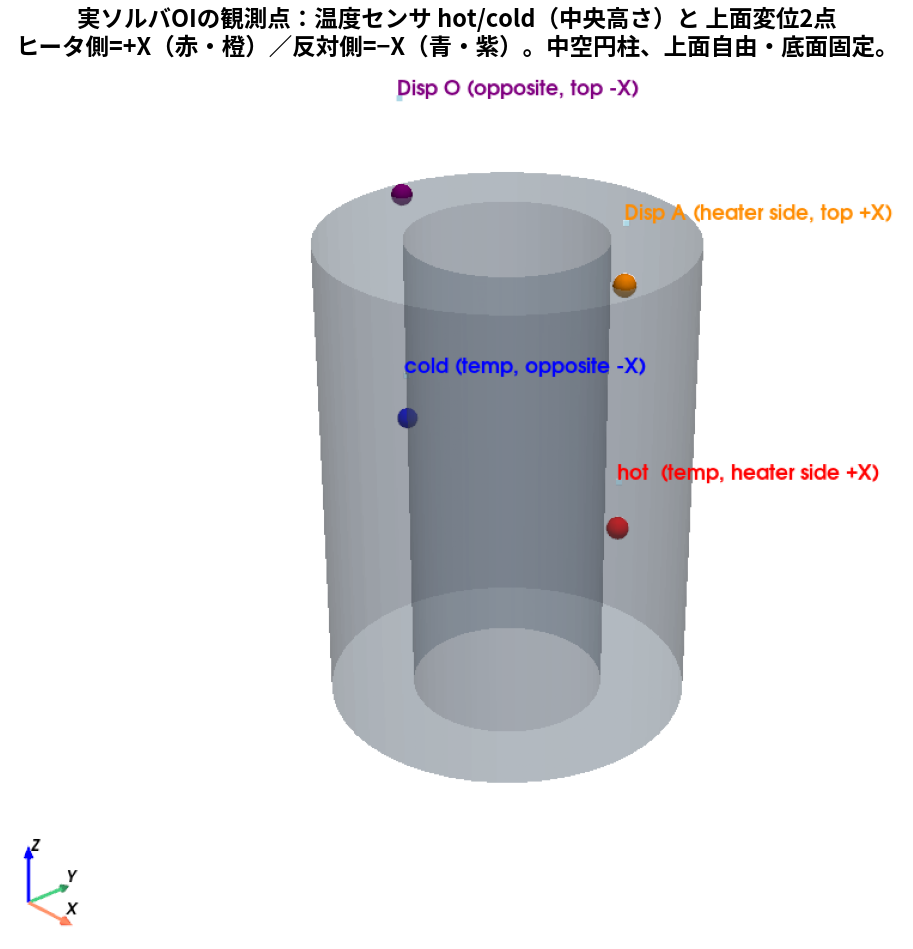
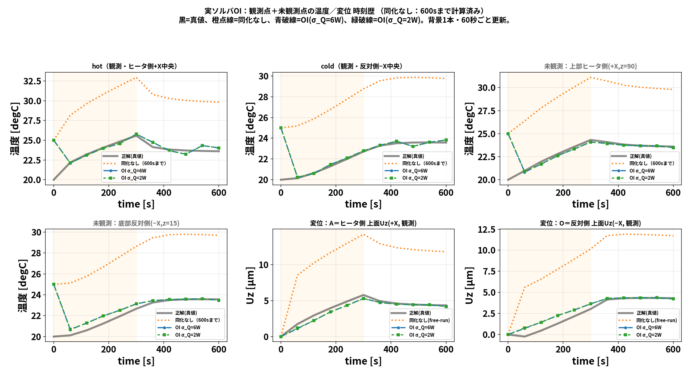

# 前提：104 の「実ソルバ・データ同化」― どのプログラム・どのアルゴリズムか

106 のROMは、**104 の実ソルバ・データ同化を高速化するために作った**。
このドキュメントは、その 104 が「どのプログラムで・どんなアルゴリズムで同化していたか」を
丁寧に押さえるためのもの。ここが分かると、106 が「**予報モデルだけを ROM に置き換えた、
まったく同じ EnKF**」だと見える。

- 数式・アルゴリズムの本編（POD / Q-DEIM / ROM 校正）は `01_pod_qdeim_algorithm.md`。
- 実験の全ストーリー（結果と図）は `02_full_story.md`。

### 登場するフォルダと役割（どこで計算し、結果がどこにあるか）

すべて `sample/` 直下。本ドキュメントで数字を引くときは、この対応で「どこで計算したか」をたどれる。

| フォルダ | 何を計算するか | 主な結果の置き場所 |
|---|---|---|
| `102_0_openfoam_hollow_cylinder_heat_transfer` | OpenFOAM(CHT・流体＋固体連成)で温度場・流速場 | 各時刻ディレクトリ（`{t}/fluid`, `{t}/solid`）、`ani/` |
| `102_1_frontistr_hollow_cylinder_thermal_expansion` | FrontISTR 熱膨張（メッシュ・材料・変位計算のpython） | `python/`（他フォルダから import して使用） |
| `104_0_openfoam_frontistr_da_enkf` | **実ソルバEnKF同化**（OpenFOAM＋FrontISTR）。OIもここで回す | `results/openfoam_fem_enkf_*.yaml/csv`、`openfoam/run_fem_enkf/`（真値・各メンバー場） |
| `105_0_sensor_placement_sensitivity` | **熱感度 $W=K^{-1}H$**（FrontISTR DUMPW） | `results/kinvh_sensitivity.npz`（row_sens, colA, colO ほか） |
| `106_0_pod_selected_rom`（本フォルダ） | **POD選定ROM＋ROM上の同化**、証拠図・スライド | `results/*.npz/*.yaml`、図は `docs/img/`、スライド `docs/slides_*.html` |

- 各図の直前に付けた「**図の条件**」行にも、5メンバー／seed／観測構成など「どの計算か」を明記している。
- 各節末に、その数字の**出典ファイル**（`results/...` や 104/105 のパス）を添える。

---

## はじめに：なぜ「熱変位の同化」をやってみたのか

**熱変位（熱膨張による変形）を計算で当てるのは、実はとても難しい。**
変位は温度差から生じる熱応力の積分で決まるため、
**初期温度・熱源の熱量（発熱）・熱伝達率（対流や接触熱抵抗）・輻射熱**など、
**発熱と放熱に関わる境界条件を"すべて"正しく合わせないと再現できない**。
どれか1つがずれれば温度場がずれ、その温度場から出る変位もずれる。

しかも厄介なのは、**温度の傾向（分布や時刻歴）がそれらしく合っていても、
変位まで合うとは限らない**という点。変位は $u=W\,\Delta T$ （ $W$ ＝温度→変位の感度）で決まり、
**$W$ が大きいのでわずかな温度誤差を増幅して映す**。
だから「温度が近いから変位も近いはず」とは言えない。

### 結果の証拠：温度の追従と2点間変位差の追従を、同じ計算で比較する

**図の条件**：106のROM双子実験。温度観測はP2の1点のみ
（ヒータ側外周近く、座標(36.487,6.896,50.781) mm）。変位は同化に使わない。
60メンバー、seed=20260913の1回、30秒ごとに20回更新。
黒はROM真値、緑は同化後60メンバー平均。橙の背景は加熱0〜300秒。

**P0〜P4はROMの代表温度点の番号であり、5本の温度センサを使った実験ではない。**
同化に使う温度はP2の1点のみ。P0/P1/P3/P4は直接観測せず、推定した温度を真値と比較する。

| 点 | 円筒上の位置 | 座標(x,y,z) [mm] | この計算での扱い |
|---|---|---|---|
| P0 | ヒータ側・内周近く、中間高さ | (21.304, −1.625, 51.563) | 未観測・温度推定を評価 |
| P1 | +Y側の外周近く、中間高さ | (−14.123, 33.093, 51.563) | 未観測・温度推定を評価 |
| **P2** | **ヒータ側・外周近く、中間高さ** | **(36.487, 6.896, 50.781)** | **唯一の温度観測点** |
| P3 | ヒータ側、底面近く | (35.131, 0.781, 0.777) | 未観測・温度推定を評価 |
| P4 | 反ヒータ側、底面近く | (−35.131, 0.781, 0.777) | 未観測・温度推定を評価 |

原点は円筒底面の中心、+zは上向き、+Xがヒータ側。外径75 mm、内径40 mm、高さ100.5 mm。
図の上段に上面図と側面図を追加し、各時刻歴のタイトルにも位置と座標を付けた。
A/Oは上面の変位評価位置で、この計算では変位観測を同化に使っていない。



**見てほしい箇所は、5つの温度グラフと右下の2点間変位差の違い。**
温度は観測を取り込んで初期のずれが減り、昇温・冷却の大まかな変化を追っている。
一方、右下の変位差には加熱中に真値からのずれが残る。
温度P4などにも誤差が残っており、「温度が完全に一致しているのに変位だけ違う」という図ではない。
**温度が大まかに追従したことだけでは、知りたい2点間変位差の精度を保証できない**という例である。

右下はA/O（目標位置(±28,0,100.5) mmの最近傍FEM節点）の $u_z(A)-u_z(O)$ 。
同じ5点の推定温度をgappy-PODで復元し、FrontISTRで事前計算したモード応答に通した。
真値も同じ写像に通す。図の温度と変位は同じ時刻・同じ推定状態から計算している。
各パネルのRMSEは30〜300秒の10時刻の時間RMSEで、温度はK、変位差はµm。
異なる単位の数値の大小を直接比べず、それぞれの許容誤差に照らして評価する。

出典：`results/da_history.npz`、`results/disp_operator.npz`。
生成：`run/make_temperature_displacement_evidence.py`。

<details>
<summary>補足：なぜ温度の残差が変位差に影響するのか（復元を含む感度）</summary>

**以下は理由を説明する感度計算で、上の時刻歴による結果の証拠とは区別する。**
ROM代表点温度から、復元を介して上面A/Oの変位差に至る感度を求める。
FrontISTRの節点温度を直接変えた感度とは、入力の定義が異なる。

FrontISTRの線形熱弾性を $K_su=H_T\Delta T_{\rm FEM}$ と書くと、

$$W_{\rm FEM}=K_s^{-1}H_T,\qquad
[W_{\rm FEM}]_{ij}=\frac{\partial u_i}{\partial T_{{\rm FEM},j}}.$$

これは他の節点温度を固定して、FEM節点jの温度を変えたときの変位自由度iの応答。
105の`kinvh_sensitivity.npz`は、この全節点温度に対する感度から作ったデータである。

一方、下図の入力はROMの5点温度 $T_5$ で、全温度場の復元を挟む。
$\Phi$ をPODモード、Pを代表点の抽出演算子、Jを全セルからFEM節点への温度写像とすると、

$$a=(P\Phi)^+(T_5-P\bar T),\qquad
T_{\rm FEM}=J(\bar T+\Phi a),\qquad u=W_{\rm FEM}(T_{\rm FEM}-T_{\rm ref}).$$

A/Oの変位を抜き出す演算子をEと書けば、FrontISTRで事前計算したモード応答は
$D_{\rm mode}=EW_{\rm FEM}J\Phi$ 。図の感度は連鎖則で

$$\boxed{w=\frac{\partial(u_A-u_O)}{\partial T_5}
=[1,-1]D_{\rm mode}(P\Phi)^+}\quad(1\times5).$$

**ROM点1つを＋1 Kすると復元温度場の多数のセルが変わる。その変化全体に対する変位差の応答**を描いている。
棒の値を「その場所のFEM節点だけを＋1 Kした感度」と読んではいけない。
`results/disp_operator.npz`は5モードのFrontISTR応答を持ち、
`run/make_disp_amplification_fig.py`の
`w = (Dmode[0] - Dmode[1]) @ np.linalg.pinv(U[pod, :])`が上式に対応する。



- **この補足図は、同化後の温度・変位がどう追従したかを示す結果図ではない。**
  実際の追従の比較は、上の「同一計算で比較する温度5点と2点間変位差」の時刻歴を見る。
- 左：他のROM4点を固定し、1点だけ温度を変えたときの、全場復元を介したA/O変位差の感度w。
- 右：5点の誤差が平均0、互いに独立、共通標準偏差 $\sigma_T$ という仮定の計算。
  $\delta d=w\delta T_5$ なので、 $\operatorname{Var}(\delta d)=\sigma_T^2ww^\top$ 、
  $\sigma_d=\sigma_T\|w\|_2$ となる。0.5 Kなら約0.55 µmという値は、この仮定に限る。
- 一般には $\operatorname{Var}(\delta d)=wC_Tw^\top$ 。誤差が残る位置や相関によって結果は変わる。
- 旧図の0.45 K／0.98 µm等の同化結果は、別の高W観測点の平均絶対誤差であり、
  A/O変位差の標準偏差と比較できないため、この図から除いた。

（詳細な実験は `02_full_story.md` の 4-3、再現は `run/make_disp_amplification_fig.py`。）

</details>

そこで本研究では、**まず OpenFOAM(CHT＝流体＋固体連成)＋FrontISTR(熱応力) で
実際にやってみたらどうなるか**を試した。
具体的には「温度や変位を観測に入れて**データ同化**すれば、
分からない熱量や温度場・変位を、でたらめな初期状態から当てられるか？」を双子実験で確かめる。

### 実測ではどう測るのか（触り）

同化は「観測」を頼りに補正する。実機では次のように測る（本研究は双子実験なので、
これら実センサの代わりに真値計算＋ノイズで模擬している）:

| 測る量 | センサ（実測） | 役割 |
|---|---|---|
| 温度 | **熱電対**（接触・多点） | 各点の温度を直接測る |
| 熱流束 | **熱流束センサ** | 境界の熱の出入り＝熱伝達率・熱源の手がかり |
| 変位 | **レーザ変位計**（非接触）ほか静電容量式・渦電流式、接触式ならタッチプローブ/ダイヤルゲージ | 上面や主軸端などの微小変位（µmオーダー）を測る |

本研究の観測ノイズは温度 0.30 ℃、変位 0.1 µm（＝レーザ変位計クラス）に設定している。
温度は熱電対、熱流束は熱流束センサ、変位はレーザ変位計、というのが実機での対応イメージ。

### まずやってみた結果（104）

- **設定**：5メンバー、観測＝温度2点（hot/cold）＋上面変位2点（ヒータ側/反対側）、
  60秒ごと10サイクル（300秒でヒータOFF）、真値 $Q_\text{true}=15$ W、初期温度20℃。
- **結果**：でたらめ初期から、
  - **固体温度場 RMSE 7.61 K →（同化後）0.011 K** まで一致、
  - **発熱量 $Q$ を 14.93 W（真値15 W）** と復元。
  - → 温度・変位の観測を入れれば、未知の熱量や温度場を当てられることを実ソルバで確認できた。
- **ただし計算が重い**：**10分間（600秒）の現象に約13時間**（対象時間の約78倍）。
  予報モデル（OpenFOAM）を毎サイクル×全メンバー回すためで、
  観測配置やメンバー数を何通りも試す研究には重すぎる。
  **→ これが 106 で予報モデルを ROM に置き換える動機**（同化アルゴリズムは同じ）。

以下では、この 104 の同化が「どのプログラムで・どんなアルゴリズムか」を A〜E で押さえる。

#### 104で実際に行ったEnKFの計算手順

104の状態は、20696セルの固体温度と発熱量を連結した
\[
z^{(m)}=\begin{bmatrix}T^{(m)}_1,\ldots,T^{(m)}_{20696},Q^{(m)}\end{bmatrix}^{\mathsf T}
\in\mathbb{R}^{20697},\qquad m=1,\ldots,5
\]
である。各60秒窓で、まず5メンバーそれぞれをOpenFOAMで前進し、
その固体温度をFrontISTRへ渡して上面2点の鉛直変位を計算する。これにより、
温度・発熱量の予報行列 $Z_f$ （ $5\times20697$ ）と変位を含む予報観測行列
$Y_f$ （ $5\times4$ ）を得る。

次に、メンバー方向の平均と偏差を計算する。
\[
\bar z=\frac{1}{5}\sum_{m=1}^{5}z_f^{(m)},\quad
\bar y=\frac{1}{5}\sum_{m=1}^{5}y_f^{(m)},\quad
dZ_m=z_f^{(m)}-\bar z,\quad dY_m=y_f^{(m)}-\bar y.
\]
偏差行列を $dZ\in\mathbb{R}^{5\times20697}$ 、 $dY\in\mathbb{R}^{5\times4}$ とすると、
標本共分散は
\[
C_{zy}=\frac{dZ^{\mathsf T}dY}{5-1}\;(20697\times4),\qquad
C_{yy}=\frac{dY^{\mathsf T}dY}{5-1}\;(4\times4).
\]
前者は温度各セル・ $Q$ と4観測成分の共分散、後者は観測成分同士の共分散である。
カルマンゲインは
\[
K=C_{zy}(C_{yy}+R)^{-1}
\]
で求める。実装では逆行列を作らず、4×4の連立方程式を `np.linalg.solve` で解く。
観測摂動 $\epsilon^{(m)}\sim\mathcal N(0,R)$ を各メンバーに加え、
\[
z_a^{(m)}=z_f^{(m)}+K\left[y+\epsilon^{(m)}-y_f^{(m)}\right]
\]
として5メンバーを更新する。更新した温度場と $Q$ を各OpenFOAMケースへ書き戻し、
次の60秒窓の初期状態にする。この予報→平均・偏差→共分散→ゲイン→更新を10回繰り返した。

**変位観測を使ったかどうか**：104の実ソルバEnKFでは使っている。観測ベクトルは
\[
y=\begin{bmatrix}T_{hot}&T_{cold}&u_{z,A}&u_{z,O}\end{bmatrix}^{\mathsf T}
\]
の4成分である。各メンバーの固体温度をFrontISTRへ渡して得た
$u_{z,A},u_{z,O}$ を $Y_f$ の2列として共分散とカルマンゲインに含めたため、
変位の観測残差も温度場と $Q$ の更新に使われる。
一方、106 ROMの「温度5点と2点間変位差」の図では、温度P2だけを同化し、
A/O変位差は同化後温度から計算して比較しただけである。こちらでは変位観測を使っていない。

#### なぜ10分の現象に約13時間かかったのか

平均・偏差や共分散の行列積そのものは、5メンバー分をまとめて計算するため数秒程度であり、
13時間の主因ではない。重いのは、各サイクルで5メンバーについて
\[
5\ \text{回のOpenFOAM(CHT)前進}
\;+
5\ \text{回のFrontISTR熱弾性解析}
\]
を実行したことである。さらに、観測を作る真値ランも別に必要である。
10サイクルでは、少なくともメンバー予報50窓（OpenFOAM）とFrontISTRの多数回の
変位評価を行うため、物理時間600秒に対して実時間約13時間（約78倍）となった。
この計算コストを減らすため、106では同じEnKFの平均・偏差・共分散・更新式を保ったまま、
OpenFOAMの20696セル予報を5点POD-ROMへ置き換えた。

---

## OI（最適内挿）なら軽くできるか？ ― 決め打ち共分散で、実ソルバ1本だけ回す

EnKF が重いのは「アンサンブル $N$ 本を毎サイクル走らせて共分散を作る」ため
（104：`sample/104_0_openfoam_frontistr_da_enkf`、5メンバーで約13時間）。
そこで **OI（最適内挿）** が候補になる。OIは**背景誤差共分散 $B$ を事前に決め打ちで固定**し、
毎サイクルはアンサンブルでなく **背景トラジェクトリ1本**だけを実ソルバ（OpenFOAM＋FrontISTR）で回す:

$$z_a=z_b+K\,(y-h(z_b)),\qquad K=B H^\top (H B H^\top+R)^{-1}\ \text{（ $B$ 固定なら $K$ も固定）}.$$

**要点：OIはアンサンブルで何ケースも回さなくてよい**。予報は背景1本なので、実ソルバの実行本数は
EnKFの $1/N$ 。104（5メンバー・約13時間）に対し、**OIなら概ね $13\text{h}/5\approx2.6$ 時間**の見込み
（OpenFOAM・FrontISTR の実行本数がメンバー数分だけ減るため）。

観測点はすべて熱感度 $W=K^{-1}H$ で選ぶ（106の主軸に統一。計算元は 105：
`sample/105_0_sensor_placement_sensitivity` の `results/kinvh_sensitivity.npz`）:
- 温度センサ：FrontISTR(DUMPW)の $W$ から $\partial\mathrm{QoI}/\partial T=\text{colA}-\text{colO}$ を取り、
  有効域で最大の点（ $\partial T/\partial Q$ は使わない）。
- 変位センサ：同じく $W$ 行感度の高い上端2点（高W）。

### 今回のOIで熱伝達率はどう扱っているか

**熱伝達率を未知パラメータとして同定していない。また、固体表面に一定の熱伝達率を与える方式でもない。**
OpenFOAMで固体と周囲流体を連成して解き、界面の温度と熱流束が整合するように熱移動を計算する。
同化で直接更新するのは固体温度場と発熱量 $Q$ のみであり、流体温度や流速をOIで直接補正してはいない。

実際の設定は次のとおり。

- 固体側 `solid_to_fluid` と流体側 `fluid_to_solid` の温度境界条件は、いずれも `compressible::turbulentTemperatureCoupledBaffleMixed`。
- 流体領域の外側 `roomWalls` は温度 293.15 K（20 ℃）の固定値。この値は壁面熱伝達率ではなく、周囲領域の温度境界条件。
- ヒータ面は `externalWallHeatFluxTemperature` の `mode power` で、同化した発熱量 $Q$ を加熱区間に与える。

したがって、壁面からの放熱は予報計算の中で求まる。必要なら計算後に、外向き熱流束を $q''_{\rm out}$ 、
壁面温度を $T_w$ 、選んだ参照温度を $T_{\rm ref}$ として、

$$h_{\rm eff}(\boldsymbol{x},t)=\frac{q''_{\rm out}(\boldsymbol{x},t)}{T_w(\boldsymbol{x},t)-T_{\rm ref}}
\quad [\mathrm{W/(m^2 K)}]$$

という**結果から評価する熱伝達率**を定義できる（温度差がゼロ付近では評価が不安定）。
これはOIで同定したパラメータではなく、参照温度の選び方にも依存する後処理量である。
ROMの放熱係数 $h$ [W/K] とも単位・定義が異なり、そのまま数値を比較できない。
今回のOI結果について「 $h$ を推定できた／できなかった」という評価は行わない。

#### OpenFOAMの温度をFrontISTRへ渡すことの意味

計算の役割分担は次の一方向連成である。

$$
\text{OpenFOAM (CHT)}
\;\xrightarrow[\text{固体セル温度 }T_s(\boldsymbol{x},t)]{}
\text{温度の写像・補間}
\;\xrightarrow{}
\text{FrontISTR (熱弾性)}
\;\xrightarrow{}
\boldsymbol{u}(\boldsymbol{x},t).
$$

OpenFOAMは流体の対流、固体内の熱伝導、固体‐流体界面の熱流束を解くため、
計算の結果として局所的な熱伝達の強さが決まる。FrontISTRはその結果得られた固体温度を
節点温度へ写像し、基準温度 $T_\mathrm{ref}$ からの差
$\Delta T=T_s-T_\mathrm{ref}$ を熱荷重として熱変形を解く。
したがって、**温度をOpenFOAMからFrontISTRへ引き継ぐ方法は、この研究の目的（温度場から変位を予測する）に対して妥当**である。

この近似では、変形した形状や変位が流れ場・熱流束を変える効果を次のOpenFOAM計算へ戻していない。
つまり「熱→変形」の一方向連成であり、変形が熱伝達へ与える影響が小さい範囲で成立する。
大変形や接触状態の変化まで扱う場合は、FrontISTRの変形形状をOpenFOAMのメッシュへ戻す
反復（熱‐構造の双方向連成）が別途必要になる。

104の実装では、`daof/of_case.py::read_solid_T` がOpenFOAMの時刻ディレクトリから
固体セル温度を読み、`fem/fem_obs.py::displacement_obs` がその温度場を
`run_thermal_expansion.py` に渡してFrontISTRを実行する。FrontISTRから返すのは、
ヒータ側上面と反対側上面の平均 $u_z$ （2点）である。OIの観測ベクトルにはこの2点変位を
含められるが、hを状態として更新する処理はない。

確認したファイル：
[OIドライバ](../../104_0_openfoam_frontistr_da_enkf/run/run_openfoam_fem_oi.py)、
[状態を書き戻す処理](../../104_0_openfoam_frontistr_da_enkf/daof/of_case.py)、
[実行ケースの固体温度境界条件](../../104_0_openfoam_frontistr_da_enkf/openfoam/run_fem_oi/0/solid/T)、
[流体温度境界条件](../../104_0_openfoam_frontistr_da_enkf/openfoam/run_fem_oi/0/fluid/T)。

### OI では「分散（背景共分散 $B$ ）」をどう決めるのか

EnKFは $B$ を**アンサンブルの標本共分散**として毎サイクル作り直す。OIは逆で、 $B$ を**事前に決め打ち**する。
決め方の流儀:

1. **物理・モデル感度から作る（今回のOI）**：未知の発熱量 $Q$ の不確かさを、
   $\delta T\approx s_Q\delta Q$ （ $s_Q$ は $\partial T/\partial Q$ の近似、単位 K/W）で温度場へ伝播する:
   $$B_{TT}=\sigma_Q^2 s_Q s_Q^\top+\sigma_T^2 I,\quad
   B_{TQ}=\sigma_Q^2 s_Q,\quad B_{QQ}=\sigma_Q^2.$$
   $\sigma_Q,\sigma_T$ は事前に設定する**標準偏差**で、その二乗が分散。
   $B_{TQ}$ により温度・変位の観測から $Q$ を更新する。今回のOIには $h$ の状態・共分散・更新式はない。

ここで $T$ は20696セルの温度ベクトルなので、概念上 $B_{TT}$ は
20696×20696行列である。ただしプログラムはこの大行列を作らず、必要な積
$HBH^\mathsf{T}$ と $BH^\mathsf{T}$ を次の成分式で直接計算する（`run/run_openfoam_fem_oi.py` の94〜118行）。
温度観測セル $i,j$ については
\[
 (HBH^\mathsf{T})_{ij}=\sigma_T^2\,\delta_{ij}
       +\sigma_Q^2s_Q(x_i)s_Q(x_j),
\]
であり、温度と変位の共分散も同じ $\sigma_Q^2$ のランク1項から作る。
したがって、温度セル間の非対角共分散を距離 $L$ で広げる設定ではなく、
$Q$ の影響分布 $s_Q$ に沿った相関だけを持つ近似である。
観測ノイズの共分散は別の行列 $R$ （設定ファイルの温度ノイズ・変位ノイズの二乗を対角に置く）で、
OIの更新では $S=HBH^\mathsf{T}+R$ を作り、固定ゲイン $K=BH^\mathsf{T}S^{-1}$ を用いる。

#### 行列の意味を成分で書く

状態ベクトルは
\[
x=\begin{bmatrix}T_1&T_2&\cdots&T_{20696}&Q\end{bmatrix}^{\mathsf T}
\]
である。 $T_i$ はOpenFOAM固体セル $i$ の温度、 $Q$ は発熱量 [W] である。
背景誤差を $\delta x=[\delta T;\delta Q]$ とし、
$\delta T\simeq s_Q\delta Q+\eta_T$ （ $\eta_T$ はセルごとの独立誤差）と仮定すると、
\[
\begin{aligned}
\operatorname{Cov}(T_i,T_j)
  &=s_Q(x_i)s_Q(x_j)\sigma_Q^2+\delta_{ij}\sigma_T^2,\\
\operatorname{Cov}(T_i,Q)&=s_Q(x_i)\sigma_Q^2,\\
\operatorname{Var}(Q)&=\sigma_Q^2.
\end{aligned}
\]
例えば $i=j$ なら $T_i$ の分散は
$s_Q(x_i)^2\sigma_Q^2+\sigma_T^2$ 、 $i\ne j$ なら同じ発熱量誤差を共有する分だけ
$s_Q(x_i)s_Q(x_j)\sigma_Q^2$ の共分散を持つ。

この $B$ と観測演算子 $H$ から、観測空間の予測誤差共分散
\[
S=HBH^{\mathsf T}+R
\]
を作る。 $R$ は観測ノイズの共分散であり、温度センサの分散と変位センサの分散を対角に置く。
そして観測残差 $d=y-h(x_b)$ に対して
\[
x_a=x_b+BH^{\mathsf T}S^{-1}d
\]
で温度場と $Q$ を同時に補正する。実装は $B$ 全体を生成せず、 $BH^{\mathsf T}$ と
$HBH^{\mathsf T}$ を成分式で計算している。

#### $\sigma_Q$ はどれを選ぶべきか

今回の4ケースでは、最終温度場RMSEだけを見ると $\sigma_Q=0.5$ W が最小（0.090 K）で、
2 W、6 W、50 Wはそれぞれ0.111、0.112、0.113 Kであった。一方、推定 $Q$ は全ケースで
約8.8〜9.0 Wに留まり、真値15 Wを再現していない。したがって、**今回の試験範囲で温度場を
最もよく合わせる設定は0.5 W**だが、これを一般的な最適値や $Q$ 同定に最適な値とは言えない。
実運用では、検証用の別データを残し、温度場RMSEだけでなく $Q$ の誤差や変位誤差を含む評価関数で
$\sigma_Q$ を選ぶ必要がある。

#### なぜ今回のOIでは発熱量 $Q$ が15 Wへ戻らなかったのか

主な理由は、観測残差を温度場の補正でも説明でき、 $Q$ を動かす情報が相対的に弱かったためである。
OIの補正は
\[
\Delta T=K_Td,\qquad \Delta Q=K_Qd
\]
で決まる。今回の $B$ ではセルごとの独立温度誤差 $\sigma_T^2I$ を許しているため、
観測と予報の差をまず温度場側で吸収できる。一方、 $Q$ へ伝わる経路は
$B_{TQ}=\sigma_Q^2s_Q$ という1本の感度方向だけであり、観測がその方向を十分に識別できないと
$\Delta Q$ は小さくなる。

さらに、実験は温度2点と変位2点という少数観測で、 $Q$ と温度場全体を同時に決めるには情報が不足する。
加熱停止後（300 s以降）は入力 $Q=0$ で冷却するため、冷却中の温度変化から加熱量15 Wを新たに識別する
情報もほとんどない。 $s_Q$ と変位感度も最初の加熱場から一度だけ作って固定しており、時間による非線形な感度変化を反映していない。
このため、温度場RMSEが小さくなっても、 $Q$ の値が真値になることは保証されない。

$Q$ を同定するには、加熱中の観測を増やす、熱流束やヒータ電力の観測を加える、 $Q$ の事前分散を
検証データで調整する、または $Q$ をアンサンブル状態として毎サイクル再推定する方法が必要である。
2. **気候値・過去統計**：過去データ／過去解のばらつきから $B$ を1回だけ推定して固定。
3. **相関関数を仮定**：場なら $B_{ij}=\sigma^2\exp(-\lVert x_i-x_j\rVert^2/2L^2)$ （分散 $\sigma^2$ ・相関長 $L$ を仮定）。
4. **アンサンブルを1回だけ回して凍結**：初回だけ小アンサンブルで作り、以後固定。

いずれも**「最初に決めて固定」＝毎サイクルのアンサンブルが要らない**、が共通点。

#### 分散 $\sigma^2$ と相関長 $L$ はどう決めるか

ここでの $\sigma^2$ と $L$ は、観測ノイズではなく **背景（予報）誤差の空間共分散を
OI用に仮定するパラメータ**である。今回のEnKF計算では、これらを手で与えていない。
EnKFは各サイクルのメンバー（104の実ソルバ版は5、106のROM版は60）から標本共分散を作る。
また、今回の実ソルバOIは上記の感度による共分散を使い、相関長 $L$ を入力していない。
以下は空間相関関数を採用する場合の理論的な設定方法であり、今回のOIに設定した値ではない。

温度場の背景誤差を $\delta T_i$ 、セル中心を $x_i$ とすると、代表的な仮定は

$$B_{ij}=\operatorname{Cov}(\delta T_i,\delta T_j)
=\sigma_T^2\exp\!\left[-\frac{\lVert x_i-x_j\rVert^2}{2L^2}\right].$$

従って $B_{ii}=\sigma_T^2$ が1セルの誤差分散、距離 $L$ の2点では相関係数が
$\exp(-1/2)=0.607$ 、距離 $2L$ では $\exp(-2)=0.135$ になる。 $L$ は「どの距離まで
1つの温度誤差が一緒に動くか」を表す。

#### 熱伝導方程式から得る $L$ の物理的な初期値

$L$ を熱伝導の特徴から見積もることもできる。固体の熱伝導方程式

$$\rho c_p\frac{\partial T}{\partial t}=k\nabla^2T+q$$

で、熱拡散率を $\alpha=k/(\rho c_p)$ とおく。局所的な温度差が時間 $\tau$ の間に
広がる距離は、熱拡散の幅から

$$\ell_d(\tau)\sim\sqrt{2\alpha\tau}$$

と見積もれる（定義によって係数は $\sqrt{\alpha\tau}$ などに変わる）。OIの相関長は、
同化サイクルの予報時間や、誤差を生じさせた時間スケールを使い、まず
$L_0\approx\ell_d(\tau)$ を候補にする。これは「熱が届く距離」を「予報誤差が相関する距離」
の初期仮定に変換する考え方である。

##### $\ell_d$ の導出

熱源を止めた一様な無限固体で、温度差を $\theta=T-T_{\mathrm{air}}$ と置くと、

$$\frac{\partial\theta}{\partial t}=\alpha\nabla^2\theta,
\qquad \alpha=\frac{k}{\rho c_p}.$$

時刻0に局所的な温度差を与えたときの基本解は、距離
$r=\lVert x\rVert$ に対して

$$\theta(r,t)=\frac{\Theta_0}{(4\pi\alpha t)^{3/2}}
\exp\!\left(-\frac{r^2}{4\alpha t}\right).$$

指数の中身が1になる距離を影響範囲と定義すれば、

$$\frac{r^2}{4\alpha t}=1
\quad\Longrightarrow\quad r=\sqrt{4\alpha t}=2\sqrt{\alpha t}.$$

また、このガウス分布の1方向の分散は $2\alpha t$ なので、標準偏差は

$$\sigma_x=\sqrt{2\alpha t}.$$

本文の $\ell_d=\sqrt{2\alpha\tau}$ は、この**1方向のRMS幅（標準偏差）**を採用した定義である。
指数1の幅 $2\sqrt{\alpha\tau}$ などと係数が異なるのは、「影響範囲」の定義が異なるためで、
熱伝導方程式から得られる比例関係

$$\ell_d\propto\sqrt{\alpha\tau}$$

は共通である。実際の有限円筒・流体連成系ではこの基本解を厳密には使えないため、
この距離を $L$ の初期候補にし、予報誤差の経験相関と未観測セルのRMSEで調整する。

今回の固体物性（OpenFOAMの `constant/solid/thermophysicalProperties`）は
$k=50$ W/(m K)、 $\rho=7850$ kg/m$^3$ 、 $c_p=480$ J/(kg K)なので、

$$\alpha=\frac{50}{7850\times480}=1.33\times10^{-5}\ \mathrm{m^2/s}.$$

この値から得られる距離の目安は次の通りである。

| 時間スケール $\tau$ | $\ell_d=\sqrt{2\alpha\tau}$ |
|---:|---:|
| 20 s（旧ROMの同化間隔） | 23 mm |
| 30 s（106 ROMの同化間隔） | 28 mm |
| 60 s（104実ソルバの同化間隔） | 40 mm |
| 300 s（加熱・冷却の一方の区間） | 89 mm |

ただし、これは無限一様固体の拡散距離である。今回の円筒では内外径、上下端、流体との
連成境界、発熱位置によって実際の誤差相関が変わる。熱伝導式から得た距離は
**物理に基づく初期候補**であり、唯一の正解として固定しない。候補（例えば20〜40 mm）を
経験相関 $\hat\rho(r)$ と未観測セルのRMSEで比較し、必要なら軸方向と周方向の $L$ を分ける。

この研究で使ったデータから決めるなら、次の順にする。

1. **$\sigma_T$**：同じ初期条件・同じ入力で作った複数のOpenFOAM温度場、または
   検証データに対する予報誤差 $e_i=T_i^{\rm forecast}-T_i^{\rm truth}$ を集め、
   $$\sigma_T^2\approx\frac{1}{NM-1}\sum_{n=1}^{N}\sum_{i=1}^{M}(e_i-\bar e)^2$$
   とする。単一時刻しかなければ、観測誤差0.30 Kをそのまま背景分散に置かず、
   初期温度範囲・ROM残差・過去の予報誤差を根拠にする。
2. **$L$ （相関長）** ― 誤差が「距離とともにどれだけ一緒に動くか」を測って決める。次の手順:
   1. 各点の予報誤差 $e_i=T_i^{\rm forecast}-T_i^{\rm truth}$ を用意する。
   2. **距離がほぼ同じ（ $\approx r$ ）な点ペアをたくさん集める**（例： $r\approx5$ mm 離れた2点の組を全部拾う）。
   3. そのペアの誤差どうしの**相関係数**を計算し、それを「距離 $r$ のときの相関 $\hat\rho(r)$ 」とする
      （多数のペア・多数時刻で平均。相関係数は、2点の誤差が同符号で連動するほど 1、無関係なら 0）。
   4. これを色々な $r$ で行い、**横軸 $r$ ・縦軸 $\hat\rho(r)$ のグラフ**を描く。近いほど 1、遠いほど 0 へ下がる。
   5. その曲線に $\hat\rho(r)\approx\exp[-r^2/(2L^2)]$ を当てはめる。
      **簡便には「相関が $e^{-1/2}\approx0.61$ まで落ちる距離」をそのまま $L$ と読めばよい**。

   （円柱では周方向と軸方向で熱の伝わり方が違うので、 $L_r$ （半径・周方向）と $L_z$ （軸方向）を
   別々に見てもよい。）
3. **妥当性確認**：候補の $\sigma_T,L$ を変えたOIを、観測に使っていない時刻・セルの
   RMSEで比較する。観測点だけの誤差が小さくなっても、未観測点のRMSEが悪化する設定は採用しない。

つまり $\sigma$ と $L$ は「一般に決まった定数」ではなく、**予報誤差アンサンブルまたは
過去計算から推定し、未観測データで検証するハイパーパラメータ**である。熱が広がる距離の
目安だけから $L$ を決める場合も、最終的にはこの検証が必要になる。今回の資料で示すOIの
計算時間見積りは、まだこの推定・検証を実施していないため、OIの精度結果ではなく方法の説明である。

#### コメント：変位を観測に使う場合の σ は決められるか

**決められるが、温度観測より一手間かかる。** 変位観測の誤差 $R_u$ は2成分に分けて考える:

1. **センサ雑音**：レーザ変位計 ~0.1 µm、静電容量式 ~nm 等。**測定器のスペックで決まる（容易）**。
2. **観測演算子（ $W$ ）の誤差**：変位は $u=W\,\Delta T$ （FrontISTRの熱応力）という**モデルを通した間接観測**で、
   $W$ は材料物性（熱膨張係数 $\alpha$ ・ヤング率 $E$ ・ポアソン比 $\nu$ ）・基準温度・境界/接触条件に依存する。
   これらの不確かさが実効誤差に乗る。**しばしばこちらが支配的で、決めにくい**。

したがって
$$\sigma_u=\sqrt{\sigma_\text{sensor}^2+\sigma_\text{model}^2}.$$

一方、**背景側**は変位が状態変数でなく温度の従属量なので独立には決めず、温度背景 $\sigma_{T,b}$ から
$\sigma_{u,b}\approx \lVert W\rVert\,\sigma_{T,b}$ と伝播する。

決め方・検証は温度と同じで、変位イノベーション $d_u=u_\text{obs}-u(x_b)$ の分散
$H_uBH_u^\top+R_u$ に対し **$\chi^2_\text{red}\approx1$** となるよう、Desroziers 診断で $R_u$ を推定・調整する。

**注意（変位ならではのリスク）**： $W$ が µm/K オーダーで大きいので変位観測は**強力**だが、
$\alpha,E$ などがずれると**温度推定を逆にバイアス**しうる。だから $\sigma_u$ には
**モデル誤差込みで適切な大きさ**を与え、変位観測を過信させないことが肝心
（センサ雑音だけの小さな $\sigma_u$ にすると、モデル誤差を観測と誤認して温度場を歪める）。

### どういうときに OI だと厳しくなるのか

OIが有利なのは**素性が分かっていて $B$ を良く決め打ちできる**問題。逆に苦しくなるのは次の場合で、
「分散が固定でなくなる」「ケースバイケースで定められない」という見立てはどちらも正しい:

- **真の誤差分散は本当は時間・状態で変わる**：加熱期と冷却期では効く物理（発熱 vs 放熱）が違い、
  誤差の相関構造も変わる。固定 $B$ は「平均的には良い」が各時刻ではズレ、**長時間・多サイクルほど
  ズレが系統的に溜まる**。EnKFは共分散を毎サイクル作り直して**流れに適応**する。
- **レジーム変化・強い非線形**：途中で挙動が切り替わる（加熱→冷却、対流遷移、異常）と、ある局面用の
  $B$ が別の局面で不適切に。**ケースバイケースの調整**が要る。
- **事前知識が乏しい**： $\sigma$ ・相関長・パラメータ結合をうまく決め打ちできないと、ゲインが過大／過小に。
- **不確かさを更新できない**： $B$ を固定するので収束しても縮まず、発散しても膨らませられない
  （EnKFは解析共分散 $P_a$ が適応的に増減）。特に $h$ のように効きが時間で変わる量は固定 $B$ で不利。

**まとめ**：OI＝**軽い（背景1本・固定 $B$ ）が硬い**。EnKF＝**重い（ $N$ 本）が流れに適応**。
素性が分かって $B$ を良く決められる問題ほどOIが有利、非定常・非線形・未知が多い問題ほど
EnKF（や $B$ を時々作り直すハイブリッド）が要る。

### 実ソルバOIの結果（OpenFOAM＋FrontISTR, 背景1本）

#### 最新の保存結果と計算進捗（2026-09-13確認）

**温度場の誤差は減っているが、Qの同定誤差は残る。現在の実ソルバOIはhを推定していない。**
以下は各計算の最新保存状態であり、異なる到達時刻の値を示している。

| 計算条件 | 到達時刻 | Q [W] | 真値15 Wに対する絶対相対誤差 | 温度場RMSE [K] |
|---|---:|---:|---:|---:|
| run1：σQ=6 W | **600秒・完了** | **8.95765** | **40.28%** | **0.11237** |
| run2：σQ=2 W | 540秒・途中 | 9.45 | 37.0% | 0.035 |
| 同化なし | 360秒・途中 | 22.00（固定） | 46.67% | 6.467 |

σQ=0.5 Wと50 Wのログもあるが、確認時点では最初の予報区間で、解析更新結果はまだない。
run1は完了npzの値、途中結果はログの丸められた値を使った。

**図の条件**：104のOpenFOAM＋FrontISTR、背景1本、温度hot/cold＋上面2領域Uz、
60秒ごと更新、初期温度25℃・Q=22 W（真値20℃・15 W）。
左はQ、右は全20,696セルの温度RMSE。途中の線は記録済み時刻までで止める。
300秒以降の実ヒータ入力は0 Wだが、推定パラメータQの履歴は引き続き表示する。



hは実ソルバOIの状態 $[T_1,\ldots,T_{20696},Q]$ に含まれない。
**hは「同定に失敗」ではなく「同定対象外」**であり、推定値・誤差のグラフは存在しない。
106のROM EnKFで得たhとは区別する。

再生成：106の`run/update_oi_progress.py`。
出典：104の`results/oi_fullsolver*_history.npz`と`openfoam/run_fem_oi*.log`。
確認した数値は106の`results/oi_parameter_progress.json`にも保存する。

実ソルバ（`sample/104_0_openfoam_frontistr_da_enkf`）で、アンサンブルを使わず**背景トラジェクトリ1本**の
OIを回した。でたらめな初期から、温度・変位の観測で補正していく。計算は `run/run_openfoam_fem_oi.py`。

**実際に叩いているソルバ実行体と計算場所**（ROMや代理モデルではなく、毎サイクル実ソルバを起動する）:

| ソルバ実行体 | パッケージ | 役割 | 計算する場所 |
|---|---|---|---|
| `chtMultiRegionFoam` | OpenFOAM | 共役熱伝達＝温度場の前進計算（forecast） | 各ケース `openfoam/run_fem_oi*/` 内で60秒窓ごとに前進（結果は時刻ディレクトリ `{t}/solid/T`） |
| `fistr1` | FrontISTR | 熱変位（温度場→上面 $U_z$ の構造計算） | 同ケース内の作業フォルダ `fem_t*`（予報＝補正前）・`fem_a*`（同化後）・`fem_dqdz`（∂u/∂Q 感度）・`fem_truth_t*`（真値の変位） |

- σ_Q違いの各runは**独立したケース**で計算する：`run_fem_oi`（run1, σ_Q=6W）、`run_fem_oi_b`（σ_Q=2W）、
  `run_fem_oi_sq0p5`（σ_Q=0.5W）、`run_fem_oi_sq50`（σ_Q=50W）、`run_fem_oi_free`（同化なし）。
- 真値の温度場は 104 の既存 truth（`openfoam/run_fem_enkf/truth`）を**読み取り専用**で使い、変位だけ各ケース内の
  `fem_truth_t*` で解くので、EnKF の結果とは混ざらない。
- 呼び出し箇所：OpenFOAM は `run_openfoam_fem_oi.py` の `of_case.run_window(...)`（内部で `chtMultiRegionFoam`）、
  FrontISTR は `displacement_obs(...)`（`fem/fem_obs.py`、内部で `fistr1`）。

4つの決め打ち $\sigma_Q$ （0.5、2、6、50 W）を同じ初期条件・観測で比較した結果を下に示す。
左から、hot温度、ヒータ側上面Aの変位、発熱量Qの推定履歴である。いずれも実ソルバを
各60秒窓で計算した結果で、最終値はそれぞれ $\sigma_Q=0.5$ W: $Q=8.82$ W、
$\sigma_Q=2$ W: $8.95$ W、 $\sigma_Q=6$ W: $8.96$ W、 $\sigma_Q=50$ W: $8.96$ Wとなった。
温度場RMSEの最終値は順に0.090、0.111、0.112、0.113 Kである。



**観測点の位置**（温度2点・変位2点。すべて熱感度Wで選定）:



- **温度センサ hot / cold**：hot=(32,0,50.25) mm＝**ヒータ側(+X)の壁・中央高さ**（温まりやすい側）、
  cold=(−32,0,50.25) mm＝**反対側(−X)・中央高さ**（温まりにくい側）。温度ノイズ 0.30 K。
- **変位センサ**：**上面(z=100.5 mm) の ヒータ側(+X)＝A側 と 反対側(−X)＝O側** の鉛直変位 $U_z$ 。
  これは **106 の変位点 A(+X上面)/O(−X上面) と同じ位置**（106の QoI $=U_z(\mathrm A)-U_z(\mathrm O)$ に対応）。
  ただし 106 の A/O は単点、104のOIは**各側上面ノード列の平均**、という定義の違いはある（位置は対応）。
  変位ノイズ 0.1 µm（レーザ変位計クラス）。底面固定・上面自由なので上面が最も動く（＝W行感度が高い）。

#### 観測点は適当に置いたのか：104と106の選定基準

104の実ソルバEnKFで使ったhot/cold温度点と上面A/O変位点は、適当に置いた点ではない。
105でFrontISTRの熱変位感度
\[
W=K_s^{-1}H_T
\]
を計算し、(i) 温度を変えたときに知りたい変位差 $u_{z,A}-u_{z,O}$ が大きく変わる温度領域、
(ii) 底面固定に対して変位が大きく現れる上面領域、を調べて配置した。hot/coldはヒータ側と
反ヒータ側の温度差を同時に見るための対向2点、A/Oは上面の高感度な対向2点である。
したがって、104の選定根拠は**FrontISTRの熱感度 $W$**であり、PODの代表点選定ではない。

106 ROMでは手順が異なる。PODモードの空間形状を最も少ない温度点から復元するため、
モード行列にQ-DEIM（列ピボット付きQR）を適用してP0〜P4を選んだ。つまり、
104のhot/cold/A/OはW感度、106のP0〜P4はPOD・Q-DEIMという、目的の異なる2種類の選定である。

#### 高感度点と低感度点の比較は試したか

105の感度マップから高W領域を選ぶ考え方は、変位観測を温度場同化へ効かせるための設計である。
低Wの変位点を置けば、温度誤差が変位観測へ現れにくく、カルマンゲインの温度・変位成分が小さくなるため、
変位観測を追加しても温度場の補正はほとんど強まらない。この比較は106 ROMで実施しており、
温度P2（1点）に対して、Wの高感度変位2点と低感度変位2点を追加した。
加熱期の5点温度RMSEは、温度P2のみ **0.617 K**、高W変位2点追加 **0.160 K**、
低W変位2点追加 **0.199 K**であった（同じROM・同じ真値・5 seed平均）。
したがって低Wでも多少の改善はあるが、高Wの方が改善量が大きい。

なお、104のOpenFOAM＋FrontISTRについては、実ソルバを低W配置でもう一度10サイクル回す比較は行っていない。
104で採用した配置は105のW解析に基づく高感度配置であり、低Wの数値比較は計算時間の短い106 ROMで検証した。

**決め打ちパラメータ $\sigma_Q$ とは**：OIの背景共分散 $B$ で使う「**発熱量 $Q$ の背景（事前）標準偏差 [W]**」。
数式では「同化前の推定 $Q_b$ が真値からどれだけばらつくか」の標準偏差:
$$\sigma_Q=\sqrt{\operatorname{Var}(Q_b-Q_\text{true})}\quad[\mathrm W].$$

**「約4割の不確かさ」とは相対不確かさ（変動係数）** $\;\sigma_Q/Q_\text{true}=6/15=0.40=40\%$ のこと。
背景誤差をガウス分布 $Q_b\sim\mathcal N(\mu,\sigma_Q^2)$ と仮定すると
$$P(|Q-\mu|\le\sigma_Q)\approx68\%,\qquad P(|Q-\mu|\le 2\sigma_Q)\approx95\%$$
なので、 $\sigma_Q$=6 W は「 $Q$ はだいたい $\mu\pm6$ W（68%）、広く見て $\mu\pm12$ W（95%）の範囲だろう」と
見積もっていることを意味する。大きいほど観測で $Q$ を強く補正（過補正しやすい）、
小さいほど控えめになる傾向があるが、更新量は観測との共分散全体にも依存する。

#### 「6 W＝約4割」の計算と意味

比較に用いた基準の発熱量が15 Wなので、相対的な標準偏差は

$$\frac{\sigma_Q}{Q_{\mathrm{ref}}}=\frac{6\ \mathrm W}{15\ \mathrm W}=0.40=40\%.$$

**6 Wは標準偏差、分散は $B_{QQ}=\sigma_Q^2=36\ \mathrm{W^2}$**である。
「実際の推定誤差が40%」「真値が必ず±40%の範囲」という意味ではない。
正規分布を仮定して解釈するなら、背景値 $Q_b$ を中心に

$$Q\sim\mathcal N(Q_b,6^2),\qquad
p(Q)=\frac{1}{6\sqrt{2\pi}}\exp\!\left[-\frac{(Q-Q_b)^2}{2\times6^2}\right]$$

という不確かさの幅に対応する（QをW単位で表記）。初期背景値は実際には22 Wなので、
初期の±1標準偏差の範囲は $22\pm6=[16,28]$ Wで、正規分布なら確率約68%の範囲。
背景値22 Wに対する相対幅なら $6/22\approx27.3\%$ になる。
**40%という分母15 Wは双子実験の真値を使った説明上の基準**であり、未知の実測Qから算出した値ではない。
run2の2 Wなら分散は4 W²、基準15 Wに対して13.3%。分散への寄与はrun1の1/9になる。
OIはこの分布から多数のQをサンプリングせず、共分散の数値として使う。

#### このOIでのQの同定：周辺積分との関係

**この実ソルバOIの状態は $z=[T_1,\ldots,T_{20696},Q]$ で、推定するパラメータはQのみ。hは含まない。**
この節の式・コード・結果は、この実ソルバOIの状態に揃える。

確率論では、観測履歴 $y_{1:k}$ を得た後の全状態の分布から温度を積分して、

$$p(Q\mid y_{1:k})=\int p(T,Q\mid y_{1:k})\,dT$$

を得る操作を周辺化という。hはこの状態に存在しないので、積分にも登場しない。
しかし**今回のコードはこの多次元積分を数値積分していない**。
線形ガウス条件では周辺分布が解析的に求まり、平均の更新は共分散による次の式になる：

$$\hat Q_a=\hat Q_b+C_{Q,y_f}(C_{y_fy_f}+R)^{-1}(y-\bar y_f).$$

観測予測 $y_f$ と観測ノイズを区別し、分母には $R$ を足す。
共分散のQ行を取り出すことが、全状態の更新からQの平均を取り出すことに対応する。
今回のOIでは、その結合を固定した近似共分散で与える。非線形な予報モデルを含む厳密な事後分布の積分解ではない。

**実ソルバOIのコードとの対応**（104の`run/run_openfoam_fem_oi.py`）：
観測予測のQ感度を $g=[s_Q(x_{hot}),s_Q(x_{cold}),\partial u_A/\partial Q,\partial u_O/\partial Q]^\top$ とすると、
`BHt_q = SIGB_Q**2 * g`に相当する行を作り、

$$K_Q=\sigma_Q^2g^\top S^{-1},\quad S=\widetilde{HBH^\top}+R,\quad
Q_a=\operatorname{clip}\{Q_b+K_Q(y-y_b),0,60\}.$$

```python
S = HBHt + R
Sinv = np.linalg.inv(S)
Kq = BHt_q @ Sinv
innov = y_obs[t1] - yb
Qa = float(np.clip(Qb + Kq @ innov, *cfg["filter"]["Q_bounds_W"]))
```

これが実際のQの同定処理。`SIGB_Q`の既定値が6 Wで、環境変数`OI_SIGB_Q`から変更できる。
感度とゲインは最初のサイクルに作り、その後固定する。
この実装の`HBHt`は温度の独立誤差から変位へ伝わる寄与を省いた近似であり、
厳密な全場共分散の投影と同一ではない。Qの誤差の原因を $\sigma_Q$ だけに断定できない。

別計算である106のROM EnKFのQ・h同時推定は、
[02_full_story.md](02_full_story.md)の「Q・hはどの式で推定したか」に記載する。

**run1 / run2 の条件**（違いは $\sigma_Q$ だけ。他は完全に同一で、 $\sigma_Q$ の効果だけを見る）:

| 条件 | 値 | run1 | run2 |
|---|---|---|---|
| 予報モデル | OpenFOAM(CHT)＋FrontISTR、背景1本 | 同じ | 同じ |
| 観測 | 温度 hot/cold ＋ 上面変位2点（Wで選定） | 同じ | 同じ |
| でたらめ初期 | 初期温度＋5 K・発熱 $Q_0$=22 W（真値15W） | 同じ | 同じ |
| サイクル | 60秒ごと10回（300sでヒータOFF）、真値 $Q$=15 W | 同じ | 同じ |
| **決め打ち $\sigma_Q$** | 発熱の背景標準偏差 [W] | **6 W** | **2 W** |

以下は **run1（ $\sigma_Q$=6 W）** の結果（温度・変位とも真値へ収束）:



*観測点ごとに分けた時刻歴（**太い実線＝真値、温度の破線＋○＝OI同化後、橙点線＝同化なし**）。上段に温度 hot/cold（観測）と
未観測点（上部ヒータ側）、下段に未観測点（底部反対側）と 変位 A/O（観測）。
**観測していない点(灰字)でも、OI同化後が真値へ寄る**——場空間の同化が観測点以外も補正することを示す。
同化なしは保存済みの360秒まで。下段の変位の青線は補正前の予報変位であり、温度の青線とは評価タイミングが異なる。*

- **温度場はよく復元**：場RMSE **5.0 K →（同化後）0.11 K**。温度・変位の時刻歴とも真値に追従。
- **計算はEnKFより桁違いに軽い**：**背景1本で 1.17 時間**（EnKF 5メンバーの約13時間に対し、
  予報本数が $1/N$ ＝ここでは 1/5。実測でも大幅に短い）。**アンサンブルで何ケースも回さなくてよい**、が効いている。
- **ただしパラメータ $Q$ は当てにくい**： $Q$ は 22 →**8.96 W で頭打ち（真値15Wに届かない）**。
  固定Bの決め打ち $\sigma_Q$ が適切でないと $Q$ が過補正・過小になる——**OIは軽いが、
  $B$ （特に $\sigma_Q$ ）の調整が必要で難しい**という「厳しくなるとき」の実例。
  この $\sigma_Q$ 依存性は別の $\sigma_Q$ で回した run と並べて別途示す。

> **出典・計算場所**：ドライバ `104…/run/run_openfoam_fem_oi.py`、計算ケース `104…/openfoam/run_fem_oi/`、
> 結果 `104…/results/oi_fullsolver_summary.yaml`（場RMSE・Q・計算時間）。真値は104の既存 truth を再利用（読み取り専用）。
> 予報本数が $1/N$ になるだけで、同化アルゴリズム（上の更新式）と観測点（Wで選定）は本編と同じ。
> 「同化なし」は同じ初期温度25℃・Q=22 Wから観測補正を一度も行わず進めた計算。
> 現在保存済みの0〜360秒を温度4点（観測2点＋未観測2点）の橙点線として追加した。
> 420〜600秒は未計算のため欠測として扱い、外挿しない。
> 注意：既存OIドライバでは温度場の書き戻しより前に`u_analysis`を評価しているため、
> 図の変位の青線は実際には補正前の予報変位。凡例を修正した。温度の青線は同化後である。

---

## A. プログラム構成（どこで同化しているか）

同化は 3 段のプログラムに分かれている（すべて 104 配下）:

| 役割 | ファイル | 何をするか |
|---|---|---|
| 実行入口 | `run/run_openfoam_fem_enkf.py` | 設定を読み、双子実験を回し、図・要約を出力 |
| 双子実験ドライバ | `daof/of_fem_twin.py` の `run_fem_twin()` | 真値ラン→アンサンブル生成→**予報と解析のサイクル** |
| 解析（同化の心臓部） | `dacore/enkf.py` の `enkf_update()` | 標本共分散からカルマンゲインを作り観測へ引き寄せる |
| 予報モデル | 各メンバーが **OpenFOAM(CHT)** を1窓 $[t_0,t_1]$ 前進＋**FrontISTR** で変位観測 | 状態を1サイクル進める・観測を作る |

呼び出しの入れ子はこうなっている:

```
run_openfoam_fem_enkf.py  （入口：設定読込・図出力）
   └─ of_fem_twin.run_fem_twin(cfg, workdir)   （双子実験ドライバ）
        ├─ 真値ラン（OpenFOAM）→ 観測 y を作る
        ├─ でたらめ初期アンサンブル生成
        └─ サイクルごとに:
             ├─ 予報: 各メンバー OpenFOAM 前進 + FrontISTR で変位観測 Yf
             └─ 解析: dacore.enkf.enkf_update(Z, y, R, Yf) ← ここが同化本体
```

**アルゴリズム名：確率的アンサンブルカルマンフィルタ（stochastic EnKF, 摂動観測法）。**
状態を「多数の分身（アンサンブル）」で表し、その**ばらつき（標本共分散）**を使って
観測へ引き寄せる、逐次ベイズ更新の一種。

---

## B. 状態・観測・ノイズの定義

- **拡張状態**（104）： $z=[\,T_1,\dots,T_{20696},\ Q\,]$ 。
  ＝**固体温度場（全2万セル）＋ヒータ発熱量 $Q$**。
  温度場だけでなく未知パラメータ $Q$ も状態に含める（＝拡張状態＝パラメータ同時推定）。
  （106 では場を5点ROMに縮約するので $z=[T_0..T_4,Q,h]$ と放熱 $h$ も足せる。）
- **観測**： $y=[\,T_\text{hot},\ T_\text{cold},\ u_{z,\text{heater}},\ u_{z,\text{opposite}}\,]$
  ＝温度2点＋上面変位2点。
- **観測演算子**：温度は「その位置のセルを抜き出すだけ」の線形。**変位は非線形**
  ——「固体温度場 → FrontISTR 線形静解析 → 上面 $u_z$ 」という写像なので、
  行列 $H$ を作らず、**各メンバーで実際に FrontISTR を回して予報観測 $Y_f$ をサンプリング**する
  （`enkf_update(Yf=...)`）。これがこの実装の肝で、非線形観測でも同じEnKF更新式が使える。
- **観測誤差共分散**： $R=\mathrm{diag}(\sigma_T^2,\sigma_T^2,\sigma_u^2,\sigma_u^2)$
  （温度ノイズ・変位ノイズの分散）。

---

## C. 双子実験（OSSE）の流れ

「正解を自分で作り、そこにノイズを乗せた観測だけを頼りに、でたらめ初期から正解を当てにいく」
という検証形式:

1. **真値ラン**：真の $Q_\text{true}$ で OpenFOAM を全区間回し、各サイクルで観測点の値を取る。
   そこに乱数ノイズを足したものを**観測 $y$** とする（ $y=$ 真値 $+\varepsilon,\ \varepsilon\sim N(0,R)$ ）。
2. **でたらめ初期アンサンブル**： $N$ 個のメンバーに、わざとばらけた初期温度 $T_0$ と発熱 $Q$ を与える。
3. **サイクルを回す**（下の擬似コード）。

```
for 各サイクル [t0, t1]:
    # ---- 予報(forecast): 各メンバーを物理モデルで前進 ----
    for i in メンバー:
        OpenFOAM を [t0,t1] 実行            # 温度場 T_i を前進
        FrontISTR で上面 uz を計算          # 変位観測 → Yf[i]
        Z[i] = [T_i(全セル), Q_i]           # 予報アンサンブル

    # ---- 解析(analysis): 観測へ引き寄せる（enkf_update）----
    Za = enkf_update(Z, y, H=None, R, inflation, Yf=Yf)
    Za[:, 温度] = clip(...)                 # 物理的な範囲に丸める
    Za[:, Q]    = clip(...)
    各メンバーの solid/T と Q を Za で上書き   # 次サイクルの初期値
```

---

## D. 解析ステップの数式（`enkf_update` の中身）

予報アンサンブル $Z_f$ とその予報観測 $Y_f$ から、**標本共分散**を作る:

$$C_{zy}=\frac{1}{N-1}\sum_i (z_f^{(i)}-\bar z_f)(y_f^{(i)}-\bar y_f)^\top,\qquad
C_{yy}=\frac{1}{N-1}\sum_i (y_f^{(i)}-\bar y_f)(y_f^{(i)}-\bar y_f)^\top.$$

**カルマンゲイン**と**摂動観測による更新**:

$$K=C_{zy}\,(C_{yy}+R)^{-1},\qquad
z_a^{(i)}=z_f^{(i)}+K\big(y+\varepsilon^{(i)}-y_f^{(i)}\big),\quad \varepsilon^{(i)}\sim N(0,R).$$

- $C_{zy}$ が「温度場・ $Q$ と観測の相関」を運ぶので、**温度・変位を観測すると、
  直接測っていない全温度場や $Q$ まで動く**（相関を通じた更新）。
- 各メンバーに独立ノイズ $\varepsilon^{(i)}$ を足す（摂動観測法）のは、
  解析後のアンサンブルの**ばらつきを理論値に一致**させるため。
- **乗算インフレーション**（ $\times$ 係数）で標本共分散の過小評価を補い、
  フィルタが観測を無視して発散するのを防ぐ。

実コード（`dacore/enkf.py`）はこの数式そのまま:

```python
C_zy = dZ.T @ dY / (n_ens - 1)          # Cov(状態, 予報観測)
C_yy = dY.T @ dY / (n_ens - 1)          # Cov(予報観測, 予報観測)
S    = C_yy + R
eps  = rng.multivariate_normal(0, R, size=n_ens)   # 摂動観測
innov = (y + eps) - Yf                              # イノベーション
gain_T = np.linalg.solve(S, C_zy.T)                # S^{-1} C_zy^T
Za = Zf + innov @ gain_T                            # 解析アンサンブル
```

> **なぜ温度・変位を測ると $Q$ （未観測の量）まで決まるのか**
> 事後分布は「事前 × 尤度」。ガウス同士なら事後もガウスで、 $Q$ の事後平均は
> 「観測の予測外れ $(y-\bar y)$ を、 $Q$ と観測の共分散比 $\mathrm{Cov}(Q,y)\,\mathrm{Cov}(y,y)^{-1}$
> だけ配分する」線形回帰になる。 $\mathrm{Cov}(Q,y)\neq0$ （発熱が変われば温度・変位も変わる）
> なので、温度・変位の観測が $Q$ を動かす。これが「少数観測から $Q$ を逆算できる」統計的な理由。

### D-2. 104のEnKFでも、未知パラメータはQのみ

104の実ソルバEnKFは $z=[T_{\mathrm{全セル}},Q]$ を5メンバーで更新する。
OIのQ更新との違いは、固定した共分散ではなく、その時刻の標本共分散を使う点である。

$$Q_a^{(i)}=Q_f^{(i)}+[C_{zy}]_{Q,:}(C_{yy}+R)^{-1}
(y+\varepsilon^{(i)}-y_f^{(i)}).$$

104の`dacore/enkf.py`が全状態を一括更新し、`daof/of_fem_twin.py`が最後のQ成分を取り出す。
hの更新はこの計算にはない。周辺化の意味はOI節で説明した通りで、数値的な多次元積分は行わない。
106のROM EnKFでhも推定する式・コード・結果は、[02_full_story.md](02_full_story.md)へまとめる。

---

## E. なぜ重いのか、そして 106 との関係

- **1サイクルごとに「 $N$ メンバー × OpenFOAM(CHT)前進 ＋ 各メンバーFrontISTR」を実行**する。
  予報モデルが重い実ソルバなので、10分間の現象に約13時間かかった（＝観測配置を何通りも
  試す研究には重すぎる）。
- **106 がやったこと**：この**予報モデルだけを軽いROMに置き換える**
  （OpenFOAM全セル前進 → POD選定5点の一般化集中定数ROM前進、FrontISTR変位 →
  PODモード応答で近似）。**同化アルゴリズム（上の確率的EnKF）はまったく同じ**。
  だから 106 は「同じEnKFを、桁違いに軽い予報モデルで何度も回せるようにした」研究である。

| | 104（実ソルバ同化） | 106（ROM同化） |
|---|---|---|
| 予報モデル | OpenFOAM(CHT) 全2万セル | POD選定5点の一般化集中定数ROM |
| 変位観測 | 各メンバーFrontISTR実行 | PODモード応答で近似 |
| 状態 | $[T_\text{全セル},Q]$ | $[T_0..T_4,Q,h]$ |
| 同化 | 確率的EnKF（摂動観測） | **同じ**確率的EnKF |
| 速度 | 10分の現象に約13時間 | 0→600s が数秒 |

次に読むもの：POD で型を出し（`01` §1）、Q-DEIM で代表点を選び（`01` §3）、
ROM を組んで校正する（`01` §4）手続きは `01_pod_qdeim_algorithm.md` へ。
