# POD選定ROM × データ同化 ― 絵と数式で追う全ストーリー

## 研究の出発点：OpenFOAM＋FrontISTRで同化できたが、10分間の現象に約13時間かかった

最初に104で、**OpenFOAMで温度場を計算し、その温度場をFrontISTRへ渡して熱変形を計算する
実ソルバのEnKF**を実施した。温度2点と上面の鉛直変位2点を観測として取り込み、
固体全セルの温度と発熱量Qを更新する。ここでいう実ソルバは数値解析ソフトの実行であり、
実機を測定した実験ではない。観測は別の真値計算にノイズを加えた双子実験である。

| 項目 | 104のOpenFOAM＋FrontISTRによる結果・条件 |
|---|---|
| 対象時間 | 0〜600秒（加熱0〜300秒、冷却300〜600秒） |
| 推定状態 | 固体20,696セルの温度＋発熱量Q（20,697次元）。hはこの計算では推定しない |
| アンサンブルと更新 | 5メンバー、60秒ごとに10回更新 |
| 観測 | 温度hot/coldの2点＋FrontISTR上面変位の2点 |
| 全固体セル温度RMSE | **初期7.609 K → 最終0.01064 K** |
| 最終発熱量Q | **14.926 W**（真値15 W、相対誤差約0.49%） |
| 計算所要時間 | **直列実行で約13時間**（当時の作業記録による概算） |

**図の条件**：104の実ソルバ双子実験／5メンバー／60秒ごと10回更新／seed=20260908の1回。温度hot/coldの2点＋上面2領域のUzを同化。 全20,696セルの同化後平均温度と真値の空間RMSE。


**図の条件**：104の実ソルバ双子実験／5メンバー／60秒ごと10回更新／seed=20260908の1回。温度hot/coldの2点＋上面2領域のUzを同化。 Qの推定平均と真値15 W。帯は5メンバーの±1標準偏差。


**成果は、温度・変位を観測に用いて、全セル温度と発熱量の推定誤差を小さくできたこと。**
上の数値は温度場とQの評価であり、変位全場の誤差を数値で示したものではない。
また、5メンバー・この双子実験での結果なので、未知条件や実測に対する精度まで保証しない。

### 温度分布・各点温度・2点間変位差を確認する

**図の条件**：104の実ソルバ双子実験／5メンバー／60秒ごと10回更新／seed=20260908の1回。温度hot/coldの2点＋上面2領域のUzを同化。 左=同化後平均、右=OpenFOAM真値。全時刻共通色範囲。

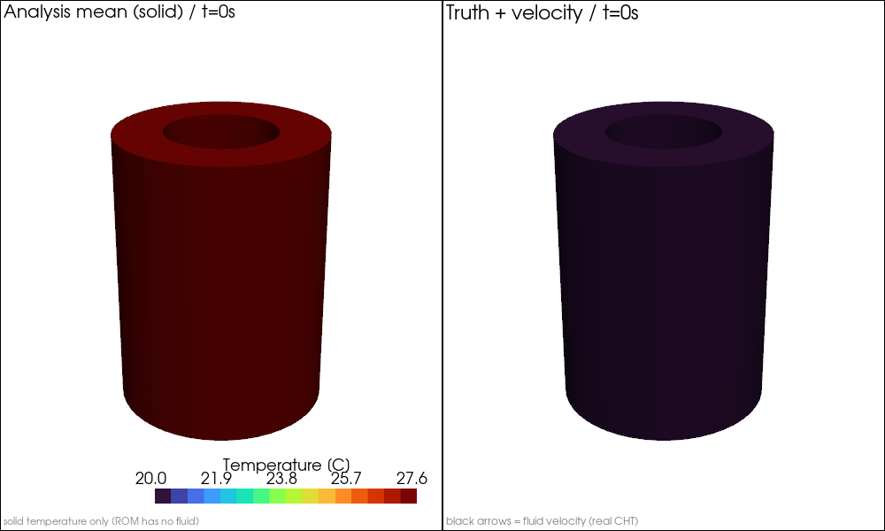

左は104の保存済み同化後平均、右は104のOpenFOAM真値。0〜600秒を60秒刻みで表示する。
OpenFOAM全20,696セルの値を、構造メッシュ節点へ近傍8セルの逆距離加重で写してコンタ表示した。
ROMやPODによる復元ではない。全時刻・両パネルで共通温度範囲を使い、初期誤差も範囲に含めるため、
同化後の小さな温度差は次の時刻歴で確認する。

**図の条件**：104の実ソルバ双子実験／5メンバー／60秒ごと10回更新／seed=20260908の1回。温度hot/coldの2点＋上面2領域のUzを同化。 hot/coldの温度。実線=真値、丸付き破線=同化後平均。

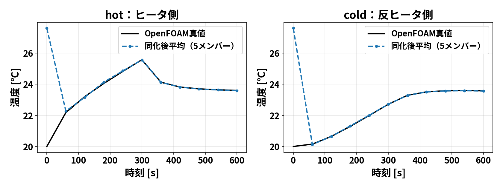

観測位置はhot=(32,0,50.25) mm、cold=(−32,0,50.25) mmに最も近い固体セル。
線は真値と同化後5メンバー平均であり、ノイズを加えた観測値そのものではない。

**図の条件**：104の実ソルバ双子実験／5メンバー／60秒ごと10回更新／seed=20260908の1回。温度hot/coldの2点＋上面2領域のUzを同化。 2領域の平均Uzの差。実線=真値、丸付き破線=同化後温度のFrontISTR応答。下段=その誤差。

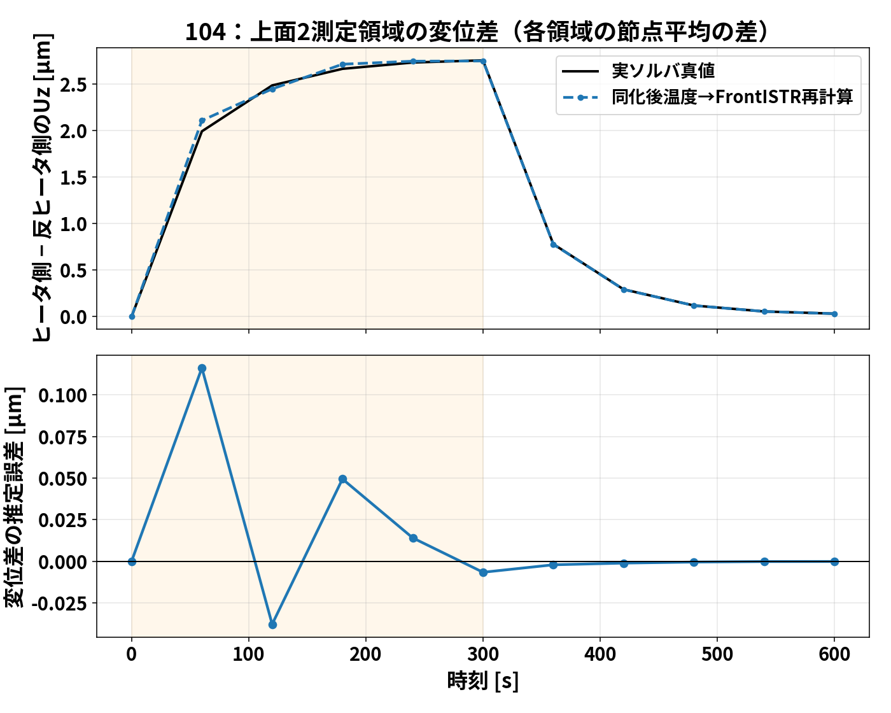

**重要な評価量は、ヒータ側上面と反ヒータ側上面の鉛直変位の差**：

$$d(t)=\langle u_z(t)\rangle_{\mathrm{heater,top}}-
\langle u_z(t)\rangle_{\mathrm{opposite,top}}.$$

104の観測演算子に合わせ、厳密には2つの単一節点ではなく、上面の各測定領域の節点平均の差である。
106のA/O最近傍単一節点の定義とは区別する。
同化後平均温度をFrontISTRで改めて静解析して求めた。真値は104に保存されたFrontISTR解から読み出した。
上段が差の時刻歴、下段が真値に対する差の誤差。変位はµm表示で、変形倍率は掛けていない。
既存の `openfoam_fem_enkf_disp.png` は同化前の予報変位なので、ここでは新しい図を使う。
線形熱弾性と線形温度写像の範囲では、平均温度の変位応答は各メンバー応答の平均に対応する。

生成コード：`run/make_fullsolver_evidence.py`。
抽出値：`results/fullsolver_evidence.npz`。OpenFOAMの同化計算は再実行せず、保存結果から図を作り、
同化後平均について11時刻のFrontISTR計算を追加した。

### なぜ計算が重いのか

1回の同化で、5メンバーそれぞれについてOpenFOAMを次の観測時刻まで進め、
その温度に対するFrontISTR変位を計算する。これを10回繰り返すので、
**推定側だけで5×10＝50区間のOpenFOAM計算と50回のFrontISTR変位評価**を行う。
これに真値側の計算も加わる。共分散を計算するだけでなく、共分散の材料となる
アンサンブルの温度・変位予測を繰り返し作る点が計算負担となる。

対象現象は10分間なのに、計算は約13時間：

$$\frac{13\times3600}{600}\approx78.$$

つまり、この実行では対象時間の**約78倍の待ち時間**が必要だった。
全体時間を10更新で単純に割ると平均約78分／更新相当だが、これは真値計算等を含む
全体時間の割り算であり、個々の更新処理の実測時間ではない。
この所要時間では実時間の追従に間に合わず、観測点配置・メンバー数・乱数条件を何通りも
試す研究にも時間がかかる。

約13時間の出典は105の [作業記録](../../105_0_sensor_placement_sensitivity/docs/90_worklog_103-105.md)
にある104の600秒実行の記録。開始・終了時刻を含む実行ログは今回確認できていないため、
秒単位の実測値や汎用的なベンチマークとしては扱わない。
成果の数値は104の `results/openfoam_fem_enkf_summary.yaml` と
`results/openfoam_fem_enkf_history.csv`、実行条件は `openfoam/da_openfoam_config.yaml` に基づく。
実行入口は `run/run_openfoam_fem_enkf.py`、各メンバーの計算と同化の本体は
`daof/of_fem_twin.py` である（いずれも104配下）。

### そこでROMを導入し、観測配置を繰り返し比較できるようにする

本資料の106では、POD＋Q-DEIMで温度代表点を選び、5点ROMで60メンバーの温度を時間発展させる。
変位観測はFrontISTRの事前計算したPODモード応答を使って高速に評価する。
**実ソルバで同化が成立することを確認 → 繰り返し計算の負担が課題 → ROMで高速化 →
観測配置と推定精度・Q/hの識別性を比較する**、という研究の流れである。

104の全セル温度RMSEと106の5点温度RMSEは評価対象が異なり、
メンバー数・観測条件・モデルも異なる。数値をそのまま並べてROMの方が高精度／低精度と判断せず、
以降は同じROM内で観測構成を変えた比較として読む。

---

「勘で置いた代表点」をやめ、**POD で温度場の型を抽出 → Q-DEIM で代表点を選ぶ →
その点で ROM を組んで校正 → データ同化で温度・発熱量・放熱を推定 →
全温度場を復元」までを、絵・数式・結果グラフで一気に追う。

前提の道具立て（数式とアルゴリズム）は `01_pod_qdeim_algorithm.md` に詳説。
本ドキュメントは「何が出たか・どう役立つか」を絵で見せる。

---

## 最初に：何を検証する研究か

目的は、少数の温度・変位観測を使うことで、**温度分布と変位時刻歴の推定誤差が減るか**を調べること。
POD/Q-DEIMはROMの代表温度点を決め、ROMは60メンバーの時間発展を高速化する。
代表点の選定と、実際に観測を与えるセンサの選定は別の操作である。

| 段階 | 何を計算するか | 比較対象・注意 |
|---|---|---|
| 学習・校正 | OpenFOAM温度場からPODを作り、選んだ5点でROMを校正 | 校正残差は学習データへの適合度。未知条件での精度ではない |
| 基本同化 | 温度P2だけを観測し、5点温度・発熱倍率・放熱係数を推定 | ROM双子実験。真値も校正ROMで生成 |
| 観測配置比較 | 温度配置または変位配置を変える | 温度の発熱感度と、FrontISTRの温度→変位感度を区別 |
| 全場・変位評価 | 同化後5点→gappy-POD→温度全場→変位写像 | 同じ再構成を通したROM真値との一致と、独立な実ソルバ検証を区別 |

**図の順序について：** STEP4には複数の独立した実験がある。温度1点のみの基本設定、
温度位置比較、変位位置比較を同一の計算結果として読まないこと。
また、非ROM点の曲線も同化後の推定から得ているが、参照もROM真値を復元したものなので、
独立なOpenFOAM全場に対する検証にはなっていない。

**確認された修正（2026-09-13）：** `run/run_da.py` の旧 `da_field.png` は、
真値に最終RMSE程度の乱数を加えて「同化後」の代用としていた。実際の300秒の同化後平均を
再構成するよう修正した。旧図は同化による全場再現の証拠として扱えない。

## 図を読む前に：観測点と比較条件の共通定義

温度の「代表点5点」と「観測に使う点数」は別。図の高感度／低感度という旧表記だけで判断せず、
各図直前の点名と観測数を確認する。ROMの同化後温度は全図でメンバー平均を使用する。
温度観測ノイズは標準偏差0.30 K、ROMの変位観測は0.30 µm。104実ソルバの変位観測は0.10 µm。
ROMの5seedは20260913〜20260917、単一seed図は20260913。各条件で同じseed番号を使うが、
観測成分数が違うと乱数消費順が変わるため、観測ノイズ系列が全条件で完全に一致するわけではない。

| 呼称 | 位置・定義 | 用途 |
|---|---|---|
| 温度P2 | (36.487, 6.896, 50.781) mm、ヒータ側外周近く・中間高さ | 基準の温度観測1点 |
| 温度P0 | (21.304, −1.625, 51.563) mm、内周近く・中間高さ | 温度2点の場合に追加 |
| 温度P4 | (−35.131, 0.781, 0.777) mm、反ヒータ側底面近く | 温度位置を変える比較 |
| 標準変位A/O | 目標(±28,0,100.5) mmの最近傍FEM節点のUz | STEP6等の温度2点＋変位2点 |
| 高W変位2点 | (−22.829,−29.751,100.5)、(−36.222,9.706,100.5) mm | 4-3の高W変位配置。標準A/Oとは別位置 |
| 低W変位2点 | (37.500,0,5.025)、(33.125,0,5.025) mm | 4-3の低W変位配置 |

高W点は1点目を行感度最大、2点目を既選択点と応答方向が重なり過ぎない条件で選ぶ。
位置の出典は `results/qdeim_points.npz` と105の `results/kinvh_sensitivity.npz`。

## STEP 1. POD で「温度場の型」を取り出す

元の OpenFOAM(CHT) の温度場（121枚×20,696セル）を SVD にかけると、
場は**少数の固定した型（モード）× その強さの時間変化**にほどける。

**図の条件**：同化前の学習データの分析。102のOpenFOAM温度場121時刻（0〜600秒、5秒間隔）をSVD。平均場は℃、各モードは正規化した形で独立色範囲。アンサンブル計算ではない。

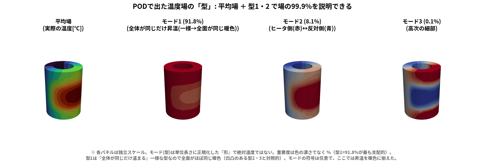

- **平均場**：いつも共通の下地（実際の温度[℃]）
- **モード1（91.8%）**：全体の昇温（何度上がったか）
- **モード2（8.1%）**：ヒータ側↔反対側の周方向勾配
- モード3以降：高次の細部（ほぼ効かない）

→ **平均場＋モード1・2 だけで場の 99.9% を再現できる**。だから温度場は実質2〜3自由度で、
**少数の代表点で十分表せる**。

> **図の読み方の注意（重要）**
> - **各パネルは独立スケール**。平均場は実際の温度[℃]だが、**モード(型)は
>   単位長さに正規化した"形"**（絶対温度ではない）。
> - **重要度は色の濃さでなく %**（型1=91.8%が最も支配的）。
> - **モード1が色うすい**のは、型1が「**全体がほぼ一様に昇温**」する型で
>   空間的な凹凸が無いから（＝物理的に正しい。うすい＝一様、が支配的モード）。
>
> **この時点でPODをやる利点**：①「場が実質2〜3自由度」と**数値で示せる**（少数点ROMの根拠）、
> ②この**モードが後段の土台**になる（Q-DEIMの点選定・gappy-PODの全場復元は両方このモードを使う）。
> 単なる可視化でなく、STEP2以降が全部これに乗っている。

### もっと直感的な見せ方：モードを足すと真値に近づく

正規化した"形"は分かりにくいので、**全部同じ実温度スケール**で
「平均場 → ＋モード1 → ＋モード1,2 → 真値」を並べると分かりやすい:

**図の条件**：同化なし。学習OpenFOAMの300秒場を、平均場＋先頭モードの累積で再構成した比較。全パネル共通℃、RMSEは全セルの空間誤差。

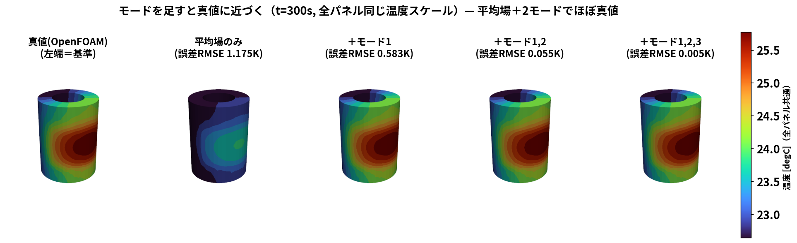

| 使うもの | 全場の再構成誤差 |
|---|---|
| 平均場のみ | 1.175 K |
| ＋モード1 | 0.583 K |
| **＋モード1,2** | **0.055 K**（もう真値と見分けがつかない） |
| ＋モード1,2,3 | 0.005 K |

**平均場＋2モードで、全温度場が誤差0.055Kまで真値と一致**。
色スケールが共通なので「モードを足すほど真値の模様に近づく」のが目で見て分かる。
発表ではこちらの図の方が「2モードで十分」を伝えやすい。

## STEP 2. Q-DEIM で代表点を「データから」選ぶ

温度場のモードを区別しやすい代表点を、**Q-DEIM（モード行列の転置に列枢軸QRをかける）**で順番に選ぶ。全ての点の組合せを試す大域的な最適化ではなく、以下の基準による逐次選択である。

**図の条件**：同化なし。学習PODの先頭5モードからQR枢軸で選んだROM代表点。赤球=P0〜P4。5点すべてを温度観測する意味ではない。

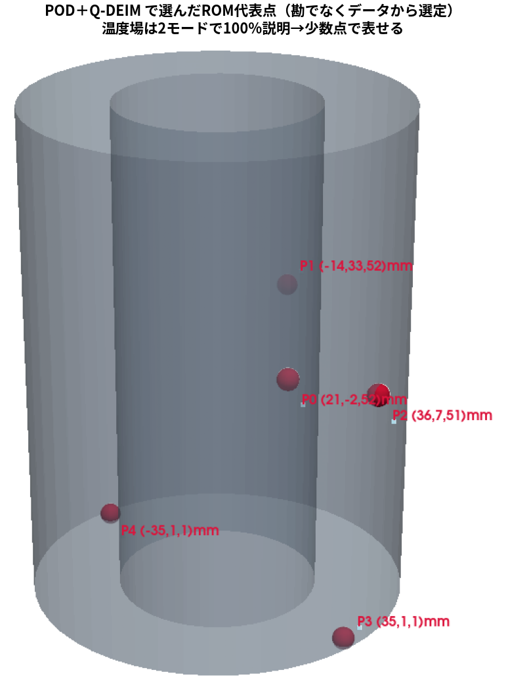

流用の勘の点（すべて中央高さ）と違い、**底面(P3,P4)も含めて場を広くカバー**する5点が選ばれた。

**アルゴリズム**：`qr(U[:, :r].T, pivoting=True)` の最初の $r$ 個の枢軸（pivot）を代表点にとる。

### なぜこの5点なのか：各点の「モードへの反応」を比べる

温度場を5モードで表すと、セルjでの温度は

$$T_j-\bar T_j=\phi_1(j)a_1+\cdots+\phi_5(j)a_5=v_j^\top a,\qquad
v_j=[\phi_1(j),\ldots,\phi_5(j)]^\top.$$

$v_j$は、そのセルが各モードにどのように反応するかを表す5個の数値。
5点を選ぶと、この式が5本でき、モードの強さ$a$を逆算できる。
ただし似た$v_j$を持つ点ばかり選ぶと、似た式を何度も測ることになり、逆算が不安定になる。

**1点目**は$\|v_j\|_2$が最大のセルを選ぶ。
**2点目以降**は、既に選んだベクトルから説明できる成分を取り除き、
残った成分が最大のセルを選ぶ。既選択ベクトルの張る空間の正規直交基底を$B_{k-1}$とすれば、

$$r_j^{(k)}=(I-B_{k-1}B_{k-1}^\top)v_j,\qquad
p_k=\operatorname*{arg\,max}_{j\notin\{p_1,\ldots,p_{k-1}\}}
\|r_j^{(k)}\|_2.$$

この直交化と選択を安定に実行するのが列枢軸QRで、
`qr(U[:, :5].T, pivoting=True)`の先頭5枢軸を使う。
**離れた場所だから選ぶのではなく、残っているモード情報が大きいから選ぶ。**
今回の保存モードから選定順を再確認すると、次の全5点が一致した：

| 選択順 | 点／セル番号（0始まり） | 座標 [mm] | 選んだ時点の残差ノルム |
|---|---|---|---:|
| 1 | P0 / 7634 | (21.304, −1.625, 51.563) | 0.036879 |
| 2 | P1 / 7924 | (−14.123, 33.093, 51.563) | 0.026572 |
| 3 | P2 / 7765 | (36.487, 6.896, 50.781) | 0.019220 |
| 4 | P3 / 859 | (35.131, 0.781, 0.777) | 0.017290 |
| 5 | P4 / 733 | (−35.131, 0.781, 0.777) | 0.014249 |

各値はその段階の全候補の最大値。例えばP3は、先に選んだP0〜P2だけでは説明しきれない
モード成分を最も大きく持つ点だったため選ばれた。底面だからという事前ルールではない。

実際の5点で抜き出した行列$A=P\Phi$は、丸めて

$$A\approx10^{-3}\begin{bmatrix}
-5.829&-10.765&-1.105&-34.229&6.109\\
-7.425&4.042&1.569&-8.092&-24.056\\
-4.712&-14.566&10.887&2.667&-4.304\\
-7.342&-3.009&-14.751&4.745&-6.803\\
-7.667&8.987&7.684&-0.647&9.010
\end{bmatrix}.$$

各行がP0〜P4、各列がモード1〜5。この5本の式
$T_5-P\bar T=Aa$を解いて$a$を求め、$\hat T=\bar T+\Phi a$で全場を復元する。
温度点の誤差$\delta T_5$は$\delta a=A^{-1}\delta T_5$として伝わるため、
$\|\delta a\|_2\le\|A^{-1}\|_2\|\delta T_5\|_2$。
今回の行列の2ノルム条件数は**約3.15**で、選択した5本の式がほぼ重複する状態にはなっていない。

ここでは寄与率の大きい2モードだけでなく**5モード**を使って選んでいる。
選定点は使用モード数・学習温度場・正規化に依存し、「どの加熱条件でも最適」ではない。
また、これはROMの代表点選定であり、Wによる変位センサ選定やEnKFの精度最適化とは目的が異なる。
出典：`run/select_points_qdeim.py`、`results/qdeim_points.npz`。

## STEP 3. 選んだ点で ROM を組み、校正する

選んだ5点をノードに、**全点対を熱抵抗で結ぶ一般化した集中定数モデル**を作る:

$$C_i\frac{dT_i}{dt}=\sum_{j\ne i}K_{ij}(T_j-T_i)+q_i(t)-h\,(T_i-T_\text{air})$$

未知の $C[5], K[10], h$ を、5点のOpenFOAM温度履歴に最小二乗で合わせる（校正）。

**図の条件**：同化なし。Q-DEIM代表5点のOpenFOAM学習履歴と、最小二乗校正したROM履歴の比較。実線=OpenFOAM、破線=ROM。残差は独立検証誤差ではない。

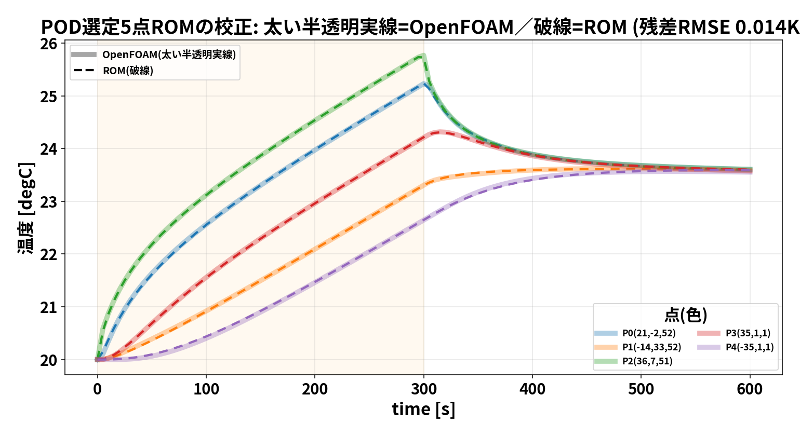

- **当てはめ残差 RMSE 0.014K**（実線=OpenFOAM、破線=ROM がほぼ重なる）
- 全熱容量 $\sum C_i=1211$ J/K は鋼2.49kgの $\rho c_p V\approx1195$ J/K と一致（物理的に妥当）
- 0→600秒が**数秒**で回る → データ同化を何度も試せる

## STEP 4. データ同化で温度・発熱量・放熱を推定する

拡大状態 $z=[T_0,\dots,T_4,\;Q,\;h]$（7次元）を、**アンサンブル $N=60$ メンバー**の
EnKF で更新する。温度は数点しか測らないが、**60個の分身の散らばり（標本共分散）から
$Q,h$ との相関**を作り、逆算できる:

$$K=C_{zy}(C_{yy}+R)^{-1},\qquad
z_a^{(i)}=z_f^{(i)}+K\big(y+\varepsilon^{(i)}-H(z_f^{(i)})\big)\quad(i=1,\dots,60)$$

> **この STEP 4 の読み進め方（先に地図を示す）**
> - **4-1**：まず基本設定（温度センサ1点だけ）で、本当に温度場・$Q$・$h$・変位まで推定できるかを確認。
> - **4-2**（詳しく）：なぜ温度数点で $Q,h$ まで決まるのか、その確率・統計のからくり。
> - **4-3**：観測点をどこに置くか——**主軸は熱感度 $W=K^{-1}H$ で「変位観測点」を選ぶ**話。
> - **4-4**（補足）：既存計算で温度P2を選んだ経緯。Wによる配置比較を読む際には飛ばしてよい。
> - **4-5/4-6**：2種類の熱感度の整理と、収束のアニメーション。

### 4-1. まず基本設定で「本当に推定できるか」を確かめる

**基本設定（比較の基準）**：**温度P2の1点だけを観測**し、変位観測は使わない。
拡大状態 $[T_0..T_4,Q,h]$ を N=60 メンバーEnKFで推定する。
まず「温度1点だけの同化では、温度・変位にどれだけ誤差が残るか」を確認する。
その後の4-3で、温度観測を固定して、熱感度 $W=K^{-1}H$ に基づく変位観測点の
選定・追加が精度を改善するかを比較する。**この図は高W／低Wの比較図ではなく、変位観測なしの基準ケース**である。

**温度センサの位置**：P2は円筒の**ヒータ側（+X側）の外周近く、高さ約半分**。
座標は $(x,y,z)=(36.487,6.896,50.781)$ mm、OpenFOAMセル番号7765（配列の0始まり）。
円筒の高さは100.5 mm。図のP0/P1/P3/P4は温度を観測せず、推定結果を評価する点。
座標の出典は `results/rom_calibrated_pod.npz` の `xyz[2]` と `cells[2]`。

**温度**（推定 vs 真値、各ノード）:

**図の条件**：ROM双子実験／60メンバー／30秒ごと20回更新（0〜600秒）。真値も同じROM。 seed=20260913の1回、線は同化後60メンバー平均。 温度P2の1点だけを観測、変位観測なし。黒=真値、青破線=同化後、帯=メンバー±1σ。5点別温度と誤差。

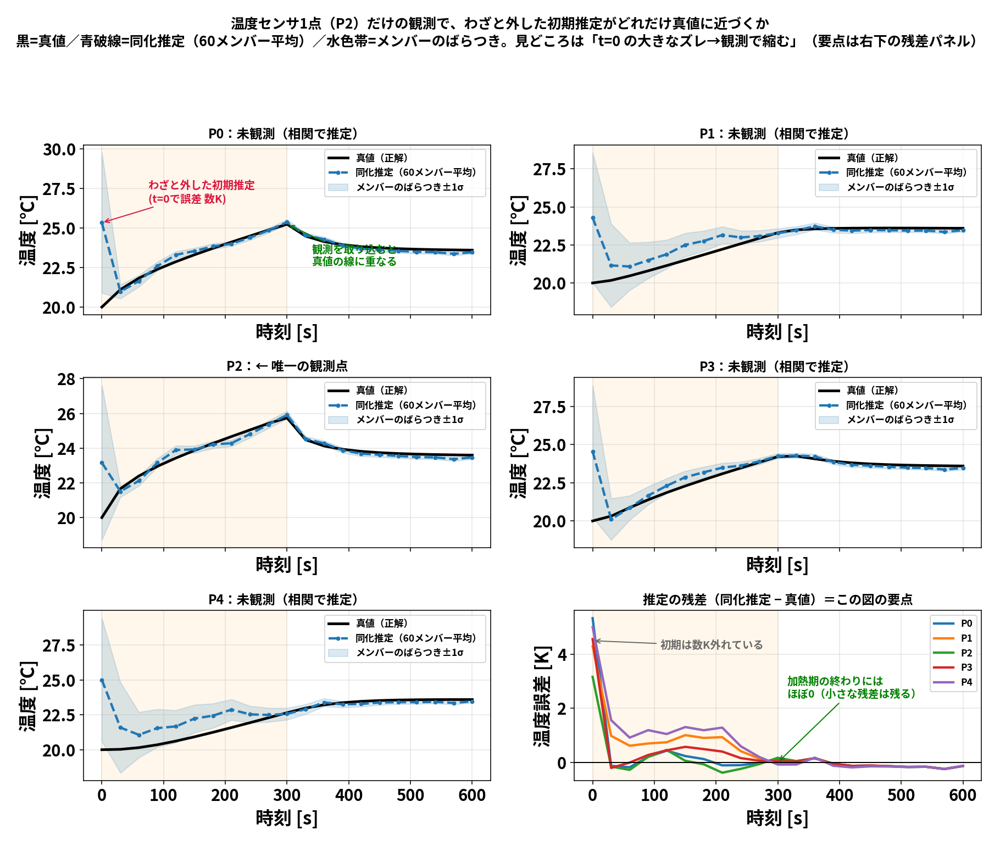

**この図の見方（要点）**：狙いは「温度センサ**たった1点(P2)**の観測から、**わざと外した初期推定**が
どれだけ真値に近づくか」を見ること。だから**t=0では線が大きく離れているのが正常**——これは
「わざと外した初期の誤り」で、失敗ではない。**見どころは、その大きなズレが観測を取り込むにつれ
縮んでいく**こと（右下パネル：残差が初期の数K→加熱期の終わりでほぼ0）。

*各パネルは1つのROM点。黒実線=ROM真値、青破線=同化後平均、帯=メンバーの±1σ。
右下に推定値−真値を示す。**線が離れている箇所は実際にそれだけ推定誤差が残っている**（帯は真値を
含む保証ではない）。温度は加熱期の終わりでほぼ一致するが、小さな残差は残り、$Q,h$ は完全一致しない
（基本設定の最終値は $Q$=17.08 W／真値15 W など。詳細は上の本文）。*

基本設定の最終温度RMSEは0.131 K、発熱量は17.08 W（真値15 W）、
放熱係数は0.02511 W/K（真値0.01535 W/K）。温度誤差は初期4.533 Kから減るが、
この結果だけでQ・hも真値へ収束したとは言えない。

**Q・hがずれていてもよいのか？** 温度の状態推定が改善したという結果は得られるが、
パラメータ推定も成功したとは判断できない。Qは約14%、hは約64%高い。
観測のたびに温度を補正できるため、同化後温度が近いことだけでは、
その温度を生む発熱・放熱の組合せまで正しいことを保証しない。
観測を止めた予測や、加熱条件を変えた予測の精度は別に確認する必要がある。
この例の結論は「温度誤差は減ったが、Q・hの同時推定には誤差が残る」とする。
なお、このROMのhは単位W/Kの集中放熱係数であり、面積当たりの熱伝達率W/(m² K)とは区別する。

> **なぜ「温度は合うのにQ・hは外れる」のか（可同定性の問題）**
> 温度センサ1点・1回の加熱冷却では、**Q と h は"組合せ"でしか拘束されない**。加熱期の温度上昇は
> 「発熱 $Q$ − 放熱 $h\,\Delta T$」で決まるので、**Qを多めに見積もっても、hを多めにすれば
> 温度履歴はほぼ同じ**になる（equifinality）。EnKFはその中から温度に合う $(Q,h)$ を選ぶが、
> それが真の組合せとは限らない。実際、**推定した $(Q{=}17.08\text{W}, h{=}0.0251)$ と
> 真値 $(15\text{W}, 0.0154)$ をROMに入れて温度軌道を比べると、観測区間(0–600s)の差は
> わずか 0.42 K RMSE（最大0.76 K）**——だから1点の温度観測ではこの2つを見分けられない。
> hの誤差(64%)がQ(14%)より大きいのは、**hが効くのは主に冷却期だけで観測情報が乏しい**（弱可同定）ため。
>
> **結果として何が"大丈夫"で何が"危ない"か**：
> - **温度分布・変位の推定が目的なら実質OK**——温度は0.131Kまで合い、変位はそれに従う。
>   間違った $(Q,h)$ でも観測区間内の温度はほぼ同じなので、状態推定は損なわれない。
> - **真のQ・hを同定したい、または別条件を予測したいなら不可**。校正した $(Q,h)$ で外挿すると
>   誤差が顔を出す：試しに**加熱を600sまで延長した外挿では温度差が 0.71 K RMSE・最大1.17 K・
>   到達温度差0.68 K** まで拡大した（観測区間で隠れていた誤差が条件を変えると表面化する）。
> - **改善策**：①冷却期を長く観測（hが効く区間）、②センサを増やす、③Qを階段状に変える等で
>   励起を工夫して両者を分離。変位観測はQ・hの同定にはあまり効かない（変位も温度従属のため）。

**推定精度（RMSE）と発熱量・放熱の収束**:

**図の条件**：ROM双子実験／60メンバー／30秒ごと20回更新（0〜600秒）。真値も同じROM。 seed=20260913の1回、線は同化後60メンバー平均。 温度P2の1点だけを観測、変位観測なし。全5点の温度RMSE、各時刻の値。

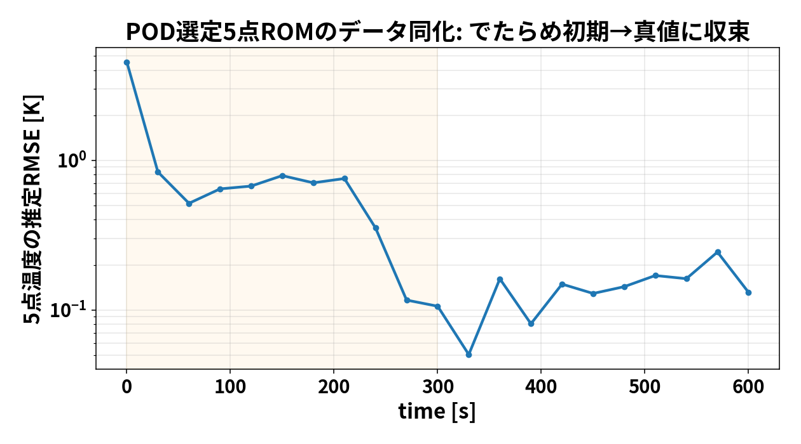

**図の条件**：ROM双子実験／60メンバー／30秒ごと20回更新（0〜600秒）。真値も同じROM。 seed=20260913の1回、線は同化後60メンバー平均。 温度P2の1点だけを観測、変位観測なし。Q/hの線=メンバー平均、帯=±1σ、水平破線=真値。

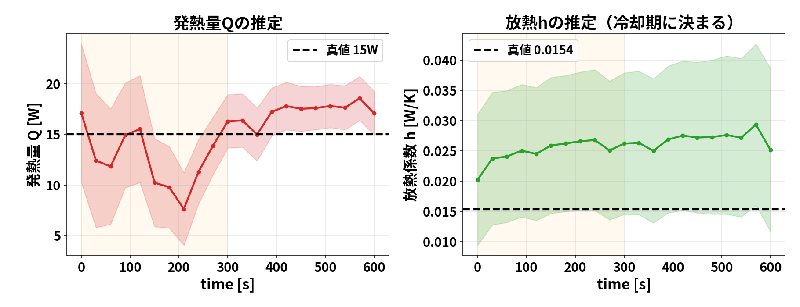

- 5点温度：でたらめ初期(約4.5K)から真値へ収束
- **発熱量 Q**：観測から更新されるが、基本設定の最終推定は17.08 W
- **放熱 h**：冷却期も更新するが、基本設定では真値との差が残る
- 一方 $C,K$ は材料/形状で決まる安定量なので校正で固定（知れるものは固定、
  知りたい/難しいもの $Q,h$ だけ同化で推定）

> **初期温度が違っても、時間が経つと初期状態は消える（重要な物理）**
> 熱伝導は**散逸系（拡散方程式）**なので、**初期温度の誤差は時間とともに指数的に減衰して消える**。
> つまり「最初の温度がでたらめでも、しばらく経てば初期状態は忘れられ、
> その時の境界条件（ヒータ・放熱）と発熱量で決まる状態に落ち着く」。
> だからデータ同化は**でたらめ初期から始めても収束できる**（この性質が逆問題を解きやすくしている）。
> ただし注意：忘れられるのは**温度場の初期値**であって、**発熱量 $Q$・放熱 $h$（定数パラメータ）は
> 忘れられない**——観測で決めないと分からないまま。だから過渡期に良い観測をする価値がある。

**変位**（gappy-POD復元場→FrontISTR で QoI=Uz(A)−Uz(O) を評価、推定 vs 真値）:

**図の条件**：ROM双子実験／60メンバー／30秒ごと20回更新（0〜600秒）。真値も同じROM。 seed=20260913の1回、線は同化後60メンバー平均。 温度P2の1点だけを観測、変位観測なし。灰実線=ROM真値の変位差、紫破線=同化後温度から計算したA/O変位差。

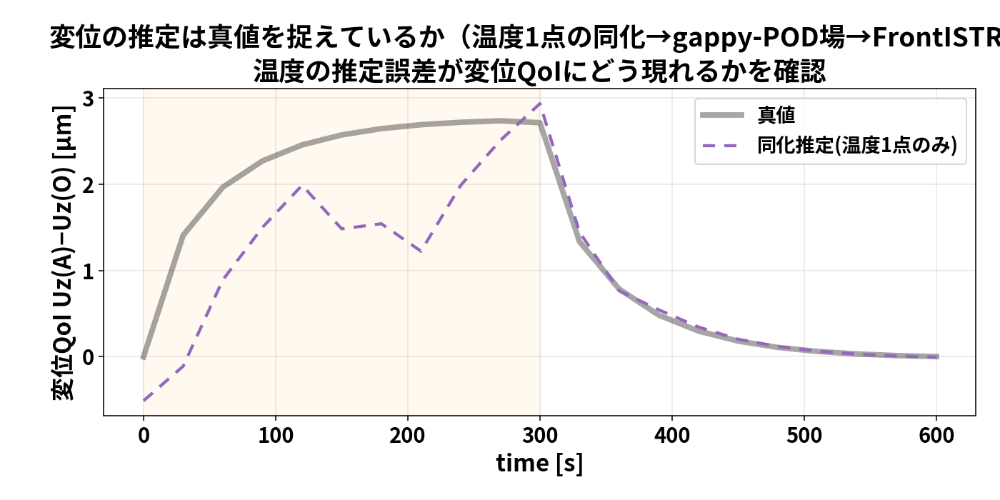

*温度が真値に収束するのに合わせ、変位の推定も真値へ収束する（変位は温度の従属量）。*

> **変位は温度の"従属量"だが、温度誤差を増幅する**
> 変位はその瞬間の温度場だけで決まる（$u=W\,\Delta T$、変位自身は時間の記憶＝初期状態を持たない）。
> だから温度が**完全に**真値なら変位も真値になり、上図のように時間が経てば一致する。
> **ただし温度にわずかでも誤差が残ると、$W$ が大きいぶん変位はそれを増幅して映す**——
> 温度が0.数K合っていても変位はµm単位でずれうる。この「温度が合っても変位は合わない」現象と、
> その対策（変位そのものを観測する）は **4-3** で詳しく見る。

### 4-2.（詳しく）なぜ温度数点で Q・h まで決まるのか ― EnKFの確率・統計

上のカルマンゲインは天下りではなく、**ベイズの定理**から出てくる。実装は `dacore/enkf.py`。
（結果だけ知りたい人はこの節を飛ばして 4-3 へ進んでよい。）

**① ベイズ更新**。推定したい拡大状態 $z=[T_0..T_4,Q,h]$ について、
観測 $y$（温度センサ値）を得た後の確率分布（事後分布）は

$$\underbrace{p(z\mid y)}_{\text{事後}}\;\propto\;\underbrace{p(y\mid z)}_{\text{尤度}}\;\underbrace{p(z)}_{\text{事前}}.$$

- **事前** $p(z)=\mathcal N(z_f,\,P)$：ROMで時間発展させた予報アンサンブルの平均 $z_f$ と共分散 $P$。
- **尤度** $p(y\mid z)=\mathcal N(H z,\,R)$：観測は真値＋計測ノイズ、$R$＝観測誤差共分散（センサ精度）。

**② ガウス同士なら事後もガウス**で、平均と共分散が閉じた式になる（これがカルマン更新）:

$$z_a=z_f+K\,(y-Hz_f),\quad P_a=(I-KH)P,\quad K=PH^\top(HPH^\top+R)^{-1}.$$

$HPH^\top=C_{yy}$、$PH^\top=C_{zy}$ と置けば、コードの $K=C_{zy}(C_{yy}+R)^{-1}$ に一致する。

**③ 周辺化積分——なぜ温度だけ測って $Q,h$ が決まるのか**。ここが核心。
$Q,h$ は**直接は測っていない**。それでも決まるのは、$z$ の同時分布がガウスで、
温度と $Q,h$ が**共分散（相関）で結ばれている**から。$Q$ の事後は、温度成分 $T$ を積分で消した
**周辺分布**として得られる:

$$p(Q\mid y)=\int p(Q,\,T\mid y)\,\mathrm dT.$$

同時分布がガウスなら、この積分は解析的に解けて再びガウスになり、その平均は

$$\mathbb E[Q\mid y]=\underbrace{\mathbb E[Q]}_{\text{事前}}+\underbrace{\mathrm{Cov}(Q,y)\,\mathrm{Cov}(y,y)^{-1}}_{\text{回帰係数}}\,\big(y-\mathbb E[y]\big).$$

つまり **「観測 $y$ の予測外れ $(y-\bar y)$ を、$Q$ と $y$ の共分散比だけ $Q$ に配分する」**線形回帰。
$\mathrm{Cov}(Q,y)\neq0$（発熱が変われば温度も変わる）である限り、**温度の観測が $Q$ を動かす**。
$h$ も同様（冷却期に温度と強く相関するので、その区間で決まる）。
これが「温度数点から $Q,h$ まで逆算できる」ことの統計的な理由。

**④ モンテカルロ近似（アンサンブル）**。真の共分散 $P,C_{zy},C_{yy}$ は分からないので、
**60個の分身（アンサンブル）の標本統計で置き換える**（期待値→標本平均、共分散→標本共分散）:

$$C_{zy}=\frac{1}{N-1}\sum_{i=1}^{N}(z_f^{(i)}-\bar z_f)(y_f^{(i)}-\bar y_f)^\top,\quad
C_{yy}=\frac{1}{N-1}\sum_{i=1}^{N}(y_f^{(i)}-\bar y_f)(y_f^{(i)}-\bar y_f)^\top.$$

コードの `dZ.T @ dY /(n_ens-1)` がまさにこれ。$y_f^{(i)}=H(z_f^{(i)})$ は各メンバーの予報観測で、
**非線形観測（温度場→FrontISTRで変位）でもメンバーごとに評価するだけ**でよい（`Yf` 引数）。

**⑤ 摂動観測（stochastic EnKF）**。各メンバーに独立ノイズ $\varepsilon^{(i)}\sim\mathcal N(0,R)$ を足して
更新すると、解析アンサンブルの**標本共分散は、予報アンサンブルを固定した摂動乱数に関する期待値でカルマン更新の共分散に対応**する
（足さないと過信して分散が潰れる）。コードの `eps = rng.multivariate_normal(0,R,...)`。

**⑥ 共分散インフレーション**。標本共分散は $N=60$ と少ないので過小評価しがち。
平均まわりに $\times1.02$ 広げて（`inflation`）、**アンサンブルが自信過剰になり観測を無視する現象
（filter divergence）を防ぐ**。

> **まとめ**：4-1 の `da_qh.png` で $Q\to15$W、$h$ が収束していくのは、上の**周辺化（③）＋標本共分散（④）**
> により「温度の予測外れ」を毎サイクル $Q,h$ へ回帰配分している結果。
> `da_rmse.png` の RMSE は各時刻の推定平均 $\bar z_a$ と真値の食い違いで、事後分布の平均が
> 真値へ寄るほど下がる。

### 4-3. 観測点をどこに置くべきか ― 主軸：熱感度 W=K⁻¹H で「変位観測点」を選ぶ

4-1 は温度センサ1点でも推定できることを示した。ここからが本研究の主軸：
**観測点をどこに置けば同化がもっと良くなるか**、特に**変位をどこで測るか**を、
**熱感度 $W=K^{-1}H$** で設計する。

**熱感度＝ $W=K^{-1}H$**（FrontISTRで計算する **温度→変位** のヤコビアン）。
熱弾性は $Ku=H\,\Delta T$ なので

$$u=K^{-1}H\,\Delta T=W\,\Delta T$$

$W$ の**行ノルム** $\|W_{i,:}\|$ が「点iの変位が温度場にどれだけ敏感か＝
**その点で変位を測ると温度の情報をどれだけ拾えるか**」を表す。
これが本研究で言う**熱感度**であり、**変位観測点をどこに置くか**の指標になる
（105でDUMPWパッチ版FrontISTRが計算、随伴法と2.4e-8一致検証済み）。

**図の条件**：同化なしの静的感度解析。105のFrontISTR由来Wの変位行感度を色で表示。灰色は除外点。赤/青球は標準のA/O位置で、高W選定2点と同じではない。

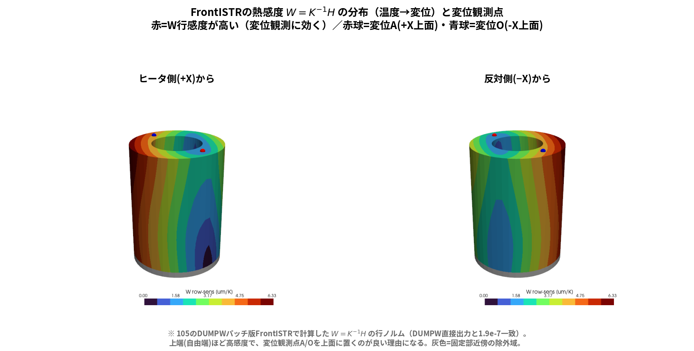

**上端（自由端）ほど熱感度が高い**（底面固定で上端が最も動く）。
赤球=変位観測点 A(+X上面)・青球=O(-X上面) はこの高感度域にある。

#### 変位の観測位置比較：温度P2を固定して高W／低Wを比べる

温度センサは1点に固定し、**追加する変位2点を「高熱感度（上端, W行=6.3）」と
「低熱感度（底面, W行=0.12）」で変えて**データ同化し、各ノードの温度時刻歴を比べた:

**図の条件**：ROM双子実験／60メンバー／30秒ごと20回更新（0〜600秒）。真値も同じROM。 seed=20260913の1回、線は同化後60メンバー平均。 温度P2の1点を両ケースで固定。青=高W変位2点を追加、橙=低W変位2点を追加、灰=ROM真値。5点別温度。

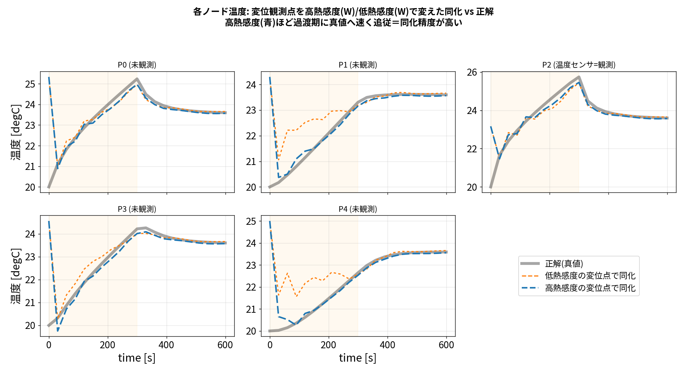

*太い灰=正解、青破線=高熱感度の変位点で同化、橙点線=低熱感度の変位点で同化。
未観測点(P1,P3,P4)で、**低熱感度(橙)は過渡期に真値から外れて蛇行**、
**高熱感度(青)は真値へ速く追従**する。*

**図の条件**：ROM双子実験／60メンバー／30秒ごと20回更新（0〜600秒）。真値も同じROM。 seed=20260913〜20260917の5回。 温度P2固定。灰=変位なし、橙=低W変位2点追加、青=高W変位2点追加。各seedの全5点温度RMSEを求めて5seed平均。

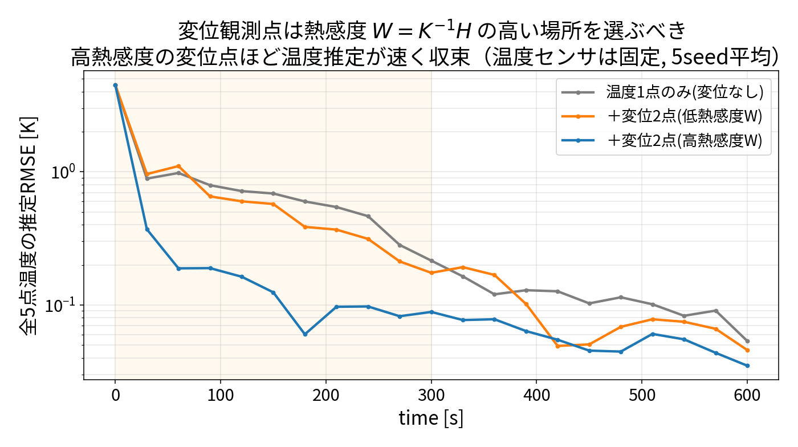

| 観測構成 | 加熱期(0-300s)の平均RMSE |
|---|---|
| 温度1点のみ（変位なし） | 0.617 K |
| ＋変位2点（低熱感度W） | 0.535 K（ほとんど効かない） |
| **＋変位2点（高熱感度W）** | **0.146 K（4倍改善）** |

> **このROM双子実験で得られた結果**：
> **熱感度 $W=K^{-1}H$ の高い場所に変位観測点を置くと、データ同化の精度が上がる。**
> 低熱感度の変位点はほとんど効かない（温度のみと同等）。
> → **W=K⁻¹H は「変位観測点の選定」にデータ同化で使うべき指標**。
> 観測点・未観測点の温度時刻歴（上図）で、高熱感度が過渡期に真値へ速く収束することが見える。

#### なぜ「変位を」観測する必要があるのか ― 温度だけでは変位が合わない

4-1 の注記の裏取り。**温度は温度だけの同化でも合うのに、変位には差が残る**ことを直接見る。
温度2点で同化した場合と、温度2点＋変位2点（高W）で同化した場合を、
P0〜P4の温度時刻歴と高W点の変位 uz で並べた:

**この図の比較条件（温度センサ位置は両方P2で固定）**：

| 線 | 温度の観測 | 変位の観測 | 意味 |
|---|---|---|---|
| 緑の短い破線 | **P2の1点** | **なし** | 温度だけを同化する基準ケース |
| 青の長い破線 | **同じP2の1点** | **Wで選んだ高感度の2点** | 変位観測を追加したケース |
| 太い灰色の実線 | — | — | ROM真値 |

P2はヒータ側外周近く、座標(36.487, 6.896, 50.781) mm。
ここで変えているのは変位観測の有無であり、温度センサ位置の高低感度比較ではない。
この時刻歴はseed=20260913の1回の結果（各線は60メンバー平均）で、5seed平均のRMSE図とは区別する。
右下は高W変位点の1点目のUzであり、2点の差ではない。
凡例の誤差は30〜300秒の平均絶対誤差（温度は5点、変位は2点で平均）で、RMSEではない。

**図の条件**：ROM双子実験／60メンバー／30秒ごと20回更新（0〜600秒）。真値も同じROM。 seed=20260913の1回、線は同化後60メンバー平均。 緑=温度P2のみ、青=同じP2＋高W変位2点、灰=真値。右下は高W変位1点目のUz。凡例は平均絶対誤差。

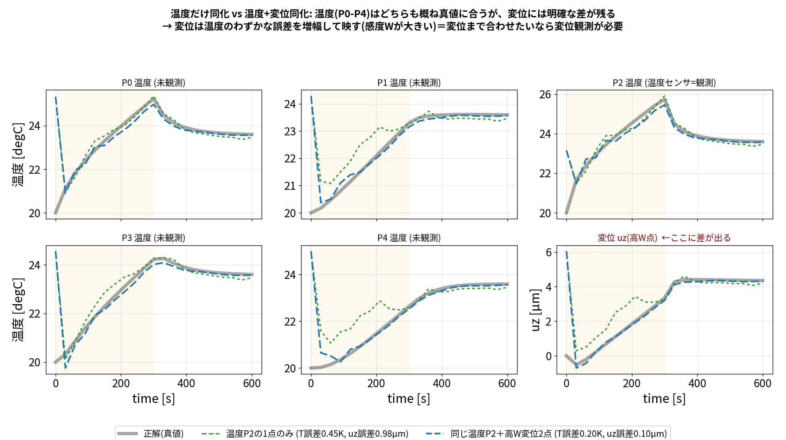

| | 温度だけ同化 | 温度＋変位(高W)同化 | 誤差の比 |
|---|---|---|---|
| 温度の誤差（加熱期平均） | 0.45 K | 0.20 K | **2.2倍** |
| 変位 uz の誤差（加熱期平均） | 0.98 µm | 0.10 µm | **9.5倍** |

- **温度（P0〜P4）はどちらの同化でも概ね真値に合う**（緑=温度だけでも0.45K、
  グラフ上は真値にほぼ重なって見える程度の差）。
- ところが**変位 uz（右下パネル）には明確な差が残る**：温度だけ同化（緑）は加熱期に
  真値から最大1µm級に浮くのに、変位も同化（青）は張り付く。誤差の比は温度2.2倍に対し
  **変位9.5倍**——温度の差より変位の差の方がはるかに大きい。
- → **変位は温度のわずかな変動を増幅して映す**（感度 $u=W\Delta T$ の $W$ が大きいため、
  0.数Kの温度誤差が µm オーダーの変位誤差として現れる）。だから
  **「温度が合っているから変位も合っているはず」は成り立たず、変位まで合わせたいなら
  変位そのものを観測に入れる必要がある**。これが変位観測（高W点）の価値の物理的な理由。

#### ROM5点以外の場所でも効くか（非ROM点で確認）

上の5点はROMの代表点なので「そこが良くなるのは当然」と思われるかもしれない。そこで
**ROMに使っていない任意プローブ（hot/cold/mid/top）**の温度で比べた。
**これはデータ同化"後"の結果**で、流れは
**①EnKFで5点温度を推定（同化後の平均）→②gappy-PODで全2万セルに復元→③非ROM点を読む**:

**点数と比較条件**：温度観測は青・橙とも**P2の1点だけ**。
EnKFで推定する温度はROMのP0〜P4の**5点**。その5点をgappy-PODで全セルへ復元し、
表示・評価用の非ROM点hot/cold/mid/topの**4点**を読み出す。
この4点の温度は観測として同化に使っていない。
青は「温度P2×1点＋高W変位×2点」、橙は「同じ温度P2×1点＋低W変位×2点」。
灰はROM真値を同じ復元に通した参照値であり、独立なOpenFOAM真値ではない。
時刻歴はseed=20260913の1回の結果。

**図の条件**：ROM双子実験／60メンバー／30秒ごと20回更新（0〜600秒）。真値も同じROM。 seed=20260913の1回、線は同化後60メンバー平均。 温度P2の1点のみを観測。青=高W変位2点追加、橙=低W変位2点追加。5点推定を全場復元し、非ROMの4点を評価。灰もROM真値から復元。

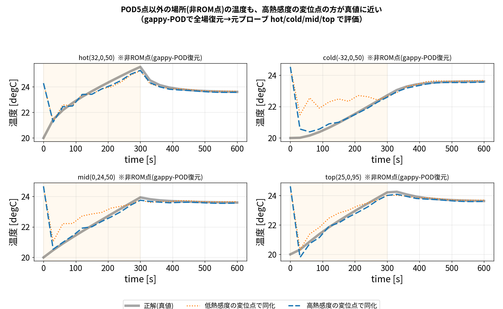

*各線の中身：**灰=真値**（真値5点→復元→非ROM点、参照）、**橙=低W変位点で同化した後**の
推定場、**青=高W変位点で同化した後**の推定場（いずれも②③で非ROM点へ）。
代表点でない場所でも、**高熱感度の変位点で同化した方（青破線）が真値（灰）に近い**。
特に cold/mid の過渡期で、低熱感度（橙点線）は真値から大きく浮くのに高熱感度は張り付く。
→ 高熱感度の変位観測の効果は**ROM代表点だけの特典ではなく、場全体に効く**。*

### 4-4.（補足①）温度センサの位置は別の感度 dT/dQ で選ぶ

> ここからは**補足**。上の主軸（熱感度 W＝変位観測点の選定）とは別で、
> **温度センサ**の位置は $\partial T/\partial Q$（温度が発熱にどれだけ反応するか、
> 熱伝達の量）で選ぶ。これは W とは別物・別の感度で、FrontISTRでは計算しない。
> 有限差分で $\partial T_i/\partial Q \approx [\,T_i(q{=}1.1)-T_i(q{=}1.0)\,]/0.1$（$t=300$ s）。
> 結果 $[5.2,3.3,5.7,4.2,2.6]$（P0〜P4）。以下「高感度センサ＝P2、低感度＝P4」。

各ノードで「正解／同化なし／温度センサ高感度／低感度」を比べる:

**図の条件**：ROM双子実験／60メンバー／30秒ごと20回更新（0〜600秒）。真値も同じROM。 seed=20260913の1回、線は同化後60メンバー平均。 変位観測は全ケースでなし。青=温度P2のみ、橙=温度P4のみ、細い灰=同化なし、太い灰=真値。各P0〜P4の温度。

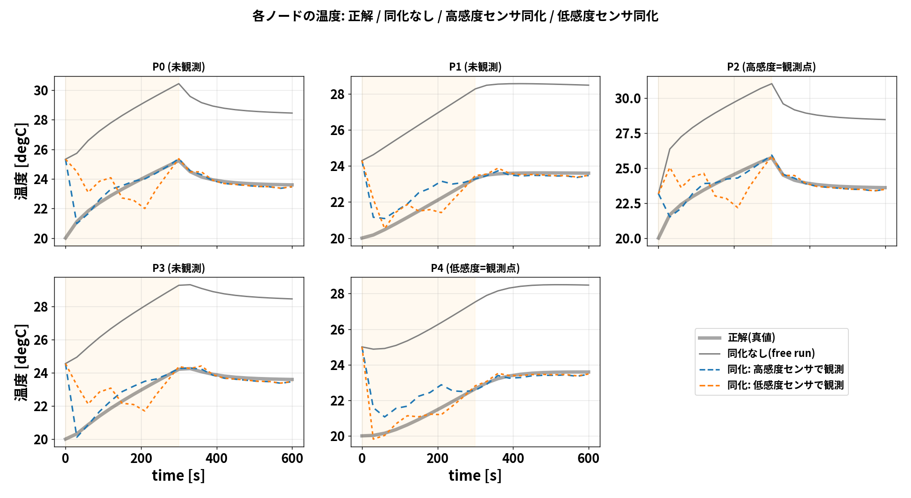

- **同化なし（free run, 灰細線）**：全ノードで真値から大きく外れたまま（観測点も未観測点も）
- **同化あり（破線）**：観測点はもちろん、**未観測点(P0,P1,P3)もアンサンブル相関で真値に復帰**
- 高感度センサ(青)は低感度センサ(橙)より、過渡期の追従がやや滑らか

> **P4だけ過渡期に捉えにくい理由（弱結合・低温ノード）**
> P4 (−35,1,1)mm は**底面・反ヒータ側・最下部**で、①ヒータから最も遠く低温でゆっくり温まる、
> ②熱感度が最低(dT/dQ=2.6)、③**高温域(P2)との相関が弱い**、が重なる。
> そのため**未観測だと（高感度センサ同化=青）相関でP4を推定しにくく、過渡期に蛇行**する。
> これは「P4をセンサにすると全体が最悪(1.036K)」だった理由と同根——**弱結合の点は、
> 観測点にしても未観測点にしても不利**（＝センサの価値の"場の代表性"が低い）。
> ただし冷却後(t>400s)は初期状態が忘れられ拡散で均されるので、全ノードが真値に収束する。

**熱感度 dT/dQ で温度センサを選ぶ根拠（検証）**：
5ノードそれぞれを唯一の温度センサにしてDA（5seed平均）し、その位置の熱感度 dT/dQ と
推定精度の関係を見た:

**図の条件**：ROM双子実験／60メンバー／30秒ごと20回更新（0〜600秒）。真値も同じROM。 seed=20260913〜20260917の5回。 変位観測なし。P0〜P4の各点を単独温度センサにした5条件。横軸は発熱倍率qへの温度感度、縦軸は30〜300秒の温度平均RMSE。Wの比較ではない。

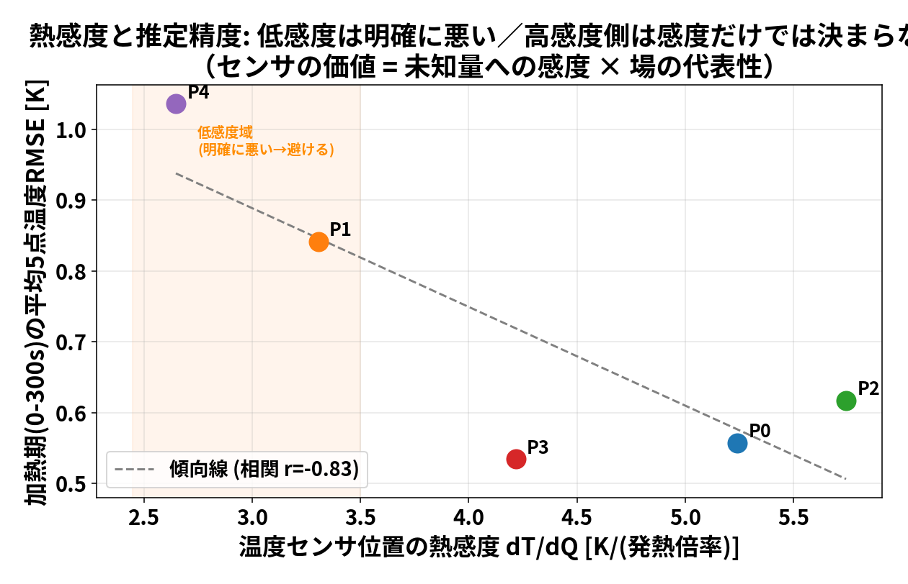

全体の傾向は**負の相関（r≈−0.83）**：熱感度が低いノードほど推定が悪い。
ただし**完全な法則ではない**（正直に）:

- **低感度の点（P4, dT/dQ=2.6）は明確に最悪** → **避けるべき**（これは robust）
- しかし**最高感度のP2（5.7）は最良ではなく**、中感度のP3（4.2）が最良。
  高感度側では感度だけで順位は決まらない。
- 理由：1点から全5点を復元する精度は、(a)その点がQを映す度合い（dT/dQ）だけでなく、
  (b)**その点が場全体をどれだけ代表するか**にも依存する。dT/dQは(a)しか見ていない。

→ **センサの価値 ＝ 未知量への感度(dT/dQ) × 場の代表性**。
実務的には「dT/dQで低感度を除外し、残りから場の代表性も見て選ぶ」。
これは 105 の結論（温度センサは感度×非冗長性で選ぶ）と一致する。

### 4-5. 2種類の熱感度の整理（混同しないために）

本研究には**2種類の熱感度**があり、**目的・計算する道具・何を選ぶか**がすべて違う。
主軸は W、dT/dQ は補足である:

| 熱感度 | 意味 | 計算 | 何を選ぶ用 | 本研究での扱い |
|---|---|---|---|---|
| **W=K⁻¹H** | 温度が変位にどれだけ効くか（熱弾性） | **FrontISTR** | **変位観測点**の位置 | **主軸**（4-3【本命の証明】） |
| dT/dQ | 温度が発熱Qにどれだけ反応するか（熱伝達） | OpenFOAM/ROM | **温度センサ**の位置 | 補足①（4-4） |

- **W の分布**（`frontistr_sensitivity.png`）と**「高W変位点ほど同化が良くなる」実証**は
  4-3【本命の証明】に示した（温度1点0.617K → ＋高W変位2点0.146K、4倍改善）。ここでは繰り返さない。
- **dT/dQ の分布**と**「dT/dQで温度センサを選ぶ」検証**は 4-4 に示した
  （低感度P4は明確に悪い＝避ける、高感度側は場の代表性も効く）。

> **温度センサ用の dT/dQ 分布について（コメント）**
> 温度センサ選定の熱感度 dT/dQ は熱伝達の量なので、**FrontISTRでは計算できない**
> （FrontISTRは温度→変位の構造ソルバ）。厳密に全場のdT/dQを出すなら、
> **OpenFOAM を Q=15W と 16.5W で2回回して差**を取ればよい（本研究では未実施）。
> 本編の dT/dQ は ROMの5点を有限差分で求めた値（ヒータ側=高、反対側・底面=低）で、
> 傾向は物理的に妥当。**FrontISTR感度（W）＝変位観測点用、dT/dQ＝温度センサ用**、と
> 役割が別であることに注意。

### 4-6. 温度観測位置を変えたアニメーション（P2のみ / P4のみ / ROM真値）

温度分布（gappy-POD復元、左=高感度センサ同化・中=低感度センサ同化・右=真値）:

**図の条件**：ROM双子実験／60メンバー／30秒ごと20回更新（0〜600秒）。真値も同じROM。 seed=20260913の1回、線は同化後60メンバー平均。 変位観測なし。左=温度P2のみ同化、中=温度P4のみ同化、右=ROM真値。全て5点からgappy-POD復元。色範囲は真値基準で範囲外は飽和する。

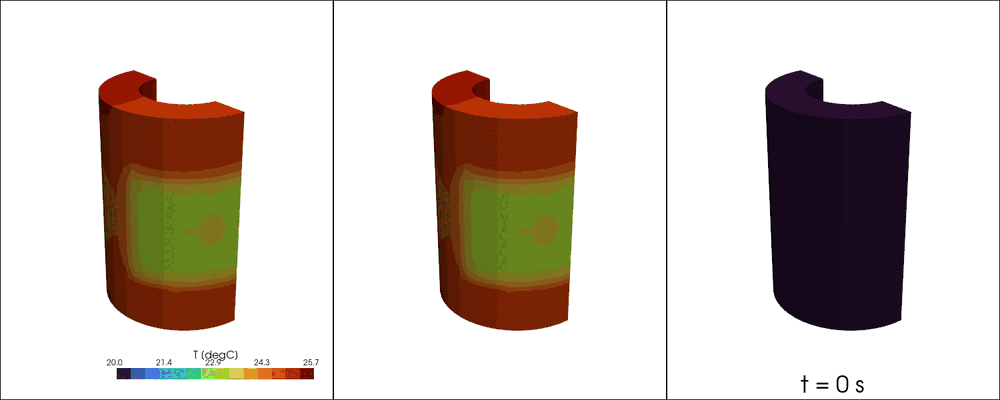

変形（各フレームFrontISTR、誇張表示。左=高感度・中=低感度・右=真値）:

**図の条件**：ROM双子実験／60メンバー／30秒ごと20回更新（0〜600秒）。真値も同じROM。 seed=20260913の1回、線は同化後60メンバー平均。 変位観測なし。左=P2のみ、中=P4のみ、右=ROM真値の復元温度→FrontISTR。形状は表示倍率で誇張、色はUz[µm]。高W/低W変位点の比較ではない。

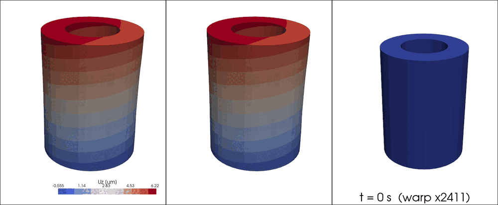

*どちらも「でたらめ初期（t=0で同化パネルが真値と大きく違う）→ 観測を取り込んで
真値へ収束」する様子が見える。高感度センサ（左）の方が過渡期の追従が速い。*

## STEP 5. 全温度場を gappy-POD で復元する

推定した5点温度から、**PODモードを使って全20,696セルの温度分布を復元**する。
この手法を **gappy-POD**（隙間のあるデータからのPOD復元）という:

$$\hat u=\bar u+U_r\,a,\qquad a=\big(U_r[P,:]\big)^{+}\big(u[P]-\bar u[P]\big)$$

**復元の考え方**：温度分布は好き勝手な形をとれるわけではなく、STEP1で見た
**少数のモード（型）の重ね合わせで表せる**。本研究は **モードを5枚（$r=5$）残し**、
Q-DEIM で **モード数と同じ5点**を選んでいる。だから「全セルの温度」という2万個の未知数を
直接あてるのではなく、**モードの混ぜ方（強さ $a_1,\dots,a_5$ の5個）を5点から逆算**すればよい。
（※ 実際にはモード1・2だけで99.9%を説明する＝**実質2自由度**の場。残りの3枚は細部を足すだけ。
それでも「モード数＝点数」に揃えるのがQ-DEIMの流儀で、後述のとおり**5点5未知数の正方問題**になる。）

**具体的な手順（数字つき）**：

1. **形の候補を用意する**。復元した場を $\hat u=\bar u+a_1\phi_1+\dots+a_5\phi_5$ と書く。
   - $\bar u$（20,696個）＝各セルの平均温度（STEP1で計算済み・固定）
   - $\phi_1..\phi_5$（各20,696個）＝モード1〜5の形（固定）。$U_r=[\phi_1,\dots,\phi_5]$ は $20696\times5$
   - $a_1..a_5$＝**これから決める5個の数**（各モードをどれだけ混ぜるか）

2. **5点の実測に合うよう $a$ を解く**。5点（=$P$）のセルの行だけ取り出すと、
   モード形は $5\times5$ の**正方行列** $U_r[P,:]$ になる。連立方程式
   $$\underbrace{U_r[P,:]}_{5\times5}\begin{bmatrix}a_1\\\vdots\\a_5\end{bmatrix}\;=\;\underbrace{u[P]-\bar u[P]}_{\text{5点の「平均からのズレ」}}$$
   は **式が5本・未知数が5個**の**正方（ちょうど決まる）問題**で、原理的に一意に解ける。
   Q-DEIM は $U_r[P,:]$ が**悪条件（ほぼ特異）にならない5点**を選ぶので、
   **1点のノイズが解 $a$ に増幅されにくい＝頑健**。コード上は `np.linalg.lstsq`
   （＝擬似逆 $(\cdot)^{+}$）で解くが、正方フルランクなので実質は素直な連立解。

3. **決めた $a_1..a_5$ を全セルへ適用**する。$\hat u=\bar u+U_r a$ を
   20,696セル全部について計算すれば、5点しか知らなかった温度から**全分布が埋まる**。

つまり「5点にちょうど合うモードの混ぜ方を5個の数で決め、その形で残り2万セルを描き直す」。
IDW（距離補間）が「近い測定点の値を薄める」だけなのに対し、gappy-PODは
**物理的にありうる形（POD）に限定して当てはめる**ので、たった5点でも全場を高精度に復元できる
（式の導出は `01` §3.1）。

#### プログラムではどこでやっているか（`run/run_da.py` の `gappy()`）

上の3ステップは、実コードでは**たった2行の関数**になっている:

```python
# run/run_da.py L164-166
def gappy(T5):                                       # 入力: 5点の温度 T5 (長さ5)
    a,_,_,_ = np.linalg.lstsq(U[pod_cells,:],        # ← ステップ2: 5×5 の正方連立を
                              T5 - mean[pod_cells],   #    解いて
                              rcond=None)             #    モードの強さ a (長さ5) を得る
    return mean + U @ a                              # ← ステップ3: 全20,696セルへ展開
```

| 数式 | コード | 形（shape） | 意味 |
|---|---|---|---|
| $\bar u$ | `mean` | (20696,) | 各セルの平均温度（`qdeim_points.npz` に保存済み） |
| $U_r=[\phi_1..\phi_5]$ | `U` | (20696, 5) | モードの形5枚（同上・固定） |
| $U_r[P,:]$ | `U[pod_cells,:]` | (5, 5) | モード行列から**5点の行だけ**抜いた正方行列 |
| $u[P]-\bar u[P]$ | `T5 - mean[pod_cells]` | (5,) | 5点の「平均からのズレ」 |
| $a=(U_r[P,:])^{+}(\cdots)$ | `np.linalg.lstsq(...)` | (5,) | **5式5未知数（正方）を解いたモードの強さ** |
| $\hat u=\bar u+U_r a$ | `mean + U @ a` | (20696,) | **全セルに展開した復元温度場** |

- `pod_cells` は Q-DEIM が選んだ5セルの番号（`qdeim_points.npz["cell_idx"]`、実際の値は
  `[7634, 7924, 7765, 859, 733]`）。`U[pod_cells,:]` は「2万行あるモード行列の、その5行だけ」を
  取り出している——**ここが「5点しか知らない」という制約**。
- `np.linalg.lstsq(A, b)` は $A a=b$ を解く関数。ここでは $A$ が $5\times5$ の正方フルランクなので
  **一意解**（過剰決定でも劣決定でもない）。Q-DEIM が $A$ を良条件に選んでいるため解は安定。
- 最後の `U @ a` は $20696\times5$ と長さ5の掛け算で、**一気に全2万セルの温度**が出る。
  ここで初めて「5点→全場」になる。速い（行列積1回）ので、EnKFの各時刻・各アンサンブルで何度でも呼べる。

（同じ2行は `run_da_compare.py`・`run_sensor_and_disp.py`・`run_disp_selection.py` にも出てくる。
そこでは `pinv` を1回だけ前計算して `a=(T5-mean[pod_cells])@UP_pinv.T` と書く高速版だが、中身は同じ。）

#### 「なぜ5点で復元できるのか」を直感で

- **温度分布は自由に暴れられない**。STEP1で見た通り、この系の温度場は
  「一様昇温（モード1）」＋「ヒータ側の偏り（モード2）」…と**数枚の型の重ね合わせで説明できる**
  （モード1・2だけで99.9%＝**実質2自由度**、5枚使っても細部が少し足されるだけ）。
  残りの2万セルは、この数個の型の強さが決まれば芋づる式に決まる。
- だから知りたいのは温度2万個ではなく**「型をどれだけ混ぜたか」の数個の数字（本研究は5個）**。
  それを知るには**測定は型の数だけあれば足りる**（5式で5未知数の正方問題）。Q-DEIM は
  その5点を**互いに情報がかぶらない（行列が良条件になる）位置**に選ぶので、少ない点でも解が安定する。
- たとえるなら「**顔写真を2万画素ぶん送らなくても、"目の間隔・口の位置…"の数個の数字を送れば
  似顔絵が復元できる**」のと同じ。PODが"似顔絵の描き方（型）"を、5点の測定が"その数字"を与える。
- 逆に、もし温度場が数枚の型で表せない（自由度がもっと高い）系なら、5点では足りず復元は崩れる。
  **少数点で復元できるのは「場が低次元（数枚の型）で説明できる」というこの系の性質のおかげ**。

**図の条件**：ROM双子実験／60メンバー／30秒ごと20回更新（0〜600秒）。真値も同じROM。 seed=20260913の1回、線は同化後60メンバー平均。 温度P2のみ、変位観測なし。左=0秒初期平均、中=300秒同化後平均、右=300秒ROM真値。全てgappy-POD復元、同化なし300秒との比較ではない。

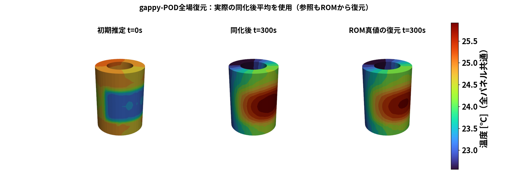

*左=実際の初期アンサンブル平均（0秒）、中=実際の同化後平均（300秒）、右=ROM真値（300秒）を、それぞれgappy-PODで復元。共通温度スケール。左と中は異なる時刻なので、この3枚だけで同化効果を切り分けることはできない。*

### 変位の推定は真値を捉えているか

gappy-POD で復元した温度場を FrontISTR に通せば**変位も推定**できる。
上面の傾き QoI = Uz(A)−Uz(O) の推定を、**同化なし（free run）**・**温度2点で同化**・
**温度2点＋変位2点で同化**の3通りで真値と比べた（5seed平均、加熱期の平均絶対誤差を凡例に付記）:

**図の条件**：ROM双子実験／60メンバー／30秒ごと20回更新（0〜600秒）。真値も同じROM。 seed=20260913〜20260917の5回。 灰点線=同化なし、緑=温度P2/P0、赤=温度P2/P0＋標準A/O変位2点、黒=真値。A/O変位差の5seed平均。凡例は平均曲線の30〜300秒MAE（各seed誤差の平均とは異なる）。

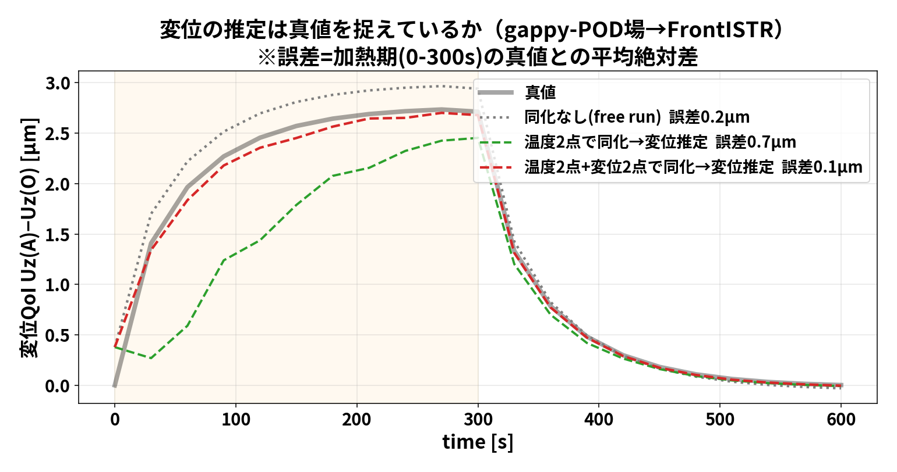

- **同化なし（灰点線）**：パラメータを推定せず勘のまま回すと、QoIは真値を**上に外す**（誤差0.2µm）。
  一見小さいが、これは QoI が Uz(A)とUz(O)の**差**で、両側が同じだけ持ち上がると差では
  誤差が打ち消し合うため。**裏の温度場は4.6Kずれたまま**（STEP6）で、たまたまQ の初期分布が
  真値近くだっただけの脆い一致にすぎない。
- **温度2点で同化（緑破線）**：温度RMSEは大きく改善する（0.5K）が、**QoIはむしろ過小評価**する。
  ヒータ側2点の温度は合わせても、A（+X上面）とO（−X上面）の**左右差**を直接は拘束しないため、
  場が対称化して差が縮む。**温度が合う＝変位が合う、ではない**という重要な教訓。
- **温度2点＋変位2点で同化（赤破線）**：変位を直接観測に入れると、QoIが**過渡から真値に密着**
  （誤差0.1µm）。**変位を良くしたければ変位を観測せよ**、が数字で出る。

（温度→変位は FrontISTR の PODモード応答 $D_\text{mode}$ で評価: $uz=uz_\text{mean}+D_\text{mode}\,a$）

> **なぜこの図が効くのか**：4-3の【本命の証明】は「高熱感度Wの変位点を選べば温度推定まで良くなる」
> を示した。この図はその**逆側**——「変位QoIそのもの」を見ると、温度だけの同化では不十分で、
> 変位観測（しかも高W点）が決定打になることを示す。両者あわせて
> **「変位を当てたいなら、Wの高い上面変位点を観測に加えるべき」**という本研究の主張が閉じる。

---

## STEP 6. 【本研究の有用性】観測構成を変えて比較する

同じPOD選定ROMで、**観測構成だけを変えて**データ同化の精度を比べた
（**アンサンブル $N=60$ メンバー、乱数初期値を変えた5回（5seed）の平均**）。

### 平均RMSEは何を計算した値か

同じ観測構成で乱数条件を5回変えて計算する。$s=1,\ldots,5$ はその計算番号（seed）、
$i=0,\ldots,4$ はROMの温度点、$m=1,\ldots,60$ はEnKFメンバーを表す。
**5seedは再試行の数であり、60メンバーとは別**である。

まず各時刻の同化後アンサンブルから、点ごとの推定温度を求める：

$$\hat T_{s,i}(t_k)=\frac{1}{60}\sum_{m=1}^{60}T^a_{s,m,i}(t_k).$$

同化なしの場合は、同じ初期アンサンブルを更新せずに時間発展させた平均を使う。
次に、観測点だけでなく**全5点（未観測点を含む）**で真値との差を取る：

$$e_{s,i,k}=\hat T_{s,i}(t_k)-T_i^{\mathrm{true}}(t_k),\qquad
r_{s,k}=\sqrt{\frac{e_{s,0,k}^2+e_{s,1,k}^2+e_{s,2,k}^2+e_{s,3,k}^2+e_{s,4,k}^2}{5}}.$$

図・表の「加熱期の平均RMSE」は、この空間RMSEを時刻とseedで平均した値：

$$\boxed{\overline{\mathrm{RMSE}}_T=
\frac{1}{5}\sum_{s=1}^{5}\left[\frac{1}{10}\sum_{k=1}^{10}r_{s,k}\right]}\quad[\mathrm K],
\qquad t_k=30k\ \mathrm{s}.$$

集計は **30, 60, …, 300秒の10回の同化後**。0秒は初期誤差が共通のため集計から除外している。
「0〜300秒」と記していたが、実装上の範囲は $0<t\le300$ 秒である。
全セルの温度RMSEでも、メンバーの標準偏差でも、最終300秒だけの誤差でもない。
また、全時刻・全点の二乗誤差をまとめてから平方根を取る定義とは異なる。

**小さな数値例（説明用）**：ある時刻の5点の誤差が $[1,-2,0,2,-1]$ Kなら、
$r=\sqrt{(1+4+0+4+1)/5}=\sqrt2=1.414$ K。
この計算を10時刻それぞれで行って平均し、さらに5seedを平均する。

コードは `run/run_da_compare.py` の `run_cfg_seed()` 内で
`np.sqrt(((Z[:,:NPT].mean(0)-Ttr[ci])**2).mean())` を計算し、
`run_cfg()` でseed平均、`heat=(tgrid>0)&(tgrid<=300)` と
`results[n][0][heat].mean()` で時間平均する。
時間とseedはどちらも算術平均なので、この2つの平均の順序は交換できる。

**図の条件**：ROM双子実験／60メンバー／30秒ごと20回更新（0〜600秒）。真値も同じROM。 seed=20260913〜20260917の5回。 灰=同化なし、橙=温度P4、青=温度P2、緑=温度P2/P0、赤=温度P2/P0＋標準A/O変位。各seedの全5点温度RMSEを5seed平均。

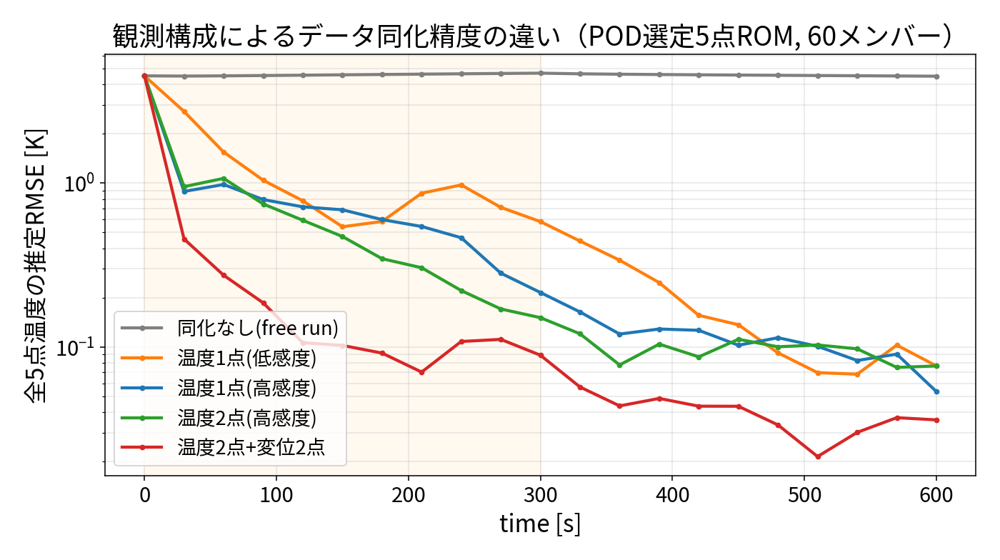

**過渡期（加熱0〜300s、リアルタイムで精度が欲しい区間）の平均RMSE:**

**図の条件**：ROM双子実験／60メンバー／30秒ごと20回更新（0〜600秒）。真値も同じROM。 seed=20260913〜20260917の5回。 左から同化なし／温度P4／温度P2／温度P2/P0／温度P2/P0＋標準A/O変位。30〜300秒の空間RMSEの時間・seed平均。

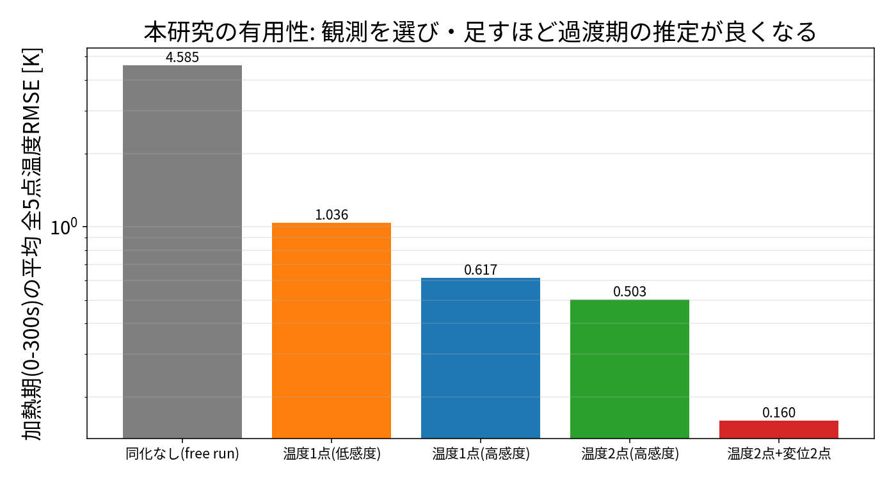

| 観測構成 | 加熱期の平均RMSE | 何が言えるか |
|---|---|---|
| **同化なし（free run）** | 4.585 K | でたらめのまま。**データ同化なしでは推定できない** |
| 温度1点（低感度 dT/dQ最小） | 1.036 K | 同化すれば桁違いに改善。ただし感度の低い点は遅い |
| 温度1点（高感度 dT/dQ最大） | 0.617 K | **同じ1点でも感度の高い場所に置くと1.7倍良い** |
| 温度2点（高感度） | 0.503 K | **センサを足すとさらに改善** |
| **温度2点＋変位2点** | **0.160 K** | **変位を足すと決定的（温度だけの3倍良い）** |

### 同じ5構成で、変位はどう変わったか

温度の棒グラフと**同じ60メンバー×5seedの計算**について、各時刻の同化後平均温度から
上面A（ヒータ側、目標座標 $[28,0,100.5]$ mm）とO（反ヒータ側、$[-28,0,100.5]$ mm）に
最も近いFEM節点の鉛直変位を計算する。
温度1点の低感度はP4、高感度はP2、温度2点はP2/P0。
最後の構成だけがA/Oの変位を観測にも使用する（観測ノイズ標準偏差0.3 µm）。

計算経路は **同化後5点温度 → gappy-POD係数 → FrontISTRで事前計算したモード変位応答**：

$$\hat a_s(t_k)=(P\Phi)^+\{\hat T_{5,s}(t_k)-P\bar T\},\qquad
\begin{bmatrix}\hat u_{A,s}(t_k)\\\hat u_{O,s}(t_k)\end{bmatrix}
=u_{\mathrm{mean}}+D_{\mathrm{mode}}\hat a_s(t_k),\qquad
\hat d_s=\hat u_{A,s}-\hat u_{O,s}.$$

$P$ は全セルから代表5セルを抽出する行列、$\Phi$ はPODモード、$+$ は擬似逆行列。
各時刻にFrontISTRを再実行するのでなく、線形熱弾性の応答を行列積で評価する。
参照変位もROM真値を同じ写像に通す。したがって実測変位や独立な全場FEM解による検証ではない。

**図の条件**：ROM双子実験／60メンバー／30秒ごと20回更新（0〜600秒）。真値も同じROM。 seed=20260913〜20260917の5回。 上記5構成、色も同じ。左列=A/O個別変位と差の5seed平均、黒=真値。右列=各seed絶対誤差の5seed平均。

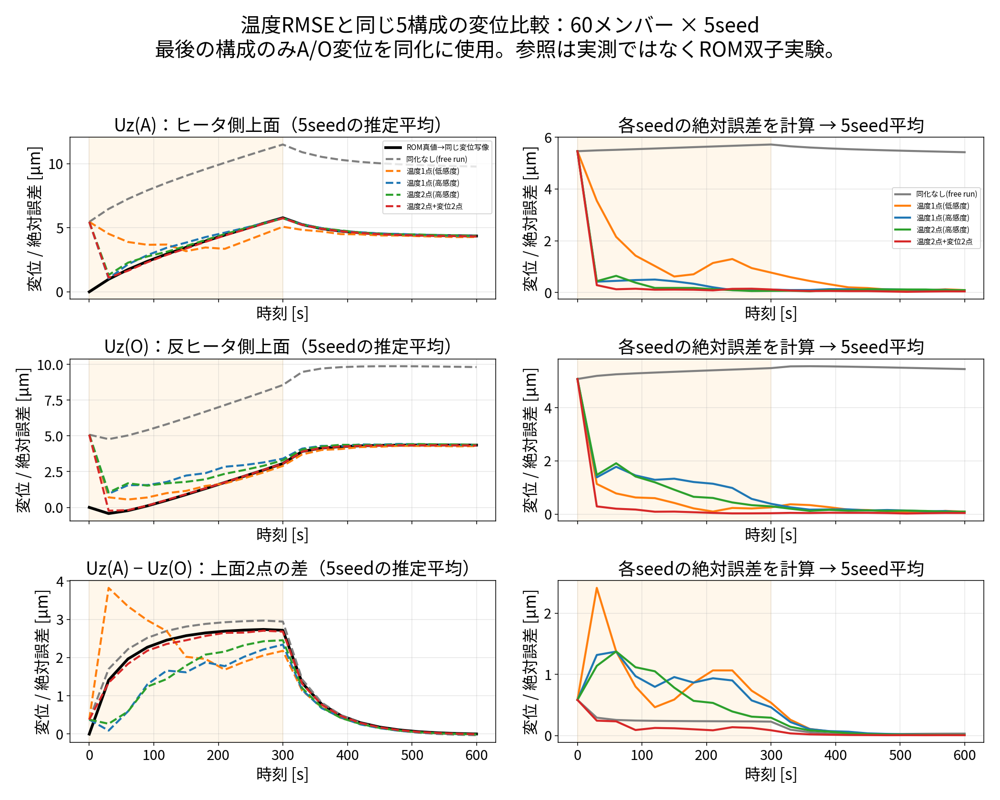

左列は **0〜600秒の変位時刻歴**（黒実線=参照、色破線=各構成の5seed平均）。
右列は各seedの絶対誤差を求めてから平均した値で、seed間で正負の誤差が相殺しない表示。
上段=Uz(A)、中段=Uz(O)、下段=差Uz(A)−Uz(O)。背景の橙色は加熱期。
変位の差は高さの違いであり、角度そのものではない。

**図の条件**：ROM双子実験／60メンバー／30秒ごと20回更新（0〜600秒）。真値も同じROM。 seed=20260913〜20260917の5回。 上記5構成。A/O個別変位と差について、各seedの30〜300秒時間RMSEを計算し5seed平均。

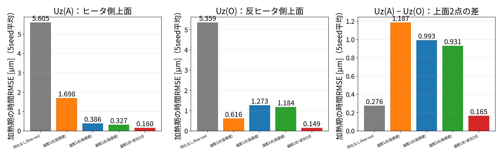

変位の棒グラフでは、各点の**時間RMSE**を各seedで計算してから5seedで平均する。
温度表の「空間RMSEの時間平均」とは平方根を取る位置が異なるため、定義を区別する：

$$\overline{\mathrm{RMSE}}_{u_A}
=\frac15\sum_{s=1}^{5}\sqrt{\frac1{10}\sum_{k=1}^{10}
\{\hat u_{A,s}(t_k)-u_A^{\mathrm{true}}(t_k)\}^2}\quad[\mu\mathrm m].$$

Oも同様。差の評価は、先に $d=u_A-u_O$ を作ってから

$$\overline{\mathrm{RMSE}}_d
=\frac15\sum_{s=1}^{5}\sqrt{\frac1{10}\sum_{k=1}^{10}
\{\hat d_s(t_k)-d^{\mathrm{true}}(t_k)\}^2}.$$

差のRMSEは、AとOのRMSEの差ではない。集計時刻はいずれも30〜300秒の10点。

| 観測構成 | 温度RMSE [K] | Uz(A) RMSE [µm] | Uz(O) RMSE [µm] | 差 Uz(A)−Uz(O) RMSE [µm] |
|---|---:|---:|---:|---:|
| 同化なし(free run) | 4.585 | 5.605 | 5.359 | 0.276 |
| 温度1点(低感度) | 1.036 | 1.698 | 0.616 | 1.187 |
| 温度1点(高感度) | 0.617 | 0.386 | 1.273 | 0.993 |
| 温度2点(高感度) | 0.503 | 0.327 | 1.184 | 0.931 |
| 温度2点+変位2点 | 0.160 | 0.160 | 0.149 | 0.165 |

この結果では、温度だけの同化でA/Oそれぞれの変位誤差は同化なしより減るが、
**差の誤差はむしろ増える**。同化なしではA/Oの共通方向の誤差が差を取ると相殺されるため、
差だけを見ると温度場・個別変位の悪さを見落とす。
温度2点＋変位2点ではA/Oとその差の全指標が改善する。
ただしA/Oはこの構成では同化に使用した点であり、未観測変位点に対する精度は別途検証が必要。

生成コード：`run/run_da_compare.py`。数値表：`results/da_compare_displacement.csv`。
全seed・全時刻の変位：`results/da_compare_displacement.npz`
（配列順は構成×seed×時刻×A/O、単位µm）。

### 温度2点＋変位2点ならQ・hも正しく推定できるか

5構成の中で加熱期の温度平均RMSEが最小だった「温度P2/P0＋上面変位A/O」の
Q・hも保存し、同じ5seedで再計算した。各seedの60メンバー平均を推定値とする。
以下は**600秒の最終推定値を5seedで平均**した比較であり、加熱期の時間平均ではない。

| 観測構成 | Qの推定平均 [W]（真値15） | hの推定平均 [W/K]（真値0.015351） | Qの平均絶対相対誤差 | hの平均絶対相対誤差 |
|---|---:|---:|---:|---:|
| 温度P2の1点 | 13.743 | 0.023771 | 14.0% | 54.8% |
| 温度P2/P0の2点 | 14.046 | 0.023335 | 8.1% | 55.5% |
| **温度P2/P0＋変位A/O** | **14.893** | **0.021404** | **2.5%** | **39.4%** |

誤差列は正負の相殺を防ぐため、$\frac15\sum_s|\hat p_s/p^{\mathrm{true}}-1|\times100$。
Qの平均値14.893 Wは真値から約0.7%の差だが、各seedで誤差を評価すると平均2.5%となる。
最良構成の5seedの範囲はQが14.362〜15.469 W、hが0.015632〜0.035550 W/K。
この範囲は5回の実行で得た最小・最大であり、信頼区間ではない。

#### Q・hはどの式で推定したか（短い導出）

Q・hを直接測るのでなく、**温度・変位の予測外れを、共分散に基づいてQ・hへ配分する**。
以下は温度2点＋変位2点の構成。添字$m$は60メンバー、$f$は観測を入れる前、$a$は同化後。
実装の状態は7成分で、発熱量そのものでなく無次元の発熱倍率qを持つ：

$$z^{(m)}=[T_0,T_1,T_2,T_3,T_4,q,h]^{(m)\top},\qquad Q=15q\ \mathrm W.$$

**① 各メンバーのq・hで温度を30秒先へ予測する。**

$$C_i\dot T_i^{(m)}=\sum_{j\ne i}K_{ij}(T_j^{(m)}-T_i^{(m)})
+\delta_{i,i_{\mathrm{heater}}}\,15q^{(m)}b(t)
-h^{(m)}(T_i^{(m)}-T_{\mathrm{air}}),$$

$b(t)$は0〜300秒で1、それ以降0。予報中はq・hを一定とし、2秒刻みで温度を積分する。
各メンバーの予報観測は

$$y_f^{(m)}=[T_{2,f}^{(m)},T_{0,f}^{(m)},u_{A,f}^{(m)},u_{O,f}^{(m)}]^\top,$$

である。変位は上記のPOD係数・FrontISTRモード応答から計算する。
実際の計算では共分散を作る前に、zと予報観測の平均からの偏差をそれぞれ1.02倍する。
以下の$f$はこの処理後を表す。

**② 60メンバーから平均・共分散を作る。**

$$\bar z_f=\frac1{60}\sum_m z_f^{(m)},\qquad
\bar y_f=\frac1{60}\sum_m y_f^{(m)},$$

$$C_{zy}=\frac1{59}\sum_m(z_f^{(m)}-\bar z_f)(y_f^{(m)}-\bar y_f)^\top
\quad(7\times4),$$

$$C_{yy}=\frac1{59}\sum_m(y_f^{(m)}-\bar y_f)(y_f^{(m)}-\bar y_f)^\top
\quad(4\times4).$$

観測誤差共分散は $R=\operatorname{diag}(0.30^2,0.30^2,0.30^2,0.30^2)$。
先頭2成分の単位はK²、後ろ2成分はµm²で、同じ数値でも物理単位は異なる。

**③ 予測外れをどれだけ状態へ配分するかを求める。**

線形補正 $\hat z_a=\bar z_f+G(y-\bar y_f)$ の平均二乗推定誤差を最小にする。
観測ノイズが状態と独立なら、その誤差共分散は

$$P_a(G)=P_f-GC_{zy}^\top-C_{zy}G^\top+G(C_{yy}+R)G^\top.$$

したがって、$\operatorname{tr}P_a$をGで微分して0とすると

$$-2C_{zy}+2G(C_{yy}+R)=0
\quad\Longrightarrow\quad G=C_{zy}(C_{yy}+R)^{-1}.$$

ここでは内部の熱伝導係数$K_{ij}$との混同を避け、カルマンゲインをGと記した。
これは線形の最小二乗補正であり、非線形な時間発展を含む全事後分布が厳密にガウスになるという意味ではない。

**④ ゲインのq行とh行を使って、各メンバーを更新する。**

$$r^{(m)}=y+\varepsilon^{(m)}-y_f^{(m)},\qquad
\varepsilon^{(m)}\sim\mathcal N(0,R),$$

$$q_a^{(m)}=q_f^{(m)}+
\underbrace{[C_{zy}]_{q,:}(C_{yy}+R)^{-1}}_{G_q:\ 1\times4}\,r^{(m)},$$

$$h_a^{(m)}=h_f^{(m)}+
\underbrace{[C_{zy}]_{h,:}(C_{yy}+R)^{-1}}_{G_h:\ 1\times4}\,r^{(m)}.$$

例えばhの行には、$\operatorname{cov}(h,T_2)$、$\operatorname{cov}(h,T_0)$、
$\operatorname{cov}(h,u_A)$、$\operatorname{cov}(h,u_O)$が並ぶ。
つまり**hが違うメンバー間で観測予測がどう変わるか**を使い、hの修正量を決める。
複数成分の相関を同時に扱うため、更新の向きは個々の共分散の符号だけでは決まらない。
実装では逆行列を作らず `np.linalg.solve(C_yy + R, C_zy.T)` で計算する。
更新後にqは[0,3]、hは[0.0001,0.2] W/Kへクリップする。この制約処理は上の線形導出に追加した実装上の処理である。

**⑤ 図の線へ変換する。** 各seedで同化後60メンバーを平均し、さらに5seedを平均する：

$$\hat Q_s(t_k)=\frac{15}{60}\sum_m q_{a,s}^{(m)}(t_k),\qquad
\hat h_s(t_k)=\frac1{60}\sum_m h_{a,s}^{(m)}(t_k),$$

$$Q_{\mathrm{plot}}(t_k)=\frac15\sum_s\hat Q_s(t_k),\qquad
h_{\mathrm{plot}}(t_k)=\frac15\sum_s\hat h_s(t_k).$$

帯は5seedの推定平均の最小〜最大。0秒は更新前の初期値。
温度だけの構成では観測ベクトルから変位成分を外して同じ計算を行い、同化なしでは更新しない。
図のQは加熱中の発熱量に対応する推定パラメータであり、300秒以降の実際のヒータ入力は$15qb(t)=0$ W。

対応コード：`dacore/rom_general.py` の `integrate_ensemble()`、
`dacore/enkf.py` の `enkf_update()`、`run/run_da_compare.py` の `run_cfg_seed()`。

**図の条件**：ROM双子実験／60メンバー／30秒ごと20回更新（0〜600秒）。真値も同じROM。 seed=20260913〜20260917の5回。 上記5構成。線=各seedの同化後平均を5seed平均、帯=5seedの最小〜最大、黒破線=真値。Qは加熱時の発熱量パラメータ。

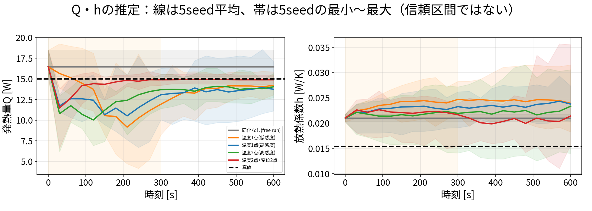

**結果：変位観測の追加でQの推定は改善したが、hには約39%の誤差が残る。**
温度・変位が最も合う構成でも、すべての未知パラメータを正確に推定できたとは言えない。
hの推定不良の原因が観測情報の不足、有限アンサンブル、初期分布などのどれかは、
この比較だけでは切り分けていない。

前述の基本設定のQ=17.08 W、h=0.02511 W/Kはseed=20260913の**1回の結果**。
上表は5回の平均なので、その数値と直接同じ統計として比較しない。
再現コード：`run/run_da_compare.py`。
数値：`results/da_compare_parameters.csv`、全seedの時刻歴：`results/da_compare_parameters.npz`。

### 考察：なぜhは推定しにくいのか — 観測に現れる変化の小ささ

**今回の有力な仮説は、hが違っても600秒間の温度・変位の差が小さく、観測から見分けにくいこと**。
これを調べるため、初期温度・Q・熱容量・内部熱伝導を真値に固定し、hだけを
$0.015351$ から $1.4\times0.015351=0.021491$ W/Kへ増やした。
EnKFを使わず、同じROMを0〜600秒まで2秒刻みで計算した比較である。

| hを40%増やしたときの変化 | 全評価時刻・対象点での最大絶対差 | 同化で設定した観測ノイズ標準偏差 |
|---|---:|---:|
| ROM温度5点 | 0.0491 K | 0.30 K |
| 上面A/Oの鉛直変位 | 0.0579 µm | 0.30 µm |

変位は両方のROM温度を同じgappy-POD・FrontISTRモード応答写像に通して評価した。
**hが40%違っても、信号の差は1回の観測ノイズの標準偏差より小さい。**
ただし、複数時刻の観測を重ねれば情報は増えるため、この比較だけで「推定不可能」とは言えない。
40%摂動による有限差分の確認であり、推定誤差39%の原因を定量的に分解したものでもない。

#### 冷却時間はhを見極めるのに十分か

このROMは各点から同じ係数hで放熱する：

$$C_i\frac{dT_i}{dt}=\sum_{j\ne i}K_{ij}(T_j-T_i)+q_i-h(T_i-T_{\mathrm{air}}).$$

全5点を足すと、内部の熱のやり取りは $K_{ij}=K_{ji}$ により相殺される：

$$\frac{d}{dt}\sum_i C_i(T_i-T_{\mathrm{air}})
=Q(t)-h\sum_i(T_i-T_{\mathrm{air}}).$$

内部の温度差が小さいとして $T_i-T_{\mathrm{air}}\approx\theta$ と置き、
冷却期の $Q(t)=0$ を使うと、

$$C_{\mathrm{tot}}\frac{d\theta}{dt}\approx-5h\theta,
\qquad \theta(t)\approx\theta(t_0)e^{-(t-t_0)/\tau},
\qquad \tau\approx\frac{C_{\mathrm{tot}}}{5h}.$$

今回の $C_{\mathrm{tot}}=1211.14$ J/Kから、

$$\tau\approx\frac{1211.14}{5\times0.015351}
=15779\ \mathrm{s}\approx4.4\ \mathrm{時間}.$$

これは**温度がほぼ一様な場合の概算**であり、5点モデル全体の厳密な単一時定数ではない。
それでも、今回の冷却観測300秒（5分）はこの尺度に比べ短い。
**内部の温度差が均されることと、外部への放熱で全体が冷えることは別**であり、
短時間で温度分布が落ち着いても、hを十分に推定できたことにはならない。

#### hを同定する計算式：冷え方から何を逆算するのか

全点の熱収支から、形式的にはhを次のように取り出せる：

$$\boxed{h=
\frac{Q(t)-\sum_i C_i\dot T_i(t)}{\sum_i[T_i(t)-T_{\mathrm{air}}]}}\quad[\mathrm{W/K}].$$

冷却中は$Q(t)=0$なので、外へ逃げた熱は蓄熱の減少から分かる。
温度がほぼ一様な近似では

$$h\approx-\frac{C_{\mathrm{tot}}}{5}\frac{d\ln\theta}{dt},\qquad
h\approx\frac{C_{\mathrm{tot}}}{5(t_2-t_1)}
\ln\frac{\theta(t_1)}{\theta(t_2)},\quad \theta=T-T_{\mathrm{air}}>0.$$

**冷却曲線の減衰率からhを逆算する**というのが物理的な意味である。
短時間に温度があまり下がらないと対数比が小さく、ノイズの影響を受けやすい。
実装ではこの式に観測の数値微分を直接代入していない。
各メンバーのhで温度・変位を予測し、EnKFで

$$\boxed{h_a^{(m)}=h_f^{(m)}+
\operatorname{Cov}_{\mathrm{ens}}(h,y_f)
\{\operatorname{Cov}_{\mathrm{ens}}(y_f,y_f)+R\}^{-1}
(y+\varepsilon^{(m)}-y_f^{(m)})}$$

と更新する。共分散は60メンバーから分母59で計算する。
この式の導出と図にするまでの平均は、上の「Q・hはどの式で推定したか」に示した。
**今回の最良観測構成でも、hの最終平均絶対相対誤差は5seedで39.4%であり、同定精度には課題が残る。**

一般的な表面熱伝達率を$\alpha$ [W/(m² K)]、表面積を$A$とすると、
一様温度・一様熱伝達率という近似では全放熱は$\alpha A\theta$。
本ROMの全放熱$5h\theta$と対応させるなら

$$\alpha_{\mathrm{eff}}\approx\frac{5h}{A}.$$

ただし対応する放熱面積と境界条件を決める必要があり、hをそのまま表面熱伝達率とは呼べない。
他の放熱機構もROMのhに含めて校正されているなら、換算値は実効値であって対流だけの熱伝達率ではない。

#### ROMの限界といえるか

今回の双子実験では、真値と推定に同じROM・同じ変位写像を使っている。
そのため、今回の推定不良を直ちに「実現象に対するROMの近似誤差」と説明することはできない。
まずはこのモデルと観測条件でhを区別する情報がどれだけあるか、という問題である。
一般に、パラメータを変えても観測出力がほとんど変わらない場合は、
パラメータを精度よく特定しにくい（実用上の識別性）。
[感度と識別性に関する研究](https://pmc.ncbi.nlm.nih.gov/articles/PMC5420165/)

一方、実際のOpenFOAMや実験へ適用する段階では、空間的に異なる放熱を
全5点共通のh一つにまとめる簡略化も検証する必要がある。
hはこのROMの集中放熱係数[W/K]であり、面積当たりの熱伝達率[W/(m² K)]ではない。

**次に検証する案（未実施）**：まず冷却観測時間だけを延ばし、他の条件を揃えてhの誤差が減るか比較する。
Q固定／Q同時推定の比較でパラメータ間の影響を、メンバー数を増やした比較で有限標本の影響を調べれば、
原因の切り分けが進む。今回の追加計算はその前段の感度確認までである。

再現：`OMP_NUM_THREADS=4 OPENBLAS_NUM_THREADS=4 python3 run/check_h_sensitivity.py`。
結果：`results/h_sensitivity_check.json`、時刻歴：`results/h_sensitivity_check.npz`。

### 結論（本研究の有用性）

1. **データ同化そのものが必須**：同化なし4.6K → 同化あり最良0.16K（**約29倍**）。
   少数観測から全体温度・発熱量・放熱を推定できる。
2. **観測点の選定が効く**：同じ1点でも、熱感度（dT/dQ）の高い場所に温度センサを置くと
   過渡の推定が1.7倍良い。**この比較の温度感度はROMで求めており、FrontISTRのWではない**。
3. **変位観測が決定的**：温度2点に上面変位2点を足すと、温度だけの3倍精度が出る。
   FrontISTRで温度場→変位を評価し、観測に加えられるのがオープンソース連成の強み。
4. **代表点は勘でなく POD＋Q-DEIM で選ぶ**：温度場の型（POD）から系統的に決めた5点で
   ROMを組み、0.014KでOpenFOAMを再現した。

---

## 再現手順

```
OMP_NUM_THREADS=4 python3 run/select_points_qdeim.py    # ①POD+Q-DEIMで代表点選定
OMP_NUM_THREADS=4 python3 run/build_calibrate_rom.py    # ②5点ROMを校正(0.014K)
OMP_NUM_THREADS=4 python3 run/make_pod_modes_fig.py     # PODモードの絵
OMP_NUM_THREADS=4 python3 run/run_da.py                 # ③単一構成のデータ同化
OMP_NUM_THREADS=4 python3 run/run_da_compare.py         # ④観測構成の比較(有用性)
```

数式とアルゴリズムの詳細は `01_pod_qdeim_algorithm.md`。
