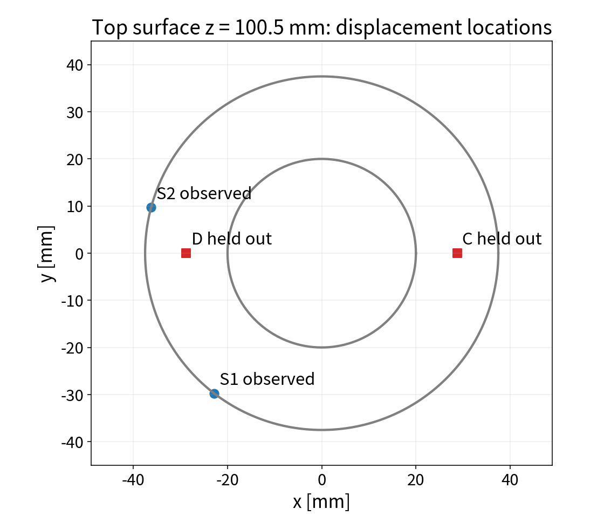
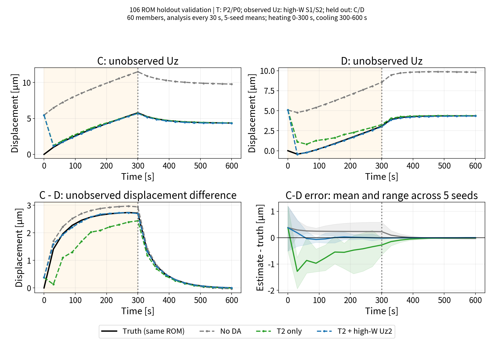

# 106：同化に使わない2点の変位と変位差の時刻歴

2026-09-14実行。Claude Code側の作業と並行して、独立した支援用スクリプトで確認した結果。

**温度2点＋高W変位2点の同化で、別の未観測C/Dの変位差も改善した。**
ただし真値は同じROMと変位写像で生成しており、実測・未学習OpenFOAM場に対する検証ではない。

## 何を比較したか

| 図の線 | 同化する観測 | 評価する量 |
|---|---|---|
| 灰：No DA | なし | C、DのUzとC−D |
| 緑：T2 only | 温度P2/P0の2点 | 同上 |
| 青：T2 + high-W Uz2 | 同じ温度2点＋高W変位S1/S2 | 同上 |
| 黒：Truth | 同じROMで生成した真値 | 比較基準 |

**C/Dの変位は、どのケースでも観測ベクトルに入れていない。**
温度P2/P0は既存ROMの発熱量応答に基づく配置。「高W」は変位センサS1/S2の選定を指し、温度センサをWで選んだという意味ではない。
S1/S2は105の `kinvh_sensitivity.npz` の `hi` を採用。今回、高W対低Wの比較や4点観測は実施していない。

60メンバー、積分刻み2秒、30秒ごと20回更新、0〜600秒。
加熱0〜300秒（真値Q=15 W）、その後冷却。真値h=0.01535104094 W/KはROMの熱コンダクタンス。
温度観測ノイズ標準偏差0.30 K、変位0.30 µm、偏差のインフレーション係数1.02。
seedは20260913〜20260917。各条件で初期アンサンブルと温度観測ノイズ系列を共通化し、変位観測ノイズと更新摂動の乱数系列を分離した。
初期温度は一様分布[Tair−3,Tair＋12] K、qは一様分布[0.3,1.8]、hは正規分布N(0.02,0.01²)を[0.001,0.1] W/Kに制限。
図の線は、各seedの同化後60メンバー平均をさらに5seed平均した値。時刻0は更新前の初期値。

## 位置

| 記号 | 役割 | FEM節点ID（1始まり） | 座標(x,y,z) [mm] |
|---|---|---:|---|
| S1 | 高W変位観測 | 4960 | (−22.829, −29.751, 100.5) |
| S2 | 高W変位観測 | 4915 | (−36.222, 9.706, 100.5) |
| C | 未観測の評価点 | 4803 | (28.750, 0, 100.5) |
| D | 未観測の評価点 | 4923 | (−28.750, 0, 100.5) |

C/Dは従来の標準A/Oに相当する位置を、計算前に検証点として固定した。S1/S2とは別節点だが、遠く離れた領域への外挿を示す実験ではない。
温度P2=(36.487,6.896,50.781) mm、P0=(21.304,−1.625,51.563) mm。



## 変位の推移

上段左=CのUz、上段右=DのUz、下段左=C−D、下段右=C−Dの推定誤差。
薄い橙色は加熱区間。右下の帯は5seedの誤差の最小〜最大であり、アンサンブルの信頼区間ではない。



## 数値評価

各seedについて30,60,…,300秒の10解析時刻でRMSEを取り、その後5seed平均した。

$$d(t)=u_{z,C}(t)-u_{z,D}(t)$$

$$R_{d,s}=\sqrt{\frac{1}{10}\sum_{k=1}^{10}[\widehat d_s(30k)-d_{\mathrm{true}}(30k)]^2},\qquad
\overline R_d=\frac{1}{5}\sum_{s=1}^{5}R_{d,s}$$

個別C/Dも同じ式で評価する。図の5seed平均曲線から計算したRMSEとは異なる。

| ケース | 加熱期C RMSE [µm] | 加熱期D RMSE [µm] | 加熱期C−D RMSE [µm] | 冷却期C−D RMSE [µm] |
|---|---:|---:|---:|---:|
| 同化なし | 5.6050 | 5.3595 | 0.2759 | 0.04860 |
| 温度2点のみ | 0.2698 | 0.9665 | 0.7921 | 0.06184 |
| 温度2点＋高W変位2点 | 0.1803 | 0.0987 | 0.1583 | 0.00896 |

冷却期は330,360,…,600秒の10時刻。時刻0はRMSEから除外した。

温度2点のみと比べ、変位観測の追加で未観測変位差の加熱期RMSEは約80%低下した。
一方、**温度のみの同化では、C/D個別の変位が改善しても、差は同化なしより悪化した。**
同化なしのC/Dには同方向の大きな誤差があり、差を取ると相殺されるためである。
したがって差だけの評価では個別変位の大きなずれを見逃す。今回、個別Uzと差を同時に示す意味がここにある。

## 計算手順と再現

状態は7変数 $z=[T_0,T_1,T_2,T_3,T_4,q,h]^\mathsf{T}$ 、Q=15q W。
各メンバーをROMで時間積分し、予報温度からPOD係数と変位を計算する。

$$a=(P\Phi)^+(T_5-P\bar T),\qquad u=u_0+Da$$

平均温度場1回＋5モード各1回の計6回、FrontISTRを実行して4節点共通の変位応答を再構築した。
温度場は最寄りOpenFOAMセルからFEM節点へ写し、変位応答はµmで保存。
温度・変位観測ケースの予報観測は

$$y_f^{(m)}=[T_{2,f}^{(m)},T_{0,f}^{(m)},u_{z,S1,f}^{(m)},u_{z,S2,f}^{(m)}]^\mathsf{T}$$

であり、C/Dは入れない。標本共分散は60−1=59で割り、既存 `dacore/enkf.py` の更新を使用。
更新後温度から係数aとC/D変位を再計算する。オンライン段階ではFrontISTRを毎回呼ばず、事前計算した線形写像を使う。

106ディレクトリで実行：

```bash
OMP_NUM_THREADS=4 OPENBLAS_NUM_THREADS=1 python3 run/run_holdout_displacement_support.py
```

- [再現スクリプト](../run/run_holdout_displacement_support.py)
- [条件・節点・座標](../results/holdout_support_conditions.json)
- [時刻歴データ](../results/holdout_support_history.npz)：statesはケース×seed×時刻×7状態、u_umはケース×seed×時刻×4節点（S1,S2,C,D）。
- [RMSEのCSV](../results/holdout_support_rmse.csv)
- [検証設計の支援メモ](16_unobserved_displacement_support.md)

変位応答キャッシュ名にはモード・平均場・セル座標・FEM節点座標・選択節点・物性のハッシュを含め、別節点の古い応答との混同を防いだ。
この検証は5次元POD空間内の未観測位置への推定を確認するもの。独立したOpenFOAM真値や実測に対する妥当性、センサ配置の最適性は次の検証課題である。
