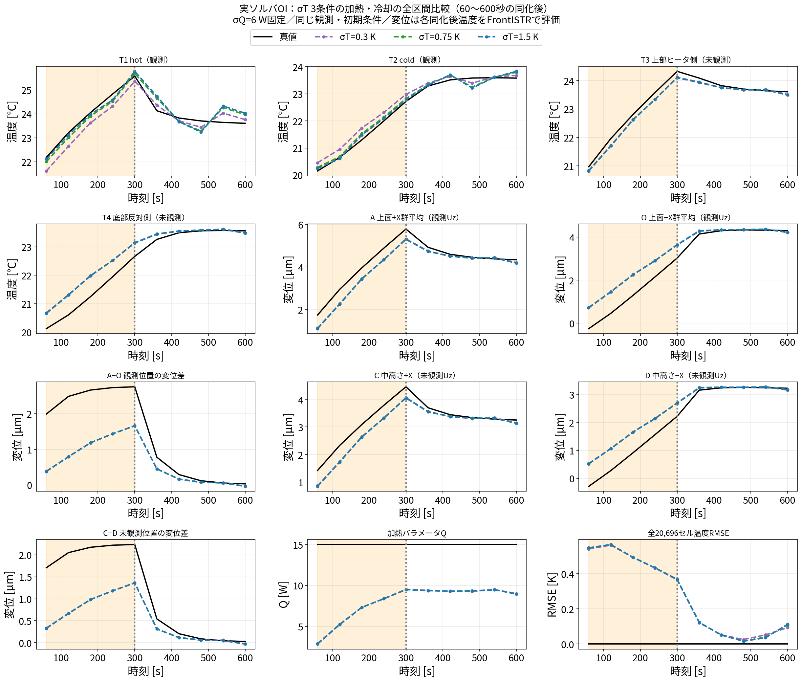
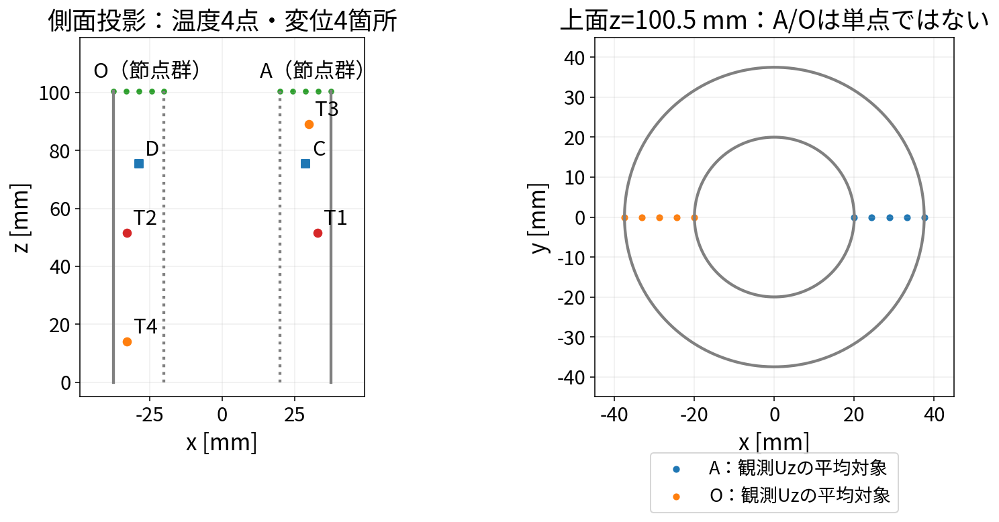

# OIのσT=1.5 Kを検証する：熱伝導による誤差伝播と実ソルバ比較

## 検証する問い

**σT・σQの値の調整だけで、温度場・未観測変位差・Qを同時に正しく推定できるか。**
「調整しても限界がある」という結論を先に確定せず、調整が効く範囲と残る誤差を調べる。
有限個の条件で誤差が残っても「いくら動かしても改善しない」とは証明できない。
結論は「この観測配置・共分散構造・検証範囲では」に限定する。

## 600秒までの結果と、熱伝導の試算との比較

**0.3 / 0.75 / 1.5 Kの3ケースが600秒まで揃った。** 下図は観測温度2点・未観測温度2点、A/O個別変位と差、未観測C/D個別変位と差、Q、全場温度RMSEを比較する。
凡例は上。評価位置は下の位置図・座標表と共通。温度・変位とも同化後である。
初期時刻0の変位は旧履歴で便宜的なゼロだったため、時刻歴は60〜600秒を表示する。

| σT [K] | 加熱期の全場温度平均RMSE [K] | 冷却期の全場温度平均RMSE [K] | 加熱期の未観測C−D RMSE [µm] | 冷却期の未観測C−D RMSE [µm] | 最終Q [W] |
|---:|---:|---:|---:|---:|---:|
| 0.3 | 0.4787 | 0.0690 | 1.1877 | 0.1136 | 9.006 |
| 0.75 | 0.4811 | 0.0678 | 1.1910 | 0.1130 | 8.968 |
| 1.5 | 0.4818 | 0.0678 | 1.1919 | 0.1128 | 8.958 |

加熱は60〜300秒の5時刻、冷却は360〜600秒の5時刻。指標は下記の加熱期と同じ式で対象時刻だけを替える。
最終時刻の全場温度RMSEは順に0.0934 / 0.1081 / 0.1124 K。
真値Q=15 Wに対し、最終値は約40%過小。Qは加熱パラメータで、300秒以降の実入力は0 Wである。

### 熱伝導方程式では、σTはいくらがよいのか

**方程式だけから最適なσTは決まらない。今回の試算は「初期の単一モード振幅の標準偏差を5 Kと仮定すると、60秒後に約1.24〜2.30 Kが残る」という条件付きの目安である。**
長さ75 mm・100.5 mmの1次元モードを例にした値で、中空円筒CHTの固有値を実計算して決めた範囲ではない。
実験の一様バイアス＋5 Kと、この確率的なモード振幅5 Kは異なる。

$$
\sigma_{\mathrm{mode}}(60)=5\exp\left[-\frac{50}{7850\times480}\left(\frac{\pi}{L}\right)^2 60\right]\ \mathrm{K}.
$$

| 比較対象 | 数値 | 読み取れること |
|---|---|---|
| L=75 mmの例 | 1.237 K | 初期標準偏差5 Kの空間モードの60秒後の振幅 |
| L=100.5 mmの例 | 2.297 K | 同上。長い空間モードほど残りやすい |
| 現行OIのσT=1.5 K | 上記2例の間 | 桁として整合する可能性はあるが、セル独立誤差としての妥当性・最適性は保証しない |
| σT=0.3 / 0.75 Kの実計算 | 加熱期の全場・変位差は僅かに改善 | 単一の「理論推奨値」に近いほど推定が良くなる、とは確認できない |

**重要な違い**：理論式は相関した空間モードの誤差振幅。現行OIのσTはセル独立誤差部分の標準偏差で、Q由来の誤差は別途加算する。
したがって、1.24〜2.30 KをそのままOIのσTの推奨区間として置き換えてはいけない。
5 Kという初期振幅を半分に仮定すれば、試算値も半分になる。1.5 Kは熱伝導方程式から一意に導いた値ではない。

### 結論

**今回の固定共分散・比例近似感度を使うOIでは、σT=0.3〜1.5 Kの調整だけで加熱期の変位差とQの推定誤差を解消できなかった。**
冷却期は温度場と変位差の誤差が小さくなるが、σTによる差は小さく、Qの誤差は残る。
終盤だけの一致をもって加熱中の推定も成功したとは判断できない。

既存のσQ=0.5/2/6/50 W比較も含めると、検証した範囲では分散の大きさの調整だけで大きな改善は得られていない。
ただしσT×σQの全組合せや他の共分散構造を検証したわけではないため、**OI一般の限界と断定することはできない**。
σTの追加条件3/5 Kは別途計算を継続する。
次に、初期温度バイアスとQを分けること、Qの有限差分感度、温度誤差から変位へ伝わる共分散の省略を解消することを検証する。

計算時間は0.3 Kで68.9分、0.75 Kで69.0分、既存1.5 Kで70.1分。
OpenFOAM予報・OI更新・FrontISTRを含み、真値観測の準備と最終作図は計時外。

再生成：[make_oi_sigma_t_full.py](../../104_0_openfoam_frontistr_da_enkf/run/make_oi_sigma_t_full.py)。
集計：[full_3case_metrics.json](../../104_0_openfoam_frontistr_da_enkf/results/oi_sigma_t_study/full_3case_metrics.json)。

## 3ケースの実計算結果と結論（加熱区間）

**σTの調整で観測温度への適合度は変わるが、今回の3ケースでは全場温度・変位差・Qの誤差を解消できなかった。**
これは「現行の固定共分散・比例近似感度を使うOIでは、σTの振幅調整だけでは不十分」という加熱区間についての結論である。
OIという手法一般の限界や、未検証のσT・σQの全組合せで改善不能という意味ではない。

σQ=6 Wを固定し、σT=0.3 / 0.75 / 1.5 Kを比較した。
0.3/0.75 Kは今回のパラメータスタディ、1.5 Kは既存計算の保存温度場を利用。
**3ケースとも計算が揃った60・120・180・240・300秒の同化後だけを比較する。**
この図・表は加熱区間に限定する。冷却区間を含む結果は上の全区間比較を参照。
観測点・初期条件・seedは共通で、変位は同化後温度からFrontISTRで評価した。
旧1.5 K履歴の予報変位は使用していない。Qは新規ログの保存精度に合わせ小数2桁で表示する。

時刻歴は上の「600秒までの結果」の全区間図に統合した。以下の表は、そのうち加熱区間だけの指標を示す。

| σT [K] | 全場温度の平均RMSE [K] | hot温度RMSE [K] | cold温度RMSE [K] | A−O変位差RMSE [µm] | 未観測C−D変位差RMSE [µm] | 300秒のQ推定 [W] |
|---:|---:|---:|---:|---:|---:|---:|
| 0.3 | 0.4787 | 0.4753 | 0.3301 | 1.4470 | 1.1877 | 9.52 |
| 0.75 | 0.4811 | 0.2003 | 0.1440 | 1.4509 | 1.1910 | 9.49 |
| 1.5 | 0.4818 | 0.1566 | 0.1040 | 1.4521 | 1.1919 | 9.49 |

真値Qは15 W。3ケースとも300秒時点で約37%過小であり、Q同定の問題は残る。
σTを1.5→0.3 Kへ下げたとき、全場温度の平均RMSEの改善は約0.65%、未観測変位差は約0.35%にとどまる。
しかもhot/coldの温度RMSEは悪化する。**「ある点の温度を合わせる設定」と「場全体や変位差が良くなる設定」は同じとは限らない。**

全場温度の平均RMSEは、各時刻のセル方向RMSEを先に取り、その5時刻平均：

$$
\overline R_T=\frac15\sum_{k=1}^5\sqrt{\frac1{20696}\sum_{i=1}^{20696}
[\widehat T_i(60k)-T_{i,true}(60k)]^2}.
$$

個別温度点と変位差は各対象の5時刻RMSE。例えば

$$
R_{C-D}=\sqrt{\frac15\sum_{k=1}^5
\{[\widehat u_C(60k)-\widehat u_D(60k)]-[u_{C,true}(60k)-u_{D,true}(60k)]\}^2}.
$$

初期時刻0は含まない。1 seedの比較で、5seed平均ではない。

### 図のT1〜T4、A/O、C/Dはどこか

| 図の記号 | 役割 | 指定位置・定義 [mm] |
|---|---|---|
| T1 hot | 観測温度 | (+32,0,50.25)に最も近いOpenFOAMセル |
| T2 cold | 観測温度 | (−32,0,50.25)に最も近いOpenFOAMセル |
| T3 | 未観測温度 | (+30,0,90)に最も近いセル |
| T4 | 未観測温度 | (−30,0,15)に最も近いセル |
| A | 観測変位 | 上面z=100.5の+X側節点群の平均Uz。単点ではない |
| O | 観測変位 | 上面z=100.5の−X側節点群の平均Uz。単点ではない |
| C | 未観測変位 | FEM節点ID 3603、(+28.750,0,75.375) |
| D | 未観測変位 | FEM節点ID 3723、(−28.750,0,75.375) |

T1〜T4はこの図のラベルで、106 ROMのP0〜P4とは異なる。
AとOはそれぞれ個別に同化し、その差も評価する。C/DとC−Dは同化に使わない。
セルの実中心座標・添字とA/Oの全節点IDは `104/results/oi_sigma_t_study/evaluation_locations.json` に保存した。

### なぜσT調整だけでは大きく改善しないのか

以下は実装から説明できる仕組みであり、原因を個別に実証した比較結果ではない。

- σTを変えても、全場を結び付けるQ感度の形 $s=(T_b-T_{air})/Q_b$ は変わらない。
- 独立温度誤差 $\sigma_T^2I$ の直接補正は温度観測セルに入る。未観測セルへの補正は主に共通Q感度を通じて入るため、σT調整は「任意の温度誤差の形を直す自由度」を増やさない。
- 初期の一様＋5 K誤差と発熱量誤差をQ感度に混ぜており、それぞれの影響を独立に推定していない。
- 独立温度誤差が変位に伝わる共分散寄与を省いた近似と、最初に作ったゲインの固定も残る。

したがって次の課題は、σの探索範囲を広げる検証に加え、**共通温度バイアスとQを分ける状態設計、OpenFOAMのQ摂動から計算した感度、温度誤差から変位への共分散投影を揃える比較**である。
まず1.5 Kを「正解」とはせず、上のトレードオフと残差を研究成果として示す。

再生成：[104/run/make_oi_sigma_t_heating.py](../../104_0_openfoam_frontistr_da_enkf/run/make_oi_sigma_t_heating.py)。
数値：[heating_3case_metrics.json](../../104_0_openfoam_frontistr_da_enkf/results/oi_sigma_t_study/heating_3case_metrics.json)。

## 熱伝導方程式から分かること

104の実際の固体設定は `openfoam/base_case/constant/solid/thermophysicalProperties`：
熱伝導率k=50 W/(m K)、密度ρ=7850 kg/m³、比熱cp=480 J/(kg K)。したがって

$$
\alpha=\frac{k}{\rho c_p}=\frac{50}{7850\times480}=1.32696\times10^{-5}\ {\rm m^2/s}.
$$

同じ係数・熱源を持つ2つの熱伝導解の差e=T推定−T真値を取り、熱源誤差を除いた局所モデルでは

$$
\frac{\partial e}{\partial t}=\alpha\nabla^2e.
$$

空間固有関数を $-\nabla^2\phi_j=\lambda_j\phi_j$ 、 $e(x,t)=\sum_j a_j(t)\phi_j(x)$ とすると、

$$
\sum_j\dot a_j\phi_j=-\alpha\sum_j\lambda_j a_j\phi_j
\quad\Rightarrow\quad \dot a_j=-\alpha\lambda_j a_j,
$$

$$
a_j(t)=a_j(0)e^{-\alpha\lambda_jt}.
$$

初期モード振幅が平均0・標準偏差σj,0の確率変数なら、

$$
\mathrm{Var}[a_j(t)]=\sigma_{j,0}^2e^{-2\alpha\lambda_jt},\qquad
\sigma_j(t)=\sigma_{j,0}e^{-\alpha\lambda_jt}.
$$

つまり**方程式は初期の不確かさをどの程度減衰させるかを決めるが、初期の標準偏差そのものは決めない**。
各モードが独立なら、空間共分散も

$$
B_{TT}(x,x',t)=\sum_j\sigma_{j,0}^2e^{-2\alpha\lambda_jt}\phi_j(x)\phi_j(x')
$$

となり、一般に非対角要素が生じる。離散系の誤差伝播行列Mなら $B^f=MB^aM^{\mathsf T}+Q_{model}$ 。
ここで $Q_{model}$ はモデル誤差の共分散で、発熱量Qとは別物。
この式は現行OIの実装を述べるものではなく、物理的な誤差伝播との比較基準である。

導出の基礎：[MIT OCWの熱方程式のFourier解析](https://ocw.mit.edu/courses/16-920j-numerical-methods-for-partial-differential-equations-sma-5212-spring-2003/1db1ffe33bea72c3a9a6f0d6ce487a92_lec1.pdf)。

## 60秒後の数値例：1.5 Kを正当化できるか

1次元の単一モード $\phi(x)=\sin(\pi x/L)$ を例にすると、λ=(π/L)²である。
**比較用に初期モード振幅の標準偏差を5 Kと仮定**した場合の60秒後は次のとおり。
実験で加えた一様バイアス＋5 Kを、そのまま標準偏差と同一視したものではない。
また、Lはこの例のモードの長さであり、OIに設定した相関長ではない。

| モードの長さL | 60秒後の振幅の残存率 | 初期標準偏差5 Kを仮定した場合 |
|---|---:|---:|
| 17.5 mm（壁厚を長さの目安とした例） | 7.19×10⁻¹² | 約3.59×10⁻¹¹ K |
| 75 mm（外径を長さの目安とした例） | 0.2473 | 1.237 K |
| 100.5 mm（高さを長さの目安とした例） | 0.4593 | 2.297 K |

60秒の拡散距離 $\sqrt{2\alpha\times60}$ は約39.9 mm。
これは1次元熱核の幅の定義による値で、誤差の温度振幅ではない。

**1 K程度の誤差が残るモードはあり得るが、これだけで現行の独立誤差σT=1.5 Kを妥当と認定できない。**
実際の中空円筒CHTは上記1次元モードの境界条件と異なり、流体への熱移動・放射・熱源誤差も含む。
また断熱系の一様モードはλ=0なので、内部熱伝導だけでは一様温度バイアスは消えない。
空間相関を持つモード誤差と、現行のセル独立誤差 $\sigma_T^2I$ は異なる。

## 実行する実ソルバ比較

| 条件 | 設定 |
|---|---|
| 変更する量 | σT=0.3 / 0.75 / 1.5 / 3 / 5 K |
| 固定する量 | σQ=6 W、元のOI共分散構造・固定ゲイン |
| 比較値の根拠 | 0.3 Kは温度観測ノイズと同じ尺度、5 Kは初期バイアスと同じ尺度。その間を挟む。どちらも真の背景標準偏差と認定した値ではない |
| ソルバ | OpenFOAM CHT＋FrontISTR、各条件で独立した背景1本 |
| 初期条件 | 温度＋5 K、Q=22 W、加熱真値Q=15 W |
| 観測 | hot/cold温度、上面A/O平均Uz。温度0.3 K・変位0.1 µmの観測ノイズ |
| 時間 | 60秒ごと10回更新、0〜600秒、300秒でヒータOFF |
| 乱数 | seed=20260908。全条件で同一の合成観測系列 |
| 評価 | 全場温度RMSE、観測・未観測温度、A/O個別変位と差、Q |

再現プログラム：[104/run/run_oi_sigma_t_study.py](../../104_0_openfoam_frontistr_da_enkf/run/run_oi_sigma_t_study.py)。
実行中のコード変更による条件混在を減らすため、OIドライバと設定を保存してから実行する。
2ケースずつ並行実行。既存ケースを上書きせず、以下へ保存する。

- 計算ケース：`104/results/oi_sigma_t_study/openfoam/st*/`
- 実行条件：`104/results/oi_sigma_t_study/conditions.json`
- 各ログ：`104/results/oi_sigma_t_study/st*.log`
- 完了履歴：`104/results/oi_sigma_t_study/oi_fullsolver_st*_history.npz`
- 集計：`104/results/oi_sigma_t_study/metrics.json`（各ケース完了後に更新）
- 比較図：`106/docs/img/oi_sigma_t_comparison.png`（完了ケースが出てから生成）

**2026-09-14更新：0.3 / 0.75 / 1.5 Kは600秒まで比較済み。追加条件3/5 Kは計算中で、全範囲の最良値は未確定。**
既存σQ比較と今回のσT比較は座標方向の比較であり、全組合せの探索ではない。

## 「調整のコツ」か「共分散構造の限界」かを区別する

更新ゲインは $K=BH^{\mathsf T}(HBH^{\mathsf T}+R)^{-1}$ 。
単にσを大きくするのでなく、観測誤差Rに対する比と、温度・変位の間の相対重みが効く。
現行実装は独立温度誤差の変位への寄与を省いており、σTを増やすと温度観測とQ/変位観測の関係が変わる。
その結果は「大きいほど良い」とは限らない。

1. 温度だけを目的にせず、未観測変位差・Qも別々に評価する。温度最良と変位最良が一致しない可能性がある。
2. 今回の最良値が探索端の0.3 Kまたは5 Kなら、その方向を広げる。端で改善中なのに限界と結論しない。
3. σT最良候補の周辺でσQも動かす。既存σQ=0.5/2/6/50 W比較と合わせても、2次元の最適値を調べ尽くしたとはいえない。
4. 最良条件は別seed・別の初期誤差や加熱条件で再検証する。同じ真値への調整だけでは汎用性を示せない。
5. なおQ誤差が残る場合、Qの有限差分感度、共通初期温度バイアスの状態追加、物理的に伝播する共分散、ゲイン再計算を比較し、誤差振幅と構造の問題を切り分ける。

結果が支持した場合の主張は「検証範囲では、共分散の振幅調整だけでは複数の推定対象の誤差を同時に解消できなかった」。
良い組合せが得られた場合は、その条件と別条件への適用範囲を報告する。

## 計算フォルダと熱伝導試算ケース

パスの基準は `sample/104_0_openfoam_frontistr_da_enkf/`。

| σT [K] | 計算フォルダ | 結果履歴 | 状況 |
|---:|---|---|---|
| 0.3 | `results/oi_sigma_t_study/openfoam/st0p3/` | `results/oi_sigma_t_study/oi_fullsolver_st0p3_history.npz` | 600秒まで完了 |
| 0.75 | `results/oi_sigma_t_study/openfoam/st0p75/` | `results/oi_sigma_t_study/oi_fullsolver_st0p75_history.npz` | 600秒まで完了 |
| 1.5（既存） | `openfoam/run_fem_oi/` | `results/oi_fullsolver_history.npz` | 600秒まで完了。変位は `openfoam/oi_sigma_unified_fem/6/` で再評価 |
| 1.237（熱伝導試算） | `results/oi_sigma_t_study/openfoam/st1p237/` | `results/oi_sigma_t_study/oi_fullsolver_st1p237_history.npz`（完了後に生成） | 追加実行。既存1.5 Kの結果とは区別 |

1.237 Kは、長さL=75 mmの単一モード、初期振幅標準偏差5 K、経過60秒という仮定から計算した1.236724 Kを丸めた値。
このケースの仮定・物性・試算式の入力値は `results/oi_sigma_t_study/physics_st1p237_conditions.json`。
同じσQ=6 W・観測・初期条件で実ソルバOIを追加実行する。未完了の結果を既存3ケースの表には混ぜない。
ログは `results/oi_sigma_t_study/st1p237.log`。

各計算フォルダの `60/solid/T`、`120/solid/T` などが保存温度場、`fem_a60/`、`fem_a120/` などが同化後のFrontISTR計算。
既存1.5 Kは履歴の変位評価順序が異なるため、上表の別フォルダで再評価した変位を使う。
