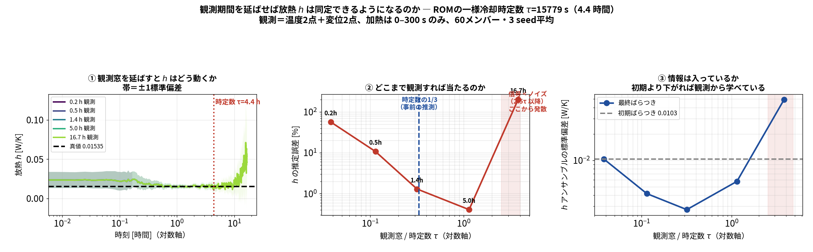

# 研究の優位性と、それを裏付ける次の検証

更新：2026-10-01。対象：104の高忠実度同化と106のROM実験。既存の数値・プログラムを確認して整理した。ここでは新しい計算結果を追加したことにはしない。

## 1. 何の問題を解く研究か

温度を数点測れたとしても、加工精度に関わる別の場所の相対熱変位を十分に推定できるとは限らない。初期温度・発熱・放熱条件が不確かなうえ、全温度場は測れない。熱流体・熱弾性解析を観測で補正したいが、全アンサンブルを実ソルバで進めると計算が重い。

そこで、OpenFOAMの温度場、FrontISTRの熱弾性応答、Pythonの同化を接続し、106では温度5状態の集中定数ROMとPOD復元により反復計算を軽くした。問いは「温度が合うか」だけでなく、**観測に使わない2点間変位差まで合うか、Qと放熱パラメータまで識別できるか**である。現在の対象は中空円柱の基礎モデルであり、工作機械の実形状・TCPの実測検証ではない。

*温度観測P2/P0、変位観測S1/S2、評価専用C/Dを区別する。C/Dの変位は更新に使わない。座標・節点番号・全条件は [未観測変位の結果](17_holdout_displacement_results.md) を参照。*

## 2. 現在の成果から主張できる強み

| 強み | 根拠 | 主張の範囲 |
|---|---|---|
| 解析から観測同化・復元まで追試できる構成 | OpenFOAM→温度写像→FrontISTR→OI/EnKF→ROM、コードと条件を公開 | 再現可能な統合実装の価値。要素技術を発明したという主張ではない |
| 観測外の相対変位を評価している | 温度2点のみ：C−D RMSE 0.792 µm、温度2＋変位2：0.158 µm、約80%低下 | 同一ROM真値の双子実験、加熱30〜300秒、60メンバー・5seed。独立CAE真値・実測での優越性は未確認 |
| 状態精度とパラメータ精度を分けて評価 | OIの温度誤差が小さくてもQが約9 Wに残る例、短時間でhがずれる例 | この共分散設計・条件での結果。OI一般の不可能性ではない |
| 観測時間と同定可能性を関連付けた | 長時間試験でhの3seed平均の誤差：600秒56.7%、5,000秒1.30% | 0〜600秒で校正した同一ROMの外挿。実物の長時間応答は未検証。平均誤差と各seedの誤差を区別する |
| 計算負荷を下げる経路を示した | 104の全実行約13時間、106の単一ROM予報0〜600秒約31 ms | 前者は一連の計算、後者は単一軌道。割り算で同化全体の高速化倍率を出さない |

*同化なし、温度2点、温度2＋変位2を比較。真値も同じROMとFrontISTR由来写像。差の誤差は個別変位誤差の相殺でも小さくなるため、C、D、C−Dを併記する。条件とRMSEの式は [結果の原資料](17_holdout_displacement_results.md)。*

**発表での主張案：**「オープンソースの熱流体・熱弾性解析を少数の温度・変位観測で補正する実装を構築した。ROM双子実験では、変位観測の追加によって、観測しない2点間変位差の誤差が低下した。一方、状態が合っても未知パラメータが合うとは限らず、観測位置・種類・時間を推定対象に合わせて検証する必要がある。」

## 3. 先行研究と何が重なり、何が未確認か

「新規性がない」「先行研究はすべて固定h」「推定対象別の配置は初めて」は、以下の調査からは結論できない。今回の調査は関連する原論文・公開実装を絞って確認したもので、全論文を網羅したレビューではない。**原理が既知であることと、この問題での比較実証に価値がないことは別である。**

| 原典 | 確認した内容・閲覧範囲 | 本研究との関係 |
|---|---|---|
| [Teshima et al., 2024](https://doi.org/10.1016/j.cirpj.2024.10.015) | 著者公開PDFの検索で取得できた抄録。ROM・伝達行列・感度によるセンサ配置、3軸加工機の実験検証、センサ数削減。PDF本文の再取得は今回失敗 | ROMと配置の組合せ自体は先行する。先行研究には実機実証があり、本研究が実用精度で上回るとは言えない。細かな内部実装・未知量の扱いは未確認 |
| [Bünger et al., 2023 preprint](https://arxiv.org/html/2306.12736v1)／[2024掲載版](https://doi.org/10.1080/15502287.2024.2408291) | 公開本文の導入・熱モデル・事後共分散・事前共分散・結論を確認。初期温度場の不確かさと配置評価、低ランク近似 | 熱モデル＋ベイズ推定＋配置評価は既知。Q/h・変位観測・未観測相対変位の同時比較を本研究の具体的な検証課題にする |
| [CONES公式実装](https://github.com/MiguelMValero/CONES) | 公式READMEの構成とEnKF拡大状態を確認 | OpenFOAM＋EnKFの公開結合は既にある。本研究の強みは熱弾性応答・POD復元・評価条件までつなぐこと |
| [Goal-oriented optimal sensor placement, 2025 preprint](https://arxiv.org/abs/2507.02500)／[2026論文本文](https://cames.ippt.gov.pl/index.php/cames/article/download/1887/933/5439) | プレプリント抄録と掲載本文の公開抜粋。予測量の不確かさを減らすC最適設計 | 「推定対象に応じて配置を設計する」一般理論は既知。本研究では熱変形の用途、異種観測、実際の逐次推定性能を検証する |
| [A-optimal heat-source inversion, 2025](https://arxiv.org/abs/2509.19679) | 原プレプリント抄録。熱源逆推定とFEM・配置最適化 | Qに関係する熱源推定の配置自体も先行する。Q/h同時識別とholdout変位のトレードオフを区別する |
| [Sensor placement in continuous stochastic filtering, 2025](https://arxiv.org/abs/2508.12288) | 原プレプリント抄録。将来の観測情報を使うフィルタリングの実験計画 | 単回の分散減少だけでなく時間発展を含む配置評価が必要、という今後の課題に関連 |

## 4. 説明を訂正する重要点

### 4-1. Δは単回更新の分散減少であり、最終RMSEではない

ノイズ前の観測予報を $y=v^{\mathsf T}x$、対象を $X=c^{\mathsf T}x$、観測ノイズ分散を $r$ とする。線形ガウス仮定では

$$
\Delta(X,y)=\frac{(c^{\mathsf T}Bv)^2}{v^{\mathsf T}Bv+r}.
$$

これはその時刻の事前共分散 $B$ で評価した対象の分散減少である。`run/verify_delta_predicts_da.py` の結果は1回目の分散減少との相関0.987だが、逐次同化後のMAEとは順位が一致しない。したがって **Δ最大＝20回更新後の誤差最小とは言わない**。相互情報量との順位一致も、同一のスカラー対象・同一事前分布・ガウス仮定の範囲である。

`run/target_dependent_sensor_check.py` は同化比較ではなく、4000本の事前サンプルを150秒まで前進させたΔ評価である。P2が反り、P3が伸びの最大候補になったが、**逐次EnKFの最適配置が証明された結果ではない**。同スクリプトの「全温度場」は実際には5点温度の平均というスカラーであり、全20,696セルのRMSEとは異なる。P1とP3の伸びの分散減少は96.832%と96.836%でほぼ同率である。

*既存 `results/delta_vs_da.json` を `run/make_research_review_fig.py` で再描画。新規の同化計算ではない。凡例は図の上部。*

### 4-2. 短時間のh誤差を「原理的に同定不能」と解釈しない

106の $h$ は放熱コンダクタンス [W/K]。表面熱伝達率 [W/(m² K)] と区別する。40%のh変化による温度変化0.049 Kがノイズ0.30 Kより小さいことは、1回の観測では識別が難しい根拠になる。しかし独立な多数観測には情報が蓄積し得る。

*`run/h_long_horizon_check.py`、60メンバー、3seed（20260913〜15）、温度2点＋Uz(A/O)2点、30秒間隔、σT=0.30 K、σu=0.30 µm、偏差膨張1.02。温度2点はA−Oの5点温度への感度の絶対値上位2点。加熱0〜300秒、以降冷却。0〜600秒学習ROMを最長60,000秒へ外挿した双子実験。*

5,000秒での「1.30%」は3seed平均推定値の真値からの誤差である。各seed誤差の平均でも、各アンサンブル幅の小ささでもない。同時刻の平均アンサンブル標準偏差は0.00274 W/K、真値の約18%である。18,000秒ではh平均誤差0.41%でもQ=18.78 W。**Q/hが同時に正確に同定されたとは言えない。**

60000秒で悪化する理由として一定膨張やクリッピングが候補になるが、原因を分離した試験はない。「信号＜ノイズだから情報がゼロ」「0.3〜1.1τが普遍的に最適」と断定しない。τ=ΣC/(5h)は一様温度の総熱容量近似で、熱容量が異なる5点の厳密な固有時定数は $C^{-1}(L-hI)$ の固有値から評価する。

### 4-3. CHTは境界条件の不確かさをなくす方法ではない

CHTでは固体壁に一定の表面hを直接指定せず、流体側を解いて熱流束を得られる。ただし流体境界、物性、自然対流モデル、メッシュ等の仮定が残る。診断したhの時間変化は、この計算条件の結果でありCHTの新規性・真値の実測保証ではない。

## 5. 推定対象と観測設計の対応表

| 推定したい物理量 | 観測候補を選ぶ指標 | 最終的に比較する量 | 現在の位置づけ |
|---|---|---|---|
| 全温度場 | POD/Q-DEIM、復元条件数、全場事後分散 | 全セルRMSE（体積重みも併記） | 復元能力と同化精度を別々に評価。Q-DEIMは同化精度を保証しない |
| Q | 時間履歴の ∂y/∂Q と観測ノイズ | Qのbias、RMSE、区間被覆率 | 加熱期情報が有効な条件を確認 |
| h_rom | ∂y/∂h_rom、冷却時間、励起 | hのbias、RMSE、区間被覆率 | 600秒で難しく、長時間ROM試験で平均値が改善 |
| Q/h同時 | 尺度・ノイズ規格化した感度、Fisher最小固有値 | Q/h両誤差・相関・初期値依存 | 累積情報で配置選択しEnKFで裏付ける比較が必要 |
| 未観測2点間変位差 | Wの2行の差、対象の事後分散 | holdout差の過渡RMSE、最大誤差、各点誤差 | 温度＋変位の追加効果をROM双子実験で確認 |
| 実機TCP相対変位 | 工具と工作物基準の相対応答、設置制約 | 独立計測でのTCP誤差 | 将来計画。円柱の結果を実機性能と呼ばない |

## 6. 優位性を出すための検証：優先順位

**第一優先は、同じROMが真値である条件から一歩進めること。** 15 W学習条件とは異なる発熱量・加熱履歴・外気条件のOpenFOAM＋FrontISTR結果を真値にし、POD基底・ROM定数・配置は学習データだけで固定する。評価真値を見て最良配置を選ぶことを避ける。高忠実度hをROMのhの真値と直接同一視せず、Qと温度・変位をまず独立評価する。

**第二優先は、固定センサ予算で配置を比較すること。** 例えば温度2点＋変位2点に揃え、代表点に制限した配置、単純感度配置、累積Fisher／対象分散配置、等間隔／ランダムを比較する。ROM代表点を固定し、物理的に測定可能な候補から観測点だけを変える。同じ真値・観測時刻・ノイズ・初期分布・seed群を使い、平均とばらつき、対応のある誤差差を報告する。温度だけ／温度＋変位の比較はセンサ数が違うため、追加効果と配置効果を別に述べる。

**第三優先は、hの不良を切り分けること。** 観測期間・加熱再投入・初期温度・初期Q/h分布・膨張係数を一つずつ変える。h平均の誤差だけでなく、seed別誤差、Q/h相関、アンサンブル幅、信用区間の被覆率を示す。hの真値が既知の同一ROM試験と、境界条件が異なる高忠実度試験を分ける。

累積情報の候補式は、独立な観測ノイズと固定した基準パラメータに対する局所線形化のもとで

$$
\widetilde G_k=R_k^{-1/2}G_k S_\theta,\qquad
F(\mathcal S)=\sum_{k\in\mathcal K}\widetilde G_{k,\mathcal S}^{\mathsf T}\widetilde G_{k,\mathcal S}.
$$

$G_k=\partial y_k/\partial(Q,h)$、$R_k$ は観測ノイズ共分散、$S_\theta=\operatorname{diag}(s_Q,s_h)$ は比較前に固定するパラメータ尺度、$\mathcal S$ はセンサ集合、$\mathcal K$ は観測時刻集合。初期温度等も未知なら、それらの感度列を加えて周辺化した情報を評価する。Fisherだけではモデル誤差やEnKFの有限標本誤差は保証できないため、選定後の独立試験を必須とする。

最後に速度の比較を整える。前処理（CHT、POD、FrontISTRモード応答、校正）とオンライン（Nメンバーの予報・観測演算・更新・復元）を分け、同じマシンと対象時間・更新回数で計時する。**単一予報31 msではなく、観測1回に必要な全処理時間が実時間の締切を満たすか**を示すと、実用上の優位性になる。

## 7. 学会ごとの主張

| 発表先 | 現段階の主張 | さらに価値を出す検証 |
|---|---|---|
| OpenCAE | 公開ソルバとPythonで熱変形の観測同化・ROM復元を接続、条件・失敗例まで追試可能 | クリーン環境から再実行、前処理とオンラインの計時 |
| 計算工学 | 直接感度ODEと有限差分の一致、Q/hの時間感度の差 | 感度ベース配置と同時推定精度の共通条件比較 |
| 計算力学 | 推定対象の違いが配置評価にどう効くかを問う | 独立高忠実度真値で、温度・Q/h・holdout変位の性能トレードオフを示す |
| 精密工学等 | 将来の工作機械熱変位観測設計への展開 | 実形状、実測、設置可能性、TCP最大誤差・費用対効果 |

新しい理論の発明を主張しなくても、**独立条件でどの配置がどの推定量を改善し、どこで失敗するかを、再現可能な数値と図で示すこと**が研究の貢献になる。現時点で先行研究全体に対する性能優越性は証明していない。
