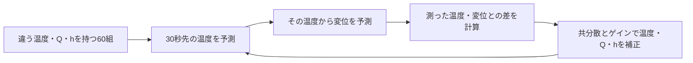
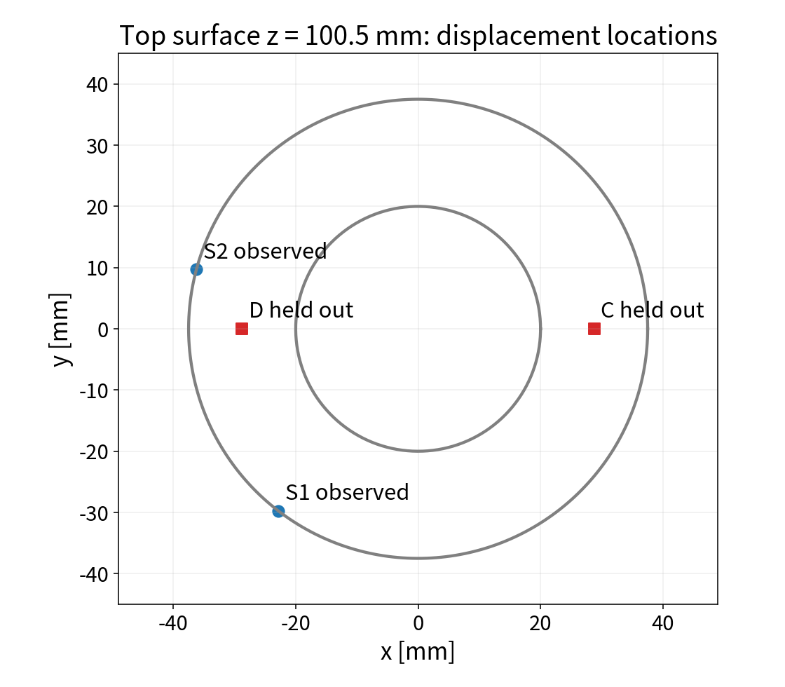

# 今回の106で実際に行った手順：変位を観測して、温度と発熱量を更新する

ここでは一般論ではなく、**「温度P2/P0＋高W変位S1/S2」で同化し、観測に使わないC/Dの変位を評価した計算**を説明します。
実行プログラムは [`run/run_holdout_displacement_support.py`](../run/run_holdout_displacement_support.py)、条件の保存先は [`results/holdout_support_conditions.json`](../results/holdout_support_conditions.json) です。他の記事にある「温度1点＋変位A/O」等とは別の条件です。

**行ったことを一文でいうと、発熱量などが違う60ケースを進め、各ケースの予測変位と測定変位との差を使って、そのケースの温度・発熱量・放熱を補正しました。** 変位から温度やQを直接割り算して求めたわけではありません。

まず、式を読む前にこの順番を押さえてください。



例えば「このケースの予測変位が測定値と違った」と分かったとき、**温度だけを変えるのか、発熱量も変えるのか、その変え幅を60組の共分散から決める**のが今回の手続きです。30秒ごとに繰り返し、観測に近づくよう各ケースを補正します。

## 1. 今回、何を測り、何を求めたか



| 区別 | 今回の設定 |
|---|---|
| ROMの温度状態 | Q-DEIMで選んだ代表5点P0〜P4。全20,696セルの温度は後でPODから復元する |
| 温度観測 | P2とP0の2点 |
| 変位観測 | 上面のS1（節点4960）、S2（節点4915）の鉛直変位Uz、単位µm |
| 同化で更新する未知数 | 温度5個、発熱倍率1個、放熱コンダクタンス1個、合計7個 |
| 評価する変位 | 観測しないC（節点4803）、D（節点4923）のUzとC−D差 |
| アンサンブル | 60メンバー＝60組の温度・発熱倍率・放熱条件 |
| 時間 | 加熱0〜300秒、冷却300〜600秒。30秒ごと20回更新、予報積分はRK4・2秒刻み |
| 反復試験 | seed=20260913〜20260917の5回 |

S1/S2は105のFrontISTR感度計算の `kinvh_sensitivity.npz` に保存された高W候補を読み込んで使いました。今回のスクリプトでQ-DEIMから変位点を選び直したわけではありません。上面の座標はS1=(-22.829,-29.751,100.5) mm、S2=(-36.222,9.706,100.5) mmです。

温度観測P2はセル中心(36.487,6.896,50.781) mm、P0は(21.304,-1.625,51.563) mmです。上図は上面z=100.5 mmの変位点だけを示しており、高さの違う温度点は描いていません。

この計算の「測定値」は実測ではなく、**同じROMで作った真値にノイズを加えた合成観測**です。真値の発熱量は15 W、放熱コンダクタンスは0.01535104094 W/Kです。

## 2. 最初に60組の違う仮説を用意した

メンバー番号を $m=1,\ldots,60$ とし、各メンバーが持つ未知数を

$$
z^{(m)}=
\begin{bmatrix}
T_0^{(m)}\\T_1^{(m)}\\T_2^{(m)}\\T_3^{(m)}\\T_4^{(m)}\\q^{(m)}\\h^{(m)}
\end{bmatrix}
\quad(7\times1)
$$

としました。$T_i$ は代表点Piの温度 [K]、$q$ はコードの `q_scale` で無次元、$h$ はROMの放熱コンダクタンス [W/K]です。**実コードが保存するのはQ [W]そのものではなく、倍率qです。** 加熱中の発熱量は

$$Q^{(m)}=15\,q^{(m)}\quad[\mathrm W]$$

で換算します。表面熱伝達率 [W/(m² K)] はこの状態に含めていません。

初期温度は290.15〜305.15 Kの一様乱数、qは0.3〜1.8の一様乱数としました。したがって、初期Qの範囲は4.5〜27 Wです。hは平均0.02、標準偏差0.01 W/Kの正規乱数を作り、0.001〜0.1 W/Kへクリップしました。

```python
Z = np.zeros((60, 7))
Z[:, :5] = initial.uniform(293.15-3, 293.15+12, (60, 5))
Z[:, 5] = initial.uniform(0.3, 1.8, 60)       # q_scale。Q [W]ではない
Z[:, 6] = np.clip(initial.normal(0.02, 0.01, 60), 0.001, 0.1)
```

これは「どの温度・Q・hが正しいかまだ分からない」ことを、60組の候補で表した初期分布です。

## 3. 各メンバーのQ・hで、次の30秒まで温度を予測した

例えば最初の更新なら0秒から30秒まで、次なら30秒から60秒まで進めました。Piの温度は

$$
C_i\frac{dT_i^{(m)}}{dt}
=\sum_{j\ne i}K_{ij}(T_j^{(m)}-T_i^{(m)})
-h^{(m)}(T_i^{(m)}-293.15)
+\delta_{i2}\,15q^{(m)}\chi(t).
$$

$C_i$ は校正済み熱容量 [J/K]、$K_{ij}$ は校正済み代表点間コンダクタンス [W/K]です。今回のヒータ投入先はP2なので、$\delta_{i2}$ はi=2なら1、それ以外なら0です。$\chi(t)$ はt<300秒で1、それ以降で0です。

**60メンバーでCとKは共通ですが、温度・q・hが違うため、予測温度も違います。** この30秒の予報中はqとhを固定し、温度だけを積分します。300秒以降もqを未知パラメータとして保持しますが、ヒータ入力は0になります。

実装は [`dacore/rom_general.py`](../dacore/rom_general.py) の `integrate_ensemble()` です。106のこの試験では、同化ループ内でOpenFOAMを動かしていません。

## 4. 60組の予報温度を、60組の予報変位に変換した

この試験では、温度から変位への写像をFrontISTRで事前計算しています。対象はS1/S2/C/Dの4点です。

1. 全セルの平均温度場をFrontISTRへ渡し、4点の基準変位 $u_0$ を求める。
2. 5本のPOD温度モードについて、それぞれの熱弾性変位応答を求める。
3. 4点×5モードの応答行列 $D$ として保存する。

未作成時は平均場1回＋モード5回、計6回のFrontISTR計算です。既存キャッシュがあれば読み込むだけです。CFDセルからFEM節点への温度写像には、この試験の実装では**最近傍セル**を使っています。

各メンバーの5点予報温度を $T_5^{f,(m)}$ とすると、PODのモード係数は

$$
a^{f,(m)}=A_P\bigl(T_5^{f,(m)}-\bar T_P\bigr),\qquad
A_P=(P\Phi)^+\quad(5\times5).
$$

$\Phi$ は全セル×5モードのPOD基底、Pは代表5セルの取り出し行列、$\bar T_P$ はその5セルの時間平均温度、上付き+は擬似逆行列です。ここでは平均温度場・POD基底・写像を固定します。

4点の変位は

$$
\begin{bmatrix}
u_{S1}^{f,(m)}\\u_{S2}^{f,(m)}\\u_C^{f,(m)}\\u_D^{f,(m)}
\end{bmatrix}
=u_0+D\,a^{f,(m)},\qquad D\in\mathbb R^{4\times5}.
$$

```python
def displacement(T):
    return u0 + ((T - mean[cells]) @ pinv.T) @ D.T
```

**同化ループでは、この行列積から変位を求めました。毎メンバー・毎時刻にFrontISTRを再実行したわけではありません。** 実装は `run/run_disp_selection.py` の `build_disp_op()` と、今回のスクリプト内の `displacement()` です。

## 5. 予測値と測定値を、同じ4成分に並べた

観測ベクトルの順番は、温度P2、温度P0、変位S1、変位S2です。

$$
y_k=
\begin{bmatrix}
T_{P2,\mathrm{obs}}\\T_{P0,\mathrm{obs}}\\u_{S1,\mathrm{obs}}\\u_{S2,\mathrm{obs}}
\end{bmatrix},\qquad
y_f^{(m)}=
\begin{bmatrix}
T_2^{f,(m)}\\T_0^{f,(m)}\\u_{S1}^{f,(m)}\\u_{S2}^{f,(m)}
\end{bmatrix}.
$$

**C/Dの変位は計算しても、観測ベクトルには入れません。** 評価専用だからです。

合成観測には、真値温度へ標準偏差0.30 K、真値変位へ標準偏差0.30 µmの独立ノイズを加えました。観測誤差共分散は

$$
R=\operatorname{diag}(0.30^2,0.30^2,0.30^2,0.30^2).
$$

数値は全対角で0.09ですが、最初の2成分はK²、後の2成分はµm²です。温度と変位を同じ単位とみなしたわけではありません。

```python
yf = np.column_stack((Z[:, [2, 0]], displacement(Z[:, :5])[:, :2]))
obs = np.r_[truth[k+1, [2, 0]] + noiseT[k],
            true_u[k+1, :2] + noiseU[k]]
```

## 6. 60メンバーの「一緒に変わる関係」を計算した

ここで初めて、変位観測が温度やQにどう伝わるかを計算します。

コードでは、予報の平均を変えず、平均からの偏差を1.02倍に広げます。状態だけでなく観測予報も同様に広げます。以下の共分散は、この処理後の予報から作ります。

$$
\widetilde z^{f,(m)}=\bar z^f+1.02(z^{f,(m)}-\bar z^f),\qquad
\widetilde y_f^{(m)}=\bar y_f+1.02(y_f^{(m)}-\bar y_f).
$$

平均はメンバー方向に求めます。

$$
\bar z^f=\frac1{60}\sum_{m=1}^{60}\widetilde z^{f,(m)},\qquad
\bar y_f=\frac1{60}\sum_{m=1}^{60}\widetilde y_f^{(m)}.
$$

偏差 $\delta z^{(m)}=\widetilde z^{f,(m)}-\bar z^f$、$\delta y^{(m)}=\widetilde y_f^{(m)}-\bar y_f$ から

$$
C_{zy}=\frac1{59}\sum_{m=1}^{60}\delta z^{(m)}\delta y^{(m)\mathsf T}
\quad(7\times4),\qquad
C_{yy}=\frac1{59}\sum_{m=1}^{60}\delta y^{(m)}\delta y^{(m)\mathsf T}
\quad(4\times4)
$$

を作ります。**同じ30秒時点にある60個の値**のばらつきであり、時間方向のばらつきではありません。

例えば温度P0と変位S1の共分散は

$$
[C_{zy}]_{0,2}
=\frac1{59}\sum_{m=1}^{60}
(\widetilde T_0^{f,(m)}-\bar T_0^f)
(\widetilde u_{S1}^{f,(m)}-\bar u_{S1}^f).
$$

発熱倍率qとS1の共分散も同じ形です。

$$
[C_{zy}]_{5,2}
=\frac1{59}\sum_{m=1}^{60}
(\widetilde q^{f,(m)}-\bar q^f)
(\widetilde u_{S1}^{f,(m)}-\bar u_{S1}^f).
$$

行列の第6行（コード添字5）は

$$
[C_{zy}]_{5,:}=
\begin{bmatrix}
\operatorname{Cov}(q,T_2)&\operatorname{Cov}(q,T_0)&
\operatorname{Cov}(q,u_{S1})&\operatorname{Cov}(q,u_{S2})
\end{bmatrix}.
$$

**qを変えて予報した結果、温度・変位も変わるため、この行に「発熱倍率と観測が連動する関係」が入ります。** 初期分布で相関を直接与えるのではなく、予報計算を通して関係が形成されます。ただし有限メンバーの偶然の相関も含むため、必ず正しく同定できるわけではありません。

## 7. 変位の残差を使って、温度・q・hを一緒に更新した

まず、共分散から「残差を各未知数へどれだけ配るか」を表すカルマンゲインを求めます。

$$K=C_{zy}(C_{yy}+R)^{-1}\quad(7\times4).$$

各メンバーには、共分散Rの独立な観測摂動 $\epsilon^{(m)}$ を加えます。これは合成観測を作ったノイズとは別です。残差を

$$
d^{(m)}=y_k+\epsilon^{(m)}-\widetilde y_f^{(m)}
=\begin{bmatrix}d_{T2}^{(m)}\\d_{T0}^{(m)}\\d_{S1}^{(m)}\\d_{S2}^{(m)}\end{bmatrix}
$$

とすると、更新は

$$z^{a,(m)}=\widetilde z^{f,(m)}+K\,d^{(m)}.$$

**温度P0の更新を1行だけ取り出すと**

$$
T_0^{a,(m)}=\widetilde T_0^{f,(m)}
+K_{0,0}d_{T2}^{(m)}+K_{0,1}d_{T0}^{(m)}
+K_{0,2}d_{S1}^{(m)}+K_{0,3}d_{S2}^{(m)}.
$$

最後の2項が、**変位観測による温度の補正**です。温度P1/P3/P4も、それぞれのゲイン行を使って同じように更新します。

**発熱倍率qの更新を取り出すと**

$$
q^{a,(m)}=\widetilde q^{f,(m)}
+K_{5,0}d_{T2}^{(m)}+K_{5,1}d_{T0}^{(m)}
+K_{5,2}d_{S1}^{(m)}+K_{5,3}d_{S2}^{(m)}.
$$

したがって発熱量の更新は、クリップ前では

$$
Q^{a,(m)}=\widetilde Q^{f,(m)}
+15\left(K_{5,0}d_{T2}^{(m)}+K_{5,1}d_{T0}^{(m)}
+K_{5,2}d_{S1}^{(m)}+K_{5,3}d_{S2}^{(m)}\right).
$$

最後の2項が、**変位観測による発熱量の補正**です。これは「変位→熱量」の独立した逆算式ではなく、温度観測と変位観測を同時に使う拡大状態の更新です。

各観測成分が相関するため、ゲインは4×4の系を解いて求めます。各成分ごとに単独の分散で割って足す計算ではありません。実際のコードは [`dacore/enkf.py`](../dacore/enkf.py) の

```python
C_zy = dZ.T @ dY / (60 - 1)       # 7 × 4
C_yy = dY.T @ dY / (60 - 1)       # 4 × 4
gain_T = np.linalg.solve(C_yy + R, C_zy.T)
Za = Zf + innov @ gain_T          # 60メンバーの7未知数を更新
```

です。逆行列を直接作らず、連立方程式を解いています。更新後にはqを0〜3（Qなら0〜45 W）、hを0.0001〜0.2 W/Kへクリップします。

符号の理解には注意が必要です。単一観測で共分散が正なら「予測変位が測定より大きい→qを下げる」という補正になります。しかし今回は4成分の同時更新であり、拘束や反りによる符号も含むため、各残差の効果は実際のゲインで判断します。

### 実際の最初の更新を数値で追う（seed=20260913、30秒）

上記の条件で最初の1サイクルを、保存済みのFrontISTR応答を読み込んで再計算しました。更新後の7成分の平均が、保存履歴の同じケース・seed・時刻と絶対誤差 $10^{-10}$ 以内で一致することを確認しています。再現用は [`run/replay_holdout_first_update.py`](../run/replay_holdout_first_update.py) です。

平均Qの更新を、4つの観測成分に分けると次のようになります。有限の60メンバーでは観測摂動の平均も厳密には0でないので、表ではそれを含めます。

$$\Delta\bar Q_j=15K_{5,j}(y_j-\bar y_{f,j}+\bar\epsilon_j).$$

| 観測成分 | 観測−予報平均 | 観測摂動の平均 | qのゲイン $K_{5,j}$ | 平均Qへの寄与 [W] |
|---|---:|---:|---:|---:|
| 温度P2 [K] | −4.52081 | +0.02716 | +0.30953 | −20.864 |
| 温度P0 [K] | −4.40340 | +0.02789 | −0.14615 | +9.592 |
| 変位S1 [µm] | −5.25077 | −0.00097 | −0.24934 | **+19.642** |
| 変位S2 [µm] | −6.25647 | +0.10963 | +0.16311 | **−15.039** |

**最後の2行が、実際に変位観測からQへ入った補正です。** 寄与は互いに打ち消し合うので、1成分の寄与だけを見て発熱量が大きく変わったと解釈しません。

4成分の合計は約−6.668 Wです。したがって、クリップ前の平均Qは

$$17.08982-6.66835=10.42147\ \mathrm W.$$

その後、60メンバーのうち1メンバーのqを下限0へクリップしたため、保存された同化後の平均Qは **10.43202 W** です。ここで真値15 Wより低くなりますが、以後の更新で修正され、このseedの600秒では **14.88978 W** になっています。

この数値例が示すのは「変位観測を更新式へ実際に入れたこと」です。最初の更新で正しいQに一致することや、各観測の効果が常に同じ符号になることを示すものではありません。

## 8. 補正した状態を次の予報へ渡し、変位を計算し直した

更新後の $T_0\ldots T_4,q,h$ を、次の30秒区間の初期値・パラメータとして使います。更新後温度からモード係数とS1/S2/C/Dの変位を計算し直し、60メンバー平均を推定値として保存します。

全温度場が必要なら

$$T_{\mathrm{full}}^{a,(m)}=\bar T+\Phi a^{a,(m)}$$

で復元します。観測予報の作成では全20,696セルを毎回配列に展開せず、固定したDを通じて同じモード表現の変位を直接計算できます。

20回の更新を終えた600秒の結果を [`results/holdout_support_history.npz`](../results/holdout_support_history.npz) から読むと、温度2＋変位2のケースは次の値です。

| パラメータ | 真値 | 各seedの60メンバー平均を、さらに5seedで平均した推定値 |
|---|---:|---:|
| 加熱中の発熱量Q [W] | 15.000 | 15.050 |
| ROMの放熱h [W/K] | 0.0153510 | 0.0144387 |

Qのseed別最終値は14.890、15.042、15.260、15.077、14.982 Wです。これは**今回紹介したケース**の結果であり、別の観測構成の記事にあるQやhの数値とは区別します。600秒ではヒータOFFですが、ここで表示するQは過去の加熱中の入力パラメータです。


この試験では、温度2点のみと比べて変位2点を加えると、未観測C−Dの加熱期RMSEが0.792から0.158 µmへ低下しました。真値も同じROM・変位写像を使っており、実測や独立した高忠実度真値での保証ではありません。

## 9. 「熱量を同定した」の意味

今回、同定したパラメータは**発熱量Q [W]、つまり単位時間当たりの熱入力**です。累積熱量E [J]を直接状態に入れたわけではありません。

加熱中に一定のQが300秒作用する設定なら、加熱入力の累積量は

$$E=\int_0^{300}Q\,dt=300Q.$$

設定上の加熱入力は4500 J、上記の最終Q推定値から換算すると約4515 Jです。このEは説明のためにQから換算した値で、元の同化プログラムで独立に推定・保存した状態ではありません。これは加熱入力の積分であり、固体に残った内部エネルギーとは異なります。放熱があるため両者は等しくありません。

## 10. どのプログラムが何を担当したか

| 処理 | 実ファイル |
|---|---|
| 60メンバー初期化・合成観測・20回の予報と更新・結果保存 | `run/run_holdout_displacement_support.py` |
| qとhを使ってRK4で温度を予報 | `dacore/rom_general.py` の `integrate_ensemble()` |
| FrontISTRで平均場・5モードの4点変位応答を事前計算 | `run/run_disp_selection.py` の `build_disp_op()` |
| 偏差膨張・標本共分散・観測摂動・カルマン更新 | `dacore/enkf.py` の `enkf_update()` |
| 校正済み熱容量・伝導・放熱値 | `results/rom_calibrated_pod.npz` |
| 平均温度場・POD基底・代表セル | `results/qdeim_points.npz` |
| S1/S2/C/Dの基準変位と4×5応答D | `results/dispop_holdout_support_a4dadbb851dca4d7.npz` |
| 3観測構成×5seedの状態平均・変位履歴 | `results/holdout_support_history.npz` |

保存された履歴は主にメンバー平均であり、各時刻の全メンバー・Czy・ゲインKはこのファイルには保存されていません。そのため、本記事には未保存の実ゲインの数値を推測して載せていません。上の式とコードが、その計算を行った手順です。
