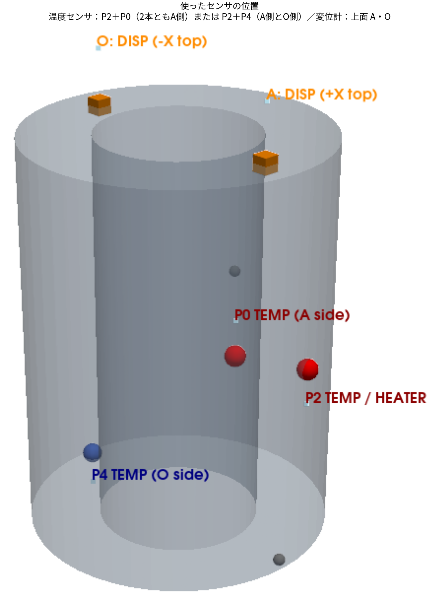
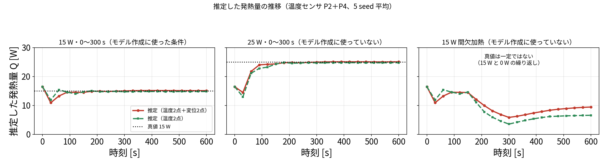
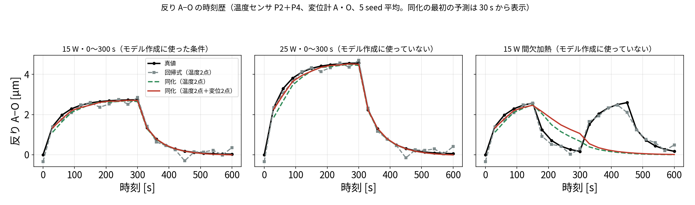
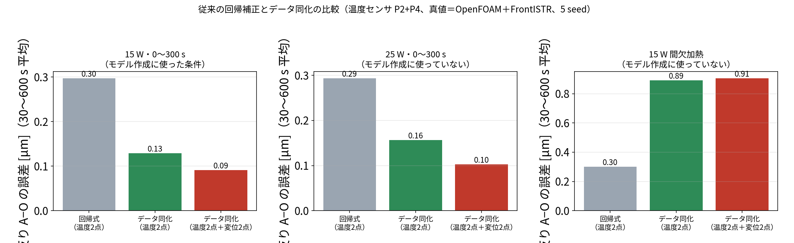
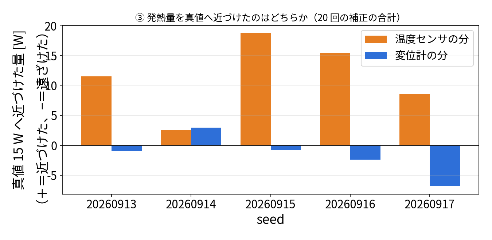

# 研究の優位性を確かめる追加検証（2026-10-02〜03）

研究の主張を強くするために、次の3つを確かめました。結果は**良かったものと、そうでなかったもの**の両方を書きます。

| # | 確かめたこと | 結果 |
|---|---|---|
| ① | 従来の回帰補正より、データ同化のほうが熱変形を正確に推定できるか | **加熱のしかたがモデルと合っていれば、同化の誤差は回帰式の約3分の1**（発熱量がモデル作成時（15 W）と違っても）。**加熱のしかたがモデルと違うと、同化の誤差は回帰式の約3倍** |
| ② | モデル作成に使っていない条件でも、実ソルバ（OpenFOAM＋FrontISTR）を真値にして同化が合うか | 発熱量 25 W：合う（発熱量も 25 W と推定）。間欠加熱：合わない |
| ③ | 変位計が発熱量の推定を主に担うか | **違った**。発熱量を真値に近づけたのは主に温度センサ |

---

## 共通の条件

- **真値**：OpenFOAM（CHT）で計算した固体の温度場そのものと、その温度場全体を FrontISTR に入れて計算した上面 A・O の上下変位 $U_z$ 。これまでの「真値も ROM」の双子実験ではありません。
- **同化のモデル**：これまでと同じ ROM（5点の熱回路）。ヒータは「0〜300 秒に一定の発熱」と仮定したまま。
- **同化**：EnKF、60 メンバー、30 秒ごと 20 回、温度ノイズ 0.3 K、変位ノイズ 0.3 µm、seed 20260913〜17 の5回平均。
- **真値の3つの条件**

| 条件 | ヒータ | ROM を作るのに使ったか |
|---|---|---|
| モデル作成に使った条件 | 15 W、0〜300 秒 | 使った（POD・ROM の校正に使ったのと同じ計算） |
| 25 W | 25 W、0〜300 秒 | 使っていない（発熱量が違う） |
| 間欠加熱 | 15 W、0〜150 秒と 300〜450 秒 | 使っていない（加熱のしかたが違い、ROM の「0〜300 秒に一定」という仮定とも合わない） |

25 W と間欠加熱の OpenFOAM 計算は、この検証のために新しく行いました（各約3時間、`openfoam/limit/`）。

*上：ヒータの発熱。下：その発熱で OpenFOAM＋FrontISTR が計算した反り A−O（真値）。*

- **15 W（左）**：ROM を作ったときと同じ条件です。反りは加熱中に 2.7 µm まで増え、ヒータを切ると 0 に戻ります。
- **25 W（中）**：発熱が大きいので反りも大きく、最大 4.6 µm です。加熱のしかた（0〜300 秒）は ROM の仮定と同じです。
- **間欠加熱（右）**：150 秒で一度ヒータを切り、300 秒でもう一度入れます。反りも2回山ができます。**ROM は「0〜300 秒に一定の発熱」と仮定しているので、150〜300 秒（実際は発熱なし）と 300〜450 秒（実際は発熱あり）で、モデルと実際が食い違います。**

*温度センサは P2（ヒータの横）を必ず使い、もう1本を P0（同じ A 側）または P4（反対の O 側）にした2通りを比べました。変位計は上面の A と O です。*

スクリプト：`run/limit_realsolver_truth.py`（②）、`run/baseline_regression_vs_da.py`（①）、`run/q_contribution_seeds.py`（③）

---

## ② モデル作成に使っていない条件で、実ソルバを真値にした同化

誤差はすべて 30〜300 秒（加熱中）の平均です。「温度場」は 20,696 セル全体の誤差、「反り」は $U_z(A)-U_z(O)$ の誤差です。

### モデル作成に使った条件（15 W）

| 観測 | 温度場 | 反り | 推定した発熱量 |
|---|---:|---:|---:|
| 同化なし | 4.58 K | 0.24 µm | 16.45 W |
| 温度2点 P2＋P0 | 0.54 K | 0.77 µm | 13.96 W |
| 温度2点 P2＋P4 | 0.16 K | 0.23 µm | 14.80 W |
| 温度 P2＋P0 ＋ 変位 A・O | 0.15 K | 0.14 µm | 14.90 W |
| 温度 P2＋P4 ＋ 変位 A・O | 0.13 K | 0.16 µm | 15.10 W |

ROM で作った真値のときとほぼ同じです。ROM を作った条件そのものなので、これは当然の結果です。

### 25 W（モデル作成に使っていない発熱量）

| 観測 | 温度場 | 反り | 推定した発熱量 |
|---|---:|---:|---:|
| 同化なし | 3.12 K | 1.38 µm | 16.45 W |
| 温度2点 P2＋P0 | 0.88 K | 1.41 µm | 23.59 W |
| 温度2点 P2＋P4 | 0.18 K | 0.28 µm | 24.76 W |
| 温度 P2＋P0 ＋ 変位 A・O | 0.15 K | 0.15 µm | **24.91 W** |
| 温度 P2＋P4 ＋ 変位 A・O | 0.14 K | 0.17 µm | **25.07 W** |

**発熱量がモデル作成時（15 W）と違っても、同化は合いました。** 発熱量も真値 25 W に対して 24.9〜25.1 W と推定できています。発熱量は状態に入れて推定しているので、モデル作成時の値（15 W）に縛られないためです。

*推定した発熱量の、時刻ごとの値（温度センサ P2＋P4、5 seed 平均）。*

- **15 W（左）と 25 W（中）**：最初は 16.5 W（60 メンバーの最初の平均）から始まり、どちらも 100〜200 秒ほどで真値（点線）に落ち着いています。25 W は ROM を作ったときの 15 W とは違う値ですが、同化で 25 W まで引き上げられています。
- **間欠加熱（右）**：150 秒までは 15 W 付近にいますが、その後は 6〜10 W あたりに下がっていきます。実際は「15 W と 0 W の繰り返し」なので、一定の値で表すこと自体ができません。ROM が一定の発熱しか表せないため、平均的な値に落ち着こうとしていると考えられます。

### 間欠加熱（モデル作成に使っていない加熱のしかた）

| 観測 | 温度場 | 反り | 推定した発熱量 |
|---|---:|---:|---:|
| 同化なし | 5.26 K | 1.31 µm | 16.45 W |
| 温度2点 P2＋P0 | 0.75 K | 0.74 µm | 0.15 W |
| 温度2点 P2＋P4 | 0.28 K | 0.52 µm | 6.59 W |
| 温度 P2＋P0 ＋ 変位 A・O | 0.29 K | 0.52 µm | 8.19 W |
| 温度 P2＋P4 ＋ 変位 A・O | 0.31 K | 0.59 µm | 9.45 W |

**合いませんでした。** 反りの誤差は 0.5〜0.6 µm で、ほかの条件の3〜4倍です。推定した発熱量（0.15〜9.45 W）にも意味がありません。

原因は、ROM が「ヒータは 0〜300 秒に一定の発熱」と仮定していることだと考えています。間欠加熱では 150〜300 秒に発熱がなく、300〜450 秒に発熱があるので、ROM の予報がそもそも外れ、同化で直しきれません。発熱量を時間で変わる値として推定するようにすれば改善する可能性がありますが、**試していません**。

---

## ① 従来の回帰補正との比較

### 比べた方法

工作機械の熱変位補正で一般的な方法は、温度センサの値から変位を出す**回帰式**です。同じ温度センサ2点を使って、次の式を作りました。

$$
U_z(A)-U_z(O)=c_0+c_1\,\Delta T_{s1}+c_2\,\Delta T_{s2}
$$

- $\Delta T$ はセンサの温度と 20 ℃ との差です。
- 係数は、モデル作成に使った条件（15 W）の OpenFOAM＋FrontISTR の結果（0〜600 秒、30 秒ごと 21 時刻）で最小二乗法により決めました。
- 使うときは、同化と同じく温度に 0.3 K のノイズを足します（同じ 5 seed）。
- P2＋P4 で求めた係数は $c_1=0.876$ 、 $c_2=-0.871$ でした。反りが「P2 と P4 の温度差」にほぼ比例する、という式になっています。

### 結果（反り A−O の誤差、30〜600 秒の平均、温度センサ P2＋P4）

まず時刻ごとの値を見ます。

*黒＝真値、灰＝回帰式、緑＝同化（温度2点）、赤＝同化（温度2点＋変位2点）。温度センサは P2＋P4、5 seed 平均。*

- **15 W（左）と 25 W（中）**：赤の同化は、黒の真値にほぼ重なっています。灰の回帰式も形は合っていますが、温度センサのノイズ（0.3 K）がそのまま出て、450 秒付近などで 0.3〜0.5 µm ほどぶれています。同化は 60 メンバーの予測とあわせて判断するので、ノイズに引きずられにくくなっています。
- **間欠加熱（右）**：150 秒でヒータが切れて真値（黒）は下がりますが、同化（緑・赤）はゆっくりしか下がりません。300 秒でヒータが再び入って真値は 2.6 µm まで上がりますが、同化は**この2回目の山をまったく再現できていません**。ROM の中では 300 秒以降は発熱 0 なので、温度センサや変位計で「温度が上がっている」と見えても、予報が毎回それを打ち消してしまうと考えられます。
- 一方、回帰式（灰）は、そのときの温度だけから反りを計算するので、加熱のしかたに関係なく2回目の山も追えています。

これを 30〜600 秒で平均した誤差が、次の図と表です。

| 真値の条件 | 回帰式（温度2点） | 同化（温度2点） | 同化（温度2点＋変位2点） |
|---|---:|---:|---:|
| モデル作成に使った条件 15 W | 0.30 µm | 0.13 µm | **0.09 µm** |
| 25 W（モデル作成に使っていない） | 0.29 µm | 0.16 µm | **0.10 µm** |
| 間欠加熱（モデル作成に使っていない） | **0.30 µm** | 0.89 µm | 0.91 µm |

温度センサ P2＋P0 の場合：

| 真値の条件 | 回帰式 | 同化（温度2点） | 同化（温度2点＋変位2点） |
|---|---:|---:|---:|
| モデル作成に使った条件 15 W | 1.29 µm | 0.41 µm | **0.08 µm** |
| 25 W | 1.31 µm | 0.74 µm | **0.09 µm** |
| 間欠加熱 | 1.36 µm | 1.14 µm | **0.88 µm** |

### 分かったこと

1. **加熱のしかたがモデルと合っていれば、同化の誤差は回帰式より小さくなります。** 発熱量がモデル作成時と違う 25 W でも、温度2点＋変位2点の同化は 0.10 µm で、回帰式（0.29 µm）の約3分の1でした。
2. **加熱のしかたがモデルと違うと、同化の誤差は回帰式より大きくなります。** 間欠加熱では、回帰式 0.30 µm に対し、同化は 0.89〜0.91 µm で、約3倍でした。2回目の加熱を同化が再現できなかったためです（上の時刻歴の右）。
3. **回帰式（P2＋P4）は、条件が変わってもほぼ 0.3 µm で安定していました。** この形状では反りが「ヒータ側と反対側の温度差」にほぼ比例するので、2点の温度差を使う回帰式は条件に左右されにくいためと考えています。
4. P2＋P0（2本とも A 側）では、回帰式の係数が大きく（+3.9 と −3.7）、温度のノイズ 0.3 K を増幅してしまい、どの条件でも 1.3 µm 前後と悪い結果でした。

---

## ③ 変位計が発熱量の推定を主に担うか

モデル作成に使った条件（ROM の真値、温度 P2＋P0 ＋ 変位 A・O）で、各回の発熱量の補正を「温度センサの分」と「変位計の分」に分け、**真値 15 W に近づける向きを＋**として 20 回分を足しました（5 seed）。

*橙＝温度センサの分、青＝変位計の分。＋は真値 15 W に近づけた量、−は遠ざけた量（20 回の補正の合計）。*

5 seed のうち4つで、橙（温度センサ）が大きな＋、青（変位計）が−になっています。変位計が＋になったのは seed 20260914 だけでした。

| seed | 温度センサの分 | 変位計の分 | 最終の発熱量 |
|---|---:|---:|---:|
| 20260913 | +11.56 W | −0.95 W | 14.36 W |
| 20260914 | +2.60 W | +3.00 W | 15.47 W |
| 20260915 | +18.81 W | −0.71 W | 15.20 W |
| 20260916 | +15.45 W | −2.37 W | 14.50 W |
| 20260917 | +8.57 W | −6.84 W | 14.94 W |
| **平均** | **+11.40 W** | **−1.57 W** | **14.89 W** |

- **発熱量を真値に近づけたのは主に温度センサでした。** 変位計の直接の補正は、平均すると真値から遠ざける向きでした。
- それでも、変位計を入れたほうが最終の発熱量は良くなります（温度2点だけ 14.05 W → 変位計を足して 14.89 W）。変位計は発熱量を直接動かすより、温度を直すことを通して効いていると考えられますが、確かめていません。
- 「変位計が発熱量の推定の主役」という主張はできません。blog_006 §14 の同じ趣旨の記述は訂正しました。

---

## まとめ：発表で言えること・言えないこと

| 言えること | 根拠 |
|---|---|
| 発熱量がモデル作成時と違う条件でも、実ソルバを真値にして、同化で温度・反り・発熱量を推定できた | ② 25 W：温度場 0.14〜0.18 K、反り 0.15〜0.28 µm、発熱量 24.9〜25.1 W |
| 加熱のしかたがモデルと合っていれば、反りの誤差が従来の回帰補正の約3分の1になった | ① 25 W：同化 0.10 µm、回帰式 0.29 µm |
| 変位計を足すと、温度センサの置き方が悪くても反りが当たる | ① P2＋P0：温度だけ 0.74 µm → 変位を足して 0.09 µm（25 W） |

| 言えないこと | 理由 |
|---|---|
| どんな運転条件でも同化のほうが誤差が小さい | ① 間欠加熱では、同化の誤差（0.9 µm）が回帰式（0.3 µm）の約3倍だった |
| 変位計が発熱量の推定の主役 | ③ 主に温度センサが担っていた |
| 実機で同じ結果になる | 真値は実ソルバの計算で、実測ではない |

**今後の課題**：加熱のしかたが分からない場合に対応するため、発熱量を時間で変わる値として推定すること（未実施）。
