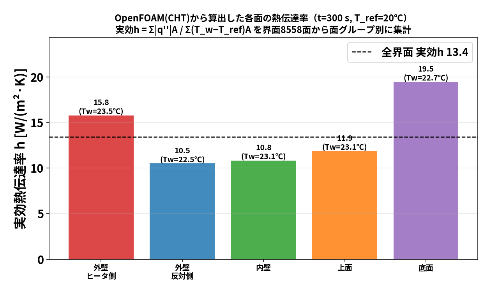

# blog_001：OpenFOAM＋FrontISTR で「熱流体固体連成 → 熱膨張」をやってみる ― さらに熱伝達率の分布まで出す

このブログシリーズは、106 でやった一連の研究（熱流体固体連成・データ同化・ROM）を、
**手を動かしながら少しずつ理解していく**ためのものです。第1回は土台となる

1. **OpenFOAM で熱流体固体連成（CHT）を解いて温度場を出す**
2. **その温度場を FrontISTR に渡して熱膨張（変位）を出す**
3. **CHT の結果から熱伝達率 $h$ の分布・各面の値を算出する**

の3本立てです。数式は最小限にして、まず「何をしているか」の絵をつかむことを優先します。

> **この記事の位置づけ（重要）― これは「同化」ではなく「正解値づくり」**
>
> ここで OpenFOAM＋FrontISTR で計算する温度・変形は、このあとのデータ同化で使う
> **「正解値（真値）」** です。本研究のデータ同化は **双子実験（OSSE）** で、
> 手順はこうです：
>
> 1. **本記事の高忠実計算で"正解値"を作る**（＝この blog_001）。
> 2. その正解値に **ノイズを載せた少数の観測**（温度・変位を数点）だけを取り出す。
> 3. **でたらめな初期状態から、その少数観測だけで正解値をどこまで復元できるか**を同化で試す。
>
> つまり本記事は **アンサンブルカルマンフィルタ（EnKF）そのものではありません**。
> EnKF が目指す「答え合わせ用の真値」を作る土台です。
> **OI は blog_002、EnKF は blog_003 で、それぞれ単体で詳しく**説明します。

---

## 0. 題材：片側だけ温められる中空円筒

<!-- 図があれば: docs/img に円筒＋ヒータの図 -->

- **形**：中空の円筒（パイプ）。内径 20 mm、外径 37.5 mm、高さ 100.5 mm。材料は一般構造用鋼材相当。
- **温め方**：円筒の側面の **片側（+X 側）だけ** をヒータで温める（発熱 15 W）。
- **時間**：0〜300 秒は加熱、300〜600 秒はヒータを切って冷却。
- **狙い**：片側だけ温めると円筒は **バナナのように反る**。この「熱変形」を計算で出したい。

材料定数（鋼材）:

| 物性 | 値 |
|---|---|
| ヤング率 $E$ | 205 GPa（ $2.05\times10^{11}$ Pa） |
| ポアソン比 $\nu$ | 0.3 |
| 密度 $\rho$ | 7850 kg/m³ |
| 線膨張係数 $\alpha$ | $1.2\times10^{-5}$ /K |
| 基準温度 $T_\mathrm{ref}$ | 293.15 K（20 ℃、ここで熱ひずみゼロ） |

---

## 1. STEP 1：OpenFOAM で熱流体固体連成（CHT）

### 1-1. 「共役熱伝達（CHT）」ってなに？

熱の伝わり方は3つ（伝導・対流・輻射）ありますが、ここで効くのは **固体の中の伝導** と
**固体まわりの空気の対流** です。ふつうの伝熱解析は「固体の表面に熱伝達率 $h$ を与えて」空気を省略します。
でも $h$ は本当は場所ごとに違い、事前には分かりません。

そこで **共役熱伝達（Conjugate Heat Transfer, CHT）** では

> **固体と流体（空気）を"一体で"解く**

ことをします。固体の中は熱伝導、空気の中は流れ＋伝導を解き、**境界（固体表面）で温度と熱流束を連続**に
つなぐ。こうすると $h$ を仮定しなくても、空気の対流が自動的に固体を冷やしてくれます。

OpenFOAM でこれを解くソルバが **`chtMultiRegionFoam`** です（multi-region＝複数領域を同時に解く）。

### 1-2. 2つの領域（region）を用意する

CHT では計算領域を2つに分けます。

```
constant/
  ├─ solid/   ← 円筒（鋼材）。熱伝導だけ
  └─ fluid/   ← まわりの空気。流れ＋熱
```

- **solid（円筒）**：物性は鋼材。片側側面にヒータ（発熱）を与える。
- **fluid（空気）**：円筒を包む空気。外側は 20 ℃ の壁（周囲温度）。

境界条件のキモは、**固体と空気が接する面**です。ここに
`compressible::turbulentTemperatureCoupledBaffleMixed` のような
**"連成境界条件"** を置くと、両側の温度・熱流束を自動でつないでくれます。
（＝ここで $h$ を人間が与えない、というのがCHTの利点）

### 1-3. 回すと何が出るか

`chtMultiRegionFoam` を回すと、各時刻ディレクトリ（`60/`, `120/`, …）に

- `solid/T`：**円筒の温度場**（全セルの温度）
- `fluid/T`, `fluid/U`：空気の温度・流れ

が出ます。**この `solid/T`（固体の温度場）が次の STEP で主役**になります。
片側加熱なので、ヒータ側（+X）が熱く、反対側（−X）がぬるい、という左右非対称の温度分布になります。


*実ソルバ（`chtMultiRegionFoam`）で計算した温度の時間変化。0〜300秒の加熱でヒータ側（hot）がぐんぐん上がり、
反対側（cold）はゆるやかに上がる。300秒でヒータOFFにすると冷却へ。左右で温度が違うのがポイント。*

---

## 2. STEP 2：温度場を FrontISTR へ渡して熱膨張を出す

### 2-1. なぜソルバを2つ使うのか

OpenFOAM は流体・伝熱は得意ですが、**構造（変形・応力）は解きません**。
一方 **FrontISTR** はオープンソースの有限要素法（FEM）構造解析ソルバで、熱膨張が得意です。
そこで **「温度は OpenFOAM、変形は FrontISTR」** と役割分担します（弱連成＝一方向に温度を渡すだけ）。

```
OpenFOAM(CHT) ──温度場 T(x)──▶ FrontISTR(熱弾性) ──▶ 変位 u(x)
```

### 2-2. 熱膨張のしくみ（小学校の理科＋α）

金属は温めると伸びます。伸び具合は **線膨張係数 $\alpha$** で決まり、温度が基準から
$\Delta T = T - T_\mathrm{ref}$ だけ上がると、各方向に

$$\varepsilon_\mathrm{thermal}=\alpha\,\Delta T$$

だけ伸びようとします（ $\varepsilon$ はひずみ＝伸び率）。片側だけ熱いと、熱い側だけ伸びるので
円筒が反ります。FrontISTR は各要素のこの「伸びたい量」を集め、**要素どうしがつながっている拘束**の
もとで、全体のつり合う変形（変位 $u$ ）を線形弾性で解きます。

### 2-3. FrontISTR に渡すもの・返るもの

- **渡す**：FEM 節点ごとの温度（OpenFOAM の `solid/T` を最寄り節点へ内挿）＋材料定数（ $E,\nu,\alpha$ ）＋基準温度 $T_\mathrm{ref}$ ＋境界拘束（底面固定）。
- **返る**：各節点の変位 $u=(u_x,u_y,u_z)$ 。

底面を固定し上面を自由にしているので、**上面がいちばん動きます**。ヒータ側の上面（A）と
反対側の上面（O）で上向き変位 $U_z$ を比べると、片側加熱の「反り」が数値で見えます。
この 2 点の差 $U_z(\mathrm A)-U_z(\mathrm O)$ が、後のブログで「注目量（QoI）」として何度も出てきます。


*FrontISTR で計算した熱変形。片側だけ熱いと上面がヒータ側へ「反り」、ヒータ側A と反対側O の
上向き変位 $U_z$ に差が出る。温度が上がるほど反りが大きくなり、冷却で戻る。*

### 2-4. ここまでの一連の流れ

```
[各時刻]  OpenFOAM: solid/T を計算
   │
   ├─ FEM節点温度へ内挿
   ▼
 FrontISTR: 熱ひずみ ε=αΔT → つり合い → 変位 u
   ▼
 上面A/Oの Uz、2点差 = 反りの大きさ
```

これで **「温度→変形」の物理**が一通りつながりました。

---

## 3. STEP 3：熱伝達率 $h$ の分布と各面の値を算出する

CHT の利点は「 $h$ を仮定しない」ことでしたが、**逆に結果から $h$ を"逆算"して分布を見る**ことができます。
「どの面がどれだけ冷えているか」を1つの数字（ $h$ ）で見える化するわけです。

### 3-1. 熱伝達率の定義

ある壁面から空気へ逃げる熱流束（単位面積あたりの熱の流れ） $q^{\prime\prime}$ [W/m²] は、
壁の温度 $T_w$ と周囲（基準）温度 $T_\mathrm{ref}$ の差に比例するとみなせて、その比例係数が熱伝達率 $h$ です。

$$q^{\prime\prime}=h\,(T_w-T_\mathrm{ref})\quad\Longrightarrow\quad h=\frac{q^{\prime\prime}}{\,T_w-T_\mathrm{ref}\,}\ \ [\mathrm{W/(m^2\,K)}].$$

- $q^{\prime\prime}$ が大きい（よく熱が逃げる）ほど $h$ は大きい。
- 温度差 $T_w-T_\mathrm{ref}$ が小さいのに熱が逃げていれば $h$ は大きい。

### 3-2. OpenFOAM から各面の $q^{\prime\prime}$ と $T_w$ を取り出す

CHT を解いた後、`chtMultiRegionFoam` の結果に対して

- **壁面熱流束** $q^{\prime\prime}$ ：`wallHeatFlux` 関数（functionObject）または後処理ユーティリティで、
  固体表面の各面（face）ごとに出せる。
- **壁面温度** $T_w$ ：`solid/T` の表面パッチ値（各面の温度）。
- **基準温度** $T_\mathrm{ref}$ ：ここでは周囲空気の 20 ℃（293.15 K）。

これらは全部 **面（face）ごとに配列で得られる**ので、面ごとに割り算すれば

$$h_i=\frac{q^{\prime\prime}_i}{\,T_{w,i}-T_\mathrm{ref}\,}\qquad(i=\text{each face})$$

で **「 $h$ の面分布」** が作れます。ParaView で $h$ をコンター表示すれば、
ヒータ側・反対側・上面・底面でどう $h$ が違うかが色で見えます。

### 3-3. 「各面の代表 $h$ 」を出す（面積平均）

「側面ヒータ側」「側面反対側」「上面」「底面」のように **面をグループ**に分けて、
各グループの $h$ を **面積で重みづけ平均**すると、面ごとの代表値が出ます。

$$\bar h_\mathrm{group}=\frac{\sum_{i\in \mathrm{group}} h_i\,A_i}{\sum_{i\in \mathrm{group}} A_i}
=\frac{\sum_i q^{\prime\prime}_i A_i}{\sum_i (T_{w,i}-T_\mathrm{ref})\,A_i}$$

（ $A_i$ は面 $i$ の面積）。右側の形は「そのグループから逃げる総熱量 ÷ 温度差の重みつき面積」で、
**"面ごとの実効熱伝達率"** になります。

### 3-4. 実際に OpenFOAM で計算した各面の熱伝達率（ $t=300$ 秒）

方法だけでなく、本当に計算してみます。加熱終了の $t=300$ 秒で、`chtMultiRegionFoam` の結果に

```
postProcess -region solid -func wallHeatFlux -time 300
```

をかけ、**界面（`solid_to_fluid` パッチ、8558 面）の各面で $q^{\prime\prime}$ と $T_w$ を取り出し**、
$T_\mathrm{ref}=20$ ℃ として面グループごとに実効熱伝達率

$$h=\frac{\sum_i |q^{\prime\prime}_i|\,A_i}{\sum_i (T_{w,i}-T_\mathrm{ref})\,A_i}$$

を集計しました（結果を図と表に）。



| 面グループ | 平均壁温 $T_w$ | 実効 $h$ [W/(m²·K)] |
|---|---|---|
| 外壁・ヒータ側(+X) | 23.5 ℃ | **15.8** |
| 外壁・反対側(−X) | 22.5 ℃ | 10.5 |
| 内壁（空洞） | 23.1 ℃ | 10.8 |
| 上面 | 23.1 ℃ | 11.9 |
| **底面** | 22.7 ℃ | **19.5** |
| 全界面 | — | **13.4**（OpenFOAM内蔵の `heatTransferCoeff(T)` 場とも整合） |

読み取れること:

- **ヒータ側(+X)の外壁が高い**（15.8）：温まって周囲空気との差が大きく、対流がよく効く。
- **反対側(−X)は低い**（10.5）：ぬるいぶん熱の逃げも穏やか。→ **同じ「側面」でも左右で $h$ が約1.5倍違う**。
- **底面がいちばん高い**（19.5）：底の縁は空気がまわり込みやすく、局所的に強く冷える。
- 全部の面を **一律の $h$ で近似する簡易解析がいかに雑か**が数字で分かる（場所で10〜20と2倍ばらつく）。

> ポイント：CHT は $h$ を **入力しない**代わりに、結果から $h$ を **面ごとに診断**できる。
> 「どの面がどれだけ冷えているか」を1枚の図＋表で定量化できるのが強みです。
> （値は界面全体の面積重みつき実効値。局所には温度差ゼロ付近で $h$ が跳ねる面もあるため、
> グループごとの実効値で見るのが安全です。）

---

## 4. まとめ ― 第1回で押さえたこと

1. **CHT（`chtMultiRegionFoam`）** は固体＋空気を一体で解き、 $h$ を仮定せず温度場を出す。
2. その **温度場を FrontISTR に渡す**と、熱ひずみ $\alpha\Delta T$ から熱膨張（変位）が出る。片側加熱で円筒は反る。
3. CHT の結果から **各面の $q^{\prime\prime}$ と $T_w$** を取り出し、 $h=q^{\prime\prime}/(T_w-T_\mathrm{ref})$ で **熱伝達率の分布・面代表値**を診断できる。

次回（blog_002）は、この「温度→変形」を土台に、**少ないセンサから全体を推定するデータ同化（OI）**へ進みます。
まず **熱感度解析で"どこを測ると効くか"**を見抜き、感度の高い点で OI を回します。行列の計算は
**節点数をうんと減らした具体例**で、手で追えるようにやります。

---

### 参考（このブログの元になった実装・詳細）

- 連成の実装と手順：`../../102_1_frontistr_hollow_cylinder_thermal_expansion/docs/00_openfoam_frontistr_coupling_workflow.md`
- 実ソルバ・データ同化の全体：`00_data_assimilation_algorithm.md`
- 材料定数：`../../102_1_frontistr_hollow_cylinder_thermal_expansion/config/material_properties_steel.yaml`
