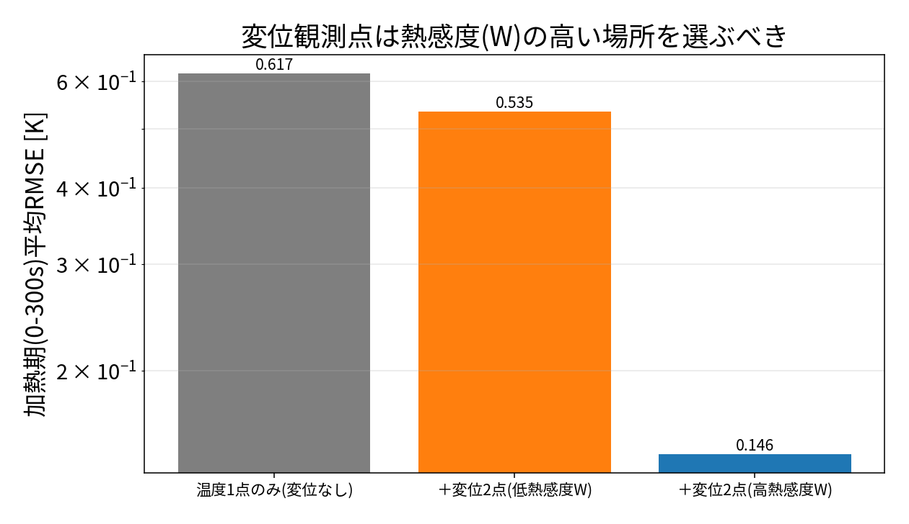
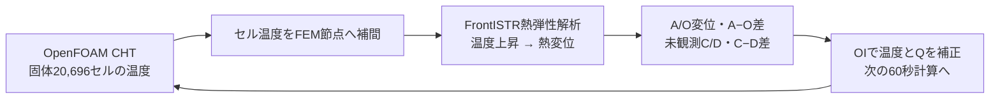
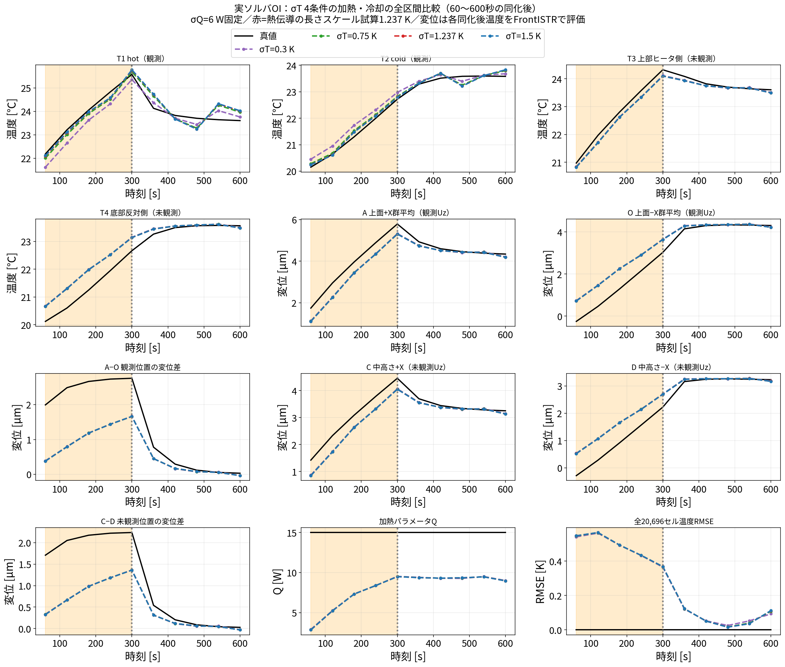

# blog_002：OI（最適内挿）でデータ同化 ― まず数式と小さな行列で「OIとは何か」を理解する

第2回は **データ同化** です。データ同化とは、

> **少ないセンサの測定値を使って、シミュレーションの状態（全体）を真値へ近づける**

技術です。この記事では一番シンプルな **OI（Optimal Interpolation, 最適内挿）** を扱います。

> **この記事の流れ**：
> 1. **OIとは何かを数式で理解**する
> 2. **節点を3つに減らしたミニ模型**で、行列計算を手で追って腑に落とす
> 3. **どこを測ると効くか**を熱感度（FrontISTRの $W$ ）の**分布**で見抜く
> 4. 最後に、**104の実ソルバ（OpenFOAM＋FrontISTR）で回した比較結果**を見る
>
> いきなり結果を見ても分からないので、**まず仕組み → 次に結果**の順で進めます。

---

## 1. ミニ模型：3つの温度点

本物は固体20,696セルですが、いきなりは分かりません。まず **3点だけの温度** で考えます。

- 状態（知りたいもの）：3点の温度 $x=(T_1,T_2,T_3)$ 。
- **真値（本当はこうなっている）**： $x^\mathrm{true}=(30,\ 27,\ 25)$ ℃。片側が熱く、離れるほどぬるい。
- **予報（シミュレーションの当て推量）**： $x^b=(25,\ 25,\ 25)$ ℃。全部同じと置いた雑な初期値。

やりたいのは、**1点だけ温度計を置いて測り**、その1点の情報から **3点全部を真値へ寄せる**ことです。

---

## 2. OI のしくみ（4つの部品と1本の式）

OI は次の4つの部品でできています。

1. **予報 $x^b$ **：シミュレーションの当て推量。ここでは $(25,25,25)$ 。
2. **観測 $y$ **：実際に測った値。ここでは点1を測って $y=30$ （真値30に近い）。
3. **背景誤差共分散 $B$ **（3×3行列）：**予報がどれくらい外れているか＆点どうしがどれだけ連動するか**を表す。
   OI では **これを事前に決め打ちして固定**します（ここが EnKF との違い）。
4. **観測誤差 $R$ **：温度計のノイズの大きさ（分散）。

これらから、更新式は **たった1本**です：

$$\boxed{\,x^a=x^b+K\,(y-Hx^b)\,}\qquad K=BH^{\mathsf T}\bigl(HBH^{\mathsf T}+R\bigr)^{-1}$$

- $x^a$ ：**同化後**（analysis）の温度。これが答え。
- $H$ ：**観測演算子**。「状態のどこを測ったか」を表す行列。点1だけ測ったので $H=(1,\ 0,\ 0)$ 。
- $y-Hx^b$ ：**予報のハズレ**（innovation）。「測ったら予報と何度違ったか」。
- $K$ ：**カルマンゲイン**。ハズレを各点にどれだけ配分するかの重み。 $B$ と $R$ から決まる。

言葉にすると：**「予報のハズレ」に「配分の重み $K$ 」をかけて予報を直す**、それだけです。
$K$ を作るのに $B$ （点どうしの連動）が効くので、次に具体的な数字で計算してみます。

---

## 3. 手計算で OI をやってみる（3点・観測1点）

### 3-1. 部品に数字を入れる

**背景共分散 $B$ **：予報の温度は $\sigma=2$ ℃ くらいばらつくとし（分散 $\sigma^2=4$ ）、
**近い点ほど連動する**（相関が高い）とします。点1-2は相関0.5、点1-3は0.2、点2-3は0.5:

$$B=4\begin{pmatrix}1 & 0.5 & 0.2\\ 0.5 & 1 & 0.5\\ 0.2 & 0.5 & 1\end{pmatrix}
=\begin{pmatrix}4 & 2 & 0.8\\ 2 & 4 & 2\\ 0.8 & 2 & 4\end{pmatrix}$$

**観測演算子** $H=(1,\ 0,\ 0)$ 。**観測ノイズ** 温度計の標準偏差 0.3 ℃ なので $R=0.3^2=0.09$ 。

### 3-2. カルマンゲイン $K$ を計算

まず $BH^{\mathsf T}$ ＝「 $B$ の1列目」（ $H$ が点1を抜き出すから）:

$$BH^{\mathsf T}=\begin{pmatrix}4\\ 2\\ 0.8\end{pmatrix}$$

次に $HBH^{\mathsf T}$ ＝「 $B$ の (1,1) 成分」＝ 4。これに $R$ を足す:

$$HBH^{\mathsf T}+R=4+0.09=4.09$$

1×1 なので逆行列は割り算1回。ゲインは

$$K=\frac{1}{4.09}\begin{pmatrix}4\\ 2\\ 0.8\end{pmatrix}
=\begin{pmatrix}0.978\\ 0.489\\ 0.196\end{pmatrix}$$

**読み方**：点1（測った点）は重み 0.978 でほぼ観測を信じる。点2は 0.489、点3は 0.196 と、
**測っていない点にも $B$ の相関を通じて補正が配られる**。近い点2ほど強く、遠い点3ほど弱く。

### 3-3. 更新（answer）

予報のハズレ： $y-Hx^b=30-25=5$ ℃。これをゲインで配分:

$$x^a=x^b+K\times5
=\begin{pmatrix}25\\ 25\\ 25\end{pmatrix}
+\begin{pmatrix}0.978\\ 0.489\\ 0.196\end{pmatrix}\times5
=\begin{pmatrix}29.89\\ 27.44\\ 25.98\end{pmatrix}$$

### 3-4. 結果を真値と比べる

| 点 | 予報 $x^b$ | **同化後 $x^a$ ** | 真値 | 効果 |
|---|---|---|---|---|
| 点1（観測） | 25 | **29.89** | 30 | ほぼ真値 |
| 点2（未観測） | 25 | **27.44** | 27 | 真値へ寄った |
| 点3（未観測） | 25 | **25.98** | 25 | ほぼ真値 |

**たった1点の温度計で、測っていない点2・点3まで真値へ寄りました。**
これが OI の効果です。ミソは **背景共分散 $B$ が「点どうしの連動」を持っている**こと。
「点1が予報より5℃高かった → 連動する点2も高いはず」と $B$ が教えてくれるので、補正が全体に広がります。

---

## 4. どこを測ると効くか ― 熱感度 $W$ の分布で観測点を選ぶ

3点模型では「点1を測る」と決め打ちしましたが、本研究では **観測点を感度で設計**します。
特に **変位センサ**をどこに置くかは、FrontISTR で求めた **熱感度 $W$** の**分布**で決めます。

### 4-1. 熱感度 $W=K_s^{-1}H_T$ とは

温度節点ベクトルを $T$ 、熱荷重行列を $H_T$ 、構造剛性行列を $K_s$ とすると、線形熱弾性では

$$K_s u=H_T T,\qquad W=\frac{\partial u}{\partial T}=K_s^{-1}H_T.$$

$W_{ij}$ は「温度節点 $j$ を1 K変えたとき、変位自由度 $i$ がどれだけ変わるか（m/K）」です。
変位観測点 $i$ の候補を選ぶときは、その行の大きさ $S_i=\sum_j \lvert W_{ij}\rvert$ を比べます。
$S_i$ が大きい場所ほど、**温度場の違いが変位観測に強く現れる＝同化に使える情報が大きい**。

### 4-2. 感度の分布（図）

この $W$ の行感度を円筒上に色で描くと、**どこが高感度か**が一目で分かります。

*105のFrontISTR（DUMPWパッチ版）が計算した $W$ の変位行感度を色で表示（灰色は拘束などで除外した点）。
**底面固定・上端自由なので、上端（自由端）ほど熱感度が高い**。
赤球＝変位観測点 A(+X上面)・青球＝O(−X上面) は、この高感度域に置かれている。*

分布から読み取れること：

- **上端（自由端）が高感度**：温度が変わると最も大きく動くので、変位を測る価値が高い。
- **底面近くは低感度**：拘束されていてほとんど動かないので、そこで変位を測っても情報が少ない。
- だから **A/O は上面（高W域）に置く**。これが「感度で観測点を設計する」ということ。

### 4-3. 実際の選定手順（105→106）

この感度は 106 のROM中で推測したものではなく、**105でFrontISTRを実行して得た結果**を使いました。

1. `105…/run/dumpw_cylinder.py` が FrontISTR で `DUMPW=YES` を指定し、温度→変位感度を出力。
2. `105…/run/build_W_from_dumps.py` が $K_s,H_T$ のダンプから $W=K_s^{-1}H_T$ を構築。
3. `105…/run/kinvh_sensitivity.py` が行感度 $S_i$ を計算し、拘束部の見かけの巨大値を除外して高感度2点・低感度2点を選ぶ。
4. 106の `run/run_disp_selection.py` が、温度点に高感度／低感度の変位2点を加えて比較。

> 補足：**温度センサ**の選定はこれとは別で、未知の発熱への感度 $\partial T/\partial Q$ を使います
> （「変位センサは $W$ 、温度センサは $\partial T/\partial Q$ 」）。

---

## 5. 感度が低い点で測るとどうなるか（失敗例）

もし変位センサを **低W点（底面近く）** に置くと、温度場の違いが変位信号に現れにくく、観測の情報量が小さい。
106では **高W変位2点・低W変位2点・変位なし** を、同じ真値・初期条件で比較しました。

*温度1点に変位2点を足したときの全点温度RMSE。**高W（青）は速く下がる**が、**低W（橙）は変位なしとほとんど変わらない**。*

| 観測構成 | 加熱期(0-300s)の平均RMSE |
|---|---|
| 温度1点のみ（変位なし） | 0.617 K |
| ＋変位2点（低W） | 0.535 K（ほとんど効かない） |
| **＋変位2点（高W）** | **0.146 K（約4倍改善）** |

→ **測る場所が悪いと、同化してもほとんど直らない**。だから第4節の**感度分布で観測点を選ぶ**のが先決なのです。
（この比較は 106 の5点温度ROM＋EnKFで実施。感度自体は105のFrontISTR計算由来です。）

---

## 6. 実モデル（104実ソルバ）で回した比較

ここまでは考え方の理解でした。ここからは **104のOpenFOAM＋FrontISTR実ソルバ**で回した結果です
（106のROMではなく、実ソルバの結果を106の全体ストーリーに追加したもの）。連成の流れ:

### 6-1. σQスタディ：発熱の背景分散を変える

背景発熱量の標準偏差を $\sigma_Q=0.5,2,6,50$ Wと変え、 $\sigma_T=1.5$ K・観測点・初期値・60秒更新を揃えて比較しました。
温度は hot/cold と未観測点、変位は上面A/Oとその差、さらに未観測中高さC/DとC−D差を評価しています。

最終の温度場RMSEは 0.090〜0.113 K まで小さくなる一方、推定 $Q$ は 8.82〜8.96 W で、真値15 Wに届きませんでした。
つまり、**温度分布がよく合っても、発熱量 $Q$ が同じ精度で同定できるとは限らない**（弱可同定）。
しかも $\sigma_Q$ を100倍振ってもほぼ変わらない＝**決め打ち $B$ の調整だけでは $Q$ を当てられない**、というのがOIの弱点です。

### 6-2. σTスタディ：温度誤差の大きさを変える

背景温度の標準偏差 $\sigma_T=0.3,0.75,1.237,1.5$ K を実ソルバで比較しました
（1.237 Kは、長さ75 mmの温度誤差モードを60秒拡散させた残り $5\exp[-\alpha(\pi/0.075)^2\,60]=1.237$ K という試算値）。

加熱期の全場温度RMSEは 0.479〜0.482 K、未観測C−D変位差RMSEは 1.188〜1.192 µm と、**σTを動かしてもほぼ不変**でした。
この固定共分散・固定感度のOIでは、σTだけで温度場・変位差・ $Q$ を同時に真値へ合わせることはできません
（OI一般の限界ではなく、今回の観測配置と共分散近似に対する結論）。詳細は
[18_oi_sigma_t_validation.md](18_oi_sigma_t_validation.md) 参照。

---

## 7. 本物（106）ではどうスケールするか

ミニ模型と本物の対応:

| ミニ模型 | 本物（106/104） |
|---|---|
| 3点の温度 | 固体20,696セルの温度（＋発熱 $Q$ ） |
| 観測1点 | 温度 hot/cold の2点＋上面変位2点 |
| $B$ を手で置く | $\sigma_T,\sigma_Q$ を決め打ちして $B$ を作る（固定） |
| 割り算1回 | $HBH^{\mathsf T}+R$ の小さい行列を1回だけ逆行列 |

本物の OI も **やっていることは全く同じ**：予報1本＋固定 $B$ ＋観測で、更新式 $x^a=x^b+K(y-Hx^b)$ を回すだけ。
アンサンブル（多数の分身）を使わないので **軽い**のが OI の長所です。

一方で $B$ を **決め打ち**する弱点（ $Q$ が真値に届かない）もあります。
その弱点を **アンサンブルで $B$ を毎回作り直して補う**のが、次回の EnKF です。

---

## 8. まとめ ― 第2回で押さえたこと

1. **OIは更新式1本**： $x^a=x^b+K(y-Hx^b)$ 、 $K=BH^{\mathsf T}(HBH^{\mathsf T}+R)^{-1}$ 。
2. 3点の手計算で、**固定 $B$ の相関が1点の観測を未観測点まで広げる**のを確認した。
3. **観測点は感度の分布で選ぶ**。変位は熱感度 $W$ の高い上端、温度は $\partial T/\partial Q$ の高い点。低感度点では直らない。
4. 実ソルバの σQ/σT スタディでは、**温度場は合うが $Q$ は弱可同定**で、決め打ち $B$ の調整では届かない、という限界も見えた。

次回（blog_003）は **アンサンブルカルマンフィルタ（EnKF）**。
「 $B$ を決め打ちしない」で、**多数の分身の散らばりから $B$ を毎サイクル作り直す**やり方を、
やはり **節点を減らした具体的な手計算**で見ていきます。

---

### 参考（元になった実装・詳細）

- OI/EnKF のアルゴリズムと数式：`00_data_assimilation_algorithm.md`
- 感度による観測設計：`../../105_0_sensor_placement_sensitivity/docs/03_sensor_design_guide.md`
- σTスタディの詳細：`18_oi_sigma_t_validation.md`
- 全ストーリー：`02_full_story.md`
