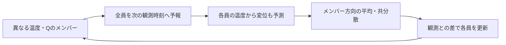
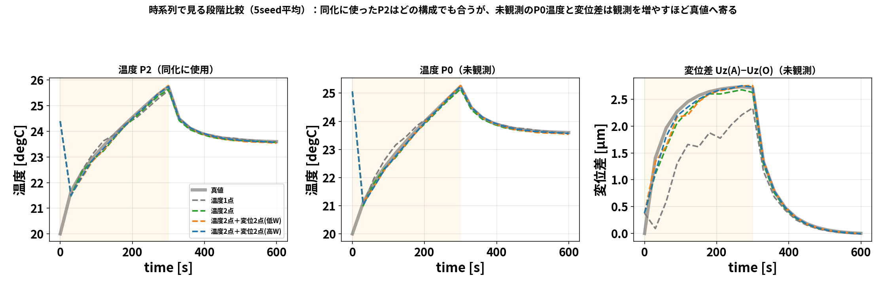

# blog_003：アンサンブルカルマンフィルタ（EnKF）― 「分身の散らばり」から共分散を作る

## 読む前に：OIから何を変えるのか

**第2回の更新式を使いながら、共分散を毎回の予報メンバーから求める**のがこの記事の主題です。
OIでもQは更新できます。EnKFは、温度とQの関係が時間とともに変わることを標本共分散に反映しますが、正しい同定を保証するわけではありません。

| 読む順番 | 内容 | 実験の区別 |
|---|---|---|
| §1〜3 | 4メンバー・温度2点の手計算 | 説明用の数値例 |
| §4〜5 | Qの更新と計算コスト | 104：実ソルバ5メンバー。106：ROM60メンバーを分けて読む |
| §6 | 観測の種類・位置・時間の比較 | 106のROM実験。独立した実測での検証ではない |



更新する温度と、観測として使う変位を区別してください。106では状態は
$z=[T_0,\ldots,T_4,q_{\mathrm{scale}},h]^{\mathsf T}$ 、 $Q=15q_{\mathrm{scale}}$ Wです。
変位は温度から計算する観測予報であり、独立した状態として時間積分しません。
ROMの $h$ は放熱コンダクタンス [W/K] です。ROMの構築と全場復元は[第4回](blog_004_pod_selected_rom.md)へ進みます。


第3回は **アンサンブルカルマンフィルタ（EnKF）** です。前回（blog_002）の OI は
背景共分散 $B$ を **決め打ちで固定**しました。EnKF はここを変えて、

> **たくさんの"分身（アンサンブル）"を走らせ、その散らばりから共分散を毎回作り直す**

のが特徴です。これにより **発熱量 $Q$ と観測の共分散を予報から推定**できます。推定精度は観測情報・モデル・初期分布・メンバー数に依存します。
今回も **節点を減らした具体例**で、行列を手で追いながら理解します。

> OIとの一言の違い：**OI は $B$ を人間が置く／EnKF は $B$ を分身の散らばりが教えてくれる**。

---

## 1. アンサンブル（分身）とは

「予報がどれくらい外れるか（共分散 $B$ ）」を人間が決めるのは難しい。
そこで EnKF は、**少しずつ違う初期値・パラメータを持った $N$ 個の分身**を用意して、
全部シミュレーションで前進させます。その **バラけ方（散らばり）そのものが共分散**になります。

```
分身1 ─┐
分身2 ─┼─ みんな少しずつ違う → シミュレーションで前進
 ⋮    │        → 散らばり方から共分散 C を作る
分身N ─┘
```

- 分身が **揃って動く2つの量**は「相関が高い」→ 共分散の非対角が大きい。
- 分身が **バラバラな量**は不確かさが大きい→ 分散が大きい。

**この共分散は状況に応じて毎サイクル作り直される**（＝流れ依存）。ここが固定 $B$ の OI との決定的な差です。

---

## 2. EnKF の手順（1サイクル）

1. **予報（forecast）**：全分身をシミュレーションで次の観測時刻まで前進。
2. **標本共分散**：分身たちの平均とズレから共分散 $C$ を作る。
3. **カルマンゲイン**： $K=C_{zy}(C_{yy}+R)^{-1}$ （ $C_{zy}$ =状態と観測の共分散、 $C_{yy}$ =観測どうし）。
4. **更新（analysis）**：各分身を観測へ寄せる（観測には分身ごとに少しノイズを足す＝摂動観測法）。

$$x_a^{(m)}=x_f^{(m)}+K\bigl(y+\epsilon^{(m)}-Hx_f^{(m)}\bigr)\qquad(m=1,\ldots,N)$$

更新後の分身の **平均**が推定値、**散らばり**が不確かさです。

---

### 2-1. 平均・共分散・コードを同じ向きで書く

$N$ はメンバー数、 $n$ は状態数、 $p$ は観測数です。 $m$ はメンバー番号、 $f$ は予報、 $a$ は同化後を表します。観測摂動は $\epsilon^{(m)}\sim\mathcal N(0,R)$ 、すなわち平均0・共分散Rの正規乱数です。

プログラムでは**行にメンバー、列に状態**を並べます。

$$
Z_f=\begin{bmatrix}(z_f^{(1)})^{\mathsf T}\\\vdots\\(z_f^{(N)})^{\mathsf T}\end{bmatrix}\in\mathbb R^{N\times n},
\quad Y_f\in\mathbb R^{N\times p}.
$$

$Y_f$ の第m行は、そのメンバーの状態から計算した温度・変位の観測予報です。

$$
\bar z_f=\frac1N\sum_m z_f^{(m)},\quad
\bar y_f=\frac1N\sum_m y_f^{(m)},\quad
(dZ)_{m,:}=(z_f^{(m)}-\bar z_f)^{\mathsf T}.
$$

$dY$ も同様に観測予報の平均を引きます。

$$
C_{zy}=\frac{dZ^{\mathsf T}dY}{N-1}\in\mathbb R^{n\times p},\qquad
C_{yy}=\frac{dY^{\mathsf T}dY}{N-1}\in\mathbb R^{p\times p}.
$$

例えば成分ごとに書くと

$$[C_{zy}]_{ij}=\sum_m\bigl(z_{f,i}^{(m)}-\bar z_{f,i}\bigr)\bigl(y_{f,j}^{(m)}-\bar y_{f,j}\bigr)/(N-1).$$
平均を同じ標本から推定するので標本共分散はN−1で割ります。時間方向やセル方向の分散ではありません。
106の温度2点＋変位2点なら $Z_f:60\times7$ 、 $Y_f:60\times4$ 、 $C_{zy}:7\times4$ 、 $C_{yy}:4\times4$ です。

`dacore/enkf.py`の主要計算は次のとおりです（ここでは偏差を拡大するインフレーションを省略）。

```python
zbar = Zf.mean(axis=0)
ybar = Yf.mean(axis=0)
dZ = Zf - zbar
dY = Yf - ybar
C_zy = dZ.T @ dY / (len(Zf) - 1)
C_yy = dY.T @ dY / (len(Zf) - 1)
S = C_yy + R
# Sは対称なので、S @ K.T = C_zy.T を解く。
gain_T = np.linalg.solve(S, C_zy.T)
eps = rng.multivariate_normal(np.zeros(len(y)), R, size=len(Zf))
Za = Zf + (y[None, :] + eps - Yf) @ gain_T
```

逆行列の記号は理論式に使いますが、コードは連立方程式を解きます。変位に基準値の切片がある場合も、`Yf`に基準値込みの観測予報を渡せば同じ式で更新できます。

### 2-2. 「平均を更新」と「全メンバーを更新」の違い

更新式をN人分足してNで割ると、

$$
\bar z_a=\bar z_f+K(y-\bar y_f+\bar\epsilon),\qquad
\bar\epsilon=\frac1N\sum_m\epsilon^{(m)}.
$$

各乱数の期待値は0でも有限Nの標本平均 $\bar\epsilon$ は一般に0ではありません。次の手計算は $\bar\epsilon=0$ の平均更新を説明します。実装では各員に異なる摂動を与え、更新後の散らばりも残します。その散らばりはモデルと有限標本に依存する推定であり、真の誤差そのものではありません。

## 3. 手計算で EnKF をやってみる（2点・分身4つ・観測1点）

### 3-1. 分身の予報

状態を2点の温度 $x=(T_1,T_2)$ とし、分身を **4つ**用意して前進させたら、次の予報になったとします。

| 分身 | $T_1$ | $T_2$ |
|---|---|---|
| m1 | 26 | 24 |
| m2 | 30 | 27 |
| m3 | 28 | 25 |
| m4 | 32 | 28 |
| **平均** | **29** | **26** |

### 3-2. 散らばりから標本共分散を作る

平均からのズレ（deviation）:

| 分身 | $\delta T_1$ | $\delta T_2$ |
|---|---|---|
| m1 | −3 | −2 |
| m2 | +1 | +1 |
| m3 | −1 | −1 |
| m4 | +3 | +2 |

この手計算のCは温度2点の共分散（熱容量のCとは別）です。偏差行列は

$$dZ=\begin{pmatrix}-3&-2\\1&1\\-1&-1\\3&2\end{pmatrix},\qquad C=\frac{dZ^{\mathsf T}dZ}{3}.$$

標本共分散は $C=\dfrac{1}{N-1}\sum_m \delta x^{(m)}\,\delta x^{(m)\mathsf T}$ （ $N=4$ なので $1/3$ ）:

$$C=\frac{1}{3}\begin{pmatrix}(-3)^2+1^2+(-1)^2+3^2 & (-3)(-2)+\cdots+3\cdot2\\ 14 & (-2)^2+1^2+(-1)^2+2^2\end{pmatrix}
=\frac{1}{3}\begin{pmatrix}20 & 14\\ 14 & 10\end{pmatrix}
=\begin{pmatrix}6.67 & 4.67\\ 4.67 & 3.33\end{pmatrix}$$

**読み方**： $C_{12}=4.67>0$ 、つまり **「 $T_1$ が高い分身は $T_2$ も高い」**と分身たちが教えている。
この相関は人間が置いたのではなく、**シミュレーションの結果から自動で出てきた**ものです。

### 3-3. カルマンゲイン

点1を観測（ $H=(1,\ 0)$ ）、観測ノイズ $R=0.3^2=0.09$ 。

- 状態×観測の共分散 $C_{zy}=C H^{\mathsf T}$ ＝「 $C$ の1列目」 $=\begin{pmatrix}6.67\\ 4.67\end{pmatrix}$
- 観測×観測 $C_{yy}=C_{11}=6.67$

$$K=\frac{1}{C_{yy}+R}\begin{pmatrix}6.67\\ 4.67\end{pmatrix}
=\frac{1}{6.76}\begin{pmatrix}6.67\\ 4.67\end{pmatrix}
=\begin{pmatrix}0.987\\ 0.691\end{pmatrix}$$

### 3-4. 更新（平均で見る）

以下は観測摂動の平均を0とした計算です。有限メンバーの摂動観測法では、実際の平均には $K\bar\epsilon$ が加わります。

観測 $y=30$ （真値 $T_1=30$ 付近）。予報平均のハズレは $30-29=1$ 。平均の更新は

$$\bar x_a=\bar x_f+K\times1
=\begin{pmatrix}29\\ 26\end{pmatrix}+\begin{pmatrix}0.987\\ 0.691\end{pmatrix}
=\begin{pmatrix}29.99\\ 26.69\end{pmatrix}$$

| 点 | 予報平均 | **同化後平均** | 真値 |
|---|---|---|---|
| 点1（観測） | 29 | **29.99** | 30 |
| 点2（未観測） | 26 | **26.69** | 27 |

観測した点1はほぼ真値へ、**未観測の点2も標本共分散の相関を通じて真値へ寄りました**。
やっていることは OI と同じ更新式ですが、**共分散 $C$ を分身から作った**のが違いです。
さらに更新後は **分身の散らばりが縮む**（不確かさが減った、を表す）。

---

## 4. 発熱量Qへ情報が伝わる仕組みと、実計算の結果

OI（blog_002）では、固定 $B$ のもとで **発熱量 $Q$ が真値に届きにくい**という弱点がありました
（ $\sigma_Q$ を100倍振っても $Q$ は約9 Wで頭打ち）。EnKF はここで差が出ます。

EnKF では状態に $Q$ も入れて **拡大状態** $z=(T_1,\ldots,Q,\ h)$ にします。分身ごとに $Q$ を少し変えて前進させると、

- 「 $Q$ が大きい分身は温度も高い」という **$Q$ と観測の相関** が、標本共分散に自動で現れる。
- しかもその相関は **加熱中・冷却中で変わる**（流れ依存）。EnKF は毎サイクルこれを作り直す。

この相関を通じて観測との差を **Qにも配分**できます。以下は今回得られた結果であり、常に真値へ収束するという保証ではありません。
本研究の実ソルバEnKFでは、でたらめ初期から

- 全セル温度RMSE **7.61 K → 0.011 K**
- 発熱量 **$Q\to14.93$ W**（真値15 W、誤差約0.5%）

という結果でした。これは**104の実ソルバ・5メンバー・60秒ごと10更新**の実験です。OIとの差には設定の違いも含まれ、手法一般の優劣を証明する比較ではありません。

**ここから下の2図は別の実験です。** 106のROM・60メンバー・温度P2のみの同化で、変位観測は使いません。真値も同じROM、seed=20260913、30秒ごと20更新。
`results/da_summary.yaml`では最終Q=17.08 W（真値15 W）、h=0.02511 W/K（真値0.01535 W/K）です。104の14.93 Wを示した図ではありません。


*温度P2のみを同化したROMのQ/h履歴。Qにもhにも誤差が残っている。hは壁面熱伝達率ではなくROMの放熱コンダクタンス。*


*同化を重ねるごとに全点温度RMSEが下がる。*

---

## 5. その代わりのコスト

EnKF の弱点は **重さ**です。共分散を作るために **分身を $N$ 個、毎サイクル全部前進**させます。
実ソルバ（OpenFOAM＋FrontISTR）でこれをやると、

- OI（背景1本）：約 1.2〜1.6 時間
- EnKF（5メンバー）：**約13時間**（予報が $N$ 倍）

となります。実ソルバを複数回進める計算負担と、共分散を予報に応じて更新できる利点の比較です。これらは既存実行例の全体時間で、同一条件の速度ベンチマークではありません。
この重さを避けるために **予報モデルを ROM に置き換える**のが、106 の POD+Q-DEIM の役割でした
（0〜600秒が数秒で回るので、EnKF を何度も試せる）。

---

## 6. 観測を「どう増やすか」「いつ入れるか」― ROM＋EnKF の実験2つ

軽いROMの上でEnKFを何度も回せるようになったので、観測設計の実験を2つ紹介します。

### 6-1. 今回の条件では観測の追加で改善した（温度1点→2点→＋変位2点）

まず **どこで観測しているか**（この種の図はDA結果とセットで必ず示します）:


*温度は T1=P2（ヒータ側・高感度）、2点目に T2=P4（反対側）。変位は高W＝上端2点（橙）／低W＝底面2点（灰）。底面固定の中空円柱。*


*ROM＋EnKF・5seed平均。**温度1点→2点で大きく改善し、変位2点を足すとさらに改善**。
そして同じ変位2点でも、**熱感度 $W$ の高い点に置いた方が効く**（低Wだと効きが半減）。*

時系列でも見てみます（**同化に使った点と未観測点を分けて**）:



*左＝同化に使った P2：どの構成でも真値に合う。中＝**未観測の P0**：温度1点（灰）は加熱期にずれる。
右＝**未観測の変位差** Uz(A)−Uz(O)：温度1点は大きく外れ、観測を増やすほど真値へ。同化に使った点だけの評価では不十分で、**未観測の量で比べるのが公平**です。*

| 観測構成 | 温度RMSE（加熱期） | 未観測の変位差誤差 |
|---|---|---|
| 温度1点 | 0.617 K | 0.869 µm |
| 温度2点 | 0.197 K | 0.151 µm |
| 温度2点＋変位2点（低W） | 0.188 K | 0.104 µm |
| **温度2点＋変位2点（高W）** | **0.159 K** | **0.077 µm** |

### 6-2. 「いつ観測するか」で $Q$ と $h$ の推定が変わる

観測の効き目は**場所だけでなく時間**にもあります。同じ温度2点で、同化する時間窓だけを変えると:


*直接感度 $\partial T/\partial Q$ は加熱期に大きく、 $\partial T/\partial h$ は冷却期に大きい。実験でも
**$Q$ は加熱期の観測が担い**（加熱のみ0.57 W ≈ 全期間0.58 W、冷却のみだと4.23 Wと7倍悪化）、
**$h$ は冷却期を足すと相対的に改善**（7.6→5.3 mW/K）。ただし $h$ は温度応答がノイズ以下のため依然難しい。*

まとめると、観測設計は「**どこで（空間）・何を（種類）・いつ（時間）**」の3軸で考える、というのが実験から見えた形です。

---

## 7. 3回のまとめ

| 回 | テーマ | キモ |
|---|---|---|
| blog_001 | CHT→熱膨張＋熱伝達率 | 固体＋空気を一体で解き、温度→変形、面ごとの $h$ を診断 |
| blog_002 | OI データ同化 | 感度で観測点を選ぶ／固定 $B$ で軽く更新／ $Q$ は弱可同定 |
| **blog_003** | **EnKF** | **予報から共分散を更新／Qの同定精度は条件に依存／実ソルバでは重い** |

3つを貫くメッセージは、**「少数の観測から全体（温度・変形・熱源）を推定する」** こと。
そのために **どこを測るか（感度）**・**どう共分散を作るか（固定 $B$ か分身か）**・**どう軽くするか（ROM）** を
使い分ける、というのが本研究の骨格です。

---

### 参考（元になった実装・詳細）

- OI/EnKF のアルゴリズムと数式：`00_data_assimilation_algorithm.md`
- EnKF がなぜ重いか・ROM化の動機：`00_data_assimilation_algorithm.md` の E 節
- 全ストーリー：`02_full_story.md`
