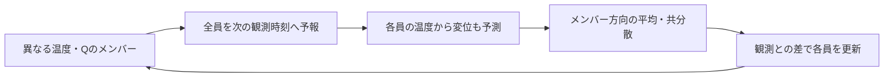
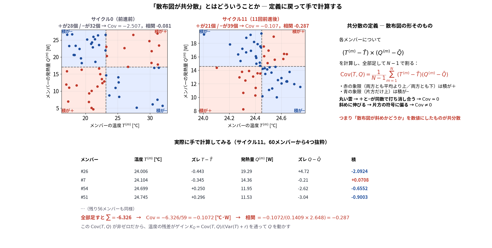
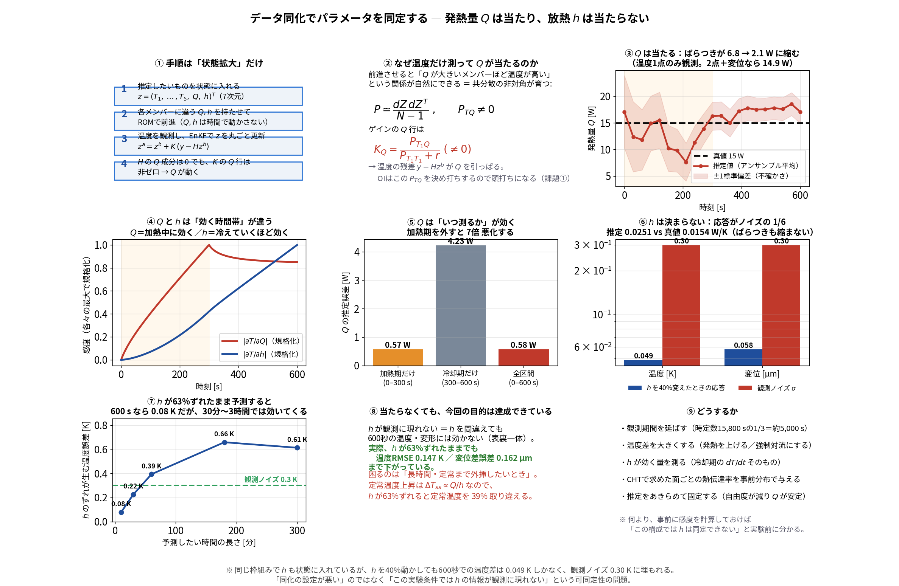
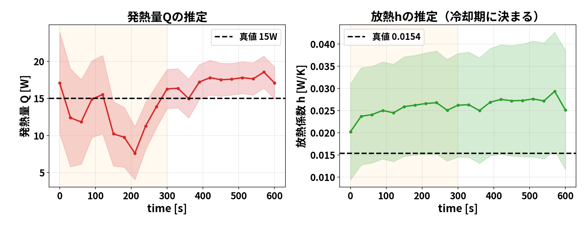
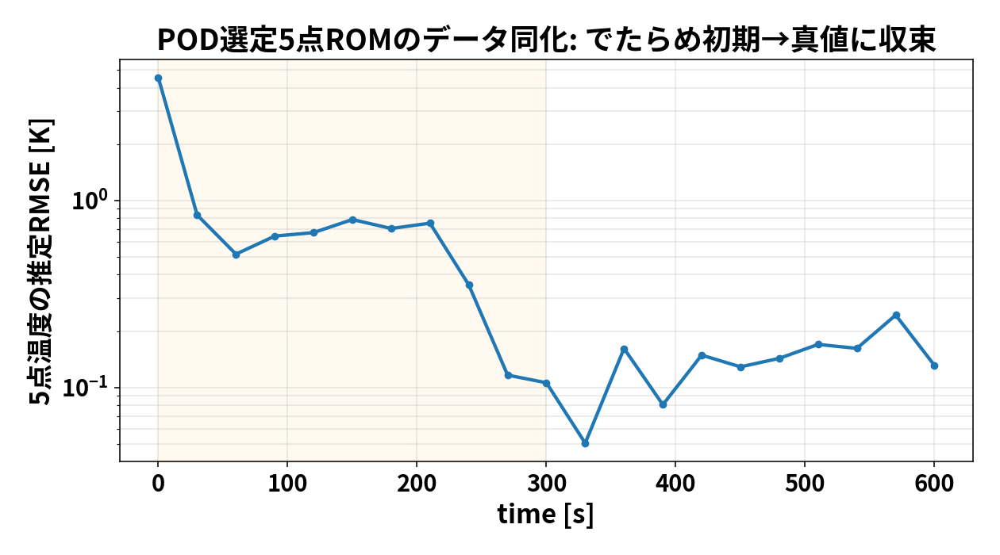
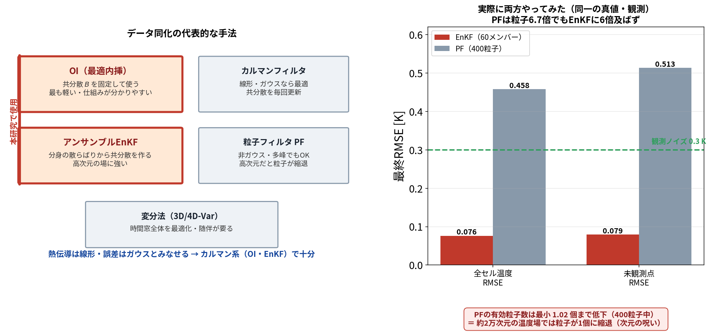
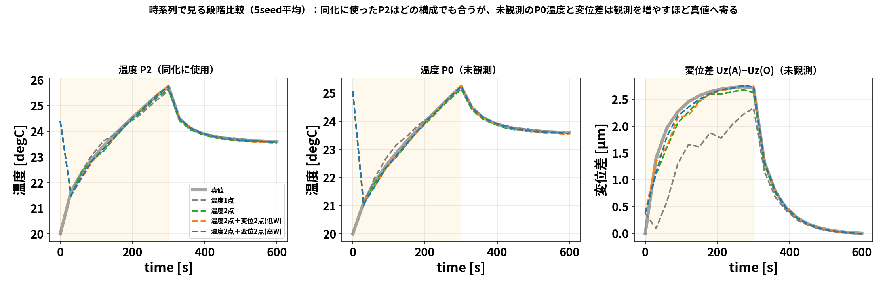

# blog_003：アンサンブルカルマンフィルタ（EnKF）― 「分身の散らばり」から共分散を作る

## 読む前に：OIから何を変えるのか

**第2回の更新式を使いながら、共分散を毎回の予報メンバーから求める**のがこの記事の主題です。
OIでもQは更新できます。EnKFは、温度とQの関係が時間とともに変わることを標本共分散に反映しますが、正しい同定を保証するわけではありません。

| 読む順番 | 内容 | 実験の区別 |
|---|---|---|
| §1〜3 | 4メンバー・温度2点の手計算 | 説明用の数値例 |
| §4〜5 | Qの更新と計算コスト | 104：実ソルバ5メンバー。106：ROM60メンバーを分けて読む |
| §6 | 観測の種類・位置・時間の比較 | 106のROM実験。独立した実測での検証ではない |


```mermaid
flowchart LR
 A["異なる温度・Qのメンバー"] --> B["全員を次の観測時刻へ予報"]
 B --> C["各員の温度から変位も予測"]
 C --> D["メンバー方向の平均・共分散"]
 D --> E["観測との差で各員を更新"]
 E --> A
```

更新する温度と、観測として使う変位を区別してください。106では状態は
$z=[T_0,\ldots,T_4,q_{\mathrm{scale}},h]^{\mathsf T}$ 、 $Q=15q_{\mathrm{scale}}$ Wです。
変位は温度から計算する観測予報であり、独立した状態として時間積分しません。
ROMの $h$ は放熱コンダクタンス [W/K] です。ROMの構築と全場復元は[第4回](blog_004_pod_selected_rom.md)へ進みます。


第3回は **アンサンブルカルマンフィルタ（EnKF）** です。前回（blog_002）の OI は
背景共分散 $B$ を **決め打ちで固定**しました。EnKF はここを変えて、

> **たくさんの"分身（アンサンブル）"を走らせ、その散らばりから共分散を毎回作り直す**

のが特徴です。これにより **発熱量 $Q$ と観測の共分散を予報から推定**できます。推定精度は観測情報・モデル・初期分布・メンバー数に依存します。
今回も **節点を減らした具体例**で、行列を手で追いながら理解します。

> OIとの一言の違い：**OI は $B$ を人間が置く／EnKF は $B$ を分身の散らばりが教えてくれる**。

---

## 1. アンサンブル（分身）とは

「予報がどれくらい外れるか（共分散 $B$ ）」を人間が決めるのは難しい。
そこで EnKF は、**少しずつ違う初期値・パラメータを持った $N$ 個の分身**を用意して、
全部シミュレーションで前進させます。その **バラけ方（散らばり）そのものが共分散**になります。

```
分身1 ─┐
分身2 ─┼─ みんな少しずつ違う → シミュレーションで前進
 ⋮    │        → 散らばり方から共分散 C を作る
分身N ─┘
```

- 分身が **揃って動く2つの量**は「相関が高い」→ 共分散の非対角が大きい。
- 分身が **バラバラな量**は不確かさが大きい→ 分散が大きい。

**この共分散は状況に応じて毎サイクル作り直される**（＝流れ依存）。ここが固定 $B$ の OI との決定的な差です。

---

## 2. EnKF の手順（1サイクル）

1. **予報（forecast）**：全分身をシミュレーションで次の観測時刻まで前進。
2. **標本共分散**：分身たちの平均とズレから共分散 $C$ を作る。
3. **カルマンゲイン**： $K=C_{zy}(C_{yy}+R)^{-1}$ （ $C_{zy}$ =状態と観測の共分散、 $C_{yy}$ =観測どうし）。
4. **更新（analysis）**：各分身を観測へ寄せる（観測には分身ごとに少しノイズを足す＝摂動観測法）。

$$x_a^{(m)}=x_f^{(m)}+K\bigl(y+\epsilon^{(m)}-Hx_f^{(m)}\bigr)\qquad(m=1,\ldots,N)$$

更新後の分身の **平均**が推定値、**散らばり**が不確かさです。

---

### 2-1. 平均・共分散・コードを同じ向きで書く

$N$ はメンバー数、 $n$ は状態数、 $p$ は観測数です。 $m$ はメンバー番号、 $f$ は予報、 $a$ は同化後を表します。観測摂動は $\epsilon^{(m)}\sim\mathcal N(0,R)$ 、すなわち平均0・共分散Rの正規乱数です。

プログラムでは**行にメンバー、列に状態**を並べます。

$$
Z_f=\begin{bmatrix}(z_f^{(1)})^{\mathsf T}\\\vdots\\(z_f^{(N)})^{\mathsf T}\end{bmatrix}\in\mathbb R^{N\times n},
\quad Y_f\in\mathbb R^{N\times p}.
$$

$Y_f$ の第m行は、そのメンバーの状態から計算した温度・変位の観測予報です。

$$
\bar z_f=\frac1N\sum_m z_f^{(m)},\quad
\bar y_f=\frac1N\sum_m y_f^{(m)},\quad
(dZ)_{m,:}=(z_f^{(m)}-\bar z_f)^{\mathsf T}.
$$

$dY$ も同様に観測予報の平均を引きます。

$$
C_{zy}=\frac{dZ^{\mathsf T}dY}{N-1}\in\mathbb R^{n\times p},\qquad
C_{yy}=\frac{dY^{\mathsf T}dY}{N-1}\in\mathbb R^{p\times p}.
$$

例えば成分ごとに書くと

$$[C_{zy}]_{ij}=\sum_m\bigl(z_{f,i}^{(m)}-\bar z_{f,i}\bigr)\bigl(y_{f,j}^{(m)}-\bar y_{f,j}\bigr)/(N-1).$$
平均を同じ標本から推定するので標本共分散はN−1で割ります。時間方向やセル方向の分散ではありません。
106の温度2点＋変位2点なら $Z_f:60\times7$ 、 $Y_f:60\times4$ 、 $C_{zy}:7\times4$ 、 $C_{yy}:4\times4$ です。

`dacore/enkf.py`の主要計算は次のとおりです（ここでは偏差を拡大するインフレーションを省略）。

```python
zbar = Zf.mean(axis=0)
ybar = Yf.mean(axis=0)
dZ = Zf - zbar
dY = Yf - ybar
C_zy = dZ.T @ dY / (len(Zf) - 1)
C_yy = dY.T @ dY / (len(Zf) - 1)
S = C_yy + R
# Sは対称なので、S @ K.T = C_zy.T を解く。
gain_T = np.linalg.solve(S, C_zy.T)
eps = rng.multivariate_normal(np.zeros(len(y)), R, size=len(Zf))
Za = Zf + (y[None, :] + eps - Yf) @ gain_T
```

逆行列の記号は理論式に使いますが、コードは連立方程式を解きます。変位に基準値の切片がある場合も、`Yf`に基準値込みの観測予報を渡せば同じ式で更新できます。

### 2-2. 「平均を更新」と「全メンバーを更新」の違い

更新式をN人分足してNで割ると、

$$
\bar z_a=\bar z_f+K(y-\bar y_f+\bar\epsilon),\qquad
\bar\epsilon=\frac1N\sum_m\epsilon^{(m)}.
$$

各乱数の期待値は0でも有限Nの標本平均 $\bar\epsilon$ は一般に0ではありません。次の手計算は $\bar\epsilon=0$ の平均更新を説明します。実装では各員に異なる摂動を与え、更新後の散らばりも残します。その散らばりはモデルと有限標本に依存する推定であり、真の誤差そのものではありません。

## 3. 手計算で EnKF をやってみる（2点・分身4つ・観測1点）

### 3-1. 分身の予報

状態を2点の温度 $x=(T_1,T_2)$ とし、分身を **4つ**用意して前進させたら、次の予報になったとします。

| 分身 | $T_1$ | $T_2$ |
|---|---|---|
| m1 | 26 | 24 |
| m2 | 30 | 27 |
| m3 | 28 | 25 |
| m4 | 32 | 28 |
| **平均** | **29** | **26** |

### 3-2. 散らばりから標本共分散を作る



*散布図と共分散は別のものではない。$\mathrm{Cov}(T,Q)=\sum_m(T^{(m)}-\bar T)(Q^{(m)}-\bar Q)/(N-1)$
は各メンバーの平均からのズレの積を平均した量であり、点が平均を中心とする4象限のどこに落ちるかで
積の符号が決まる。雲が等方的なら正負が相殺して $\mathrm{Cov}\simeq0$、斜めに伸びれば一方に偏って
$\mathrm{Cov}\neq0$ となる。したがって散布図の傾きは共分散の可視化ではなく、定義式そのものを
幾何的に見たものである。実データ（サイクル11・60メンバー）では積の和が $-6.326$、
$\mathrm{Cov}=-6.326/59=-0.1072$、相関 $-0.287$。*


平均からのズレ（deviation）:

| 分身 | $\delta T_1$ | $\delta T_2$ |
|---|---|---|
| m1 | −3 | −2 |
| m2 | +1 | +1 |
| m3 | −1 | −1 |
| m4 | +3 | +2 |

この手計算のCは温度2点の共分散（熱容量のCとは別）です。偏差行列は

$$dZ=\begin{pmatrix}-3&-2\\1&1\\-1&-1\\3&2\end{pmatrix},\qquad C=\frac{dZ^{\mathsf T}dZ}{3}.$$

標本共分散は $C=\dfrac{1}{N-1}\sum_m \delta x^{(m)}\,\delta x^{(m)\mathsf T}$ （ $N=4$ なので $1/3$ ）:

$$C=\frac{1}{3}\begin{pmatrix}(-3)^2+1^2+(-1)^2+3^2 & (-3)(-2)+\cdots+3\cdot2\\ 14 & (-2)^2+1^2+(-1)^2+2^2\end{pmatrix}
=\frac{1}{3}\begin{pmatrix}20 & 14\\ 14 & 10\end{pmatrix}
=\begin{pmatrix}6.67 & 4.67\\ 4.67 & 3.33\end{pmatrix}$$

**読み方**： $C_{12}=4.67>0$ 、つまり **「 $T_1$ が高い分身は $T_2$ も高い」**と分身たちが教えている。
この相関は人間が置いたのではなく、**シミュレーションの結果から自動で出てきた**ものです。

### 3-3. カルマンゲイン

点1を観測（ $H=(1,\ 0)$ ）、観測ノイズ $R=0.3^2=0.09$ 。

- 状態×観測の共分散 $C_{zy}=C H^{\mathsf T}$ ＝「 $C$ の1列目」 $=\begin{pmatrix}6.67\\ 4.67\end{pmatrix}$
- 観測×観測 $C_{yy}=C_{11}=6.67$

$$K=\frac{1}{C_{yy}+R}\begin{pmatrix}6.67\\ 4.67\end{pmatrix}
=\frac{1}{6.76}\begin{pmatrix}6.67\\ 4.67\end{pmatrix}
=\begin{pmatrix}0.987\\ 0.691\end{pmatrix}$$

### 3-4. 更新（平均で見る）

以下は観測摂動の平均を0とした計算です。有限メンバーの摂動観測法では、実際の平均には $K\bar\epsilon$ が加わります。

観測 $y=30$ （真値 $T_1=30$ 付近）。予報平均のハズレは $30-29=1$ 。平均の更新は

$$\bar x_a=\bar x_f+K\times1
=\begin{pmatrix}29\\ 26\end{pmatrix}+\begin{pmatrix}0.987\\ 0.691\end{pmatrix}
=\begin{pmatrix}29.99\\ 26.69\end{pmatrix}$$

| 点 | 予報平均 | **同化後平均** | 真値 |
|---|---|---|---|
| 点1（観測） | 29 | **29.99** | 30 |
| 点2（未観測） | 26 | **26.69** | 27 |

観測した点1はほぼ真値へ、**未観測の点2も標本共分散の相関を通じて真値へ寄りました**。
やっていることは OI と同じ更新式ですが、**共分散 $C$ を分身から作った**のが違いです。
さらに更新後は **分身の散らばりが縮む**（不確かさが減った、を表す）。

---

## 4. 発熱量Qへ情報が伝わる仕組みと、実計算の結果

### 4-0. パラメータ同定の手順 ― 状態に入れるだけ

「温度を推定する」話をしてきましたが、**同じ仕組みで発熱量 $Q$ や放熱 $h$ といった
「モデルの中の分からない数」も同時に推定できます**。手順は拍子抜けするほど単純で、
**推定したいものを状態ベクトルに入れてしまう**（状態拡大 / state augmentation）だけです。



#### 手順（4ステップ）

**ステップ1：状態を拡大する**

ふつうは温度だけを状態にします:

$$z=(T_1,T_2,T_3,T_4,T_5)^{\mathsf T}\quad(5次元)$$

ここに推定したいパラメータを**継ぎ足します**:

$$z=(\underbrace{T_1,\dots,T_5}_{物理量},\ \underbrace{Q,\ h}_{パラメータ})^{\mathsf T}\quad(7次元)$$

これだけで、あとは何も変えません。EnKFのコードは「7次元の状態」として扱うだけです。

**ステップ2：メンバーごとに違うパラメータを持たせる**

60個のメンバーに、それぞれ違う $Q$ と $h$ を配ります（最初は何も分からないので広めに）:

```python
Z[:, :5] = rng.uniform(T_air-3, T_air+12, (N, 5))   # 温度もバラバラ
Z[:, 5]  = rng.uniform(0.3, 1.8, N)                 # Q（発熱倍率）
Z[:, 6]  = np.clip(rng.normal(0.02, 0.01, N), 1e-3, 0.1)  # h
```

前進させるとき、**パラメータは時間で変化させません**（$dQ/dt=0$ として運ぶ）。
温度だけがそのメンバー自身の $Q,h$ に従って動きます。

**ステップ3：温度を観測して、状態を丸ごと更新する**

$$z^a=z^b+K\,(y-Hz^b)$$

$H$ は「どの成分を測ったか」を表す行列です。温度しか測らないので、**$H$ の $Q$ 成分も $h$ 成分もゼロ**:

$$H=\begin{pmatrix}0&1&0&0&0&\color{red}{0}&\color{red}{0}\end{pmatrix}\quad(\text{2番目の温度 }T_2\text{ だけ測る場合})$$

**ステップ4：それでもパラメータが動く**

ここが肝心です。$H$ の $Q$ 成分がゼロなのに、なぜ $Q$ が更新されるのか。

ゲインは $K=P H^{\mathsf T}(HPH^{\mathsf T}+R)^{-1}$ で、**$P$ の非対角成分が効きます**。
メンバーを前進させると「$Q$ が大きいメンバーほど温度が高い」という関係が自然にできるので:

$$P\simeq\frac{dZ\,dZ^{\mathsf T}}{N-1}\quad\Longrightarrow\quad P_{T_2Q}\neq0$$

したがってゲインの $Q$ 行は

$$K_Q=\frac{P_{T_2Q}}{P_{T_2T_2}+r}\;\neq 0$$

となり、**温度の残差 $y-Hz^b$ が $Q$ を引っぱります**:

$$Q^a=Q^b+K_Q\,(y-Hz^b)$$

#### 実際の数字で1サイクル追う（$t=150$ s のアンサンブル）

文字式だけだと腑に落ちないので、**実際に走らせたEnKFの中身**を取り出します。
60メンバー、観測は温度 $T_2$（ヒータ側・中央高さ）の1点、観測ノイズ $\sigma=0.30$ K です。

**(a) 7×7 の標本共分散を作る**

各メンバーの状態 $z^{(m)}$（7次元）から平均を引いた偏差を並べます:

$$dZ=\begin{pmatrix}z^{(1)}-\bar z\\ \vdots\\ z^{(60)}-\bar z\end{pmatrix}\quad(60\times7),
\qquad P=\frac{dZ^{\mathsf T}dZ}{N-1}\quad(7\times7)$$

$t=150$ s（5サイクル目）で、今回必要な成分は次のとおりでした:

| 成分 | 意味 | 値 |
|---|---|---|
| $P_{T_2T_2}$ | $T_2$ 自身の分散 | $8.9702\ \mathrm{K^2}$ |
| $P_{QT_2}$ | **$T_2$ と $Q$ の共分散** | $0.94382\ \mathrm{K}$ |
| $P_{hT_2}$ | $T_2$ と $h$ の共分散 | $-7.955\times10^{-3}$ |
| $r=\sigma^2$ | 観測ノイズ分散 | $0.09\ \mathrm{K^2}$ |

相関に直すと **$\mathrm{corr}(T_2,Q)=+0.687$**、$\mathrm{corr}(T_2,h)=-0.243$。
$Q$ とはしっかり連動していますが、$h$ との連動は弱いことがすでに見えています。

**(b) 観測行列をかける**

温度 $T_2$ だけを測るので

$$H=\begin{pmatrix}0&1&0&0&0&0&0\end{pmatrix}\quad(1\times7)$$

$H$ を右からかけると $P$ の**2列目がそのまま抜き出される**だけです:

$$PH^{\mathsf T}=\begin{pmatrix}P_{T_1T_2}\\ P_{T_2T_2}\\ P_{T_3T_2}\\ P_{T_4T_2}\\ P_{T_5T_2}\\ \color{red}{P_{QT_2}}\\ \color{red}{P_{hT_2}}\end{pmatrix}
=\begin{pmatrix}\vdots\\ 8.9702\\ \vdots\\ \color{red}{0.94382}\\ \color{red}{-0.007955}\end{pmatrix},
\qquad HPH^{\mathsf T}=P_{T_2T_2}=8.9702$$

> **ここが全部です。** $H$ の $Q$ 成分はゼロなのに、$PH^{\mathsf T}$ の $Q$ 行は
> $P_{QT_2}=0.944\neq0$ として残ります。**$H$ ではなく $P$ が $Q$ を引っぱり出している**わけです。

**(c) ゲインを計算する**

$$K=PH^{\mathsf T}\bigl(HPH^{\mathsf T}+r\bigr)^{-1}=\frac{PH^{\mathsf T}}{8.9702+0.09}=\frac{PH^{\mathsf T}}{9.0602}$$

成分ごとに割り算するだけです:

$$K_{T_2}=\frac{8.9702}{9.0602}=0.9901,\qquad
\color{red}{K_Q=\frac{0.94382}{9.0602}=0.10417},\qquad
K_h=\frac{-0.007955}{9.0602}=-8.78\times10^{-4}$$

$Q$ は発熱倍率（1.0 が15 W）なので、**$K_Q$ を W に直すと $0.10417\times15=1.563$ W/K**。
つまり「$T_2$ の残差が1 K あれば、$Q$ を 1.56 W 動かす」というゲインです。

**(d) 更新する**

予報が $T_2^b=28.927$ °C、$Q^b=1.1393$（＝17.09 W）で、観測が 0.8 K 高かったとします:

$$
\begin{aligned}
T_2^a&=28.927+0.9901\times0.8=29.719\ \text{°C}\quad(\text{ほぼ観測値に寄る})\\
\color{red}{Q^a}&=1.1393+0.10417\times0.8=1.2227\quad\Rightarrow\quad 17.09\ \mathrm{W}\to\color{red}{18.34\ \mathrm{W}}\\
h^a&=0.02025-8.78\times10^{-4}\times0.8=0.01955
\end{aligned}
$$

**温度しか測っていないのに、$Q$ が 1.25 W 動きました。**
これを毎サイクル（30秒ごと）繰り返すと、$Q$ が真値のまわりに収束していきます。

**(e) $h$ はなぜ動かないのか、この数字からも見える**

$h$ の更新量は $-8.78\times10^{-4}\times0.8=-7.0\times10^{-4}$。
$h$ 自体が $0.02$ 程度なので、**1サイクルで 3.5% しか動きません**。
しかも $P_{hT_2}$ の符号はノイズで揺れるため、動く向きも定まりません。
$K_Q$ が $Q$ を毎回きちんと引っぱるのとは対照的です。

> **EnKFとOIの違いも、この表で言えます。**
> OIは $P_{QT_2}$ にあたる量を $B_{TQ}=\sigma_Q^2 s$ と**最初に決めて凍結**します。
> ところが実際の $P_{QT_2}$ は、加熱中と冷却中で大きさも符号も変わります。
> EnKFは毎サイクル 60メンバーの散らばりから作り直すので、そのズレが出ません。

> **要点：測っていない量でも、測った量と相関していれば更新される。**
> OIとの違いは、この相関 $P_{T_2Q}$ を**決め打ちする（OI）か、毎サイクル作り直す（EnKF）か**だけです。
> OIで $Q$ が9 W止まりだったのは、実際の相関が時間とともに変わるのに固定していたからでした（blog_002 §3-6）。

#### 実際どうなったか ― $Q$ は当たる

上の図③のとおり、$Q$ のアンサンブルは真値15 Wのまわりに収束し、**ばらつき（±1標準偏差）が 6.8 W → 2.1 W に縮みます**。
ばらつきが縮むということは、**観測から $Q$ の情報が実際に入っている**ということです。

| 観測構成 | 最終 $Q$ [W] |
|---|---|
| 同化なし | 16.45（初期値のまま） |
| 温度1点 | 17.08 |
| 温度2点＋変位2点 | **14.88** |
| 真値 | 15.00 |

#### 「いつ測るか」も設計項目

$Q$ と $h$ では**効く時間帯が違います**（上図④）。感度を直接積分して確かめたところ:

- $\partial T/\partial Q$ は**加熱中に大きく、加熱を止めると頭打ち**（$t=300$ s で最大）
- $\partial T/\partial h$ は**冷えていくほど大きくなる**（$t=600$ s で最大）

直感どおりです。ヒータが入っていない時間に $Q$ の情報は増えませんし、
温まっていない物体から放熱の情報は出てきません。

実際、観測する時間帯を変えると $Q$ の推定誤差は大きく変わりました（上図⑤）:

| 観測する時間帯 | $Q$ の推定誤差 |
|---|---|
| 加熱期だけ（0–300 s） | 0.57 W |
| **冷却期だけ（300–600 s）** | **4.23 W（7倍悪化）** |
| 全区間（0–600 s） | 0.58 W |

**センサ設計は「どこに置くか」だけでなく「いつ記録するか」まで含みます。**

### 4-0-b. 同じ手順で $h$ も ― と思ったら当たらなかった

$h$（放熱コンダクタンス）もまったく同じ手順で状態に入れてあります。
ところが**こちらは当たりません**。

| | 推定値 | 真値 |
|---|---|---|
| $Q$ | 14.88 W | 15.00 W |
| **$h$** | **0.0251 W/K** | **0.0154 W/K**（63%過大） |

しかも $h$ のばらつきは 0.0108 → 0.0135 と**むしろ広がっています**。
観測から情報が入っていない証拠です。

#### 原因は同化ではなく「可同定性」

同化の設定を疑う前に、そもそも**$h$ が観測に現れているのか**を確かめました。
同化を一切かけず、$h$ だけを 40% 変えて600秒まで前進させ、応答の差を測ります:

| | $h$ を40%変えたときの差 | 観測ノイズ $\sigma$ | 比 |
|---|---|---|---|
| 温度 | **0.049 K** | 0.30 K | **1/6** |
| 変位 | **0.058 µm** | 0.30 µm | **1/5** |

**$h$ の効果がノイズに完全に埋もれています。**
これは「フィルタのチューニングが悪い」のではなく、
**この実験条件（600秒・室温との差が数K）では $h$ の情報が観測に出てこない**という、
問題設定そのものの性質です。専門用語では**可同定性（identifiability）が低い**といいます。

理由もはっきりしています。この形状・この $h$ での**一様冷却の時定数は約 15,800 秒（4.4時間）**。
600秒の観測はその **4%** しか見ていません。冷え始めたところで実験が終わっているので、
放熱の情報が蓄積されないのです。

#### 「当たらない」と何が困るのか ― 実は今回はほとんど困らない

「$h$ が63%もずれている」と聞くと失敗に見えますが、**今回の目的には影響しません**。
理由は、当たらない理由とまったく同じです。

> $h$ が観測に現れない ＝ **$h$ を間違えても600秒の温度・変形に現れない**（表裏一体）

実際、$h$ が 0.0251（真値0.0154）のままでも、最終的な精度は

| | 値 |
|---|---|
| 温度RMSE | **0.160 K** |
| 変位差の誤差 | **0.165 µm** |

まで下がっています。**「今知りたいこと」は達成できている**わけです。

では、いつ困るのか。$h$ のずれが効いてくるのは**予測したい時間が長くなったとき**です。
同じROMで、真の $h$ と推定した $h$ を入れて回し、温度の差を見ました:

| 予測したい時間 | $h$ のずれが生む温度誤差 | 観測ノイズ0.3 Kとの比 |
|---|---|---|
| 600 s（今回の実験） | 0.08 K | 0.26倍 ― 埋もれる |
| 30分 | 0.22 K | 0.74倍 |
| **1時間** | **0.39 K** | **1.3倍 ― 無視できない** |
| **3時間** | **0.66 K** | **2.2倍** |

さらに**定常状態**まで行くと決定的です。定常温度上昇は $\Delta T_{ss}\propto Q/h$ なので、

$$\frac{\Delta T_{ss}^{\text{推定}}}{\Delta T_{ss}^{\text{真}}}=\frac{h_{\text{真}}}{h_{\text{推定}}}=\frac{0.0154}{0.0251}=0.61$$

**定常温度を39%も取り違えます。** 工作機械の暖機運転のように数時間の挙動を予測したいなら、
$h$ の同定は避けて通れません。

#### どうするか ― 5つの選択肢

1. **観測期間を延ばす。** 一様冷却の時定数は約15,800秒。その1/3（約5,000秒＝1.4時間）まで
   観測すれば $h$ の情報が蓄積されます。いちばん素直な対処。
2. **温度差を大きくする。** 発熱を上げる、あるいは強制対流にする。$h(T-T_\infty)$ の項が大きくなるので
   応答がノイズを超えます。
3. **$h$ が効く量を直接測る。** 冷却期の温度勾配 $dT/dt$ そのものを観測量にすると、
   $C\,dT/dt=-h(T-T_\infty)$ から $h$ が直接読めます。
4. **事前分布で縛る。** blog_001 でCHTから面ごとの熱伝達率を実際に算出しています。
   これを平均・狭い分散の事前情報として与えれば、観測が弱くても暴れません。
5. **推定をあきらめて固定する。** CHTの値に固定して状態から外す。
   自由度が1つ減るぶん $Q$ の推定が安定します ― **今回の実務的にはこれが正解**。

> **いちばん大事なこと：「当たらない」と事前に分かること自体に価値があります。**
> 感度 $\partial T/\partial h$ を先に計算しておけば、
> **実験を組む前に「このセンサ構成・この観測時間では $h$ は同定できない」と分かります。**
> 当たらないのに当たったつもりで使うのが、いちばん危険です。

> **実務での意味：$h$ を同定したければ、実験を長くするか、温度差を大きくするか、
> $h$ の影響が増幅される観測量を探すしかありません。**
> 逆に言えば、$Q$ のように**短時間で強く効くパラメータは少数観測でも当たる**ということでもあります。
> 「何が同定できて、何ができないか」を事前に見積もれるのが、感度を直接計算しておく価値です。

OI（blog_002）では、固定 $B$ のもとで **発熱量 $Q$ が真値に届きにくい**という弱点がありました
（ $\sigma_Q$ を100倍振っても $Q$ は約9 Wで頭打ち）。EnKF はここで差が出ます。

EnKF では状態に $Q$ も入れて **拡大状態** $z=(T_1,\ldots,Q,\ h)$ にします。分身ごとに $Q$ を少し変えて前進させると、

- 「 $Q$ が大きい分身は温度も高い」という **$Q$ と観測の相関** が、標本共分散に自動で現れる。
- しかもその相関は **加熱中・冷却中で変わる**（流れ依存）。EnKF は毎サイクルこれを作り直す。

この相関を通じて観測との差を **Qにも配分**できます。以下は今回得られた結果であり、常に真値へ収束するという保証ではありません。
本研究の実ソルバEnKFでは、でたらめ初期から

- 全セル温度RMSE **7.61 K → 0.011 K**
- 発熱量 **$Q\to14.93$ W**（真値15 W、誤差約0.5%）

という結果でした。これは**104の実ソルバ・5メンバー・60秒ごと10更新**の実験です。OIとの差には設定の違いも含まれ、手法一般の優劣を証明する比較ではありません。

#### 相関が育つ様子を実データで見る

「前進積分するだけで相関が現れる」というのは本当か、**アンサンブルの標本相関係数を毎サイクル覗いて**
確かめます（`run/enkf_correlation_demo.py`）。温度とQを**わざと独立に**サンプリングして始めます:

```python
Z[:, :5] = rng.uniform(T_air-3, T_air+12, (60, 5))   # 温度
Z[:, 5]  = rng.uniform(0.3, 1.8, 60)                 # Q（温度とは無関係に振る）
```

各サイクルで前進積分した直後の $\mathrm{corr}(T_i,\ Q)$ は次のように変化しました
（観測は温度P2の1点のみ、60メンバー）:

| サイクル | 時刻 | P0 | P1 | **P2（ヒータ）** | P3 | P4 |
|---|---|---:|---:|---:|---:|---:|
| 0（初期） | 0 s | 0.05 | −0.04 | **−0.08** | −0.14 | 0.36 |
| 1 | 30 s | 0.19 | 0.07 | **0.30** | 0.03 | 0.32 |
| 2 | 60 s | 0.31 | −0.00 | **0.54** | −0.09 | 0.18 |
| 5 | 150 s | 0.25 | −0.83 | **0.70** | −0.71 | −0.86 |
| 10 | 300 s | 0.65 | −0.87 | **0.84** | −0.45 | −0.93 |

読み方:

- **サイクル0では相関がほぼゼロ**。独立に振ったので当然です。
  この状態のままなら、観測が来ても $Q$ は1ミリも動きません
  ――**これが固定 $B$ のOIが $Q$ を苦手とする理由**です。
- **1サイクル前進しただけで相関が立ち上がる**（P2で0.30）。
  「 $Q$ が大きい分身は温度も高くなる」という物理が、勝手に標本共分散へ書き込まれます。
- **時間とともに強くなる**（P2で0.84）。加熱が進むほど $Q$ の効き目が温度差として現れるためです。
- 符号が負の点もあります。 $h$ の推定と絡んで「 $Q$ が大きい分身ほど、ある点では相対的に低い」
  という関係が生じるためで、**大事なのは符号ではなくゼロでないこと**です。

この相関のおかげで、**温度をP2の1点測っただけ**でも $Q$ に情報が伝わります:

```
最終: Q = 15.95 W (真値 15 W) / h = 0.0287 W/K (真値 0.0154) / 温度RMSE = 0.156 K
```

$Q$ は誤差6 %まで当たる一方、**$h$ は約2倍ずれたまま**です。
これは §6 や blog_005 で扱う「 $h$ は温度応答が小さく、観測ノイズに埋もれる」という問題で、
**手法の限界として正直に押さえておくべき点**です。

**ここから下の2図は別の実験です。** 106のROM・60メンバー・温度P2のみの同化で、変位観測は使いません。真値も同じROM、seed=20260913、30秒ごと20更新。
`results/da_summary.yaml`では最終Q=17.08 W（真値15 W）、h=0.02511 W/K（真値0.01535 W/K）です。104の14.93 Wを示した図ではありません。



*温度P2のみを同化したROMのQ/h履歴。Qにもhにも誤差が残っている。hは壁面熱伝達率ではなくROMの放熱コンダクタンス。*



*同化を重ねるごとに全点温度RMSEが下がる。*

---

## 5. その代わりのコスト

EnKF の弱点は **重さ**です。共分散を作るために **分身を $N$ 個、毎サイクル全部前進**させます。
実ソルバ（OpenFOAM＋FrontISTR）でこれをやると、

- OI（背景1本）：約 1.2〜1.6 時間
- EnKF（5メンバー）：**約13時間**（予報が $N$ 倍）

となります。実ソルバを複数回進める計算負担と、共分散を予報に応じて更新できる利点の比較です。これらは既存実行例の全体時間で、同一条件の速度ベンチマークではありません。
この重さを避けるために **予報モデルを ROM に置き換える**のが、106 の POD+Q-DEIM の役割でした
（0〜600秒が数秒で回るので、EnKF を何度も試せる）。

---

## 5-2. 他の手法ではだめなのか ― 粒子フィルタと比べる

データ同化の手法はEnKFだけではありません。代表的なものを並べると:



*左：代表的な手法。本研究で使うのはOIとEnKF。右：同一条件で粒子フィルタと比べた実測結果。*

| 手法 | 特徴 | 本研究では |
|---|---|---|
| **OI（最適内挿）** | 共分散 $B$ を**固定**。最も軽く、仕組みが分かりやすい | **使う**（blog_002。仕組みの理解と実ソルバ検証） |
| **EnKF** | **分身の散らばり**から共分散を作る。高次元の場に強い | **使う**（本記事。パラメータも同時推定） |
| 粒子フィルタ（PF） | 非ガウス・多峰の分布でもOK。ただし高次元で粒子が縮退 | 試したが**不採用**（下記） |
| 変分法（3D/4D-Var） | 時間窓全体を最適化。**随伴コード**が必要 | 今回は対象外 |

### 粒子フィルタを実際に回してみた結果

「非ガウスに強いなら粒子フィルタの方が良いのでは」という疑問は当然です。
そこで `103_1_openfoam_da_pf` で、**EnKFと同一の真値・同一の観測**を使って比較しました。

| | **EnKF** | **PF** |
|---|---|---|
| サンプル数 | **60メンバー** | 400粒子（**6.7倍**） |
| 全セル温度の最終RMSE | **0.076 K** | 0.458 K（**6倍悪い**） |
| 未観測点の最終RMSE | **0.079 K** | 0.513 K |
| 発熱倍率の推定 | ― | 1.72（真値 1.0） |
| 放熱 $h$ の推定 | ― | 0.806（真値 0.0236 ＝ **34倍**） |
| **有効粒子数の最小値** | ― | **1.02 個**（400粒子中） |

**決定的なのは最後の行**です。有効粒子数（ESS）が**実質1個**まで落ちている
＝ リサンプリングの後に**1つの粒子だけが生き残り、分布を表現できていない**。
これが高次元における粒子フィルタの**次元の呪い**そのものです。

**理屈**：PFは状態空間の次元が上がると、必要な粒子数が**指数的に**増えます。
本ケースの状態は**約20,000セル**の温度場。一方EnKFは共分散を**低ランク近似**するので、
数十メンバーでも高次元の場を扱えます。

> **結論**：熱伝導は**線形**で、誤差も**ガウス**とみなせます。
> このような問題には**カルマン系（OI・EnKF）で十分**であり、
> 粒子フィルタの利点（非ガウス対応）は活きないまま、欠点（次元の呪い）だけが出ます。

なお **OIとEnKFの両方**を使うのは役割が違うからです。
OIは**仕組みを理解・説明する**のに向き（更新式1本、3点で手計算できる）、
同時に**共分散を固定する弊害を示す材料**でもあります
（実ソルバのOIは温度場RMSE 0.09 Kまで下がるのに $Q$ は8.9 W止まり）。
EnKFは共分散を毎サイクル作り直すので、**$Q$ や $h$ を状態に入れて同時推定**できます。

---

## 6. 観測を「どう増やすか」「いつ入れるか」― ROM＋EnKF の実験2つ

軽いROMの上でEnKFを何度も回せるようになったので、観測設計の実験を2つ紹介します。

### 6-1. 今回の条件では観測の追加で改善した（温度1点→2点→＋変位2点）

まず **どこで観測しているか**（この種の図はDA結果とセットで必ず示します）:


*温度は T1=P2（ヒータ側・高感度）、2点目に T2=P4（反対側）。変位は高W＝上端2点（橙）／低W＝底面2点（灰）。底面固定の中空円柱。*


*ROM＋EnKF・5seed平均。**温度1点→2点で大きく改善し、変位2点を足すとさらに改善**。
そして同じ変位2点でも、**熱感度 $W$ の高い点に置いた方が効く**（低Wだと効きが半減）。*

時系列でも見てみます（**同化に使った点と未観測点を分けて**）:



*左＝同化に使った P2：どの構成でも真値に合う。中＝**未観測の P0**：温度1点（灰）は加熱期にずれる。
右＝**未観測の変位差** Uz(A)−Uz(O)：温度1点は大きく外れ、観測を増やすほど真値へ。同化に使った点だけの評価では不十分で、**未観測の量で比べるのが公平**です。*

| 観測構成 | 温度RMSE（加熱期） | 未観測の変位差誤差 |
|---|---|---|
| 温度1点 | 0.617 K | 0.869 µm |
| 温度2点 | 0.197 K | 0.151 µm |
| 温度2点＋変位2点（低W） | 0.188 K | 0.104 µm |
| **温度2点＋変位2点（高W）** | **0.159 K** | **0.077 µm** |

### 6-2. 「いつ観測するか」で $Q$ と $h$ の推定が変わる

観測の効き目は**場所だけでなく時間**にもあります。同じ温度2点で、同化する時間窓だけを変えると:


*直接感度 $\partial T/\partial Q$ は加熱期に大きく、 $\partial T/\partial h$ は冷却期に大きい。実験でも
**$Q$ は加熱期の観測が担い**（加熱のみ0.57 W ≈ 全期間0.58 W、冷却のみだと4.23 Wと7倍悪化）、
**$h$ は冷却期を足すと相対的に改善**（7.6→5.3 mW/K）。ただし $h$ は温度応答がノイズ以下のため依然難しい。*

まとめると、観測設計は「**どこで（空間）・何を（種類）・いつ（時間）**」の3軸で考える、というのが実験から見えた形です。

---

## 7. 3回のまとめ

| 回 | テーマ | キモ |
|---|---|---|
| blog_001 | CHT→熱膨張＋熱伝達率 | 固体＋空気を一体で解き、温度→変形、面ごとの $h$ を診断 |
| blog_002 | OI データ同化 | 感度で観測点を選ぶ／固定 $B$ で軽く更新／ $Q$ は弱可同定 |
| **blog_003** | **EnKF** | **予報から共分散を更新／Qの同定精度は条件に依存／実ソルバでは重い** |

3つを貫くメッセージは、**「少数の観測から全体（温度・変形・熱源）を推定する」** こと。
そのために **どこを測るか（感度）**・**どう共分散を作るか（固定 $B$ か分身か）**・**どう軽くするか（ROM）** を
使い分ける、というのが本研究の骨格です。

---

### 参考（元になった実装・詳細）

- OI のアルゴリズムと数式：`blog_002_oi_data_assimilation.md`
- EnKF がなぜ重いか・ROM化の動機：`blog_004_pod_selected_rom.md` §1
- 全ストーリー：`blog_004_pod_selected_rom.md`
