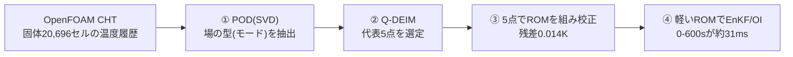

# blog_004：EnKFを軽くするROM ― POD で代表点を「データから」選ぶ

前回までの OI（blog_002）と EnKF（blog_003）は、**予報モデルを毎サイクル回す**のが前提でした。
ところが本物の予報モデルは **OpenFOAM CHT ＋ FrontISTR** の連成解析。1サイクル回すだけで分オーダーかかり、
EnKF のように **何十もの分身 × 何サイクル** も回すと、現実的な時間で終わりません。

そこでこの回は、**予報モデルだけを軽い ROM（縮約モデル）に置き換える**話です。ポイントは1つ:

> **ROM のノード（代表点）を「勘」で置かず、POD でデータから系統的に選ぶ。**

「PODでモードを出す → Q-DEIMで代表点を選ぶ → その点でROMを組んで校正 → EnKF/OIの予報を高速化」
という流れを、**数式 → 小さな行列の手計算 → 実データの図**の順で追います。

---

## 1. なぜ ROM が要るか ― EnKF は実ソルバだと重すぎる

EnKF（blog_003）は、**分身（アンサンブル）1つ1つについて予報モデルを前進**させます。ざっくり
**計算量 ≒（分身の数）×（サイクル数）×（予報モデル1回のコスト）** です。

- 実ソルバ（CHT＋FrontISTR）は **1サイクル（60秒ぶん）でも分オーダー**。
- これを **分身50〜200個 × 10サイクル**回すと、EnKF 1回で数時間〜数日。

一方、この記事で作る **POD選定5点ROM** は、**0→600秒の前進積分が約31ミリ秒**（実測）。
分身200個 × 10サイクルでも数十秒で終わります。**予報モデルをROMに差し替えるだけ**で、
同じ EnKF/OI が桁違いに軽くなる、というのが狙いです。

---

## 2. POD の数式 ― なぜ SVD で場の「型」が出るのか

### 2-1. スナップショット行列

各時刻の全セル温度を縦ベクトルにして横に並べます（ $N$ =セル数, $m$ =時刻数）:

$$X=\bigl[\,u(t_1)-\bar u,\ \dots,\ u(t_m)-\bar u\,\bigr]\in\mathbb{R}^{N\times m},\qquad
\bar u=\frac1m\sum_{k=1}^m u(t_k).$$

- $u(t_k)$ … その時刻の温度場まるごと（長さ $N$ の縦ベクトル）
- $\bar u$ … **セルごとの時間平均**（1枚の空間分布）。各セルから自分の平均を引く。
- $X$ の各列は「その時刻に各場所が平均からどれだけ上下したか（変動）」。

### 2-2. 「最良の型」を求める変分問題 → 固有値問題

場を1つの単位ベクトル $\varphi$ （ $\lVert\varphi\rVert=1$ ）で最もよく表す、とは
**各スナップショットの $\varphi$ 方向成分の二乗和を最大化**すること:

$$\max_{\lVert\varphi\rVert=1}\ \sum_{k=1}^{m}\bigl|\varphi^{\mathsf T}(u(t_k)-\bar u)\bigr|^2
=\max_{\lVert\varphi\rVert=1}\ \varphi^{\mathsf T}\bigl(XX^{\mathsf T}\bigr)\varphi.$$

ラグランジュ乗数 $\lambda$ で微分してゼロと置くと、**固有値問題**になります:

$$\boxed{\ (XX^{\mathsf T})\,\varphi=\lambda\,\varphi\ }$$

- 固有ベクトル $\varphi_k$ ＝ **PODモード（場の型）**
- 固有値 $\lambda_k=\sigma_k^2$ ＝ その型の **エネルギー**（大きいほど支配的）

### 2-3. SVD との同値（実際の計算法）

$X$ を特異値分解 $X=U\Sigma V^{\mathsf T}$ すると

$$XX^{\mathsf T}=U\Sigma V^{\mathsf T}V\Sigma U^{\mathsf T}=U\,\Sigma^2\,U^{\mathsf T}.$$

つまり **$U$ の各列がそのまま $XX^{\mathsf T}$ の固有ベクトル＝PODモード**、 $\sigma_k^2$ が固有値。
巨大な $XX^{\mathsf T}$ （ $N\times N$ ）を作らず、**SVD一発でPODが得られます**。
しかも上位 $r$ モードで打ち切った近似は、**ランク $r$ の全行列の中でフロベニウス誤差を最小**にする
（Eckart–Young の定理）＝「PODは最もエネルギー効率のよいモード分解」です。

---

## 3. 小さな行列で POD を手計算する（3セル × 4時刻）

言葉だけでは腑に落ちないので、**3セル(A,B,C) × 4時刻**の最小例で最後まで計算します。

**生の温度**（行＝場所、列＝時刻。右端が各行の時間平均 $\bar u_i$ ）:

| セル | $t_1$ | $t_2$ | $t_3$ | $t_4$ | 時間平均 $\bar u_i$ |
|---|---|---|---|---|---|
| A（ヒータ側） | 20 | 22 | 24 | 26 | **23** |
| B（中間） | 20 | 21 | 22 | 23 | **21.5** |
| C（反対側） | 20 | 20.5 | 21 | 21.5 | **20.75** |

各セルから自分の平均を引くと、PODに渡す変動行列 $X$ は

$$X=\begin{pmatrix}-3&-1&1&3\\ -1.5&-0.5&0.5&1.5\\ -0.75&-0.25&0.25&0.75\end{pmatrix}.$$

### 3-1. 相関行列 $XX^{\mathsf T}$ を作る

$XX^{\mathsf T}$ は「行（場所）どうしの内積」です。1行目どうし $=(-3)^2+(-1)^2+1^2+3^2=20$ 、
2行目は1行目のちょうど半分、3行目は1/4なので、

$$XX^{\mathsf T}=\begin{pmatrix}20&10&5\\ 10&5&2.5\\ 5&2.5&1.25\end{pmatrix}
=20\begin{pmatrix}1\\ 0.5\\ 0.25\end{pmatrix}\begin{pmatrix}1&0.5&0.25\end{pmatrix}.$$

右辺が **1つの縦ベクトルの外積**になっている＝この行列は **ランク1**。
つまり「場の変動は、たった1つの型で完全に説明できる」ことが、もう見えています。

### 3-2. 固有値と PODモード（文字式）

ランク1行列 $XX^{\mathsf T}=\lambda_1\,\varphi_1\varphi_1^{\mathsf T}$ の非ゼロ固有値と固有ベクトルは、
外積の中のベクトル $a=(1,\ 0.5,\ 0.25)^{\mathsf T}$ を正規化して得られます:

$$\varphi_1=\frac{a}{\lVert a\rVert},\qquad
\lVert a\rVert=\sqrt{1^2+0.5^2+0.25^2}=\sqrt{1.3125}=1.1456,$$

$$\varphi_1=\begin{pmatrix}0.873\\ 0.436\\ 0.218\end{pmatrix},\qquad
\lambda_1=\sigma_1^2=20\times\lVert a\rVert^2=20\times1.3125=26.25.$$

エネルギー比は $\lambda_1 / \mathrm{tr}(XX^{\mathsf T})=26.25/(20+5+1.25)=26.25/26.25=1$ 、
**モード1だけで100％**。読み方は「**A が強く・B が中・C が弱く、時間とともに一様に増える**」という
1つの型。これが「平均場＝下地、モード＝そこからの変動の型」という役割分担です。

（本物の場はランク1ではありませんが、後で見るように **モード1で91.8％**まで説明でき、構図は同じです。）

---

## 4. Q-DEIM ― どの点を測れば場を復元できるか

### 4-1. 少数点から場を復元する（gappy 再構成）

$r$ 点 $P$ の温度だけから、PODモードで全場を復元したい:

$$\hat u=\bar u+U_r\,a,\qquad a=\bigl(U_{r,P}\bigr)^{+}\bigl(u_P-\bar u_P\bigr).$$

ここで $U_{r,P}$ は「モード行列の、選んだ点の行だけ」を抜いた $r\times r$ 行列、
$u_P$ は選んだ点の測定値です。この復元が安定なのは $U_{r,P}$ が **良条件（可逆で条件数が小さい）** なとき。
だから「 $U_{r,P}$ の条件数を小さくする点集合 $P$ 」を選ぶ ―― これが **Q-DEIM**。
アルゴリズムは「モード行列の転置に **列枢軸付きQR分解** をかけ、最初の $r$ 個の枢軸列（＝行＝点）を選ぶ」だけです。

### 4-2. 手計算：1点で場が復元できることを確かめる

上の3セル例（モード1本）で $r=1$ 。 $U_1=\varphi_1=(0.873,\ 0.436,\ 0.218)^{\mathsf T}$ 。
枢軸QRは **絶対値が最大の成分**を最初の点に選ぶので、選ばれるのは **セルA**（0.873が最大）。
「一番よく振れる点を測れ」という直感どおりです。

では本当に **A の1点だけ**で場が戻るか。時刻 $t_3$ の真値 $u=(24,\ 22,\ 21)$ に対し、平均は $\bar u=(23,\ 21.5,\ 20.75)$ 。
**A だけ測る**と $u_A-\bar u_A=24-23=1$ 。係数は

$$a=\bigl(U_{1,A}\bigr)^{+}(u_A-\bar u_A)=\frac{1}{0.873}\times1=1.145,$$

$$\hat u=\bar u+\varphi_1\,a
=\begin{pmatrix}23\\ 21.5\\ 20.75\end{pmatrix}
+\begin{pmatrix}0.873\\ 0.436\\ 0.218\end{pmatrix}\times1.145
=\begin{pmatrix}24\\ 22\\ 21\end{pmatrix}.$$

**測っていない B・C まで、真値 22・21 にピタリ**。ランク1だから1点で完全復元、というのが数字で確認できました。
本物は2〜3モードなので、同じ理屈で **数点**あれば場が復元できます。これが「少数の代表点でROMを組める」根拠です。

### 4-3. 実際に選ばれた5点

本ケース（20,696セル）に Q-DEIM をかけて選ばれた5点:

*勘の流用点（すべて中央高さ）と違い、**底面(P3,P4)も選んで場を広くカバー**している。
「勘」ではなく「データから系統的に」選んだ点であることがポイント。*

---

## 5. 実データの POD 結果（図で確認）

### 5-1. モード＝場の「型」

*平均場＋モード1（91.8％）＋モード2（8.1％）で場の99.9％を説明。
モード1は「全体が同じだけ昇温」する一様な型（＝支配的）、モード2が「ヒータ側↔反対側」の偏り。*

エネルギー比（実データ）:

| モード | エネルギー比 | 累積 |
|---|---|---|
| モード1 | 91.81％ | 91.81％ |
| モード2 | 8.08％ | **99.89％** |
| モード3 | 0.11％ | 99.996％ |

**2モードで99.9％** ＝ 温度場は実質2自由度。だから少数点のROMで十分表せます。

### 5-2. モードを足すほど真値に近づく

*平均場のみ（誤差1.175K）→ ＋モード1（0.583K）→ ＋モード1,2（0.055K）→ ＋モード1,2,3（0.005K）。
モードを1つ足すごとに桁で誤差が縮む＝PODが効率よく場を捉えている証拠。*

---

## 6. 選んだ5点で ROM を組み、校正する

### 6-1. 一般化した集中定数モデル

選んだ任意配置の $n$ 点をノードとし、全点対をコンダクタンスで結びます:

$$C_i\frac{dT_i}{dt}=\sum_{j\ne i}K_{ij}(T_j-T_i)+q_i(t)-h\,(T_i-T_\mathrm{air}).$$

- $C_i$ … ノードの熱容量 [J/K]
- $K_{ij}$ … ノード間コンダクタンス [W/K]（対称・全点対、5点なら10本）
- $q_i$ … ヒータ発熱（ヒータ最近傍ノードに投入）
- $h$ … 放熱係数 [W/K]

行列形にすると線形システムになり、RK4 で一括前進積分できます（これが約31msの正体）。

### 6-2. 校正して OpenFOAM に合わせる

選んだ5点の **OpenFOAM温度履歴**を目標に、未知パラメータ $C[5],\ K[10],\ h$ を最小二乗で同定します:

*太い半透明線＝OpenFOAM、破線＝POD選定5点ROM。ほぼ完全に重なる。*

- **当てはめ残差 RMSE ＝ 0.014 K**（OpenFOAMをほぼ完全に再現）
- 全熱容量 $\sum C_i=1211$ J/K は、鋼2.49 kg の $\rho c_p V\approx1195$ J/K とほぼ一致
  （数字合わせでなく **物理的にも妥当**）

---

## 7. まとめ ― この記事でやったこと

1. **EnKFは実ソルバだと重い** → 予報モデルを軽い ROM に置き換える（0-600sが約31ms）。
2. **代表点は勘でなく POD＋Q-DEIM でデータから選ぶ**。
   - POD：スナップショット行列を SVD して場の「型」とエネルギーを抽出（ $XX^{\mathsf T}\varphi=\lambda\varphi$ ）。
   - Q-DEIM：モード行列に列枢軸QRをかけ、場を最もよく復元できる点を選定。
3. **小さな行列の手計算**で、ランク1なら1点測るだけで場が完全復元できることを確認した（ $\hat u=\bar u+U_r a$ ）。
4. 実データでは **2モードで99.9％**、選んだ5点ROMは **残差0.014K** で OpenFOAM を再現。

この軽い ROM の上で、**OI（blog_002）と EnKF（blog_003）** を回すと、温度場・発熱量 $Q$ ・放熱係数 $h$ を
少数観測から高速に推定できます。**「軽い予報モデル」と「賢い観測点」**の2本柱がそろいました。

---

### 参考（元になった実装・詳細）

- POD／Q-DEIM の数式と手続き：`01_pod_qdeim_algorithm.md`
- 代表点選定：`run/select_points_qdeim.py`
- ROM構築・校正：`run/build_calibrate_rom.py`, `dacore/rom_general.py`
- この上でのデータ同化：`blog_002_oi_data_assimilation.md`, `blog_003_ensemble_kalman_filter.md`
