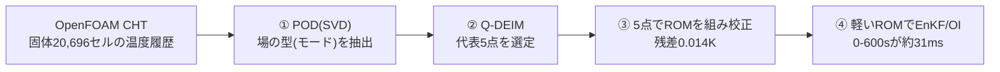

# blog_004：EnKFを軽くするROM ― POD で代表点を「データから」選ぶ

前回までの OI（blog_002）と EnKF（blog_003）は、**予報モデルを毎サイクル回す**のが前提でした。
ところが本物の予報モデルは **OpenFOAM CHT ＋ FrontISTR** の連成解析。1サイクル回すだけで分オーダーかかり、
EnKF のように **何十もの分身 × 何サイクル** も回すと、現実的な時間で終わりません。

そこでこの回は、**予報モデルだけを軽い ROM（縮約モデル）に置き換える**話です。ポイントは1つ:

> **ROM のノード（代表点）を「勘」で置かず、POD でデータから系統的に選ぶ。**

「PODでモードを出す → Q-DEIMで代表点を選ぶ → その点でROMを組んで校正 → EnKF/OIの予報を高速化」
という流れを、**数式 → 小さな行列の手計算 → 実データの図**の順で追います。

---

## 1. なぜ ROM が要るか ― EnKF は実ソルバだと重すぎる

EnKF（blog_003）は、**分身（アンサンブル）1つ1つについて予報モデルを前進**させます。ざっくり
**計算量 ≒（分身の数）×（サイクル数）×（予報モデル1回のコスト）** です。

- 実ソルバ（CHT＋FrontISTR）は **1サイクル（60秒ぶん）でも分オーダー**。
- これを **分身50〜200個 × 10サイクル**回すと、EnKF 1回で数時間〜数日。

一方、この記事で作る **POD選定5点ROM** は、**0→600秒の前進積分が約31ミリ秒**（実測）。
分身200個 × 10サイクルでも数十秒で終わります。**予報モデルをROMに差し替えるだけ**で、
同じ EnKF/OI が桁違いに軽くなる、というのが狙いです。

---

## 2. POD の数式 ― なぜ SVD で場の「型」が出るのか

### 2-1. スナップショット行列 ― 温度場の「写真」を横に並べる

まず言葉で。ある時刻の温度場（全セルの温度）を1枚の**写真**だと思ってください。
シミュレーションは時刻 $t_1,t_2,\dots,t_m$ の写真を $m$ 枚くれます。
この写真を **1枚＝1列** にして横に並べたのが、スナップショット行列 $S$ です
（**行＝場所＝セル**、**列＝時刻**。 $u_i(t_k)$ ＝セル $i$ の時刻 $t_k$ の温度）:

$$S=\begin{pmatrix}
u_1(t_1) & u_1(t_2) & \cdots & u_1(t_m)\\
u_2(t_1) & u_2(t_2) & \cdots & u_2(t_m)\\
\vdots & \vdots & \ddots & \vdots\\
u_N(t_1) & u_N(t_2) & \cdots & u_N(t_m)
\end{pmatrix}$$

（横に読むと **各行が1セルの時間履歴**、縦に読むと **各列が1時刻の温度場（1枚の写真）**）

- **縦の1列** $u(t_k)=(u_1(t_k),\dots,u_N(t_k))^{\mathsf T}$ … その時刻の温度場まるごと（1枚の写真）。
- **横の1行** … あるセルの温度が時間とともにどう動いたか（1点の時間履歴）。
- 本ケースは $N=20{,}696$ セル、 $m=121$ 枚（0〜600秒）。

次に **各セルから「そのセル自身の時間平均」を引きます**。平均は下地なので、そこからの**変動だけ**を見たいからです。
セル $i$ の時間平均を $\bar u_i=\frac1m\sum_k u_i(t_k)$ とし、これを各行から引いた行列を $X$ と書きます:

$$X=\bigl[\,u(t_1)-\bar u,\ \dots,\ u(t_m)-\bar u\,\bigr],\qquad
X_{ik}=u_i(t_k)-\bar u_i.$$

- $\bar u=(\bar u_1,\dots,\bar u_N)^{\mathsf T}$ … **セルごとの時間平均**（1枚の「平均写真」）。
- $X$ の各成分は「そのセルが、その時刻に、自分の平均からどれだけ上下したか（変動）」。
- 各行の平均はちょうど0（下地を抜いたので、残るのは揺れだけ）。

この **変動だけの写真束 $X$** から共通の「型」を取り出すのが、次のPODです。

### 2-2. 「最良の型」を求める変分問題 → 固有値問題

場を1つの単位ベクトル $\varphi$ （ $\lVert\varphi\rVert=1$ ）で最もよく表す、とは
**各スナップショットの $\varphi$ 方向成分の二乗和を最大化**すること:

$$\max_{\lVert\varphi\rVert=1}\ \sum_{k=1}^{m}\bigl|\varphi^{\mathsf T}(u(t_k)-\bar u)\bigr|^2
=\max_{\lVert\varphi\rVert=1}\ \varphi^{\mathsf T}\bigl(XX^{\mathsf T}\bigr)\varphi.$$

ラグランジュ乗数 $\lambda$ で微分してゼロと置くと、**固有値問題**になります:

$$\boxed{\ (XX^{\mathsf T})\,\varphi=\lambda\,\varphi\ }$$

- 固有ベクトル $\varphi_k$ ＝ **PODモード（場の型）**
- 固有値 $\lambda_k=\sigma_k^2$ ＝ その型の **エネルギー**（大きいほど支配的）

### 2-3. SVD との同値（実際の計算法）

$X$ を特異値分解 $X=U\Sigma V^{\mathsf T}$ すると

$$XX^{\mathsf T}=U\Sigma V^{\mathsf T}V\Sigma U^{\mathsf T}=U\,\Sigma^2\,U^{\mathsf T}.$$

つまり **$U$ の各列がそのまま $XX^{\mathsf T}$ の固有ベクトル＝PODモード**、 $\sigma_k^2$ が固有値。
巨大な $XX^{\mathsf T}$ （ $N\times N$ ）を作らず、**SVD一発でPODが得られます**。
しかも上位 $r$ モードで打ち切った近似は、**ランク $r$ の全行列の中でフロベニウス誤差を最小**にする
（Eckart–Young の定理）＝「PODは最もエネルギー効率のよいモード分解」です。

---

## 3. 小さな行列で POD を手計算する（3セル × 4時刻・文字式）

言葉だけでは腑に落ちないので、**3セル(A,B,C) × 4時刻**の最小例で最後まで計算します。
数字だと構造が見えにくいので、**文字式**で進めます。ポイントは、各セルの温度を

$$u_i(t_k)=\bar u_i+a_i\,g_k,\qquad \sum_{k=1}^4 g_k=0$$

と置くこと。ここで $\bar u_i$ は **下地（時間平均）**、 $a_i$ は **その場所の変動の強さ**、
$g_k$ は **全セル共通の時間プロファイル**（平均を引いてあるので総和ゼロ）。
「**場所ごとの強さ $a_i$**」と「**時間の動き $g_k$**」の積で温度が決まる、という素直な仮定です。

| セル | $t_1$ | $t_2$ | $t_3$ | $t_4$ | 時間平均 |
|---|---|---|---|---|---|
| A（ヒータ側） | $\bar u_A+a_A g_1$ | $\bar u_A+a_A g_2$ | $\bar u_A+a_A g_3$ | $\bar u_A+a_A g_4$ | $\bar u_A$ |
| B（中間） | $\bar u_B+a_B g_1$ | $\bar u_B+a_B g_2$ | $\bar u_B+a_B g_3$ | $\bar u_B+a_B g_4$ | $\bar u_B$ |
| C（反対側） | $\bar u_C+a_C g_1$ | $\bar u_C+a_C g_2$ | $\bar u_C+a_C g_3$ | $\bar u_C+a_C g_4$ | $\bar u_C$ |

ヒータ側ほど強く反応するので $a_A>a_B>a_C>0$ 。各セルから自分の平均 $\bar u_i$ を引くと、
PODに渡す変動行列 $X$ は **場所ベクトル $a$ と 時間ベクトル $g$ の外積** になります:

$$X=\begin{pmatrix}a_A g_1 & a_A g_2 & a_A g_3 & a_A g_4\\
a_B g_1 & a_B g_2 & a_B g_3 & a_B g_4\\
a_C g_1 & a_C g_2 & a_C g_3 & a_C g_4\end{pmatrix}
=\begin{pmatrix}a_A\\ a_B\\ a_C\end{pmatrix}\bigl(g_1,\ g_2,\ g_3,\ g_4\bigr)
=a\,g^{\mathsf T}.$$

**この時点で $X=a\,g^{\mathsf T}$ ＝ランク1**（1つの空間パターン × 1つの時間プロファイル）。
「場の変動は、たった1つの型で説明できる」ことが、もう形から見えています。

### 3-1. 相関行列 $XX^{\mathsf T}$ を作る

$X=a\,g^{\mathsf T}$ を代入するだけです。 $g^{\mathsf T}g=\lVert g\rVert^2$ はただのスカラーなので、

$$XX^{\mathsf T}=a\,g^{\mathsf T}\,g\,a^{\mathsf T}=\lVert g\rVert^2\,a\,a^{\mathsf T},\qquad
\lVert g\rVert^2=\sum_{k=1}^4 g_k^2.$$

右辺は **場所ベクトル $a$ の外積 $a a^{\mathsf T}$ の定数倍** ＝ やはり **ランク1**。
時間プロファイル $g$ は「大きさ $\lVert g\rVert^2$ 」という1個の数にまとまり、
**空間の型は $a$ だけで決まる**ことが読み取れます。

### 3-2. 固有値と PODモード（文字式）

ランク1行列 $XX^{\mathsf T}=\lVert g\rVert^2\,a a^{\mathsf T}$ の非ゼロ固有ベクトルは $a$ の向き、固有値はその係数です。
PODモード $\varphi_1$ とエネルギー $\lambda_1$ は

$$\varphi_1=\frac{a}{\lVert a\rVert},\qquad
\lambda_1=\sigma_1^2=\lVert g\rVert^2\,\lVert a\rVert^2.$$

他の固有値はすべて0なので、エネルギー比は

$$\frac{\lambda_1}{\mathrm{tr}(XX^{\mathsf T})}=\frac{\lVert g\rVert^2\lVert a\rVert^2}{\lVert g\rVert^2\lVert a\rVert^2}=1,$$

すなわち **モード1だけで100％**。
モード $\varphi_1=a/\lVert a\rVert$ の中身は「**各セルの変動の強さの比 $a_A:a_B:a_C$**」そのもの。
つまり PODモードとは「**どの場所がどれだけ強く動くか**」という空間パターンで、
$\bar u$ ＝下地、 $\varphi_1$ ＝そこからの変動の型、という役割分担です。

（本物の場は完全なランク1ではありませんが、後で見るように **モード1で91.8％**まで説明でき、構図は同じです。）

---

## 4. Q-DEIM ― どの点を測れば場を復元できるか

### 4-1. 少数点から場を復元する（gappy 再構成）

$r$ 点 $P$ の温度だけから、PODモードで全場を復元したい:

$$\hat u=\bar u+U_r\,a,\qquad a=\bigl(U_{r,P}\bigr)^{+}\bigl(u_P-\bar u_P\bigr).$$

ここで $U_{r,P}$ は「モード行列の、選んだ点の行だけ」を抜いた $r\times r$ 行列、
$u_P$ は選んだ点の測定値です。この復元が安定なのは $U_{r,P}$ が **良条件（可逆で条件数が小さい）** なとき。
だから「 $U_{r,P}$ の条件数を小さくする点集合 $P$ 」を選ぶ ―― これが **Q-DEIM**。
アルゴリズムは「モード行列の転置に **列枢軸付きQR分解** をかけ、最初の $r$ 個の枢軸列（＝行＝点）を選ぶ」だけです。

### 4-2. 手計算：1点で場が復元できることを確かめる（文字式）

上の3セル例（モード1本）で $r=1$ 、 $U_1=\varphi_1=a/\lVert a\rVert$ 。
枢軸QRは **絶対値が最大の成分**を最初の点に選ぶので、 $a_A>a_B>a_C$ より選ばれるのは **セルA**
（一番よく振れる点）。「振れの大きい場所を測れ」という直感どおりです。

では本当に **A の1点だけ**で場全体が戻るか。ある時刻 $t_k$ で **A だけ測る**と、
測定値の変動は $u_A(t_k)-\bar u_A=a_A g_k$ 。選点行は $U_{1,A}=\varphi_1[A]=a_A/\lVert a\rVert$ なので、係数は

$$\alpha=\bigl(U_{1,A}\bigr)^{+}\bigl(u_A-\bar u_A\bigr)
=\frac{\lVert a\rVert}{a_A}\times a_A g_k=\lVert a\rVert\,g_k.$$

これを全場に伸ばすと、

$$\hat u=\bar u+\varphi_1\,\alpha
=\bar u+\frac{a}{\lVert a\rVert}\times\lVert a\rVert\,g_k
=\bar u+a\,g_k.$$

一方、真値は §3 の定義そのまま $u(t_k)=\bar u+a\,g_k$ 。つまり

$$\boxed{\ \hat u=\bar u+a\,g_k=u(t_k)\ }$$

**測っていない B・C まで、真値にピタリ一致**。 $\lVert a\rVert$ がきれいに約分して消えるのがミソで、
**ランク1なら1点測るだけで場が完全復元**できる、というのが文字式で最後まで確認できました。
本物は2〜3モードなので、同じ理屈で **数点**あれば場が復元できます。これが「少数の代表点でROMを組める」根拠です。

### 4-3. 実際に選ばれた5点

本ケース（20,696セル）に Q-DEIM をかけて選ばれた5点:

*勘の流用点（すべて中央高さ）と違い、**底面(P3,P4)も選んで場を広くカバー**している。
「勘」ではなく「データから系統的に」選んだ点であることがポイント。*

---

## 5. 実データの POD 結果（図で確認）

### 5-1. モード＝場の「型」

*平均場＋モード1（91.8％）＋モード2（8.1％）で場の99.9％を説明。
モード1は「全体が同じだけ昇温」する一様な型（＝支配的）、モード2が「ヒータ側↔反対側」の偏り。*

エネルギー比（実データ）:

| モード | エネルギー比 | 累積 |
|---|---|---|
| モード1 | 91.81％ | 91.81％ |
| モード2 | 8.08％ | **99.89％** |
| モード3 | 0.11％ | 99.996％ |

**2モードで99.9％** ＝ 温度場は実質2自由度。だから少数点のROMで十分表せます。

### 5-2. モードを足すほど真値に近づく

*平均場のみ（誤差1.175K）→ ＋モード1（0.583K）→ ＋モード1,2（0.055K）→ ＋モード1,2,3（0.005K）。
モードを1つ足すごとに桁で誤差が縮む＝PODが効率よく場を捉えている証拠。*

---

## 6. 選んだ5点で ROM を組み、校正する

### 6-1. 一般化した集中定数モデル

**ノードは §4 で選んだ5点そのもの**（P0〜P4）。その各ノード $i$ について、次の1本を立てます
（ $i=0,1,2,3,4$ の**5本**の連立式）:

$$C_i\frac{dT_i}{dt}=\sum_{j\ne i}K_{ij}(T_j-T_i)+q_i(t)-h\,(T_i-T_\mathrm{air}).$$

右辺は左から「**他ノードからの熱流入**」「**発熱**」「**空気への放熱**」の3項です。

- $C_i$ … ノード $i$ の熱容量 [J/K]
- $K_{ij}$ … ノード $i,j$ 間コンダクタンス [W/K]（対称・全点対、5点なら10本）
- $q_i$ … 発熱。**ヒータ最近傍ノード P2 だけに投入**（他は $q_i=0$ ）
- $h$ … 放熱係数 [W/K]

「どのノードの式か」を3Dで示すと（ParaView風）:

*ノード＝POD＋Q-DEIM選定5点。各辺の太さが校正で決まったコンダクタンス $K_{ij}$ で、
**P0–P2 が最強（ $K=17.5$ ）**＝ヒータ側どうしが強く熱をやり取りする。
**オレンジのP2がヒータ発熱ノード**（ $q$ を投入）、そこから P0→P3→…と全ノードへ熱が伝わる。
底面 P3・P4 は弱い結合で、冷えやすい末端。*

各ノードの熱容量 $C_i$ ・結合 $K_{ij}$ ・放熱 $h$ は次の6-2で実データに合わせて決めます。
行列形にすると線形システムになり、RK4 で一括前進積分できます（これが約31msの正体）。

### 6-2. 校正して OpenFOAM に合わせる

選んだ5点の **OpenFOAM温度履歴**を目標に、未知パラメータ $C[5],\ K[10],\ h$ を最小二乗で同定します:

*太い半透明線＝OpenFOAM、破線＝POD選定5点ROM。ほぼ完全に重なる。*

- **当てはめ残差 RMSE ＝ 0.014 K**（OpenFOAMをほぼ完全に再現）
- 全熱容量 $\sum C_i=1211$ J/K は、鋼2.49 kg の $\rho c_p V\approx1195$ J/K とほぼ一致
  （数字合わせでなく **物理的にも妥当**）

---

## 7. まとめ ― この記事でやったこと

1. **EnKFは実ソルバだと重い** → 予報モデルを軽い ROM に置き換える（0-600sが約31ms）。
2. **代表点は勘でなく POD＋Q-DEIM でデータから選ぶ**。
   - POD：スナップショット行列を SVD して場の「型」とエネルギーを抽出（ $XX^{\mathsf T}\varphi=\lambda\varphi$ ）。
   - Q-DEIM：モード行列に列枢軸QRをかけ、場を最もよく復元できる点を選定。
3. **小さな行列の手計算**で、ランク1なら1点測るだけで場が完全復元できることを確認した（ $\hat u=\bar u+U_r a$ ）。
4. 実データでは **2モードで99.9％**、選んだ5点ROMは **残差0.014K** で OpenFOAM を再現。

この軽い ROM の上で、**OI（blog_002）と EnKF（blog_003）** を回すと、温度場・発熱量 $Q$ ・放熱係数 $h$ を
少数観測から高速に推定できます。**「軽い予報モデル」と「賢い観測点」**の2本柱がそろいました。

---

### 参考（元になった実装・詳細）

- POD／Q-DEIM の数式と手続き：`01_pod_qdeim_algorithm.md`
- 代表点選定：`run/select_points_qdeim.py`
- ROM構築・校正：`run/build_calibrate_rom.py`, `dacore/rom_general.py`
- この上でのデータ同化：`blog_002_oi_data_assimilation.md`, `blog_003_ensemble_kalman_filter.md`
