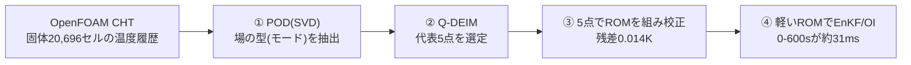
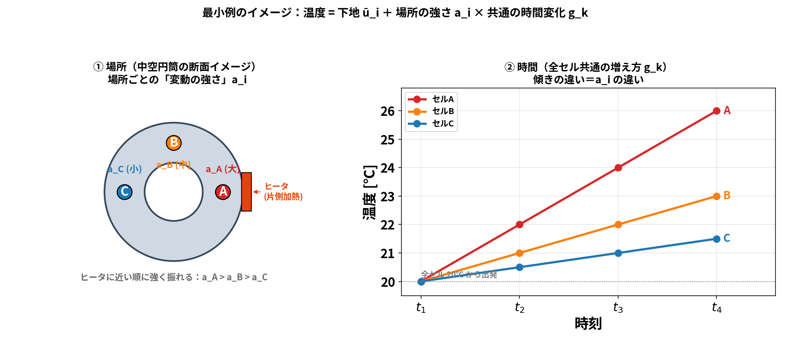
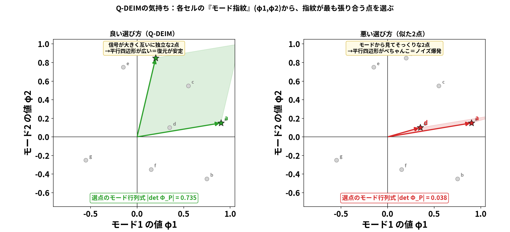
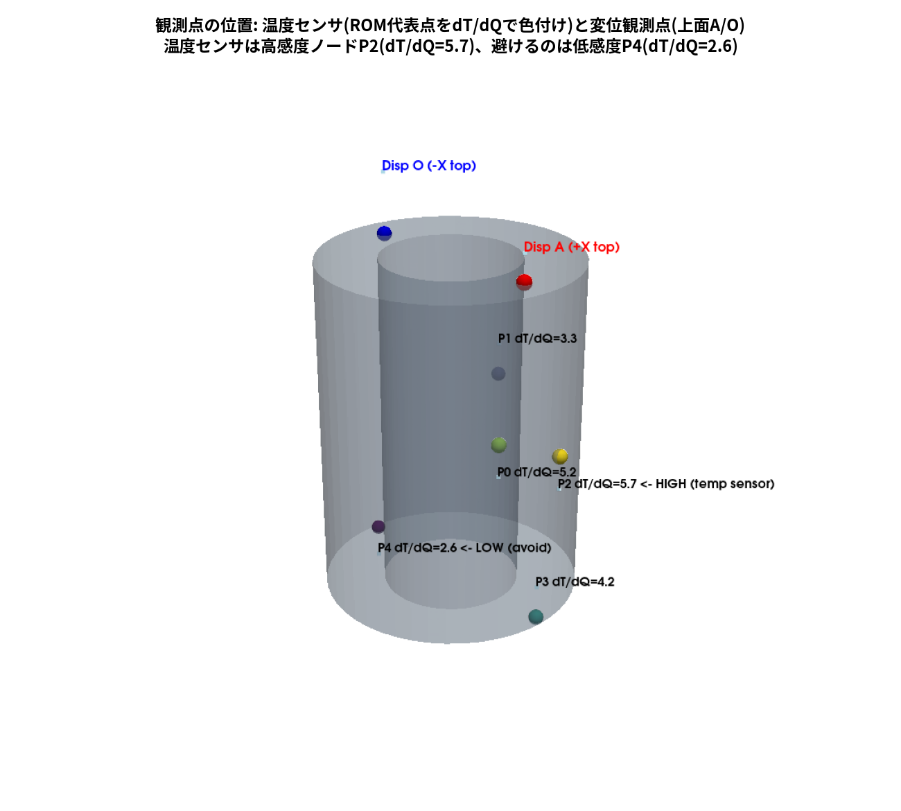
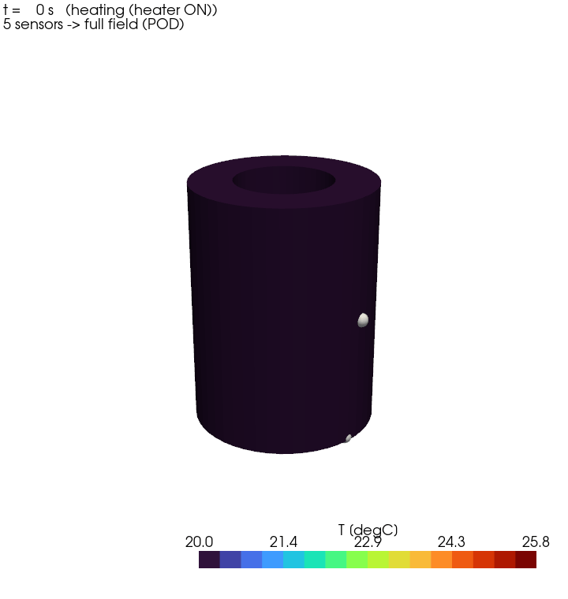
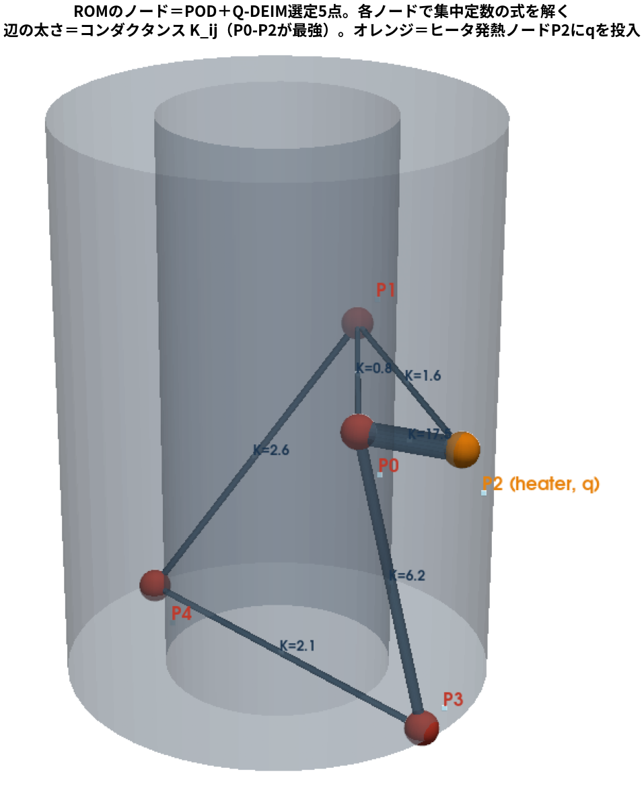
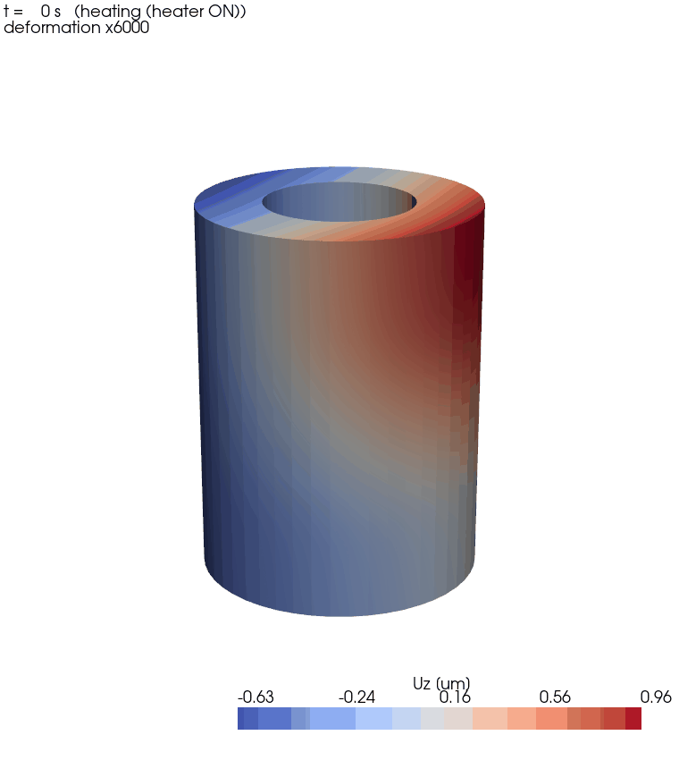
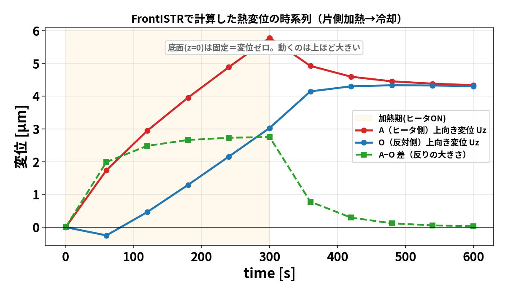
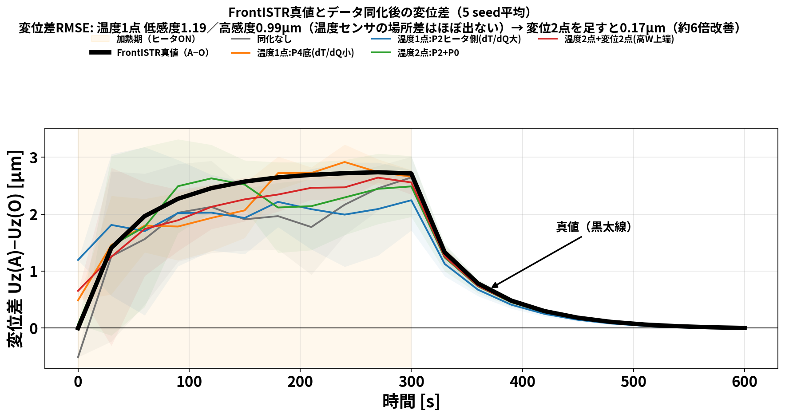

# blog_004：EnKFを軽くするROM ― POD で代表点を「データから」選ぶ

前回までの OI（blog_002）と EnKF（blog_003）は、**予報モデルを毎サイクル回す**のが前提でした。
ところが本物の予報モデルは **OpenFOAM CHT ＋ FrontISTR** の連成解析。1サイクル回すだけで分オーダーかかり、
EnKF のように **何十もの分身 × 何サイクル** も回すと、現実的な時間で終わりません。

そこでこの回は、**予報モデルだけを軽い ROM（縮約モデル）に置き換える**話です。ポイントは1つ:

> **ROM のノード（代表点）を「勘」で置かず、POD でデータから系統的に選ぶ。**

「PODでモードを出す → Q-DEIMで代表点を選ぶ → その点でROMを組んで校正 → EnKF/OIの予報を高速化」
という流れを、**数式 → 小さな行列の手計算 → 実データの図**の順で追います。



---

## 1. なぜ ROM が要るか ― EnKF は実ソルバだと重すぎる

EnKF（blog_003）は、**分身（アンサンブル）1つ1つについて予報モデルを前進**させます。ざっくり
**計算量 ≒（分身の数）×（サイクル数）×（予報モデル1回のコスト）** です。

- 実ソルバ（CHT＋FrontISTR）は **1サイクル（60秒ぶん）でも分オーダー**。
- これを **分身50〜200個 × 10サイクル**回すと、EnKF 1回で数時間〜数日。

一方、この記事で作る **POD選定5点ROM** は、**0→600秒の前進積分が約31ミリ秒**（実測）。
分身200個 × 10サイクルでも数十秒で終わります。**予報モデルをROMに差し替えるだけ**で、
同じ EnKF/OI が桁違いに軽くなる、というのが狙いです。

### 1-1. 大事な注意 ― ROMはCFDを「本番ループ」でだけ置き換える

「ROMにしたらもうOpenFOAMは要らない？」と思いがちですが、そうではありません。
処理は **オフライン（準備）** と **オンライン（本番）** に分かれます:

| フェーズ | 何をする | OpenFOAM(CHT) | 回数 |
|---|---|---|---|
| **オフライン（準備）** | CHTでスナップショット生成 → POD → Q-DEIM → 校正 | **必須**（ROMの材料） | **1回だけ** |
| **オンライン（本番）** | 軽いROMでEnKF/OIを回して温度・ $Q$ ・ $h$ を推定 | **使わない**（ROM 31ms） | 何十〜何百回 |

- **ROMはCFDの"蒸留物"**：モードも代表点も係数 $C,K,h$ も、**すべてOpenFOAMの結果から作られます**。
  CFDが無ければROMは存在しない。ROMは3D連成解析の **代役**であって、独立した物理ソルバではありません。
- つまり「**高価なCFDを一度だけ払い → その後は安価なリアルタイム能力を得る**」という前払い構造。
  OpenFOAMのメリットが消えたのではなく、ROMという形に **凝縮して前倒しした**だけです。
- **有効範囲に注意**：ROMは訓練データが覆った範囲でしか正しくない（外挿は苦手）。
  **形状・境界条件・加熱シナリオが大きく変わると無効**になり、CFDを回して作り直し／再校正が要ります。

---

## 2. POD の数式 ― なぜ SVD で場の「型」が出るのか

### 2-1. スナップショット行列 ― 温度場の「写真」を横に並べる

まず言葉で。ある時刻の温度場（全セルの温度）を1枚の**写真**だと思ってください。
シミュレーションは時刻 $t_1,t_2,\dots,t_m$ の写真を $m$ 枚くれます。
この写真を **1枚＝1列** にして横に並べたのが、スナップショット行列 $S$ です
（**行＝場所＝セル**、**列＝時刻**。 $u_i(t_k)$ ＝セル $i$ の時刻 $t_k$ の温度）:

$$S=\begin{pmatrix}
u_1(t_1) & u_1(t_2) & \cdots & u_1(t_m)\\
u_2(t_1) & u_2(t_2) & \cdots & u_2(t_m)\\
\vdots & \vdots & \ddots & \vdots\\
u_N(t_1) & u_N(t_2) & \cdots & u_N(t_m)
\end{pmatrix}$$

（横に読むと **各行が1セルの時間履歴**、縦に読むと **各列が1時刻の温度場（1枚の写真）**）

- **縦の1列** $u(t_k)=(u_1(t_k),\dots,u_N(t_k))^{\mathsf T}$ … その時刻の温度場まるごと（1枚の写真）。
- **横の1行** … あるセルの温度が時間とともにどう動いたか（1点の時間履歴）。
- 本ケースは $N=20{,}696$ セル、 $m=121$ 枚（0〜600秒）。

次に **各セルから「そのセル自身の時間平均」を引きます**。平均は下地なので、そこからの**変動だけ**を見たいからです。
セル $i$ の時間平均を $\bar u_i=\frac1m\sum_k u_i(t_k)$ とし、これを各行から引いた行列を $X$ と書きます:

$$X=\bigl[\,u(t_1)-\bar u,\ \dots,\ u(t_m)-\bar u\,\bigr],\qquad
X_{ik}=u_i(t_k)-\bar u_i.$$

- $\bar u=(\bar u_1,\dots,\bar u_N)^{\mathsf T}$ … **セルごとの時間平均**（1枚の「平均写真」）。
- $X$ の各成分は「そのセルが、その時刻に、自分の平均からどれだけ上下したか（変動）」。
- 各行の平均はちょうど0（下地を抜いたので、残るのは揺れだけ）。

この **変動だけの写真束 $X$** から共通の「型」を取り出すのが、次のPODです。

### 2-2. 「最良の型」を求める変分問題 → 固有値問題

場を1つの単位ベクトル $\varphi$ （ $\lVert\varphi\rVert=1$ ）で最もよく表す、とは
**各スナップショットの $\varphi$ 方向成分の二乗和を最大化**すること:

$$\max_{\lVert\varphi\rVert=1}\ \sum_{k=1}^{m}\bigl|\varphi^{\mathsf T}(u(t_k)-\bar u)\bigr|^2
=\max_{\lVert\varphi\rVert=1}\ \varphi^{\mathsf T}\bigl(XX^{\mathsf T}\bigr)\varphi.$$

ラグランジュ乗数 $\lambda$ で微分してゼロと置くと、**固有値問題**になります:

$$\boxed{\ (XX^{\mathsf T})\,\varphi=\lambda\,\varphi\ }$$

- 固有ベクトル $\varphi_k$ ＝ **PODモード（場の型）**
- 固有値 $\lambda_k=\sigma_k^2$ ＝ その型の **エネルギー**（大きいほど支配的）

### 2-3. SVD との同値（実際の計算法）

$X$ を特異値分解 $X=U\Sigma V^{\mathsf T}$ すると

$$XX^{\mathsf T}=U\Sigma V^{\mathsf T}V\Sigma U^{\mathsf T}=U\,\Sigma^2\,U^{\mathsf T}.$$

つまり **$U$ の各列がそのまま $XX^{\mathsf T}$ の固有ベクトル＝PODモード**、 $\sigma_k^2$ が固有値。
巨大な $XX^{\mathsf T}$ （ $N\times N$ ）を作らず、**SVD一発でPODが得られます**。
しかも上位 $r$ モードで打ち切った近似は、**ランク $r$ の全行列の中でフロベニウス誤差を最小**にする
（Eckart–Young の定理）＝「PODは最もエネルギー効率のよいモード分解」です。

### 2-4. 用語の整理 ― POD・SVD・特異値分解の違い

ここで混乱しやすい3語を整理します。まず大前提:

> **SVD ＝ 特異値分解**（Singular Value Decomposition）は **同じもの**。
> 英語の略称か日本語かの違いだけで、中身は1つ。だから区別すべきは実質 **「SVD（＝特異値分解）」と「POD」の2つ**です。

- **SVD（＝特異値分解）** … **どんな行列にも使える線形代数の"道具"**。行列を $X=U\Sigma V^{\mathsf T}$ の3つに分解する操作、それ以上でも以下でもありません。物理も温度も知りません。
- **POD（固有直交分解）** … **データから"エネルギー最大の型"を取り出す"目的・考え方"**。その計算に SVD を使います。「PODをする」＝実際には「平均を引いた $X$ を SVD し、 $U$ の列を"モード"、 $\sigma_k^2$ を"エネルギー"と読む」こと。

| 用語 | 正体 | 立場 |
|---|---|---|
| **特異値分解** | SVD の日本語名（＝SVDそのもの） | ― |
| **SVD** | $X=U\Sigma V^{\mathsf T}$ の行列分解 | 汎用の **計算道具** |
| **POD** | 場のエネルギー最大の直交モードを取る | **目的・解釈**（平均除去・重み・エネルギー意味づけを追加） |

つまり **「POD は SVD と別物」ではなく、SVD は POD を計算する道具**。POD側には「①平均を引く ②（体積などで重みを付けた）エネルギーで最良性を測る ③上位数モードで場を代表させる」という"味付け"が加わります。
統計の **PCA（主成分分析）** や確率過程の **Karhunen–Loève 展開** も、呼び名が違うだけで本質は同じ仲間です。

（別解：SVDを使わず $XX^{\mathsf T}$ の固有値分解や、時間側の小さい $X^{\mathsf T}X$ を解く"スナップショット法"でも、同じPODモードが得られます。SVDはその中で最も安定・簡単な計算法という位置づけ。）

### 2-5. コラム：POD以外のモデル縮約 ― クリロフ部分空間法との違い

モデル縮約（MOR: Model Order Reduction）にはPOD以外の流派もあります。代表は
**クリロフ部分空間法**（モーメントマッチング、Arnoldi法など）と **平衡打切り**（balanced truncation）。
どれも「大きい系を小さい部分空間へ射影する」仲間で、違いは **部分空間の作り方** です:

| | **POD** | **クリロフ部分空間法** | **平衡打切り** |
|---|---|---|---|
| 部分空間の材料 | **データ**（スナップショットのSVD） | **方程式の行列**： $\mathrm{span}(b,\ Ab,\ A^2b,\dots)$ | 可制御性・可観測性グラミアン |
| 事前に必要なもの | シミュレーション結果だけ | システム行列 $A,\ b$ （FEMの $C,K$ ） | システム行列＋リアプノフ方程式求解 |
| 何に忠実か | 訓練データのエネルギー | 伝達関数のモーメント（周波数応答） | 入出力の重要度（誤差上界つき） |
| 非線形への拡張 | DEIM等で可能 | 基本は線形（LTI）系向け | 基本は線形系向け |
| 弱点 | **訓練条件に依存**（外挿に弱い） | **侵入的**＝行列へのアクセスが必要 | 大規模系では計算が重い |

#### そもそも「クリロフ部分空間」とは何か ― 3ノードの手計算で

名前は難しいですが、定義は1行です。行列 $A$ と入力ベクトル $b$ から作る

$$\mathcal K_r(A,b)=\mathrm{span}\{\,b,\ Ab,\ A^2b,\ \dots,\ A^{r-1}b\,\}$$

＝「 $b$ に $A$ を繰り返し掛けてできる方向を集めた空間」。これだけです。
**物理的な意味は「入力の影響が系の中を伝わっていく順番」**。3ノードの熱伝導（ヒータは端の節点1）で確かめます:

$$A=\begin{pmatrix}-1&1&0\\ 1&-2&1\\ 0&1&-1\end{pmatrix},\qquad
b=\begin{pmatrix}1\\ 0\\ 0\end{pmatrix}\quad(\text{node 1 heated}).$$

$A$ を順に掛けると:

$$b=\begin{pmatrix}1\\ 0\\ 0\end{pmatrix},\qquad
Ab=\begin{pmatrix}-1\\ 1\\ 0\end{pmatrix},\qquad
A^2b=\begin{pmatrix}2\\ -3\\ 1\end{pmatrix}.$$

- $b$ ：熱はまだ **節点1だけ**
- $Ab$ ：**節点2に届いた**（成分が非ゼロに）
- $A^2b$ ：**節点3まで届いた**

つまり **$A$ を1回掛ける＝熱が隣へ1ステップ伝わる**。クリロフ基底は「ヒータの影響が届く順」に空間を張っていきます。
これが解と直結する理由は、熱方程式 $\dot T=AT+bQ$ の解に出てくる行列指数関数のテイラー級数

$$e^{At}b=b+tAb+\frac{t^2}{2}A^2b+\cdots$$

が **まさにクリロフ方向の和** だから。早い項ほど支配的なので、**最初の $r$ 方向だけ残して打ち切っても良い近似**になる
＝これがクリロフ縮約の原理です。実際の手順は:

1. $b, Ab, A^2b,\dots$ を **Arnoldi法**（グラム・シュミット直交化と同じ発想）で直交基底 $V_r$ にする
   （生の $A^kb$ はすぐ同じ向きに揃ってしまい数値的に危ないため）。
2. 大きい系を $T\approx V_r\,a$ と置いて射影： $\dot a=(V_r^{\mathsf T}AV_r)\,a+V_r^{\mathsf T}b\,Q$ 。
   これで $N$ 次元の方程式が **$r\times r$ の小さい方程式**になります。

PODとの対比で言うと：**PODは「シミュレーション結果（データ）」から支配方向を後付けで学ぶ**のに対し、
**クリロフは「方程式（ $A,b$ ）」から支配方向を計算前に組み立てる**。だからクリロフはスナップショット不要ですが、
行列 $A,b$ に触れる必要がある（侵入的）、という表の違いにつながります。

**本研究がPODを選んだ理由は2つ**:

1. **非侵入的（non-intrusive）だから**。クリロフ法や平衡打切りは $A, b$ という**行列そのもの**が必要ですが、
   OpenFOAMのCHTソルバから系行列を取り出すのは大変です。PODは **温度スナップショット（solid/Tのファイル）さえあればいい**。
2. **「代表点」が欲しかったから**。POD→Q-DEIMは **物理的な点（セル）** を選んでくれるので、
   センサ議論・集中定数ROM・観測設計に直結します。クリロフ法の縮約座標は抽象的な部分空間で、
   「どの場所」という解釈がつきません。

なお熱伝導は線形なので、行列が手に入る場合（FrontISTR側など）は **クリロフ法も有力な代替**です
（工作機械の熱モデル縮約で実績があります）。また本記事のROMは厳密には「PODのGalerkin射影ROM」ではなく、
**Q-DEIM点上の集中定数モデルを校正**したもの（PODは点選びと場の復元に使用）。
$C_i, K_{ij}, h$ という**物理的に読める係数**にしたことで、EnKFの拡大状態（ $Q,h$ 推定）へ自然につながります。

---

## 3. 小さな行列で POD を手計算する（3セル × 4時刻・文字式）

言葉だけでは腑に落ちないので、**3セル(A,B,C) × 4時刻**の最小例で最後まで計算します。
数字だと構造が見えにくいので、**文字式**で進めます。ポイントは、各セルの温度を

$$u_i(t_k)=\bar u_i+a_i\,g_k,\qquad \sum_{k=1}^4 g_k=0$$

と置くこと。ここで $\bar u_i$ は **下地（時間平均）**、 $a_i$ は **その場所の変動の強さ**、
$g_k$ は **全セル共通の時間プロファイル**（平均を引いてあるので総和ゼロ）。
「**場所ごとの強さ $a_i$**」と「**時間の動き $g_k$**」の積で温度が決まる、という素直な仮定です。

イメージはこうです ―― **中空円筒を片側から加熱**し、ヒータ側から順に A（強）・B（中）・C（弱）の3セルを取ります。
3セルとも同じように昇温しますが（共通の $g_k$ ）、ヒータに近いほど大きく振れます（ $a_A>a_B>a_C$ ）:



*左＝場所（断面イメージ）：ヒータに近い順に「変動の強さ」 $a_i$ が大きい。
右＝時間：3セルは同じ増え方 $g_k$ を共有し、**傾き（振れ幅）の違いが $a_i$ の違い**。
この「場所 $a_i$ × 時間 $g_k$ 」という掛け算の形が、次で効いてきます。*

| セル | $t_1$ | $t_2$ | $t_3$ | $t_4$ | 時間平均 |
|---|---|---|---|---|---|
| A（ヒータ側） | $\bar u_A+a_A g_1$ | $\bar u_A+a_A g_2$ | $\bar u_A+a_A g_3$ | $\bar u_A+a_A g_4$ | $\bar u_A$ |
| B（中間） | $\bar u_B+a_B g_1$ | $\bar u_B+a_B g_2$ | $\bar u_B+a_B g_3$ | $\bar u_B+a_B g_4$ | $\bar u_B$ |
| C（反対側） | $\bar u_C+a_C g_1$ | $\bar u_C+a_C g_2$ | $\bar u_C+a_C g_3$ | $\bar u_C+a_C g_4$ | $\bar u_C$ |

ヒータ側ほど強く反応するので $a_A>a_B>a_C>0$ 。各セルから自分の平均 $\bar u_i$ を引くと、
PODに渡す変動行列 $X$ は **場所ベクトル $a$ と 時間ベクトル $g$ の外積** になります:

$$X=\begin{pmatrix}a_A g_1 & a_A g_2 & a_A g_3 & a_A g_4\\
a_B g_1 & a_B g_2 & a_B g_3 & a_B g_4\\
a_C g_1 & a_C g_2 & a_C g_3 & a_C g_4\end{pmatrix}
=\begin{pmatrix}a_A\\ a_B\\ a_C\end{pmatrix}\bigl(g_1,\ g_2,\ g_3,\ g_4\bigr)
=a\,g^{\mathsf T}.$$

**この時点で $X=a\,g^{\mathsf T}$ ＝ランク1**（1つの空間パターン × 1つの時間プロファイル）。
「場の変動は、たった1つの型で説明できる」ことが、もう形から見えています。

### 3-1. 相関行列 $XX^{\mathsf T}$ を作る

$X=a\,g^{\mathsf T}$ を代入するだけです。 $g^{\mathsf T}g=\lVert g\rVert^2$ はただのスカラーなので、

$$XX^{\mathsf T}=a\,g^{\mathsf T}\,g\,a^{\mathsf T}=\lVert g\rVert^2\,a\,a^{\mathsf T},\qquad
\lVert g\rVert^2=\sum_{k=1}^4 g_k^2.$$

右辺は **場所ベクトル $a$ の外積 $a a^{\mathsf T}$ の定数倍** ＝ やはり **ランク1**。
時間プロファイル $g$ は「大きさ $\lVert g\rVert^2$ 」という1個の数にまとまり、
**空間の型は $a$ だけで決まる**ことが読み取れます。

### 3-2. 固有値と PODモード（文字式）

ランク1行列 $XX^{\mathsf T}=\lVert g\rVert^2\,a a^{\mathsf T}$ の非ゼロ固有ベクトルは $a$ の向き、固有値はその係数です。
PODモード $\varphi_1$ とエネルギー $\lambda_1$ は

$$\varphi_1=\frac{a}{\lVert a\rVert},\qquad
\lambda_1=\sigma_1^2=\lVert g\rVert^2\,\lVert a\rVert^2.$$

他の固有値はすべて0なので、エネルギー比は

$$\frac{\lambda_1}{\mathrm{tr}(XX^{\mathsf T})}=\frac{\lVert g\rVert^2\lVert a\rVert^2}{\lVert g\rVert^2\lVert a\rVert^2}=1,$$

すなわち **モード1だけで100％**。
モード $\varphi_1=a/\lVert a\rVert$ の中身は「**各セルの変動の強さの比 $a_A:a_B:a_C$**」そのもの。
つまり PODモードとは「**どの場所がどれだけ強く動くか**」という空間パターンで、
$\bar u$ ＝下地、 $\varphi_1$ ＝そこからの変動の型、という役割分担です。

（本物の場は完全なランク1ではありませんが、後で見るように **モード1で91.8％**まで説明でき、構図は同じです。）

---

## 4. Q-DEIM ― どの点を測れば場を復元できるか

**Q-DEIM は「少数のセンサで場全体を復元するのに、どこにセンサを置けばいいか」を決める方法**です。
名前は難しいですが、やっていることは直感的なので、順を追ってほぐします。

### 4-1. まず「なぜ点の選び方が問題になるか」

§3で見たように、温度場は「平均場＋モードの足し合わせ」で表せます:

$$\hat u=\bar u+a_1\varphi_1+a_2\varphi_2+\dots+a_r\varphi_r=\bar u+U_r\,a.$$

ここで未知は **モードの混ぜ具合 $a=(a_1,\dots,a_r)$** の $r$ 個だけ。
$r$ 個の未知を決めるには **$r$ 個の測定**があればいい ―― これが「少数点でROMを組める」理由です。
$r$ 点 $P$ で測ると、その点でのモードの値だけを並べた $r\times r$ 行列 $U_{r,P}$ を使って、連立方程式

$$U_{r,P}\,a=u_P-\bar u_P\quad\Rightarrow\quad a=\bigl(U_{r,P}\bigr)^{-1}\bigl(u_P-\bar u_P\bigr)$$

を解くだけ（ $u_P$ ＝選んだ点の測定値）。**問題は、この連立が「ちゃんと解けるか」**。

- **選んだ2点がモードから見て"そっくり"**（例：どちらも「モード1が大きくモード2は小さい」）だと、
  2本の式がほぼ同じ式になり、**連立が解けない**（ $U_{r,P}$ が特異に近い）。
  測定に少しでもノイズが乗ると、復元が大暴れします。
- **選んだ点が互いに"別々のことを言う"**（1点はモード1を、別の点はモード2をよく映す）なら、
  連立はスッキリ解け、復元は安定。

図で見ると一目瞭然です。各セルを「そのセルでのモード1・モード2の値」＝**モード指紋** $(\varphi_1,\varphi_2)$ として平面に置きます:



*左（良い）：**指紋が直交気味の2点**を選ぶと、原点からの2ベクトルが作る平行四辺形が広い
＝ $\lvert\det U_{r,P}\rvert$ が大（0.735）＝連立がよく解ける。
右（悪い）：**指紋がそっくりな2点**だと平行四辺形がぺちゃんこ＝ $\det$ が小（0.038）＝ノイズが爆発。
つまり「**選点でのモード行列式（体積）が大きい点集合ほど、復元が安定**」。*

### 4-2. Q-DEIM ＝「信号が大きく・互いに独立な点」を貪欲に選ぶ

では体積が最大の点集合をどう見つけるか。全組み合わせを試すのは大変なので、Q-DEIM は
**貪欲法（1点ずつ最善を足す）** で選びます。これが「モード行列の転置に **列枢軸付きQR分解** をかける」の中身:

1. **1点目**：全セルの中で、モード指紋の長さ $\lVert\varphi_i\rVert$ が **最大**の点を選ぶ（一番強く場に効く点）。
2. **2点目**：1点目の方向を全セルから **差し引き**（＝1点目で説明できる分を消す）、
   **残り（＝1点目では分からない成分）が最大**の点を選ぶ。
3. これを $r$ 点そろうまで繰り返す。

**「新しい点ほど、すでに選んだ点では分からない情報を最大にする」** という素直な戦略です。
上の図なら、まず一番長い指紋の **a**（モード1が最大）を選び、次に a の向きを消して残りが最大の **h**（モード2が最大）を選ぶ
→ 直交気味の良いペアになります。列枢軸QRはこの手順を数値的に安定に行うだけで、魔法ではありません。

### 4-3. 手計算：1点で場が復元できることを確かめる（文字式）

いちばん簡単な **モード1本（ $r=1$ ）** の場合で、上の手順を最後までやってみます。
$U_1=\varphi_1=a/\lVert a\rVert$ （§3のランク1例）。
枢軸QRは **絶対値が最大の成分**を最初の点に選ぶので、 $a_A>a_B>a_C$ より選ばれるのは **セルA**
（一番よく振れる点）。「振れの大きい場所を測れ」という直感どおりです。

では本当に **A の1点だけ**で場全体が戻るか。ある時刻 $t_k$ で **A だけ測る**と、
測定値の変動は $u_A(t_k)-\bar u_A=a_A g_k$ 。選点行は $U_{1,A}=\varphi_1[A]=a_A/\lVert a\rVert$ なので、係数は

$$\alpha=\bigl(U_{1,A}\bigr)^{+}\bigl(u_A-\bar u_A\bigr)
=\frac{\lVert a\rVert}{a_A}\times a_A g_k=\lVert a\rVert\,g_k.$$

これを全場に伸ばすと、

$$\hat u=\bar u+\varphi_1\,\alpha
=\bar u+\frac{a}{\lVert a\rVert}\times\lVert a\rVert\,g_k
=\bar u+a\,g_k.$$

一方、真値は §3 の定義そのまま $u(t_k)=\bar u+a\,g_k$ 。つまり

$$\boxed{\ \hat u=\bar u+a\,g_k=u(t_k)\ }$$

**測っていない B・C まで、真値にピタリ一致**。 $\lVert a\rVert$ がきれいに約分して消えるのがミソで、
**ランク1なら1点測るだけで場が完全復元**できる、というのが文字式で最後まで確認できました。
本物は2〜3モードなので、同じ理屈で **数点**あれば場が復元できます。これが「少数の代表点でROMを組める」根拠です。

### 4-4. 実際に選ばれた5点

本ケース（20,696セル、モード5本）に Q-DEIM をかけると、上の貪欲手順で次の5点が選ばれます:


5点を個別に読み取れるよう、温度感度（ $\partial T/\partial Q$ ）と実際の変位観測点を
同じ座標系に重ねた図も示します。



| 点 | 座標 $(x,y,z)$ [m] | 役割 |
|---|---|---|
| P0 | (0.0213, −0.0016, 0.0516) | 中央高さ・温度代表点 |
| P1 | (−0.0141, 0.0331, 0.0516) | 中央高さ・反対側の温度代表点 |
| **P2** | (0.0365, 0.0069, 0.0508) | **$\partial T/\partial Q$ 最大の温度観測候補** |
| P3 | (0.0351, 0.0008, 0.0008) | 底面・ヒータ側の温度代表点 |
| **P4** | (−0.0351, 0.0008, 0.0008) | **低感度点（比較用）** |

赤い ``Disp A`` と青い ``Disp O`` は温度点ではなく、FrontISTRで取得する上面の
変位観測位置です。つまり **P0〜P4は温度場を表す点、A/Oは変位を測る点**で、役割が異なります。

*勘の流用点（すべて中央高さ）と違い、**底面(P3,P4)も選んで場を広くカバー**している。
「1点目＝一番効く点 → 以降＝それまでで分からない情報が最大の点」を繰り返した結果で、
**上下・ヒータ側/反対側にバラけて場全体を押さえている**のが分かります。
「勘」ではなく「データから系統的に」選んだ点であることがポイント。*

---

## 5. 実データの POD 結果（図で確認）

### 5-0. 小例から実データへ ― モードは「空間の分布（型）」

§3の小例は $X=a\,g^{\mathsf T}$ とランク1で、**モードは1本**（ $\varphi_1=a/\lVert a\rVert$ ）＝
「A強・B中・C弱」という **3セル上の分布** でした。実物の温度場は片側加熱で少し複雑なので、
1本では足りず **数本のモード** が要ります。ただしやることは全く同じ:
**20,696セル × 121時刻のスナップショット行列を SVD すると、モード $\varphi_1,\varphi_2,\varphi_3,\dots$ が出ます。**

ここで大事なのは、**各モード $\varphi_k$ は「1枚の空間分布（円筒のどこがどれだけ動くかの地図）」** だということ。
小例の $a=(a_A,a_B,a_C)$ を、3セルから20,696セルへ拡張したものです。
そして温度場は「平均場 ＋ モード分布の足し合わせ」で表せます:

$$\hat u(t)=\bar u+a_1(t)\,\varphi_1+a_2(t)\,\varphi_2+\dots$$

（ $\varphi_k$ ＝時間によらない空間の型、 $a_k(t)$ ＝その型が時刻ごとにどれだけ混ざるか）。

### 5-1. 各モードの分布を読む

下の図が、実際に出た **平均場と上位3モードの空間分布** です:


各パネルの色は「そのモードが円筒のどこで正／負か」を表します。読み方:

- **平均場**：定常的な下地の温度分布（ヒータ側が高い、実際の℃）。ここからの**変動**をモードが表す。
- **モード1（91.8％）**：ほぼ**一様な型**＝「全体が同じだけ昇温する」分布（全面がほぼ同色）。
  小例の「全セルが一斉に上下する」に対応。**最も支配的**。
- **モード2（8.1％）**：**ヒータ側が＋・反対側が−**の偏り分布＝片側加熱の**非対称**を表す型。
- **モード3（0.1％）**：さらに細かい残り（上下・角度方向の微調整）。ほとんど効かない。

つまり「モードを分解した」結果は、**"一様昇温"＋"ヒータ側/反対側の偏り"＋"微細な残り" という
分布の重ね合わせ**に温度場を分けた、ということです。

> **コラム：モードの意味は"後付け"／事前にわかる？**
>
> モードは **あらかじめ意味を決めて作るものではなく、データ（SVD）から自動で出てくる** ものです。
> 並び順は必ず **エネルギー（変動の大きさ）の大きい順**：モード1＝一番大きい変動の型、
> モード2＝それを除いた残りで最大（モード1と直交）、…という具合。
> 「一様昇温」「片側の偏り」という **物理的な意味は、出てきた分布を見て人間が後から解釈** したものです。
> SVDはヒータの存在も物理も知らず、ただ「分散が最大の直交方向」を順に拾っただけ。
> 物理がたまたま解釈しやすい形にしてくれている、という順序です。
>
> **事前に確定はできません**（＝データ駆動）。CFDを回してスナップショットをSVDして初めて、
> 分布の形も **エネルギー比（91.8 / 8.1 / 0.1％）** も決まります。
> ただし **対称性・物理から"顔ぶれ"の見当はつきます**：片側加熱の対称な物体なら、
> 経験的に「①全体昇温 → ②ヒータ側と反対側のdipole（偏り）→ ③高次の細かい模様」となりがちで、
> 今回もそのとおりでした。なお **モードの符号は任意**（ $\varphi$ と $-\varphi$ は同じ意味）で、
> エネルギーが近い2モードは **順番が入れ替わる** こともあります。
> 加熱位置や境界条件が変われば **モードも変わる**（その問題固有）。

### 5-2. エネルギー ― どのモードが何割を説明するか

各モードの **エネルギー比** は「場の変動のうち、その型が何割を説明するか」（小例では1モードで100％でした）:

| モード | エネルギー比 | 累積 |
|---|---|---|
| モード1 | 91.81％ | 91.81％ |
| モード2 | 8.08％ | **99.89％** |
| モード3 | 0.11％ | 99.996％ |

**2モードで99.9％** ＝ 温度場は実質2自由度（一様昇温＋片側の偏り）でほぼ説明しきれる。
だから **数点の代表点でROMを組めば十分** ＝ §4のQ-DEIMで少数点を選ぶ根拠になります。

### 5-3. モードを足すほど真値に近づく


*平均場のみ（誤差1.175K）→ ＋モード1（0.583K）→ ＋モード1,2（0.055K）→ ＋モード1,2,3（0.005K）。
モードを1つ足すごとに桁で誤差が縮む＝PODが効率よく場を捉えている証拠。*

### 5-4. 5点から温度分布を復元する ― 遠いセルも「モード経由」で決まる

データ同化が **5点の温度** を出したら、そこから **全20,696セルの温度分布** を復元できます（gappy-POD）。手順は2段:

1. **5点の測定値からモードの混ぜ具合を解く**： $a=U_{5,P}^{-1}\,(T_5-\bar u_5)$ （ $U_{5,P}$ ＝5点でのモード値の $5\times5$ 行列）
2. **全セルを復元**： $\hat T_i=\bar u_i+\sum_k a_k\,\varphi_{k,i}$ （各セルは **自分のモード値** $\varphi_{k,i}$ を使う）

#### この式の読み方 ―「モードの割合」で各点の温度が決まる

ご名答で、**「その時刻のモードの割合 $a_k$ 」で各点の温度が決まります**。式の2つの部品は役割がはっきり違います:

- $a_k(t)$ … **モードの割合（混ぜ具合）**。時刻ごとに1組の数（ $a_1,a_2,\dots$ ）で、**全セルで共通**。5点の測定から決まる。
- $\varphi_{k,i}$ … **そのセルがモード $k$ をどれだけ受け取るか**（＝セルの指紋）。POD で1度だけ決まり、**時間によらず固定**。

だから各セルの温度は「**下地 $\bar u_i$ ＋（全体の割合 $a_k$ ）×（そのセルの受け取り $\varphi_{k,i}$ ）の合計**」。
例えるなら **ミキシングボード**：モードが1本ずつのスライダー（空間パターン）で、 $a_k$ がその上げ幅。
5点で「今どのスライダーがどれだけ上がっているか」を読み取れば、あとは各セルが自分の感度でその音を受け取るだけです。

**1セルで確認**（上のCで、割合が $a=(1,\ 0.5)$ のとき）:

$$\hat T_C=\bar u_C+a_1\,\varphi_{1,C}+a_2\,\varphi_{2,C}=20.75+1\times0.3+0.5\times0.7=21.4.$$

もし別の時刻で割合が $a=(2,\ 0.3)$ に変われば、**同じC**でも

$$\hat T_C=20.75+2\times0.3+0.3\times0.7=21.56$$

と変わります。つまり **温度の時間変化は「割合 $a(t)$ の変化」で表される**（下地とモードの形は固定、動くのは割合だけ）。
そして **全セルが同じ $a$ を共有する**から、5点で $a$ さえ決めれば、残り全部が決まる ―― これが「5点から分布を作る」の芯です。

**ここが肝心**：遠いセルは「近くの5点からの距離で内挿」しているのでは **ありません**。
5点で決めた係数 $a$ を、そのセル **自身のモード指紋** $\varphi_{k,i}$ に掛けて計算します。
だから「5点から遠い反対側のセル」も、モードの形を通じてちゃんと値が決まります。

**具体例（2モードで確認）**：3セルA,B,C、平均 $\bar u=(23,\ 21.5,\ 20.75)$ 、モード

$$\varphi_1=(0.8,\ 0.5,\ 0.3),\qquad \varphi_2=(0.1,\ -0.6,\ 0.7).$$

真の混ぜ具合を $a=(1,\ 0.5)$ とすると、真の温度は $u=\bar u+a_1\varphi_1+a_2\varphi_2$ ＝

$$u_A=23.85,\quad u_B=21.7,\quad u_C=21.4.$$

いま **A・Bだけ測り、Cは遠くて測らない**とします。選点行列と測定値は

$$U_{2,P}=\begin{pmatrix}0.8 & 0.1\\ 0.5 & -0.6\end{pmatrix},\qquad
u_P-\bar u_P=\begin{pmatrix}23.85-23\\ 21.7-21.5\end{pmatrix}=\begin{pmatrix}0.85\\ 0.2\end{pmatrix}.$$

逆行列（ $\det=0.8\cdot(-0.6)-0.1\cdot0.5=-0.53$ ）を掛けて混ぜ具合を復元:

$$a=U_{2,P}^{-1}\begin{pmatrix}0.85\\ 0.2\end{pmatrix}
=\frac{1}{-0.53}\begin{pmatrix}-0.6 & -0.1\\ -0.5 & 0.8\end{pmatrix}\begin{pmatrix}0.85\\ 0.2\end{pmatrix}
=\frac{1}{-0.53}\begin{pmatrix}-0.53\\ -0.265\end{pmatrix}
=\begin{pmatrix}1\\ 0.5\end{pmatrix}.$$

この $a=(1,0.5)$ を、**一度も測っていないC** の指紋 $\varphi_{\cdot,C}=(0.3,\ 0.7)$ に掛けると:

$$\hat T_C=\bar u_C+a_1\varphi_{1,C}+a_2\varphi_{2,C}=20.75+1\times0.3+0.5\times0.7=21.4=u_C.$$

**遠いCが、測らずにピタリ復元できました。** 距離で内挿したのではなく、
「5点で決めた $a$ ×Cのモード値」で決まっている ―― これが「5点から分布を作る」の正体です。

**動く絵で見ると**（各時刻でROMの5点温度から全場を復元）:



*マゼンタの球＝復元に使う5点（温度コンタは半透明で内部の点も見える）。各時刻でROMが出す5点温度からモード係数 $a(t)$ を解き、全20,696セルを復元。
ヒータ側が熱く反対側が冷たい分布が、加熱→（300秒でOFF）→冷却と動く。
**5点しか使っていないのに、面全体の温度分布が出る**のがPODの効きどころです。*

---

## 6. 選んだ5点で ROM を組み、校正する

### 6-1. 一般化した集中定数モデル

**ノードは §4 で選んだ5点そのもの**（P0〜P4）。その各ノード $i$ について、次の1本を立てます
（ $i=0,1,2,3,4$ の**5本**の連立式）:

$$C_i\frac{dT_i}{dt}=\sum_{j\ne i}K_{ij}(T_j-T_i)+q_i(t)-h\,(T_i-T_\mathrm{air}).$$

右辺は左から「**他ノードからの熱流入**」「**発熱**」「**空気への放熱**」の3項です。

- $C_i$ … ノード $i$ の熱容量 [J/K]
- $K_{ij}$ … ノード $i,j$ 間コンダクタンス [W/K]（対称・全点対、5点なら10本）
- $q_i$ … 発熱。**ヒータ最近傍ノード P2 だけに投入**（他は $q_i=0$ ）
- $h$ … 放熱係数 [W/K]

「どのノードの式か」を3Dで示すと（ParaView風）:



*ノード＝POD＋Q-DEIM選定5点。各辺の太さが校正で決まったコンダクタンス $K_{ij}$ で、
**P0–P2 が最強（ $K=17.5$ ）**＝ヒータ側どうしが強く熱をやり取りする。
**オレンジのP2がヒータ発熱ノード**（ $q$ を投入）、そこから P0→P3→…と全ノードへ熱が伝わる。
底面 P3・P4 は弱い結合で、冷えやすい末端。*

各ノードの熱容量 $C_i$ ・結合 $K_{ij}$ ・放熱 $h$ は次の6-2で実データに合わせて決めます。
行列形にすると線形システムになり、RK4 で一括前進積分できます（これが約31msの正体）。

> **1D-CAEとの関係**：この「熱容量ノードをコンダクタンスで結び、発熱と放熱を付けた**熱RC回路**」は、
> まさに 1D-CAE（Modelica／Simulink や熱回路網法）でやる **集中定数モデル** と同じ枠組みです。
> 違いは2点だけ：教科書的な1D-CAEが **ノードを勘で置き** 、 **係数を幾何の公式**（例 $K=kA/L$ , $C=\rho c V$ ）で
> 決めるのに対し、ここでは **ノードを POD＋Q-DEIM でデータから選び** 、 **係数を3D連成解析にフィット** します。
> つまり **"点も係数もデータ駆動の1D-CAE"** です。

### 6-2. 係数 $K_{ij}$ はどう決める？ ― 幾何でなく校正（最小二乗）

$K_{ij}$ は公式 $K=kA/L$ では計算しません。**「5点のROM温度履歴が、OpenFOAMの5点温度履歴に一致するように」**
未知パラメータをまとめて逆算（同定）します。未知は

$$\theta=[\,\underbrace{C_1,\dots,C_5}_{5},\ \underbrace{K_{12},K_{13},\dots,K_{45}}_{10},\ \underbrace{h}_{1}\,],$$

の **合計16個**。

ROMを $\theta$ で前進積分して5点温度 $T_p^{\mathrm{ROM}}(t;\theta)$ を作り、OpenFOAM の $T_p^{\mathrm{OF}}(t)$ との差を最小化します
（ $C,K,h\ge0$ の範囲制約つき、`scipy.optimize.least_squares`）:

$$\hat\theta=\arg\min_{\theta}\ \sum_{p=1}^{5}\sum_{t}\bigl(T_p^{\mathrm{ROM}}(t;\theta)-T_p^{\mathrm{OF}}(t)\bigr)^2.$$

**実際のコードはこれだけ**です（`run/build_calibrate_rom.py` の要点）:

```python
from scipy.optimize import least_squares
import numpy as np

# Yobs : OpenFOAMの5点温度履歴 (nt,5)  ← 校正の目標
# ts   : 時刻列,  DT: 内部刻み,  heat_node: 発熱を入れるノード(=P2)

def forward(theta):
    """θ=[C(5), K上三角(10), h(1)] でROMを前進積分し、5点温度履歴を返す。"""
    C = theta[:5]
    K = tri_to_matrix(theta[5:15], 5)      # 10個 → 対称5x5コンダクタンス行列
    h = theta[15]
    T = np.full(5, T_air); Y = [T.copy()]
    for a, b in zip(ts[:-1], ts[1:]):      # 各区間を RK4 で前進
        T = integrate_rom(T, C, K, h, q=1.0, heat_node=heat_node, t0=a, t1=b, dt=DT)
        Y.append(T.copy())
    return np.array(Y)                      # (nt,5)

def resid(theta):
    return (forward(theta) - Yobs).ravel()  # OpenFOAMとの差（残差ベクトル）

x0 = np.r_[np.full(5, 120.0), np.full(10, 1.5),  0.3 ]   # 初期推定 [C,K,h]
lb = np.r_[np.full(5,   1.0), np.full(10, 1e-4), 1e-4]   # 下限（すべて≥0）
ub = np.r_[np.full(5,5000.0), np.full(10, 200.0), 50.0]  # 上限

sol = least_squares(resid, x0, bounds=(lb, ub))          # ← 16個をまとめて同定
C, K, h = sol.x[:5], tri_to_matrix(sol.x[5:15], 5), sol.x[15]
```

やっていることは「 $\theta$ を少しずつ変えて `forward` の出力を OpenFOAM に近づける」だけ。
`least_squares` が残差の二乗和を最小にする $\theta$ を自動で探します（**16個の未知を一括同定**）。

> **`Yobs` の正体＝OpenFOAM の結果**です。実際には
> ```python
> ts, C_all, X = load_snapshots()   # OpenFOAMの各時刻 solid/T を読む (20696×121)
> Yobs = X[cells, :].T              # そのうちQ-DEIM選定5点の温度履歴だけ抜き出す
> ```
> のように、**`load_snapshots()` がCHT結果を読み込み**、5点ぶんを取り出したものが校正の目標。
> OpenFOAMの結果は **①POD＋Q-DEIM（点選び）** と **②この校正** の両方の材料になっています
> ―― これが「オフラインでCFDが必須」（§1-1）の正体です。


*太い半透明線＝OpenFOAM、破線＝POD選定5点ROM。ほぼ完全に重なる（残差 RMSE 0.014 K）。*

同定された $K_{ij}$ （W/K）は、幾何でなく **3Dの伝熱がそう振る舞うように** 決まります:

| 結合 | $K_{ij}$ | 意味 |
|---|---|---|
| P0–P2 | **17.5** | ヒータ側どうし＝最強 |
| P0–P3 | 6.2 | ヒータ側の縦方向 |
| P1–P4, P3–P4 | 2.6, 2.1 | 反対側・底面 |
| P1–P2 | 1.6 | 中央どうし |
| その他 | ≈0 | 弱く、実質つながっていない |

**P0–P2 が突出**＝ヒータ近傍の強い熱交換を反映。**"つながりの強さ"がデータから浮かび上がる**のが、
勘で組む1D-CAEとの違いです。

- **当てはめ残差 RMSE ＝ 0.014 K**（OpenFOAMをほぼ完全に再現）
- 全熱容量 $\sum C_i=1211$ J/K は、鋼2.49 kg の $\rho c_p V\approx1195$ J/K とほぼ一致
  （数字合わせでなく **物理的にも妥当**。フィットなのに物理量として筋が通る）

---

## 7. 温度が求まったら ― 実形状にマッピングして FrontISTR で変位を出す

ROM＋データ同化で温度が求まっても、本当に知りたいのは **変位（熱膨張・反り）** です。
温度→変位は blog_001 と同じ FrontISTR ですが、ここでは「**温度をどう実形状へ渡すか**」を数式で押さえます。

### 7-1. 温度を実形状（FEMメッシュ）へマッピング ― 逆距離加重

CFD（またはPOD復元）の温度は **セル中心 $x_c$** の値。いっぽう FrontISTR が要るのは **節点 $x_p$** の温度です。
そこで各節点に、近い $k$ 個のセルから **逆距離加重（IDW）** で内挿します:

$$T_p=\frac{\sum_{c\in\mathcal N_k(p)} w_{pc}\,T_c}{\sum_{c\in\mathcal N_k(p)} w_{pc}},\qquad
w_{pc}=\frac{1}{\lVert x_p-x_c\rVert}.$$

近いセルほど重み $w_{pc}$ が大きい、という素直な加重平均です（節点がセル中心と一致したらそのセル値をそのまま採用）。
$\mathcal N_k(p)$ は節点 $p$ に近い $k$ 個のセル。これで **温度分布が実物形状の節点に乗ります**。

**具体例（ $k=3$ ）**：ある節点 $p$ の近くに3つのセルがあり、
距離が $d_1=1,\ d_2=2,\ d_3=4$ mm、温度が $T_1=25,\ T_2=23,\ T_3=21$ ℃ だったとします。
まず重みは距離の逆数（**近いほど大きい／半分の距離なら2倍の重み**）:

$$w_1=\frac{1}{d_1}=1,\qquad w_2=\frac{1}{d_2}=0.5,\qquad w_3=\frac{1}{d_3}=0.25.$$

これを式に入れて、分子（重み付き和）と分母（重みの和）を計算すると:

$$T_p=\frac{w_1 T_1+w_2 T_2+w_3 T_3}{w_1+w_2+w_3}
=\frac{1\times 25+0.5\times 23+0.25\times 21}{1+0.5+0.25}
=\frac{41.75}{1.75}\approx 23.9.$$

つまり $T_p\approx23.9$ ℃。**一番近いセル（25℃, 重み1）に最も引っ張られ、遠いセルほど効きが弱い**のが数字で見えます。
もし節点がどれかのセルに重なると（ $d\to0$ ）その重みが無限大になり、**そのセル値がそのまま採用**されます
（＝最近傍フォールバック）。

### 7-2. 熱ひずみ → 節点荷重 → つり合い（熱弾性FEM）

> **ここは FrontISTR が内部でやること**です。私たちが渡すのは §7-1 の **節点温度** と
> **材料定数（ $E,\nu,\alpha,T_\mathrm{ref}$ ）・底面固定の拘束**だけ。以下は「その黒箱の中で何が起きているか」の説明で、
> 自分でコードを書くわけではありません（返ってくるのは節点変位 $u$ ）。

節点温度が入ると、各要素に **熱ひずみ**（等方・線膨張）が生じます:

$$\varepsilon_\mathrm{th}=\alpha\,(T-T_\mathrm{ref})\,\mathbf I.$$

これは「温めると各要素がこれだけ伸びたい」という量。FrontISTR はこれを **等価節点熱荷重** に変換し、

$$f_\mathrm{th}=\sum_e\int_{\Omega_e} B^{\mathsf T} D\,\varepsilon_\mathrm{th}\,dV$$

（ $B$ ＝ひずみ-変位行列、 $D$ ＝弾性行列）、**底面固定**の拘束のもとで線形弾性のつり合いを解きます:

$$\boxed{\ K_s\,u=f_\mathrm{th}\ }$$

得られる $u=(u_x,u_y,u_z)$ が各節点の変位です。要するに
「**伸びたい量 $\alpha\Delta T$ を集めて、つながりと拘束の中でつり合わせると変位が出る**」。
片側だけ熱いと伸びに差が出て、円筒が反ります。

### 7-3. 変形アニメーション



*色＝ $U_z$ 、形＝FrontISTRの節点変位（見やすさのため x6000 誇張）。加熱でヒータ側（赤＝上へ）が伸び、
反対側（青）と差がついて **反る**。300秒でヒータOFF→全体が均されて反りが戻る。半透明の灰＝元形状。*

### 7-4. 変位の時系列グラフ



*上面2点の上向き変位 $U_z$ 。**A（ヒータ側）が先に伸び**、O（反対側）は遅れて追う。
A−O差（緑）＝反りは加熱中に増えてピーク約2.8µm、ヒータOFF後は温度が均されて差が消える。
**底面(z=0)は固定なので変位ゼロ**、動くのは上ほど大きい。*

同化の精度を確認するときは、同じ量に **FrontISTRの真値を黒太線**で重ねます。次の図は
真値（黒）と、温度だけ／温度＋変位を観測したデータ同化後の推定値（色線）を同じ
$U_z(A)-U_z(O)$ で比較したものです。薄い帯は5 seedのばらつきです。



*黒太線が比較基準のFrontISTR真値。赤（温度2点＋変位2点）は真値に最も近く、
温度観測だけ（緑）は変位差に誤差が残る。これは変位を状態変数として直接積分した結果ではなく、
同化後温度をgappy-PODで全場へ戻し、その温度をFrontISTRの熱弾性写像へ通して得た推定値です。*

> 実務では、この温度→変位を毎回FrontISTRで解く代わりに、**線形化した感度 $W=K_s^{-1}H_T$**（blog_002 §4）で
> 温度から直接変位を出せます。 $W$ はこの $K_s u=f_\mathrm{th}$ を1度だけ解いて作った「温度→変位の地図」です。

---

## 8. まだ分かっていないこと ― 代表点選択の未解決問題

ここまで「PODでモード→Q-DEIMで代表点→ROM校正」ときれいに流れましたが、
**代表点の選び方には、実はまだ分かっていないことが残っています**。正直に書いておきます。

1. **何点必要か（ $r$ の決め方）が「同化」目線では未解明**。
   本記事はエネルギー基準（2モードで99.9％→5点）で決めましたが、これは**場の復元**の基準です。
   「**データ同化の性能**にとって最適な点数」は別問題で、センサ数を1〜5点と変えたときの
   精度カーブの系統検証はこれからです。

2. **Q-DEIM点は「復元に良い点」であって「推定に最適な点」の保証はない**。
   Q-DEIMは行列式最大化の**貪欲近似**で、大域最適の保証がそもそもありません。さらに、
   推定したい量が変わると最適配置も変わります。実際、本リポジトリの実験では
   **温度場推定なら「散らした」配置がQ-DEIM点と同程度**、**Q・h推定では温度センサの場所はほぼ効かない**
   （感度が空間的にほぼ一様）という結果でした。**「Q-DEIMで選んだ＝観測もそこが最良」ではない**のです。

3. **訓練条件への依存が未検証**。
   代表点は訓練スナップショット（片側15W加熱・0-600秒）から選ばれています。
   **加熱位置や条件が変わったときに同じ5点で良いか**は確かめていません（ROMの外挿問題と同根）。

4. **選ばれた点の物理的解釈は後付け**。
   「底面P3/P4が選ばれたのは場を広くカバーするため」という説明は、出てきた結果を見ての解釈です。
   また校正された $C_i, K_{ij}$ も「その5点で温度履歴に最良フィット」という意味しかなく、
   **一意性（別のパラメータ組でも同じ温度になる可能性）や物理的同定性は保証されていません**
   （ $\sum C_i$ が実物の熱容量とほぼ一致した、という傍証があるだけです）。

5. **実機の設置制約を考えていない**。
   実機ではセンサを置けない場所（内部・回転部など）があります。
   **設置可能な領域に制限した上での選点**（制約付きQ-DEIM）は未実装です。

まとめると、**「代表点＝ROMの状態を進める点」としては実証済み（残差0.014K）ですが、
「観測点としての最適性」「点数」「条件変化への頑健性」は開いた問題**です。
これらはそのまま、学会発表（計算力学：推定対象依存の観測配置）の研究課題になっています。

---

## 9. まとめ ― この記事でやったこと

1. **EnKFは実ソルバだと重い** → 予報モデルを軽い ROM に置き換える（0-600sが約31ms）。
2. **代表点は勘でなく POD＋Q-DEIM でデータから選ぶ**。
   - POD：スナップショット行列を SVD して場の「型」とエネルギーを抽出（ $XX^{\mathsf T}\varphi=\lambda\varphi$ ）。
   - Q-DEIM：モード行列に列枢軸QRをかけ、場を最もよく復元できる点を選定。
3. **小さな行列の手計算**で、ランク1なら1点測るだけで場が完全復元できることを確認した（ $\hat u=\bar u+U_r a$ ）。
4. 実データでは **2モードで99.9％**、選んだ5点ROMは **残差0.014K** で OpenFOAM を再現。
5. 温度が求まったら **IDWで実形状へマッピング → 熱ひずみ $\alpha\Delta T$ → $K_s u=f_\mathrm{th}$** で変位（反り）が出る（§7）。

この軽い ROM の上で、**OI（blog_002）と EnKF（blog_003）** を回すと、温度場・発熱量 $Q$ ・放熱係数 $h$ を
少数観測から高速に推定でき、さらに **温度→変位** まで通して「反り」を評価できます。
**「軽い予報モデル」と「賢い観測点」**の2本柱がそろいました。

**ただし忘れてはいけない点**：ROMはOpenFOAMを **本番ループ**でだけ置き換えるもの（§1-1）。
モードも点も係数も **CFDの結果から作った"蒸留物"** で、CFDは **オフラインで1回**必ず要ります。
そして **訓練が覆った範囲でしか正しくない**（形状・条件が大きく変われば作り直し）。
「高価なCFDを一度払って、安価なリアルタイムを得る」という前払い構造だ、と理解しておくのが大切です。

---

### 参考（元になった実装・詳細）

- POD／Q-DEIM の数式と手続き：`01_pod_qdeim_algorithm.md`
- 代表点選定：`run/select_points_qdeim.py`
- ROM構築・校正：`run/build_calibrate_rom.py`, `dacore/rom_general.py`
- この上でのデータ同化：`blog_002_oi_data_assimilation.md`, `blog_003_ensemble_kalman_filter.md`
