# blog_004：EnKFを軽くするROM ― POD で代表点を「データから」選ぶ

> **2026-10-05の読み直し：条件の区別**
> PODは温度場のモード抽出、Q-DEIMはROM代表点選択、時間発展は校正した5点熱回路です。純粋なPOD-Galerkin法ではありません。主な同化図はROM双子実験で、追加検証の真値は各節に明記します。

## この記事で確かめること

| | 内容 |
|---|---|
| **確かめたいこと** | EnKF の予報を軽くするため、温度場を**少数の代表点に落とした ROM** を作れるか。その5点から**全 20,696 セルの温度と熱変形を復元**できるか |
| **題材** | 片側にヒータ（15 W）が付いた中空円筒（外径 75 mm、内径 40 mm、高さ 100.5 mm、鋼、底面固定）。0〜300 秒加熱、300〜600 秒は自然冷却 |
| **入力** | OpenFOAM（CHT）で計算した固体の温度履歴（20,696 セル × 121 時刻） |
| **真値（正解）** | ROM で作った模擬データ（双子実験）。**実機の測定ではありません** |
| **データ同化の設定** | EnKF、60メンバー、30 秒ごと20回、偏差膨張 1.02、seed 20260913〜17 の5回 |
| **ノイズ** | 温度 0.30 K、変位 0.30 µm |
| **評価** | 主な逐次同化の集計は観測時刻30〜300秒。5点温度RMSE、全20,696セルRMSE、変位のMAE/RMSEを区別し、各図の条件を参照 |

> **注意**：§7-4 の「温度2点＋変位2点」は、評価している A・O をそのまま観測に使っています（観測点での適合評価。独立なholdout評価ではない）。
> **A・O を測らずに当てた結果は §7-4b と [blog_008 §5](blog_008_novelty_displacement_assimilation.md)** にあります。

---

## 読む前に：入力から最終結果まで

**目的は、第3回のEnKFで毎回必要になる予報を軽くし、少数の温度状態から全温度場・変位まで復元することです。**
この記事では、既存のOpenFOAM温度履歴を入力にして、次の順にモデルを作ります。

| 手順 | 入力 → 出力 | 担当する実装 |
|---|---|---|
| POD | 各セルの温度履歴 → 各セルの平均場・空間モード | `run/select_points_qdeim.py` |
| Q-DEIM | 空間モード → 5代表セル | 同上 |
| 熱ROMの校正 | 5セルの時刻歴 → 熱容量・結合・放熱係数 | `run/build_calibrate_rom.py` |
| 予報・データ同化 | 各員の5温度・発熱倍率・放熱係数 → 更新状態 | `dacore/rom_general.py`、`dacore/enkf.py` |
| 全場復元 | 更新後5温度 → モード係数 → 全セル温度 | gappy-POD（§5） |
| 変位復元 | モード係数 → 変位 | 事前計算したFrontISTRモード応答（§7） |

**5代表点は実際のセンサ5個を意味しません。** 代表点はROMの状態、観測点はその状態を補正するための測定位置です。
データ同化する観測の数と位置は別に選びます。また、このROMはPODで熱方程式を直接射影したものではなく、POD/Q-DEIMで選んだ点に**集中定数モデルを校正**したものです。

理論を追う順は **§2のPOD → §3の手計算 → §4の点選択 → §5の全場復元 → §6の時間発展 → §7の変位**。
§2-5のクリロフ法は補足です。主筋を先に読む場合は§3へ進み、後から戻れます。式展開は省略せず残しています。


前回までの OI（blog_002）と EnKF（blog_003）は、**予報モデルを毎サイクル回す**のが前提でした。
ところが本物の予報モデルは **OpenFOAM CHT ＋ FrontISTR** の連成解析。1サイクル回すだけで分オーダーかかり、
EnKF のように **何十もの分身 × 何サイクル** も回すと、現実的な時間で終わりません。

そこでこの回は、**予報モデルだけを軽い ROM（縮約モデル）に置き換える**話です。ポイントは1つ:

> **ROM のノード（代表点）を「勘」で置かず、POD でデータから系統的に選ぶ。**

「PODでモードを出す → Q-DEIMで代表点を選ぶ → その点でROMを組んで校正 → EnKF/OIの予報を高速化」
という流れを、**数式 → 小さな行列の手計算 → 実データの図**の順で追います。

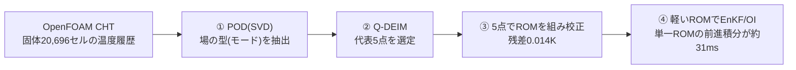
```mermaid
flowchart LR
    A["OpenFOAM CHT<br/>固体20,696セルの温度履歴"] --> B["① POD(SVD)<br/>場の型(モード)を抽出"]
    B --> C["② Q-DEIM<br/>代表5点を選定"]
    C --> D["③ 5点でROMを組み校正<br/>残差0.014K"]
    D --> E["④ 軽いROMでEnKF/OI<br/>単一ROMの前進積分が約31ms"]
```

---

## 1. なぜ ROM が要るか ― EnKF は実ソルバだと重すぎる

EnKF（blog_003）は、**分身（アンサンブル）1つ1つについて予報モデルを前進**させます。ざっくり
**計算量 ≒（分身の数）×（サイクル数）×（予報モデル1回のコスト）** です。

- 実ソルバ（CHT＋FrontISTR）は **1サイクル（60秒ぶん）でも分オーダー**。
- これを **分身50〜200個 × 10サイクル**回すと、EnKF 1回で数時間〜数日。

一方、この記事で作る **POD選定5点ROM** は、**0→600秒の前進積分が約31ミリ秒**（実測）。
この単一ROMの計測値は、全場復元・変位評価・図生成を含むEnKF一式の計算時間ではありません。**予報モデルをROMに差し替えるだけ**で、
同じ EnKF/OI が桁違いに軽くなる、というのが狙いです。

### 1-1. 大事な注意 ― ROMはCFDを「本番ループ」でだけ置き換える

「ROMにしたらもうOpenFOAMは要らない？」と思いがちですが、そうではありません。
処理は **オフライン（準備）** と **オンライン（本番）** に分かれます:

| フェーズ | 何をする | OpenFOAM(CHT) | 回数 |
|---|---|---|---|
| **オフライン（準備）** | CHTでスナップショット生成 → POD → Q-DEIM → 校正 | **必須**（ROMの材料） | **1回だけ** |
| **オンライン（本番）** | 軽いROMでEnKF/OIを回して温度・ $Q$ ・ $h$ を推定 | **使わない**（ROM 31ms） | 何十〜何百回 |

- **ROMはCFDの"蒸留物"**：モードも代表点も係数 $C,K,h$ も、**すべてOpenFOAMの結果から作られます**。
  CFDが無ければROMは存在しない。ROMは3D連成解析の **代役**であって、独立した物理ソルバではありません。
- つまり「**高価なCFDを一度だけ払い → その後は安価なリアルタイム能力を得る**」という前払い構造。
  OpenFOAMのメリットが消えたのではなく、ROMという形に **凝縮して前倒しした**だけです。
- **有効範囲に注意**：ROMは訓練データが覆った範囲でしか正しくない（外挿は苦手）。
  **形状・境界条件が変わる場合や、PODで表せない温度分布になる場合は、再検証・再校正が必要**です。発熱量25 Wや間欠加熱については、入力時刻を整合させた追加検証で使えることを確認しています（[blog_007](blog_007_rom_applicability.md)）。加熱シナリオが変われば必ず無効、という意味ではありません。

---

## 記号の読み替えと行列サイズ

**§2〜5の $u$ は温度場です。§7の $\boldsymbol u$ は変位です。** 既存の式を追う際は、温度の $u$ をノートでは $T$ と書き換えて構いません。温度と変位を同じ物理量として扱わないでください。

| 記号 | 大きさ・単位 | 意味 |
|---|---|---|
| $N,m,r$ | 20,696、121、5 | セル数、保存時刻数、採用モード数 |
| $S,X$ | $N\times m$ 、K | 温度履歴、各セルの時間平均を引いた履歴 |
| $\bar u$ | $N\times1$ 、K | 各セル固有の時間平均温度 |
| $U,\Sigma,V^{\mathsf T}$ | 薄いSVDで $N\times m,m\times m,m\times m$ | 左特異ベクトル、特異値、右特異ベクトルの転置 |
| $\Phi=U_r$ | $N\times r$ 、無次元 | 上位r本の空間モード |
| $a(t)$ | $r\times1$ 、K | 時刻tで全セルが共有するモード係数 |
| $P$ | $5\times N$ 、無次元 | 選んだセルの行を取り出す選択行列 |

$\mathsf T$ は転置、 $^+$ はMoore–Penrose疑似逆行列、 $\sigma_k$ は特異値、 $\lambda_k$ は固有値です。
本文の「r点P」は選んだ点集合を指します。行列として書くと $U_{r,P}=P\Phi$ です。
PODの「エネルギー」は温度変動の二乗和であり、熱量[J]ではありません。この実装はセル体積の重みを付けないSVDです。

平均場と基底は0〜600秒の121枚から作って固定します。300秒でヒータを切っても平均場だけを切り替えません。

## 2. POD の数式 ― なぜ SVD で場の「型」が出るのか

### 2-1. スナップショット行列 ― 温度場の「写真」を横に並べる

まず言葉で。ある時刻の温度場（全セルの温度）を1枚の**写真**だと思ってください。
シミュレーションは時刻 $t_1,t_2,\dots,t_m$ の写真を $m$ 枚くれます。
この写真を **1枚＝1列** にして横に並べたのが、スナップショット行列 $S$ です
（**行＝場所＝セル**、**列＝時刻**。 $u_i(t_k)$ ＝セル $i$ の時刻 $t_k$ の温度）:

$$S=\begin{pmatrix}
u_1(t_1) & u_1(t_2) & \cdots & u_1(t_m)\\
u_2(t_1) & u_2(t_2) & \cdots & u_2(t_m)\\
\vdots & \vdots & \ddots & \vdots\\
u_N(t_1) & u_N(t_2) & \cdots & u_N(t_m)
\end{pmatrix}$$

（横に読むと **各行が1セルの時間履歴**、縦に読むと **各列が1時刻の温度場（1枚の写真）**）

- **縦の1列** $u(t_k)=(u_1(t_k),\dots,u_N(t_k))^{\mathsf T}$ … その時刻の温度場まるごと（1枚の写真）。
- **横の1行** … あるセルの温度が時間とともにどう動いたか（1点の時間履歴）。
- 本ケースは $N=20{,}696$ セル、 $m=121$ 枚（0〜600秒）。

次に **各セルから「そのセル自身の時間平均」を引きます**。平均は下地なので、そこからの**変動だけ**を見たいからです。
セル $i$ の時間平均を $\bar u_i=\frac1m\sum_k u_i(t_k)$ とし、これを各行から引いた行列を $X$ と書きます:

$$X=\bigl[\,u(t_1)-\bar u,\ \dots,\ u(t_m)-\bar u\,\bigr],\qquad
X_{ik}=u_i(t_k)-\bar u_i.$$

- $\bar u=(\bar u_1,\dots,\bar u_N)^{\mathsf T}$ … **セルごとの時間平均**（1枚の「平均写真」）。
- $X$ の各成分は「そのセルが、その時刻に、自分の平均からどれだけ上下したか（変動）」。
- 各行の平均はちょうど0（下地を抜いたので、残るのは揺れだけ）。

この **変動だけの写真束 $X$** から共通の「型」を取り出すのが、次のPODです。

### 2-2. 「最良の型」を求める変分問題 → 固有値問題

場を1つの単位ベクトル $\varphi$ （ $\lVert\varphi\rVert=1$ ）で最もよく表す、とは
**各スナップショットの $\varphi$ 方向成分の二乗和を最大化**すること:

$$\max_{\lVert\varphi\rVert=1}\ \sum_{k=1}^{m}\bigl|\varphi^{\mathsf T}(u(t_k)-\bar u)\bigr|^2
=\max_{\lVert\varphi\rVert=1}\ \varphi^{\mathsf T}\bigl(XX^{\mathsf T}\bigr)\varphi.$$

制約 $\varphi^{\mathsf T}\varphi=1$ をラグランジュ乗数 $\lambda$ で組み込みます。

$$
\mathcal L=\varphi^{\mathsf T}XX^{\mathsf T}\varphi-\lambda(\varphi^{\mathsf T}\varphi-1).
$$

対称行列Aに対して $\partial(\varphi^{\mathsf T}A\varphi)/\partial\varphi=2A\varphi$ なので、

$$
\frac{\partial\mathcal L}{\partial\varphi}=2XX^{\mathsf T}\varphi-2\lambda\varphi=0.
$$

両辺を2で割って移項すると、次の固有値問題になります:

$$\boxed{\ (XX^{\mathsf T})\,\varphi=\lambda\,\varphi\ }$$

- 固有ベクトル $\varphi_k$ ＝ **PODモード（場の型）**
- 固有値 $\lambda_k=\sigma_k^2$ ＝ その型の **エネルギー**（大きいほど支配的）

#### 「固有値＝エネルギー」とはどういう意味か

**ここでいう「エネルギー」は物理のエネルギー（J）ではなく、「温度の揺れの2乗の合計」**のことです。

固有値 $\lambda_k$ は、上で最大化した量そのものです。固有値問題の両辺に左から $\varphi_k^{\mathsf T}$ を掛けると

$$
\lambda_k = \varphi_k^{\mathsf T}\,(XX^{\mathsf T})\,\varphi_k = \sum_{t=1}^{m}\big(\varphi_k^{\mathsf T}x_t\big)^2
$$

（ $x_t$ は $X$ の $t$ 列目＝時刻 $t$ の「平均を引いた温度場」）になります。
$\varphi_k^{\mathsf T}x_t$ は「時刻 $t$ の写真を型 $\varphi_k$ に重ねたときの長さ（その型がどれだけ含まれているか）」なので、

> **$\lambda_k$ ＝「全時刻の写真が、型 $k$ をどれだけ含んでいるか」の2乗の合計**

です。そして、全部の型の $\lambda_k$ を足すと、温度の揺れ全体の2乗の合計に一致します。

$$
\sum_{k}\lambda_k = \sum_{i=1}^{N}\sum_{t=1}^{m} X_{it}^2
$$

（右辺は、全セル・全時刻の「平均からの揺れ」の2乗の合計）

だから $\lambda_k/\sum\lambda$ が「**その型で、揺れ全体の何割を説明できるか**」（寄与率）になります。本ケースの「2つの型で 99.89 %」はこの割合です。

**下の3点×4時刻の例（§2-3）で確かめると**

| | 値 |
|---|---:|
| 揺れ全体の2乗の合計 $\sum_i\sum_t X_{it}^2$ | 20.564 |
| 型1の $\lambda_1=\sigma_1^2=4.161^2$ | 17.316（84.20 %） |
| 型2の $\lambda_2=\sigma_2^2=1.802^2$ | 3.247（15.79 %） |
| 型3の $\lambda_3=\sigma_3^2=0.036^2$ | 0.001（0.01 %） |
| 合計 | 20.564（＝揺れ全体と一致） |

型1 $\varphi_1=(0.566,\ 0.608,\ 0.557)$ に4枚の写真を重ねた長さは $(-3.025,\ -0.584,\ 2.613,\ 0.997)$ で、その2乗の合計がちょうど $17.316=\lambda_1$ です。

（ $\sigma_k$ は次の §2-3 で出てくる「特異値」です。 $\lambda_k=\sigma_k^2$ になる理由もそこで示します。）

### 2-3. SVD との同値（実際の計算法）

#### 特異値分解（SVD）とは

**どんな行列も、「空間の型」×「大きさ」×「時間の動き」の3つの行列の積に分けられる**、というのが特異値分解（Singular Value Decomposition）です。

$$
\underbrace{X}_{N\times m} = \underbrace{U}_{N\times r}\;\underbrace{\Sigma}_{r\times r}\;\underbrace{V^{\mathsf T}}_{r\times m}
$$

| 行列 | 中身 | 性質 |
|---|---|---|
| $U$ | 列 $u_1,u_2,\dots$ が**空間の型**（1列＝全セル分の重み） | 列どうしが直交し、長さ 1（ $U^{\mathsf T}U=I$ ） |
| $\Sigma$ | 対角に**特異値** $\sigma_1\ge\sigma_2\ge\cdots\ge0$ （各型の大きさ） | 対角以外は 0。大きい順に並ぶ |
| $V$ | 列 $v_1,v_2,\dots$ が**時間の動き**（1列＝全時刻分の係数） | 列どうしが直交し、長さ 1（ $V^{\mathsf T}V=I$ ） |

$r$ は $N$ と $m$ の小さい方以下の数（本ケースは $m=121$ ）です。
「直交」とは、2つの列の内積が 0 ＝ 型どうしが重なりを持たない、という意味です。
具体的な数値（3点×4時刻）は、この節の後半「数字で最後まで追う」にあります。

#### どんな $X$ でも $X=U\Sigma V^{\mathsf T}$ と書けるのか ― 制限はない

**書けます。 $X$ に制限はありません。** 実数の行列なら、

| 条件 | 必要か |
|---|---|
| 正方行列（ $N=m$ ） | **不要**。本ケースは 20,696 × 121 の縦長 |
| 対称・正定値 | **不要**（固有値分解と違うところ） |
| 逆行列を持つ（フルランク） | **不要**。ランクが低ければ、0 の特異値が出るだけ |

**なぜ必ず書けるのか（3行の証明）**

1. $X^{\mathsf T}X$ （ $m\times m$ ）は、どんな $X$ でも**対称**で、固有値が**0以上**です（ $v^{\mathsf T}X^{\mathsf T}Xv=\lVert Xv\rVert^2\ge0$ だから）。
   対称行列は必ず直交する固有ベクトルで対角化できるので、 $X^{\mathsf T}X=V\Lambda V^{\mathsf T}$ 、 $\Lambda=\mathrm{diag}(\lambda_1,\lambda_2,\dots)$ 、 $\lambda_k\ge0$ 。
2. $\sigma_k=\sqrt{\lambda_k}$ （0以上なので必ず平方根が取れる）、 $u_k=Xv_k/\sigma_k$ （ $\sigma_k>0$ のもの）と置くと、 $u_k$ も長さ1で互いに直交します（ $u_j^{\mathsf T}u_k=v_j^{\mathsf T}X^{\mathsf T}Xv_k/(\sigma_j\sigma_k)=\lambda_k v_j^{\mathsf T}v_k/(\sigma_j\sigma_k)$ ）。
3. $Xv_k=\sigma_ku_k$ を全部の $k$ で並べると $XV=U\Sigma$ 。右から $V^{\mathsf T}$ を掛けて $X=U\Sigma V^{\mathsf T}$ 。

**決まり方について**

- 特異値 $\sigma_k$ は、 $X$ から**ただ1通りに決まります**（大きい順に並べた場合）。
- $u_k$ ・ $v_k$ は、特異値がすべて違えば**符号だけ**任意です（ $u_k$ と $v_k$ を同時に反転しても同じ $X$ ）。後半の「符号には任意性があります」はこのことです。
- $r$ （使う型の数）は、0 でない特異値の数＝ $X$ の**ランク**です。本ケースは時刻が 121 なので $r\le121$ 。

**上の式で $V^{\mathsf T}V=I$ を使ってよい理由**： $V$ の列は手順1の直交する固有ベクトルなので、 $V^{\mathsf T}V=I$ が必ず成り立ちます（ `full_matrices=False` で $U$ を 121 列に絞っても、 $V$ は 121 × 121 のままなので同じ）。

#### なぜ SVD の $U$ が POD のモードになり、 $\lambda_k=\sigma_k^2$ になるのか

$X$ を特異値分解 $X=U\Sigma V^{\mathsf T}$ して、§2-2 の固有値問題に出てきた $XX^{\mathsf T}$ を計算すると

$$XX^{\mathsf T}=U\Sigma V^{\mathsf T}\,(U\Sigma V^{\mathsf T})^{\mathsf T}=U\Sigma \underbrace{V^{\mathsf T}V}_{I}\Sigma U^{\mathsf T}=U\,\Sigma^2\,U^{\mathsf T}.$$

（ $V$ の列が直交なので $V^{\mathsf T}V=I$ ）。両辺に右から $U$ を掛けると、 $U^{\mathsf T}U=I$ なので

$$
XX^{\mathsf T}\,U = U\,\Sigma^2
\quad\Longleftrightarrow\quad
XX^{\mathsf T}\,u_k = \sigma_k^2\,u_k\qquad(k=1,2,\dots)
$$

これは §2-2 の固有値問題 $(XX^{\mathsf T})\varphi=\lambda\varphi$ そのものです。つまり

- $U$ の $k$ 列目 $u_k$ ＝ 固有ベクトル $\varphi_k$ ＝ **POD モード**
- $\sigma_k^2$ ＝ 固有値 $\lambda_k$ ＝ **その型のエネルギー**

**3点×4時刻の例で確かめると**： $XX^{\mathsf T}u_1=(9.798,\ 10.526,\ 9.646)$ 、 $\sigma_1^2u_1=17.316\times(0.566,\ 0.608,\ 0.557)=(9.798,\ 10.526,\ 9.646)$ で一致します。

つまり **$U$ の各列がそのまま $XX^{\mathsf T}$ の固有ベクトル＝PODモード**、 $\sigma_k^2$ が固有値。
巨大な $XX^{\mathsf T}$ （ $N\times N$ ）を作らず、**SVD一発でPODが得られます**。
しかも上位 $r$ モードで打ち切った近似は、**ランク $r$ の全行列の中でフロベニウス誤差を最小**にする
（Eckart–Young の定理）＝「PODは最もエネルギー効率のよいモード分解」です。

#### 実際のコードは3行 ― `np.linalg.svd` の中で何が起きているか

ここまでが理屈ですが、**実装は拍子抜けするほど短い**です。本研究のモード分解は
`run/select_points_qdeim.py` の次の3行がすべてです（専用ライブラリは使っていません）。

```python
mean = X.mean(axis=1)                                # セルごとの時間平均
Xc   = X - mean[:, None]                             # 平均を引いて「変動だけ」にする
U, S, Vt = np.linalg.svd(Xc, full_matrices=False)    # ← これがモード分解
```

出てくる3つの箱の意味は次のとおりです（本ケースの実サイズつき）。

| 変数 | 数学記号 | 中身 | サイズ |
|---|---|---|---|
| `Xc` | $X$ | 平均を引いた温度場（1列＝1時刻） | 20,696 × 121 |
| `U` | $U$ | **PODモード＝空間の型**（1列＝1モード） | 20,696 × 121 |
| `S` | $\sigma_k$ | 各モードの**大きさ**（特異値） | 121 |
| `Vt` | $V^{\mathsf T}$ | 各モードの**時間の動き方** | 121 × 121 |

`full_matrices=False` は「20,696 × 20,696 の巨大な $U$ を作らず、意味のある121列だけ計算する」という指定です。

**中でやっていること**を一言でいうと、行列を次のように**足し算へ分解**しています:

$$X=\sigma_1\,u_1v_1^{\mathsf T}+\sigma_2\,u_2v_2^{\mathsf T}+\cdots+\sigma_r\,u_rv_r^{\mathsf T}$$

各項が「**空間の型 $u_k$** × **時間の動き $v_k$** × **大きさ $\sigma_k$**」の1セット。

**$u_k$ と $v_k$ は行列ではなく、縦ベクトルです。** $\sigma_k$ はただの数です。

$$
\underbrace{\sigma_k}_{\text{scalar}}\;
\underbrace{u_k}_{N\times1}\;
\underbrace{v_k^{\mathsf T}}_{1\times m}
=\underbrace{\sigma_k\,u_kv_k^{\mathsf T}}_{N\times m}
$$

| 記号 | 何か | 大きさ |
|---|---|---|
| $\sigma_k$ | 数（スカラー）＝型 $k$ の大きさ | 1 個 |
| $u_k$ | 縦ベクトル＝全セル分の重み（温度分布の型） | $N\times1$ |
| $v_k^{\mathsf T}$ | 縦ベクトル $v_k$ を横に倒した**横ベクトル**＝全時刻分の係数 | $1\times m$ |
| $u_kv_k^{\mathsf T}$ | 縦 × 横の掛け算（外積）。**ここで初めて行列になる** | $N\times m$ |

たとえば後半の3点×4時刻の例の第1項は、3×1 の縦ベクトルと 1×4 の横ベクトルを掛けて、3×4 の行列になります。

$$
\underbrace{4.161}_{\sigma_1}
\underbrace{\begin{pmatrix}0.566\\ 0.608\\ 0.557\end{pmatrix}}_{u_1\ (3\times1)}
\underbrace{\begin{pmatrix}-0.727&-0.140&0.628&0.240\end{pmatrix}}_{v_1^{\mathsf T}\ (1\times4)}
=\underbrace{\begin{pmatrix}-1.712&-0.331&1.478&0.564\\ -1.839&-0.355&1.589&0.606\\ -1.685&-0.326&1.456&0.555\end{pmatrix}}_{3\times4}
$$

（1行1列目は $4.161\times0.566\times(-0.727)=-1.712$ 。行列の $(i,t)$ 成分は「 $\sigma_1\times$ セル $i$ の重み $\times$ 時刻 $t$ の係数」）

**行列の形で書くと**こうなっています（ $N$ ＝セル数、 $m$ ＝時刻数、 $r$ ＝モード数）:

$$\underbrace{X}_{N\times m}=\underbrace{U}_{N\times r}\ \underbrace{\Sigma}_{r\times r}\ \underbrace{V^{\mathsf T}}_{r\times m}
=\begin{pmatrix}|&|&&|\\ u_1&u_2&\cdots&u_r\\ |&|&&|\end{pmatrix}
\begin{pmatrix}\sigma_1&0&\cdots&0\\ 0&\sigma_2&\cdots&0\\ \vdots&\vdots&\ddots&\vdots\\ 0&0&\cdots&\sigma_r\end{pmatrix}
\begin{pmatrix}-\ v_1^{\mathsf T}\ -\\ -\ v_2^{\mathsf T}\ -\\ \vdots\\ -\ v_r^{\mathsf T}\ -\end{pmatrix}$$

- $u_k$ は**縦ベクトル**（長さ $N$ ）＝ 全セルぶんの重み ＝ **1枚の温度分布の絵**
- $v_k$ は**縦ベクトル**（長さ $m$ ）＝ 全時刻ぶんの係数 ＝ **その絵の濃さの時間変化**
- $\sigma_k u_k v_k^{\mathsf T}$ は**縦×横の外積**なので、 $X$ と同じ $N\times m$ の行列になる
- $\Sigma$ は**対角以外がすべて 0** の行列（対角行列）。だから「型 $k$ の大きさ $\sigma_k$ 」が、ほかの型と混ざらずに1つずつ掛かる


しかも $\sigma_1\ge\sigma_2\ge\cdots$ と**大きい順に並ぶ**ので、頭からいくつか取れば良い近似になります。
（アルゴリズムとしてはLAPACKの `gesdd` が呼ばれ、二重対角化してから反復で特異値を求めます。
ただし**使う側が知っておくべきは上の分解の意味だけ**です。）

#### 文字式で追う ― 3点 × 4時刻の分解

数字の前に、同じ大きさ（3点 × 4時刻）の場合を**文字のまま**展開します。

**① 入力：平均を引いた温度の行列 $X$ （3 × 4）**

$x_{it}$ ＝ 点 $i$ の、時刻 $t$ の「平均からのずれ」（ $i=1,2,3$ 、 $t=1,\dots,4$ ）。

$$
X=\begin{pmatrix}
x_{11}&x_{12}&x_{13}&x_{14}\\
x_{21}&x_{22}&x_{23}&x_{24}\\
x_{31}&x_{32}&x_{33}&x_{34}
\end{pmatrix}
$$

**② SVD が返す3つ**

$$
U=\begin{pmatrix}u_{11}&u_{12}&u_{13}\\ u_{21}&u_{22}&u_{23}\\ u_{31}&u_{32}&u_{33}\end{pmatrix},\quad
\Sigma=\begin{pmatrix}\sigma_1&0&0\\ 0&\sigma_2&0\\ 0&0&\sigma_3\end{pmatrix},\quad
V^{\mathsf T}=\begin{pmatrix}v_{11}&v_{21}&v_{31}&v_{41}\\ v_{12}&v_{22}&v_{32}&v_{42}\\ v_{13}&v_{23}&v_{33}&v_{43}\end{pmatrix}
$$

| | 意味 |
|---|---|
| $U$ の $k$ 列目 $u_k=(u_{1k},u_{2k},u_{3k})^{\mathsf T}$ | 型 $k$ の**場所ごとの重み**（3点分） |
| $\sigma_k$ | 型 $k$ の**大きさ** $(\sigma_1\ge\sigma_2\ge\sigma_3\ge0)$ |
| $V$ の $k$ 列目 $v_k=(v_{1k},\dots,v_{4k})^{\mathsf T}$ | 型 $k$ の**時刻ごとの係数**（4時刻分）。 $V^{\mathsf T}$ では $k$ 行目に横に並ぶ |

**③ 掛け算すると、成分は「3つの型の足し算」になる**

$U\Sigma V^{\mathsf T}$ の $(i,t)$ 成分を計算すると（ $\Sigma$ の対角以外が 0 なので、 $k$ が一致する項だけ残る）

$$
x_{it} = \sigma_1\,u_{i1}\,v_{t1} + \sigma_2\,u_{i2}\,v_{t2} + \sigma_3\,u_{i3}\,v_{t3}
$$

たとえば点1・時刻1は $x_{11}=\sigma_1u_{11}v_{11}+\sigma_2u_{12}v_{12}+\sigma_3u_{13}v_{13}$ です。
**「点 $i$ ・時刻 $t$ の温度のずれ」＝「型 $k$ の大きさ × 点 $i$ での型の重み × 時刻 $t$ での型の係数」を、型ごとに足したもの。**

**④ 型1つ分を行列で書くと**

$$
\sigma_1\,u_1v_1^{\mathsf T}
=\sigma_1\begin{pmatrix}u_{11}\\ u_{21}\\ u_{31}\end{pmatrix}
\begin{pmatrix}v_{11}&v_{21}&v_{31}&v_{41}\end{pmatrix}
=\sigma_1\begin{pmatrix}
u_{11}v_{11}&u_{11}v_{21}&u_{11}v_{31}&u_{11}v_{41}\\
u_{21}v_{11}&u_{21}v_{21}&u_{21}v_{31}&u_{21}v_{41}\\
u_{31}v_{11}&u_{31}v_{21}&u_{31}v_{31}&u_{31}v_{41}
\end{pmatrix}
$$

**この行列は、どの列も $u_1$ の定数倍**（列 $t$ ＝ $\sigma_1v_{t1}\times u_1$ ）。
つまり「**温度分布の形は $u_1$ のまま、時刻ごとに強さ $\sigma_1v_{t1}$ だけが変わる**」型です。型2・型3も同じ形で、3つ足すと $X$ に戻ります。

$$
X=\sigma_1u_1v_1^{\mathsf T}+\sigma_2u_2v_2^{\mathsf T}+\sigma_3u_3v_3^{\mathsf T}
$$

**⑤ 型を捨てたときの誤差**

型3を捨てた近似 $X_2=\sigma_1u_1v_1^{\mathsf T}+\sigma_2u_2v_2^{\mathsf T}$ との差は $\sigma_3u_3v_3^{\mathsf T}$ だけで、その全成分の2乗の合計は

$$
\sum_{i,t}\big(X-X_2\big)_{it}^2=\sigma_3^2
$$

（ $u_3$ ・ $v_3$ は長さ1なので）。**捨てた型の $\sigma^2$ がそのまま誤差になる**ので、 $\sigma$ の小さい型から捨てればよい、というのが「少ないモードで済む」理由です。

次の数値例は、この文字に実データを入れたものです。

#### 数字で最後まで追う ― 3点 × 4時刻の完全分解

言葉だけでは分かりにくいので、**実データから3点・4時刻だけ抜き出して全部書き下します**
（P2＝ヒータ側、P0＝中央高さ、P4＝反対側の底面。時刻は50, 150, 300, 500秒）。

**入力**（温度、単位は℃）と、各行から時間平均 $m$ を引いた $X$ :

$$\begin{pmatrix}22.182&23.867&25.742&23.664\\ 21.615&23.307&25.239&23.667\\ 20.097&20.922&22.648&23.573\end{pmatrix}
-\begin{pmatrix}23.864\\ 23.457\\ 21.810\end{pmatrix}
=\underbrace{\begin{pmatrix}-1.682&0.003&1.879&-0.199\\ -1.842&-0.150&1.782&0.210\\ -1.712&-0.888&0.838&1.763\end{pmatrix}}_{X\ (3\times4)}$$

これを `np.linalg.svd` にかけると、次の3つが返ります:

$$U=\begin{pmatrix}0.566&0.513&0.646\\ 0.608&0.269&-0.747\\ 0.557&-0.815&0.159\end{pmatrix},\quad
\Sigma=\begin{pmatrix}4.161&0&0\\ 0&1.802&0\\ 0&0&0.036\end{pmatrix},\quad
V^{\mathsf T}=\begin{pmatrix}-0.727&-0.140&0.628&0.240\\ 0.020&0.380&0.422&-0.823\\ 0.470&-0.765&0.421&-0.126\end{pmatrix}$$

**ここからが本題です。** 各項 $\sigma_k u_kv_k^{\mathsf T}$ を実際に計算すると、
どれも $X$ と同じ3×4の行列になります:

**第1項**（ $\sigma_1=4.161$ 、エネルギー84.20 %）― $u_1$ は3成分とも同符号・同程度なので「**全体が一緒に上下する型**」:

$$4.161\begin{pmatrix}0.566\\ 0.608\\ 0.557\end{pmatrix}\begin{pmatrix}-0.727&-0.140&0.628&0.240\end{pmatrix}
=\begin{pmatrix}-1.712&-0.331&1.478&0.564\\ -1.839&-0.355&1.589&0.606\\ -1.685&-0.326&1.456&0.555\end{pmatrix}$$

**第2項**（ $\sigma_2=1.802$ 、15.79 %）― $u_2$ は上2点が正・底面が負なので「**上下の偏りの型**」:

$$1.802\begin{pmatrix}0.513\\ 0.269\\ -0.815\end{pmatrix}\begin{pmatrix}0.020&0.380&0.422&-0.823\end{pmatrix}
=\begin{pmatrix}0.019&0.351&0.390&-0.760\\ 0.010&0.184&0.205&-0.399\\ -0.030&-0.558&-0.620&1.208\end{pmatrix}$$

**第3項**（ $\sigma_3=0.036$ 、0.01 %）― 成分がすべて0.02以下の「**ほぼ何もない項**」:

$$0.036\begin{pmatrix}0.646\\ -0.747\\ 0.159\end{pmatrix}\begin{pmatrix}0.470&-0.765&0.421&-0.126\end{pmatrix}
=\begin{pmatrix}0.011&-0.018&0.010&-0.003\\ -0.013&0.020&-0.011&0.003\\ 0.003&-0.004&0.002&-0.001\end{pmatrix}$$

**3項を足すと元に戻ります**（差の最大値 $1.1\times10^{-15}$ ）:

$$\begin{pmatrix}-1.712&-0.331&1.478&0.564\\ \vdots\end{pmatrix}
+\begin{pmatrix}0.019&0.351&0.390&-0.760\\ \vdots\end{pmatrix}
+\begin{pmatrix}0.011&-0.018&0.010&-0.003\\ \vdots\end{pmatrix}
=\begin{pmatrix}-1.682&0.003&1.879&-0.199\\ \vdots\end{pmatrix}=X$$

**打ち切ったときの誤差**は:

| 使う項 | エネルギー | 最大誤差 |
|---|---|---|
| 第1項だけ | 84.20 % | 1.208 ℃ |
| 第2項まで | 99.99 % | **0.020 ℃** |
| 第3項まで | 100 % | 0（厳密） |

→ **第3項を捨てても0.02℃しか変わらない**。これが「少ないモードで済む」の正体です。
20,696セル版でも構造は同じで、項が121個あるうち**2項で99.89 %**になります。

**本当にそうなっているか、実データで確かめます。** 検証スクリプトを同梱しました:

```bash
OMP_NUM_THREADS=4 OPENBLAS_NUM_THREADS=4 python3 run/svd_explained.py
```

実行結果（20,696セル × 121時刻、0〜600秒）:

| 確かめたこと | 結果 |
|---|---|
| ① $X=U\Sigma V^{\mathsf T}$ に分解できているか | 相対誤差 $1.2\times10^{-15}$ ＝**厳密に分解**（近似ではない） |
| ② $U$ の列は $XX^{\mathsf T}$ の固有ベクトルか | $XX^{\mathsf T}u_1$ と $\sigma_1^2u_1$ の差 $4.3\times10^{-16}$ ＝**一致** |
| ③ 時間側の小行列（121×121）でも同じか | 特異値 1822.0, 540.7, 61.7, 12.0 が**完全一致**（スナップショット法） |
| ④ モードは正規直交か | $U^{\mathsf T}U=I$ （単位行列） |

②は §2-2 の固有値問題と、③は「巨大な $XX^{\mathsf T}$ を作らなくてよい」という主張の実証です。

**何モードで足りるか**（④ Eckart–Young の実測）:

| モード数 | 場の相対誤差 | 温度のRMSE |
|---|---|---|
| 1 | 28.62 % | 0.344 K |
| **2** | **3.31 %** | **0.040 K** |
| 3 | 0.64 % | 0.008 K |
| 5 | 0.03 % | 0.0004 K |

ここで**注意が1つ**あります。「2モードでエネルギー99.89 %」と「相対誤差3.31 %」は矛盾しません。
エネルギーは**2乗の量**なので、誤差は $\sqrt{1-0.9989}=0.033$ ＝ 3.3 % になります。
**エネルギー比は実際の誤差よりも良く見える**ので、モード数を決めるときは
温度のRMSE（ここでは0.04 K）のような**物理量での誤差も併せて見る**のが安全です。

最後に `Vt`（時間の動き）の中身も見ておきます。 $\sigma_k v_k$ が「モード $k$ が各時刻にどれだけ効いているか」です:

| 時刻 [s] | 0 | 50 | 150 | 300 | 450 | 600 |
|---|---:|---:|---:|---:|---:|---:|
| モード1の係数 | 401.9 | 301.0 | 117.1 | −146.7 | −120.3 | −110.0 |
| モード2の係数 | 114.3 | 15.0 | −44.3 | −83.6 | 42.8 | 51.6 |

- **モード1**は加熱の進行とともに単調に変化 ＝「**全体の温度レベル**」を担当
- **モード2**は300秒（ヒータOFF）の前後で**符号が反転** ＝「**左右の偏りの向き**」を担当
  （加熱中はヒータ側が熱い状態、冷却後はその偏りが解消・逆転していく様子）

つまり `np.linalg.svd` は、**121枚の温度場から「全体の昇温」と「左右の偏り」という2つの型を自動で見つけ出し、
それぞれの時間変化まで分離してくれた**わけです。物理の知識を一切与えずに、です。

（符号には任意性があります。 $u_k$ と $v_k$ の両方を同時に反転しても同じ $X$ になるため、
モードの色の向きが逆に出ることがあります。物理的な意味は変わりません。）

#### 自分のケースで試す ― CFD結果からPODまでの手順（8ステップ）

「行列を入れれば出る」とはいえ、**CFDの結果をその行列にするまで**が実務では一番手間です。
本研究で実際に踏んだ手順を、そのまま再現できる形で書きます。

**STEP 1. CFDを回し、スナップショットを等間隔で残す**

`system/controlDict` で出力を設定します（本研究の実際の値）:

```
application     chtMultiRegionFoam;
endTime         600;
writeControl    adjustableRunTime;
writeInterval   5;        // 5秒ごとに出力
writeFormat     ascii;    // 後で読むのでasciiが楽
```

→ 0〜600秒で**121枚**のスナップショットができます。ここでの注意は3つ:

- **等間隔で出す**：PODは各スナップショットを**等しい重み**で扱うため、間隔が不揃いだと
  細かく出した時間帯が実質的に重くなります
- **ascii形式**：binaryでも読めますがパーサが面倒になります（容量と引き換え）
- **並列計算なら `reconstructPar`** で1つに戻してから読む

**STEP 2. セル中心座標（と体積）を書き出す**

温度の値だけでは「どのセルがどこにあるか」が分かりません。後で図示・選点に使うので出しておきます:

```bash
postProcess -region solid -func writeCellCentres -time 5
postProcess -region solid -func writeCellVolumes -time 5   # 体積重みを使う場合
```

→ `5/solid/C`（セル中心座標）、`5/solid/V`（セル体積）が生成されます。

**STEP 3. 温度場ファイルを読んで行列に積む**

OpenFOAMのフィールドファイルは `internalField nonuniform List<scalar> 20696 ( ... )` という形式です。
正規表現で中身を取り出します（本研究の `read_foam_field()` の要点）:

```python
def read_foam_field(path, ncell=None):
    txt = open(path).read()
    seg = txt[txt.find("internalField"):]
    if "uniform" in seg[:40] and "nonuniform" not in seg[:40]:   # 均一場（初期条件など）
        v = float(re.findall(r"uniform\s+([-\d.eE ]+);", seg)[0])
        return np.full(ncell, v)
    n = int(re.search(r"List<\w+>\s*\n?\s*(\d+)", seg).group(1))
    body = seg[seg.find("(")+1:]
    return np.array([float(x) for x in re.findall(r"[-+]?\d[\d.eE+-]*", body)[:n]])

times = sorted(int(d) for d in os.listdir(case) if d.isdigit())
X = np.column_stack([read_foam_field(f"{case}/{t}/solid/T", ncell) for t in times])
```

**ここが一番の落とし穴**です:

- **初期時刻は `uniform` で書かれることがある**（全セル同じ値なので行数がない）→ 上のように分岐が要る
- **全時刻でセルの並び順が同じ**である必要がある（同じメッシュなら自動的に満たされる。
  ただし**動的メッシュやリメッシュを使うと崩れる**のでPOD不可）
- `0.orig` のような**数字でないディレクトリを除外**する

**STEP 4. 平均を引く**

```python
mean = X.mean(axis=1)      # セルごとの時間平均
Xc   = X - mean[:, None]
```

引かないとモード1が「平均場そのもの」になり、変動の型が2番目以降にずれます。

**STEP 5. SVDをかける**

```python
U, S, Vt = np.linalg.svd(Xc, full_matrices=False)
```

`full_matrices=False` を**必ず付けます**。付けないと $N\times N$ （20,696角）の行列を作ろうとして
メモリが破綻します。

**STEP 6. エネルギーを見てモード数を決める**

```python
energy = S**2 / (S**2).sum()
print(np.cumsum(energy)[:5])      # → 0.918, 0.999, ...
```

ここで **§2-3 で述べた「エネルギーは2乗の量」の注意**が効きます。
99.9 %でも誤差は3.3 %なので、**物理量（温度RMSE）でも確認**してから打ち切ります:

```python
for r in [1, 2, 3, 5]:
    Xr = (U[:, :r] * S[:r]) @ Vt[:r]
    print(r, np.sqrt(((Xc - Xr)**2).mean()), "K")
```

**STEP 7. モードを可視化して物理的に意味を確認する**

数値だけで進めず、**必ず絵にして確認**します。 $U$ の各列は「全セル分の値」なので、
そのままCFDのスカラー場として書き出せばParaViewで見られます。
モード1が「全体の昇温」、モード2が「左右の偏り」のように**物理的に読めるか**をチェックします。
読めない場合は、データの取り方（時間窓・出力間隔）を疑います。

**STEP 8. 代表点を選ぶ（Q-DEIM）**

```python
from scipy.linalg import qr
_, _, piv = qr(U[:, :r].T, pivoting=True)   # 枢軸QR
points = piv[:r]                             # 先頭r個が代表点
```

詳細は §4 で説明します。

**まとめ（つまずきやすい点）**

| ステップ | よくある失敗 | 対策 |
|---|---|---|
| 1 | 出力間隔が不揃い | `adjustableRunTime` で等間隔に |
| 1 | 並列計算のまま読む | `reconstructPar` してから |
| 3 | 初期時刻が `uniform` で落ちる | 分岐して全セル同値で埋める |
| 3 | 動的メッシュでセル順が変わる | PODには使えない（固定メッシュ前提） |
| 5 | メモリ不足 | `full_matrices=False` |
| 6 | エネルギーだけで打ち切る | 物理量の誤差でも確認 |
| 7 | 絵にせず数値だけで進む | ParaViewでモードを必ず目視 |

#### この方法の限界 ― 発表や査読で必ず聞かれる2点

ここまで「行列を入れればモードが出る」と書きましたが、**手軽さの裏返しの限界**が2つあります。
正直に書いておきます。

**限界1：出てくるのは「入れたデータの型」であって、物理が決めた固有モードではない**

PODモードは形状・材料・境界条件**だけ**では決まりません。**どんな運転をしたか**（加熱位置・出力・
時間窓）まで含めて決まります。対比すると分かりやすいはずです:

| | 固有モード（熱伝導方程式の固有関数） | PODモード（本記事） |
|---|---|---|
| 何で決まるか | 形状・材料・境界条件**だけ** | **実際に起きた温度場データ** |
| 熱源の影響 | 受けない | **受ける** |
| 意味 | その物体が持つ固有の減衰形状 | 「その運転で実際によく現れた型」 |

本ケースで モード1＝全体の昇温、モード2＝左右の偏り という素直な形が出たのは、
熱伝導が線形で熱源が1つ（ON/OFFのみ）と単純だからです。
**ヒータ位置を変えればモード2の形は変わります**。この訓練条件依存は §8-3 の未解決問題そのものです。

**限界2：セル体積の重みを付けていない**

上のコードは各行（セル）を**等しく**扱っています。しかし本来のPOD（連続体のエネルギー最大化）は、
体積重み $\sqrt{V_i}$ を掛けた行列

$$\tilde X_{ik}=\sqrt{V_i}\;X_{ik}$$

を分解するのが正しい定義です。等重みだと**細かいセルが密集した領域が実質的に重く**なります。

「本ケースのメッシュはそこまで不均一ではないだろう」と考えていたのですが、
**実際に測ったら違いました**。OpenFOAMでセル体積を書き出して確認すると:

- セル体積は $1.2\times10^{-9}$ 〜 $2.3\times10^{-7}$ m³ ＝ **最大と最小で192倍の開き**（固体の合計317 cm³）

そこで、体積重みを付けたPODと等重みPODを比較しました
（`run/pod_volume_weight_check.py`）:

| 比較項目 | 等重み（従来） | 体積重み（厳密） |
|---|---|---|
| 累積エネルギー（1モード） | 91.81 % | **93.69 %** |
| 累積エネルギー（2モード） | 99.89 % | **99.93 %** |
| Q-DEIMで選ばれた5点 | 7634, 7924, 7765, 859, 733 | 12920, 7634, 7924, 859, 838 |
| 5点復元の体積加重RMSE | 0.00072 K | **0.00067 K** |

モードの向きの一致度（体積内積で規格化）は **モード1が0.9998**（ほぼ同一）、
モード2が0.966、モード3が0.922 でした。つまり:

- **支配的なモード1は事実上変わらない** ― 全体の昇温という型は重み付けに鈍感
- **高次モードほど差が出る** ― 細かい構造ほど重み付けの影響を受ける
- **選点は5点中2点が入れ替わった** ― 「どこを測るか」の答えは重み付けで変わりうる
- ただし**復元精度はどちらも0.0007 K程度**で、観測ノイズ（0.3 K）よりはるかに小さい

**結論**：本ケースでは**実害は小さい**（復元精度に有意差なし）ものの、
**厳密には体積重み付きが正しく、選点が変わる可能性がある**という点は、
条件が変わったときのために認識しておくべき限界です。


### 2-4. 用語の整理 ― POD・SVD・特異値分解の違い

ここで混乱しやすい3語を整理します。まず大前提:

> **SVD ＝ 特異値分解**（Singular Value Decomposition）は **同じもの**。
> 英語の略称か日本語かの違いだけで、中身は1つ。だから区別すべきは実質 **「SVD（＝特異値分解）」と「POD」の2つ**です。

- **SVD（＝特異値分解）** … **どんな行列にも使える線形代数の"道具"**。行列を $X=U\Sigma V^{\mathsf T}$ の3つに分解する操作、それ以上でも以下でもありません。物理も温度も知りません。
- **POD（固有直交分解）** … **データから"エネルギー最大の型"を取り出す"目的・考え方"**。その計算に SVD を使います。「PODをする」＝実際には「平均を引いた $X$ を SVD し、 $U$ の列を"モード"、 $\sigma_k^2$ を"エネルギー"と読む」こと。

| 用語 | 正体 | 立場 |
|---|---|---|
| **特異値分解** | SVD の日本語名（＝SVDそのもの） | ― |
| **SVD** | $X=U\Sigma V^{\mathsf T}$ の行列分解 | 汎用の **計算道具** |
| **POD** | 場のエネルギー最大の直交モードを取る | **目的・解釈**（平均除去・重み・エネルギー意味づけを追加） |

つまり **「POD は SVD と別物」ではなく、SVD は POD を計算する道具**。POD側には「①平均を引く ②（体積などで重みを付けた）エネルギーで最良性を測る ③上位数モードで場を代表させる」という"味付け"が加わります。
統計の **PCA（主成分分析）** や確率過程の **Karhunen–Loève 展開** も、呼び名が違うだけで本質は同じ仲間です。

（別解：SVDを使わず $XX^{\mathsf T}$ の固有値分解や、時間側の小さい $X^{\mathsf T}X$ を解く"スナップショット法"でも、同じPODモードが得られます。SVDはその中で最も安定・簡単な計算法という位置づけ。）

### 2-5. コラム：POD以外のモデル縮約 ― クリロフ部分空間法との違い

モデル縮約（MOR: Model Order Reduction）にはPOD以外の流派もあります。代表は
**クリロフ部分空間法**（モーメントマッチング、Arnoldi法など）と **平衡打切り**（balanced truncation）。
どれも「大きい系を小さい部分空間へ射影する」仲間で、違いは **部分空間の作り方** です:

| | **POD** | **クリロフ部分空間法** | **平衡打切り** |
|---|---|---|---|
| 部分空間の材料 | **データ**（スナップショットのSVD） | **方程式の行列**： $\mathrm{span}(b,\ Ab,\ A^2b,\dots)$ | 可制御性・可観測性グラミアン |
| 事前に必要なもの | シミュレーション結果だけ | システム行列 $A,\ b$ （FEMの $C,K$ ） | システム行列＋リアプノフ方程式求解 |
| 何に忠実か | 訓練データのエネルギー | 伝達関数のモーメント（周波数応答） | 入出力の重要度（誤差上界つき） |
| 非線形への拡張 | DEIM等で可能 | 基本は線形（LTI）系向け | 基本は線形系向け |
| 弱点 | **訓練条件に依存**（外挿に弱い） | **侵入的**＝行列へのアクセスが必要 | 大規模系では計算が重い |

#### そもそも「クリロフ部分空間」とは何か ― 3ノードの手計算で

名前は難しいですが、定義は1行です。行列 $A$ と入力ベクトル $b$ から作る

$$\mathcal K_r(A,b)=\mathrm{span}\{\,b,\ Ab,\ A^2b,\ \dots,\ A^{r-1}b\,\}$$

＝「 $b$ に $A$ を繰り返し掛けてできる方向を集めた空間」。これだけです。
**物理的な意味は「入力の影響が系の中を伝わっていく順番」**。3ノードの熱伝導（ヒータは端の節点1）で確かめます:

$$A=\begin{pmatrix}-1&1&0\\ 1&-2&1\\ 0&1&-1\end{pmatrix},\qquad
b=\begin{pmatrix}1\\ 0\\ 0\end{pmatrix}\quad(\text{node 1 heated}).$$

$A$ を順に掛けると:

$$b=\begin{pmatrix}1\\ 0\\ 0\end{pmatrix},\qquad
Ab=\begin{pmatrix}-1\\ 1\\ 0\end{pmatrix},\qquad
A^2b=\begin{pmatrix}2\\ -3\\ 1\end{pmatrix}.$$

- $b$ ：熱はまだ **節点1だけ**
- $Ab$ ：**節点2に届いた**（成分が非ゼロに）
- $A^2b$ ：**節点3まで届いた**

つまり **$A$ を1回掛ける＝熱が隣へ1ステップ伝わる**。クリロフ基底は「ヒータの影響が届く順」に空間を張っていきます。
これが解と直結する理由は、熱方程式 $\dot T=AT+bQ$ の解に出てくる行列指数関数のテイラー級数

$$e^{At}b=b+tAb+\frac{t^2}{2}A^2b+\cdots$$

が **まさにクリロフ方向の和** だから。早い項ほど支配的なので、**最初の $r$ 方向だけ残して打ち切っても良い近似**になる
＝これがクリロフ縮約の原理です。実際の手順は:

1. $b, Ab, A^2b,\dots$ を **Arnoldi法**（グラム・シュミット直交化と同じ発想）で直交基底 $V_r$ にする
   （生の $A^kb$ はすぐ同じ向きに揃ってしまい数値的に危ないため）。
2. 大きい系を $T\approx V_r\,a$ と置いて射影： $\dot a=(V_r^{\mathsf T}AV_r)\,a+V_r^{\mathsf T}b\,Q$ 。
   これで $N$ 次元の方程式が **$r\times r$ の小さい方程式**になります。

PODとの対比で言うと：**PODは「シミュレーション結果（データ）」から支配方向を後付けで学ぶ**のに対し、
**クリロフは「方程式（ $A,b$ ）」から支配方向を計算前に組み立てる**。だからクリロフはスナップショット不要ですが、
行列 $A,b$ に触れる必要がある（侵入的）、という表の違いにつながります。

**本研究がPODを選んだ理由は2つ**:

1. **非侵入的（non-intrusive）だから**。クリロフ法や平衡打切りは $A, b$ という**行列そのもの**が必要ですが、
   OpenFOAMのCHTソルバから系行列を取り出すのは大変です。PODは **温度スナップショット（solid/Tのファイル）さえあればいい**。
2. **「代表点」が欲しかったから**。POD→Q-DEIMは **物理的な点（セル）** を選んでくれるので、
   センサ議論・集中定数ROM・観測設計に直結します。クリロフ法の縮約座標は抽象的な部分空間で、
   「どの場所」という解釈がつきません。

なお熱伝導は線形なので、行列が手に入る場合（FrontISTR側など）は **クリロフ法も有力な代替**です
（工作機械の熱モデル縮約で実績があります）。また本記事のROMは厳密には「PODのGalerkin射影ROM」ではなく、
**Q-DEIM点上の集中定数モデルを校正**したもの（PODは点選びと場の復元に使用）。
$C_i, K_{ij}, h$ という**物理的に読める係数**にしたことで、EnKFの拡大状態（ $Q,h$ 推定）へ自然につながります。

---

## 3. 小さな行列で POD を手計算する（3セル × 4時刻・文字式）

言葉だけでは腑に落ちないので、**3セル(A,B,C) × 4時刻**の最小例で最後まで計算します。
数字だと構造が見えにくいので、**文字式**で進めます。ポイントは、各セルの温度を

$$u_i(t_k)=\bar u_i+a_i\,g_k,\qquad \sum_{k=1}^4 g_k=0$$

と置くこと。ここで $\bar u_i$ は **下地（時間平均）**、 $a_i$ は **その場所の変動の強さ**、
$g_k$ は **全セル共通の時間プロファイル**（平均を引いてあるので総和ゼロ）。
「**場所ごとの強さ $a_i$**」と「**時間の動き $g_k$**」の積で温度が決まる、という素直な仮定です。

イメージはこうです ―― **中空円筒を片側から加熱**し、ヒータ側から順に A（強）・B（中）・C（弱）の3セルを取ります。
3セルとも同じように昇温しますが（共通の $g_k$ ）、ヒータに近いほど大きく振れます（ $a_A>a_B>a_C$ ）:

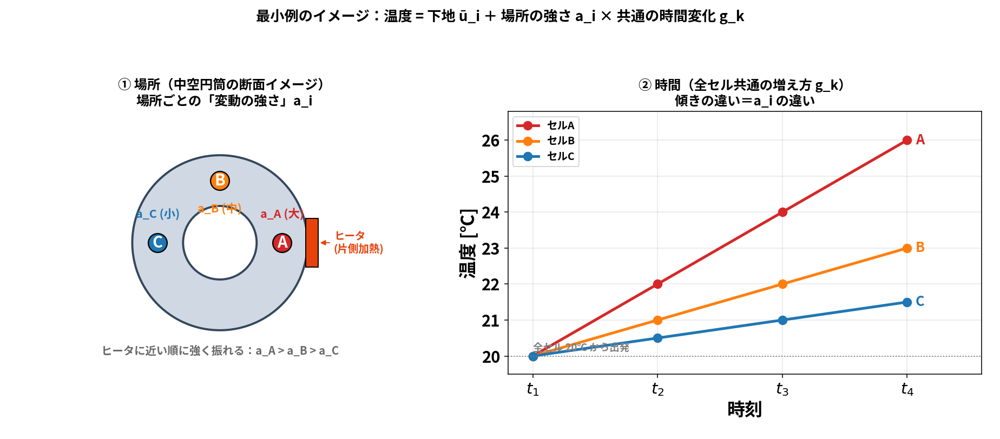

*左＝場所（断面イメージ）：ヒータに近い順に「変動の強さ」 $a_i$ が大きい。
右＝時間：3セルは同じ増え方 $g_k$ を共有し、**傾き（振れ幅）の違いが $a_i$ の違い**。
この「場所 $a_i$ × 時間 $g_k$ 」という掛け算の形が、次で効いてきます。*

| セル | $t_1$ | $t_2$ | $t_3$ | $t_4$ | 時間平均 |
|---|---|---|---|---|---|
| A（ヒータ側） | $\bar u_A+a_A g_1$ | $\bar u_A+a_A g_2$ | $\bar u_A+a_A g_3$ | $\bar u_A+a_A g_4$ | $\bar u_A$ |
| B（中間） | $\bar u_B+a_B g_1$ | $\bar u_B+a_B g_2$ | $\bar u_B+a_B g_3$ | $\bar u_B+a_B g_4$ | $\bar u_B$ |
| C（反対側） | $\bar u_C+a_C g_1$ | $\bar u_C+a_C g_2$ | $\bar u_C+a_C g_3$ | $\bar u_C+a_C g_4$ | $\bar u_C$ |

ヒータ側ほど強く反応するので $a_A>a_B>a_C>0$ 。各セルから自分の平均 $\bar u_i$ を引くと、
PODに渡す変動行列 $X$ は **場所ベクトル $a$ と 時間ベクトル $g$ の外積** になります:

$$X=\begin{pmatrix}a_A g_1 & a_A g_2 & a_A g_3 & a_A g_4\\
a_B g_1 & a_B g_2 & a_B g_3 & a_B g_4\\
a_C g_1 & a_C g_2 & a_C g_3 & a_C g_4\end{pmatrix}
=\begin{pmatrix}a_A\\ a_B\\ a_C\end{pmatrix}\bigl(g_1,\ g_2,\ g_3,\ g_4\bigr)
=a\,g^{\mathsf T}.$$

**この時点で $X=a\,g^{\mathsf T}$ ＝ランク1**（1つの空間パターン × 1つの時間プロファイル）。
「場の変動は、たった1つの型で説明できる」ことが、もう形から見えています。

### 3-1. 相関行列 $XX^{\mathsf T}$ を作る

$X=a\,g^{\mathsf T}$ を代入するだけです。 $g^{\mathsf T}g=\lVert g\rVert^2$ はただのスカラーなので、

$$XX^{\mathsf T}=a\,g^{\mathsf T}\,g\,a^{\mathsf T}=\lVert g\rVert^2\,a\,a^{\mathsf T},\qquad
\lVert g\rVert^2=\sum_{k=1}^4 g_k^2.$$

右辺は **場所ベクトル $a$ の外積 $a a^{\mathsf T}$ の定数倍** ＝ やはり **ランク1**。
時間プロファイル $g$ は「大きさ $\lVert g\rVert^2$ 」という1個の数にまとまり、
**空間の型は $a$ だけで決まる**ことが読み取れます。

### 3-2. 固有値と PODモード（文字式）

ランク1行列 $XX^{\mathsf T}=\lVert g\rVert^2\,a a^{\mathsf T}$ の非ゼロ固有ベクトルは $a$ の向き、固有値はその係数です。
PODモード $\varphi_1$ とエネルギー $\lambda_1$ は

$$\varphi_1=\frac{a}{\lVert a\rVert},\qquad
\lambda_1=\sigma_1^2=\lVert g\rVert^2\,\lVert a\rVert^2.$$

他の固有値はすべて0なので、エネルギー比は

$$\frac{\lambda_1}{\mathrm{tr}(XX^{\mathsf T})}=\frac{\lVert g\rVert^2\lVert a\rVert^2}{\lVert g\rVert^2\lVert a\rVert^2}=1,$$

すなわち **モード1だけで100％**。
モード $\varphi_1=a/\lVert a\rVert$ の中身は「**各セルの変動の強さの比 $a_A:a_B:a_C$**」そのもの。
つまり PODモードとは「**どの場所がどれだけ強く動くか**」という空間パターンで、
$\bar u$ ＝下地、 $\varphi_1$ ＝そこからの変動の型、という役割分担です。

（本物の場は完全なランク1ではありませんが、後で見るように **モード1で91.8％**まで説明でき、構図は同じです。）

---

## 4. Q-DEIM ― どの点を測れば場を復元できるか

**Q-DEIM は「少数のセンサで場全体を復元するのに、どこにセンサを置けばいいか」を決める方法**です。
名前は難しいですが、やっていることは直感的なので、順を追ってほぐします。

### 4-0. その前に ― Q-DEIM と gappy-POD は「別の道具」です

この2つは名前が似ていて必ずセットで出てくるので混同しやすいのですが、**やっていることも、実行するタイミングも違います**。
先にここをほぐしておきます。

#### 一言でいうと

| | **Q-DEIM** | **gappy-POD** |
|---|---|---|
| ひとことで | **どこを測るか決める** | **測った値から全部を埋める** |
| いつやるか | **オフラインで1回だけ**（設計時） | **オンラインで毎時刻**（運用時） |
| 入力 | PODモード行列 $U_r$ （20,696×5） | 選んだ5点の測定値 $T_P$ （5×1） |
| 出力 | 測る点の番号 $P=\{P_1,\dots,P_5\}$ | 全セルの温度 $\hat T$ （20,696×1） |
| 中身 | 枢軸付きQR分解（貪欲法） | 5元連立を解く＋行列ベクトル積 |
| 計算量 | 1回きり。数秒 | 毎回。 $5^3+20696\times5$ 程度＝一瞬 |
| 例えると | **センサの設置工事** | **毎日のメーター読み** |

**Q-DEIM がセンサの置き場所を決め、gappy-POD がそのセンサの値を読んで全体像を描く。**
工事は最初の1回、読み取りは毎時刻 ―― これが役割分担です。

#### 名前の由来

- **gappy**（ギャッピー）は英語の *gap*（すき間・穴）から来ていて、**「穴だらけ」**という意味です。
  20,696セルのうち値が分かっているのは **たった5セル**。残り20,691セルは空欄。
  この**歯抜けのデータから元の絵を復元する**ので gappy-POD と呼ばれます。
  もともとは欠損のある画像を補完する手法として提案されたもので、「虫食い算を解く」イメージが近いです。
- **Q-DEIM** は **Q**R分解を使う **D**iscrete **E**mpirical **I**nterpolation **M**ethod の略。
  DEIM が「離散的な点で補間するために点を選ぶ方法」で、その選び方を**QR分解**でやるのが Q-DEIM です。
  頭の Q は、まさに `scipy.linalg.qr(..., pivoting=True)` の Q です。

#### なぜ「穴だらけ」でも復元できるのか

ふつうに考えれば、20,696個の数を5個の測定値から復元するのは無理です。**情報が足りません。**
できるのは、**POD が先に「答えの形」を教えてくれている**からです。

§3 で見たとおり、温度場は

$$\hat T=\bar T+a_1\varphi_1+a_2\varphi_2+\dots+a_5\varphi_5$$

と書けました。 $\bar T$ も $\varphi_k$ も**計算済みで固定**。時刻ごとに変わるのは $a_1,\dots,a_5$ の **5個だけ**です。

> **つまり「20,696個を当てる問題」は、PODを通した瞬間に「5個を当てる問題」に化けています。**
> 5個の未知を決めるのに必要な式は5本。だから5点測れば足りる ―― これが種明かしです。

穴だらけでいいのは「穴を1つずつ埋める」のではなく、**全部まとめて5個のつまみで決めている**からです。
5個のつまみを合わせれば、測っていないセルも自動的に決まります。

#### 流れを図にすると

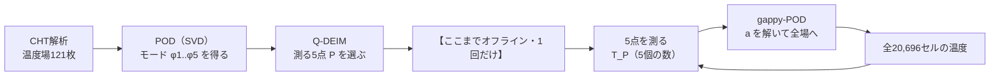
```mermaid
flowchart LR
  A["CHT解析<br/>温度場121枚"] --> B["POD（SVD）<br/>モード φ1..φ5 を得る"]
  B --> C["Q-DEIM<br/>測る5点 P を選ぶ"]
  C --> D["【ここまでオフライン・1回だけ】"]
  D --> E["5点を測る<br/>T_P（5個の数）"]
  E --> F["gappy-POD<br/>a を解いて全場へ"]
  F --> G["全20,696セルの温度"]
  G --> E
```

上半分（POD→Q-DEIM）は**設計時に1回**。下半分（測る→gappy-POD）は**毎時刻くるくる回る**ループです。

#### gappy-POD の中身（3ステップ）

| 手順 | やること | 式 | サイズ |
|---|---|---|---|
| ① | 5点を測り、平均からのズレにする | $\delta_P=T_P-\bar T_P$ | 5×1 |
| ② | **5元連立を解いてつまみ $a$ を出す** | $a=(U_{r,P})^{-1}\delta_P$ | (5×5)⁻¹×(5×1) → 5×1 |
| ③ | **そのつまみを全セルに使い回す** | $\hat T=\bar T+U_r\,a$ | (20,696×5)×(5×1) → 20,696×1 |

$U_{r,P}$ は **$U_r$ （20,696×5）から「測った5行」だけを抜き出した 5×5 行列**です。
②で逆行列を取るのはこの 5×5 だけ。だから毎時刻回しても一瞬で終わります。

②を展開すると、ふつうの連立方程式であることがはっきりします:

$$
\begin{aligned}
\delta_{P_1}&=a_1\varphi_1[P_1]+a_2\varphi_2[P_1]+\dots+a_5\varphi_5[P_1] &&(1)\\
\delta_{P_2}&=a_1\varphi_1[P_2]+a_2\varphi_2[P_2]+\dots+a_5\varphi_5[P_2] &&(2)\\
&\ \ \vdots &&\\
\delta_{P_5}&=a_1\varphi_1[P_5]+\dots+a_5\varphi_5[P_5] &&(5)
\end{aligned}
$$

（右の番号は「何点目の測定で立つ式か」）

**1点測るごとに式が1本立つ。** 未知が5個なので、5点でちょうど解ける形になります。

③をセル $c$ 1個について書くと:

$$\hat T_c=\bar T_c+a_1\varphi_1[c]+a_2\varphi_2[c]+\dots+a_5\varphi_5[c]$$

$\varphi_k[c]$ は**セル $c$ が測定点でなくても持っている値**（モードは全セル分そろっている）。
だから**測っていないセルも、モードを通して値が決まる**わけです。

#### そこで Q-DEIM の出番 ― 「どの5行を抜くか」で連立の解きやすさが変わる

ここまで来ると、Q-DEIM の役割がはっきりします。
②の連立を解くのは $U_{r,P}$ ＝ **モード行列からどの5行を抜いたか**で決まる行列です。

> **どの行を抜くか ＝ どこに測定点を置くか。**
> つまり**測定点選びは「5×5の連立方程式を解きやすくする問題」**そのものになっています。

行がそっくりな点を選んでしまうと「同じ式を何回も書いている」状態になり、連立が解けません。
実データで確かめると差は歴然です:

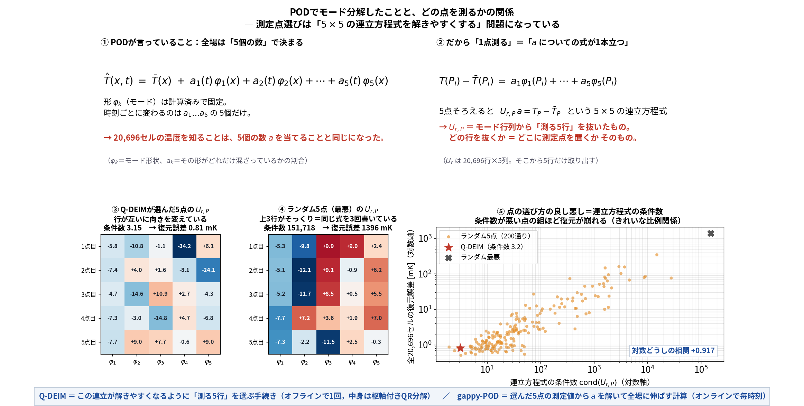

*③Q-DEIMが選んだ5点の $U_{r,P}$ は行が互いに向きを変えていて **条件数 3.15**、復元誤差 0.81 mK。
④ランダム5点の最悪例は**上3行がそっくり**（−5.3,−9.8,+9.9… と −5.1,−12.1,+9.1… と −5.2,−11.7,+8.5…）で
**条件数 151,718**、復元誤差 1,396 mK。
⑤ランダム200通りを並べると、**条件数と復元誤差は対数どうしの相関 +0.917** できれいに並ぶ
＝「点の選び方の良し悪し」は「連立の条件数」で測れている。*

**Q-DEIM は、この条件数がなるべく良くなるように5行を貪欲に選ぶ手続き**です（中身は §4-2）。
そして選んだあとの毎時刻の計算が gappy-POD ―― これで2つの関係がつながりました。

#### 効果を温度[K]で見る

選点の進行を測る「残差ノルム」は**復元前のモード空間の無次元量**なので、実際の温度で何Kになるのかを別に出しておきます:

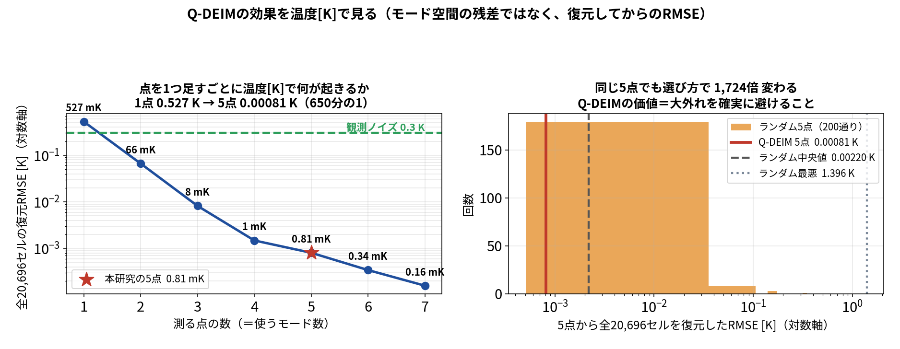

*左：点を1つ足すごとの、全20,696セルの復元RMSE。**1点 0.527 K → 2点 0.066 K → 5点 0.00081 K**（650分の1）。
観測ノイズ0.3 Kを2点目で下回り、5点では2桁下。
右：同じ「5点」でもランダムに選ぶと中央値 0.00220 K、**最悪 1.396 K（Q-DEIMの1,724倍）**。
Q-DEIMの価値は「いつも最良」ではなく、**大外れを確実に避けること**。*

> **まとめ（4-0）**
> - **POD** が「全場は5個の数で決まる」という形を用意する
> - **Q-DEIM** が「その5個を解きやすくする5点」をオフラインで1回選ぶ
> - **gappy-POD** が「その5点の測定値から5個を解いて全場へ伸ばす」をオンラインで毎時刻やる
>
> 3つは順番につながった一本の流れで、Q-DEIM と gappy-POD は**設計と運用**の関係にあります。

### 4-1. まず「なぜ点の選び方が問題になるか」

§3で見たように、温度場は「平均場＋モードの足し合わせ」で表せます:

$$\hat u=\bar u+a_1\varphi_1+a_2\varphi_2+\dots+a_r\varphi_r=\bar u+U_r\,a.$$

ここで未知は **モードの混ぜ具合 $a=(a_1,\dots,a_r)$** の $r$ 個だけ。
$r$ 個の未知を決めるには **$r$ 個の独立な測定**があり、選点行列がフルランクなら係数を決められる ―― これが「少数点でROMを組める」理由です。
$r$ 点 $P$ で測ると、その点でのモードの値だけを並べた $r\times r$ 行列 $U_{r,P}$ を使って、連立方程式

$$U_{r,P}\,a=u_P-\bar u_P\quad\Rightarrow\quad a=\bigl(U_{r,P}\bigr)^{-1}\bigl(u_P-\bar u_P\bigr)$$

を解くだけ（ $u_P$ ＝選んだ点の測定値）。**問題は、この連立が「ちゃんと解けるか」**。

- **選んだ2点がモードから見て"そっくり"**（例：どちらも「モード1が大きくモード2は小さい」）だと、
  2本の式がほぼ同じ式になり、**連立が解けない**（ $U_{r,P}$ が特異に近い）。
  測定に少しでもノイズが乗ると、復元が大暴れします。
- **選んだ点が互いに"別々のことを言う"**（1点はモード1を、別の点はモード2をよく映す）なら、
  連立はスッキリ解け、復元は安定。

#### セルごとのモードの値 ― $U_r$ の1行を見る

Q-DEIM の点の選び方を理解するには、**ある1つのセルで、5つのモードがそれぞれどんな値を取るか**を見る必要があります。これは、POD で作ったモード行列 $U_r$ （20,696 行 × 5 列）の**1行**です。この記事では、これを「セルの行ベクトル」と呼びます。

$$
U_r=
\begin{pmatrix}
\varphi_1[1] & \varphi_2[1] & \varphi_3[1] & \varphi_4[1] & \varphi_5[1]\\
\varphi_1[2] & \varphi_2[2] & \varphi_3[2] & \varphi_4[2] & \varphi_5[2]\\
\vdots & \vdots & \vdots & \vdots & \vdots\\
\varphi_1[20696] & \varphi_2[20696] & \varphi_3[20696] & \varphi_4[20696] & \varphi_5[20696]
\end{pmatrix}
$$

- **縦の1列**＝1つのモード（温度分布の「型」）。例えば1列目 $\varphi_1$ はモード1の型で、20,696 セル分の値が並んでいます。
- **横の1行**＝1つのセルの**行ベクトル**（そのセルでの5つのモードの値）。この記事では、セル $i$ の行ベクトルを $\psi_i$ と書きます。

$$
\psi_i=\big(\varphi_1[i],\ \varphi_2[i],\ \varphi_3[i],\ \varphi_4[i],\ \varphi_5[i]\big)
$$

（ $U_r$ の $i$ 行目）

（ $\varphi_k$ は「モード $k$ ＝列」、 $\psi_i$ は「セル $i$ ＝行」です。混同しないよう記号を分けています。）

**行ベクトルの長さ**は、その行の5つの値の2乗和の平方根です。

$$
\lVert\psi_i\rVert=\sqrt{\varphi_1[i]^2+\varphi_2[i]^2+\varphi_3[i]^2+\varphi_4[i]^2+\varphi_5[i]^2}
$$

長いセルほど、どこかのモードが大きく出るセルです。測ると、そのモードの混ざり具合がよく分かります。短いセルは、どのモードもほとんど出ないので、測っても情報が少ないセルです。

**実際の値**（この研究の $U_r$ から抜き出したもの。`results/qdeim_points.npz` の `pod_modes`）：

| セル番号 | 座標 [mm] | モード1 | モード2 | モード3 | モード4 | モード5 | 行ベクトルの長さ $\lVert\psi_i\rVert$ |
|---|---|---:|---:|---:|---:|---:|---:|
| 0 | (0.8, −36.7, 0.9) | −0.0076 | 0.0033 | −0.0041 | 0.0049 | 0.0072 | 0.0126 |
| 1 | (−24.3, −24.3, 0.8) | −0.0077 | 0.0075 | 0.0041 | 0.0020 | 0.0094 | 0.0149 |
| … | … | … | … | … | … | … | … |
| **7634（P0）** | (21.3, −1.6, 51.6) | −0.0058 | −0.0108 | −0.0011 | **−0.0342** | 0.0061 | **0.0369（最大）** |
| 7924（P1） | (−14.1, 33.1, 51.6) | −0.0074 | 0.0040 | 0.0016 | −0.0081 | −0.0241 | 0.0268 |
| 7765（P2） | (36.5, 6.9, 50.8) | −0.0047 | −0.0146 | 0.0109 | 0.0027 | −0.0043 | 0.0195 |
| 859（P3） | (35.1, 0.8, 0.8) | −0.0073 | −0.0030 | −0.0148 | 0.0047 | −0.0068 | 0.0187 |
| 733（P4） | (−35.1, 0.8, 0.8) | −0.0077 | 0.0090 | 0.0077 | −0.0007 | 0.0090 | 0.0167 |
| 19062 | (7.1, −33.7, 25.8) | −0.0069 | −0.0009 | −0.0005 | 0.0001 | −0.0005 | 0.0070（最小） |

- 行ベクトルが一番長いのはセル 7634（0.0369）で、これが Q-DEIM の1点目（P0）になります。モード4の値（−0.0342）がとても大きく、モード4をよく映すセルです。
- 一番短いのはセル 19062（0.0070）で、どのモードもほとんど出ません。
- 値が 0.01 前後と小さいのは、各モード（各列）を 20,696 セル全体で長さ 1 にそろえているためです（列の長さはどれも 1.000）。

下の図は、この行ベクトルのうちモード1・モード2の2つだけを取り出して、平面に置いたものです。

図で見ると一目瞭然です。各セルを「そのセルでのモード1・モード2の値」＝**行ベクトルのうち2成分** $(\varphi_1[i],\ \varphi_2[i])$ として平面に置きます:

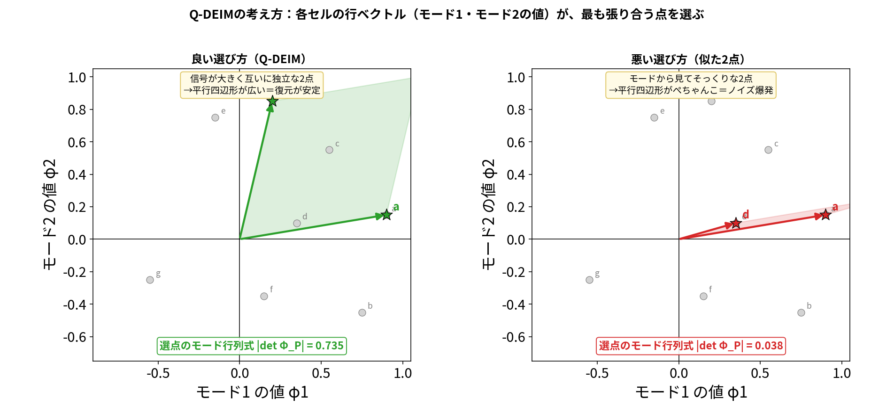

*左（良い）：**行ベクトルが直交気味の2点**を選ぶと、原点からの2ベクトルが作る平行四辺形が広い
＝ $\lvert\det U_{r,P}\rvert$ が大（0.735）＝連立がよく解ける。
右（悪い）：**行ベクトルがそっくりな2点**だと平行四辺形がぺちゃんこ＝ $\det$ が小（0.038）＝ノイズが爆発。
つまり「**選点でのモード行列式（体積）が大きい点集合ほど、復元が安定**」。*

### 4-2. Q-DEIM ＝「信号が大きく・互いに独立な点」を貪欲に選ぶ

では体積が最大の点集合をどう見つけるか。全組み合わせを試すのは大変なので、Q-DEIM は
**貪欲法（1点ずつ最善を足す）** 選びます。これが「モード行列の転置に **列枢軸付きQR分解** をかける」の中身:

1. **1点目**：全セル（ $U_r$ の 20,696 行）の中で、行ベクトルの長さ $\lVert\psi_i\rVert$ が **最大**のセルを選ぶ（一番強く場に効く点）。実際はセル 7634（P0、0.0369）。
2. **2点目**：1点目の方向を全セルから **差し引き**（＝1点目で説明できる分を消す）、
   **残り（＝1点目では分からない成分）が最大**の点を選ぶ。
3. これを $r$ 点そろうまで繰り返す。

**「新しい点ほど、すでに選んだ点では分からない情報を最大にする」** という素直な戦略です。
上の図なら、まず行ベクトルが一番長い **a**（モード1が最大）を選び、次に a の向きを消して残りが最大の **h**（モード2が最大）を選ぶ
→ 直交気味の良いペアになります。列枢軸QRはこの手順を数値的に安定に行うだけで、魔法ではありません。

### 4-3. 手計算：1点で場が復元できることを確かめる（文字式）

いちばん簡単な **モード1本（ $r=1$ ）** の場合で、上の手順を最後までやってみます。
$U_1=\varphi_1=a/\lVert a\rVert$ （§3のランク1例）。
枢軸QRは **絶対値が最大の成分**を最初の点に選ぶので、 $a_A>a_B>a_C$ より選ばれるのは **セルA**
（一番よく振れる点）。「振れの大きい場所を測れ」という直感どおりです。

では本当に **A の1点だけ**で場全体が戻るか。ある時刻 $t_k$ で **A だけ測る**と、
測定値の変動は $u_A(t_k)-\bar u_A=a_A g_k$ 。選点行は $U_{1,A}=\varphi_1[A]=a_A/\lVert a\rVert$ なので、係数は

$$\alpha=\bigl(U_{1,A}\bigr)^{+}\bigl(u_A-\bar u_A\bigr)
=\frac{\lVert a\rVert}{a_A}\times a_A g_k=\lVert a\rVert\,g_k.$$

これを全場に伸ばすと、

$$\hat u=\bar u+\varphi_1\,\alpha
=\bar u+\frac{a}{\lVert a\rVert}\times\lVert a\rVert\,g_k
=\bar u+a\,g_k.$$

一方、真値は §3 の定義そのまま $u(t_k)=\bar u+a\,g_k$ 。つまり

$$\boxed{\ \hat u=\bar u+a\,g_k=u(t_k)\ }$$

**測っていない B・C まで、真値にピタリ一致**。 $\lVert a\rVert$ がきれいに約分して消えるのがミソで、
**ランク1なら1点測るだけで場が完全復元**できる、というのが文字式で最後まで確認できました。
本物は2〜3モードなので、同じ理屈で **数点**あれば場が復元できます。これが「少数の代表点でROMを組める」根拠です。

#### 実データで貪欲選択を1ステップずつ追う

§4-2の手順（①いちばん強い点を選ぶ ②その方向を差し引く ③繰り返す）が、
**実際にそのとおり動いているか**を20,696セルで確認します（`run/qdeim_explained.py`）:

```python
W = Ur.copy()                                  # Ur = 先頭5モード (20696×5)
for k in range(5):
    norms = np.linalg.norm(W, axis=1)          # 各行（各セルの行ベクトル ψ_i）の長さ＝「残っている情報」の大きさ
    p = int(np.argmax(norms))                  # ← 最大の点を選ぶ
    v = W[p] / np.linalg.norm(W[p])
    W -= np.outer(W @ v, v)                    # ← その方向を全セルから差し引く
```

実行すると、**選ばれる点と残差の減り方**はこうなりました:

| 順番 | 選ばれたセル | 座標 [mm] | そのときの残差ノルム | 差し引いた後の最大残差 |
|---|---|---|---|---|
| 1点目 | 7634 | (21.3, −1.6, 51.6) | 0.03688 | 0.02657 |
| 2点目 | 7924 | (−14.1, 33.1, 51.6) | 0.02657 | 0.01922 |
| 3点目 | 7765 | (36.5, 6.9, 50.8) | 0.01922 | 0.01729 |
| 4点目 | 859 | (35.1, 0.8, 0.8) | 0.01729 | 0.01425 |
| 5点目 | 733 | (−35.1, 0.8, 0.8) | 0.01425 | **0.00000** |

読み取れることが3つあります:

- **残差が単調に減る**：0.0369 → 0.0266 → 0.0192 → 0.0173 → 0.0143。
  1点選ぶごとに「まだ分かっていない情報」が着実に減っています。
- **5点目で残差がちょうど0**：5モードぶんの情報を5点で完全に張り切ったということ。
  これが「 $r$ モードには $r$ 点」の意味です。
- **選ばれる順番が意外**：1点目は**ヒータ最近傍ではなく中央高さの点**(21.3, −1.6, 51.6)。
  ヒータ側の点(36.5, 6.9, 50.8)は3番目です。
  Q-DEIMは「一番熱い点」ではなく「**場全体をいちばんよく代表する点**」を選ぶためで、
  この直感とのズレは押さえておくべきところです。

**`scipy` の枢軸QRと一致するか**も確認しました:

```
手で追った貪欲選択: [7634, 7924, 7765, 859, 733]
scipy 枢軸QR      : [7634, 7924, 7765, 859, 733]   → 完全一致
```

つまり `qr(..., pivoting=True)` は、**上のループを数値的に安定にやっているだけ**です。

#### 適当に5点選んだ場合と比べる

「わざわざQ-DEIMを使う価値があるのか」を、ランダムな5点200通りと比較しました。
**5点から全20,696セルを復元したときのRMSE**です:

| 選び方 | 復元RMSE |
|---|---|
| **Q-DEIM** | **0.00081 K** |
| ランダム（中央値） | 0.00220 K |
| ランダム（最良） | 0.00051 K |
| ランダム（**最悪**） | **1.396 K** |

ここが実務的に重要です:

- 中央値との比較では**3倍**の差にすぎず、**運が良ければランダムでもQ-DEIMを上回る**（最良0.00051 K）
- しかし**最悪のランダム配置は1.396 K** ＝ Q-DEIMの**約1700倍**の誤差
- 選点行列の行列式でも Q-DEIM $4.6\times10^{-9}$ に対しランダム中央値 $3.1\times10^{-11}$ （約150倍）

この2つを図にするとこうなります:

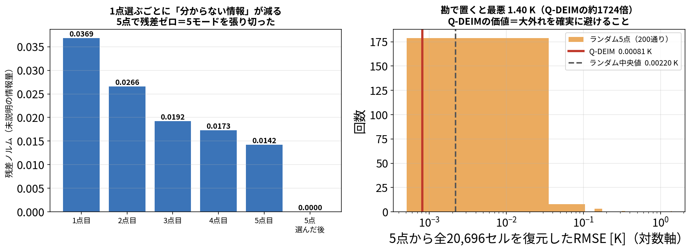

*左：1点選ぶごとに残差が減り、5点で完全にゼロになる。右：ランダム5点200通りの復元RMSE分布（対数軸）。多くは Q-DEIM の近くに集まるが、**裾が1.4 Kまで伸びている**のが危険。*

→ **Q-DEIMの価値は「平均的に少し良い」ことではなく、「大外れを確実に避ける」こと**です。
勘で置くと、たまたま似た情報しか持たない点ばかりを選んでしまい、
復元が桁で崩れる危険があります。

### 4-4. 実際に選ばれた5点

本ケース（20,696セル、モード5本）に Q-DEIM をかけると、上の貪欲手順で次の5点が選ばれます:

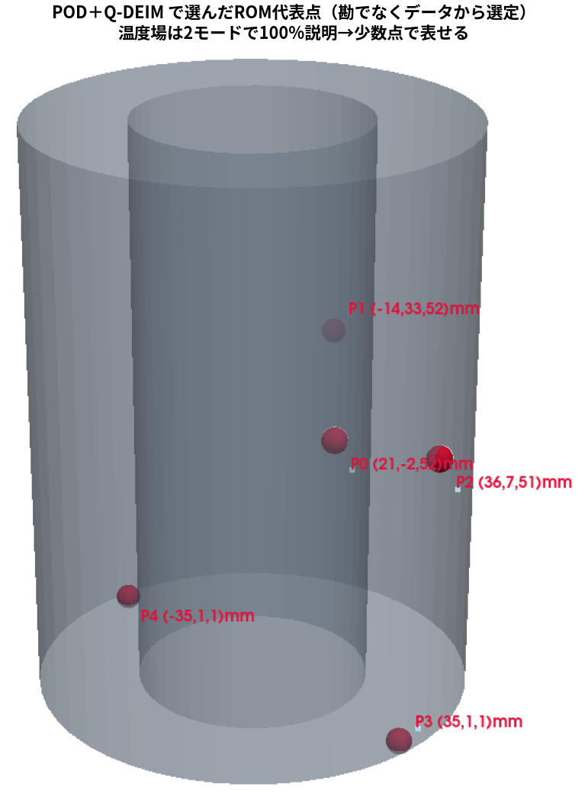

5点を個別に読み取れるよう、5点と実際の変位観測点を同じ座標系に重ねた図も示します。

#### 「高感度／低感度」はどういうロジックで決めているか

> **2026-10-02 訂正**：以前は「温度センサは発熱感度 $\partial T/\partial Q$ の高い点に置く」と書いていましたが、この選び方はやめました。発熱感度の上位から選ぶと、熱源のある A 側に2本とも集まり、温度場全体や反りを当てるには不利でした（温度2点・ROM真値の比較で、A 側だけの P2＋P0 は両側の P2＋P4 の約2倍の誤差）。温度センサの選び方は [blog_005 §4-6](blog_005_optimal_sensor_placement.md) にあります（熱感度 $W$ と温度のばらつきから選ぶ）。

以下は、本研究の計算で実際に使った「高感度／低感度」の決め方の記録です。

**① 温度点の高/低感度（本番の計算で温度点を選ぶのに使った量）＝ 発熱への温度感度 $\partial T/\partial Q$**

> 「ヒータの発熱が変わったとき、**温度がよく反応する場所**はどこか」

1. 発熱を10%増やして（ $q_\mathrm{scale}$ : 1.0→1.1）ROMをもう一度回す
2. 加熱ピーク（ $t=300$ s）で、各点の温度上昇の差をとる： $s_i=\dfrac{T_i(1.1Q)-T_i(Q)}{0.1Q}$
3. 大きい順に並べる → **最大＝高感度（P2＝ヒータ最近傍、5.7）**、**最小＝低感度（P4＝反対側の底面、2.6）**

物理的な理屈：**熱源に近いほど発熱変化が薄まらずに届く**ので反応が大きい。遠い点は拡散でならされ、反応が鈍い。

**② 変位センサの高/低感度（高W/低W）＝ 温度への変位感度 $W=K_s^{-1}H_T$**

> 「温度が変わったとき、**変位がよく動く場所**はどこか」

1. FrontISTRの熱弾性（ $K_s u=H_T T$ ）を1度解いて、温度→変位の行列 $W$ を作る
2. 候補点ごとに **$W$ の行ノルム**（＝その点の変位が温度場にどれだけ反応するか）を計算
3. 大きい順に並べる → **高W＝上端の点**、**低W＝底面の点**

物理的な理屈：**底面は固定**なので、そこから遠い上端ほど各層の伸びが**累積**して現れる（てこの先端ほど動く）。
底面近くは拘束されていてほとんど動けない＝測っても情報が少ない。

**まとめ表**：

| | 温度センサ | 変位センサ |
|---|---|---|
| 感度の定義 | $\partial T/\partial Q$ （発熱→温度） | $W=K_s^{-1}H_T$ の行ノルム（温度→変位） |
| 決め方 | $Q$ を10%振って温度差を見る | FrontISTRを1回解いて $W$ の行を比べる |
| 高感度の場所 | **ヒータ最近傍**（P2） | **上端**（固定面から最遠） |
| 低感度の場所 | 反対側の底面（P4） | 底面（固定で動けない） |
| 使ってよいか | **温度センサの選び方としては使わない**（上の訂正を参照） | 変位センサの置き場所には有効（よく動く点） |

（詳しい導出は blog_002 §4 と `105_0_sensor_placement_sensitivity/docs/03_sensor_design_guide.md` にあります。）

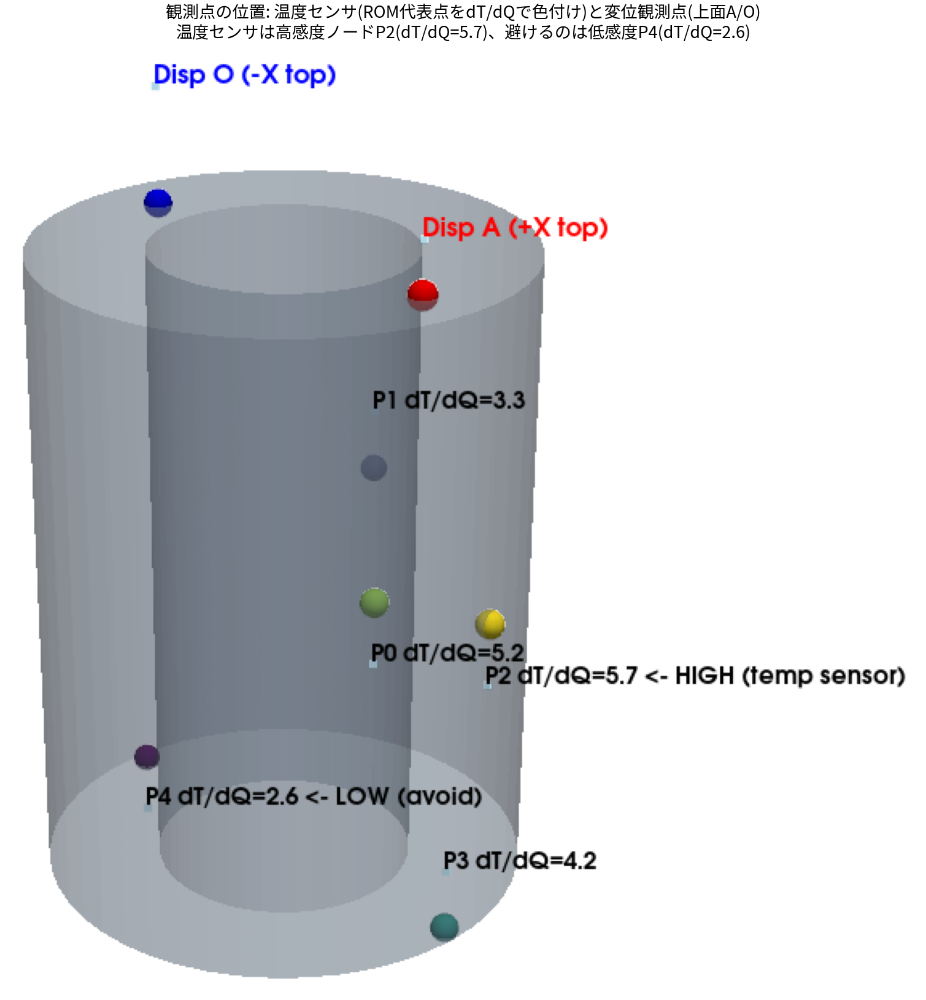

| 点 | 座標 $(x,y,z)$ [m] | 役割 |
|---|---|---|
| P0 | (0.0213, −0.0016, 0.0516) | 中央高さ・温度代表点 |
| P1 | (−0.0141, 0.0331, 0.0516) | 中央高さ・反対側の温度代表点 |
| **P2** | (0.0365, 0.0069, 0.0508) | **ヒータ側の温度代表点（本番の温度観測点）** |
| P3 | (0.0351, 0.0008, 0.0008) | 底面・ヒータ側の温度代表点 |
| **P4** | (−0.0351, 0.0008, 0.0008) | **反対側（O 側）底面の温度代表点** |

赤い ``Disp A`` と青い ``Disp O`` は温度点ではなく、FrontISTRで取得する上面の
変位観測位置です。つまり **P0〜P4は温度場を表す点、A/Oは変位を測る点**で、役割が異なります。

*勘の流用点（すべて中央高さ）と違い、**底面(P3,P4)も選んで場を広くカバー**している。
「1点目＝一番効く点 → 以降＝それまでで分からない情報が最大の点」を繰り返した結果で、
**上下・ヒータ側/反対側にバラけて場全体を押さえている**のが分かります。
「勘」ではなく「データから系統的に」選んだ点であることがポイント。*

---

## 5. 実データの POD 結果（図で確認）

### 5-0. 小例から実データへ ― モードは「空間の分布（型）」

§3の小例は $X=a\,g^{\mathsf T}$ とランク1で、**モードは1本**（ $\varphi_1=a/\lVert a\rVert$ ）＝
「A強・B中・C弱」という **3セル上の分布** でした。実物の温度場は片側加熱で少し複雑なので、
1本では足りず **数本のモード** が要ります。ただしやることは全く同じ:
**20,696セル × 121時刻のスナップショット行列を SVD すると、モード $\varphi_1,\varphi_2,\varphi_3,\dots$ が出ます。**

ここで大事なのは、**各モード $\varphi_k$ は「1枚の空間分布（円筒のどこがどれだけ動くかの地図）」** だということ。
小例の $a=(a_A,a_B,a_C)$ を、3セルから20,696セルへ拡張したものです。
そして温度場は「平均場 ＋ モード分布の足し合わせ」で表せます:

$$\hat u(t)=\bar u+a_1(t)\,\varphi_1+a_2(t)\,\varphi_2+\dots$$

（ $\varphi_k$ ＝時間によらない空間の型、 $a_k(t)$ ＝その型が時刻ごとにどれだけ混ざるか）。

### 5-1. 各モードの分布を読む

下の図が、実際に出た **平均場と上位3モードの空間分布** です:

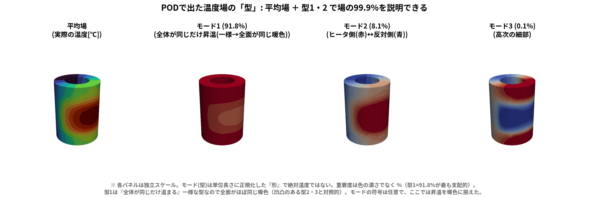

各パネルの色は「そのモードが円筒のどこで正／負か」を表します。読み方:

- **平均場**：定常的な下地の温度分布（ヒータ側が高い、実際の℃）。ここからの**変動**をモードが表す。
- **モード1（91.8％）**：ほぼ**一様な型**＝「全体が同じだけ昇温する」分布（全面がほぼ同色）。
  小例の「全セルが一斉に上下する」に対応。**最も支配的**。
- **モード2（8.1％）**：**ヒータ側が＋・反対側が−**の偏り分布＝片側加熱の**非対称**を表す型。
- **モード3（0.1％）**：さらに細かい残り（上下・角度方向の微調整）。ほとんど効かない。

つまり「モードを分解した」結果は、**"一様昇温"＋"ヒータ側/反対側の偏り"＋"微細な残り" という
分布の重ね合わせ**に温度場を分けた、ということです。

> **コラム：モードの意味は"後付け"／事前にわかる？**
>
> モードは **あらかじめ意味を決めて作るものではなく、データ（SVD）から自動で出てくる** ものです。
> 並び順は必ず **エネルギー（変動の大きさ）の大きい順**：モード1＝一番大きい変動の型、
> モード2＝それを除いた残りで最大（モード1と直交）、…という具合。
> 「一様昇温」「片側の偏り」という **物理的な意味は、出てきた分布を見て人間が後から解釈** したものです。
> SVDはヒータの存在も物理も知らず、ただ「分散が最大の直交方向」を順に拾っただけ。
> 物理がたまたま解釈しやすい形にしてくれている、という順序です。
>
> **事前に確定はできません**（＝データ駆動）。CFDを回してスナップショットをSVDして初めて、
> 分布の形も **エネルギー比（91.8 / 8.1 / 0.1％）** も決まります。
> ただし **対称性・物理から"顔ぶれ"の見当はつきます**：片側加熱の対称な物体なら、
> 経験的に「①全体昇温 → ②ヒータ側と反対側のdipole（偏り）→ ③高次の細かい模様」となりがちで、
> 今回もそのとおりでした。なお **モードの符号は任意**（ $\varphi$ と $-\varphi$ は同じ意味）で、
> エネルギーが近い2モードは **順番が入れ替わる** こともあります。
> 加熱位置や境界条件が変われば **モードも変わる**（その問題固有）。

### 5-2. エネルギー ― どのモードが何割を説明するか

各モードの **エネルギー比** は「場の変動のうち、その型が何割を説明するか」（小例では1モードで100％でした）:

| モード | エネルギー比 | 累積 |
|---|---|---|
| モード1 | 91.81％ | 91.81％ |
| モード2 | 8.08％ | **99.89％** |
| モード3 | 0.11％ | 99.996％ |

**2モードで99.9％** ＝ 温度場は実質2自由度（一様昇温＋片側の偏り）でほぼ説明しきれる。
だから **数点の代表点でROMを組めば十分** ＝ §4のQ-DEIMで少数点を選ぶ根拠になります。

### 5-3. モードを足すほど真値に近づく

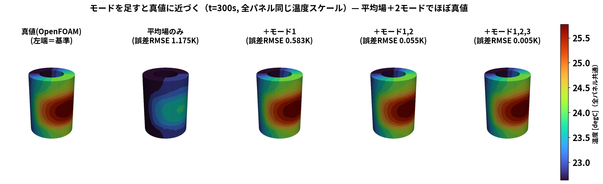

*平均場のみ（誤差1.175K）→ ＋モード1（0.583K）→ ＋モード1,2（0.055K）→ ＋モード1,2,3（0.005K）。
モードを1つ足すごとに桁で誤差が縮む＝PODが効率よく場を捉えている証拠。*

### 5-4. 5点から温度分布を復元する ― 遠いセルも「モード経由」で決まる

データ同化が **5点の温度** を出したら、そこから **全20,696セルの温度分布** を復元できます（gappy-POD）。手順は2段:

1. **5点の測定値からモードの混ぜ具合を解く**： $a=U_{5,P}^{-1}\,(T_5-\bar u_5)$ （ $U_{5,P}$ ＝5点でのモード値の $5\times5$ 行列）
2. **全セルを復元**： $\hat T_i=\bar u_i+\sum_k a_k\,\varphi_{k,i}$ （各セルは **自分のモード値** $\varphi_{k,i}$ を使う）

#### 選択行列から復元式まで省略せずに書く

$T_r$ はデータ同化後の5代表点温度（全5点の直接測定値ではありません）。全場を $T_{\rm full}\approx\bar u+\Phi a$ と表すと、

$$
T_r=P T_{\rm full}\approx P\bar u+P\Phi a.
$$

平均を引いて $(P\Phi)a=T_r-P\bar u$ を解き、全場の式へ戻すと、

$$
a=(P\Phi)^+(T_r-P\bar u),\qquad
\widehat T_{\rm full}=\bar u+\Phi(P\Phi)^+(T_r-P\bar u).
$$

$P\Phi$ は5×5。フルランクなら逆行列と疑似逆行列は一致します。一般には、選んだ点での残差二乗和を最小にする係数を疑似逆行列で求めます。観測点数不足やモード外の温度変化があれば、全場を一意・正確に復元できるとは限りません。

「gappy」は全場の一部にしか値がない状態を指します。この処理は距離補間ではなく、学習した空間モードによる復元です。

#### この式の読み方 ―「モードの割合」で各点の温度が決まる

**各時刻のモード係数 $a_k$ が、固定したモードをどれだけ足すかを決めます**。係数は負にもなり、合計1の割合ではありません。式の2つの部品は役割がはっきり違います:

- $a_k(t)$ … **モードの割合（混ぜ具合）**。時刻ごとに1組の数（ $a_1,a_2,\dots$ ）で、**全セルで共通**。5点の測定から決まる。
- $\varphi_{k,i}$ … **そのセルがモード $k$ をどれだけ受け取るか**（＝ $U_r$ の $i$ 行目、 $k$ 番目の値）。POD で1度だけ決まり、**時間によらず固定**。

だから各セルの温度は「**下地 $\bar u_i$ ＋（全体の割合 $a_k$ ）×（そのセルの受け取り $\varphi_{k,i}$ ）の合計**」。
例えるなら **ミキシングボード**：モードが1本ずつのスライダー（空間パターン）で、 $a_k$ がその上げ幅。
5点で「今どのスライダーがどれだけ上がっているか」を読み取れば、あとは各セルが自分の感度でその音を受け取るだけです。

**1セルで確認**（上のCで、割合が $a=(1,\ 0.5)$ のとき）:

$$\hat T_C=\bar u_C+a_1\,\varphi_{1,C}+a_2\,\varphi_{2,C}=20.75+1\times0.3+0.5\times0.7=21.4.$$

もし別の時刻で割合が $a=(2,\ 0.3)$ に変われば、**同じC**でも

$$\hat T_C=20.75+2\times0.3+0.3\times0.7=21.56$$

と変わります。つまり **温度の時間変化は「割合 $a(t)$ の変化」で表される**（下地とモードの形は固定、動くのは割合だけ）。
そして **全セルが同じ $a$ を共有する**から、5点で $a$ さえ決めれば、残り全部が決まる ―― これが「5点から分布を作る」の芯です。

**ここが肝心**：遠いセルは「近くの5点からの距離で内挿」しているのでは **ありません**。
5点で決めた係数 $a$ を、そのセル **自身の行ベクトル** $\varphi_{k,i}$ に掛けて計算します。
だから「5点から遠い反対側のセル」も、モードの形を通じてちゃんと値が決まります。

**具体例（2モードで確認）**：3セルA,B,C、平均 $\bar u=(23,\ 21.5,\ 20.75)$ 、モード

$$\varphi_1=(0.8,\ 0.5,\ 0.3),\qquad \varphi_2=(0.1,\ -0.6,\ 0.7).$$

真の混ぜ具合を $a=(1,\ 0.5)$ とすると、真の温度は $u=\bar u+a_1\varphi_1+a_2\varphi_2$ ＝

$$u_A=23.85,\quad u_B=21.7,\quad u_C=21.4.$$

いま **A・Bだけ測り、Cは遠くて測らない**とします。選点行列と測定値は

$$U_{2,P}=\begin{pmatrix}0.8 & 0.1\\ 0.5 & -0.6\end{pmatrix},\qquad
u_P-\bar u_P=\begin{pmatrix}23.85-23\\ 21.7-21.5\end{pmatrix}=\begin{pmatrix}0.85\\ 0.2\end{pmatrix}.$$

逆行列（ $\det=0.8\cdot(-0.6)-0.1\cdot0.5=-0.53$ ）を掛けて混ぜ具合を復元:

$$a=U_{2,P}^{-1}\begin{pmatrix}0.85\\ 0.2\end{pmatrix}
=\frac{1}{-0.53}\begin{pmatrix}-0.6 & -0.1\\ -0.5 & 0.8\end{pmatrix}\begin{pmatrix}0.85\\ 0.2\end{pmatrix}
=\frac{1}{-0.53}\begin{pmatrix}-0.53\\ -0.265\end{pmatrix}
=\begin{pmatrix}1\\ 0.5\end{pmatrix}.$$

この $a=(1,0.5)$ を、**一度も測っていないC** の行ベクトル $\varphi_{\cdot,C}=(0.3,\ 0.7)$ に掛けると:

$$\hat T_C=\bar u_C+a_1\varphi_{1,C}+a_2\varphi_{2,C}=20.75+1\times0.3+0.5\times0.7=21.4=u_C.$$

**遠いCが、測らずにピタリ復元できました。** 距離で内挿したのではなく、
「5点で決めた $a$ ×Cのモード値」で決まっている ―― これが「5点から分布を作る」の正体です。

**動く絵で見ると**（各時刻でROMの5点温度から全場を復元）:


*ピンク色の球（マゼンタ）＝復元に使う5点（温度コンタは半透明で内部の点も見える）。各時刻でROMが出す5点温度からモード係数 $a(t)$ を解き、全20,696セルを復元。
ヒータ側が熱く反対側が冷たい分布が、加熱→（300秒でOFF）→冷却と動く。
**5点しか使っていないのに、面全体の温度分布が出る**のがPODの効きどころです。*

---

## 6. 選んだ5点で ROM を組み、校正する

### 6-1. 一般化した集中定数モデル

**ノードは §4 で選んだ5点そのもの**（P0〜P4）。その各ノード $i$ について、次の1本を立てます
（ $i=0,1,2,3,4$ の**5本**の連立式）:

$$C_i\frac{dT_i}{dt}=\sum_{j\ne i}K_{ij}(T_j-T_i)+q_i(t)-h\,(T_i-T_\mathrm{air}).$$

右辺は左から「**他ノードからの熱流入**」「**発熱**」「**空気への放熱**」の3項です。

- $C_i$ … ノード $i$ の熱容量 [J/K]
- $K_{ij}$ … ノード $i,j$ 間コンダクタンス [W/K]（対称・全点対、5点なら10本）
- $q_i$ … 発熱。**ヒータ最近傍ノード P2 だけに投入**（他は $q_i=0$ ）
- $h$ … 放熱係数 [W/K]

「どのノードの式か」を3Dで示すと（ParaView風）:

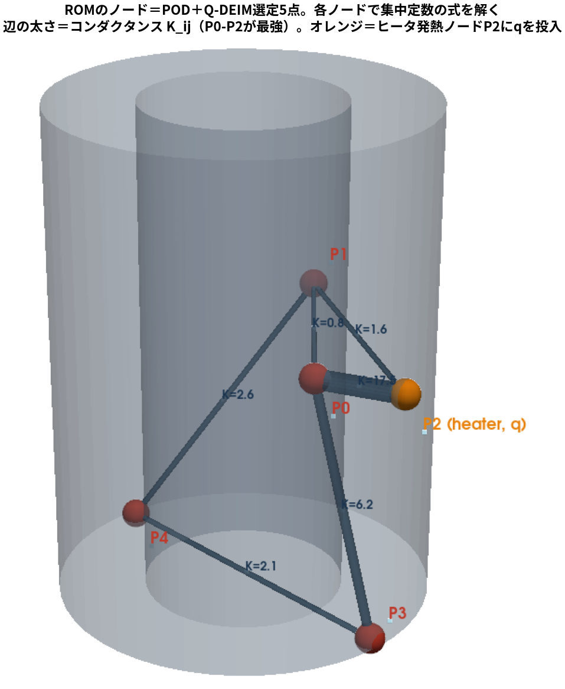

*ノード＝POD＋Q-DEIM選定5点。各辺の太さが校正で決まったコンダクタンス $K_{ij}$ で、
**P0–P2 が最強（ $K=17.5$ W/K）**＝ヒータ側どうしが強く熱をやり取りする。
**オレンジのP2がヒータ発熱ノード**（ $q$ を投入）、そこから P0→P3→…と全ノードへ熱が伝わる。
底面 P3・P4 は弱い結合で、冷えやすい末端。*

各ノードの熱容量 $C_i$ ・結合 $K_{ij}$ ・放熱 $h$ は次の6-2で実データに合わせて決めます。
行列形にすると線形システムになり、RK4 で一括前進積分できます（これが約31msの正体）。

> **1D-CAEとの関係**：この「熱容量ノードをコンダクタンスで結び、発熱と放熱を付けた**熱RC回路**」は、
> まさに 1D-CAE（Modelica／Simulink や熱回路網法）でやる **集中定数モデル** と同じ枠組みです。
> 違いは2点だけ：教科書的な1D-CAEが **ノードを勘で置き** 、 **係数を幾何の公式**（例 $K=kA/L$ , $C=\rho c V$ ）で
> 決めるのに対し、ここでは **ノードを POD＋Q-DEIM でデータから選び** 、 **係数を3D連成解析にフィット** します。
> つまり **"点も係数もデータ駆動の1D-CAE"** です。

### 6-1b. 発熱は「1点」に入れている ― これは近似です

上の式で発熱 $q_i$ は **P2 の1点だけ**に入れています。他の4点はゼロです。
でも、**実際のヒータは面状に広がっています**。ここは近似なので、はっきり書いておきます。

| | 実際（OpenFOAM） | ROM |
|---|---|---|
| ヒータの形 | 外周の**面**（半径 37.5 mm、高さ 25〜75 mm、周方向 ±76°、約 5,000 mm²） | **P2 の1点** |
| 与え方 | 面の境界条件として 15 W を分布させる | P2 の熱容量 93.4 J/K に 15 W を全部投入 |

Python のコードで見ると、こうなっています（`dacore/rom_general.py`）。

```python
def heater_power_W(t, q_scale=1.0):
    return np.where(np.asarray(t) < HEATER_ON_S, q_scale * HEATER_RATED_W, 0.0)
    #                      t < 300 s なら  q × 15 W、それ以降は 0 W

def deriv(Tv, t):
    heat = np.zeros_like(Tv)                                        # ① まず5点ともゼロ
    heat[:, heat_node] = heater_power_W(t, q_scale) / C[heat_node]  # ② P2 の列だけに入れる
    return np.einsum("eij,ej->ei", M, Tv) + b_air + heat
```

`heat_node = 2`（P2、(36.5, 6.9, 50.8) mm）で、実際のヒータにいちばん近い代表点です。
配列で書くと、どのメンバーも P2 の列だけが非ゼロです。

```
heat = [[0, 0, ●, 0, 0],      ← メンバー1（この●は 15q₁/93.4）
        [0, 0, ●, 0, 0],      ← メンバー2（●は 15q₂/93.4）
        ...                        メンバーごとに q が違うので●の値も違う
        [0, 0, ●, 0, 0]]      ← メンバー60
              ↑ heat_node = 2（P2）
```

#### なぜ1点集中でも合うのか

**$C_i$ と $K_{ij}$ を、OpenFOAM の結果に合うよう逆算しているからです**（次の §6-2）。

「発熱は P2 の1点に入る」という前提のもとで、**5点の温度履歴が OpenFOAM と一致するように**係数を決めています。
つまり、**ヒータが面状に広がっていることの効果も、 $C$ と $K$ が吸収しています。**

実際、ROM 単体の予測誤差は最大 **0.038 K** で、温度計のノイズ 0.3 K の約 1/8 に収まっています
（[blog_007 §2](blog_007_rom_applicability.md)）。1点集中でも実用上は問題ありませんでした。

> **言い換えると**：ROM の P2 は「ヒータそのもの」ではなく、
> **ヒータからの熱が最初に入る場所を代表する点**です。
> 5点に落とし込んだ時点で、空間的な広がりは表現していません。

#### この近似が効いてくる場面

| 条件が変わる | 影響 | 理由 |
|---|---|---|
| 発熱量（15 W → 25 W） | **問題なし** | 入れる量が変わるだけ。分布は同じ |
| 加熱のしかた（間欠加熱） | **問題なし** | 入れるタイミングが変わるだけ |
| **ヒータの位置・形** | **作り直しが必要** | 熱の入り方が変わるので、 $C$ ・ $K$ も `heat_node` も合わなくなる |

[blog_007](blog_007_rom_applicability.md) の結論で「熱源の位置が変わったら作り直し」としているのは、この理由です。

### 6-2. 係数 $K_{ij}$ はどう決める？ ― 幾何でなく校正（最小二乗）

$K_{ij}$ は公式 $K=kA/L$ では計算しません。**「5点のROM温度履歴が、OpenFOAMの5点温度履歴に一致するように」**
未知パラメータをまとめて逆算（同定）します。未知は

$$\theta=[\,\underbrace{C_1,\dots,C_5}_{5},\ \underbrace{K_{12},K_{13},\dots,K_{45}}_{10},\ \underbrace{h}_{1}\,],$$

の **合計16個**。

ROMを $\theta$ で前進積分して5点温度 $T_p^{\mathrm{ROM}}(t;\theta)$ を作り、OpenFOAM の $T_p^{\mathrm{OF}}(t)$ との差を最小化します
（ $C,K,h\ge0$ の範囲制約つき、`scipy.optimize.least_squares`）:

$$\hat\theta=\arg\min_{\theta}\ \sum_{p=1}^{5}\sum_{t}\bigl(T_p^{\mathrm{ROM}}(t;\theta)-T_p^{\mathrm{OF}}(t)\bigr)^2.$$

**実際のコードはこれだけ**です（`run/build_calibrate_rom.py` の要点）:

```python
from scipy.optimize import least_squares
import numpy as np

# Yobs : OpenFOAMの5点温度履歴 (nt,5)  ← 校正の目標
# ts   : 時刻列,  DT: 内部刻み,  heat_node: 発熱を入れるノード(=P2)

def forward(theta):
    """θ=[C(5), K上三角(10), h(1)] でROMを前進積分し、5点温度履歴を返す。"""
    C = theta[:5]
    K = tri_to_matrix(theta[5:15], 5)      # 10個 → 対称5x5コンダクタンス行列
    h = theta[15]
    T = np.full(5, T_air); Y = [T.copy()]
    for a, b in zip(ts[:-1], ts[1:]):      # 各区間を RK4 で前進
        T = integrate_rom(T, C, K, h, q=1.0, heat_node=heat_node, t0=a, t1=b, dt=DT)
        Y.append(T.copy())
    return np.array(Y)                      # (nt,5)

def resid(theta):
    return (forward(theta) - Yobs).ravel()  # OpenFOAMとの差（残差ベクトル）

x0 = np.r_[np.full(5, 120.0), np.full(10, 1.5),  0.3 ]   # 初期推定 [C,K,h]
lb = np.r_[np.full(5,   1.0), np.full(10, 1e-4), 1e-4]   # 下限（すべて≥0）
ub = np.r_[np.full(5,5000.0), np.full(10, 200.0), 50.0]  # 上限

sol = least_squares(resid, x0, bounds=(lb, ub))          # ← 16個をまとめて同定
C, K, h = sol.x[:5], tri_to_matrix(sol.x[5:15], 5), sol.x[15]
```

やっていることは「 $\theta$ を少しずつ変えて `forward` の出力を OpenFOAM に近づける」だけ。
`least_squares` が残差の二乗和を最小にする $\theta$ を自動で探します（**16個の未知を一括同定**）。

> **`Yobs` の正体＝OpenFOAM の結果**です。実際には
> ```python
> ts, C_all, X = load_snapshots()   # OpenFOAMの各時刻 solid/T を読む (20696×121)
> Yobs = X[cells, :].T              # そのうちQ-DEIM選定5点の温度履歴だけ抜き出す
> ```
> のように、**`load_snapshots()` がCHT結果を読み込み**、5点ぶんを取り出したものが校正の目標。
> OpenFOAMの結果は **①POD＋Q-DEIM（点選び）** と **②この校正** の両方の材料になっています
> ―― これが「オフラインでCFDが必須」（§1-1）の正体です。

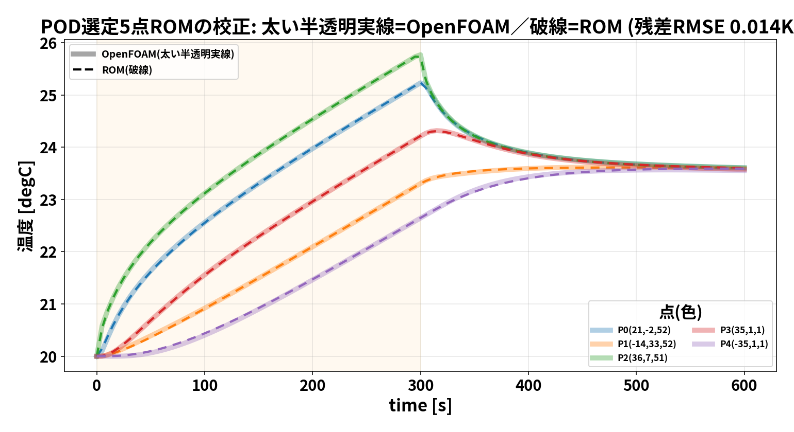

*太い半透明線＝OpenFOAM、破線＝POD選定5点ROM。ほぼ完全に重なる（残差 RMSE 0.014 K）。*

同定された $K_{ij}$ （W/K）は、幾何でなく **3Dの伝熱がそう振る舞うように** 決まります:

| 結合 | $K_{ij}$ | 意味 |
|---|---|---|
| P0–P2 | **17.5** | ヒータ側どうし＝最強 |
| P0–P3 | 6.2 | ヒータ側の縦方向 |
| P1–P4, P3–P4 | 2.6, 2.1 | 反対側・底面 |
| P1–P2 | 1.6 | 中央どうし |
| その他 | ≈0 | 弱く、実質つながっていない |

**P0–P2 が突出**＝ヒータ近傍の強い熱交換を反映。**"つながりの強さ"がデータから浮かび上がる**のが、
勘で組む1D-CAEとの違いです。

- **当てはめ残差 RMSE ＝ 0.014 K**（OpenFOAMをほぼ完全に再現）
- 全熱容量 $\sum C_i=1211$ J/K は、鋼2.49 kg の $\rho c_p V\approx1195$ J/K とほぼ一致
  （数字合わせでなく **物理的にも妥当**。フィットなのに物理量として筋が通る）

---

## 7. 温度が求まったら ― 実形状にマッピングして FrontISTR で変位を出す

ROM＋データ同化で温度が求まっても、本当に知りたいのは **変位（熱膨張・反り）** です。
温度→変位は blog_001 と同じ FrontISTR ですが、ここでは「**温度をどう実形状へ渡すか**」を数式で押さえます。

### 7-0. 変位を「観測」として使う手続き ― 状態に入れずに観測演算子で作る

先に、いちばん分かりにくいところを片付けます。
**「変位計の値をデータ同化にどう入れるのか」**です。


*①観測データの作り方（双子実験）／②予報観測 $Y_f$ の作り方／③EnKFの更新式。*

#### まず結論

> **変位は状態ベクトルに入れません。** 状態はあくまで
> $z=(T_1,\dots,T_5,\;Q,\;h)^{\mathsf T}$ の7次元のままです。
> 変位は**観測演算子の中で、そのつど温度から計算します**。

これができる理由は、**温度から変位への写像が線形**だからです（§7-2）。

#### 手続き（4ステップ）

EnKFの各サイクルで、**60メンバーそれぞれについて**次を実行します。

**ステップ1：そのメンバーの5点温度を取り出す**

$$T_5^{(m)}=(T_1^{(m)},\dots,T_5^{(m)})\qquad m=1,\dots,60$$

**ステップ2：gappy-POD でモード係数にする**（§4-0 と同じ計算）

$$a^{(m)}=U_{r,P}^{+}\bigl(T_5^{(m)}-\bar T_P\bigr)\quad(5\times1)$$

**ステップ3：モード係数から変位を出す**

$$u^{(m)}=u_{\mathrm{mean}}+D\,a^{(m)}\quad(2\times1)$$

ここで $D$ は **FrontISTR で事前に作った定数行列**です（ $2\times5$ ）。

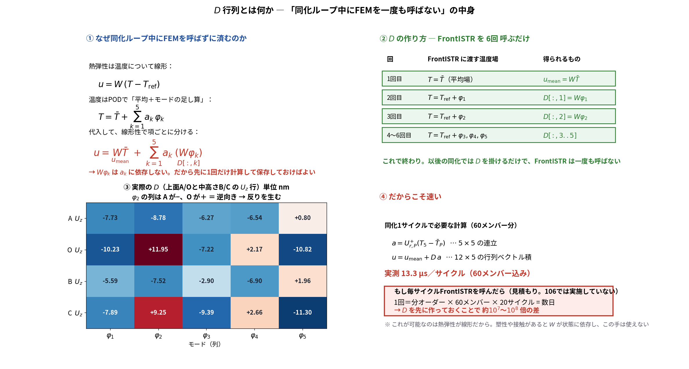

*①線形性で $u=W\bar T+\sum a_k(W\varphi_k)$ と分けられ、 $W\varphi_k$ は $a_k$ に依存しない
→ 先に計算して保存できる。②FrontISTR を6回（平均場＋5モード）呼ぶだけ。
③実際の $D$ （ $\varphi_2$ の列は A が−、O が＋ ＝ 逆向きで反りを生む）。
④60メンバー分の変位計算が **5.2 µs**。毎サイクルFEMを呼べば数日かかる。*

> ⚠️ **この手が使えるのは熱弾性が線形だから**です。
> 塑性・クリープ・接触があると $W$ が状態に依存するので、重ね合わせが成り立ちません。

各列 $D[:,k]$ が「モード $\varphi_k$ が1単位混ざったときの上面A/Oの変位」で、
**データ同化を始める前に FrontISTR を $1+5=6$ 回だけ呼んで作ってあります**（§7-2）。

> **重要：データ同化のループ中に FrontISTR は一度も呼びません。**
> 呼ぶのは事前の6回だけ。あとは $2\times5$ の行列を掛けるだけなので一瞬です。

**ステップ4：観測予報 $Y_f$ に並べる**

温度2点と変位2点を観測するなら、メンバーごとに4つの値を並べます:

$$Y_f^{(m)}=\bigl(\underbrace{T_{i_1}^{(m)},\,T_{i_2}^{(m)}}_{T},\ \underbrace{u_1^{(m)},\,u_2^{(m)}}_{u}\bigr)$$

（ $T$ ＝温度2点、 $u$ ＝変位2点）

実装はこれだけです:

```python
def disp_of_T5(T5):                      # (…,5) -> (…,2)
    a = (T5 - mean[pod_cells]) @ UP_pinv.T   # ステップ2：gappy-POD
    return uz_mean + a @ Dmode.T             # ステップ3：モード→変位

# ステップ4：温度と変位を横に並べて観測予報にする
Yf = np.column_stack([Z[:, nodes],                    # 温度2点
                      disp_of_T5(Z[:, :NPT])])        # 変位2点
Z  = enkf_update(Z, y, None, Rd, rng, inflation=INFL, Yf=Yf)
```

#### なぜこれで温度が直るのか

EnKF の更新式は**温度だけを観測したときとまったく同じ**です:

$$z^a=z^b+K\,(y-Y_f),\qquad K=C_{zy}\,(C_{yy}+R)^{-1}$$

変わるのは $C_{zy}=\mathrm{Cov}(z,Y_f)$ の中身だけ。
$Y_f$ に変位が入っているので、**温度と変位の共分散 $\mathrm{Cov}(T_i,u_j)$ が
アンサンブルから自動的に計算されます**。

$$C_{zy}=\begin{pmatrix}
\mathrm{Cov}(T_1,T_{i_1}) & \cdots & \color{red}{\mathrm{Cov}(T_1,u_1)} & \color{red}{\mathrm{Cov}(T_1,u_2)}\\
\vdots & & \vdots & \vdots\\
\mathrm{Cov}(Q,T_{i_1}) & \cdots & \color{red}{\mathrm{Cov}(Q,u_1)} & \color{red}{\mathrm{Cov}(Q,u_2)}
\end{pmatrix}$$

**赤い列があるから、変位の残差 $y_u-u^b$ が温度と発熱量を引っぱります。**
仕組みは blog_003 §4-0 の「温度しか測らなくても $Q$ が動く」とまったく同じで、
**測っていない量でも、測った量と相関していれば更新される**という一点に尽きます。

#### 非線形な観測でも同じ形で書ける

`enkf_update` は観測行列 $H$ ではなく **予報観測 $Y_f$ をそのまま受け取る**設計にしてあります
（`dacore/enkf.py`）。

```python
def enkf_update(Zf, y, H, R, rng, inflation=1.0, Yf=None):
    ...
    if Yf is None:
        Yf = Zf @ H.T        # 線形観測ならここで作る
```

今回の変位写像はたまたま線形（ $u=u_{\mathrm{mean}}+D\,a$ ）ですが、
**メンバーごとに実ソルバを通すような非線形観測でも、 $Y_f$ を渡せば同じ式で動きます**。
実際 104 では、各メンバーの温度場を FrontISTR に通した変位を $Y_f$ にしていました
（そのぶん1サイクルが分オーダーになり、ROM化の動機になりました）。

### 7-1. 温度を実形状（FEMメッシュ）へマッピング ― 逆距離加重

**ここからは空間の移し替えです。** 5点→全セルの復元は§5のgappy-PODで済んでいます。その後、CFDセルとFEM節点の位置の違いを補間します。以下はIDWの説明で、すべての図が同じ補間実装という意味ではありません。例えば未観測C/Dの検証スクリプトは最近傍セルを使います。各図の再現スクリプトで確認してください。


CFD（またはPOD復元）の温度は **セル中心 $x_c$** の値。いっぽう FrontISTR が要るのは **節点 $x_p$** の温度です。
そこで各節点に、近い $k$ 個のセルから **逆距離加重（IDW）** で内挿します:

$$T_p=\frac{\sum_{c\in\mathcal N_k(p)} w_{pc}\,T_c}{\sum_{c\in\mathcal N_k(p)} w_{pc}},\qquad
w_{pc}=\frac{1}{\lVert x_p-x_c\rVert}.$$

近いセルほど重み $w_{pc}$ が大きい、という素直な加重平均です（節点がセル中心と一致したらそのセル値をそのまま採用）。
$\mathcal N_k(p)$ は節点 $p$ に近い $k$ 個のセル。これで **温度分布が実物形状の節点に乗ります**。

**具体例（ $k=3$ ）**：ある節点 $p$ の近くに3つのセルがあり、
距離が $d_1=1,\ d_2=2,\ d_3=4$ mm、温度が $T_1=25,\ T_2=23,\ T_3=21$ ℃ だったとします。
まず重みは距離の逆数（**近いほど大きい／半分の距離なら2倍の重み**）:

$$w_1=\frac{1}{d_1}=1,\qquad w_2=\frac{1}{d_2}=0.5,\qquad w_3=\frac{1}{d_3}=0.25.$$

これを式に入れて、分子（重み付き和）と分母（重みの和）を計算すると:

$$T_p=\frac{w_1 T_1+w_2 T_2+w_3 T_3}{w_1+w_2+w_3}
=\frac{1\times 25+0.5\times 23+0.25\times 21}{1+0.5+0.25}
=\frac{41.75}{1.75}\approx 23.9.$$

つまり $T_p\approx23.9$ ℃。**一番近いセル（25℃, 重み1）に最も引っ張られ、遠いセルほど効きが弱い**のが数字で見えます。
もし節点がどれかのセルに重なると（ $d\to0$ ）その重みが無限大になり、**そのセル値がそのまま採用**されます
（＝最近傍フォールバック）。

#### 次のFEM式に出てくる記号

$\varepsilon_{\rm th}$ は熱ひずみ、 $\mathbf I$ は3×3単位テンソル、 $\Omega_e$ は要素eの領域、 $dV$ は体積積分の微小体積です。
$B$ は節点変位からひずみを作る行列、 $D$ はひずみから応力を作る弾性行列、 $f_{\rm th}$ は等価熱荷重[N]、 $K_s$ は構造剛性[N/m]です。
**このBはOIの誤差共分散ではなく、このDはPODモード変位応答でもありません。**
テンソルの熱ひずみを実装のVoigt表記に直すと、 $\alpha\Delta T(1,1,1,0,0,0)^{\mathsf T}$ です。後半3成分はせん断ひずみです。

### 7-2. 熱ひずみ → 節点荷重 → つり合い（熱弾性FEM）

> **ここは FrontISTR が内部でやること**です。私たちが渡すのは §7-1 の **節点温度** と
> **材料定数（ $E,\nu,\alpha,T_\mathrm{ref}$ ）・底面固定の拘束**だけ。以下は「その黒箱の中で何が起きているか」の説明で、
> 自分でコードを書くわけではありません（返ってくるのは節点変位 $u$ ）。

節点温度が入ると、各要素に **熱ひずみ**（等方・線膨張）が生じます:

$$\varepsilon_\mathrm{th}=\alpha\,(T-T_\mathrm{ref})\,\mathbf I.$$

これは「温めると各要素がこれだけ伸びたい」という量。FrontISTR はこれを **等価節点熱荷重** に変換し、

$$f_\mathrm{th}=\sum_e\int_{\Omega_e} B^{\mathsf T} D\,\varepsilon_\mathrm{th}\,dV$$

（ $B$ ＝ひずみ-変位行列、 $D$ ＝弾性行列）、**底面固定**の拘束のもとで線形弾性のつり合いを解きます:

$$\boxed{\ K_s\,u=f_\mathrm{th}\ }$$

得られる $u=(u_x,u_y,u_z)$ が各節点の変位です。要するに
「**伸びたい量 $\alpha\Delta T$ を集めて、つながりと拘束の中でつり合わせると変位が出る**」。
片側だけ熱いと伸びに差が出て、円筒が反ります。

### 7-3. 変形アニメーション

**表示の条件**：`run/make_temp_to_disp_figs.py`は、保存した1つのFrontISTR変位形状をA−O時系列の振幅で拡大縮小して動画にしています。色も元の変位場を使用します。各フレームでFrontISTRを解き直した変形時刻歴ではなく、反りの変化を説明する模式アニメーションです。定量的な時刻歴は次節のグラフで確認します。


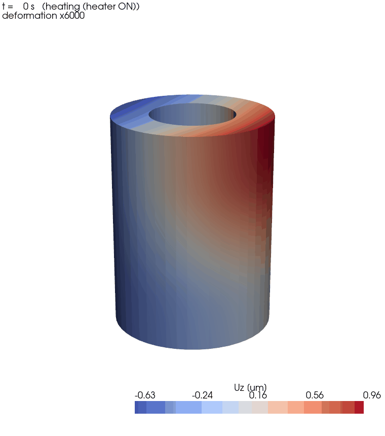

*色＝ $U_z$ 、形＝FrontISTRの節点変位（見やすさのため x6000 誇張）。加熱でヒータ側（赤＝上へ）が伸び、
反対側（青）と差がついて **反る**。300秒でヒータOFF→全体が均されて反りが戻る。半透明の灰＝元形状。*

### 7-4. 変位の時系列グラフ

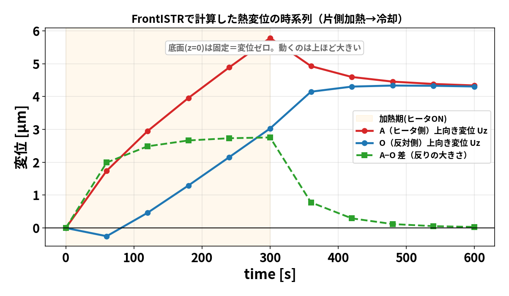

*上面2点の上向き変位 $U_z$ 。**A（ヒータ側）が先に伸び**、O（反対側）は遅れて追う。
A−O差（緑）＝反りは加熱中に増えてピーク約2.8µm、ヒータOFF後は温度が均されて差が消える。
**底面(z=0)は固定なので変位ゼロ**、動くのは上ほど大きい。*

データ同化の精度を確認するときは、同じ量に **ROM真値温度をFrontISTRの変位写像へ通した参照値を黒太線**で重ねます。次の図は
真値（黒）と、温度だけ／温度＋変位を観測したデータ同化後の推定値（色線）を同じ
$U_z(A)-U_z(O)$ で比較したものです。薄い帯は5 seedのばらつきです。図内に「FrontISTR真値」とある場合も、この比較の真値はROM温度からFrontISTRのモード応答を用いて計算したものを指します。

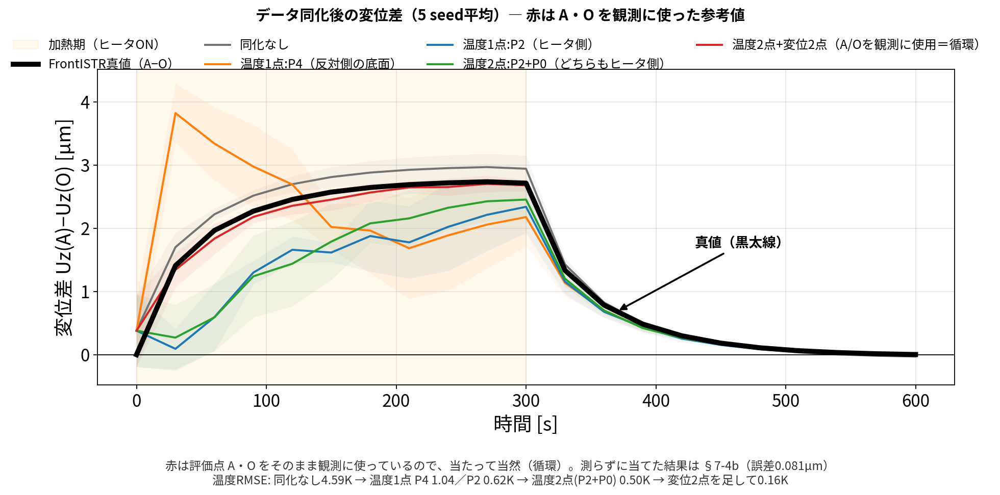

*黒太線はROM真値から同じ変位写像で計算した参照値。独立したOpenFOAM温度履歴を毎時刻FrontISTRで解析した真値ではありません。
これは変位を状態変数として直接積分した結果ではなく、
データ同化後温度をgappy-PODで全場へ戻し、その温度をFrontISTRの熱弾性写像へ通して得た推定値です。*

> **⚠️ この図の赤線は、成果として示せるものではありません。**
> 赤（温度2点＋変位2点）は、**評価している A・O の変位をそのまま観測に使っています**。
> これは観測点での適合を評価した結果です。未観測点への予測精度は、別のholdout評価で確認します。観測点でも真値との一致が自動的に保証されるわけではありません。
> **測らずに当てた結果は §7-4b**（中段の B・C だけを測り、上面 A・O の反りを誤差 **0.081 µm** で当てた）にあります。そちらが本来の成果です。
>
> この図から読み取れるのは、**温度観測だけ（緑・青・橙）では反りが当たらない**という点です。

**温度センサの置き方について**：この図では、温度2点（緑、P2＋P0）の反りの誤差は 0.93 µm で、1点（青 0.99 µm、橙 1.19 µm）とあまり変わりません。
ただし **P2 と P0 はどちらもヒータ側（A側）**にあり、2本とも同じ側に偏った配置です。
後の検証（[blog_005 §4-6](blog_005_optimal_sensor_placement.md)）で、**A側とO側に1本ずつ置く（P2＋P4）と反りの誤差は約半分**（0.53 µm → 0.24 µm、温度場も 0.33 K → 0.16 K）になることが分かりました。
温度センサの置き方は「数」だけでなく「どちら側に分けるか」で効きます。
（温度そのもののRMSEでは P2 0.62 vs P4 1.04 K と約1.7倍の差があり、場所の効きは評価量に依存します。）

**さらに大事な注意 ―「差」だけで評価してはいけない**。個別の $U_z(A)$ ・ $U_z(O)$ も見ると:


*「差」には罠があります。**データ同化なし（灰）は個別には10µm級で大外れなのに、差のRMSEは0.30µmと最小級**
（A・Oが同じ方向に外れて相殺されるため）。個別で見ると、**温度1点は「センサに近い側」しか合いません**
（P2ヒータ側→A良0.41／O悪1.33µm、P4底→O良0.65／A悪1.75µm）。
赤（0.16µm）は A・O を観測に使っているので、合って当然です。
→ 教訓：**評価は差だけでなく個別の変位でも行う。そして評価点を観測に使った結果は成果として数えない**。*

### 7-4b. 【重要】知りたい場所を測らずに当てる ― 未観測点で評価する

§7-4 のグラフは $U_z(A)-U_z(O)$ （上面の反り）を評価していますが、
「温度2点＋変位2点」の構成では **A と O をそのまま観測に使っています**。

> **観測した場所で精度を評価している**ため、未観測点への予測性能を示す試験ではありません。同化結果として有効な評価ですが、独立したholdout評価を追加します。

#### 実務ではむしろ逆になる

工作機械で本当に知りたいのは**工具先端側の変位**です。ところが

- **加工中の工具先端に変位計は置けません**
- 置けるのは機械の外側・静止部・冷えている部分

つまり実務は「**測れる場所で測って、測れない場所を推定する**」という構図です。
そこで、この構図をそのまま実験にします。

| | 点 | 座標 | 扱い |
|---|---|---|---|
| **評価点** | **A, O** | 上面 z=**100.5** mm | **本当に知りたい場所。工具先端側に相当** |
| **観測点** | 温度 P2, P0 | (36.5,6.9,50.8) / (21.3,−1.6,51.6) mm | 側面に貼った熱電対 |
| **観測点** | **B, C** | 中高さ z=**75.4** mm | **25 mm 下。ここなら変位計を置ける** |

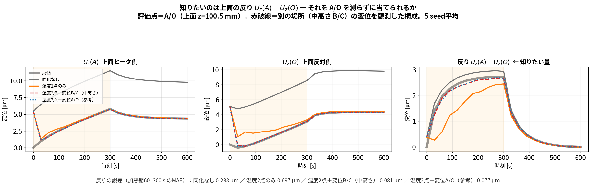

#### 結果（知りたい量＝上面の反り。真値の振幅 2.735 µm）

| 観測構成 | **反りの誤差** | $U_z(A)$ 誤差 | $U_z(O)$ 誤差 |
|---|---|---|---|
| データ同化なし | 0.238 µm ※ | 5.614 µm | 5.376 µm |
| 温度2点のみ | 0.697 µm | 0.160 µm | 0.848 µm |
| **温度2点＋変位B/C（中高さ）** | **0.081 µm** | **0.055 µm** | **0.027 µm** |
| 温度2点＋変位A/O（参考・循環あり） | 0.077 µm | 0.059 µm | 0.019 µm |

（加熱期 60–300 s の MAE、5 seed平均）

> **この続き（2026-10-03 追記）**：ここでは B/C を「人が決めて」測っています。
> その後、**全5,040節点×3成分の中から変位2点を計算で選び直す**試験を行いました（[blog_008 §5](blog_008_novelty_displacement_assimilation.md)）。
> 選定した2点（上面の (9.7, −36.2, 100.5) の $U_x$ と (−34.6, 14.4, 100.5) の $U_z$ ）だと、
> **反りの誤差は 0.076 µm**（振幅の 2.8 %）で、B/C（0.185 µm）より良い結果でした。
>
> **数値の出どころの違いに注意。** この表と blog_008 §5 の表は、評価の仕方が違うので直接は比べられません。
>
> | | この表（§7-4b） | [blog_008 §5](blog_008_novelty_displacement_assimilation.md) |
> |---|---|---|
> | 変位の写像 | A/O・B/C 用に個別に作った演算子 | 全5,040節点の演算子（`run/build_full_disp_operator.py`） |
> | 集計の窓 | 加熱期 60〜300 s の MAE | 加熱期 30〜300 s の平均 |
> | A/O を直接測った場合 | 0.077 µm | 0.135 µm |
>
> **同じ表の中で比べてください。** どちらの表でも結論は同じで、
> 「知りたい場所を測らなくても当たる」「置き場所で大きく変わる」です。

#### 3つの読み取り

**① 知りたい場所を測らなくても、ほぼ同じ精度で当たる**

中高さ B/C を測るだけで反りの誤差 **0.081 µm**（振幅の 3.0 %）。
知りたい場所そのものを測った場合（0.077 µm）と**ほぼ同じ**です。

> **「工具先端に変位計を置けなくても、置ける場所に置けばよい」**
> ― 実務で意味があるのはこの一点です。
> さらに、**置ける場所の中からどこを選ぶかも計算で決められます**（[blog_008 §5](blog_008_novelty_displacement_assimilation.md)）。

**② 温度だけでは反りは当たらない**

温度2点だけだと 0.697 µm（振幅の 25 %）。
個別の $U_z(A)$ は 0.160 µm まで合うのに、**反りは合いません**。
$U_z(A)$ と $U_z(O)$ の**差**を当てるには、変位観測が必要です。

**③ ※ データ同化なしの 0.238 µm に騙されないこと**

データ同化なしは個別に **5.6 µm も外れている**のに、A と O が同じ方向に外れるため
**差では相殺**されて小さく見えます。
$U_z(A)$ ・ $U_z(O)$ の個別グラフ（図の左・中）を見れば、
灰色の線が真値から大きく離れているのが分かります。

> **「差」だけで評価してはいけない**という §7-4 の注意が、ここでも効いています。

#### 循環していないと言える根拠

| 循環の条件 | 本実験 |
|---|---|
| 評価点（A/O）を観測に使ったか | **使っていない**（観測は温度P2・P0と変位B/C） |
| 真値をデータ同化に渡したか | 渡していない（ノイズ付きの4つだけ） |
| 評価点と観測点は離れているか | **25 mm 離れている**（z=100.5 と z=75.4） |

#### なぜ当たるのか

データ同化が直しているのは変位ではなく**温度場**だからです（§7-0）。

```
B/C の変位残差 → 共分散 Cov(T,u) → 温度5点とQを修正
                                    ↓
                      温度場が正しくなる
                                    ↓
              u = W(T − T_ref) で、どの点のどの方向も従う
                                    ↓
                        A/O の反りも正しくなる
```

**A/O を当てているのではなく、温度場を当てた結果として A/O が付いてくる**わけです。

#### なぜ「反り」を知る必要があるのか ― 工具長で補正量が変わる

「3軸機は軸をオフセットするだけなので、**傾きは補正できないのでは**」という疑問があります。
文献で確かめたところ、**半分正しく、半分違います**。

**正しい部分**：工具の**姿勢**（傾きそのもの）は3軸機では変えられません。

**違う部分**：傾き角は**工具先端では並進の位置ずれに化ける**ので、NCオフセットで補正できます。

$$\delta \;\simeq\; \theta \times L$$

（ $\theta$ ：傾き角、 $L$ ：工具長）

Yang らはまさにこれを指摘しています。

> "The present error compensation technology of computer numerical control machine tools
> **ignores radial thermal tilt angle errors of the spindle**, while the thermal-induced offset
> is **closely related to the tilt angle and the handle length**."
> — Yang, Mei, Zhao, Ma, Shi, Feng (2015), *Proc. IMechE Part B* [doi:10.1177/0954405414556499](https://doi.org/10.1177/0954405414556499)

彼らはヨー角・ピッチ角・伸びの3モデルを立て、**傾き角と工具長に基づいて補正**しています。

#### 本ケースで具体的に計算すると

A と O は 57.4 mm 離れているので、反り 2.735 µm は傾き角に直すと

$$\theta=\frac{2.735\times10^{-6}}{57.4\times10^{-3}}=4.77\times10^{-5}\ \mathrm{rad}=0.0027^\circ$$

これを工具長で工具先端の位置ずれに換算します。**工具先端の変位そのものは解析していません**。下の表は上面の反りから $\delta=\theta L$ で換算した値です。

| 工具長 $L$ | 工具先端の位置ずれ $\delta=\theta L$ | 本研究の推定誤差 |
|---|---|---|
| 50 mm | 2.38 µm | 0.070 µm |
| **100 mm** | **4.77 µm** | **0.140 µm** |
| 150 mm | 7.15 µm | 0.211 µm |
| **200 mm** | **9.53 µm** | **0.281 µm** |
| 300 mm | 14.30 µm | 0.421 µm |

> **同じ機械・同じ温度でも、工具を長くすると位置ずれが比例して大きくなります。**
> 100 mm の工具で 4.8 µm、200 mm なら 9.5 µm。
> **傾き角を知らなければ、この工具長依存を計算できません。**

**これが「反りを推定する価値」です。** 並進成分だけ測っていては、
工具を替えるたびに補正量が変わることに対応できません。

#### ただし機械によっては無視できる

旋盤（turning center）を扱った Zhao らは、最大傾き角が **0.0099°** と小さいため
「多くの場合、主軸軸線の動きを**並進運動とみなしてよい**」と結論しています。

> — Zhao, Guo, Tang, Zhang, Yi (2025), *Scientific Reports*
> [PMC12223237](https://pmc.ncbi.nlm.nih.gov/articles/PMC12223237/)（**全文無料**）

本ケースの 0.0027° はその 1/3.6 です。**傾きが効くかどうかは、機械構成と工具長で決まります**。
本研究の値は「工具が長いほど効いてくる」領域にあります。

#### 手続き（再現用）

1. **評価点**を決める：A, O（上面 z=100.5 mm）― データ同化に一切使わない
2. **観測点**を決める：温度 P2・P0 ＋ 変位 B・C（中高さ z=75.4 mm）
3. でたらめな初期温度・誤った $Q,h$ から60メンバー
4. 30秒ごとに前進 → 2. の4つだけ観測して状態を更新（20回）
5. データ同化後の温度場から**評価点 A/O** の変位を計算
6. A/O の真値と比べる

再現: `OMP_NUM_THREADS=4 python3 run/eval_AO_from_elsewhere.py`

### 7-4c. 温度センサを1本も使わず、変位計だけで温度場を直せるか

「変位を観測して、データ同化で温度を直す」― これが本研究の方式です。
では**温度センサを一切使わず、変位計だけ**でも成立するのでしょうか。

実機では内部に熱電対を入れられないことがあります。変位計だけで足りるなら
センサ構成の選択肢が広がるので、確かめました。

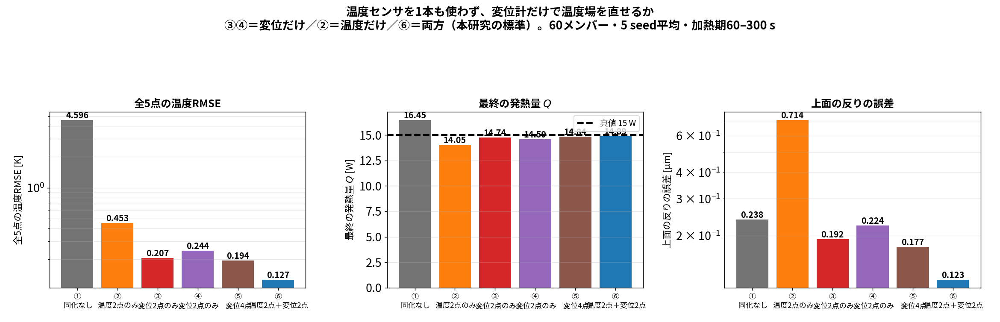

| 観測構成 | 温度センサ | 変位計 | **全5点の温度RMSE** | 最終 $Q$ | 反りの誤差 |
|---|---|---|---|---|---|
| ① データ同化なし | 0 | 0 | 4.596 K | 16.45 W | 0.238 µm ※ |
| ② 温度2点のみ | 2 | 0 | 0.453 K | 14.05 W | 0.714 µm |
| **③ 変位2点のみ（上面A/O）** | **0** | 2 | **0.207 K** | 14.74 W | 0.192 µm |
| **④ 変位2点のみ（中高さB/C）** | **0** | 2 | **0.244 K** | 14.59 W | 0.224 µm |
| ⑤ 変位4点（A/O＋B/C） | 0 | 4 | 0.194 K | 14.84 W | 0.177 µm |
| **⑥ 温度2点＋変位2点** | 2 | 2 | **0.127 K** | **14.89 W** | **0.123 µm** |

（60メンバー・5 seed平均・**加熱期 60–300 s**。真値 $Q=15.00$ W）

> ⚠️ **この表だけ集計窓が 60–300 s** です（初回サイクルのスピンアップを除外）。
> 本記事の他の表は **0–300 s**（§7-6 の定義）なので、同じ構成でも数値が少し違います。
> 温度2点＋変位2点は 0–300 s だと **0.160 K**、60–300 s だと **0.127 K** です。

#### 結論：変位計だけで温度場は直せる。しかも温度計だけより良い

**③ 変位2点だけ（温度センサ0本）で温度RMSE 0.207 K。**
**② 温度2点だけ（0.453 K）の 2.2倍良い**結果になりました。

> **温度を測らずに温度を当てている**わけですが、不思議なことではありません。
> §7-0 のとおり、変位計は「**5点温度の重み付き和**」を測っています。
> 重みは $D$ の行そのもので、A の $U_z$ なら
> $(-0.0077,\,-0.0088,\,-0.0063,\,-0.0065,\,+0.0008)$ 。
> **1本で5点すべてに触れている**ので、温度計1本より情報が広いのです。

#### なぜ変位のほうが強いのか

| | 温度計 | **変位計** |
|---|---|---|
| 測るもの | **1点の温度** | **全5点の重み付き和** |
| 触れる範囲 | 1点 | **5点すべて** |
| 情報の種類 | 局所 | 大域 |

温度計2本では「P2 と P0 の値」しか分かりませんが、
変位計2本は「**5点の重み付き和が2通り**」分かります。
未知が7個（ $T_1..T_5, Q, h$ ）なので、**広く触れるほうが絞り込みが速い**わけです。

#### ただし組み合わせが最良

**⑥ 温度2点＋変位2点が 0.127 K で最良**です。③の 0.207 K より 1.6倍良い。
**局所（温度）と大域（変位）は補完関係**にあり、どちらか一方を増やすより
組み合わせたほうが効きます。

#### 実務的な読み取り

1. **内部に熱電対を入れられない機械でも、変位計だけで温度場を推定できる**
2. **変位計は置ける場所でよい**（③上面 0.207 K と ④中高さ 0.244 K でほぼ差がない）
3. ただし**温度計を足せるなら足したほうがよい**（0.207 → 0.127 K）

#### ※ ①の「反りの誤差 0.238 µm」に注意

データ同化なしは個別には 5.6 µm も外れているのに、A と O が同じ方向に外れるため
**差では相殺**されて小さく見えているだけです（§7-4b）。

再現: `OMP_NUM_THREADS=4 python3 run/disp_only_da_check.py`

### 7-5. $x$ ・ $y$ ・ $z$ の全成分を見る ― 観測していない方向・評価点はどうなるか

ここまでの図はすべて **$z$ 成分（上下・軸方向）だけ**でした。
FrontISTR は当然 $U_x,U_y,U_z$ の3成分を返しているので、**観測していない $x,y$ 方向**と
**評価点（未観測点）**がどうなるかを確かめます。

観測に使うのは今までどおり **「温度2点 ＋ 上面A/O の $U_z$ だけ」**。
$x,y$ は一切観測しませんし、下の B・C 点は一度もデータ同化に使いません。

| 点 | 座標 | 役割 |
|---|---|---|
| A | (+28.7, 0, 100.5) mm | 上面ヒータ側。**$U_z$ のみ観測に使用** |
| O | (−28.7, 0, 100.5) mm | 上面反対側。**$U_z$ のみ観測に使用** |
| **B** | **(+28.7, 0, 75.4) mm** | **評価点。データ同化に一切使わない** |
| **C** | **(−28.7, 0, 75.4) mm** | **評価点。データ同化に一切使わない** |

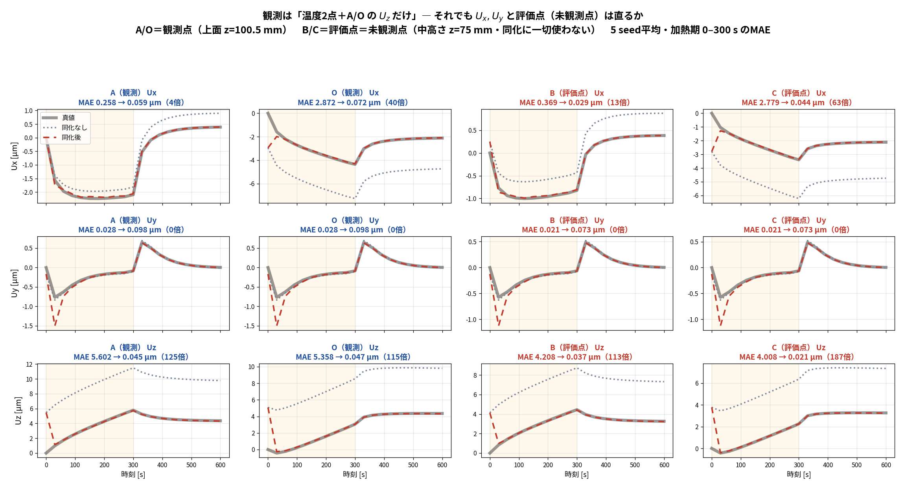

*行が成分（上から $U_x,U_y,U_z$ ）、列が点（A・O＝観測、B・C＝未観測）。
灰点線＝データ同化なし、赤破線＝データ同化後、太い灰実線＝真値。*

5 seed平均、**初回サイクル（ $t=30$ s）のスピンアップを除いた 60–300 s の MAE**:

| 点 | 区分 | 成分 | 真値振幅 [µm] | データ同化なし [µm] | **データ同化後 [µm]** | 改善 |
|---|---|---|---|---|---|---|
| A | 観測 | $U_x$ | 2.24 | 0.266 | **0.046** | 5.7倍 |
| A | 観測 | $U_y$ | 0.77 | 0.023 | 0.027 | ほぼ変化なし |
| A | 観測 | $U_z$ | 5.78 | 5.614 | **0.031** | **179倍** |
| O | 観測 | $U_x$ | 4.36 | 2.873 | **0.036** | **80倍** |
| O | 観測 | $U_z$ | 4.36 | 5.376 | **0.032** | **166倍** |
| **B** | **評価点** | $U_x$ | 1.00 | 0.374 | **0.022** | **17倍** |
| **B** | **評価点** | $U_z$ | 4.45 | 4.217 | **0.024** | **172倍** |
| **C** | **評価点** | $U_x$ | 3.40 | 2.782 | **0.022** | **126倍** |
| **C** | **評価点** | $U_z$ | 3.27 | 4.022 | **0.021** | **195倍** |

#### 分かったこと

**① $U_x$ は観測していないのに直る。**
O点で 2.87 → 0.036 µm（80倍）、未観測のC点でも 2.78 → 0.022 µm（126倍）。

理屈は §7-2 の熱弾性から明らかです。変位は温度場から $u=W(T-T_\mathrm{ref})$ で決まり、
$W=K_s^{-1}H_T$ は**3成分すべてを含む行列**です。
つまり**データ同化が直しているのは変位ではなく温度場**であって、
温度場が正しくなれば $W$ を通じて **$x$ も $y$ も $z$ も自動的に従います**。
「 $U_z$ を観測して $U_x$ が直る」のは不思議なことではなく、当然の帰結です。

**② 評価点（未観測点）は観測点と同じ率で直る。**
$U_z$ で観測点179倍・評価点172倍、 $U_x$ で観測点80倍・評価点126倍。
**「測ったところだけ合っている」のではありません。**
これは §5-4（未観測セルの温度復元）と同じ主張を、変位の側から確かめたことになります。

**③ $U_y$ だけは変わらない（0.023 → 0.027 µm）。**
これは失敗ではなく、**データ同化なしの時点ですでに振幅0.77 µmに対し誤差0.023 µm（3%）** で、
直す余地がなかったためです。
A・O・B・C はすべて $y=0$ の**対称面上**にあり、非対称加熱が生む周方向変位が
ほぼ打ち消し合うためと考えられます（**この解釈は未検証です**。
$y\neq0$ の点で確かめる必要があります）。

> **正直な注記**： $t=30$ s の初回サイクルだけを含めて平均すると、 $U_y$ は
> 0.028 → 0.098 µm と「悪化」して見えます。これは**1回目の更新での行き過ぎ**が
> 平均を押し上げているだけで、2サイクル目以降は真値に乗っています。
> 上の表が 60–300 s なのはこのためです。

再現: `OMP_NUM_THREADS=4 OPENBLAS_NUM_THREADS=4 python3 run/eval_xyz_disp_da.py`
（FrontISTR を6回呼んで3成分の変位演算子を作り、結果を `results/xyz_disp_da.json` に保存）


**仕上げに、まったく別の未観測点でも確認**します。観測点（赤/橙）から離れた
**未観測の温度3点（緑）と変位3点（紫）**の位置はこちら:

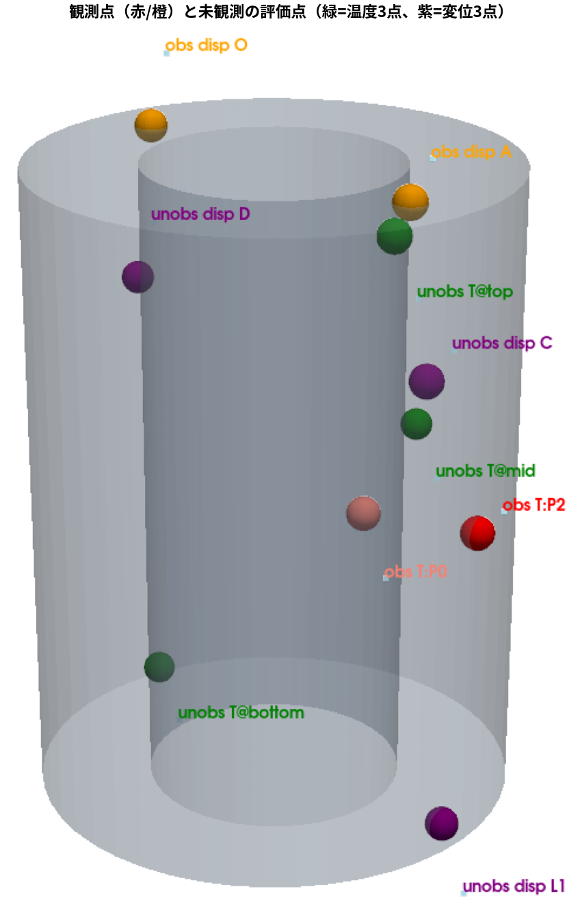

この6か所すべてで、真値と各構成を時系列比較すると:


*データ同化なし（灰）は6点すべてで大外れ。データ同化した構成は**観測していない場所でも**真値に沿い、
温度＋変位（赤）が最も近い（特に底面側の温度と z=75mm 反対側の変位の立ち上がり）。
**少数の観測が、観測していない場所まで直す**――これがデータ同化＋POD復元の価値です。*

> **凡例の「高感度／低感度」の意味**：ここでの感度は **発熱量への温度感度 $\partial T/\partial Q$** です
> （ $q_\mathrm{scale}$ を1.0→1.1に振った有限差分、加熱ピーク $t=300$ s で評価）。
> 高感度＝ $\partial T/\partial Q$ 最大のP2（ヒータ側）、低感度＝最小のP4（反対側）、
> 温度2点(高感度)＝上位2ノード（P2とP0）。上の観測点図（sensor_positions）の色付けと同じ量です。
> なお **熱感度 $W=K_s^{-1}H_T$ （温度→変位）とは別物**です。
> 温度センサを発熱感度で選ぶ方法は現在は使っていません（温度センサの選び方は blog_005 §4-6）。

> 実務では、この温度→変位を毎回FrontISTRで解く代わりに、**線形化した感度 $W=K_s^{-1}H_T$**（blog_002 §4）で
> 温度から直接変位を出せます。 $W$ は多数の温度入力に対する線形応答です。剛性行列の分解を再利用できますが、単一の熱荷重を1回解くだけで全Wが得られるわけではありません。POD版では必要なモード応答だけを事前に計算します。

---

## 7-6. 観測構成を変えて比べる ― 本研究の有用性

ここまでの部品（POD＋Q-DEIM＋ROM＋EnKF）を組み合わせ、**観測の構成だけを変えて**比べます。

### 先に読む：106のどの計算を説明しているか

106では複数の観測構成を試しています。この節の主試験は **P2/P0＋変位A/O**（`run/run_da_compare.py`）です。
これとは別に、**P2/P0＋高W変位S1/S2を観測して、観測しないC/Dを評価した試験**があります。
観測点・変位写像・ノイズの乱数系列が異なるため、Qの値や変位誤差を混ぜて読まないでください。

後者の実際の手順を、[「今回行った計算を順番に追う」](20_actual_enkf_displacement_and_heat_identification.md) にまとめました。読む順番は次のとおりです。

1. **60組の仮説を用意する。** 各組は温度P0〜P4、発熱倍率q、放熱hの7個を持つ。Qは $15q$ W。
2. **次の30秒まで予測する。** 各組のq・hでRK4を進め、その組の予報温度を得る。
3. **温度から変位を予測する。** 5点温度→POD係数→事前計算したFrontISTR応答Dの順に計算する。
4. **測定値との差を作る。** 予報は $[T_2,T_0,u_{S1},u_{S2}]$ の4成分。C/Dは観測に入れない。
5. **60組の共分散を作る。** 同じ時刻の平均と偏差から、7×4の $C_{zy}$ と4×4の $C_{yy}$ を59で割って計算する。
6. **温度・q・hを補正する。** カルマンゲインで4成分の残差を7未知数へ配り、次の予測に使う。

例えば温度P0と発熱倍率qの補正は、コードの添字で書くと

$$T_0^a=T_0^f+K_{0,0}d_{T2}+K_{0,1}d_{T0}+K_{0,2}d_{S1}+K_{0,3}d_{S2},$$

$$q^a=q^f+K_{5,0}d_{T2}+K_{5,1}d_{T0}+K_{5,2}d_{S1}+K_{5,3}d_{S2}.$$

ここでfは偏差膨張後の予報、aはデータ同化後、dは「観測＋メンバー別の観測摂動−予報観測」です。
**各式の最後の2項が、変位観測から温度や発熱倍率へ入る補正**です。補正したqを15倍するとQ [W]になります。

S1/S2試験の最初の更新（seed=20260913、30秒）を実数で再計算すると、変位S1/S2の残差による平均Qへの寄与は **+19.642 W、−15.039 W** でした。温度からの寄与と足し合わせ、制約を適用するとQ平均は **17.090→10.432 W** となります。以後の更新で修正され、このseedの600秒では **14.890 W** です。初回から真値に一致するわけではありません。

数値の内訳、観測ノイズと観測摂動の違い、実コード、保存ファイル、5seed結果は [手順の詳細](20_actual_enkf_displacement_and_heat_identification.md) に記載しています。

### 本研究で実際に行った手続き（`run/run_da_compare.py`）

ここに書くのは説明用の簡略例ではなく、表の数値を出した計算そのものの設定である。

**真値（双子実験）**　校正済みの5点ROMを、発熱量 $Q=15$ W（ヒータ点 P2）、放熱 $h=0.01535$ W/K、
0–300 s 加熱・300–600 s 冷却で時間積分したものを真値とする。

**状態ベクトル**（7次元）

$$z=(T_1,\dots,T_5,\ q,\ h),\qquad Q=15\,q\ [\mathrm W]$$

$q$ は発熱の倍率（真値 $q=1$ ）。変位は状態に入れない。

**観測**（30 s ごと、計20回）　温度2点（P2, P0。この計算では発熱感度 $\partial T/\partial Q$ の上位2点として選んだ。どちらも A 側）と、
上面 A・O の $U_z$ の計4個。真値にノイズを足して作る。

$$y=\bigl(T_{P2},\ T_{P0},\ U_z(A),\ U_z(O)\bigr)^{\mathrm{true}}+\varepsilon,\qquad
\varepsilon\sim N(0,R),\quad R=\mathrm{diag}(0.3^2,0.3^2,0.3^2,0.3^2)$$

（温度は K、変位は µm）

**初期アンサンブル**（60メンバー）　真値を知らない状態から始めるため、広くばらつかせる。

| 成分 | 初期分布 |
|---|---|
| $T_1..T_5$ | 一様分布 $[T_\mathrm{air}-3,\ T_\mathrm{air}+12]$ K |
| $q$ | 一様分布 $[0.3,\ 1.8]$ （ $Q=4.5$ 〜 $27$ W） |
| $h$ | 正規分布 $N(0.02,\ 0.01^2)$ 、 $[10^{-3},0.1]$ に制限 |

**各サイクルの手続き**（ $t_k=30k$ s、 $k=1,\dots,20$ ）

1. **予報**　各メンバーを、そのメンバー自身の $q,h$ を使ってROMで30 s 前進させる（RK4、刻み2 s）。
   $q,h$ は前進中は変えない。
2. **予報観測** $Y_f$ （ $60\times4$ ）　各メンバーについて、温度2点はそのまま取り出し、
   変位2点は温度から計算する（§7-0）。
   $$u^{(m)}=u_\mathrm{mean}+D\,U_{r,P}^{+}\bigl(T_5^{(m)}-\bar T_P\bigr)$$
3. **共分散膨張**　メンバーの平均からのずれを1.02倍に広げる（標本数不足で分散が縮みすぎるのを防ぐ）。
4. **ゲイン**　60メンバーの偏差 $dZ$ （ $60\times7$ ）、 $dY$ （ $60\times4$ ）から
   $$C_{zy}=\frac{dZ^{\mathsf T}dY}{59}\ (7\times4),\quad
     C_{yy}=\frac{dY^{\mathsf T}dY}{59}\ (4\times4),\quad
     K=C_{zy}\,(C_{yy}+R)^{-1}\ (7\times4)$$
5. **更新**　メンバーごとに観測ノイズ $\varepsilon^{(m)}\sim N(0,R)$ を足して更新する（摂動観測法）。
   $$z^{(m)}\leftarrow z^{(m)}+K\bigl(y+\varepsilon^{(m)}-Y_f^{(m)}\bigr)$$
6. **制約**　 $q\in[0,3]$ 、 $h\in[10^{-4},0.2]$ に収める。

これを5つの乱数シード（20260913〜20260917）で繰り返し、平均を取る。

**発熱量 $Q$ が同定される仕組み**　手順5で更新されるのは $z$ の7成分すべてであり、
$q$ はその6番目の成分である。 $q$ の更新量は $K$ の6行目
$$K_{q,:}=\mathrm{Cov}(q,\ Y_f)\,(C_{yy}+R)^{-1}$$
で決まる。手順1で $q$ の大きいメンバーほど温度が上がり、手順2でその温度から計算される変位も大きくなるため、
$\mathrm{Cov}(q,T)$ と $\mathrm{Cov}(q,u)$ は0にならない。したがって $q$ を直接観測していなくても、
温度と変位の残差 $y-Y_f$ が $q$ を動かす。

**結果**　20回の更新後、 $Q=14.89$ W（真値 15 W）。加熱期の全5点温度RMSEは 0.160 K、
上面の変位差の誤差は 0.165 µm（下の表の最終行）。
なお真値も同じROMで作っているため、モデル誤差のない条件での結果である。

### この表の「RMSE」は何を計算した値か

数字を出す前に定義をはっきりさせます。同じ観測構成で乱数条件を5回変えて計算します。
$s=1,\ldots,5$ が計算番号（seed）、 $i=0,\ldots,4$ がROMの温度点、
$m=1,\ldots,60$ がEnKFメンバーです。**5 seed は再試行の数であり、60メンバーとは別物**です。

まず各時刻のデータ同化後アンサンブルから、点ごとの推定温度を出します:

$$\hat T_{s,i}(t_k)=\frac{1}{60}\sum_{m=1}^{60}T^a_{s,m,i}(t_k)$$

（データ同化なしの場合は、同じ初期アンサンブルを更新せずに時間発展させた平均を使います）

次に、観測点だけでなく**全5点（未観測点を含む）**で真値との差を取ります:

$$e_{s,i,k}=\hat T_{s,i}(t_k)-T_i^{\mathrm{true}}(t_k),\qquad
r_{s,k}=\sqrt{\frac{1}{5}\sum_{i=0}^{4}e_{s,i,k}^2}$$

表の「加熱期の平均RMSE」は、この空間RMSEを**時刻とseedで平均**した値です:

$$\overline{\mathrm{RMSE}}_T=
\frac{1}{5}\sum_{s=1}^{5}\left[\frac{1}{10}\sum_{k=1}^{10}r_{s,k}\right]\ [\mathrm K],
\qquad t_k=30k\ \mathrm{s}$$

集計は **30, 60, …, 300秒の10回のデータ同化後**です。0秒は初期誤差が全構成で共通なので除外しています。

> **これは何ではないか**
> 全20,696セルの温度RMSEでもなく、メンバーの標準偏差でもなく、最終300秒だけの誤差でもありません。
> また「全時刻・全点の二乗誤差をまとめてから平方根を取る」定義とも違います。

**小さな数値例**：ある時刻の5点の誤差が $[1,-2,0,2,-1]$ K なら
$r=\sqrt{(1+4+0+4+1)/5}=\sqrt2=1.414$ K。
これを10時刻それぞれで計算して平均し、さらに5 seed を平均します。

実装は `run/run_da_compare.py` の `run_cfg_seed()` 内の
`np.sqrt(((Z[:,:NPT].mean(0)-Ttr[ci])**2).mean())`、
時間平均は `heat=(tgrid>0)&(tgrid<=300)` と `results[n][0][heat].mean()` です。
時間とseedはどちらも算術平均なので、平均の順序は交換できます。

### 結果

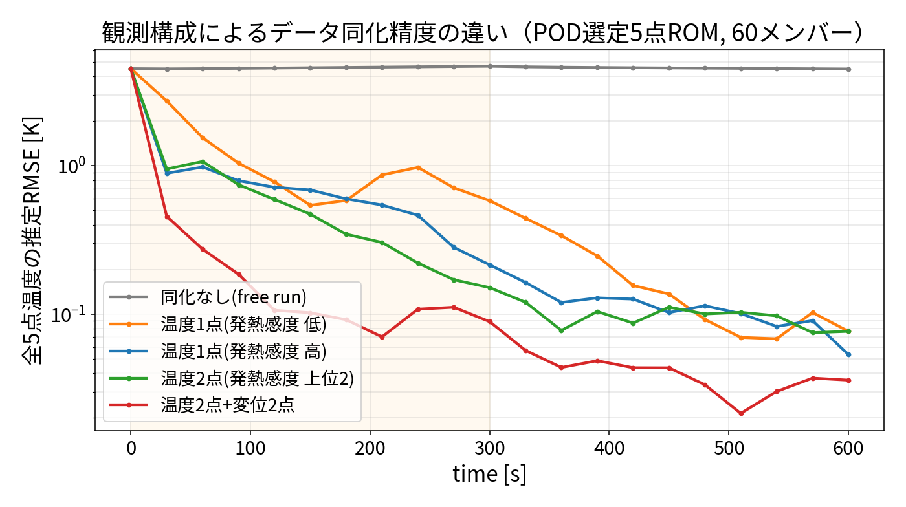

*ROM双子実験／60メンバー／30秒ごと20回更新（0〜600秒）／真値も同じROM／seed 20260913〜20260917 の5回。*

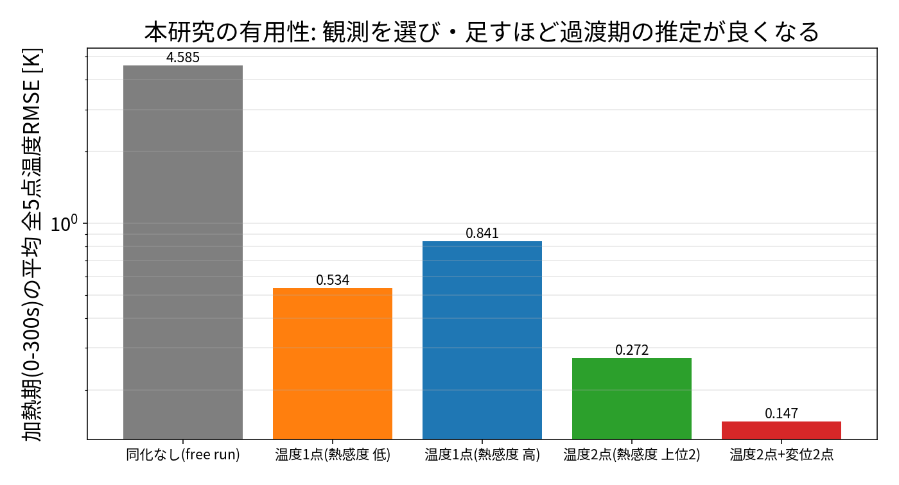

| 観測構成 | 加熱期の平均RMSE | 何が言えるか |
|---|---|---|
| **データ同化なし（free run）** | 4.585 K | でたらめのまま。**データ同化なしでは推定できない** |
| 温度1点（P4・反対側の底面） | 1.036 K | データ同化すれば桁違いに改善 |
| 温度1点（P2・ヒータ側） | **0.617 K** | 置く場所で結果が変わる |
| 温度2点（P2+P0・どちらも A 側） | 0.503 K | センサを足すと改善 |
| **温度2点＋変位2点** | **0.160 K** | **変位を足すと決定的**（温度だけの3倍良い） |

> **温度2点の P2＋P0 は、2本とも A 側にあります。** 温度だけでデータ同化する別の比較（blog_005 §4-6、ROM 真値・5 seed）では、
> A 側と O 側に1本ずつ置いた P2＋P4 のほうが温度場の誤差が小さく（0.15〜0.16 K 対 0.33〜0.53 K。P2＋P0 は乱数の割り当てで大きく変わる）、5 seed すべてで良い結果でした。
> この表の本番計算を P2＋P4 で回し直す試験は**していません**。

## 8. まだ分かっていないこと ― 代表点選択の未解決問題

ここまで「PODでモード→Q-DEIMで代表点→ROM校正」ときれいに流れましたが、
**代表点の選び方には、実はまだ分かっていないことが残っています**。正直に書いておきます。

1. **何点必要か（ $r$ の決め方）が「データ同化」目線では未解明**。
   本記事はエネルギー基準（2モードで99.9％→5点）で決めましたが、これは**場の復元**の基準です。
   「**データ同化の性能**にとって最適な点数」は別問題で、センサ数を1〜5点と変えたときの
   精度カーブの系統検証はこれからです。

2. **Q-DEIM点は「復元に良い点」であって「推定に最適な点」の保証はない**。
   Q-DEIMはモード行列の転置に列枢軸QRを適用する選択法で、復元の条件を良くする狙いがあります。ノイズや推定対象を含む同化誤差の大域最適解を保証する方法ではありません。さらに、
   推定したい量が変わると最適配置も変わります。実際、本リポジトリの実験では
   **温度場推定なら「散らした」配置がQ-DEIM点と同程度**、**Q・h推定では温度センサの場所はほぼ効かない**
   （感度が空間的にほぼ一様）という結果でした。**「Q-DEIMで選んだ＝観測もそこが最良」ではない**のです。

3. **訓練条件への依存が未検証**。
   代表点は訓練スナップショット（片側15W加熱・0-600秒）から選ばれています。
   **加熱位置や条件が変わったときに同じ5点で良いか**は確かめていません（ROMの外挿問題と同根）。

4. **選ばれた点の物理的解釈は後付け**。
   「底面P3/P4が選ばれたのは場を広くカバーするため」という説明は、出てきた結果を見ての解釈です。
   また校正された $C_i, K_{ij}$ も「その5点で温度履歴に最良フィット」という意味しかなく、
   **一意性（別のパラメータ組でも同じ温度になる可能性）や物理的同定性は保証されていません**
   （ $\sum C_i$ が実物の熱容量とほぼ一致した、という傍証があるだけです）。

5. **実機の設置制約を考えていない**。
   実機ではセンサを置けない場所（内部・回転部など）があります。
   **設置可能な領域に制限した上での選点**（制約付きQ-DEIM）は未実装です。

まとめると、**「代表点＝ROMの状態を進める点」としては実証済み（残差0.014K）ですが、
「観測点としての最適性」「点数」「条件変化への頑健性」は開いた問題**です。
これらはそのまま、学会発表（計算力学：推定対象依存の観測配置）の研究課題になっています。

---

## 9. まとめ ― この記事でやったこと

1. **EnKFは実ソルバだと重い** → 予報モデルを軽い ROM に置き換える（単一ROMの前進積分が約31ms）。
2. **代表点は勘でなく POD＋Q-DEIM でデータから選ぶ**。
   - POD：スナップショット行列を SVD して場の「型」とエネルギーを抽出（ $XX^{\mathsf T}\varphi=\lambda\varphi$ ）。
   - Q-DEIM：モード行列に列枢軸QRをかけ、場を最もよく復元できる点を選定。
3. **小さな行列の手計算**で、ランク1なら1点測るだけで場が完全復元できることを確認した（ $\hat u=\bar u+U_r a$ ）。
4. 実データでは **2モードで99.9％**、選んだ5点ROMは **残差0.014K** で OpenFOAM を再現。
5. 温度が求まったら **IDWで実形状へマッピング → 熱ひずみ $\alpha\Delta T$ → $K_s u=f_\mathrm{th}$** で変位（反り）が出る（§7）。

この軽い ROM の上で、**OI（blog_002）と EnKF（blog_003）** を回すと、温度場・発熱量 $Q$ ・放熱係数 $h$ を
少数観測から高速に推定でき、さらに **温度→変位** まで通して「反り」を評価できます。
**「軽い予報モデル」と「賢い観測点」**の2本柱がそろいました。

**ただし忘れてはいけない点**：ROMはOpenFOAMを **本番ループ**でだけ置き換えるもの（§1-1）。
モードも点も係数も **CFDの結果から作った"蒸留物"** で、CFDは **オフラインで1回**必ず要ります。
そして **訓練が覆った範囲でしか正しくない**（形状・条件が大きく変われば作り直し）。
「高価なCFDを一度払って、安価なリアルタイムを得る」という前払い構造だ、と理解しておくのが大切です。

---

### 参考（元になった実装・詳細）

- POD／Q-DEIM の数式と手続き：本記事 §2〜§4（旧 `01_pod_qdeim_algorithm.md` を統合）
- 代表点選定：`run/select_points_qdeim.py`
- ROM構築・校正：`run/build_calibrate_rom.py`, `dacore/rom_general.py`
- この上でのデータ同化：`blog_002_oi_data_assimilation.md`, `blog_003_ensemble_kalman_filter.md`


研究として何を主張できるか、先行研究の確認範囲と優先する追加検証は [研究の優位性と検証計画](19_research_advantage_and_validation.md) を参照してください。ROM双子実験の精度と独立したOpenFOAM＋FrontISTR真値・実測での精度を区別しています。
