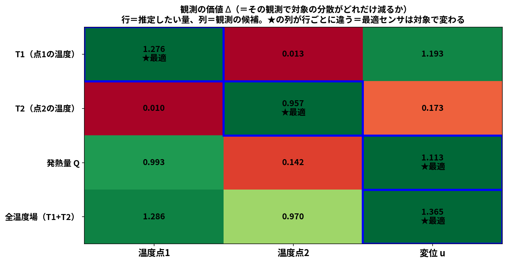
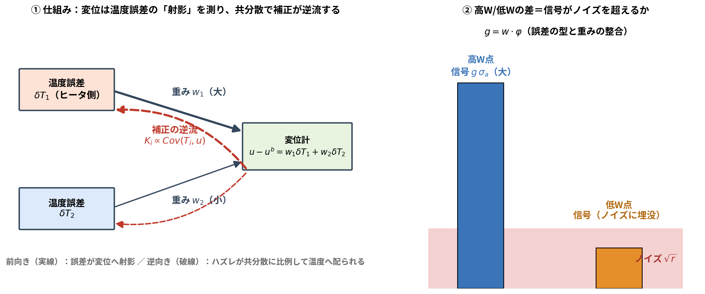
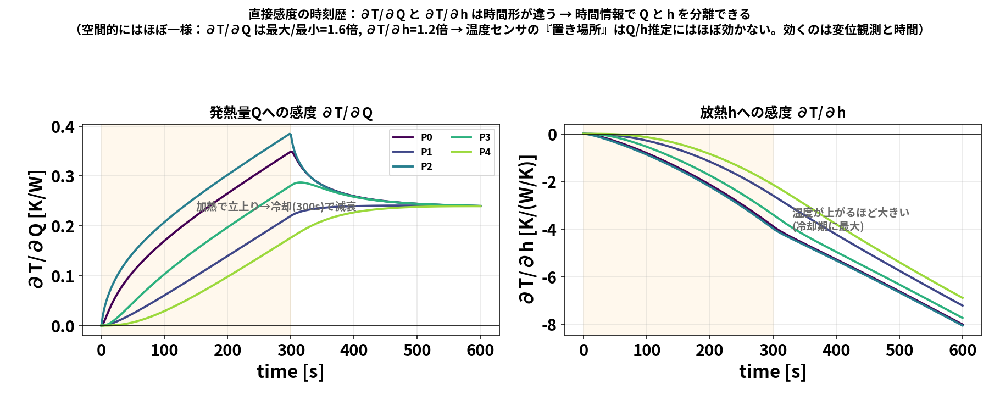
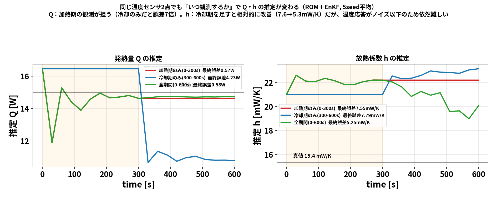
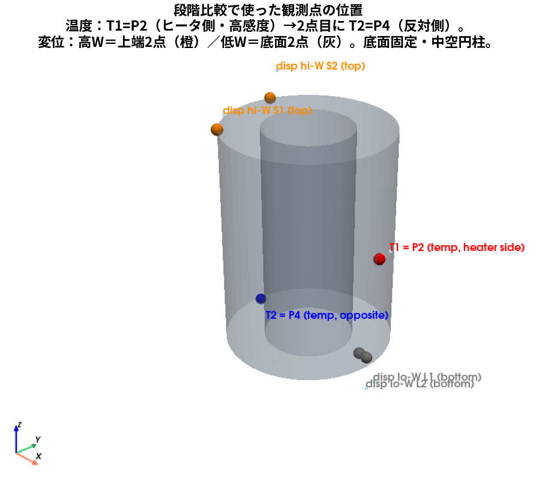
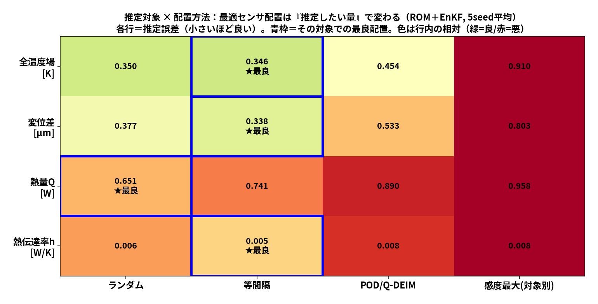
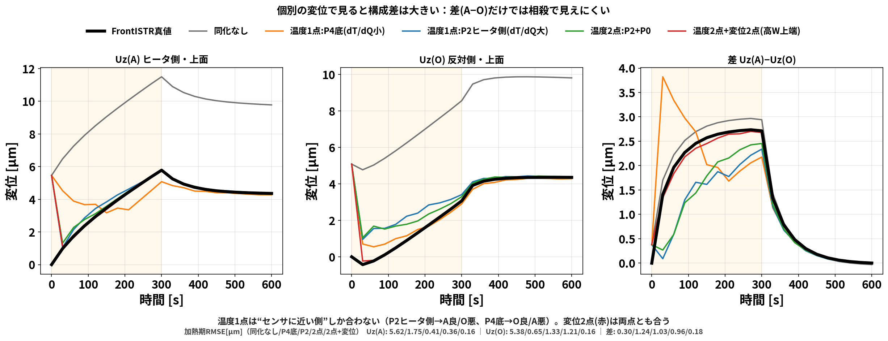
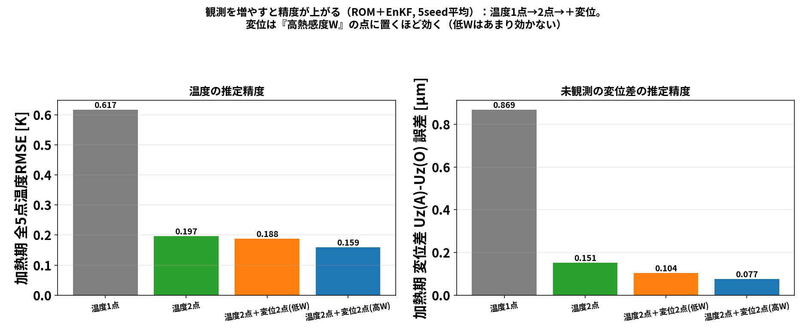
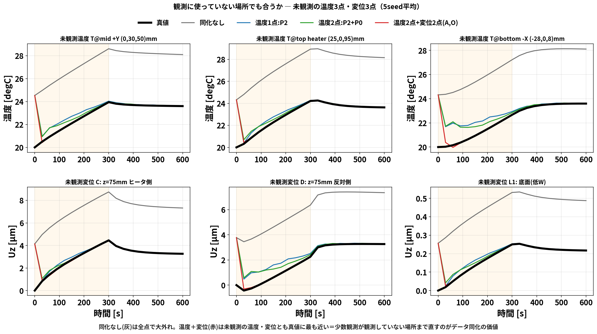
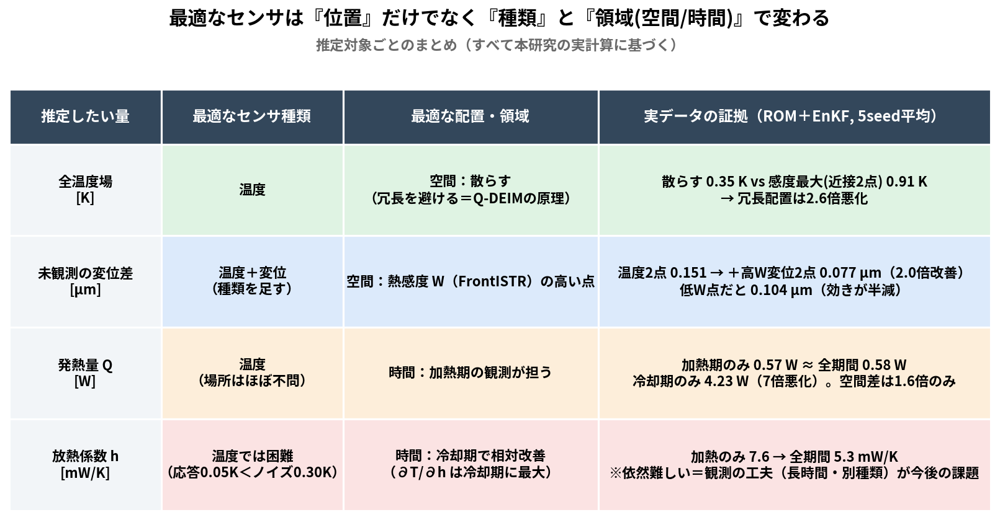

# blog_005：推定したい量で「最適なセンサ」は変わる ― 観測の価値を1本の式で設計する

センサ配置の素朴な疑問から始めます。

> **温度センサや変位センサは、どこに置くのが一番いいのか？**

答えを先に言うと、**「何を推定したいか」で最適な置き場所（さらに種類・時間帯）が変わります**。
温度場を知りたいときの最適配置と、発熱量 $Q$ を当てたいときの最適配置は、同じではありません。
この記事では、それを **1本の式 → 小さな行列の手計算 → 実データ** の順で示します。

> **この記事の流れ**
> 1. 観測の価値を測る式 $\Delta$ を導く（理論）
> 2. 3変数モデルの行列手計算で「対象ごとに最適観測が変わる」を見る（★が動く表）
> 3. 第3の軸「時間」：いつ観測するかも対象で変わる
> 4. 実データ（ROM＋EnKF/OI）で検証
>
> 関連記事：OIの仕組みは [blog_002](blog_002_oi_data_assimilation.md)、ROM/PODは [blog_004](blog_004_pod_selected_rom.md)。

---

## 1. 観測の価値を測る「1本の式」

データ同化の更新式（blog_002）から出発します。観測 $y$ を1つ入れると、状態の共分散は

$$B^a=B-\frac{(Bh)(Bh)^{\mathsf T}}{h^{\mathsf T}Bh+r}$$

と縮みます（ $h$ ＝観測演算子の行、 $r$ ＝観測ノイズ分散）。いま知りたい量（推定対象）を
$X=c^{\mathsf T}x$ と書くと（ $c$ は対象を取り出すベクトル）、**$X$ の分散がどれだけ減るか**は

$$\boxed{\ \Delta(X,\ y)=\frac{\mathrm{Cov}(X,\ y)^2}{\mathrm{Var}(y)+r}
=\frac{\bigl(c^{\mathsf T}Bh\bigr)^2}{h^{\mathsf T}Bh+r}\ }$$

これが**観測の価値**です。読み方は簡単で、

- 分子 $\mathrm{Cov}(X,y)^2$ ：**その観測が、知りたい量とどれだけ連動しているか**
- 分母 $\mathrm{Var}(y)+r$ ：その観測自身のばらつき＋ノイズ

つまり「**知りたい量とよく連動し、ノイズの小さい観測ほど価値が高い**」。
ここで大事なのは、分子に **対象 $c$ と観測 $h$ の両方**が入っていること。
**観測の価値は対象に依存する**＝「万能の最適センサ位置」は存在しない、が式の形から既に見えています。

---

## 2. 小さな行列で手計算 ―「★」が対象ごとに動く

### 2-1. 舞台（blog_002 §3-5と同じ3変数）

状態 $x=(T_1,\ T_2,\ Q)$ 。温度は $Q$ で決まり（感度 $s=(0.3,\ 0.1)$ ）、変位は温度で決まる
（感度 $w=(0.5,\ 0.2)$ ）。背景共分散は $\sigma_T=1,\ \sigma_Q=2$ として

$$B=\begin{pmatrix}
1.36 & 0.12 & 1.2\\
0.12 & 1.04 & 0.4\\
1.2 & 0.4 & 4
\end{pmatrix},\qquad
B=\mathrm{diag}(\sigma_T^2,\ \sigma_T^2,\ 0)+\sigma_Q^2\,a\,a^{\mathsf T},\quad a=(s_1,\ s_2,\ 1)^{\mathsf T}.$$

（成分の出どころ：対角 $\sigma_T^2+\sigma_Q^2 s_i^2$ 、温度と $Q$ の相関 $\sigma_Q^2 s_i$ 。導出は blog_002 §3-5）

**観測の候補は3つ**（それぞれ $h$ と $r$ ）:

| 候補 | $h$ | ノイズ $r$ |
|---|---|---|
| 温度点1 | $(1,\ 0,\ 0)$ | $0.3^2=0.09$ |
| 温度点2 | $(0,\ 1,\ 0)$ | $0.09$ |
| 変位 $u$ | $(w_1,\ w_2,\ 0)=(0.5,\ 0.2,\ 0)$ | $0.1^2=0.01$ |

### 2-2. 部品をそろえる（行列×ベクトルを成分で）

まず各候補の $Bh$ （＝「その観測と各変数の共分散」の列）と $\mathrm{Var}(y)+r$ :

$$B\begin{pmatrix}1\\0\\0\end{pmatrix}=\begin{pmatrix}1.36\\ 0.12\\ 1.2\end{pmatrix},\qquad
B\begin{pmatrix}0\\1\\0\end{pmatrix}=\begin{pmatrix}0.12\\ 1.04\\ 0.4\end{pmatrix},\qquad
B\begin{pmatrix}0.5\\0.2\\0\end{pmatrix}
=\begin{pmatrix}0.5\cdot1.36+0.2\cdot0.12\\ 0.5\cdot0.12+0.2\cdot1.04\\ 0.5\cdot1.2+0.2\cdot0.4\end{pmatrix}
=\begin{pmatrix}0.704\\ 0.268\\ 0.68\end{pmatrix}$$

$$\mathrm{Var}(y_1)+r=1.36+0.09=1.45,\qquad
\mathrm{Var}(y_2)+r=1.04+0.09=1.13,$$

$$\mathrm{Var}(u)+r=w^{\mathsf T}Bw+r=0.5\cdot0.704+0.2\cdot0.268+0.01=0.4156.$$

### 2-3. 価値 $\Delta$ を対象ごとに計算（例を3つ）

**例1：対象＝発熱量 $Q$ （ $c=(0,0,1)$ ）を温度点1で測る**

$$\Delta(Q,\ y_1)=\frac{\bigl(c^{\mathsf T}Bh\bigr)^2}{1.45}=\frac{1.2^2}{1.45}=0.993$$

**例2：対象＝ $Q$ を変位 $u$ で測る**（分子は $Bw$ の第3成分）

$$\Delta(Q,\ u)=\frac{0.68^2}{0.4156}=1.113\ \gt\ 0.993$$

→ **$Q$ には温度点1より変位の方が価値が高い**。

**例3：対象＝ $T_2$ を変位 $u$ で測る**（分子は $Bw$ の第2成分）

$$\Delta(T_2,\ u)=\frac{0.268^2}{0.4156}=0.173\ \ll\ \Delta(T_2,\ y_2)=\frac{1.04^2}{1.13}=0.957$$

→ **$T_2$ には温度点2が最適**（変位は $w_2=0.2$ としか連動しない）。

### 2-4. 全部並べると「★」が行ごとに動く

同じ計算を4対象×3候補で並べたのが下の表です（**すべて上の $B$ から電卓で出せます**）:

| 推定対象＼観測候補 | 温度点1 | 温度点2 | 変位 $u$ |
|---|---|---|---|
| $T_1$ | **1.276 ★** | 0.013 | 1.193 |
| $T_2$ | 0.010 | **0.957 ★** | 0.173 |
| 発熱量 $Q$ | 0.993 | 0.142 | **1.113 ★** |
| 全温度場（ $T_1$ + $T_2$ ） | 1.286 | 0.970 | **1.365 ★** |

**★（最適な観測）が行ごとに違います。** これがこの記事の主張の核心で、しかも理由は明快：

- $T_1$ を知りたい → $T_1$ 自身との連動が最大の「温度点1」
- $T_2$ を知りたい → 「温度点2」（変位は $w_2=0.2$ としか連動しない）
- $Q$ を知りたい → **変位**（複数温度の和として $Q$ の効果をまとめて拾い、ノイズも小さい）
- 全温度場 → **変位**（ $T_1$ とも $T_2$ とも連動するので合計で勝つ）

> **一言でいうと**：観測の価値は「対象との共分散」で決まり、共分散は対象ごとに違う。
> だから**最適センサは推定対象の数だけある**。

### 2-5. 図解：なぜ変位が $Q$ ・全場に強いのか

*変位は複数点の温度誤差の**射影**（左・実線）を1つの数で読み、ハズレが共分散に比例して
**逆流**する（左・破線）。誤差が「共通の型」で起きるとき、型と重み $w$ が揃う高W点は
信号がノイズを超える（右）。詳しい導出は blog_002 §3-7。*

---

## 3. 第3の軸「時間」― いつ観測するかも対象で変わる

$\Delta$ の分子 $\mathrm{Cov}(X,y)$ は**時刻の関数**でもあります。直接感度（熱方程式を
$Q,h$ で微分したもの）を計算すると:

- $\partial T/\partial Q$ は**加熱期に大きく**、冷却で減衰 → $Q$ と温度観測の連動は**加熱期**にある
- $\partial T/\partial h$ は温度が上がった**冷却期に最大** → $h$ の情報は**後半**にある

実験でも、同じ温度2点で**同化する時間窓だけ**変えると:

*$Q$ ：加熱期のみ0.57 W ≈ 全期間0.58 W、**冷却期のみだと4.23 W（7倍悪化）**＝ $Q$ は加熱期の観測が担う。
$h$ ：冷却期を足すと7.6→5.3 mW/Kと相対改善（ただし温度応答＜ノイズで依然難）。*

つまり最適観測は **どこで（空間）× 何を（種類）× いつ（時間）** の3軸で、どれも対象依存です。

---

## 4. 実データで検証（ROM＋EnKF/OI、すべて本リポジトリの計算）

### 4-1. まず観測点の位置

### 4-2. 対象＝全温度場：温度センサは「散らす」が最適（感度最大＝冗長は悪化）

*温度2点のEnKF比較。**感度最大＝近接2点は0.91 Kと2.6倍悪化**、散らす配置は0.35 K。
「場をよく張る点を選ぶ」＝Q-DEIMの原理（blog_004 §4）が温度場推定でも正しい。*

### 4-3. 対象＝変位：変位センサを「高W点」へ（種類と場所が変わる）

*同じ変位2点でも**低感度W点はほぼ効かず（2.43 K）、高W点は0.86 K**。
§2の言葉では「対象＝変位・温度場」に対し $g=w^{\mathsf T}\varphi$ が大きい観測を選んだ、ということ。*

さらに個別の変位で見ると、**温度センサだけでは「センサに近い側」しか合いません**:

### 4-4. 観測を増やす順番も式の通り

*温度RMSE 0.617→0.197→0.159 K、未観測変位差 0.869→0.151→**0.077 µm**。
「まず独立な温度2点で場を張り、変位で $Q$ ・変位系の対象を締める」＝ $\Delta$ 表の順序そのもの。*

### 4-5. 仕上げ：未観測の6点でも（動く絵つき）

同化が全場を直せる理由（少数点→PODで全場復元）はアニメで一目です:

---

## 5. まとめ ― 対象別・最適観測の設計表

| 推定対象 | 最適な観測（実データの結論） | 理屈（ $\Delta$ の言葉） |
|---|---|---|
| 全温度場 | 温度を**空間に散らす** | 独立な方向を張ると合計の $\mathrm{Cov}$ が最大 |
| 変位（未観測含む） | **変位を高W点**へ | $g=w^{\mathsf T}\varphi$ が大きい観測 |
| 発熱量 $Q$ | 温度で可・場所はほぼ不問、**時間＝加熱期** | $\mathrm{Cov}(Q,y(t))$ が加熱期に集中 |
| 放熱 $h$ | **冷却期**の観測で相対改善（依然難） | $\partial T/\partial h$ が冷却期に最大だが信号＜ノイズ |

1. **観測の価値は1本の式** $\Delta=\mathrm{Cov}(X,y)^2/(\mathrm{Var}(y)+r)$ で測れる。
2. 分子に**対象**が入るので、**最適センサは対象の数だけある**（3変数の手計算で★が行ごとに動いた）。
3. 軸は**場所だけでなく種類と時間**。実データ（ROM＋EnKF/OI）でも表の通りになった。

> 学会発表との対応：この論理は
> [発表ポスター](https://kamakiri1225.github.io/thermal-da-demo/posters.html) の
> **計算工学講演会（直接感度と観測設計）**・**計算力学講演会（推定対象依存の観測配置）**の骨格です。

---

### 参考（元になった実装・詳細）

- $\Delta$ の元になる更新式・変位→温度の導出：`blog_002_oi_data_assimilation.md` §2, §3-7
- 直接感度の実装と検証：`run/sensitivity_analysis.py`（有限差分と一致）
- 時間窓実験：`run/time_window_qh.py` ／ 空間配置比較：`run/optimal_placement_table.py`
- 段階比較・未観測評価：`run/opencae_sensor_progression.py`, `run/make_unobs_multi_fig.py`
