# blog_005：推定したい量で「最適なセンサ」は変わる ― 単回の観測価値と逐次推定を区別する

センサ配置の素朴な疑問から始めます。

> **温度センサや変位センサは、どこに置くのが一番いいのか？**

**「何を推定したいか」で有効な観測の位置・種類・時間が異なる可能性があります。** 手計算例でその理由を確認し、実モデルでは候補・ノイズ・時間条件を揃えて検証します。異なる推定対象でも同じ配置が最良になる場合はあり、対象の数だけ必ず別の最適点があるという意味ではありません。
この記事では、それを **1本の式 → 小さな行列の手計算 → 実データ** の順で示します。

> **この記事の流れ**
> 1. 観測の価値を測る式 $\Delta$ を導く（理論）
> 2. 3変数モデルの行列手計算で「対象ごとに最適観測が変わる」を見る（★が動く表）
> 3. Q/h直接感度を微分から導出 → RK4 → 全温度場・変位へ復元 → Fisher情報で識別性を評価
> 4. 実データ（ROM＋EnKF/OI）で検証
>
> 関連記事：OIの仕組みは [blog_002](blog_002_oi_data_assimilation.md)、ROM/PODは [blog_004](blog_004_pod_selected_rom.md)。

---

## 1. 観測の価値を測る「1本の式」

ここでは線形観測・ガウス誤差モデルでの分散減少を考えます。 $x$ と $v,c$ は列ベクトル、 $B$ は状態の事前共分散です。
式中のyはノイズを加える前の観測予報 $y=v^{\mathsf T}x$ 、実際の測定は $y_{\rm obs}=y+\epsilon$ 、 $\mathrm{Var}(\epsilon)=r$ とします。これにより分母でノイズを二重加算しません。
対象Xの更新前後の分散は $c^{\mathsf T}Bc$ と $c^{\mathsf T}B^ac$ なので、差を取ると次のΔが得られます。

データ同化の更新式（blog_002）から出発します。観測 $y$ を1つ入れると、状態の共分散は

$$B^a=B-\frac{(Bv)(Bv)^{\mathsf T}}{v^{\mathsf T}Bv+r}$$

と縮みます（ $v$ は観測行列の1行を転置した列ベクトル、 $r$ は観測ノイズ分散）。いま知りたい量（推定対象）を
$X=c^{\mathsf T}x$ と書くと（ $c$ は対象を取り出すベクトル）、**$X$ の分散がどれだけ減るか**は

$$\boxed{\ \Delta(X,\ y)=\frac{\mathrm{Cov}(X,\ y)^2}{\mathrm{Var}(y)+r}
=\frac{\bigl(c^{\mathsf T}Bv\bigr)^2}{v^{\mathsf T}Bv+r}\ }$$

これが**観測の価値**です。読み方は簡単で、

- 分子 $\mathrm{Cov}(X,y)^2$ ：**その観測が、知りたい量とどれだけ連動しているか**
- 分母 $\mathrm{Var}(y)+r$ ：その観測自身のばらつき＋ノイズ

つまり「**知りたい量とよく連動し、ノイズの小さい観測ほど価値が高い**」。
ここで大事なのは、分子に **対象 $c$ と観測 $v$ の両方**が入っていること。
**観測の価値は対象に依存する**＝全対象に共通する最適センサ位置は一般には保証されない、が式の形から既に見えています。

### 1-1. 補足：この構造はベイジアンネットワークそのもの

ここまでの話は、確率変数の依存関係を矢印で描く **ベイジアンネットワーク（有向グラフ）**
として整理できます。実際、本研究の物理はきれいな因果の連鎖になっています:

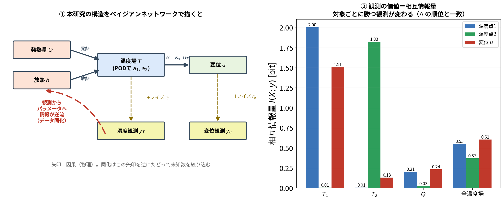

*左：発熱量 $Q$ ・放熱 $h$ が温度場 $T$ を決め、 $T$ が変位 $u$ を決める。観測 $y$ はそこにノイズが乗ったもの。
データ同化は**この矢印を逆にたどって未知数を絞り込む**操作にあたる。
右：各観測がもたらす相互情報量。 $\Delta$ の順位と完全に一致する。*

**なぜ一致するのか**。すべてがガウス分布なら、観測 $y$ を得たときの対象 $X$ の
情報利得（相互情報量）は分散の比で書けます:

$$I(X;y)=\frac{1}{2}\ln\frac{\mathrm{Var}(X)}{\mathrm{Var}(X\mid y)}
=-\frac{1}{2}\ln\Bigl(1-\frac{\Delta(X,y)}{\mathrm{Var}(X)}\Bigr)$$

$\Delta$ が大きいほど $I$ も大きい **単調な関係**なので、**同じスカラー対象・同じ事前分布なら観測の順位は変わりません**。ここでの $y$ はノイズを含まない予報なので、式の左辺は厳密には $I(X;y_{\rm obs})$ です。自然対数の式はnat単位で、bit表記には $\ln 2$ で割ります。
実際に計算すると:

| 推定対象 | 温度点1 | 温度点2 | 変位 $u$ |
|---|---:|---:|---:|
| $T_1$ | **2.00 bit** | 0.01 | 1.51 |
| $T_2$ | 0.01 | **1.83 bit** | 0.13 |
| $Q$ | 0.21 | 0.03 | **0.24 bit** |
| 温度2点の分散和から作った参考値（相互情報量ではない） | 0.55 | 0.37 | **0.61** |

★の位置は §2 の $\Delta$ の表とぴったり同じです。
スカラー対象では分散減少と情報量が単調に対応します。全温度ベクトルの情報量は $I(\mathbf T;y_{\rm obs})=\tfrac12\ln[\det B_{TT}/\det B^a_{TT}]$ （正定値の場合）であり、分散和の減少から同じ式では計算できません。上図の全温度場の情報量表示も参考値として読み、厳密な相互情報量の比較には使いません。

**ベイジアンネットワークとして見ると何が嬉しいか**

- **条件付き独立が図で読める**。たとえば $u$ は $T$ を通してしか $Q$ に依存しません
  （ $Q \perp u \mid T$ ）。だから「変位を測ると $Q$ が分かる」のは
  $T$ を経由した間接的な情報伝達だ、と図から即座に言えます。
- **設計の言葉が使える**。センサ配置は「相互情報量を最大にする観測集合の選択」という
  ベイズ実験計画（Bayesian experimental design）の標準問題になります。
  Q-DEIM（blog_004 §4-2）はモード行列の枢軸付きQRによる選択であり、観測ノイズや対象の事前共分散を使う相互情報量最大化とは別の基準です。
- **非ガウス・非線形へ広げられる**。この導出は線形・ガウス仮定です。Q/hも未知の拡大状態の時間発展は非線形で、初期分布も一様・切断分布を含むため、EnKF実験でこの式だけが十分とは言えません。
  相変化や接触のような非線形が入ると $\Delta$ の式は崩れます。その場合も
  相互情報量なら定義は生き残ります（計算は重くなります）。

**逆に、今のままで足りている点**：本ケースは熱伝導が線形で、誤差もガウスと置けるため、
**わざわざ一般のベイジアンネットワーク推論（信念伝播など）を持ち出す必要はありません**。
EnKFはこのネットワーク上のベイズ更新を、**共分散をアンサンブルで近似して解いている**ものと
みなせます（blog_003）。

---

## 2. 小さな行列で手計算 ―「★」が対象ごとに動く

### 2-1. 舞台（blog_002 §3-5と同じ3変数）

状態 $x=(T_1,\ T_2,\ Q)$ 。温度は $Q$ で決まり（感度 $s=(0.3,\ 0.1)$ ）、変位は温度で決まる
（感度 $w=(0.5,\ 0.2)$ ）。背景共分散は $\sigma_T=1,\ \sigma_Q=2$ として

$$B=\begin{pmatrix}
1.36 & 0.12 & 1.2\\
0.12 & 1.04 & 0.4\\
1.2 & 0.4 & 4
\end{pmatrix},\qquad
B=\mathrm{diag}(\sigma_T^2,\ \sigma_T^2,\ 0)+\sigma_Q^2\,a\,a^{\mathsf T},\quad a=(s_1,\ s_2,\ 1)^{\mathsf T}.$$

（成分の出どころ：対角 $\sigma_T^2+\sigma_Q^2 s_i^2$ 、温度と $Q$ の相関 $\sigma_Q^2 s_i$ 。導出は blog_002 §3-5）

この手計算では温度差をK、QをW、変位をµmで表します。 $s_i$ はK/W、 $w_i$ はµm/K、温度観測分散はK²、変位観測分散はµm²です。相関の効果を示す説明用の値であり、実機の物性値ではありません。

**観測の候補は3つ**（それぞれ $v$ と $r$ ）。変位用の3成分ベクトルを $v_u=(w_1,w_2,0)^{\mathsf T}$ と定義します:

| 候補 | $v$ | ノイズ $r$ |
|---|---|---|
| 温度点1 | $(1,\ 0,\ 0)$ | $0.3^2=0.09$ |
| 温度点2 | $(0,\ 1,\ 0)$ | $0.09$ |
| 変位 $u$ | $(w_1,\ w_2,\ 0)=(0.5,\ 0.2,\ 0)$ | $0.1^2=0.01$ |

### 2-2. 部品をそろえる（行列×ベクトルを成分で）

まず各候補の $Bv$ （＝「その観測と各変数の共分散」の列）と $\mathrm{Var}(y)+r$ :

$$B\begin{pmatrix}1\\0\\0\end{pmatrix}=\begin{pmatrix}1.36\\ 0.12\\ 1.2\end{pmatrix},\qquad
B\begin{pmatrix}0\\1\\0\end{pmatrix}=\begin{pmatrix}0.12\\ 1.04\\ 0.4\end{pmatrix},\qquad
B\begin{pmatrix}0.5\\0.2\\0\end{pmatrix}
=\begin{pmatrix}0.5\cdot1.36+0.2\cdot0.12\\ 0.5\cdot0.12+0.2\cdot1.04\\ 0.5\cdot1.2+0.2\cdot0.4\end{pmatrix}
=\begin{pmatrix}0.704\\ 0.268\\ 0.68\end{pmatrix}$$

$$\mathrm{Var}(y_1)+r=1.36+0.09=1.45,\qquad
\mathrm{Var}(y_2)+r=1.04+0.09=1.13,$$

$$\mathrm{Var}(u)+r=v_u^{\mathsf T}Bv_u+r=0.5\cdot0.704+0.2\cdot0.268+0.01=0.4156.$$

### 2-3. 価値 $\Delta$ を対象ごとに計算（例を3つ）

**例1：対象＝発熱量 $Q$ （ $c=(0,0,1)$ ）を温度点1で測る**

$$\Delta(Q,\ y_1)=\frac{\bigl(c^{\mathsf T}Bv\bigr)^2}{1.45}=\frac{1.2^2}{1.45}=0.993$$

**例2：対象＝ $Q$ を変位 $u$ で測る**（分子は $Bw$ の第3成分）

$$\Delta(Q,\ u)=\frac{0.68^2}{0.4156}=1.113\ \gt\ 0.993$$

→ **$Q$ には温度点1より変位の方が価値が高い**。

**例3：対象＝ $T_2$ を変位 $u$ で測る**（分子は $Bw$ の第2成分）

$$\Delta(T_2,\ u)=\frac{0.268^2}{0.4156}=0.173\ \ll\ \Delta(T_2,\ y_2)=\frac{1.04^2}{1.13}=0.957$$

→ **$T_2$ には温度点2が最適**（変位は $w_2=0.2$ としか連動しない）。

### 2-4. 全部並べると「★」が行ごとに動く

全温度場の行は $\Delta(T_1,y)+\Delta(T_2,y)$ 、つまり2点の分散減少の和です。温度和 $T_1+T_2$ の分散ではありません。温度の行はK²、Qの行はW²なので、大小は同じ行の中で比較します。

同じ計算を4対象×3候補で並べたのが下の表です（**すべて上の $B$ から電卓で出せます**）:

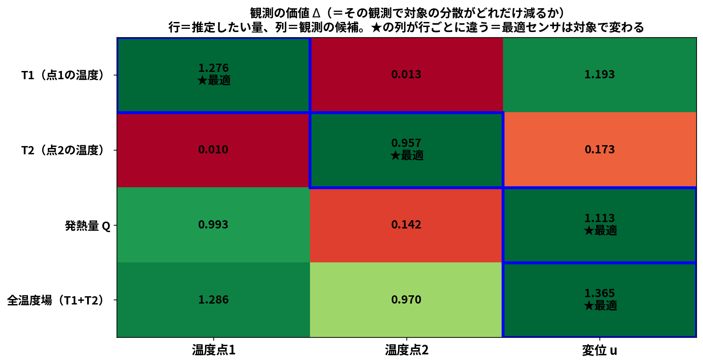

| 推定対象＼観測候補 | 温度点1 | 温度点2 | 変位 $u$ |
|---|---|---|---|
| $T_1$ | **1.276 ★** | 0.013 | 1.193 |
| $T_2$ | 0.010 | **0.957 ★** | 0.173 |
| 発熱量 $Q$ | 0.993 | 0.142 | **1.113 ★** |
| 全温度場（2点の分散の和） | 1.286 | 0.970 | **1.365 ★** |

**★（最適な観測）が行ごとに違います。** これがこの記事の主張の核心で、しかも理由は明快：

- $T_1$ を知りたい → $T_1$ 自身との連動が最大の「温度点1」
- $T_2$ を知りたい → 「温度点2」（変位は $w_2=0.2$ としか連動しない）
- $Q$ を知りたい → **変位**（複数温度の和として $Q$ の効果をまとめて拾い、ノイズも小さい）
- 全温度場 → **変位**（ $T_1$ とも $T_2$ とも連動するので合計で勝つ）

> **一言でいうと**：観測の価値は「対象との共分散」で決まり、共分散は対象ごとに違う。
> だから**対象によって最良の観測候補が変わり得る**。

### 2-5. 図解：なぜ変位が $Q$ ・全場に強いのか

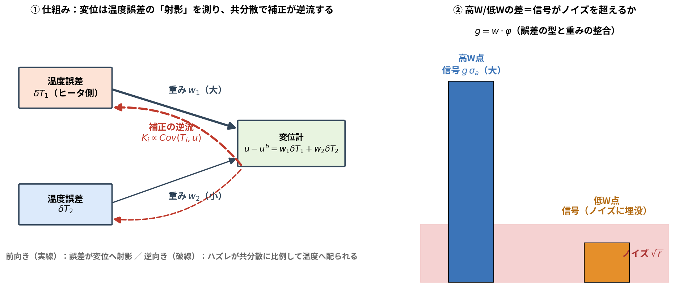

*変位は複数点の温度誤差の**射影**（左・実線）を1つの数で読み、ハズレが共分散に比例して
**逆流**する（左・破線）。誤差が「共通の型」で起きるとき、型と重み $w$ が揃う高W点は
信号がノイズを超える（右）。詳しい導出は blog_002 §3-7。*

---

## 3. 第3の軸「時間」― いつ観測するかも対象で変わる

### 3-1. ここからの問いと、記号の定義

§1〜2は「共分散Bが与えられたとき、どの観測が有効か」を考えました。ここからは一段戻り、**Qやhを変えると、どの場所の温度・変位がどれだけ変わるかを、熱方程式から計算**します。その応答が直接感度です。


```mermaid
flowchart LR
 A["熱方程式をQ・hで微分"] --> B["5点温度と感度を同時積分"]
 B --> C["PODで全セルの感度へ復元"]
 C --> D["FrontISTR応答で変位感度へ"]
 D --> E["ノイズで規格化して観測点を比較"]
 E --> F["選んだ配置をEnKFで検証"]
```

| 記号 | 大きさ・単位 | 意味 |
|---|---|---|
| $m,N,N_t,r$ | 5、20,696、121、5 | ROM代表点数、全セル数、保存時刻数、採用モード数 |
| $\mathbf T(t)$ | $m\times1$ 、K | ROM代表点の温度。添字はコードに合わせ0〜4 |
| $C$ | $m\times m$ 、J/K | 対角成分が熱容量 $C_i$ の対角行列 |
| $K_{ij},L$ | W/K | ノード間の結合係数、結合をまとめた行列 |
| $h$ | W/K | ROMの各点に共通の放熱コンダクタンス |
| $Q_0,\chi(t)$ | W、無次元 | 加熱中の発熱量、ヒータON/OFF関数 |
| $\mathbf b,\mathbf1,I$ | $m\times1,m\times1,m\times m$ | 発熱配分、全成分1のベクトル、単位行列 |
| $\mathbf S_Q,\mathbf S_h$ | $m\times1$ | Qとhに対する温度感度 |

$T_\infty=293.15$ Kは外気温。**hは壁面熱伝達率[W/(m² K)]ではありません。** 論文で区別するなら $G_{\rm loss}$ と書き、現行コードの`h`に対応させます。

この節の $C$ は熱容量で、EnKFの共分散ではありません。また、§1〜2で観測演算子を表す記号と、ここでの放熱hを区別します。

### 3-2. 1点の熱収支を、行列の熱方程式にする

各点について、

$$
C_i\dot T_i=\sum_{j\ne i}K_{ij}(T_j-T_i)-h(T_i-T_\infty)+b_iQ_0\chi(t).
$$

右辺の結合項を展開すると、

$$
\sum_{j\ne i}K_{ij}T_j-\left(\sum_{j\ne i}K_{ij}\right)T_i.
$$

したがって、非対角を $L_{ij}=K_{ij}$ 、対角を $L_{ii}=-\sum_{j\ne i}K_{ij}$ とすれば、結合項は $L\mathbf T$ です。例えば2点なら、

$$
L=\begin{pmatrix}-k&k\\k&-k\end{pmatrix},\qquad
L\begin{pmatrix}T_0\\T_1\end{pmatrix}
=\begin{pmatrix}k(T_1-T_0)\\k(T_0-T_1)\end{pmatrix}.
$$

高温側から低温側へ流れる熱が、2点の和で打ち消し合います。全点をまとめると、

$$
C\dot{\mathbf T}=L\mathbf T-h(\mathbf T-T_\infty\mathbf1)+\mathbf bQ_0\chi(t).
$$

106ではヒータ点P2だけに入熱するので $\mathbf b=(0,0,1,0,0)^{\mathsf T}$ 。 $\chi(t)=1$ は $0\le t<300$ 秒、 $\chi(t)=0$ は300秒以降です。
**微分する未知量は、時間とともにON/OFFするQ(t)ではなく、その振幅Q₀**とします。

### 3-3. Q感度：Q₀で1項ずつ微分する

$C,L,h,T_\infty,\mathbf b$ 、初期温度をQ₀に依存しないものとします。定義は

$$
\mathbf S_Q(t)=\frac{\partial\mathbf T(t)}{\partial Q_0}\quad[\mathrm{K/W}].
$$

熱方程式の各項を微分すると、

$$
\begin{aligned}
\frac{\partial}{\partial Q_0}(C\dot{\mathbf T})&=C\dot{\mathbf S}_Q,\\
\frac{\partial}{\partial Q_0}(L\mathbf T)&=L\mathbf S_Q,\\
\frac{\partial}{\partial Q_0}[-h(\mathbf T-T_\infty\mathbf1)]&=-h\mathbf S_Q,\\
\frac{\partial}{\partial Q_0}[\mathbf bQ_0\chi(t)]&=\mathbf b\chi(t).
\end{aligned}
$$

これらをまとめて、

$$
\boxed{C\dot{\mathbf S}_Q=(L-hI)\mathbf S_Q+\mathbf b\chi(t)},\qquad \mathbf S_Q(0)=\mathbf0.
$$

**Qを少し増やした影響が、ヒータ点から入り、結合Lで周囲へ伝わり、hで失われる**式です。
冷却に入ると右辺の入力だけが消えます。300秒時点の感度は引き継ぎ、ゼロに初期化しません。

現行コードは $Q_0=15q_{\rm scale}$ Wなので、連鎖律より

$$
\frac{\partial\mathbf T}{\partial q_{\rm scale}}
=15\frac{\partial\mathbf T}{\partial Q_0},\qquad
\mathbf S_Q=\frac1{15}\mathbf S_{q_{\rm scale}}.
$$

q_scaleで微分した場合の駆動項は $15\mathbf b\chi(t)$ です。感度のグラフにK/Wと書くなら、この換算が必要です。

### 3-4. h感度：積の微分で項を落とさない

次に $\mathbf S_h=\partial\mathbf T/\partial h$ とします。単位はK/(W/K)＝K²/Wです。
放熱項にはhが明示的に入り、温度Tもhに依存します。

$$
\frac{\partial}{\partial h}[-h(\mathbf T-T_\infty\mathbf1)]
=-(\mathbf T-T_\infty\mathbf1)-h\mathbf S_h.
$$

左の積のうち、hを微分した分が第1項、温度を微分した分が第2項です。Q₀を固定すればヒータ項のh微分は0なので、

$$
\boxed{C\dot{\mathbf S}_h=(L-hI)\mathbf S_h-(\mathbf T-T_\infty\mathbf1)},\qquad \mathbf S_h(0)=\mathbf0.
$$

初期に $\mathbf T=T_\infty\mathbf1$ なら、h感度の駆動項は0です。温度が上がって初めて放熱係数の影響が現れます。
通常の加熱条件では、hを増やすと温度が下がるので感度は負になります。比較では符号と絶対値を区別します。

**1点のモデルでも確認できます。** 初期温度を外気温とし、加熱中の温度差を $\vartheta=T-T_\infty$ とすると、

$$
C\dot\vartheta=Q_0-h\vartheta,\qquad
\vartheta(t)=\frac{Q_0}{h}(1-e^{-ht/C}).
$$

これを直接微分して、

$$
S_Q=\frac{1-e^{-ht/C}}h,\qquad
S_h=-\frac{Q_0}{h^2}(1-e^{-ht/C})+\frac{Q_0t}{hC}e^{-ht/C}.
$$

加熱開始直後の展開は $S_Q\approx t/C$ 、 $S_h\approx-Q_0t^2/(2C^2)$ 。
Q感度は時間の1次、h感度は2次で立ち上がるため、**加熱初期の短い観測だけではhが特に見えにくい**と分かります。
h感度が最大となる時刻は条件によります。「必ず冷却期が最適」とはこの式だけでは言えません。

### 3-5. 15変数を同じRK4ステージで進める

$$
\boldsymbol\zeta=\begin{bmatrix}\mathbf T\\\mathbf S_Q\\\mathbf S_h\end{bmatrix}\in\mathbb R^{15},\qquad
\dot{\boldsymbol\zeta}=f(t,\boldsymbol\zeta).
$$

この15変数は**感度解析用**の拡大変数であり、EnKFの7状態とは別です。 $M=C^{-1}(L-hI)$ と置くと右辺は

$$
f=\begin{bmatrix}
M\mathbf T+C^{-1}hT_\infty\mathbf1+C^{-1}\mathbf bQ_0\chi(t)\\
M\mathbf S_Q+C^{-1}\mathbf b\chi(t)\\
M\mathbf S_h-C^{-1}(\mathbf T-T_\infty\mathbf1)
\end{bmatrix}.
$$

RK4の各段を $k_1,\ldots,k_4$ 、時間刻みを $\Delta t$ とすると、

$$
\begin{aligned}
k_1&=f(t_n,\zeta_n),\\
k_2&=f(t_n+\Delta t/2,\zeta_n+\Delta t k_1/2),\\
k_3&=f(t_n+\Delta t/2,\zeta_n+\Delta t k_2/2),\\
k_4&=f(t_n+\Delta t,\zeta_n+\Delta t k_3),\\
\zeta_{n+1}&=\zeta_n+\frac{\Delta t}{6}(k_1+2k_2+2k_3+k_4).
\end{aligned}
$$

h感度の右辺に入る温度も、各段の途中温度を使います。最初の温度だけを4段で使い回すと、この連立系に対するRK4ではなくなります。

実装は [`integrate_sensitivity()`](../run/sensitivity_analysis.py)、予報側は [`rom_general.py`](../dacore/rom_general.py) です。前者の`dz()`は次の構造です。

```python
# Cは対角成分だけを保存した長さ5の配列。配列で割る操作がC^{-1}に対応。
dT  = M @ T  + h * T_air / C + b * Q0 * chi(t) / C
dSQ = M @ SQ + b * chi(t) / C
dSh = M @ Sh - (T - T_air) / C
```

**切替時刻の注意**：現行実装は既存予報と同じ`chi(t)`を各段で評価し、例えば298→300秒の最終段はOFFです。以下の有限差分一致は、この同じ離散化に対する検証です。連続方程式に対する精度は、刻み幅を減らす検証と区別します。切替を厳密に扱う拡張では区間を分け、加熱区間の終端段は左側入力、冷却区間の始端は右側入力を使います。

### 3-6. 有限差分は「検算」に使う

直接感度とは別に、Q₀またはhを少しだけ上下させて温度を計算します。

$$
S_Q^{\rm FD}=\frac{T(Q_0+\delta Q)-T(Q_0-\delta Q)}{2\delta Q},\qquad
S_h^{\rm FD}=\frac{T(h+\delta h)-T(h-\delta h)}{2\delta h}.
$$

同じ初期値・時刻・刻みで比べます。保存済み [`sensitivity_qh.npz`](../results/sensitivity_qh.npz) の検算値は以下です。

| 条件・比較 | 値 |
|---|---|
| 動作点 | Q₀=15 W、h=0.01535104094 W/K |
| 時間 | 0〜600秒、2秒刻み |
| 差分幅（既存コード） | δQ=0.01 W、δh=0.0001 W/K |
| Q感度：全時刻・5点の最大絶対差 | 約2.34×10⁻¹¹ K/W |
| h感度：同最大絶対差 | 約8.14×10⁻⁸ K/(W/K) |

これは既存出力の確認であり、今回新しく再計算した結果ではありません。数値的一致はROMの微分実装の検証で、実機やOpenFOAM全場への妥当性の証明ではありません。

### 3-7. 5点の感度から20,696セルの感度へ

第4回の復元式を出発点にします。各セルの平均温度は

$$
\bar T_i=\frac1{121}\sum_{k=0}^{120}T_i(5k),\qquad
\bar{\mathbf T}\in\mathbb R^{20696}.
$$

全空間を平均した1個の数ではありません。0〜300秒の61枚平均と305〜600秒の60枚平均に分けて書くなら、

$$
\bar{\mathbf T}_{0:600}=
\frac{61\bar{\mathbf T}_{\rm heat}+60\bar{\mathbf T}_{\rm cool}}{121}.
$$

今回はこの平均場と基底 $\Phi\in\mathbb R^{20696\times5}$ を全時刻で固定します。300秒で平均場だけを変えません。
$P\in\mathbb R^{5\times20696}$ は代表セルを取り出す行列、 $^+$ は疑似逆行列です。

$$
\mathbf a=(P\Phi)^+(\mathbf T_r-P\bar{\mathbf T}),\qquad
\widehat{\mathbf T}_{\rm full}=\bar{\mathbf T}+\Phi\mathbf a.
$$

平均場・基底・選点をパラメータpに依存しないものとして微分すると、

$$
\frac{\partial\mathbf a}{\partial p}=(P\Phi)^+\mathbf S_p^r,
\qquad
\boxed{\mathbf S_p^{\rm full}=A_T\mathbf S_p^r},\quad A_T:=\Phi(P\Phi)^+.
$$

$A_T$ は20,696×5です。観測ノイズ共分散と混同しないため、ここでは復元行列をRではなくAと表記します。pごとにPODを学習し直す場合は、平均場・基底の微分項も必要になり、この式だけでは済みません。


```mermaid
flowchart LR
 A["5点の感度 S：5×1"] --> B["係数感度：(PΦ)⁺S：5×1"]
 B --> C["全場感度：Φ(PΦ)⁺S：20,696×1"]
 C --> D["セル座標と対応づけて分布を表示"]
```

各セルの座標 $(x_i,y_i,z_i)$ に $\partial T_i/\partial p$ を配置すれば感度分布になります。**空間微分 $\partial T/\partial x$ を求める操作ではありません。** CSVなら`cell_id,x_m,y_m,z_m,dT_dQ_K_per_W,dT_dh_K_per_WperK`という列で保存できます。

この全場は、固定POD部分空間で復元したROM感度です。OpenFOAMの全方程式を直接微分した感度とは区別します。

### 3-8. 温度感度を変位感度へ写す

線形熱弾性で、基準温度からの差を $\Delta T$ とすると、

$$
K_u\mathbf u=H_T\Delta\mathbf T,\qquad W=K_u^{-1}H_T.
$$

$K_u$ は構造剛性、 $H_T$ は温度差から熱荷重を作る行列です。剛性・拘束・膨張係数がpで変わらないなら、

$$
\frac{\partial\mathbf u}{\partial p}=W\frac{\partial\mathbf T_{\rm FEM}}{\partial p}.
$$

セル温度をFEM節点へ写す固定行列をJとすれば、 $\mathbf S_p^{u}=WJ\mathbf S_p^{\rm full}$ 。CFDセルとFEM節点の数・位置が異なるため、写像Jを省略して両者を同じ行列として掛けてはいけません。

106のPODモード応答では $\mathbf u=\mathbf u_0+D\mathbf a$ なので、

$$
\boxed{\mathbf S_p^u=A_u\mathbf S_p^r},\qquad A_u:=D(P\Phi)^+.
$$

$D$ にはFrontISTRで事前計算したモード変位応答を使います。現在の`disp_operator.npz`の`Dmode`は**上面A/OのUz 2成分×5モード**で、全FEM節点の3方向変位ではありません。全節点版を出力するにはDを全節点・全成分へ拡張する必要があります。

変位差 $d=u_{z,A}-u_{z,O}$ なら、

$$
\frac{\partial d}{\partial p}
=\frac{\partial u_{z,A}}{\partial p}-\frac{\partial u_{z,O}}{\partial p}.
$$

AとOが同じだけ動けば差の感度は0です。したがって「大きく動く点」と「目的の変位差を識別できる点」は必ずしも同じではありません。

### 3-9. 大きな感度でもQ・hが区別できない場合

候補温度点iで、観測時刻 $t_1,\ldots,t_M$ の感度を縦に並べます。

$$
G_i=\begin{pmatrix}
\partial T_i(t_1)/\partial Q_0&\partial T_i(t_1)/\partial h\\
\vdots&\vdots\\
\partial T_i(t_M)/\partial Q_0&\partial T_i(t_M)/\partial h
\end{pmatrix}\in\mathbb R^{M\times2}.
$$

小さなパラメータ変化に対して $\delta\mathbf y_i\approx G_i\delta\boldsymbol\theta$ 、 $\boldsymbol\theta=(Q_0,h)^{\mathsf T}$ です。
2列が比例していれば、Qの変化とhの変化が同じ観測パターンを作り、どちらが原因か区別できません。

温度と変位の単位を揃えるため、観測誤差共分散を $R_{\rm obs}$ として白色化します。さらにQとhの尺度も異なるので、比較全体で固定した尺度 $s_Q,s_h$ を用います。

$$
S_\theta=\mathrm{diag}(s_Q,s_h),\quad
\delta\theta=S_\theta\delta\eta,\quad
\widetilde G=R_{\rm obs}^{-1/2}G S_\theta,\quad F=\widetilde G^{\mathsf T}\widetilde G.
$$

$\eta$ は無次元パラメータ。例えば独立ノイズなら温度行をσT、変位行をσuで割ります。変位をµmで扱うならσuもµmにします。sQ・shは事前の不確かさ等で設定し、候補点ごとに変えません。
**ノイズだけ規格化してもQとhの単位差は残る**ため、最小固有値による順位付けにはこのパラメータ尺度の明示が必要です。

次は実データではなく、規格化後の2時刻×2パラメータの手計算例です。

$$
\widetilde G_A=\begin{pmatrix}1&1\\2&2\end{pmatrix},\quad
F_A=\begin{pmatrix}5&5\\5&5\end{pmatrix},\quad
\lambda(F_A)=(10,0).
$$

Aでは信号は大きくても1方向しか区別できません。一方、

$$
\widetilde G_B=\begin{pmatrix}1&0\\0&1\end{pmatrix},\quad F_B=I,\quad\lambda(F_B)=(1,1).
$$

Bは両パラメータを別々に区別できます。最小固有値を最大化する基準なら、AよりBを選びます。

| 指標 | 計算・読み方 |
|---|---|
| 列ノルム | $\lVert\widetilde g_Q\rVert,\lVert\widetilde g_h\rVert$ ：各パラメータがどれほど観測へ現れるか |
| 余弦類似度 | $\widetilde g_Q^{\mathsf T}\widetilde g_h/(\lVert\widetilde g_Q\rVert\lVert\widetilde g_h\rVert)$ ：絶対値1なら比例。ゼロ列では未定義 |
| 最小特異値 | $\sigma_{\min}(\widetilde G)$ ：最も見えにくいパラメータ方向の情報 |
| 最小固有値 | $\lambda_{\min}(F)=\sigma_{\min}(\widetilde G)^2$ |
| 条件数 | $\sigma_{\max}/\sigma_{\min}$ ：0割なら無限大。小さくても信号全体が微小なら十分ではない |

独立な温度観測iと変位観測jを組み合わせると、行を縦に積むため $F_{ij}=F_i^T+F_j^u$ 。この上付きTは温度の種類を表し、転置は $\mathsf T$ で書き分けます。
ノイズに相関がある場合は単純に加算せず、結合した $R_{\rm obs}$ で計算します。

$$
(i^*,j^*)=\mathop{\rm arg\,max}_{i,j}\lambda_{\min}(F_{ij}).
$$

これは指定した候補・時刻・ノイズ・尺度の中での選定基準です。Fisher情報は局所的な情報量であり、その順位が有限メンバーEnKFの誤差順位と一致するかは次に検証します。
§1の分散減少Δは事前共分散を含む評価、Fは観測からの情報の評価です。線形ガウス近似なら無次元パラメータの事後共分散は $(B_\eta^{-1}+F)^{-1}$ となり、両者がつながります。

### 3-10. フルFEMで直接求める場合と実装の範囲

ROMを使わない熱FEMの半離散式 $C\dot T+K(p)T=f(p)$ で、Cがpに依存しないなら、積の微分から

$$
C\dot S_p+K S_p=f_p-K_pT.
$$

$f_p=\partial f/\partial p$ 、 $K_p=\partial K/\partial p$ です。Cも依存する場合は右辺に $-C_p\dot T$ が加わります。
対流境界で $K=K_c+h_sK_h$ 、 $f=f_Q+h_sf_h$ と置くと、

$$
C\dot S_{h_s}+(K_c+h_sK_h)S_{h_s}=f_h-K_hT.
$$

ここで $h_s$ は表面熱伝達率です。ROMのhと同じ数値をそのまま入れてはいけません。
定常なら時間微分を除いて $KS_p=f_p-K_pT$ を解きます。これらは熱FEMの一般式で、OpenFOAMのCHT全体では流体の速度・圧力・界面も含む連成系の微分が必要です。

| 段階 | 現行ファイルと確認できた範囲 |
|---|---|
| 熱ROMとQ換算 | `dacore/rom_general.py`：Q=15 q_scale、hはW/K |
| 15状態RK4・中心差分 | `run/sensitivity_analysis.py`：実装済み。既存NPZに検算差を保存 |
| POD基底・平均・選点 | `results/qdeim_points.npz`：mean、pod_modes、cell_idx、cell_centres、times |
| 変位写像 | `results/disp_operator.npz`：現行Dmodeは2×5。全節点の3成分出力ではない |
| 感度保存 | `results/sensitivity_qh.npz`：t、T、S_Q、S_h、検算値。保存される感度は5代表点 |
| 全場CSV/VTK・全節点感度・Fisherランキング | 上記の式に沿う拡張範囲。`sensitivity_analysis.py`単体の既存出力には含まれない |

**次の比較設計**：ROMノードと真値・EnKF・観測ノイズ・seed群・更新時刻・センサ数を固定し、Q-DEIM、単純Q/h感度、Q/h識別性の3配置を比べます。温度場RMSE、Q/h誤差、観測に使わない変位差RMSEを、平均とseed間のばらつきで示します。
学習と同じROMでの双子実験に加え、未学習条件・独立した高忠実度真値を使う検証が必要です。以下の既存図は出発点となる実験であり、全場Fisher最適化まで実証した図ではありません。

### 3-11. 既存の感度時刻歴と、観測時間窓の結果


$\Delta$ の分子 $\mathrm{Cov}(X,y)$ は**時刻の関数**でもあります。直接感度（熱方程式を
$Q,h$ で微分したもの）を計算すると:

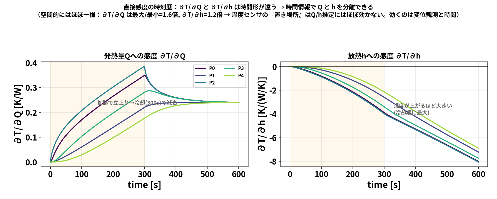

- $\partial T/\partial Q$ は**加熱期に大きく**、冷却で減衰 → $Q$ と温度観測の連動は**加熱期**にある
- $\partial T/\partial h$ は温度が上がった**冷却期に最大** → $h$ の情報は**後半**にある

実験でも、同じ温度2点で**同化する時間窓だけ**変えると:

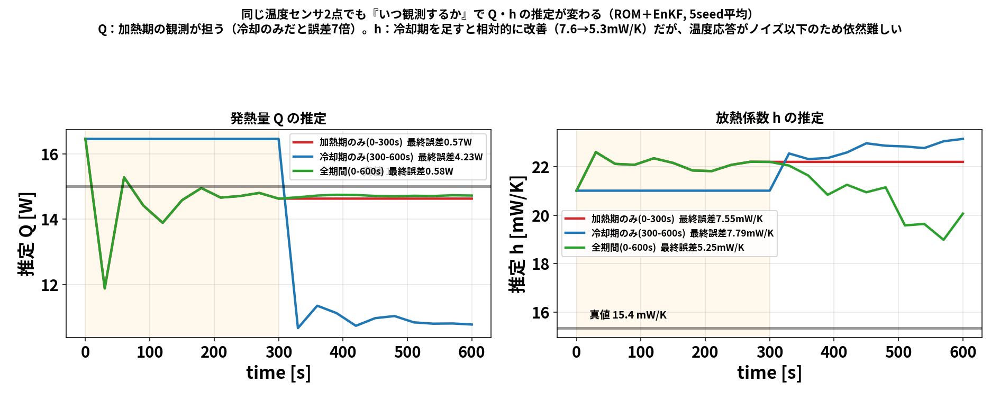

*$Q$ ：加熱期のみ0.57 W ≈ 全期間0.58 W、**冷却期のみだと4.23 W（7倍悪化）**＝ $Q$ は加熱期の観測が担う。
$h$ ：冷却期を足すと7.6→5.3 mW/Kと相対改善（ただし温度応答＜ノイズで依然難）。*

つまり最適観測は **どこで（空間）× 何を（種類）× いつ（時間）** の3軸で、どれも対象依存です。

---

## 4. 実データで検証（ROM＋EnKF/OI、すべて本リポジトリの計算）

### 4-1. まず観測点の位置

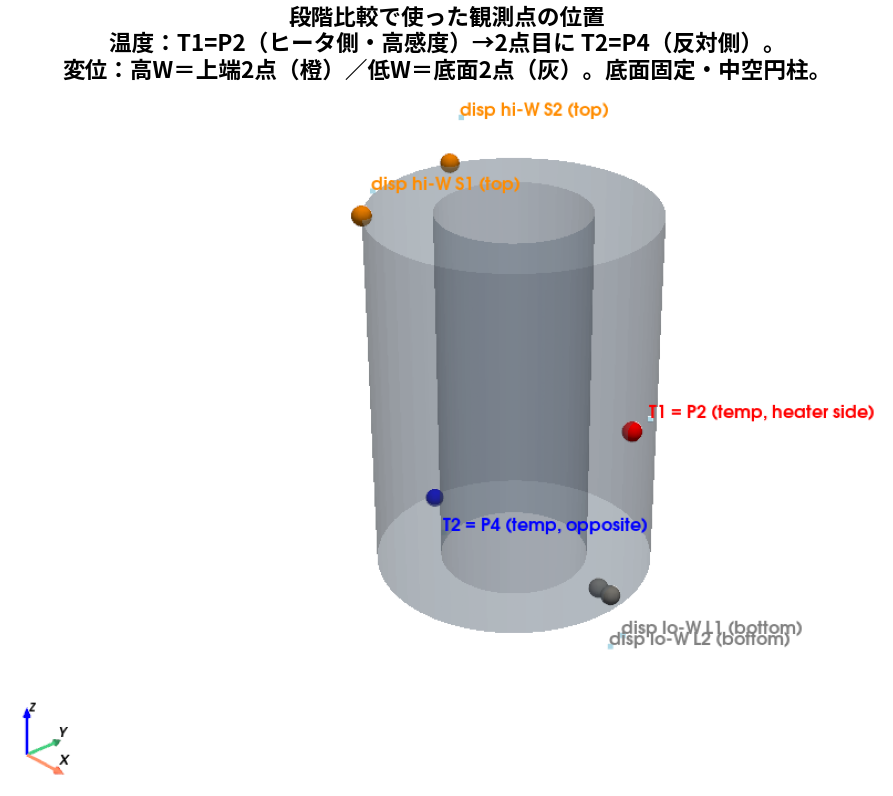

### 4-2. 対象＝全温度場：今回の候補比較では「散らす」配置が改善

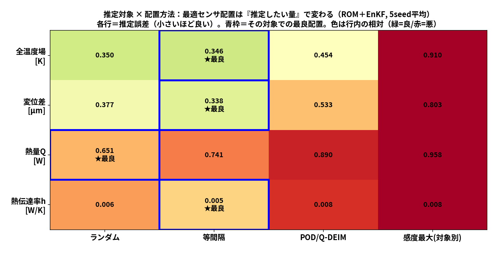

*温度2点のEnKF比較。**感度最大＝近接2点は0.91 Kと2.6倍悪化**、散らす配置は0.35 K。
今回の比較は観測の非冗長性の重要さを示唆しますが、Q-DEIMが全候補中で最適であることを証明するものではありません。*

**なぜ「感度が高い点を並べる」と負けるのか**を、情報の重なりで測ってみます
（`run/redundancy_check.py`）。場への効き（モード1の振幅）が大きい順に2点取る場合と、
1点目から30 mm以上離して2点目を取る場合の比較です:

| | 感度最大の上位2点 | 散らした2点 |
|---|---|---|
| 選ばれたセル | 13885, 13906 | 13885, 4617 |
| 2点間の距離 | **1.6 mm** | 30.1 mm |
| 2点の温度変動の相関 | **+1.00000** | +0.99740 |
| 観測行列の $\lvert\det\rvert$ | $5.9\times10^{-11}$ | $1.5\times10^{-5}$ |
| 条件数 | **4,763,514** | **16.2** |

**感度順に素直に2点取ると、1.6 mmしか離れていない隣どうしが選ばれます**。
温度変動の相関は1.00000 ――**まったく同じことしか言わない2点**です。
その結果、観測行列の条件数が**30万倍**悪化し、2つの未知数を分離できなくなります。

ここで面白いのは、**散らした2点でも相関は0.997とかなり高い**ことです。
本ケースは「全体が一緒に昇温する」モード1が91.8 %を占めるため、どの2点を取っても
温度履歴は似た形になります。それでも**条件数は16.2まで改善**する
―― つまり大事なのは「相関が低いこと」そのものではなく、
**わずかに違う成分（モード2以降）をきちんと拾えること**だと分かります。

これは §2 の $\Delta$ の言葉でも説明できます。2点目の価値は
「1点目では説明できない残り」に比例するので、**1点目とほぼ同じ点の価値はほぼゼロ**。
Q-DEIMが「その方向を差し引いてから次を選ぶ」（blog_004 §4-2）のは、まさにこの冗長性を避けるためです。

### 4-2b. 「熱感度」とは何か ― 2つの感度は別物

ここで用語を整理します。本研究には**まったく別の2つの「感度」**が出てきます。
混同すると結論を誤るので、はっきり分けます。

| | **発熱感度**（基準A） | **熱感度 $W$**（基準B） |
|---|---|---|
| 定義 | $\partial T_i/\partial Q$ | $W=K_s^{-1}H_T$ から導く $\partial u/\partial T_i$ |
| 何を表すか | 発熱が変わると**その点の温度**がどれだけ動くか | その点の温度が変わると**変形**がどれだけ動くか |
| 出どころ | ROM（または CHT）を $Q$ で微分 | **FrontISTR** の熱弾性を1度解く |
| 単位 | K/W | µm/K |
| 向いている用途 | **温度センサを置く場所** | **変位センサを置く場所** |

> ⚠️ **2026-09-30 追記・訂正。** 以前この箇所には
> 「本研究の注目量は熱変形なので、基準Bの熱感度 $W$ が本来の指標です」と書いていました。
> **これは誤りでした。** 5点それぞれを唯一の温度センサにして同化し、
> 温度RMSE との相関を測ったところ（`run/why_lowW_wins_check.py`）、
>
> | 指標 | 温度RMSE との相関 |
> |---|---|
> | **発熱感度 $\partial T/\partial Q$** | **−0.835（最良）** |
> | 熱感度 $W$ | **+0.405（高いほど悪い）** |
>
> となりました。**$W$ は「その点の温度を間違えると変位がどれだけずれるか」であって、
> 「その点を測ると何が分かるか」ではありません。**
> $W$ が高い点＝よく動く点＝固定端から遠い「場の端」で、場全体を代表しないためです。
>
> **2026-10-02 追記：温度センサの場所を発熱感度の大小で選ぶのもやめました。** 発熱感度の上位2点（P2・P0）は熱源のある A 側に集まり、反りや温度場全体を当てるには不利でした。温度センサの選び方は §4-6 を参照してください（熱感度 $W$ と共分散から選ぶ）。
> 感度最大だけで最終精度は決まらず、対象、ノイズ、冗長性、観測時間を含めて配置を検証します。
> （§4-2c の実験結果は当初からこの向きを示していました）

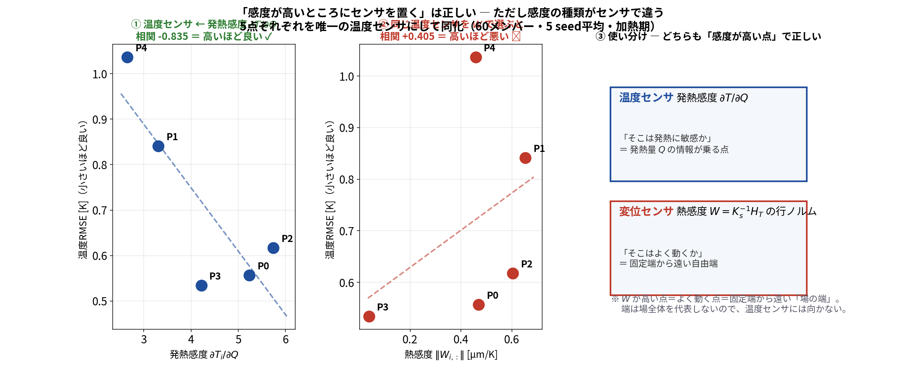

*左：温度センサを発熱感度で選ぶと相関 −0.835＝高いほど良い。
中：同じ温度センサを $W$ で選ぶと +0.405＝高いほど悪い。右：使い分けのまとめ。*

実際に5つの代表点で両方を計算すると、**順位がまったく違います**:

| 点 | 熱感度 $\lvert\partial(U_z(A)-U_z(O))/\partial T_i\rvert$ [µm/K] | 発熱感度 $\partial T_i/\partial q$ [K/q]（K/Wは÷15） |
|---|---:|---:|
| P0 | 0.470 | 5.24 |
| **P1** | **0.654（最大）** | 3.31 |
| P2 | 0.604 | **5.74（最大）** |
| **P3** | **0.038（最小）** | 4.22 |
| P4 | 0.458 | **2.65（最小）** |

- 熱感度 $W$ が最大なのは **P1**、最小は **P3**
- 発熱感度が最大なのは **P2**、最小は **P4**
- 2つの感度の相関は **+0.045**（ほぼ無関係）

**高感度点も低感度点も、基準によって別の点になります。**
なお熱感度には**符号**があり、P1は −0.654、P2は +0.604 と**逆向き**です
（A側とO側で反対に効く点がある）。発熱感度では絶対に見えない情報です。

### 4-2c. どちらの基準で選ぶべきか ― 実験で確かめる

「熱変形を推定したいのだから熱感度 $W$ の高い点を選べばよい」と考えたくなります。
本当にそうか、**4つの選び方で温度センサ1点だけを同化**して比べました
（`run/sensitivity_criterion_compare.py`、EnKF・5 seed平均）:

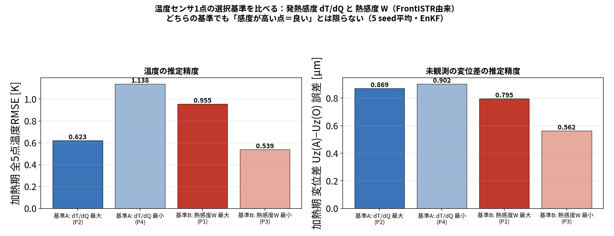

| 選択基準 | 選ばれた点 | 温度RMSE [K] | **変位差の誤差 [µm]** |
|---|---|---:|---:|
| 基準A：発熱感度 最大 | P2 | **0.623** | 0.869 |
| 基準A：発熱感度 最小 | P4 | 1.138 | 0.902 |
| 基準B：熱感度W 最大 | P1 | 0.955 | 0.795 |
| **基準B：熱感度W 最小** | **P3** | 0.539 | **0.562（最良）** |

結果は**直感に反します**:

- **温度を当てたいなら**、この1本の比較では発熱感度の最大点が最小点より良かった（最大P2 0.623 K ＜ 最小P4 1.138 K）。ただし2本の配置では発熱感度の上位から選ぶと不利になる（§4-6）
- **変形を当てたいのに**、熱感度 $W$ が**最小**のP3が**いちばん良い**（0.562 µm）。
  $W$ が最大のP1（0.795 µm）より良い

**なぜか**。§1で見たとおり、観測の価値は感度そのものではなく

$$\Delta(X,y)=\frac{\mathrm{Cov}(X,y)^2}{\mathrm{Var}(y)+r}$$

で決まるからです。 $\partial u/\partial T_i$ が大きいことは
「$T_i$ が $u$ を強く動かす」を意味しますが、**推定に効くかは
「$T_i$ を測ると $u$ の不確かさがどれだけ減るか」**であって、同じではありません。
実際、 $T_i$ 自身のばらつき $\mathrm{Var}(y)$ が大きければ分母で損をします。

> **結論**：センサ選びは「**感度が高い点を選ぶ**」では決まりません。
> 感度は $\mathrm{Cov}$ を作る材料の一つにすぎず、
> **対象との共分散も考える必要があります**。Δは単回更新の指標であり、逐次同化後の誤差最小を保証しません。
> これは §2 で示した「推定対象が変われば最適な観測も変わる」と同じ話です。

**ただし注意**：ここで比べたのは**温度センサ1点**の場合です。
次項で見るように、**変位センサ**については熱感度 $W$ の高い点が明確に有利で、
基準Bがそのまま機能します（変位計は $W$ 方向を直接測るため）。

### 4-3. 対象＝変位：変位センサを「高W点」へ（種類と場所が変わる）

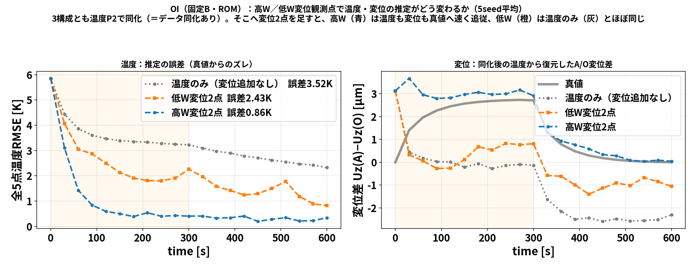

*同じ変位2点でも**低感度W点はほぼ効かず（2.43 K）、高W点は0.86 K**。
§2の言葉では「対象＝変位・温度場」に対し $g=w^{\mathsf T}\varphi$ が大きい観測を選んだ、ということ。*

さらに個別の変位で見ると、**温度センサだけでは「センサに近い側」しか合いません**:

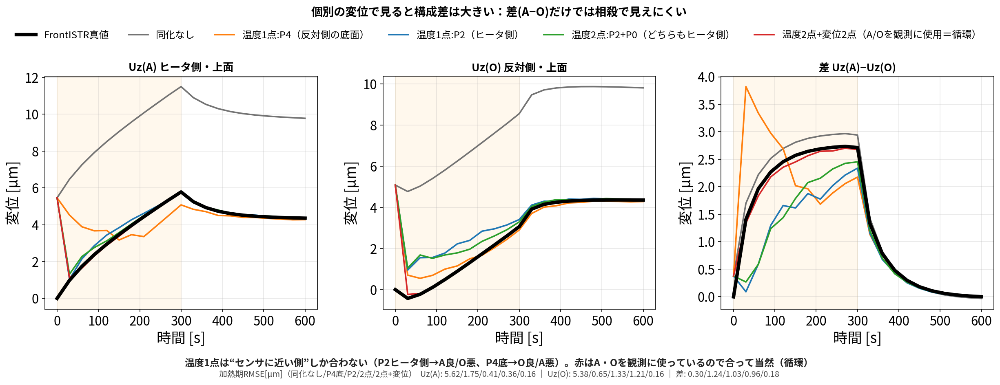

### 4-4. 観測を増やす順番も式の通り

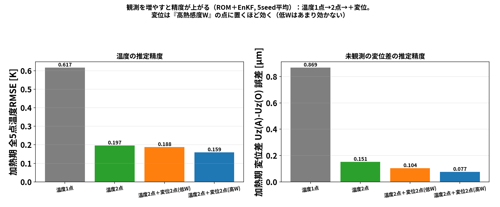

*温度RMSE 0.617→0.197→0.159 K、未観測変位差 0.869→0.151→**0.077 µm**。
この構成では観測追加で改善しました。ただしセンサ数が増えており、固定予算の最適配置試験ではありません。Δ表からこの逐次精度の順序を保証したわけでもありません。*

### 4-5. 仕上げ：未観測の6点でも（動く絵つき）

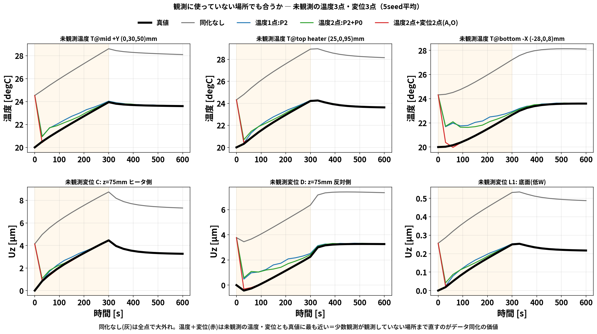

同化が全場を直せる理由（少数点→PODで全場復元）はアニメで一目です:

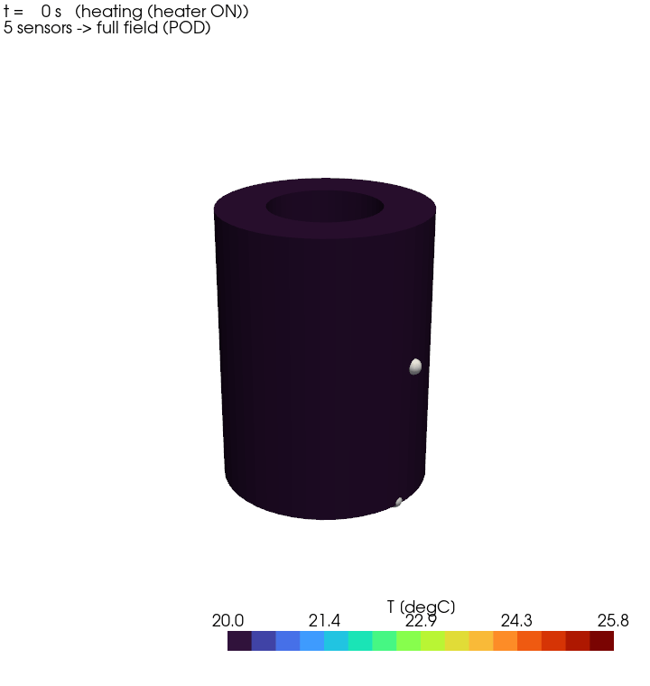

### 4-6. 熱感度 $W$ で温度センサの場所は決まるか ― 反り A−O を当てたい場合

> **この節で分かったこと（先に結論）**
> 1. **熱感度 $W$ が高い点に温度センサを置いても、反りは当たらない。**
> 2. **反りのずれ ＝ 熱感度 $W$ ×「その点の推定温度のずれ」。** $W$ の大きい点の温度を、全部ずれなく推定できるようにする必要がある。
> 3. そのためには、**熱感度 $W$ と「温度のばらつき方（共分散 $B$ ）」を組み合わせて場所を選ぶ**。こうすると同化を回す前に、良い組み合わせの順位を当てられた（順位相関 0.98）。
> 4. 選んだ配置は、発熱量・放熱・初期温度が前提から外れても良いままだった。**熱源の位置を間違えると、最良の組み合わせは当たらない。**
>
> ここでの「熱感度」は、FrontISTR で計算した行列 $W$ （温度 → 変位）のことです。

この節は、次の疑問を順に計算で確かめた記録です。

- 熱感度が高い点に温度センサを置けば、反りの予測は良くなるのでは？
- A と O を別々に見るとどうなるか？
- A 側と O 側に1本ずつ置くとどうなるか？ それは微妙な差ではないか？
- なぜそうなるのか？ どうやって場所を選べばよいのか？
- 本当の温度分布を知らない段階で、場所を選べるのか？
- 前提が外れたらどうなるか？

**共通の条件**（とくに断りがなければ）

- EnKF、60メンバー、30 秒ごとに 20 回更新、温度ノイズ 0.30 K。
- seed は 20260913〜17 の 5 回。誤差は加熱期 30〜300 秒の平均。
- 観測は温度だけで、変位は観測していない。
- 真値も同化モデルも同じ ROM（双子実験）。**OpenFOAM＋FrontISTR を真値にした試験はしていない。**
- スクリプト：`run/sensor_pair_goal_oriented.py`、結果：`results/sensor_pair_goal_oriented.json`

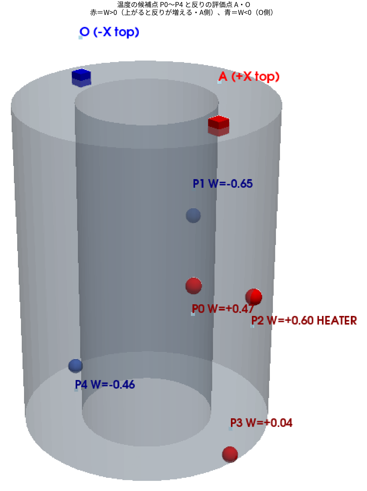

*温度の候補点 P0〜P4 と、反りを評価する上面の A・O。赤は $W>0$ （温まると反りが増える）、青は $W<0$ の点。ヒータは P2 にある。*

#### ① 熱感度 $W$ の高い点に温度センサを1本置くと？

反り $U_z(A)-U_z(O)$ は、5点の温度に $W$ を掛けて足したものです（FrontISTR で計算した値。 $T$ は基準からの温度差 [K]）。

$$
U_z(A)-U_z(O)\approx 0.47\,T_0-0.65\,T_1+0.60\,T_2+0.04\,T_3-0.46\,T_4\quad[\mu\mathrm m]
$$

温度センサを1本だけ置き、場所を変えて同化しました。

| 置いた点 | 熱感度 $W$ | 反り A−O の誤差 |
|---|---:|---:|
| P1 | −0.65（絶対値が最大） | 0.92 µm |
| P2 | +0.60 | 0.92 µm |
| P0 | +0.47 | 0.91 µm |
| P4 | −0.46 | 0.99 µm |
| **P3** | **+0.04（最小）** | **0.68 µm（最良）** |

**熱感度 $W$ が高い点に置いても、反りは良くなりませんでした。** 一番良かったのは $W$ が一番小さい P3 です。

#### ② A と O を別々に見ると

| 置いた点 | 位置 | A の誤差 | O の誤差 | A−O の誤差 |
|---|---|---:|---:|---:|
| P0 | A 側・中段 | **0.27** | 0.97 | 0.91 |
| P2 | A 側・中段（ヒータ） | 0.31 | **1.15** | 0.92 |
| P3 | A 側・底 | 0.38 | 0.59 | **0.68** |
| P1 | O 側寄り・中段 | 1.18 | 0.49 | 0.92 |
| P4 | O 側・底 | **1.36** | **0.46** | 0.99 |

（単位 µm。300 秒時点の真値は A 5.78、O 3.06、A−O 2.71 µm）

- **センサを置いた側だけが合い、反対側は外れます。** そのため、差 A−O はどこに置いても約 0.9 µm ずれます。
- P3 は A と O を同じくらい動かす点です（A に +0.64、O に +0.60 µm/K）。そのため A−O に対する $W$ は小さいのですが、測ると A と O の両方がそこそこ合い、差の誤差が一番小さくなりました。

#### ③ 2本を A 側と O 側に分けると

2本の組み合わせ10通りを全部計算しました。評価は、反りだけでなく**温度場全体（20,696セル）**と**変位14点**でも行っています。

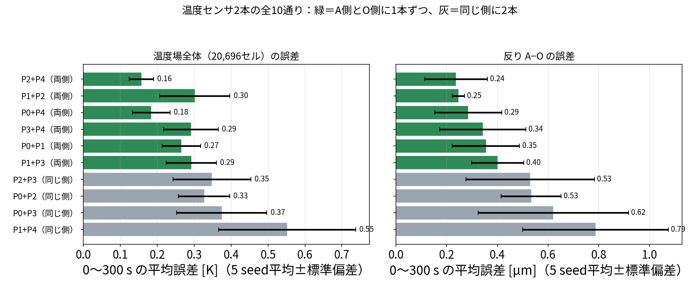

| 組み合わせ | 置いた側 | 温度場全体の誤差 | 変位14点の平均誤差 | 反り A−O の誤差 |
|---|---|---:|---:|---:|
| **P2＋P4** | 両側 | **0.16 ± 0.03 K** | **0.15 ± 0.03 µm** | **0.24 ± 0.12 µm** |
| P0＋P4 | 両側 | 0.18 ± 0.05 | 0.16 ± 0.04 | 0.29 ± 0.13 |
| P0＋P1 | 両側 | 0.27 ± 0.05 | 0.23 ± 0.06 | 0.36 ± 0.13 |
| P3＋P4 | 両側 | 0.29 ± 0.07 | 0.21 ± 0.06 | 0.34 ± 0.17 |
| P1＋P3 | 両側 | 0.29 ± 0.07 | 0.22 ± 0.04 | 0.40 ± 0.10 |
| P1＋P2 | 両側 | 0.30 ± 0.10 | 0.25 ± 0.07 | 0.25 ± 0.02 |
| P0＋P2 | 同じ側 | 0.33 ± 0.07 | 0.31 ± 0.05 | 0.53 ± 0.12 |
| P2＋P3 | 同じ側 | 0.35 ± 0.11 | 0.34 ± 0.13 | 0.53 ± 0.25 |
| P0＋P3 | 同じ側 | 0.38 ± 0.12 | 0.37 ± 0.15 | 0.62 ± 0.30 |
| P1＋P4 | 同じ側 | 0.55 ± 0.19 | 0.35 ± 0.10 | 0.79 ± 0.29 |

（± は 5 seed の標準偏差）

**微妙な差ではないか？** seed ごとに比べると、次のようになりました。

| 比べたもの | 判定 |
|---|---|
| 両側に置く 6 通りの平均 vs 同じ側に置く 4 通りの平均 | 3 指標とも、**5 seed すべてで両側のほうが良い** |
| P2＋P4 vs P0＋P2 | 3 指標とも、**5 seed すべてで P2＋P4 のほうが良い**（温度場は 0.16 K 対 0.33 K） |
| 両側に置く組み合わせ同士 | **差は seed のばらつきに埋もれる。** P2＋P4（0.24）と P1＋P2（0.25）のどちらが良いかは言えない |

言えるのは「**A 側と O 側に分けて置くと良い**」までで、「P2＋P4 が唯一の最適」とまでは言えません。

**結果が乱数の割り当てでどれだけ変わるか。** 同じ2本でも、観測ノイズなどの乱数をどちらのセンサに割り当てるか（並べる順番）を入れ替えると、結果が変わります。

| 組み合わせ | 温度場全体の誤差（並べ方A / 並べ方B） | 反り A−O の誤差（A / B） |
|---|---:|---:|
| P2＋P4 | 0.157 / 0.150 K | 0.24 / 0.25 µm |
| P2＋P0 | 0.327 / **0.528** K | 0.53 / **0.76** µm |

P2＋P4 はほとんど変わりませんが、**P2＋P0 は乱数しだいで大きく変わります**（片側だけの配置は不安定）。上の表の P0＋P2 の値は並べ方Aのものです。並べ方Bでは、P2＋P4 との差は約3倍になります。どちらの並べ方でも P2＋P4 のほうが良い結果です。

なお、本番の比較計算（blog_004 §7-6）で使った温度2点 P2＋P0 は、2本とも A 側にある組み合わせでした。温度だけで同化する場合、P2＋P4 の約2倍の誤差になります。

#### ④ なぜか ― 反りのずれ ＝ $W$ ×「推定した温度のずれ」

ここでいう「温度のずれ」は、**同化で推定した温度が真値からどれだけずれているか**のことです。

**推定した温度が 1 K ずれると、反りはどれだけずれるか。** 反りは5点の温度に熱感度 $W$ を掛けて足したものなので、答えは $W$ そのものです。

| 1 K ずれた点 | 反りのずれ | 意味 |
|---|---:|---|
| P1（ $W=-0.65$ ） | **0.65 µm** | 温度を正確に推定する必要がある |
| P2（ $W=+0.60$ ） | **0.60 µm** | 同上 |
| P0（ $W=+0.47$ ） | **0.47 µm** | 同上 |
| P4（ $W=-0.46$ ） | **0.46 µm** | 同上 |
| P3（ $W=+0.04$ ） | 0.04 µm | 温度が多少ずれても反りにほとんど響かない |

つまり熱感度 $W$ から分かるのは、「**温度がずれると反りが大きくずれる点はどこか**」＝「**温度を正確に推定する必要がある点はどこか**」です。今回は P0・P1・P2・P4 の4点です。

**次に、センサを置いた後、各点の推定温度がどれだけずれているかを見ます。**

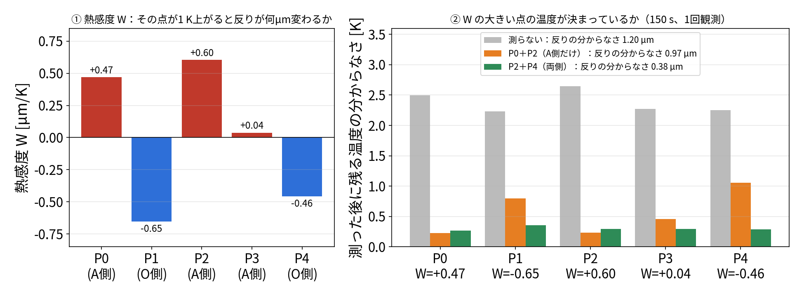

*左：熱感度 $W$ 。P0・P2 は＋（A 側）、P1・P4 は−（O 側）。右：150 秒で1回同化した後の、推定温度のずれの大きさ（標準偏差）。*

| センサの置き方 | P0 | P1 | P2 | P3 | P4 | 反りのずれ |
|---|---:|---:|---:|---:|---:|---:|
| （熱感度 $W$ ） | +0.47 | −0.65 | +0.60 | +0.04 | −0.46 | |
| センサなし | 2.49 K | 2.23 | 2.64 | 2.27 | 2.25 | 1.20 µm |
| P0＋P2（A 側だけ） | 0.22 | **0.80** | 0.23 | 0.46 | **1.05** | **0.97 µm** |
| P2＋P4（両側） | 0.27 | 0.36 | 0.29 | 0.29 | 0.29 | **0.38 µm** |

- **P0＋P2**：A 側の P0・P2 の温度は 0.2 K のずれで推定できます。しかし、 $W$ の大きい O 側の P1・P4 は 0.8〜1.05 K ずれたまま残り、反りが大きくずれます。
- **P2＋P4**：W の大きい4点すべてが 0.3 K 前後のずれに収まり、反りが当たります。
  - **P1 にはセンサがないのに、ずれは 0.36 K です。** P1 は P4 と一緒に温度が上がり下がりするので、P4 を測れば P1 の温度も推定できるからです。

> **まとめると**
> - 熱感度 $W$ が高い点ほど、その点の推定温度がずれると反りが大きくずれる。
> - だから、 $W$ の大きい点の温度を**全部**、ずれなく推定できるようにセンサを置く必要がある。
> - その点を直接測ってもよいし、一緒に温度が動く別の点を測ってもよい。
> - 熱感度 $W$ が高い点に1本置くだけでは、他の $W$ の大きい点の温度がずれたまま残るので、反りは当たらない。

（この表は1回だけ同化した場合の値です。20回続けた場合の値ではありません。）

#### ⑤ どうやって選ぶか ― $W$ ＋ 共分散 $B$

④をそのまま式にします。候補の組み合わせ $S$ を測った後に残る「反りの分からなさ」は、次の式で計算できます。

$$
\sigma_S^2=w^{\mathsf T}\Big(B-BH_S^{\mathsf T}\big(H_SBH_S^{\mathsf T}+R\big)^{-1}H_SB\Big)w
$$

- $w$ ：反りに対する5点の熱感度（上の 0.47, −0.65, …）。**FrontISTR から。**
- $B$ ：5点の温度が「どう一緒にばらつくか」（共分散）。**ROM から。**
- $H_S$ ：組み合わせ $S$ の点を取り出す行列。 $R$ ：センサのノイズ（0.30 K）。
- 括弧の中は「測った後に残る温度の共分散」で、カルマンフィルタの更新式と同じです。

$B$ は時刻ごとに変わるので、30〜300 秒の各時刻で計算して平均しました。この $\sigma_S$ が一番小さい組み合わせを選びます。

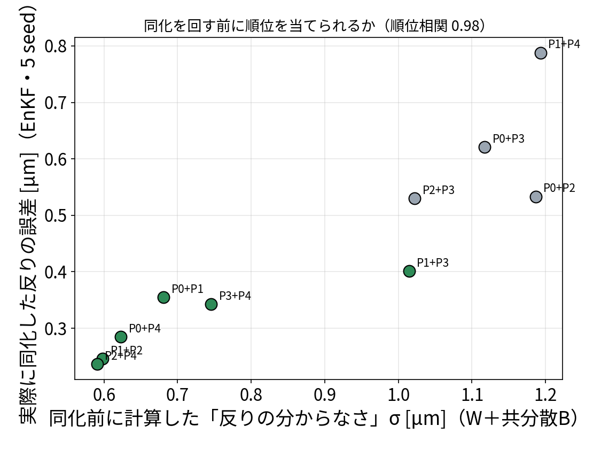

| 組み合わせ | 予測 $\sigma_S$ （同化前の計算） | 実際の反りの誤差（同化後） |
|---|---:|---:|
| P2＋P4 | 0.59（1位） | 0.24（1位） |
| P1＋P2 | 0.60（2位） | 0.25（2位） |
| P0＋P4 | 0.62（3位） | 0.29（3位） |
| … | … | … |
| P1＋P4 | 1.19（最下位） | 0.79（最下位） |

- **順位相関は 0.98。** 上位3つと最下位が一致しました。
- この式は「＋の点と−の点を1本ずつ」を自動的に選びます。「A 側と O 側に分ける」は勘ではなく、 $W$ の符号から出てきます。
- **予測の数値そのもの（0.59 など）は、実際の誤差（0.24）とは合いません。** 合うのは順位だけです。
- **温度センサ1本では当たりませんでした**（順位相関 0.5）。予測では P2 が1位でしたが、実際は P3 が最良でした。1本だと予測 $\sigma$ が 1.22〜1.33 とほとんど差がないためと考えていますが、確かめていません。

#### ⑥ 本当の温度分布を知らないのに、 $B$ を作れるのか

作れます。必要なのは本当の温度ではなく、**温度がどうばらつき得るか**です。

- 分からない条件を範囲で振って、ROM を 4000 本回しました。
  - 発熱量：基準の 0.3〜1.8 倍
  - 放熱係数：平均 0.02、標準偏差 0.01
  - 初期温度：気温の −3〜+12 K
- そのばらつきから $B$ を作りました。ROM なので数秒で終わります。
- $W$ は形状・材料・固定条件だけで決まり、温度分布は要りません。

つまり、**熱源の位置と、発熱量・放熱のだいたいの範囲**が分かっていれば、測る前に場所を選べます。

#### ⑦ 前提が外れたら？

場所の選び方は前提どおりのまま変えず、**真値だけを前提から外して**同化しました。

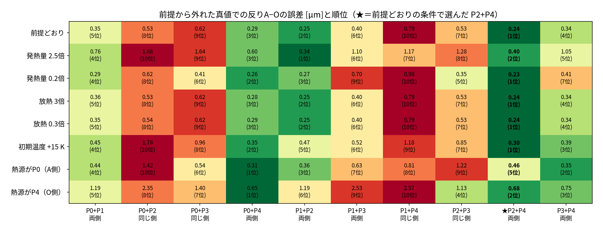

| 真値の条件 | 選んだ P2＋P4 の順位（反り） | 両側に置く平均 vs 同じ側に置く平均（反り） | 予測順位との相関 |
|---|---|---|---:|
| 前提どおり | 1位 | 0.31 vs 0.62 µm | 0.98 |
| 発熱量 2.5 倍（範囲外） | 2位 | 0.71 vs 1.45 | 0.92 |
| 発熱量 0.2 倍（範囲外） | 1位 | 0.36 vs 0.59 | 0.85 |
| 放熱 3 倍 | 1位 | 0.31 vs 0.62 | 0.98 |
| 放熱 0.3 倍 | 1位 | 0.31 vs 0.62 | 0.98 |
| 初期温度 +15 K（範囲外） | 1位 | 0.41 vs 1.19 | 0.90 |
| **熱源が P0（同じ A 側）** | **5位** | 0.43 vs 1.00 | **0.73** |
| **熱源が P4（反対の O 側）** | 2位 | 1.16 vs 1.87 | **0.72** |

- **発熱量・放熱・初期温度が外れても、選んだ配置はほぼ最良のままでした。**
- **熱源の位置が違うと、最良の組み合わせは変わりました。** 熱源が P0 の場合は P0＋P4 が最良で、P2＋P4 は5位でした。
- それでも、どの条件でも「両側に置く」ほうが「同じ側に2本」より良い結果でした。

#### まとめ

| 問い | 答え |
|---|---|
| 熱感度 $W$ の高い点に温度センサを置けばよいか | **いいえ。** 他の $W$ の大きい点の推定温度がずれたまま残ると、反りは当たらない |
| 熱感度 $W$ は何の役に立つか | 「**温度を正確に推定する必要がある点はどこか**」が分かる（ずれたときに反りに響く点） |
| どう選べばよいか | $W$ と共分散 $B$ から、測った後に残る反りの分からなさ $\sigma_S$ を計算し、最小の組み合わせを選ぶ。最後は同化で確かめる |
| 測る前に選べるか | 選べる。熱源の位置と、発熱量・放熱のだいたいの範囲があればよい |
| 前提が外れたら | 発熱量・放熱・初期温度のずれには強い。**熱源の位置を間違えると外れる** |

**やっていないこと**

- 真値は ROM の双子実験です。OpenFOAM＋FrontISTR を真値にした試験はしていません。
- 候補は5点（P0〜P4）の中の2本だけです。3本以上、5点以外の場所は試していません。
- 温度センサ1本の場合は、この選び方で順位を当てられませんでした。
- 変位センサを加えた構成とは比べていません。

---

## 5. まとめ ― 対象別・最適観測の設計表

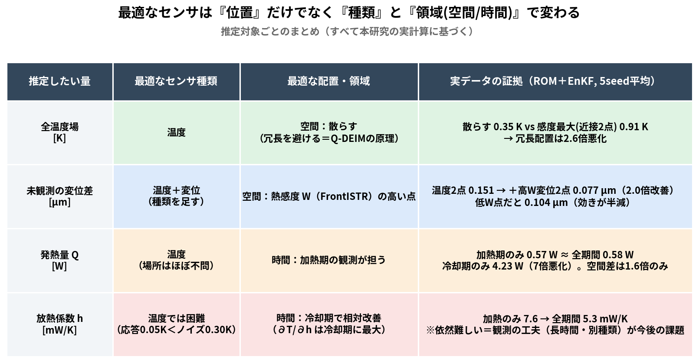

| 推定対象 | 既存の限定条件で有効だった観測 | 理屈（ $\Delta$ の言葉） |
|---|---|---|
| 全温度場 | 温度を**空間に散らす** | 冗長性を避けた配置が今回の候補では改善。共分散の最大化の証明ではない |
| 変位（未観測含む） | **変位を高W点**へ | $g=w^{\mathsf T}\varphi$ が大きい観測 |
| 発熱量 $Q$ | 温度で可・今回の候補間では場所の効果が小さい、**時間＝加熱期** | $\mathrm{Cov}(Q,y(t))$ が加熱期に集中 |
| 放熱 $h$ | **冷却期**の観測で相対改善（依然難） | $\partial T/\partial h$ が冷却期に最大だが信号＜ノイズ |

1. **観測の価値は1本の式** $\Delta=\mathrm{Cov}(X,y)^2/(\mathrm{Var}(y)+r)$ で測れる。
2. 分子に**対象**が入るので、**対象によって最良候補が異なる場合がある**（3変数の手計算で★が行ごとに動いた）。
3. 軸は**場所だけでなく種類と時間**。ROM＋EnKF/OIの候補比較でも構成差が見られた。ただしΔ順位と逐次精度の一致は支持されていない。

> 学会発表との対応：この論理は
> [発表ポスター](https://kamakiri1225.github.io/thermal-da-demo/posters.html) の
> **計算工学講演会（直接感度と観測設計）**・**計算力学講演会（推定対象依存の観測配置）**の骨格です。

---

## 6. 追加検証で分かったこと：何を優位性として主張するか

### 6-1. 単回のΔが大きくても逐次同化の最終誤差は小さくならない

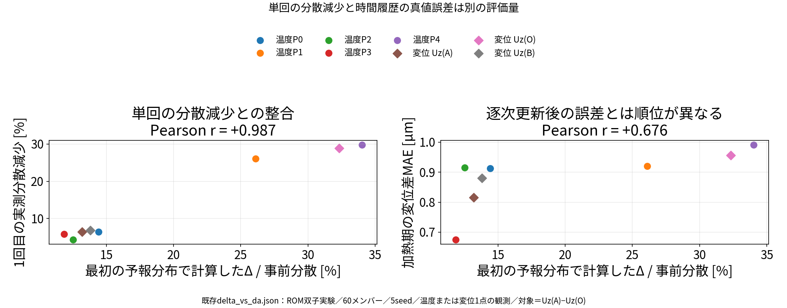

*`run/verify_delta_predicts_da.py` の候補比較。1回目の分散減少との相関は0.987。一方、20回の逐次更新後の加熱期MAEとは順位が一致しない。図中のΔは最初の予報分布で計算した量であり、全時間窓を最適化した指標ではない。*

この結果は§1の式を否定しません。式が表す「その時刻の事前分散の減少」と、評価したい「時間履歴の真値からの誤差」が異なるからです。配置設計には、直接感度の時間履歴から作る累積情報を候補とし、実際のEnKFのRMSEで裏付ける必要があります。

### 6-2. 推定対象別の候補表を、同化性能の証明と混同しない

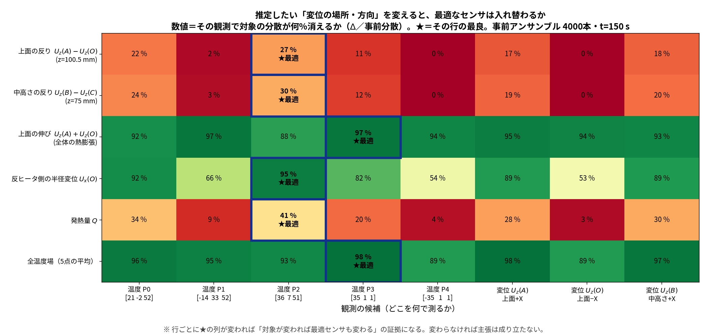

*4000本の事前サンプル、seed=20260930、評価時刻150秒、温度ノイズ0.30 K、変位ノイズ0.30 µm。`run/target_dependent_sensor_check.py` は同化を実行せず、対象と候補のΔを比較する。図の「全温度場」はコードでは5点平均温度であり、全セルの誤差を表す量ではない。*

| 推定対象 | この事前分布でΔが最大の候補 | 最大分散減少 | 言えること |
|---|---|---:|---|
| 上面A−Oの反り | 温度P2 | 27.46% | この時刻の単回観測価値 |
| 中高さB−Cの反り | 温度P2 | 29.98% | 場所が変わっても同じ候補になる例 |
| 上面A＋Oの伸び | 温度P3 | 96.84% | P1の96.83%とほぼ同率。順位の頑健性は未確認 |
| 発熱量Q | 温度P2 | 40.99% | Qに関する単回分散減少 |
| 5点平均温度 | 温度P3 | 97.88% | 全温度場RMSEの最適化ではない |

この表は「対象により有効な候補が異なり得る」例です。逐次EnKFでP2/P3が最良になること、未学習条件でも順位が保たれることは別に試験します。

### 6-3. 本研究の現在の強みと次の検証

現在の強みは、**公開ソルバによる熱流体・熱弾性解析から同化・全場復元までを接続し、観測外の相対変位も評価したこと**です。温度P2/P0に高W変位S1/S2を加えた別試験では、観測に使わないC−Dの加熱期RMSEが0.792から0.158 µmへ約80%低下しました。

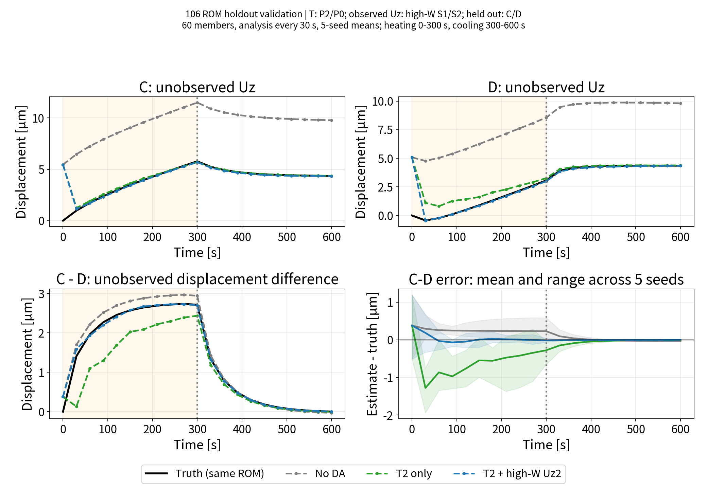

*真値も同じROMとFrontISTR由来写像、60メンバー、30秒間隔、5seed、σT=0.30 K、σu=0.30 µm、加熱30〜300秒。観測位置、評価位置、RMSE式は [条件と原表](17_holdout_displacement_results.md)。センサ追加の効果であり、センサ数を揃えた配置の優劣とは別の比較。*

POD、Q-DEIM、EnKF、目的に応じた観測設計の一般理論には先行研究があります。例えば [Teshima et al. (2024)](https://doi.org/10.1016/j.cirpj.2024.10.015) は工作機械のROMと配置を実験検証し、[goal-oriented sensor placement (2025/2026)](https://arxiv.org/abs/2507.02500) は予測対象の不確かさを目的に配置を設計します。「目的別の配置を初めて提案した」とは主張しません。

さらに優位性を裏付けるには、(1) 未学習条件のOpenFOAM＋FrontISTRを真値にした独立試験（2026-10-02 時点で計算中）、(2) 同じ温度・変位センサ数での配置比較（温度2本・候補5点・ROM真値でのみ実施。§4-6）、(3) Q/hとholdout変位を同時評価する複数seed試験を優先します。**温度場が合う配置と相対変位・Q/hが合う配置のトレードオフを、独立条件でも示すこと**が次の研究貢献です。調査範囲・最新の原典・実装上の注意は [研究の優位性と検証計画](19_research_advantage_and_validation.md) に整理しました。

---

### 参考（元になった実装・詳細）

- $\Delta$ の元になる更新式・変位→温度の導出：`blog_002_oi_data_assimilation.md` §2, §3-7
- 直接感度の実装と検証：`run/sensitivity_analysis.py`（有限差分と一致）
- 時間窓実験：`run/time_window_qh.py` ／ 空間配置比較：`run/optimal_placement_table.py`
- 段階比較・未観測評価：`run/opencae_sensor_progression.py`, `run/make_unobs_multi_fig.py`
