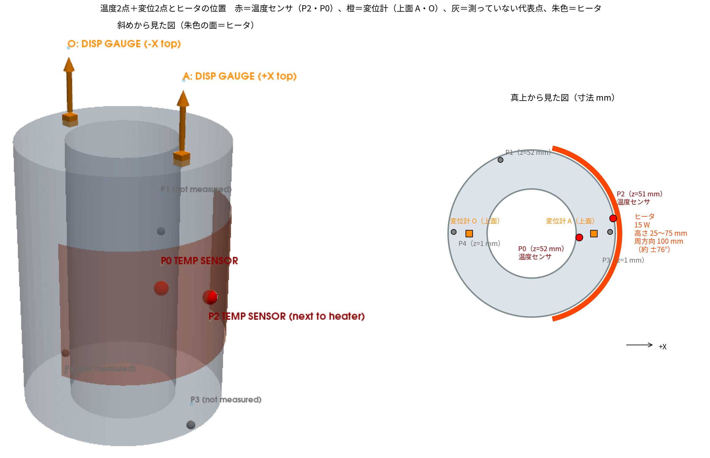
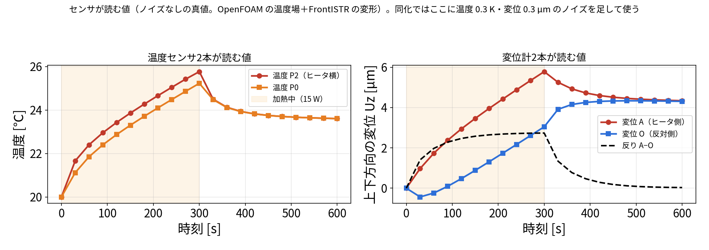
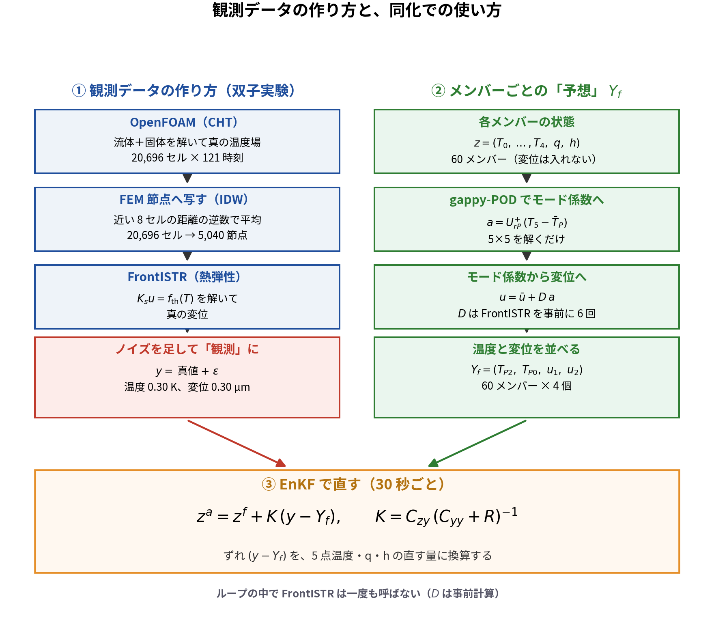
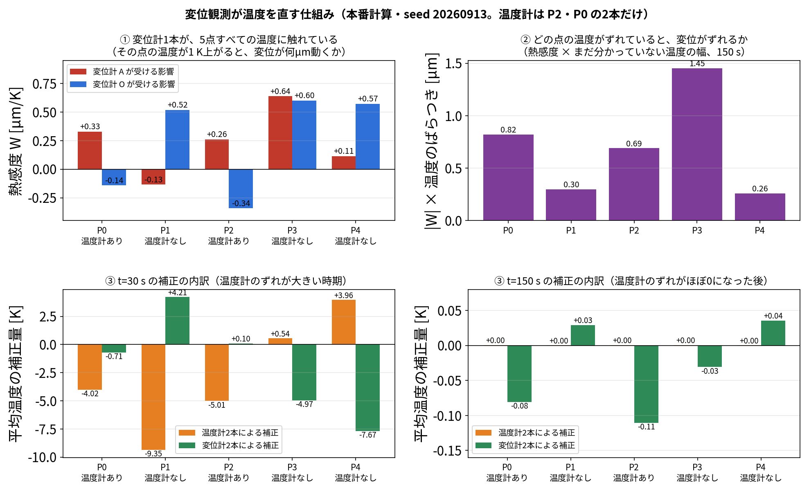

# blog_006：「温度2点＋変位2点」のデータ同化を、センサの読みから数式まで1ステップずつ追う

この記事では、本研究の主な結果

> 同化なし 4.6 K → **温度2点＋変位2点** で同化すると 0.16 K、発熱量は真値 15 W に対して 14.9 W

を出した計算が、**実際に何をしているか**を、センサの読みから数式まで順に追います。
数値はすべて本研究の本番の計算（`run/run_da_compare.py`）と、同じ計算を再実行して途中の値を記録した `run/trace_displacement_and_Q.py`（結果 `results/trace_displacement_and_Q.json`）の実際の値です。説明用の仮の値は使っていません。

## この記事で確かめること

| | 内容 |
|---|---|
| **確かめたいこと** | 温度2点と変位2点の観測を、EnKF でどう使って、温度5点・発熱量・放熱を推定しているのか。とくに**変位をどう同化に入れるか**と、**測っていない発熱量がなぜ直るのか** |
| **題材** | 片側にヒータ（15 W）が付いた中空円筒（外径 75 mm、内径 40 mm、高さ 100.5 mm、鋼、底面固定）。0〜300 秒加熱、300〜600 秒は自然冷却 |
| **真値（正解）** | ROM で作った模擬データ（双子実験）。**実機の測定ではありません** |
| **観測** | 温度2点（P2・P0）＋ 上面の変位2点（A・O の $U_z$ ）。30 秒ごとに20回 |
| **ノイズ** | 温度 0.30 K、変位 0.30 µm（標準偏差） |
| **同化の設定** | EnKF、60メンバー、偏差膨張 1.02、seed 20260913〜17 の5回 |
| **推定するもの** | 代表5点の温度、発熱倍率 $q$ （ $Q=15q$ W）、放熱係数 $h$ の7つ |
| **評価** | 加熱期 0〜300 秒の平均。数値は本番の計算（`run/run_da_compare.py`）と `run/trace_displacement_and_Q.py` の実測値 |

> **注意**：この記事の構成は、評価している A・O をそのまま観測に使っています（§7-4 の循環の問題）。
> **A・O を測らずに当てた結果は [blog_008 §6](blog_008_novelty_displacement_assimilation.md)** にあります。

---

> **この記事で分かること**
> 1. どこに何のセンサを付け、何を読んでいるか
> 2. 変位を「状態」に入れずに、温度から計算して同化に使う方法
> 3. 測っていない発熱量 $Q$ が、なぜ直るのか（実際の数値で）
> 4. この研究の優位性（実際にやったことで言えること）
>
> 関連：EnKF の一般的な説明は [blog_003](blog_003_ensemble_kalman_filter.md)、POD と変位の写像は [blog_004 §7-0](blog_004_pod_selected_rom.md)、センサの置き場所は [blog_005 §4-6](blog_005_optimal_sensor_placement.md)。

---

## 1. どこに何を付けたか



*左：斜めから見た図。右：真上から見た図（ヒータの周方向の範囲と、各点の高さ z）。*

| センサ | 個数 | 場所 | 測るもの |
|---|---|---|---|
| 温度センサ（熱電対） | 2本 | P2（ヒータのすぐ横、高さの真ん中）と P0（同じ +X 側、高さの真ん中） | その点の温度 |
| 変位計（ダイヤルゲージ） | 2本 | 上面の A（+X 側、ヒータ側）と O（−X 側、反対側） | 上下方向にどれだけ伸びたか（ $U_z$ ） |

題材は、片側にヒータが付いた中空円筒（外径 75 mm、内径 40 mm、高さ 100.5 mm、鋼）です。底面を固定しています。

**ヒータの位置**（図の朱色）：外周の +X 側に巻いたヒートマットです。

| 項目 | 値 |
|---|---|
| 中心 | +X 方向（角度 0°）、高さ 50.25 mm |
| 高さ方向の範囲 | 25.25〜75.25 mm（50 mm） |
| 周方向の範囲 | 外周に沿って 100 mm（約 −76°〜+76°） |
| 発熱 | 0〜300 秒に 15 W、300〜600 秒は切って自然に冷やす |

（`102_0_openfoam_hollow_cylinder_heat_transfer/config/geometry.yaml` の設定）

- 温度センサ P2 はヒータのすぐ内側（+X 側、高さ 51 mm）、P0 も同じ +X 側の高さ 52 mm にあります。**2本ともヒータ側（A 側）**です。
- 変位計 A はヒータ側の上面、O は反対側の上面です。
- 測っていない代表点は、P1（高さ 52 mm、+Y 寄りの反対側）、P3（ヒータ側の底）、P4（反対側の底）です。

> この計算は**本物の実験ではなく、計算で作った模擬データ（双子実験）**です。センサの値は計算結果にノイズを足して作りました。

## 2. センサが読む値



*OpenFOAM で計算した温度場と、その温度場を FrontISTR に入れて計算した変形。ノイズなしの値。*

| 時刻 | 温度 P2 | 温度 P0 | 変位 A | 変位 O | 反り A−O |
|---|---:|---:|---:|---:|---:|
| 0 秒 | 20.00 ℃ | 20.00 ℃ | 0.00 µm | 0.00 µm | 0.00 µm |
| 30 秒 | 21.66 | 21.12 | 0.97 | −0.43 | 1.40 |
| 150 秒 | 23.86 | 23.30 | 3.46 | 0.89 | 2.57 |
| 300 秒（加熱終了） | 25.77 | 25.23 | **5.78** | **3.05** | **2.73** |
| 600 秒 | 23.61 | 23.61 | 4.34 | 4.31 | 0.03 |

- ヒータ側の A は大きく伸び、反対側の O はあまり伸びません。この差が**反り**で、300 秒で 2.73 µm です。
- 加熱の初め（30 秒）は、O は少し**沈み**ます（−0.43 µm）。ヒータ側だけが伸びて、円筒が反対側へ傾くためです。
- 冷えると温度がならされ、A と O の伸びがそろって反りはほぼ 0 に戻ります。

同化では、ここに**温度 0.3 K、変位 0.3 µm**（標準偏差）のノイズを足した値を「測った値」として使います。
（本番の計算では、この値を ROM と後述の変位の写像で作っています。OpenFOAM＋FrontISTR で直接作った上の値との差は、温度場で 0.001 K、反りで 0.001 µm でした。）

## 3. 同化で毎回やること（全体像）

30 秒ごとに、次の4つを 20 回（600 秒まで）繰り返します。

1. **予測する**：「発熱量は何 W か」「温度はいくつか」を少しずつ変えた 60 通りの計算で、次の 30 秒を予測する。
2. **読む**：温度2点と変位2点の、4つの値を読む。
3. **比べる**：60 通りそれぞれについて「この計算なら、センサはこう読むはず」という値を作り、測った値と比べる。
4. **直す**：ずれの大きさに応じて、5点の温度・発熱量・放熱を補正する。



*①観測データの作り方（双子実験）／②予報観測 $Y_f$ の作り方／③EnKF の更新式。*

以下、これを数式で1つずつ書きます。

---

## 4. 記号

| 記号 | 意味 |
|---|---|
| $T_0,\dots,T_4$ | 代表5点 P0〜P4 の温度 [K] |
| $q$ | 発熱の倍率。発熱量は $Q=15q$ [W]（真値は $q=1$ 、つまり 15 W） |
| $h$ | 放熱の係数 |
| $i$ | 60 個のメンバーの番号（ $i=1,\dots,60$ ） |
| $y$ | 測った4つの値（温度2つ、変位2つ） |
| $Y_i$ | メンバー $i$ が正しいとしたときに、センサが読むはずの4つの値 |

## 5. ステップ1：状態 ― 分からないものを7つ並べる

7個の値を並べます。

$$
z=(T_0,\ T_1,\ T_2,\ T_3,\ T_4,\ q,\ h)^{\mathsf T}
$$

- **変位は状態に入れません。** 変位は温度から計算できるからです（ステップ3）。
- 60 個のメンバーは、最初は全部ばらばらにしておきます。

| 成分 | 最初のばらつかせ方 |
|---|---|
| 温度 | 気温 20 ℃ の −3〜+12 K（一様乱数） |
| $q$ | 0.3〜1.8（＝4.5〜27 W） |
| $h$ | 平均 0.02、標準偏差 0.01 |

最初の 60 メンバーの平均は $Q=17.09$ W でした。

## 6. ステップ2：予報 ― 各メンバーを 30 秒進める

各メンバー $i$ を、**自分の** $q_i$ と $h_i$ を使って ROM（5点の熱回路）で 30 秒進めます。

$$
C_k\frac{dT_k}{dt}=\sum_j K_{kj}\,(T_j-T_k)\;+\;15\,q_i\,\delta_{k,\mathrm{heater}}\;-\;h_i\,(T_k-T_\mathrm{air})
$$

- 右辺は左から「隣の点との熱のやりとり」「ヒータの発熱（0〜300 秒、ヒータ点 P2 だけ）」「空気への放熱」です。
- $C_k$ （熱容量）と $K_{kj}$ （点どうしの熱の通りやすさ）は、OpenFOAM の結果に合わせて事前に決めた値です（blog_004）。
- $q$ と $h$ は時間で変えずに、そのまま次の時刻へ持ち越します。

## 7. ステップ3：観測演算子 ― メンバーの状態から「センサの読み」を作る

センサは4つです。

$$
y=\big(T(\mathrm{P2}),\ T(\mathrm{P0}),\ U_z(A),\ U_z(O)\big)^{\mathsf T}
$$

**温度の2つ**は、状態の $T_2$ と $T_0$ をそのまま取り出すだけです。

**変位の2つ**は状態に入っていないので、温度から計算します。ここが「変位を同化に使う」ための中心部分なので、実際にやったことを順に書きます。

### 7-1. 温度から変位への写像 $D$ を、事前に1回だけ作る

変位は状態に入れないので、**温度から変位を計算する仕組み**が要ります。それが行列 $D$ です。
ここでは $D$ を**どうやって作ったか**を手順で書きます。

#### なぜ6回で済むのか

**ふつうに考えると、毎時刻 FrontISTR を解かないといけません。**
温度は 30 秒ごとに変わり、メンバーも 60 通りあるので、20 サイクル × 60 メンバー＝**1,200 回**の FEM 解析になります。
これでは「軽くする」という目的が達成できません。

これを **6回**で済ませられるのは、次の2つが重なっているからです。

**① 熱弾性は温度について線形**

FrontISTR が解いているのは

$$
K_s\,u=H_T\,(T-T_\mathrm{ref})
$$

で（ $K_s$ ：剛性行列、 $H_T$ ：温度を熱ひずみの力に変える行列）、
**温度を2倍にすれば変位も2倍、温度を足し算すれば変位も足し算**になります。

> 温度場 $T_A$ の変位が $u_A$ 、温度場 $T_B$ の変位が $u_B$ なら、
> 温度場 $(3T_A+2T_B)$ の変位は $(3u_A+2u_B)$ です。解き直す必要はありません。

**② 温度場は5つのパターンの組み合わせで書ける**

POD により、どの時刻の温度場も次の形に表せます（[blog_004 §2](blog_004_pod_selected_rom.md)）。

$$
T_{\mathrm{all}}\approx\bar T_{\mathrm{all}}+a_1\varphi_1+a_2\varphi_2+a_3\varphi_3+a_4\varphi_4+a_5\varphi_5
$$

**時刻ごとに変わるのは混ぜ具合 $a_1\dots a_5$ だけ**で、パターン $\varphi_k$ は固定です。

**①＋②から**

温度場が「平均場 ＋ 5つのパターンの組み合わせ」で、変形がその足し算で決まるなら、
**平均場と5つのパターンそれぞれの変位を1回ずつ調べておけばよい**ことになります。

$$
u\approx\bar u+a_1 D_1+a_2 D_2+a_3 D_3+a_4 D_4+a_5 D_5
$$

| 調べるもの | 回数 |
|---|---|
| 平均場 $\bar T_{\mathrm{all}}$ の変位 $\bar u$ | 1回 |
| パターン $\varphi_1\dots\varphi_5$ それぞれの変位 $D_1\dots D_5$ | 5回 |
| **合計** | **6回** |

あとは混ぜ具合 $a$ を掛けて足すだけなので、**1,200 回の FEM が 6回**になります。

> **たとえると色の配合表です。**
> 赤・青・黄のインクを1色ずつ単独で塗って、どう見えるかを調べておけば（＝6回の FrontISTR）、
> あとは「赤 0.3、青 0.7」と混ぜるだけで、実際に塗らなくても結果が分かります。
> 配合を何通り試しても、塗る作業は最初の3回だけで済みます。

#### 手順

**ステップ0：FEM のメッシュと材料を用意する**

`cylinder_mesh.build_cylinder_mesh(4, 48, 20, ...)` で円筒メッシュ（**5,040 節点**）を作り、
ヤング率・ポアソン比・線膨張係数を設定し、底面を固定します。
OpenFOAM のセル（20,696 個）と FEM の節点は数も位置も違うので、
**各 FEM 節点に、いちばん近い OpenFOAM セルを1つ割り当てておきます**（`cKDTree` で最近傍探索）。

**ステップ1（1回目）：平均の温度場を入れる**

POD の平均場 $\bar T_{\mathrm{all}}$ （20,696 セル、22.21〜23.79 ℃）を、上の対応で FEM の節点温度に移し、FrontISTR を1回解きます。

出てきた変位が $\bar u$ です。

| | A（+X 上面） | O（−X 上面） |
|---|---:|---:|
| $\bar u$ | **3.970 µm** | **2.601 µm** |

**ステップ2〜6（2〜6回目）：モードを1つずつ入れる**

モード $\varphi_k$ は実在する温度分布ではなく「温度分布のパターン」です。
これを**無理やり温度として** FrontISTR に入れ、「このパターンだけで変形したらどうなるか」を調べます。

```python
for k in range(5):
    Dmode[:, k] = run_field(Tref + U[near, k])    # 基準温度 + モードk を入れて1回解く
```

- `Tref` は基準温度（これを入れると変位ゼロ）。そこにモードを足すので、**モードのぶんだけの変位**が出ます。
- `U[near, k]` が「モード $k$ を FEM 節点に移したもの」です。
- モード1の値は −0.0077〜−0.0047 と小さいですが、線形なので大きさは問題になりません（後で $a_k$ を掛けて戻します）。

5回繰り返して、 $D_1$ 〜 $D_5$ が得られます。

**ステップ7：結果を保存する**

$\bar u$ と $D$ を `results/disp_operator.npz` に保存し、以後はこれを読むだけにします（キャッシュ）。
**同化の最中に FrontISTR を呼ぶことは一度もありません。**

#### できあがった $D$

上面 A・O の上下方向だけを取り出すと、2行 × 5列の小さな行列です。

| | $D_1$ | $D_2$ | $D_3$ | $D_4$ | $D_5$ |
|---|---:|---:|---:|---:|---:|
| A の $U_z$ | −0.00773 | −0.00878 | −0.00627 | −0.00654 | +0.00080 |
| O の $U_z$ | −0.01023 | +0.01195 | −0.00722 | +0.00217 | −0.01082 |

- **行**＝どの点のどの方向の変位か
- **列**＝どのモードに対する応答か

例えば $D_2$ の列を見ると、モード2が増えると A は下がり（−0.0088）、O は上がり（+0.0120）ます。
**モード2は「片側だけ熱い」パターンなので、反りを作るモード**だと読めます。

#### 別のやり方 ― 熱感度 $W$ から $D$ を作ることもできる

「FrontISTR から熱感度行列 $W$ を出して、 $D=W\Phi$ で計算すればよいのでは」と考えることもできます。
**そのとおりで、数学的には同じものです。**

$W$ は「温度が 1 K 上がると、どこが何 µm 動くか」の表で、

$$
W=K_s^{-1}H_T
$$

です。温度場をモードで表すと $T-T_\mathrm{ref}=\Phi a$ （ $\Phi$ ＝モードを並べた行列）なので、

$$
u=W(T-T_\mathrm{ref})=W\Phi\,a
\quad\Rightarrow\quad
D=W\Phi
$$

となり、確かに $D$ が得られます。実際、この研究で作った $D$ と $W$ の関係を数値で確かめると、

$$
W=D\,U_{rP}^{+},\qquad D=W\,U_{rP}
$$

が成り立っています（計算して一致を確認済み）。 $W$ の値は次のとおりです。

| | P0 | P1 | P2 | P3 | P4 |
|---|---:|---:|---:|---:|---:|
| A の $U_z$ [µm/K] | +0.329 | −0.134 | +0.261 | +0.639 | +0.115 |
| O の $U_z$ [µm/K] | −0.141 | +0.520 | −0.343 | +0.601 | +0.573 |

#### 実際に $W\Phi$ でも作れるか試した（2026-10-03）

105 で構築済みの $W$ を使い、 $D=W\Phi$ を計算して FrontISTR 6回版と比べました
（`run/build_D_from_W.py`、`run/build_D_from_W64.py`）。

| やり方 | 求解の回数 | 時間 | FrontISTR 6回版との最大差 |
|---|---:|---:|---:|
| $W$ を float32 で構築（105 の保存値） | 5,040 回 | ― | 1.881×10⁻³ µm（8.6 %） |
| $W$ を **float64** で構築 | 5,040 回 | 54 秒 | **1.881×10⁻³ µm（8.6 %）** |
| **$W\Phi$ を5列だけ解く**（float64） | **5 回** | **0.1 秒** | 1.881×10⁻³ µm（8.6 %） |

（拘束した底面 240 節点を除く 4,800 節点で比較。相関は 0.998〜0.9999）

**3通りとも、まったく同じ差になりました。**

#### 8.6 % の差は何だったのか ― 要素の種類が違った

差の原因は**メッシュの要素タイプの違い**でした。

| | 要素 | 要素数 |
|---|---|---|
| 106 の FrontISTR 6回（`fistr_case.py`） | **TYPE=361**（六面体1次要素） | 3,840 |
| 105 の $W$ （`dumpw_cylinder.py`） | **TYPE=341**（四面体1次要素） | 六面体を6分割して 23,040 |

105 は DUMPW で $K_s$ と $H_T$ を取り出すために、六面体を四面体に分割しています。
**四面体1次要素は曲げに対して硬くなる**ので、変形が小さめに出ます。

モード番号が上がるほど差が大きくなるのも、これで説明がつきます。

| モード | 傾き（ $W$ 版 ÷ FEM 版） |
|---|---:|
| 1 | 0.996 |
| 2 | 0.978 |
| 3 | 0.964 |
| 4 | 0.939 |
| 5 | 0.893 |

高次のモードほど空間的に細かく曲がるパターンなので、四面体要素の硬さが効きます。

> **つまり 8.6 % の差は、手法の優劣ではなく「別のメッシュで比べた」ためです。**
> 同じ要素で作れば $D=W\Phi$ と FrontISTR 6回版は一致するはずです（同じ要素での比較は未実施）。

**確かめて否定したこと**

| 疑ったこと | 結果 |
|---|---|
| CG ソルバの収束が足りない | **違う**。許容誤差を 10⁻⁸ → 10⁻¹⁴ にしても結果は変わらなかった |
| float32 の丸め誤差 | **違う**。float64 で作り直しても同じ差だった |

> **2026-10-03 訂正**：この検証を最初に書いたとき「float32 の丸め誤差が原因と考えられる」としましたが、**誤りでした**。float64 で作り直して同じ結果だったため、撤回します。

#### もう1つ分かったこと ― 6回で解くのは $W\Phi$ を直接解くことだった

上の表で、 **$W\Phi$ を5列だけ解くと 0.1 秒**で済んでいます。これは偶然ではありません。

$$
W\Phi=K_s^{-1}H_T\Phi
$$

なので、「 $H_T\Phi$ を右辺にして5回解く」のと同じです。
そして $H_T\Phi$ は「モード $\varphi_k$ を温度として入れたときの熱荷重」そのものです。

> **本研究の「モードを入れて FrontISTR で解く」は、 $W\Phi$ を無駄なく計算する方法そのものでした。**
> $W$ を丸ごと作るやり方は、必要な5列のために**要らない 5,035 列も解いている**ことになります。

#### では、 $W$ を作るのと何が違うのか

**必要な列だけ解くか、全部解くかの違い**です。

| やり方 | 求解の回数 | 保存するもの | この題材での時間 |
|---|---:|---|---:|
| **モードを入れて解く（本研究）** | **6回** | 5,040×3 行 × **5列** の小さな行列 | 数十秒 |
| $W$ を丸ごと作る | **5,040 回** | 5,040 行 × 5,040 列 ＝ **194 MB**（float64） | 54 秒＋ダンプ作業 |

$W$ は「どの節点の温度が、どの節点の変位に効くか」を**全組み合わせ**で持つ行列です。
しかし同化で必要なのは、**温度場が5つのモードの組み合わせに限られた場合の変位**だけで、
$W$ の全体を知る必要はありません。

実機規模（数十万節点）では $W$ は数百 GB になるので、丸ごと作る選択肢はなくなります。
一方、モードを入れて解く方法は**モードの数だけ**解けばよいので、規模が大きくなっても変わりません。

**使い分け**

| 欲しいもの | 向いているやり方 |
|---|---|
| **$D$ だけ** | **モードを入れて解く（6回）**。拘束節点の処理も要らない |
| **$W$ 自体も**（変位計の置き場所を $W$ の行の大きさで比べたいなど） | $W$ を作る（105 の方式）。ただし拘束節点では $W$ が壊れるので除外が必要 |
| 実機規模 | モードを入れて解く一択 |

#### 全節点版も同じ6回で作れる

FrontISTR は1回解くと**全節点の変位**を返します。
そこで A・O だけでなく全 5,040 節点を保存すれば、**同じ6回で全節点×3方向の $D$** が手に入ります
（`run/build_full_disp_operator.py`、`results/dispop_allnodes.npz`）。
[blog_008 §6](blog_008_novelty_displacement_assimilation.md) で 15,120 通りの候補から変位計の場所を選べたのは、これがあるからです。

#### 使い方

同化の中では、5点の温度から次の2回の掛け算だけで変位が出ます。

| 手順 | 計算 | 行列の大きさ |
|---|---|---|
| ① 5点の温度 → モードの混ぜ具合 $a$ | $a=U_{rP}^{+}(T-\bar T_P)$ | 5×5 |
| ② 混ぜ具合 → 変位 | $u=\bar u+D\,a$ | 2×5（A・O の場合） |

FEM を解かないので一瞬で終わります。これが ROM を軽くできる理由の一つです。

### 7-2. 実際の行列

**① 5点の温度から POD の係数を出す。** 5点で測った温度と平均場との差 $\delta$ から、係数 $a$ を出します。

$$
\delta=T-\bar T_P,\qquad a=U_{rP}^{+}\,\delta
$$

$\bar T_P$ は平均場の5点の温度、 $U_{rP}^{+}$ は「5つのモードの、5点での値」を並べた 5×5 行列の逆行列です。

| | P0 | P1 | P2 | P3 | P4 |
|---|---:|---:|---:|---:|---:|
| $\bar T_P$ [K] | 296.659 | 295.698 | 296.938 | 296.146 | 295.361 |

$U_{rP}^{+}$ （5×5。行が係数 $a_1\dots a_5$ 、列が P0〜P4）：

| | P0 | P1 | P2 | P3 | P4 |
|---|---:|---:|---:|---:|---:|
| $a_1$ | −6.07 | −5.79 | −23.65 | −48.48 | −59.24 |
| $a_2$ | −9.37 | 17.62 | −38.45 | −12.46 | 25.62 |
| $a_3$ | −6.28 | 10.84 | 25.54 | −39.01 | 15.94 |
| $a_4$ | −23.63 | −10.71 | 14.85 | 14.41 | 5.41 |
| $a_5$ | 7.84 | −32.51 | −2.49 | 5.48 | 21.81 |

（値が大きく見えるのは、モード $\varphi_k$ を 20,696 セル全体で長さ1にそろえているので、1セルあたりの値が小さいためです。）

**② 係数から変位を出す。**

$$
\begin{pmatrix}U_z(A)\\U_z(O)\end{pmatrix}=\bar u+D\,a
$$

| | 値 |
|---|---|
| $\bar u$ （平均場の変位） | A：3.970 µm、O：2.601 µm |
| $D$ の A 行（モード1〜5） | −0.0077, −0.0088, −0.0063, −0.0065, +0.0008 |
| $D$ の O 行（モード1〜5） | −0.0102, +0.0120, −0.0072, +0.0022, −0.0108 |

**①と②をつなげると、温度から変位への行列 $W=D\,U_{rP}^{+}$ （2×5）になります。** これが熱感度です。

| 5点の温度が 1 K 上がると | P0 | P1 | P2 | P3 | P4 |
|---|---:|---:|---:|---:|---:|
| A がどれだけ動くか [µm/K] | +0.33 | −0.13 | +0.26 | +0.64 | +0.12 |
| O がどれだけ動くか [µm/K] | −0.14 | +0.52 | −0.34 | +0.60 | +0.57 |

つまり同化の中で使う変位は、次の一次式です。

$$
\begin{pmatrix}U_z(A)\\U_z(O)\end{pmatrix}=\bar u+W\,(T-\bar T_P)
$$

### 7-3. 1メンバーで計算してみる（ $t=30$ 秒の予報、メンバー1）

| | P0 | P1 | P2 | P3 | P4 |
|---|---:|---:|---:|---:|---:|
| 予報温度 $T$ [K] | 297.366 | 295.304 | 298.191 | 296.583 | 293.997 |
| $\delta=T-\bar T_P$ [K] | +0.707 | −0.394 | +1.252 | +0.437 | −1.364 |

$$
a=U_{rP}^{+}\,\delta=(28.0,\ -102.1,\ -15.5,\ 5.0,\ -12.1)
$$

$$
U_z(A)=3.970+(-0.0077)(28.0)+(-0.0088)(-102.1)+\dots=4.70\ \mu\mathrm m
$$

$$
U_z(O)=2.601+(-0.0102)(28.0)+(0.0120)(-102.1)+\dots=1.35\ \mu\mathrm m
$$

このメンバーは「発熱が 25.2 W（ $q=1.68$ ）で、温度も高め」という仮説なので、センサは A＝4.70 µm、O＝1.35 µm と読むはず、ということになります。
60 メンバー全部でこれを計算した平均が、 $t=30$ 秒の予報平均 A＝6.648 µm、O＝5.186 µm です（§12 の表）。

### 7-4. 観測データ（測った値）の作り方

本研究は双子実験なので、「測った値」も計算で作りました。

1. 真値の温度：ROM を発熱 15 W（ $q=1$ ）、本当の放熱 $h$ で回す。 $t=30$ 秒では5点が 294.26, 293.32, 294.81, 293.47, 293.18 K。
2. 真値の変位：その温度を 7-2 と同じ式に入れる。 $t=30$ 秒では A＝0.98 µm、O＝−0.43 µm。
3. ノイズを足す：温度に標準偏差 0.3 K、変位に 0.3 µm の乱数を足す。 $t=30$ 秒の「測った値」は A＝1.321 µm、O＝0.063 µm。

> **注意：測った値も予報も、同じ写像（7-2）で作っています。** 写像そのものの誤差は、この計算の結果には出てきません。
> OpenFOAM の温度場全体を FrontISTR に直接入れて計算した真値（ $t=30$ 秒で A＝0.97 µm、O＝−0.43 µm）とは、ROM の係数を決めた 15 W の計算では 0.001 µm 程度しか違いませんでした。新しく計算した条件での違いは、別途計算中です。

### 7-5. 変位は温度をどう直したか（ $t=30$ 秒と $t=150$ 秒）

更新の式（§11）は、ずれを「温度センサの分」と「変位計の分」に分けて書けます。

$$
\Delta\bar z=K_{:,T}\,d_T+K_{:,u}\,d_u
$$

（右辺の1項目が温度センサの分、2項目が変位計の分。 $K_{:,T}$ はゲインの温度の2列、 $K_{:,u}$ は変位の2列、 $d_T,d_u$ はそれぞれのずれ）

| 平均の補正量 | P0 | P1 | P2 | P3 | P4 | $Q$ [W] |
|---|---:|---:|---:|---:|---:|---:|
| $t=30$ 秒：温度センサの分 [K] | −4.02 | −9.35 | −5.01 | +0.55 | +3.96 | −3.51 |
| $t=30$ 秒：変位計の分 [K] | −0.71 | +4.21 | +0.10 | −4.97 | −7.67 | −0.67 |
| $t=150$ 秒：温度センサの分 [K] | +0.000 | +0.000 | +0.000 | +0.000 | +0.000 | +0.00 |
| $t=150$ 秒：変位計の分 [K] | −0.081 | +0.029 | −0.110 | −0.031 | +0.036 | −0.82 |

- $t=30$ 秒：変位計の分だけで、測っていない P3 を −4.97 K、P4 を −7.67 K 動かしています。温度センサ（P2・P0）だけでは届きにくい、反対側や底の点を変位が直しています。
- $t=150$ 秒：温度センサのずれはほぼ 0 になっていて、**温度も $Q$ も、変位計のずれだけで直されています**。

### 7-5b. なぜ変位を測ると「温度計のない点」の温度まで直るのか

ここがいちばん分かりにくいところなので、3段階に分けて説明します。



*本番計算（seed 20260913）の実際の値。温度計は P2・P0 の2本だけで、P1・P3・P4 には温度計がない。*

#### ① 変位計1本が、5点すべての温度に触れている

7-2 で見たとおり、変位は5点の温度の足し算です。

$$
U_z(A)=3.970+0.33\,T_0-0.13\,T_1+0.26\,T_2+0.64\,T_3+0.11\,T_4
$$

$$
U_z(O)=2.601-0.14\,T_0+0.52\,T_1-0.34\,T_2+0.60\,T_3+0.57\,T_4
$$

（係数は熱感度 $W$ [µm/K]、 $T$ は基準からの温度差）

**温度計は1本で1点しか見られませんが、変位計は1本で5点すべてに触れます。** これが決定的な違いです。
特に P3（係数 +0.64 と +0.60）は、どちらの変位計にも強く効いています。

#### ② 変位がずれていれば、5点の温度のどこかがずれている

変位の予測が真値より大きければ、上の式の右辺が大きすぎる、つまり**どこかの点の温度が高すぎる**ということです。

ただし、これだけでは「どの点が悪いのか」は決まりません。
図②は「熱感度 $W$ × まだ分かっていない温度の幅」を点ごとに並べたものです。
P3 が 1.45 µm といちばん大きく、「P3 の温度がずれていると、変位が大きくずれる」と読めます。

#### ③ どの点をどれだけ直すかは、60メンバーのばらつきが決める

最終的に決めるのは、60メンバーの共分散です。60通りの計算の中には

> 「変位 A を大きく予測したメンバーは、P3 の温度も高く予測している」

という関係が自然にできています。この関係が強い点ほど、変位のずれが大きく配分されます。
これは §9・§10 の $C_{zy}$ と $K$ そのもので、**人が「P3 を直せ」と指定しているわけではありません**。

#### 実際にどれだけ直ったか

更新の式を「温度計の分」と「変位計の分」に分けた内訳です（§7-5 の表と同じもの）。

**$t=30$ 秒**（温度計のずれが −4.96 K、−4.86 K と大きい時期）

| | P0（温度計あり） | P1（なし） | P2（温度計あり） | P3（なし） | P4（なし） |
|---|---:|---:|---:|---:|---:|
| 温度計2本による補正 | −4.02 K | −9.35 K | −5.01 K | +0.54 K | +3.96 K |
| **変位計2本による補正** | −0.71 K | **+4.21 K** | +0.10 K | **−4.97 K** | **−7.67 K** |

**温度計を置いていない P3・P4 を、変位計が 5〜8 K も直しています。** P3・P4 は底面にあり、温度計（P2・P0、どちらも中段のヒータ側）から遠い点です。

**$t=150$ 秒**（温度計のずれがほぼ 0 になった後）

| | P0 | P1 | P2 | P3 | P4 |
|---|---:|---:|---:|---:|---:|
| 温度計2本による補正 | 0.000 K | 0.000 K | 0.000 K | 0.000 K | 0.000 K |
| **変位計2本による補正** | −0.081 K | +0.029 K | −0.110 K | −0.031 K | +0.036 K |

温度計のずれが 0 になると、温度計は何も直せません。**この時期に温度場を直しているのは変位計だけ**です。

#### まとめ

> 1. 変位は5点の温度の足し算なので、**変位計1本で5点すべてに触れる**。
> 2. 変位がずれていれば、5点の温度のどこかがずれていると分かる。
> 3. どの点をどれだけ直すかは、60メンバーのばらつき（共分散）が決める。
> 4. その結果、**温度計を置いていない点の温度まで直る**。

これが、温度2点だけの 0.503 K が、変位2点を足すと 0.160 K になる理由です（§7-6）。

### 7-6. 変位計を入れなかった場合との比較

同じ計算で、変位計を外して温度2点（P2・P0）だけにした結果です（5 seed 平均、`run/run_da_compare.py`）。

| 観測 | 温度の誤差（0〜300 秒、5点） | 最終の $Q$ |
|---|---:|---:|
| 温度2点だけ | 0.503 K | 14.05 W |
| 温度2点＋変位2点 | **0.160 K** | **14.89 W** |

（真値 15 W）

## 8. ステップ4：平均とばらつき（偏差）

$$
\bar z=\frac{1}{60}\sum_i z_i,\qquad \bar Y=\frac{1}{60}\sum_i Y_i
$$

$$
dz_i=z_i-\bar z,\qquad dY_i=Y_i-\bar Y
$$

偏差は 1.02 倍に広げます（インフレーション。ばらつきが縮みすぎて更新が止まるのを防ぐ）。

## 9. ステップ5：共分散 ― 「一緒に動く関係」を 60 個から数える

$$
C_{zy}=\frac{1}{59}\sum_i dz_i\,dY_i^{\mathsf T}\qquad(7\times4)
$$

$$
C_{yy}=\frac{1}{59}\sum_i dY_i\,dY_i^{\mathsf T}\qquad(4\times4)
$$

- $C_{zy}$ ：状態7つとセンサ4つが、どう一緒に動くか
- $C_{yy}$ ：センサ4つ同士が、どう一緒に動くか

例えば「 $q$ の大きいメンバーほど $T(\mathrm{P2})$ が高い」なら、 $C_{zy}$ の $(q,\ T(\mathrm{P2}))$ 成分は正になります。

## 10. ステップ6：カルマンゲイン

$$
K=C_{zy}\,\big(C_{yy}+R\big)^{-1},\qquad R=\mathrm{diag}(0.3^2,\ 0.3^2,\ 0.3^2,\ 0.3^2)
$$

$R$ はセンサのノイズの大きさです（温度は K²、変位は µm²）。

$K$ は 7×4 の行列で、「センサ $j$ のずれ 1 単位で、状態 $k$ をどれだけ直すか」を表します。

## 11. ステップ7：更新 ― ずれを7つの状態に配る

各メンバーで

$$
z_i\leftarrow z_i+K\,\big(y+\varepsilon_i-Y_i\big)
$$

- $y$ は実際に測った値です。
- $\varepsilon_i$ はメンバーごとに足す小さな乱数（観測摂動、標準偏差は $R$ と同じ）です。ばらつきを正しく残すために入れます。

平均で見ると、次の式です。

$$
\bar z\leftarrow\bar z+K\,\big(y-\bar Y\big)
$$

## 12. 発熱量 $Q$ の推定 ― 式を1行ずつ

### 12-1. $q$ の更新式を取り出す

§11 の更新式の、 $q$ の行だけを書きます。

$$
\bar q^{\,a}=\bar q^{\,f}+\sum_{j=1}^{4}K_{q,j}\,d_j,\qquad d=y-\bar Y
$$

（ $f$ ＝更新前、 $a$ ＝更新後）

ゲインの $q$ の行 $K_{q,:}$ は、§10 の式の $q$ の行です。

$$
K_{q,:}=\mathrm{Cov}(q,Y)\,\big(C_{yy}+R\big)^{-1}
$$

- $\mathrm{Cov}(q,Y)$ ：60 メンバーの $q$ と、4つのセンサの予報 $Y$ の共分散（1×4）
- $(C_{yy}+R)^{-1}$ ：4つのセンサの予報どうしの共分散にノイズを足したものの逆行列（4×4）

1 つのセンサだけなら $K_q=\mathrm{Cov}(q,y)/(\mathrm{Var}(y)+r)$ という割り算になりますが、4つあるので、センサどうしの重なり（同じ情報を2回数えない）も含めて逆行列で決まります。

### 12-2. $t=30$ 秒の実際の値

| | $T(\mathrm{P2})$ | $T(\mathrm{P0})$ | $U_z(A)$ | $U_z(O)$ |
|---|---:|---:|---:|---:|
| $\mathrm{Cov}(q,Y)$ | 0.312 | 0.189 | 0.218 | 0.243 |
| $\mathrm{Var}(Y)$ （ $C_{yy}$ の対角） | 4.82 | 4.77 | 8.32 | 12.23 |
| $K_{q,j}$ | +0.4423 | −0.4032 | +0.0088 | −0.0005 |

- 4つとも $\mathrm{Cov}(q,Y)>0$ です。「発熱の大きいメンバーほど温度が高く、よく伸びる」関係が、最初の 30 秒でもうできています。
- それなのに $K_q$ は P2 が＋、P0 が−になります。P2 と P0 はほぼ同じように動く（情報が重なっている）ので、逆行列 $(C_{yy}+R)^{-1}$ を通すと「P2 と P0 の**差**」に重みが乗る形になったと考えられます（この解釈は、行列の値から読んだもので、別の計算で確かめてはいません）。

ずれと寄与：

| センサ | 測った値 $y$ | 予報平均 $\bar Y$ | ずれ $d$ | $K_q$ | 寄与 $K_q d$ |
|---|---:|---:|---:|---:|---:|
| $T(\mathrm{P2})$ | 294.542 K | 299.500 K | −4.958 | +0.4423 | −2.1929 |
| $T(\mathrm{P0})$ | 294.028 K | 298.887 K | −4.859 | −0.4032 | +1.9592 |
| $U_z(A)$ | 1.321 µm | 6.648 µm | −5.327 | +0.0088 | −0.0470 |
| $U_z(O)$ | 0.063 µm | 5.186 µm | −5.124 | −0.0005 | +0.0024 |
| **合計** | | | | | **−0.278** |

$$
\Delta Q=15\times(-0.278)=-4.17\ \mathrm{W}
$$

内訳は、温度センサの分が −3.51 W、変位計の分が −0.67 W です。実際に $Q$ は **17.09 W → 12.88 W** になりました（ $-4.21$ W）。式の $-4.17$ W との差 0.04 W は、各メンバーの観測摂動 $\varepsilon_i$ や上下限（ $0\le q\le3$ ）の影響と考えていますが、内訳は確かめていません。

### 12-3. $t=150$ 秒の実際の値

| センサ | ずれ $d$ | $\mathrm{Cov}(q,Y)$ | $K_q$ | 寄与 $K_q d$ |
|---|---:|---:|---:|---:|
| $T(\mathrm{P2})$ | −0.013 K | 0.0198 | +0.0991 | −0.0013 |
| $T(\mathrm{P0})$ | +0.018 K | 0.0152 | +0.0733 | +0.0013 |
| $U_z(A)$ | −0.530 µm | 0.0158 | +0.0745 | **−0.0394** |
| $U_z(O)$ | +0.613 µm | −0.0021 | −0.0251 | −0.0154 |

- 温度のずれはほぼ 0 で、温度の寄与は打ち消し合って 0.00 W。
- **$Q$ を動かしているのは変位のずれだけ**（−0.82 W）で、 $Q$ は 13.15 → 12.47 W。
- $q$ のばらつき $\mathrm{Var}(q)$ は 0.219（ $t=30$ ）→ 0.0087（ $t=150$ ）に縮み、それに合わせて $K_q$ も小さくなっています。

## 13. 状態にない $Q$ が、なぜ直るのか

センサは $Q$ を直接は測っていません。それでも $K_q\neq0$ になるのは、 $\mathrm{Cov}(q,Y)\neq0$ だからです。

各メンバーは自分の $q_i$ で 30 秒進むので、 $q_i$ の大きいメンバーほど温度が上がり、温度が上がったメンバーほど変位も大きくなります（§7 の写像）。この「一緒に動く関係」を 60 メンバーから数えたのが $\mathrm{Cov}(q,Y)$ で、これを通して、測った温度・変位のずれが $Q$ に振り分けられます。

## 14. 全 20 回の推移（seed 20260913）

| 時刻 | 更新前 → 更新後の $Q$ [W] | 更新後のばらつき（標準偏差）[W] | 温度の分 [W] | 変位の分 [W] |
|---:|---|---:|---:|---:|
| 30 s | 17.09 → 12.88 | 6.05 | −3.51 | −0.67 |
| 60 s | 12.88 → 10.58 | 3.29 | −0.17 | −2.27 |
| 90 s | 10.58 → 15.63 | 1.87 | +4.21 | +0.85 |
| 120 s | 15.63 → 13.15 | 1.37 | −2.46 | −0.26 |
| 150 s | 13.15 → 12.47 | 1.05 | +0.00 | −0.82 |
| 180 s | 12.47 → 13.10 | 0.83 | +0.15 | +0.49 |
| 210 s | 13.10 → 14.11 | 0.59 | +1.01 | +0.03 |
| 240 s | 14.11 → 13.71 | 0.45 | −0.24 | −0.15 |
| 270 s | 13.71 → 14.16 | 0.43 | +0.38 | +0.06 |
| 300 s | 14.16 → 14.22 | 0.40 | +0.12 | −0.08 |
| 330〜600 s | 14.22 → 14.36 | 0.39〜0.44 | ほぼ 0 | ほぼ 0 |

（初期のばらつきは 6.8 W。「温度の分」「変位の分」は $15\times K_{q,j}d_j$ をセンサの種類ごとに足したもの）

- 最初の 2〜3 回は大きく上下し（12.88 → 10.58 → 15.63 W）、その後 14 W 台に落ち着きます。
- **加熱が止まった 300 秒以降は、 $Q$ はほとんど動きません。** 発熱がないので、温度や変位が $Q$ に反応しなくなる（ $\mathrm{Cov}(q,Y)\approx0$ ）ためです。
- 20 回の合計では、温度の分が −0.36 W、変位の分が −2.79 W でした（合計 −3.16 W。実際の変化 17.09 → 14.36 W は −2.73 W で、差は観測摂動と上下限の影響）。ただし、符号つきの合計は「行き過ぎて戻る」動きも足し引きしているので、どちらが $Q$ を当てたかは分かりません。

> **2026-10-02 訂正**：以前ここに「 $Q$ を真値の方向へ動かした量の大部分は変位計によるもの」と書いていましたが、誤りでした。
> 各回の補正を「真値 15 W に近づける向きを＋」として数え直すと（`run/q_contribution_seeds.py`）、この seed で温度センサ +11.56 W、変位計 −0.95 W、5 seed 平均でも温度センサ +11.40 W、変位計 −1.57 W でした。
> **$Q$ を真値に近づけているのは主に温度センサです。** 変位計の $Q$ への直接の補正は、平均するとむしろ真値から遠ざける向きでした。
> それでも、変位計を入れると最終の $Q$ は良くなります（温度2点だけ 14.05 W → 変位計を足して 14.89 W、5 seed 平均）。変位計は $Q$ を直接動かすより、温度を直すことを通して効いていると考えられますが、確かめてはいません。
- この seed の最終値は 14.36 W、5 seed 平均では 14.89 W（真値 15 W）。

## 15. 結果

| 観測 | 温度の誤差（0〜300 秒の平均、5点） | 最終の発熱量 |
|---|---:|---:|
| 同化なし | 4.585 K | 16.45 W（最初のまま） |
| **温度2点＋変位2点** | **0.160 K** | **14.89 W**（真値 15 W） |

（5 seed 平均。 `run/run_da_compare.py`）

## 16. この研究の優位性（実際にやったことで言えること）

### 16-1. 言えること

| 優位性 | 根拠（この研究で実際にやったこと） |
|---|---|
| **オープンソースだけで、熱流体解析から熱変形・データ同化・低次元化までを一続きにつないだ** | OpenFOAM（CHT）→ FrontISTR（熱弾性）→ EnKF → POD／Q-DEIM の ROM を、すべて公開ソフトと Python で実装（blog_001〜004） |
| **変位計の値を、状態を増やさずに同化に使える** | 温度→変位の写像を FrontISTR 6 回で作り（§7）、毎回の同化で FEM を呼ばない。ROM で 600 秒が 31 ms |
| **変位計を入れると、温度も発熱量もよく当たる** | 温度2点だけ 0.503 K → ＋変位2点で 0.160 K。 $Q$ は 14.05 → 14.89 W（真値 15 W）。 変位計は温度を直す（§7-5）。ただし $Q$ を真値に近づける直接の補正は主に温度センサによる（§14 の訂正） |
| **測っていない場所の熱変形を推定できる** | 中段だけ測って上面の反りを誤差 0.081 µm（[blog_004 §7-4b](blog_004_pod_selected_rom.md)） |
| **センサの置き場所を、測る前に計算で選べる** | 熱感度 $W$ と温度のばらつきから選んだ順位が、同化結果の順位とほぼ一致（順位相関 0.98。[blog_005 §4-6](blog_005_optimal_sensor_placement.md)） |
| **手順と条件をすべて公開している** | スクリプト・設定・結果ファイルをリポジトリで公開。この記事の数値は `run/trace_displacement_and_Q.py` で再現できる |

### 16-2. 言わないこと（先行研究があるもの・確かめていないもの）

- **POD、Q-DEIM、EnKF、目的に応じたセンサ配置の考え方そのものは新しくありません。** 例えば工作機械の ROM と配置の実験検証（Teshima et al., 2024, <https://doi.org/10.1016/j.cirpj.2024.10.015>）や、予測対象の不確かさを目的にした配置設計（<https://arxiv.org/abs/2507.02500>）があります。この研究の新しさは、それらをオープンソースの熱流体・熱弾性解析と一続きにつなぎ、熱変形（反り）で評価した点です。
- **実機で精度が出ることは示していません。** すべて計算で作った模擬データです。
- **どんな機械・条件にも通用することは示していません。** 熱源の位置が変わると、選ぶ置き場所も変わりました（blog_005 §4-6）。

## 17. 限界（やっていないこと・注意）

- **真値は計算で作った模擬データです。** 本物の実験の値ではありません。
- 本番の計算では、**測った値も予報も同じ「変位の写像」で作っています**。この写像の誤差は結果に出てきません。OpenFOAM の温度場全体を FrontISTR に入れて真値を作り直した試験（ROM の係数を決めた 15 W の計算）では、ほぼ同じ結果でした（温度 0.16 K、反り 0.14 µm。 `run/limit_realsolver_truth.py`）。ただし ROM を作るのに使った条件そのものなので、合うのは当然です。**新しく計算した条件（25 W、加熱のしかたを変えた場合）の試験は計算中です。**
- 温度センサの P2・P0 は、2本とも A 側（+X 側）にあります。温度だけで同化する比較では、A 側と O 側に分けた P2＋P4 のほうが良い結果でした（[blog_005 §4-6](blog_005_optimal_sensor_placement.md)）。この記事の計算を P2＋P4 でやり直す試験はしていません。
- 放熱 $h$ は 600 秒の計算では当たりません（[blog_003 §4-0-b](blog_003_ensemble_kalman_filter.md)）。
