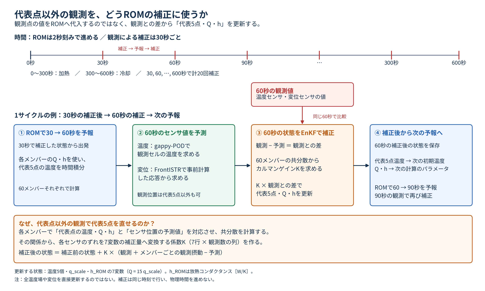
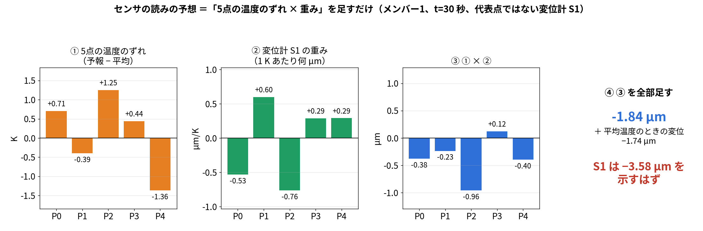
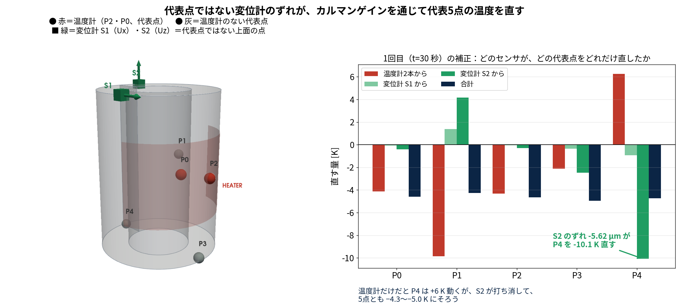
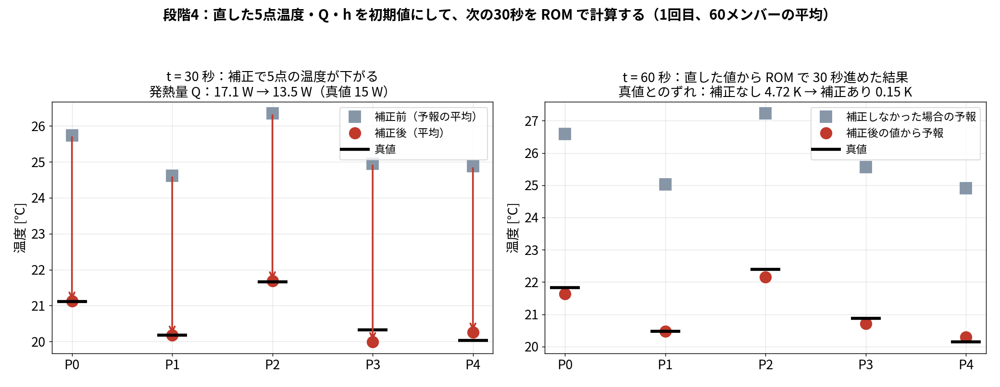
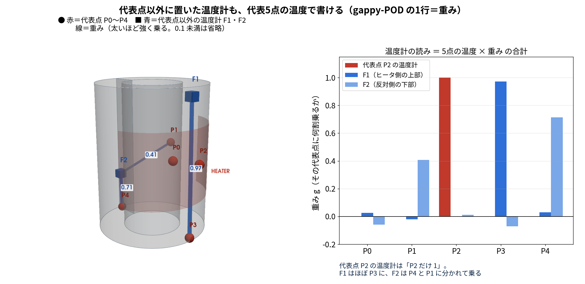
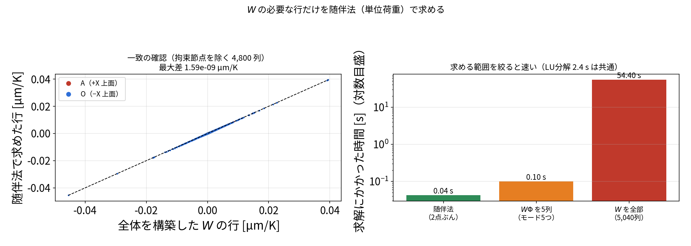

# blog_006：「温度2点＋変位2点」のデータ同化を、センサの読みから数式まで1ステップずつ追う

この記事では、本研究の主な結果

> データ同化なし 4.6 K → **温度2点＋変位2点** でデータ同化すると 0.16 K、発熱量は真値 15 W に対して 14.9 W

を出した計算が、**実際に何をしているか**を、センサの読みから数式まで順に追います。
数値はすべて本研究の本番の計算（`run/run_da_compare.py`）と、同じ計算を再実行して途中の値を記録した `run/trace_displacement_and_Q.py`（結果 `results/trace_displacement_and_Q.json`）の実際の値です。説明用の仮の値は使っていません。

> **blog_006〜008 の役割分担**
>
> | 記事 | 扱うこと | 真値 |
> |---|---|---|
> | [blog_006](blog_006_temp2_disp2_step_by_step.md) | **データ同化の手順**。温度2点＋変位2点をどう使い、なぜ発熱量が直るか | ROM の双子実験 |
> | [blog_007](blog_007_rom_applicability.md) | **ROM の適用範囲**。条件が変わっても使えるか | **OpenFOAM＋FrontISTR** |
> | [blog_008](blog_008_novelty_displacement_assimilation.md) | **主張と先行研究**。研究としてどこが新しいか | ROM（§4・§5）と<br>**OpenFOAM＋FrontISTR**（§6・§7） |
>
> 数値は重複を避け、各記事が担当する検証だけを載せています。

## この記事で確かめること

| | 内容 |
|---|---|
| **確かめたいこと** | 温度2点と変位2点の観測を、EnKF でどう使って、温度5点・発熱量・放熱を推定しているのか。とくに**変位をどうデータ同化に入れるか**と、**測っていない発熱量がなぜ直るのか** |
| **題材** | 片側にヒータ（15 W）が付いた中空円筒（外径 75 mm、内径 40 mm、高さ 100.5 mm、鋼、底面固定）。0〜300 秒加熱、300〜600 秒は自然冷却 |
| **真値（正解）** | ROM で作った模擬データ（双子実験）。**実機の測定ではありません** |
| **観測** | 温度2点（P2・P0）＋ 上面の変位2点（A・O の $U_z$ ）。30 秒ごとに20回 |
| **ノイズ** | 温度 0.30 K、変位 0.30 µm（標準偏差） |
| **データ同化の設定** | EnKF、60メンバー、偏差膨張 1.02、seed 20260913〜17 の5回 |
| **推定するもの** | 代表5点の温度、発熱倍率 $q$ （ $Q=15q$ W）、放熱係数 $h$ の7つ |
| **評価** | 加熱期 0〜300 秒の平均。数値は本番の計算（`run/run_da_compare.py`）と `run/trace_displacement_and_Q.py` の実測値 |

> **注意**：この記事の構成は、評価している A・O をそのまま観測に使っています（§7-4 の循環の問題）。
> **A・O を測らずに当てた結果は [blog_008 §5](blog_008_novelty_displacement_assimilation.md)** にあります。

---

> **この記事で分かること**
> 1. どこに何のセンサを付け、何を読んでいるか
> 2. 変位を「状態」に入れずに、温度から計算してデータ同化に使う方法
> 3. 測っていない発熱量 $Q$ が、なぜ直るのか（実際の数値で）
> 4. この研究の優位性（実際にやったことで言えること）
>
> 関連：EnKF の一般的な説明は [blog_003](blog_003_ensemble_kalman_filter.md)、POD と変位の写像は [blog_004 §7-0](blog_004_pod_selected_rom.md)、センサの置き場所は [blog_005 §4-6](blog_005_optimal_sensor_placement.md)。

---

## 1. どこに何を付けたか


*左：斜めから見た図。右：真上から見た図（ヒータの周方向の範囲と、各点の高さ z）。*

| センサ | 個数 | 場所 | 測るもの |
|---|---|---|---|
| 温度センサ（熱電対） | 2本 | P2（ヒータのすぐ横、高さの真ん中）と P0（同じ +X 側、高さの真ん中） | その点の温度 |
| 変位計（ダイヤルゲージ） | 2本 | 上面の A（+X 側、ヒータ側）と O（−X 側、反対側） | 上下方向にどれだけ伸びたか（ $U_z$ ） |

題材は、片側にヒータが付いた中空円筒（外径 75 mm、内径 40 mm、高さ 100.5 mm、鋼）です。底面を固定しています。

**ヒータの位置**（図の朱色）：外周の +X 側に巻いたヒートマットです。

| 項目 | 値 |
|---|---|
| 中心 | +X 方向（角度 0°）、高さ 50.25 mm |
| 高さ方向の範囲 | 25.25〜75.25 mm（50 mm） |
| 周方向の範囲 | 外周に沿って 100 mm（約 −76°〜+76°） |
| 発熱 | 0〜300 秒に 15 W、300〜600 秒は切って自然に冷やす |

（`102_0_openfoam_hollow_cylinder_heat_transfer/config/geometry.yaml` の設定）

- 温度センサ P2 はヒータのすぐ内側（+X 側、高さ 51 mm）、P0 も同じ +X 側の高さ 52 mm にあります。**2本ともヒータ側（A 側）**です。
- 変位計 A はヒータ側の上面、O は反対側の上面です。
- 測っていない代表点は、P1（高さ 52 mm、+Y 寄りの反対側）、P3（ヒータ側の底）、P4（反対側の底）です。

> この計算は**本物の実験ではなく、計算で作った模擬データ（双子実験）**です。センサの値は計算結果にノイズを足して作りました。

## 2. センサが読む値


*OpenFOAM で計算した温度場と、その温度場を FrontISTR に入れて計算した変形。ノイズなしの値。*

| 時刻 | 温度 P2 | 温度 P0 | 変位 A | 変位 O | 反り A−O |
|---|---:|---:|---:|---:|---:|
| 0 秒 | 20.00 ℃ | 20.00 ℃ | 0.00 µm | 0.00 µm | 0.00 µm |
| 30 秒 | 21.66 | 21.12 | 0.97 | −0.43 | 1.40 |
| 150 秒 | 23.86 | 23.30 | 3.46 | 0.89 | 2.57 |
| 300 秒（加熱終了） | 25.77 | 25.23 | **5.78** | **3.05** | **2.73** |
| 600 秒 | 23.61 | 23.61 | 4.34 | 4.31 | 0.03 |

- ヒータ側の A は大きく伸び、反対側の O はあまり伸びません。この差が**反り**で、300 秒で 2.73 µm です。
- 加熱の初め（30 秒）は、O は少し**沈み**ます（−0.43 µm）。ヒータ側だけが伸びて、円筒が反対側へ傾くためです。
- 冷えると温度がならされ、A と O の伸びがそろって反りはほぼ 0 に戻ります。

データ同化では、ここに**温度 0.3 K、変位 0.3 µm**（標準偏差）のノイズを足した値を「測った値」として使います。
（本番の計算では、この値を ROM と後述の変位の写像で作っています。OpenFOAM＋FrontISTR で直接作った上の値との差は、温度場で 0.001 K、反りで 0.001 µm でした。）

## 3. データ同化で毎回やること ― 流れ・タイミング・なぜそれでよいか

> **この節で知りたいこと**
> 1. ROM・gappy-POD・データ同化は、**どの順番で、いつ**動いているのか
> 2. センサは ROM の代表5点以外にも置ける。では、**代表点以外のセンサのずれを、どうやって ROM（5点）に反映させているのか**
> 3. なぜ5点を直すだけで、全体の温度も変位も直るのか
>
> **答え**
> 1. 30 秒ごとに「ROM で予報 → センサの読みを予想 → ずれを5点温度・ $Q$ ・ $h$ の直す量に換算して直す → 直した値から次の予報」を 20 回くりかえす
> 2. **換算表（カルマンゲイン $K$ ）**が「このセンサが 1 µm ずれたら、P4 を何 K 直すか」を教える。直した5点温度が次の ROM の初期値になる
> 3. 代表点以外の温度も変位も「5点温度に重みを掛けて足したもの」だから

### 3-1. 時間の流れ



*上＝時間軸（ROM は 2 秒刻み、補正は 30 秒ごとに 20 回）／中＝1サイクルの例（①予報 → ②センサ値の予測 → ③EnKF で補正 → ④次の予報へ）／下＝代表点以外の観測で代表5点を直せる理由。*

| 項目 | 値 |
|---|---|
| ROM の時間刻み | **2 秒**（4次のルンゲ・クッタ） |
| 観測・補正のタイミング | **30 秒ごと**（ $t=30, 60, 90, \dots, 600$ 秒の **20 回**） |
| 1回の予報 | 2 秒 × 15 ステップで 30 秒進める |
| ヒータ | 0〜300 秒 ON（15 W） |
| メンバー数 | 60（「発熱量や温度が少しずつ違う」計算を 60 通り同時に回す） |

**予報している 30 秒の間は、センサを使いません。補正する瞬間は、時間を進めません。** この2つが交互に来ます。

### 3-2. 1サイクルの4ステップ（例： $t=0 \to 30$ 秒、1回目の補正）

| | 何をするか | 例（1回目） |
|---|---|---|
| **① 予報** | 60 メンバーそれぞれを ROM で 30 秒進める。計算するのは**代表5点の温度だけ** | 60 メンバーの平均で P4 ＝ 298.03 K（真値 293.18 K） |
| **② センサ値の予測** | 各メンバーについて「**このメンバーの温度が正しいなら、センサは何を示すはずか**」を計算する | 変位計2（代表点以外）の予想の平均 ＝ 5.178 µm |
| **③ 補正** | 予想と実測の**ずれ**を、5点温度・ $q$ ・ $h$ の**直す量に換算**して直す | 実測 −0.443 µm、ずれ −5.62 µm → **P4 を −10.07 K 直す** |
| **④ 次の予報へ** | 直した5点温度・ $q$ ・ $h$ が、**次の ROM の初期値**になる（ $30 \to 60$ 秒） | ― |

例の数値は、温度計2本（P2・P0）＋**代表点以外の変位計2本**（[blog_008 §5](blog_008_novelty_displacement_assimilation.md) で選んだ上面の2点）でデータ同化したときの、seed 20260913 の1回目です。
真値は ROM の双子実験です。

#### 「ROM → gappy-POD で復元 → 補正 → ROM」という理解との対応

| よくある理解 | 実際にやっていること |
|---|---|
| ROM で計算（代表5点） | **そのとおり**（①） |
| gappy-POD で復元 | **センサの場所の分だけ**計算する。全 20,696 セルは復元しない（②） |
| データ同化で補正（代表5点も補正される） | **そのとおり**。直すのは5点温度と $q$ ・ $h$ の **7つだけ**（③） |
| ROM で計算 → 繰り返し | **そのとおり**。直した値から次の 30 秒を予報する（④→①） |

全セルの温度・全節点の変位は、**評価のときだけ**、直した5点温度から計算します。ループの中で FrontISTR は呼びません。

**② と ③ は、数式で書くとこうなります**（ $i$ ＝メンバーの番号 1〜60、 $m$ ＝センサの番号）。

**② センサの場所の分だけ計算する**

gappy-POD で全セルを復元すると、こういう式になります（20,696 行）。

$$
T^{(i)}_{\mathrm{all}} = \bar T + U_r\,U_{rP}^{-1}\big(T_P^{(i)} - \bar T_P\big)
$$

ただし必要なのは**センサの行だけ**なので、その行だけを取り出して計算します。

$$
\hat y_m^{(i)} = \bar y_m + h_m^{\mathsf T}\big(T_P^{(i)} - \bar T_P\big)
$$

$T_P^{(i)}$ はメンバー $i$ の5点温度、 $\bar T_P$ はその平均、 $\bar y_m$ は平均温度のときのセンサの値です。
$h_m$ はセンサ $m$ の重み（5つの数字）で、温度計なら gappy-POD の1行、変位計なら熱感度の1行です（§3-3）。
**センサが4つなら4行だけ計算し、残りの 20,692 行は計算しません。**

**③ 直すのは7つだけ**

$$
z^{a(i)} = z^{f(i)} + K\big(y + \varepsilon^{(i)} - \hat y^{(i)}\big),\qquad z = (T_0,\ T_1,\ T_2,\ T_3,\ T_4,\ q,\ h)
$$

$z^{f(i)}$ は直す前、 $z^{a(i)}$ は直した後、 $y$ は実測、 $\varepsilon^{(i)}$ はメンバーごとに足す観測ノイズです。
$K$ は「センサのずれ → 7つの直す量」の換算表で、7行 × センサの数の列です（§3-4）。
**左辺が7つしかないので、直すのは5点温度と $q$ ・ $h$ だけです。** 全セルの温度や変位は、直した5点温度から ② の式で計算し直します。

### 3-3. ② センサの読みを予想する ― 何をしているのか

**やっていることは「5点の温度のずれに、センサごとの重みを掛けて足す」だけです。**

例として、メンバー1の $t=30$ 秒の予報から、**変位計1（代表点ではない上面の点、 $U_x$ ）**の読みを予想します。

| | P0 | P1 | P2 | P3 | P4 |
|---|---:|---:|---:|---:|---:|
| ① メンバー1の予報温度 [K] | 297.366 | 295.304 | 298.191 | 296.583 | 293.997 |
| ② 平均の温度 [K]（事前に決まっている） | 296.659 | 295.698 | 296.938 | 296.146 | 295.361 |
| ③ ずれ ＝ ① − ② [K] | +0.707 | −0.394 | +1.253 | +0.437 | −1.364 |
| ④ 変位計1の重み [µm/K]（事前に計算） | −0.532 | +0.596 | −0.763 | +0.286 | +0.290 |
| ⑤ ③ × ④ [µm] | −0.376 | −0.235 | −0.956 | +0.125 | −0.396 |

⑤を足すと −1.837 µm。これに「平均の温度のときの変位」 −1.738 µm を足して

**予想される読み ＝ −1.738 ＋ (−1.837) ＝ −3.58 µm**

**数式で書くと、こういう計算をしています。**

$$
\hat u_{S1} = \bar u_{S1} + \sum_{k=0}^{4} w_k\,\big(T_k - \bar T_k\big)
$$

| 記号 | 意味 | 値 |
|---|---|---|
| $\hat u_{S1}$ | 変位計1の読みの予想 | これを求める |
| $\bar u_{S1}$ | 5点が平均温度のときの、変位計1の位置の変位 | −1.738 µm |
| $T_k$ | メンバー1の、代表点 P $k$ の予報温度 | 表の① |
| $\bar T_k$ | 代表点 P $k$ の平均温度 | 表の② |
| $w_k$ | 「P $k$ が 1 K 上がると、変位計1の位置が何 µm 動くか」 | 表の④ |

数値を入れると、

$$
\begin{aligned}
\hat u_{S1} &= -1.738 \\
&\quad + (-0.532)(297.366-296.659) + (0.596)(295.304-295.698) \\
&\quad + (-0.763)(298.191-296.938) + (0.286)(296.583-296.146) \\
&\quad + (0.290)(293.997-295.361) \\
&= -1.738 + (-0.376) + (-0.235) + (-0.956) + 0.125 + (-0.396) \\
&= -3.58\ \mu\mathrm{m}
\end{aligned}
$$



*①5点の温度のずれ ×②重み ＝③。③を全部足して平均の変位を足すと、このメンバーが正しいときの読みになる。*

**重み $w_k$ はどう作るか**：変位計1の位置の「型1本あたりの変位」 $D_{S1}$ （FrontISTR を6回解いて作る、§7-1）に、5点の温度から型の強さを出す行列 $U_{rP}^{-1}$ を掛けたものです。

$$
w^{\mathsf T} = D_{S1}\,U_{rP}^{-1}
$$

「5点の温度 → 型の強さ（ $U_{rP}^{-1}$ ）→ その位置の変位（ $D_{S1}$ ）」を1つにまとめた5つの数字、という意味です。

**「このメンバーの温度が正しいなら、変位計1は −3.58 µm を示すはず」**という意味です。
これを 60 メンバー全部で計算します。5つ掛けて足すだけなので一瞬です（この「掛けて足す」を**内積**と呼んでいました）。

**重み（④）はどこから来るか**

| センサ | 重み | 作り方 |
|---|---|---|
| 代表点の温度計（例：P2） | $(0,\ 0,\ 1,\ 0,\ 0)$ | 自分の点だけ 1 |
| **代表点以外の温度計** | 例：A の近くのセル (26.6, −1.6, 98.8) mm は $(-0.007,\ -0.016,\ -0.001,\ 0.993,\ 0.040)$ | **gappy-POD** の、そのセルの1行（[blog_004](blog_004_pod_selected_rom.md)） |
| **代表点以外の変位計** | 例：変位計1は上の表の④ | **FrontISTR の熱感度 $W$ と POD**（§7-7） |

どれも**事前に一度だけ計算**しておく5つの数字です。代表点の温度計は「1か所だけ 1」という特別な場合にすぎません。
だから、**センサを代表点以外に置いても、扱いはまったく同じ**です。

### 3-4. ③ 補正 ― 代表点以外のセンサのずれを、どうやって ROM の5点に反映させるのか

ここがいちばん大事なところです。4段階で説明します。数値は §3-2 と同じ1回目（ $t=30$ 秒）です。

#### 段階1：センサごとに「ずれ」を出す

| センサ | 置き場所 | 実測（真値） | 予想（60 メンバー平均） | **ずれ** |
|---|---|---:|---:|---:|
| 温度計 P2 | 代表点 | 294.81 K | 299.50 K | **−4.69 K** |
| 温度計 P0 | 代表点 | 294.26 K | 298.89 K | **−4.63 K** |
| 変位計1（ $U_x$ ） | **代表点以外**（上面 −y 寄り） | −1.652 µm | −2.312 µm | **+0.66 µm** |
| 変位計2（ $U_z$ ） | **代表点以外**（上面・ヒータの反対側） | −0.443 µm | 5.178 µm | **−5.62 µm** |

最初の予報は全体に温度が高すぎる（平均 17 W で計算しているが真値は 15 W、初期温度も高め）ので、ずれが大きく出ています。

#### 段階2：「ずれ → 直す量」の換算表を作る（カルマンゲイン $K$ ）

**ずれは「センサの場所・センサの単位」の量**です。直したいのは「代表5点の温度と $q$ ・ $h$ 」です。
この2つをつなぐ**換算表**がカルマンゲイン $K$ です。1回目の実際の値はこうでした。

| 直すもの ＼ センサ | 温度計 P2 | 温度計 P0 | 変位計1 | **変位計2** |
|---|---:|---:|---:|---:|
| P0 の温度 [K] | +0.265 | +0.623 | −0.110 | +0.070 |
| P1 の温度 [K] | +1.579 | +0.526 | +2.107 | −0.743 |
| P2 の温度 [K] | +0.659 | +0.265 | −0.068 | +0.051 |
| P3 の温度 [K] | −0.875 | +1.345 | −0.541 | +0.439 |
| **P4 の温度 [K]** | −0.401 | −0.945 | −1.407 | **+1.792** |
| $q$ （発熱の倍率） | +0.368 | −0.504 | −0.201 | **+0.132** |

*単位は「センサが 1 K（温度計）または 1 µm（変位計）ずれたときに、その行を何だけ直すか」。*

**読み方**：変位計2の列を見ると、「変位計2が 1 µm ずれたら、**P4 を 1.792 K**、P3 を 0.439 K、 $q$ を 0.132 直す」。
変位計2はヒータの反対側の上面にあるので、反対側の P4 と強く結びついています。

#### 段階3：掛け算して、直す量を出す

段階1のずれ × 段階2の換算表 です。

| 直すもの | 温度計2本から | 変位計1から | **変位計2から** | 合計 |
|---|---:|---:|---:|---:|
| P0 の温度 | −4.13 K | −0.07 K | −0.39 K | −4.60 K |
| P1 の温度 | −9.84 K | +1.39 K | +4.18 K | −4.27 K |
| P2 の温度 | −4.32 K | −0.05 K | −0.29 K | −4.66 K |
| P3 の温度 | −2.13 K | −0.36 K | −2.47 K | −4.95 K |
| **P4 の温度** | +6.26 K | −0.93 K | **−10.07 K** | −4.75 K |
| 発熱量 $Q$ | +9.16 W | −1.99 W | **−11.15 W** | −3.98 W |

**代表点ではない変位計2の「−5.62 µm のずれ」が、ROM の状態である P4 を −10.07 K、発熱量を −11.15 W 直しています。**
温度計2本だけだと P4 は逆に +6.26 K 動いてしまいますが、変位計2がそれを打ち消して、5点すべてが −4.3〜−5.0 K とそろって下がりました（直す前の予報と真値との差は −4.45〜−4.85 K でした）。

*上の数値は 60 メンバーの平均で見たものです。実際には各メンバーに、観測ノイズと同じ大きさの乱数を足した観測を与えて、メンバーごとに直します（摂動観測）。*



*左：センサの位置（赤＝温度計 P2・P0、緑＝変位計 S1・S2。S1・S2 は代表点ではない上面の点）。
右：1回目の補正で、各センサのずれが代表5点をどれだけ直したか。濃い緑（S2）が P4 を大きく下げている。*

**P4 の直す量を数式で書くと**、4つのセンサのずれ $r_m$ に、換算表の P4 の行 $K_{4m}$ を掛けて足しています。

$$
\begin{aligned}
\Delta T_4 &= \sum_{m} K_{4m}\,r_m \\
&= \underbrace{(-0.401)(-4.69)}_{\text{P2}} + \underbrace{(-0.945)(-4.63)}_{\text{P0}}
 + \underbrace{(-1.407)(+0.66)}_{\text{S1}} + \underbrace{(+1.792)(-5.62)}_{\text{S2}} \\
&= +1.88 + 4.38 - 0.93 - 10.07 \\
&= -4.74\ \mathrm{K}
\end{aligned}
$$

#### 段階4：直した値を使って、次の 30 秒を ROM で計算する

**やったこと**：段階3で直した 5点温度・ $q$ ・ $h$ を、60 メンバーそれぞれの「 $t=30$ 秒の値」として書き換え、そこから $t=60$ 秒まで ROM を解きました。

**① 書き換えた値**（60 メンバーの平均。1回目、 $t=30$ 秒）

| | P0 | P1 | P2 | P3 | P4 | 発熱量 $Q$ | 放熱 $h$ [W/K] |
|---|---:|---:|---:|---:|---:|---:|---:|
| 補正前（予報） | 298.89 K | 297.77 K | 299.50 K | 298.10 K | 298.03 K | 17.09 W | 0.0202 |
| **補正後** | **294.27 K** | **293.32 K** | **294.83 K** | **293.14 K** | **293.41 K** | **13.48 W** | 0.0243 |
| 真値 | 294.26 K | 293.32 K | 294.81 K | 293.47 K | 293.18 K | 15 W | 0.0154 |

5点の温度は真値の近くまで下がり、発熱量も 17.09 W から真値（15 W）の方向へ動きました。
放熱 $h$ は逆に真値から離れています（ $h$ は 600 秒の計算では当たらない。[blog_003 §4-0-b](blog_003_ensemble_kalman_filter.md)）。

*発熱量が §3-4 段階3 の −3.98 W（平均だけで計算した値）と少し違うのは、実際の補正ではメンバーごとに観測ノイズ分の乱数を足し、 $q$ ・ $h$ を物理的にありえる範囲に切っているためです。*

**② 次の 30 秒で解いた式**

各メンバーについて、5点の熱の出入りの式を $t=30 \to 60$ 秒まで 2 秒刻みで 15 回解きます（4次のルンゲ・クッタ）。

$$
C_k\,\frac{dT_k}{dt} = \sum_{j} K_{kj}\,\big(T_j - T_k\big) + 15\,q\,\delta_{k,2} - h\,\big(T_k - T_{\mathrm{air}}\big)
\qquad (k=0,\dots,4)
$$

| 式の中のもの | どこから来た値か |
|---|---|
| 出発点（ $t=30$ 秒の $T_k$ ） | **段階3で直した 5点温度**（①の「補正後」） |
| 発熱の倍率 $q$ （ $Q=15q$ ） | **段階3で直した値** |
| 放熱 $h$ | **段階3で直した値** |
| 熱容量 $C_k$ 、点どうしの熱の通りやすさ $K_{kj}$ | ROM を作ったときに決めた値（ $C$ ＝ 136.1, 322.9, 93.4, 242.9, 415.9 J/K）。データ同化では変えない |
| $\delta_{k,2}$ | ヒータの点 P2 だけ 1（発熱は P2 に入れる。[blog_004 §6-1b](blog_004_pod_selected_rom.md)） |

**つまり、センサの情報は「出発点の温度」と「発熱・放熱の強さ」として、次の 30 秒の計算に入ります。**

**③ その結果（ $t=60$ 秒）**



*左： $t=30$ 秒の補正で、5点の温度が真値（黒い線）まで下がった。右：直した値から ROM で 30 秒進めた $t=60$ 秒の予報（赤）と、補正しなかった場合の予報（灰）。*

| $t=60$ 秒 | P0 | P1 | P2 | P3 | P4 | 真値とのずれ（5点平均） |
|---|---:|---:|---:|---:|---:|---:|
| 補正しなかった場合の予報 | 299.74 K | 298.18 K | 300.38 K | 298.71 K | 298.06 K | 4.72 K |
| **直した値から予報** | **294.79 K** | **293.62 K** | **295.31 K** | **293.87 K** | **293.44 K** | **0.15 K** |
| 真値 | 294.98 K | 293.62 K | 295.55 K | 294.02 K | 293.30 K | ― |

**補正しなければ 30 秒後もずっと 4.7 K ずれたままですが、直した値から計算すると 0.15 K まで合っています。**
$t=60$ 秒では、この予報をもとに再び段階1〜3を行い、また直します。これを 30 秒ごとに 20 回くりかえします。

#### 換算表 $K$ はどうやって作るのか

$$
K = C_{zy}\,\big(C_{yy}+R\big)^{-1}
$$

| 記号 | 意味 | 60 メンバーから数える |
|---|---|---|
| $C_{zy}$ | 「状態7つ」と「センサの予想」が、メンバーをまたいで**一緒にどう動くか** | 例：変位計2の予想が大きいメンバーほど、P4 が高い |
| $C_{yy}$ | センサの予想どうしが一緒にどう動くか、と、予想のばらつき | |
| $R$ | センサのノイズ（温度 0.3 K、変位 0.3 µm） | 仕様 |

センサの予想は「5点温度に重みを掛けて足したもの」なので、 $C_{zy}$ は

$$
C_{zy} = \mathrm{Cov}\,(z,\ T_5)\;w
$$

になります（ $w$ はそのセンサの重み）。
**重みの大きい点ほど強く直され、さらに「5点の温度どうし」「温度と $q$ 」の連動を通じて、ほかの点や発熱量にも配られる**、という仕組みです。
センサが代表点にあるかどうかは関係ありません。**重み $w$ さえ分かれば、どこのセンサでも換算表が作れます。**

### 3-5. 理論：なぜ5点を直すだけで全体が直るのか

代表点以外の温度や変位は、すべて「5点温度に重みを掛けて足したもの＋定数」です。
重みを並べた行列を $L$ 、定数を $c$ とすると、直した後の値は

$$
L\,T_5^{a} + c = \big(L\,T_5^{f} + c\big) + L\,\big(T_5^{a}-T_5^{f}\big)
$$

です（ $f$ ＝予報、 $a$ ＝直した後）。左辺は「直した5点温度から計算し直した値」、右辺は「予報の値＋5点の直す量を重みで写したもの」で、**同じもの**です。

**つまり、5点を直せば、全セルの温度も全節点の変位も、同じ補正を受けたことになります。**
別々に直す必要はなく、互いに矛盾もしません（どれも同じ5点温度から出ているため）。

### 3-6. なぜループの中で全セルを復元しなくてよいのか

補正の式（ $K$ ）に出てくるのは**センサの場所の予想だけ**です。全セルの値は式に出てきません。

| | ループの中で必要か | 計算 |
|---|---|---|
| センサの場所（2〜4 か所）の予想 | **必要** | 5つ掛けて足すだけ |
| 全 20,696 セルの温度 | 不要（評価用） | 20,696 × 5 の行列の掛け算 |
| 全 5,040 節点 × 3 方向の変位 | 不要（評価用） | 15,120 × 5 の行列の掛け算 |
| FrontISTR | **不要** | 重みは事前に計算済み |

だから 60 メンバー × 20 回でも、1回のデータ同化が数十秒で終わります。

### 3-7. 成り立つ条件

| 条件 | 外れるとどうなるか |
|---|---|
| 温度場が POD の5モードで表せる | 熱源の位置・形が変わると表せない → ROM と gappy-POD の作り直しが必要（[blog_007](blog_007_rom_applicability.md)） |
| 線形熱弾性（重みが温度に依らない） | 大変形や、材料の性質の温度依存が強いと、「掛けて足す」が成り立たない |
| ROM の予報がそれなりに合う | 加熱のしかた（ON/OFF）が違うと合わない（blog_007 §7） |
| ノイズ $R$ を正しく与える | ここが違うと換算表 $K$ の強さが変わる |


*参考：①観測データの作り方（双子実験）／②予報観測 $Y_f$ の作り方／③EnKF の更新式。*

> **この節で分かったこと**
> - 30 秒ごとに「ROM で予報 → センサの読みを予想 → ずれを直す量に換算して直す → 直した値から次の予報」を 20 回くりかえしている。
> - センサの読みの予想は「5点の温度のずれに、センサごとの重みを掛けて足す」だけ。代表点以外の温度計（重み＝gappy-POD の1行）も変位計（重み＝熱感度）も同じ扱い。
> - **代表点以外のセンサのずれは、換算表 $K$ を通じて5点温度・ $q$ ・ $h$ の直す量に変わり、次の ROM の初期値として反映される。** 1回目の例では、ヒータ反対側の変位計の −5.62 µm のずれが、P4 を −10.07 K、発熱量を −11.15 W 直した。
> - 5点を直せば、全セルの温度も全節点の変位もそろって直る（重みを掛けて足すだけの関係だから）。

以下、これを数式で1つずつ書きます。

---

### 3-8. コードで確認する：観測点以外の情報が、代表5点・Q・hへ入る手続き

**この節は一般的なEnKFの紹介ではなく、106のコードを確認した説明です。** 以下の2種類の計算を区別します。

| 確認したファイル | 観測構成・この節で確認すること |
|---|---|
| [`run/obs_points_not_limited_to_rom.py`](../run/obs_points_not_limited_to_rom.py) | 代表点以外の温度2セルも観測に使えること。変位観測は使わない |
| [`run/run_holdout_displacement_support.py`](../run/run_holdout_displacement_support.py) | 温度P2/P0＋高W点S1/S2の $U_z$ を使い、別のC/Dの変位を評価すること |
| [`dacore/enkf.py`](../dacore/enkf.py) | 両方の計算で共通に使う、7変数のEnKF更新 |
| [`dacore/rom_general.py`](../dacore/rom_general.py) | 更新後の温度・発熱量・放熱条件を使う、次のROM時間積分 |

本記事の他の節にある $U_x$ と $U_z$ を用いた数値例とは観測構成が異なります。**代表点以外の温度観測の試験と、変位を追加したholdout試験は別の実験**であり、数値を混ぜません。

#### ① Zは「次のROM計算が読む、60メンバー分の表」

コードの `Z` は60行×7列です。行はメンバー、列は代表5点の温度と2つのパラメータです。

$$
Z=
\begin{bmatrix}
T_0^{(1)}&T_1^{(1)}&T_2^{(1)}&T_3^{(1)}&T_4^{(1)}&q^{(1)}&h^{(1)}\\
T_0^{(2)}&T_1^{(2)}&T_2^{(2)}&T_3^{(2)}&T_4^{(2)}&q^{(2)}&h^{(2)}\\
\vdots&\vdots&\vdots&\vdots&\vdots&\vdots&\vdots\\
T_0^{(60)}&T_1^{(60)}&T_2^{(60)}&T_3^{(60)}&T_4^{(60)}&q^{(60)}&h^{(60)}
\end{bmatrix}.
$$

| 列（Pythonは0始まり） | 内容 | 単位 |
|---|---|---|
| `Z[:, :5]` | 代表5点の温度 | K |
| `Z[:, 5]` | 発熱倍率 $q=\texttt{q\_scale}$ 。発熱量は $Q=15q$ W | 無次元 |
| `Z[:, 6]` | $h=h_{\mathrm{ROM}}$ 。各ノード共通の放熱コンダクタンス | W/K |

$h$ は表面熱伝達率［W/(m² K)］ではありません。30秒まで予報した直後なら、この表の温度は**30秒の補正前温度**です。

#### ② 代表点以外のセンサは「観測予報」に入れる

代表5点を取り出す行列を $P$ 、固定したPOD基底を $\Phi$ 、セルごとの時間平均温度場を $\overline{\mathbf T}$ とします。代表5点温度 $\mathbf T_r^{(m)}$ から、任意の観測セル $s$ の予測温度は、

$$
T_{s,f}^{(m)}
=\overline T_s
+\Phi_{s,:}(P\Phi)^+
\left(\mathbf T_r^{(m)}-P\overline{\mathbf T}\right)
$$

で求めます。上付き $+$ は擬似逆行列、 $f$ は補正前を表します。

`obs_points_not_limited_to_rom.py` の代表点外の観測予報は、実際に次の式です。

```python
UPp = np.linalg.pinv(U[pod, :])
Yf = np.column_stack([
    mean[c] + (U[c] @ UPp) @ (Z[:, :NPT] - mean[pod]).T
    for c in idx
])
Z = enkf_update(Z, y, None, Rd, rng, inflation=INFL, Yf=Yf)
```

`idx` は観測セル番号です。**センサ位置の温度を8個目の状態として追加せず、60メンバーの観測予報 `Yf` に入れます。** 観測セル分だけを計算できるので、データ同化のたびに全20,696セルを復元する必要はありません。

変位のholdout試験では、FrontISTRの事前計算結果 $\mathbf u_0,D$ から、

$$
\mathbf u_f^{(m)}
=\mathbf u_0+D(P\Phi)^+
\left(\mathbf T_r^{(m)}-P\overline{\mathbf T}\right)
$$

を作ります。コードではS1/S2の2成分だけを温度P2/P0の予報と並べ、4成分の `Yf` にします。C/Dは評価専用で、観測に含めません。

#### ③ 共分散から「観測との差 → 7変数の修正量」を求める

`dacore/enkf.py` は、状態と観測予報の偏差から次を計算します。

```python
C_zy = dZ.T @ dY / (n_ens - 1)
C_yy = dY.T @ dY / (n_ens - 1)
eps = rng.multivariate_normal(np.zeros(len(y)), R, size=n_ens)
innov = (y[None, :] + eps) - Yf
gain_T = np.linalg.solve(C_yy + R, C_zy.T)
Za = Zf + innov @ gain_T
```

`dZ` と `dY` は、それぞれ60メンバー平均からの偏差です。この実験では計算前に、状態・観測予報の平均まわりの偏差を1.02倍しています。以下の更新式の予報値は、その処理後の値です。

温度2点＋変位2点の場合の大きさは、

$$
\underbrace{Z_a}_{60\times7}
=
\underbrace{Z_f}_{60\times7}
+
\underbrace{\mathrm{innov}}_{60\times4}
\underbrace{K^{\mathsf T}}_{4\times7}.
$$

**最後の行で、温度の5列だけでなく、qの列とhの列も書き換えます。** 変位は観測成分であり、独立した変位状態を更新するわけではありません。

#### ④ Q・hの補正で、実際に何をしているか

メンバー $m$ の4成分の差を、

$$
\mathbf r^{(m)}=
\begin{bmatrix}r_{T_{P2}}^{(m)}&r_{T_{P0}}^{(m)}&r_{u_{S1}}^{(m)}&r_{u_{S2}}^{(m)}\end{bmatrix}^{\mathsf T}
=\mathbf y_{\mathrm{obs}}+\boldsymbol\varepsilon^{(m)}-\mathbf y_f^{(m)}
$$

とします。カルマンゲインの6行目（Pythonの行番号5）を $K_{q,:}$ 、7行目（行番号6）を $K_{h,:}$ とすると、

$$
q_a^{(m)}=q_f^{(m)}+\sum_{\ell=1}^{4}K_{q,\ell}r_\ell^{(m)},
\qquad
h_a^{(m)}=h_f^{(m)}+\sum_{\ell=1}^{4}K_{h,\ell}r_\ell^{(m)}.
$$

したがって、範囲制限前の発熱量の修正は、

$$
Q_a^{(m)}-Q_f^{(m)}
=15\sum_{\ell=1}^{4}K_{q,\ell}r_\ell^{(m)}
$$

です。**温度・変位の観測との差を、共分散で決まる係数に掛けて、発熱量と放熱条件の修正量にしています。** 熱収支からQ・hを別々に直接逆算する処理でも、毎回最小二乗法でROMを再校正する処理でもありません。

係数を理解するため、温度センサ $s$ が1点だけの場合に限ると、

$$
K_{q,s}
=\frac{\mathrm{cov}(q_f,T_{s,f})}
{\mathrm{var}(T_{s,f})+\sigma_s^2},
\qquad
K_{h,s}
=\frac{\mathrm{cov}(h_f,T_{s,f})}
{\mathrm{var}(T_{s,f})+\sigma_s^2}.
$$

$\sigma_s^2$ は観測誤差分散です。Qが大きいメンバーほど予測温度が高いなら、Qと温度の共分散は正になります。この条件で予測が観測より高ければ、Qを下げる方向の補正になります。hと温度の共分散が負なら、同じずれはhを上げる方向に働きます。

**これは符号を説明する1点観測の例です。コードに「温度が高ければQを下げる」という条件分岐はありません。** 実際の複数観測では観測間の共分散も含めた行列計算で決まり、修正方向をこの例だけでは判断できません。

データ同化ループでは、更新後に次の範囲制限を行います。

```python
Z[:, 5] = np.clip(Z[:, 5], 0, 3)       # Qは0〜45 W
Z[:, 6] = np.clip(Z[:, 6], .0001, .2)  # hは0.0001〜0.2 W/K
```

#### ⑤ 書き換えたZを、次のROMが読む

呼び出し側の `Z = enkf_update(...)` で、補正後の表が `Z` に入ります。次の予報では、その表を次のように使います（holdout試験の呼び出し）。

```python
Z[:, :5] = b.rg.integrate_ensemble(
    Z[:, :5], C, km, Z[:, 6], Z[:, 5], hn, ta, tb, 2.
)
```

例えば30秒の補正後なら、`ta=30`, `tb=60` です。

| 次のROMへ渡すもの | 変わるもの |
|---|---|
| 補正後の `Z[:, :5]` | 30秒から出発する5点の初期温度 |
| 補正後の `Z[:, 5]` | 次の区間で使用する発熱量 $Q=15q$ |
| 補正後の `Z[:, 6]` | 次の区間で使用する放熱の強さ |

ROMの式は、

$$
C_i\dot T_i=
\sum_{j\ne i}K_{ij}(T_j-T_i)
+\delta_{i,i_{\mathrm{heat}}}\,15q\,\chi_{\mathrm{ON}}(t)
-h(T_i-T_{\mathrm{air}})
$$

です。 $C_i$ は熱容量［J/K］、 $K_{ij}$ は校正済みのノード間コンダクタンス［W/K］、 $i_{\mathrm{heat}}$ はヒータ入力ノードです。 $\delta_{i,i_{\mathrm{heat}}}$ はそのノードだけ1、それ以外0。 $\chi_{\mathrm{ON}}$ は $t<300$ 秒で1、 $t\ge300$ 秒で0です。

**温度の補正は「次の計算の出発点」に、Q・hの補正は「次の計算の発熱・放熱条件」に反映されます。** Cとノード間Kはこのデータ同化で更新しません。各メンバーのq・hは観測間では一定です。300秒以降はヒータ入力が0になりますが、推定しているq自体を0に設定するわけではありません。

#### ⑥ 「更新する」と「正しく同定できる」は別

Qを下げることとhを上げることは、どちらも温度上昇を抑え得ます。観測の時刻歴に十分な違いが現れないと、両者を区別しにくくなります。

したがって、**Q・hを状態に入れれば自動的に同定できるわけではありません。** 観測予報との共分散が補正を伝える経路であり、観測情報が不足したりモデル誤差があったりすれば、温度・変位が合ってもQ・hには誤差が残り得ます。代表点以外の観測についても、使えることと良い配置であることは別です。

---

## 4. 記号

| 記号 | 意味 |
|---|---|
| $T_0,\dots,T_4$ | 代表5点 P0〜P4 の温度 [K] |
| $q$ | 発熱の倍率。発熱量は $Q=15q$ [W]（真値は $q=1$ 、つまり 15 W） |
| $h$ | 放熱の係数 |
| $i$ | 60 個のメンバーの番号（ $i=1,\dots,60$ ） |
| $y$ | 測った4つの値（温度2つ、変位2つ） |
| $Y_i$ | メンバー $i$ が正しいとしたときに、センサが読むはずの4つの値 |

## 5. ステップ1：状態 ― 分からないものを7つ並べる

7個の値を並べます。

$$
z=(T_0,\ T_1,\ T_2,\ T_3,\ T_4,\ q,\ h)^{\mathsf T}
$$

- **変位は状態に入れません。** 変位は温度から計算できるからです（ステップ3）。
- 60 個のメンバーは、最初は全部ばらばらにしておきます。

| 成分 | 最初のばらつかせ方 |
|---|---|
| 温度 | 気温 20 ℃ の −3〜+12 K（一様乱数） |
| $q$ | 0.3〜1.8（＝4.5〜27 W） |
| $h$ | 平均 0.02、標準偏差 0.01 |

最初の 60 メンバーの平均は $Q=17.09$ W でした。

## 6. ステップ2：予報 ― 各メンバーを 30 秒進める

各メンバー $i$ を、**自分の** $q_i$ と $h_i$ を使って ROM（5点の熱回路）で 30 秒進めます。

$$
C_k\frac{dT_k}{dt}=\sum_j K_{kj}\,(T_j-T_k)\;+\;15\,q_i\,\delta_{k,\mathrm{heater}}\;-\;h_i\,(T_k-T_\mathrm{air})
$$

- 右辺は左から「隣の点との熱のやりとり」「ヒータの発熱（0〜300 秒、ヒータ点 P2 だけ）」「空気への放熱」です。
- $C_k$ （熱容量）と $K_{kj}$ （点どうしの熱の通りやすさ）は、OpenFOAM の結果に合わせて事前に決めた値です（blog_004）。
- $q$ と $h$ は時間で変えずに、そのまま次の時刻へ持ち越します。

## 7. ステップ3：観測演算子 ― メンバーの状態から「センサの読み」を作る

この記事の構成では、センサは4つです。

$$
y=\big(T(\mathrm{P2}),\ T(\mathrm{P0}),\ U_z(A),\ U_z(O)\big)^{\mathsf T}
$$

**温度の2つ**は、この構成では**たまたま代表点 P2・P0 に置いている**ので、状態の $T_2$ と $T_0$ をそのまま取り出せば済みます。
ただし、**温度計は代表点に置かなくてもかまいません。** 代表点以外のセルに置いた場合の手続きを、次の §7-0 で説明します。

**変位の2つ**は状態に入っていないので、温度から計算します（§7-1 以降）。変位計の A・O も、もともと代表点ではありません。

### 7-0. 温度計は代表5点に置かなくてよい ― 観測演算子の一般形

> **この節で知りたいこと**：ROM の状態は代表5点の温度だけ。では、代表点以外の場所に置いた温度計の読みを、どうやってデータ同化に使うのか
>
> **答え**：どのセルの温度も「5点の温度に重みを掛けて足したもの」で書ける（gappy-POD）。その重みを観測演算子にすれば、代表点の温度計とまったく同じ扱いになる。**代表点の温度計は、重みが「自分だけ 1」になる特別な場合にすぎない**

#### 手続き1：任意のセルの温度を、代表5点の温度で書く

温度場全体を、POD の5つの型（モード）の重ね合わせで近似します（[blog_004 §2・§5](blog_004_pod_selected_rom.md)）。

$$
T \approx \bar T + U_r\,a
$$

| 記号 | 中身 | 大きさ |
|---|---|---|
| $T$ | 全セルの温度 | 20,696 |
| $\bar T$ | 全セルの平均温度（事前に決まっている） | 20,696 |
| $U_r$ | POD の型（1列＝1つの型） | 20,696 × 5 |
| $a$ | 型の強さ（メンバー・時刻ごとに変わる） | 5 |

この式から**代表5点の行だけ**を取り出すと、

$$
T_P - \bar T_P = U_{rP}\,a
$$

です（ $U_{rP}$ は $U_r$ の代表点の5行で、5 × 5 の正方行列）。 $U_{rP}$ は逆行列を持つので（条件数 3.15）、型の強さは5点の温度から一意に決まります。

$$
a = U_{rP}^{-1}\,\big(T_P - \bar T_P\big)
$$

これを元の式に戻して、**セル $j$ の行だけ**を書くと、

$$
T_j = \bar T_j + g_j^{\mathsf T}\,\big(T_P - \bar T_P\big),\qquad g_j^{\mathsf T} = \psi_j\,U_{rP}^{-1}
$$

になります（ $\psi_j$ は $U_r$ の $j$ 行目）。 $g_j$ は5つの数字で、**セルの場所だけで決まり、事前に一度計算すれば済みます。**
これが gappy-POD による復元を「1つのセルについて」書いたものです。

#### 手続き2：代表点では、重みが「自分だけ 1」になる

セル $j$ が代表点 $k$ のとき、 $\psi_j$ は $U_{rP}$ の $k$ 行目そのものです。したがって

$$
g_k^{\mathsf T} = \psi_k\,U_{rP}^{-1} = e_k^{\mathsf T}
$$

（ $\psi_k$ は $U_{rP}$ の $k$ 行目、 $e_k$ は $k$ 番目だけ 1 のベクトル）となり、 $T_j = T_k$ がそのまま出ます。実際に計算すると、5つの代表点の重みは厳密に単位行列になりました。

| | P0 | P1 | P2 | P3 | P4 |
|---|---:|---:|---:|---:|---:|
| P2 の温度計の重み | 0 | 0 | **1** | 0 | 0 |
| P0 の温度計の重み | **1** | 0 | 0 | 0 | 0 |

**「状態の $T_2$ をそのまま取り出す」のは、一般の式で重みが単位ベクトルになった特別な場合です。** 別の仕組みを使っているわけではありません。

#### 手続き3：代表点以外のセルでは、重みが5点に分かれる

[blog_007 §10](blog_007_rom_applicability.md) で温度計を置いた、代表点ではない2セルの重みです。

| セル | 場所 [mm] | P0 | P1 | P2 | P3 | P4 | 合計 |
|---|---|---:|---:|---:|---:|---:|---:|
| 自由1（ヒータ側の上部） | (35.1, −0.8, 94.6) | +0.026 | −0.020 | 0.000 | **+0.972** | +0.030 | 1.007 |
| 自由2（反対側の下部） | (−32.9, −1.6, 29.7) | −0.058 | **+0.406** | +0.012 | −0.071 | **+0.713** | 1.002 |



*左：赤い球＝代表点 P0〜P4、青い箱＝代表点以外の温度計 F1（自由1）・F2（自由2）。線の太さと数字が重み。
右：重みの棒グラフ。代表点 P2 の温度計は P2 だけ 1、F1・F2 は5点に分かれて乗る。*

- 自由1は、ほぼ **P3**（ヒータ側の底面、同じ向き）の温度に乗ります。
- 自由2は、**P4**（反対側の底面）と **P1**（反対側の中段）に分かれて乗ります。
- 重みの合計がほぼ 1 になるのは、「全体が 1 K 上がれば、どのセルも約 1 K 上がる」ことに対応しています。

**メンバー1の $t=30$ 秒の予報（§7-3 と同じ値）から、自由1の温度計の読みを予想する例**です。

| | P0 | P1 | P2 | P3 | P4 |
|---|---:|---:|---:|---:|---:|
| ① 5点温度のずれ $T_P-\bar T_P$ [K] | +0.707 | −0.394 | +1.253 | +0.437 | −1.364 |
| ② 自由1の重み $g$ | +0.026 | −0.020 | 0.000 | +0.972 | +0.030 |
| ① × ② [K] | +0.019 | +0.008 | 0.000 | +0.425 | −0.040 |

足すと +0.411 K。自由1の平均温度 296.167 K に足して、**予想される読み ＝ 296.58 K** です。

#### 手続き4：観測演算子の行として EnKF に入れる

状態は $z=(T_0,\dots,T_4,\ q,\ h)$ の7つです。どのセンサも、読みは

$$
y_m = c_m + h_m^{\mathsf T}\,z + \varepsilon_m
$$

と書け、 $h_m$ の7つの数字だけがセンサによって違います（ $q$ ・ $h$ の列はどのセンサも 0）。

| センサ | $h_m$ （ $T_0,\dots,T_4,\ q,\ h$ の順） |
|---|---|
| 温度計 P2（代表点） | $(0,\ 0,\ 1,\ 0,\ 0,\ 0,\ 0)$ |
| **温度計 自由1（代表点以外）** | $(0.026,\ -0.020,\ 0.000,\ 0.972,\ 0.030,\ 0,\ 0)$ |
| 変位計 $U_z(A)$ | 熱感度の行 $w_A$ を5列に並べ、 $q$ ・ $h$ は 0（§7-1〜7-2） |

EnKF の更新は §8〜11 と同じで、

$$
z^{a} = z^{f} + K\,\big(y - Y^{f}\big),\qquad K = C_{zy}\,\big(C_{yy}+R\big)^{-1}
$$

です。予想 $Y^{f}$ が5点温度の一次式なので、状態と予想の共分散は

$$
C_{zy} = \mathrm{Cov}\,(z,\ T_P)\;g
$$

になり、**重み $g$ を通じて、どの代表点をどれだけ直すかが決まります。** 自由1の温度計がずれれば、主に P3 が直り、さらに5点どうし・温度と $q$ の連動を通じて、ほかの点や発熱量にも配られます（§3-4 の換算表と同じ仕組み）。

コードでは `run/obs_points_not_limited_to_rom.py` の60行目が、この予想 $Y^{f}$ を作っている部分です。

```python
Yf = np.column_stack([mean[c] + (U[c] @ UPp) @ (Z[:, :NPT] - mean[pod]).T for c in idx])
```

`U[c] @ UPp` が重み $g_c$ （ `UPp` ＝ $U_{rP}^{-1}$ ）、 `Z[:, :NPT] - mean[pod]` が各メンバーの5点温度のずれです。

#### 実際にデータ同化できたか

[blog_007 §10](blog_007_rom_applicability.md) で、温度計2本を代表点以外のセルに置いてデータ同化しました（温度のみ、変位なし、真値は ROM の双子実験、5 seed 平均）。

| 温度計2本の場所 | 温度場全体の誤差 | 推定した発熱量（真値 15 W） |
|---|---:|---:|
| 代表点 P2＋P0（どちらもヒータ側） | 0.528 K | 14.05 W |
| **代表点以外の2セル**（自由1＋自由2、両側に分ける） | **0.258 K** | 14.90 W |

**代表点以外に置いてもデータ同化でき、この例では代表点 P2＋P0 より良い結果でした。** 効いているのは代表点かどうかではなく、温度計がヒータ側と反対側に分かれているかどうかです。

#### 成り立つ条件（注意）

- 温度場が POD の5つの型で表せること。型がほとんど出ないセル（ $\psi_j$ が小さいセル）だけに置いた場合は確かめていません（**未確認**）。
- 熱源の位置・形が変わって型が変わると、重み $g_j$ も作り直しが必要です（[blog_007](blog_007_rom_applicability.md)）。

> **この節で分かったこと**
> - ROM の状態は代表5点だが、**どのセルの温度も「5点温度に重み $g_j$ を掛けて足したもの」**で書ける。
> - 代表点では重みが厳密に「自分だけ 1」になる。**「状態をそのまま取り出す」のは一般の式の特別な場合**。
> - 代表点以外のセンサは、重みを観測演算子の1行にするだけで、同じ EnKF の式でそのままデータ同化に入る。
> - 実際に、代表点以外の2セルに温度計を置いてもデータ同化でき、この例では P2＋P0 より誤差が小さかった（0.258 対 0.528 K）。


### 7-1. 温度から変位をどう計算するか

変位は状態に入れないので、**温度から変位を計算する仕組み**が要ります。
ここでは、いちばん素直な「熱感度 $W$ を使う方法」から順に説明します。

---

#### ステップ1： $W$ があれば、変位は1行で出る

熱弾性は温度について線形なので、温度と変位の関係は**行列1つ**で書けます。

$$
u=W\,(T-T_\mathrm{ref})
$$

| 記号 | 中身 | 大きさ |
|---|---|---|
| $T$ | 全 5,040 節点の温度 | 5,040 |
| $W$ | **熱感度**（温度 → 変位の表） | 15,120 × 5,040 |
| $u$ | 全節点の変位（5,040 節点 × 3 方向） | 15,120 |

**$W$ の $(i,j)$ 成分の意味は、そのまま読めます。**

> **節点 $j$ の温度が 1 K 上がると、変位自由度 $i$ が何 µm 動くか**

代表5点について、上面 A・O の上下変位に対する値はこうなっています。

| | P0 | P1 | P2 | P3 | P4 |
|---|---:|---:|---:|---:|---:|
| A の $U_z$ [µm/K] | +0.329 | −0.134 | +0.261 | +0.639 | +0.115 |
| O の $U_z$ [µm/K] | −0.141 | +0.520 | −0.343 | +0.601 | +0.573 |

「P3 の温度が 1 K 上がると A が 0.639 µm 上がる」と、物理的にそのまま読めます。

#### ステップ2： $W$ を FrontISTR からどう作るか

FrontISTR が解いているのは

$$
K_s\,u=H_T\,(T-T_\mathrm{ref})
$$

なので、 $W=K_s^{-1}H_T$ です。実際に作るには2つの向きがあります。

| 向き | FrontISTR に入れるもの | 1回の求解で得られるもの | 全部欲しいときの回数 |
|---|---|---|---:|
| **列で作る** | 「節点 $j$ だけ 1 K 上げる」 | $W$ の **1列** | 5,040 回（**54 秒**） |
| **行で作る（随伴法）** | 「点 $i$ に単位荷重を掛ける」 | $W$ の **1行** | 知りたい点の数だけ |

**行で作る（随伴法）**は、 $K_s$ が対称であることを使います。

$$
W[i,:]=e_i^{\mathsf T}K_s^{-1}H_T=\big(K_s^{-1}e_i\big)^{\mathsf T}H_T=\lambda_i^{\mathsf T}H_T
$$

$\lambda_i$ は「点 $i$ に単位荷重を掛けたときの変位場」です。
**知りたい点に 1 N の力を掛けて1回解けば、その点の「全 5,040 節点の温度に対する感度」が丸ごと出ます。**

実際に A・O の2点で試しました（`run/W_rows_by_adjoint.py`）。

| やり方 | 求解回数 | 時間 | 全体構築版との差 |
|---|---:|---:|---:|
| **随伴法（A・O の2点）** | **2 回** | **0.042 秒** | 1.6×10⁻¹⁵（一致） |
| 全部作る | 5,040 回 | 54.4 秒 | ― |



**変位を知りたい点が少ないなら、随伴法が速くて分かりやすい**です。

#### ステップ3：ところが、データ同化は5点の温度しか持っていない

ここで問題が出ます。

```
データ同化が推定しているもの ：代表5点の温度（T0〜T4）
W が必要とするもの     ：5,040 節点の温度
                        ↑ 5,035 点ぶんの穴がある
```

この穴を埋めるのが **POD** です（[blog_004 §5](blog_004_pod_selected_rom.md)）。 $T_{\mathrm{all}}$ は全節点の温度です。

$$
T_{\mathrm{all}}=\bar T+U_r\,a,\qquad a=U_{rP}^{+}\big(T_5-\bar T_P\big)
$$

- $U_r$ ：モード5つを並べた行列（5,040 × 5）
- $a$ ：モードの混ぜ具合（5個の数）

> **モードは「5点から全節点の温度を復元する道具」**であって、変位の計算のためのものではありません。

#### ステップ4：2つをつなぐと $D$ になる

ステップ1の式に、ステップ3の温度を代入します。

$$
u=W\big(\bar T+U_r a-T_\mathrm{ref}\big)
 =\underbrace{W(\bar T-T_\mathrm{ref})}_{\bar u}+\underbrace{W U_r}_{D}\,a
$$

$$
\boxed{\ u=\bar u+D\,a,\qquad D=W U_r\ }
$$

**$D$ は「 $W$ にモードを掛けたもの」**です。モードを足しているのではありません。

| 記号 | 意味 | 大きさ |
|---|---|---|
| $\bar u$ | 平均の温度場での変位 | 15,120 |
| $D=WU_r$ | **モード1つあたりの変位分布** | 15,120 × **5** |

$D$ の列が5本しかないのは、**温度場が5つのモードの組み合わせに限られる**からです。

#### ステップ5： $D$ は $W$ を作らずに求められる

ここが実装上のポイントです。 $D=WU_r$ を計算するのに、 $W$ を作る必要はありません。

$$
D=WU_r=\big(K_s^{-1}H_T\big)U_r=K_s^{-1}\big(H_T U_r\big)
$$

**括弧を右に付け替える**と、「 $H_T U_r$ を右辺にして解く」になります。
そして $H_T U_r$ の $k$ 列目は「**モード $\varphi_k$ を温度として入れたときの熱荷重**」です。

| やること | FrontISTR の操作 |
|---|---|
| $H_T U_r$ の $k$ 列目を作る | モード $\varphi_k$ を**節点温度として入力ファイルに書く** |
| $K_s^{-1}$ を掛ける | **FrontISTR を1回実行する** |
| 答え | 出てきた変位 ＝ $D_k$ |

つまり、

> **「モード $\varphi_k$ を温度だと思って FrontISTR に入れ、普通に解く」を5回繰り返す**

だけで $D$ が手に入ります（平均場で1回足して計 **6回**）。

```python
# run/run_da_compare.py の build_disp_operator より
uz_mean = run_field(mean[near])                  # 1回目：平均の温度場 → ū
for k in range(5):
    Dmode[:, k] = run_field(Tref + U[near, k])   # 2〜6回目：モードkを温度として入れる → D_k
```

`run_field` の中身は、①`.cnt` に節点温度を書く → ②`fistr1` を実行 → ③変位を読む、の3つだけです。

#### どちらで考えてもよい

| | $W$ から考える | $D$ から考える |
|---|---|---|
| 式 | $u=W(T-T_\mathrm{ref})$ | $u=\bar u+D\,a$ |
| 分かりやすさ | **物理的に素直**（温度 → 変位の表） | モード係数という中間物が要る |
| 作るコスト | 列で 5,040 回（54 秒）／行で数回 | **6 回** |
| 保存サイズ | 194 MB（float64、全体） | 15,120 × 5 の小さな行列 |
| 実機規模 | $W$ は数百 GB で非現実的 | モード数だけなので変わらない |

**理解するときは $W$ 、実装するときは $D$** と考えると見通しがよくなります。
両者は $D=WU_r$ でつながっています。

#### 実装上の補足

- OpenFOAM のセル温度は、FEM の各節点にいちばん近いセルの値を渡しました。
- A と O は、上面 $z=100.5$ mm、 $x=\pm28$ mm にいちばん近い節点です。
- $\bar u$ と $D$ は `results/disp_operator.npz` に保存し、以後は読むだけにしています（キャッシュ）。
  **データ同化の最中に FrontISTR を呼ぶことは一度もありません。**
- 全 5,040 節点ぶんの $D$ も同じ6回で作れます（`run/build_full_disp_operator.py`）。
  FrontISTR は1回解くと全節点の変位を返すためで、[blog_008 §5](blog_008_novelty_displacement_assimilation.md) の
  15,120 通りの候補から変位計を選ぶ計算は、これを使っています。

#### できあがった $D$

上面 A・O の上下方向だけを取り出すと、2行 × 5列です。

| | $D_1$ | $D_2$ | $D_3$ | $D_4$ | $D_5$ |
|---|---:|---:|---:|---:|---:|
| A の $U_z$ | −0.00773 | −0.00878 | −0.00627 | −0.00654 | +0.00080 |
| O の $U_z$ | −0.01023 | +0.01195 | −0.00722 | +0.00217 | −0.01082 |

（ $\bar u$ は A が 3.970 µm、O が 2.601 µm）

$D_2$ の列を見ると、モード2が増えると A は下がり（−0.0088）、O は上がり（+0.0120）ます。
**モード2は「片側だけ熱い」パターンなので、反りを作るモード**だと読めます。

### 7-2. 実際の行列（計算の順に）

§7-1 でできた道具を、データ同化で使う順に並べます。

| 手順 | 計算 | 行列の大きさ |
|---|---|---|
| ① 5点の温度 → モードの混ぜ具合 $a$ | $a=U_{rP}^{+}(T-\bar T_P)$ | 5×5 |
| ② 混ぜ具合 → 変位 | $u=\bar u+D\,a$ | 2×5（A・O の場合） |

**FEM を解かないので一瞬で終わります。** これが ROM を軽くできる理由の一つです。

**① 5点の温度から POD の係数を出す。** 5点で測った温度と平均場との差 $\delta$ から、係数 $a$ を出します。

$$
\delta=T-\bar T_P,\qquad a=U_{rP}^{+}\,\delta
$$

$\bar T_P$ は平均場の5点の温度、 $U_{rP}^{+}$ は「5つのモードの、5点での値」を並べた 5×5 行列の逆行列です。

| | P0 | P1 | P2 | P3 | P4 |
|---|---:|---:|---:|---:|---:|
| $\bar T_P$ [K] | 296.659 | 295.698 | 296.938 | 296.146 | 295.361 |

$U_{rP}^{+}$ （5×5。行が係数 $a_1\dots a_5$ 、列が P0〜P4）：

| | P0 | P1 | P2 | P3 | P4 |
|---|---:|---:|---:|---:|---:|
| $a_1$ | −6.07 | −5.79 | −23.65 | −48.48 | −59.24 |
| $a_2$ | −9.37 | 17.62 | −38.45 | −12.46 | 25.62 |
| $a_3$ | −6.28 | 10.84 | 25.54 | −39.01 | 15.94 |
| $a_4$ | −23.63 | −10.71 | 14.85 | 14.41 | 5.41 |
| $a_5$ | 7.84 | −32.51 | −2.49 | 5.48 | 21.81 |

（値が大きく見えるのは、モード $\varphi_k$ を 20,696 セル全体で長さ1にそろえているので、1セルあたりの値が小さいためです。）

**② 係数から変位を出す。**

$$
\begin{pmatrix}U_z(A)\\U_z(O)\end{pmatrix}=\bar u+D\,a
$$

| | 値 |
|---|---|
| $\bar u$ （平均場の変位） | A：3.970 µm、O：2.601 µm |
| $D$ の A 行（モード1〜5） | −0.0077, −0.0088, −0.0063, −0.0065, +0.0008 |
| $D$ の O 行（モード1〜5） | −0.0102, +0.0120, −0.0072, +0.0022, −0.0108 |

**①と②をつなげると、温度から変位への行列 $W=D\,U_{rP}^{+}$ （2×5）になります。** これが熱感度です。

| 5点の温度が 1 K 上がると | P0 | P1 | P2 | P3 | P4 |
|---|---:|---:|---:|---:|---:|
| A がどれだけ動くか [µm/K] | +0.33 | −0.13 | +0.26 | +0.64 | +0.12 |
| O がどれだけ動くか [µm/K] | −0.14 | +0.52 | −0.34 | +0.60 | +0.57 |

つまりデータ同化の中で使う変位は、次の一次式です。

$$
\begin{pmatrix}U_z(A)\\U_z(O)\end{pmatrix}=\bar u+W\,(T-\bar T_P)
$$

### 7-3. 1メンバーで計算してみる（ $t=30$ 秒の予報、メンバー1）

| | P0 | P1 | P2 | P3 | P4 |
|---|---:|---:|---:|---:|---:|
| 予報温度 $T$ [K] | 297.366 | 295.304 | 298.191 | 296.583 | 293.997 |
| $\delta=T-\bar T_P$ [K] | +0.707 | −0.394 | +1.252 | +0.437 | −1.364 |

$$
a=U_{rP}^{+}\,\delta=(28.0,\ -102.1,\ -15.5,\ 5.0,\ -12.1)
$$

$$
U_z(A)=3.970+(-0.0077)(28.0)+(-0.0088)(-102.1)+\dots=4.70\ \mu\mathrm m
$$

$$
U_z(O)=2.601+(-0.0102)(28.0)+(0.0120)(-102.1)+\dots=1.35\ \mu\mathrm m
$$

このメンバーは「発熱が 25.2 W（ $q=1.68$ ）で、温度も高め」という仮説なので、センサは A＝4.70 µm、O＝1.35 µm と読むはず、ということになります。
60 メンバー全部でこれを計算した平均が、 $t=30$ 秒の予報平均 A＝6.648 µm、O＝5.186 µm です（§12 の表）。

### 7-4. 観測データ（測った値）の作り方

本研究は双子実験なので、「測った値」も計算で作りました。

1. 真値の温度：ROM を発熱 15 W（ $q=1$ ）、本当の放熱 $h$ で回す。 $t=30$ 秒では5点が 294.26, 293.32, 294.81, 293.47, 293.18 K。
2. 真値の変位：その温度を 7-2 と同じ式に入れる。 $t=30$ 秒では A＝0.98 µm、O＝−0.43 µm。
3. ノイズを足す：温度に標準偏差 0.3 K、変位に 0.3 µm の乱数を足す。 $t=30$ 秒の「測った値」は A＝1.321 µm、O＝0.063 µm。

> **注意：測った値も予報も、同じ写像（7-2）で作っています。** 写像そのものの誤差は、この計算の結果には出てきません。
> OpenFOAM の温度場全体を FrontISTR に直接入れて計算した真値（ $t=30$ 秒で A＝0.97 µm、O＝−0.43 µm）とは、ROM の係数を決めた 15 W の計算では 0.001 µm 程度しか違いませんでした。新しく計算した条件での違いは、別途計算中です。

### 7-5. 変位は温度をどう直したか（ $t=30$ 秒と $t=150$ 秒）

更新の式（§11）は、ずれを「温度センサの分」と「変位計の分」に分けて書けます。

$$
\Delta\bar z=K_{:,T}\,d_T+K_{:,u}\,d_u
$$

（右辺の1項目が温度センサの分、2項目が変位計の分。 $K_{:,T}$ はゲインの温度の2列、 $K_{:,u}$ は変位の2列、 $d_T,d_u$ はそれぞれのずれ）

| 平均の補正量 | P0 | P1 | P2 | P3 | P4 | $Q$ [W] |
|---|---:|---:|---:|---:|---:|---:|
| $t=30$ 秒：温度センサの分 [K] | −4.02 | −9.35 | −5.01 | +0.55 | +3.96 | −3.51 |
| $t=30$ 秒：変位計の分 [K] | −0.71 | +4.21 | +0.10 | −4.97 | −7.67 | −0.67 |
| $t=150$ 秒：温度センサの分 [K] | +0.000 | +0.000 | +0.000 | +0.000 | +0.000 | +0.00 |
| $t=150$ 秒：変位計の分 [K] | −0.081 | +0.029 | −0.110 | −0.031 | +0.036 | −0.82 |

- $t=30$ 秒：変位計の分だけで、測っていない P3 を −4.97 K、P4 を −7.67 K 動かしています。温度センサ（P2・P0）だけでは届きにくい、反対側や底の点を変位が直しています。
- $t=150$ 秒：温度センサのずれはほぼ 0 になっていて、**温度も $Q$ も、変位計のずれだけで直されています**。

### 7-5b. なぜ変位を測ると「温度計のない点」の温度まで直るのか

ここがいちばん分かりにくいところなので、3段階に分けて説明します。


*本番計算（seed 20260913）の実際の値。温度計は P2・P0 の2本だけで、P1・P3・P4 には温度計がない。*

#### ① 変位計1本が、5点すべての温度に触れている

7-2 で見たとおり、変位は5点の温度の足し算です。

$$
U_z(A)=3.970+0.33\,T_0-0.13\,T_1+0.26\,T_2+0.64\,T_3+0.11\,T_4
$$

$$
U_z(O)=2.601-0.14\,T_0+0.52\,T_1-0.34\,T_2+0.60\,T_3+0.57\,T_4
$$

（係数は熱感度 $W$ [µm/K]、 $T$ は基準からの温度差）

**温度計は1本で1点しか見られませんが、変位計は1本で5点すべてに触れます。** これが決定的な違いです。
特に P3（係数 +0.64 と +0.60）は、どちらの変位計にも強く効いています。

#### ② 変位がずれていれば、5点の温度のどこかがずれている

変位の予測が真値より大きければ、上の式の右辺が大きすぎる、つまり**どこかの点の温度が高すぎる**ということです。

ただし、これだけでは「どの点が悪いのか」は決まりません。
図②は「熱感度 $W$ × まだ分かっていない温度の幅」を点ごとに並べたものです。
P3 が 1.45 µm といちばん大きく、「P3 の温度がずれていると、変位が大きくずれる」と読めます。

#### ③ どの点をどれだけ直すかは、60メンバーのばらつきが決める

最終的に決めるのは、60メンバーの共分散です。60通りの計算の中には

> 「変位 A を大きく予測したメンバーは、P3 の温度も高く予測している」

という関係が自然にできています。この関係が強い点ほど、変位のずれが大きく配分されます。
これは §9・§10 の $C_{zy}$ と $K$ そのもので、**人が「P3 を直せ」と指定しているわけではありません**。

#### 実際にどれだけ直ったか

更新の式を「温度計の分」と「変位計の分」に分けた内訳です（§7-5 の表と同じもの）。

**$t=30$ 秒**（温度計のずれが −4.96 K、−4.86 K と大きい時期）

| | P0（温度計あり） | P1（なし） | P2（温度計あり） | P3（なし） | P4（なし） |
|---|---:|---:|---:|---:|---:|
| 温度計2本による補正 | −4.02 K | −9.35 K | −5.01 K | +0.54 K | +3.96 K |
| **変位計2本による補正** | −0.71 K | **+4.21 K** | +0.10 K | **−4.97 K** | **−7.67 K** |

**温度計を置いていない P3・P4 を、変位計が 5〜8 K も直しています。** P3・P4 は底面にあり、温度計（P2・P0、どちらも中段のヒータ側）から遠い点です。

**$t=150$ 秒**（温度計のずれがほぼ 0 になった後）

| | P0 | P1 | P2 | P3 | P4 |
|---|---:|---:|---:|---:|---:|
| 温度計2本による補正 | 0.000 K | 0.000 K | 0.000 K | 0.000 K | 0.000 K |
| **変位計2本による補正** | −0.081 K | +0.029 K | −0.110 K | −0.031 K | +0.036 K |

温度計のずれが 0 になると、温度計は何も直せません。**この時期に温度場を直しているのは変位計だけ**です。

#### まとめ

> 1. 変位は5点の温度の足し算なので、**変位計1本で5点すべてに触れる**。
> 2. 変位がずれていれば、5点の温度のどこかがずれていると分かる。
> 3. どの点をどれだけ直すかは、60メンバーのばらつき（共分散）が決める。
> 4. その結果、**温度計を置いていない点の温度まで直る**。

これが、温度2点だけの 0.503 K が、変位2点を足すと 0.160 K になる理由です（§7-6）。

### 7-6. 変位計を入れなかった場合との比較

同じ計算で、変位計を外して温度2点（P2・P0）だけにした結果です（5 seed 平均、`run/run_da_compare.py`）。

| 観測 | 温度の誤差（0〜300 秒、5点） | 最終の $Q$ |
|---|---:|---:|
| 温度2点だけ | 0.503 K | 14.05 W |
| 温度2点＋変位2点 | **0.160 K** | **14.89 W** |

（真値 15 W）

## 7-7. どの場所の変位でも観測にできる ― 理論の組み立て

[blog_008 §5](blog_008_novelty_displacement_assimilation.md) では、A・O ではなく**別の場所**の変位を観測に使いました。
ROM が追いかけるのは代表5点の温度だけなのに、なぜ任意の場所の変位を観測にできるのか。ここを順に組み立てます。

### 7-7-1. ROM の状態は温度5つだけ ― そこから任意の点の変位が計算できれば、観測に使える

EnKF が観測を使うには、**「状態から観測値を計算する関数」**が必要です。これを観測演算子と呼びます。

$$
y=h(z)+\varepsilon
$$

状態 $z$ は $(T_0,\dots,T_4,q,h)$ の7つしかありません。
いっぽう観測したいのは、たとえば節点 4994 の $U_x$ です。

> **5つの温度から、節点 4994 の $U_x$ を計算できるか？**

これができれば観測に使えます。できなければ使えません。

### 7-7-2. 3段階でつなぐ

答えは**できる**で、3つの段階をつなぐだけです。

```
  5点の温度 T
      │ ① POD（gappy 復元）
      ▼
  全 20,696 セルの温度
      │ ② 熱弾性（線形）
      ▼
  全 5,040 節点 × 3 方向の変位
      │ ③ 欲しい成分を取り出す
      ▼
  節点 4994 の Ux
```

**① 5点 → 全体の温度**（[§7-1 ステップ3](#ステップ3ところがデータ同化は5点の温度しか持っていない)）

$$
T_{\mathrm{all}}=\bar T+U_r\,a,\qquad a=U_{rP}^{+}\big(T-\bar T_P\big)
$$

**② 温度 → 変位**（[§7-1 ステップ1](#ステップ1-w-があれば変位は1行で出る)）

$$
u=\bar u+D\,a,\qquad D=WU_r
$$

**③ 欲しい成分だけ取り出す**

$u$ は 15,120 個の数（5,040 節点 × 3 方向）です。そのうち1つを選ぶだけです。

### 7-7-3. まとめると「5点の温度の一次式」になる

①〜③をつなぐと、**どの場所のどの方向の変位も、5点の温度の一次式**で書けます。

$$
\boxed{\ u_{(i,c)}=\bar u_{(i,c)}+w_{(i,c)}^{\mathsf T}\big(T-\bar T_P\big),\qquad w_{(i,c)}=D_{(i,c)}\,U_{rP}^{+}\ }
$$

| 記号 | 意味 | 大きさ |
|---|---|---|
| $(i,c)$ | 節点 $i$ の方向 $c$ （ $U_x,U_y,U_z$ のどれか） | ― |
| $\bar u_{(i,c)}$ | 平均の温度場でのその変位 | スカラー |
| $D_{(i,c)}$ | $D$ の該当行（モード1〜5に対する応答） | 5 |
| $w_{(i,c)}$ | **5点の温度に対する熱感度** [µm/K] | 5 |

**$w$ が5つの数になることが肝心です。** 状態の温度が5つしかないので、観測演算子も5つの係数で書き切れます。

### 7-7-4. 実際の値（blog_008 §5 で選んだ2点）

**選定1点目：節点 4994、(9.7, −36.2, 100.5) mm の $U_x$**

| | $D$ の行（モード1〜5） |
|---|---|
| $D_{(4994,x)}$ | (−0.00206, +0.02100, −0.00877, +0.01251, −0.01364) |

これに $U_{rP}^{+}$ を掛けると、5点温度に対する感度になります。

| | P0 | P1 | P2 | P3 | P4 |
|---|---:|---:|---:|---:|---:|
| $w$ [µm/K] | **−0.532** | +0.596 | **−0.763** | +0.286 | +0.290 |

$\bar u = -1.738$ µm なので、観測演算子は

$$
U_x(4994)=-1.738-0.532\,(T_0-296.659)+0.596\,(T_1-295.698)-0.763\,(T_2-296.938)+0.286\,(T_3-296.146)+0.290\,(T_4-295.361)
$$

**選定2点目：節点 4909、(−34.6, 14.4, 100.5) mm の $U_z$**

| | P0 | P1 | P2 | P3 | P4 |
|---|---:|---:|---:|---:|---:|
| $w$ [µm/K] | −0.169 | +0.595 | −0.309 | +0.427 | **+0.666** |

（ $\bar u = 2.505$ µm）

### 7-7-5. EnKF にどう入るか

観測演算子が決まれば、あとは §7-3 以降と同じです。**EnKF の式は一切変わりません。**

メンバー $m$ の予報観測は、その一次式に自分の温度を入れるだけです。

```python
# メンバーごとの予報観測（run/disp_elsewhere_predict_AO.py より）
Yf = np.column_stack([
    Z[:, TN],                                  # 温度2点：状態からそのまま取り出す
    u0 + (Z[:, :NPT] - mean[pod]) @ w,         # 変位：一次式で計算する
])
```

あとは共分散 $C_{zy}$ とゲイン $K$ を作って更新するだけです（§9〜§11）。

| 観測の種類 | 予報観測の作り方 |
|---|---|
| 代表点の温度 | 状態から**そのまま取り出す** |
| 代表点でないセルの温度 | $T_j=\bar T_j+\psi_j U_{rP}^{+}(T-\bar T_P)$ （[blog_007 §10](blog_007_rom_applicability.md)） |
| **どの節点のどの方向の変位でも** | $u=\bar u+w^{\mathsf T}(T-\bar T_P)$ |

**どれも「5点温度の一次式」という同じ形**です。EnKF から見れば区別はありません。

### 7-7-6. なぜ事前計算だけで済むのか

$w_{(i,c)}=D_{(i,c)}U_{rP}^{+}$ の両方が**時間によらない固定の行列**だからです。

| 部品 | 作り方 | 時間で変わるか |
|---|---|---|
| $U_{rP}^{+}$ | POD から1回 | 変わらない |
| $D$ （全 5,040 節点 × 3 方向 × 5） | **FrontISTR 6回**（§7-1） | 変わらない |

FrontISTR は1回解くと全節点の変位を返すので、**6回で全節点ぶんの $D$ が揃います**（`run/build_full_disp_operator.py`）。
あとは候補の行を引いて $U_{rP}^{+}$ を掛けるだけなので、**15,120 通りの候補すべてについて $w$ を作っても追加の FEM は不要**です。
[blog_008 §5](blog_008_novelty_displacement_assimilation.md) で全候補を総当たりで採点できたのは、これが理由です。

### 7-7-7. 成り立つ条件と限界

| 条件 | 理由 |
|---|---|
| **熱弾性が温度について線形であること** | $u=W(T-T_\mathrm{ref})$ が成り立つ前提。大変形や温度依存の材料物性があると崩れる |
| **温度場が5つのモードで表せること** | ①が成り立つ前提。型が変われば作り直し（[blog_007 §9](blog_007_rom_applicability.md)） |
| 変位の観測点が FEM メッシュ上にあること | $D$ の行が必要。メッシュ外の点は補間が要る（未実施） |

> **限界**：観測点をどこに置いても、**情報の出どころは5点の温度**です。
> 変位を増やしても、5つの数より多くの情報は引き出せません。
> 変位計を増やすと効くのは、**ノイズに対して有利になる**のと、**5つの数の組み合わせの見え方が変わる**ためです。

---

## 8. ステップ4：平均とばらつき（偏差）

$$
\bar z=\frac{1}{60}\sum_i z_i,\qquad \bar Y=\frac{1}{60}\sum_i Y_i
$$

$$
dz_i=z_i-\bar z,\qquad dY_i=Y_i-\bar Y
$$

偏差は 1.02 倍に広げます（インフレーション。ばらつきが縮みすぎて更新が止まるのを防ぐ）。

## 9. ステップ5：共分散 ― 「一緒に動く関係」を 60 個から数える

$$
C_{zy}=\frac{1}{59}\sum_i dz_i\,dY_i^{\mathsf T}\qquad(7\times4)
$$

$$
C_{yy}=\frac{1}{59}\sum_i dY_i\,dY_i^{\mathsf T}\qquad(4\times4)
$$

- $C_{zy}$ ：状態7つとセンサ4つが、どう一緒に動くか
- $C_{yy}$ ：センサ4つ同士が、どう一緒に動くか

例えば「 $q$ の大きいメンバーほど $T(\mathrm{P2})$ が高い」なら、 $C_{zy}$ の $(q,\ T(\mathrm{P2}))$ 成分は正になります。

## 10. ステップ6：カルマンゲイン

$$
K=C_{zy}\,\big(C_{yy}+R\big)^{-1},\qquad R=\mathrm{diag}(0.3^2,\ 0.3^2,\ 0.3^2,\ 0.3^2)
$$

$R$ はセンサのノイズの大きさです（温度は K²、変位は µm²）。

$K$ は 7×4 の行列で、「センサ $j$ のずれ 1 単位で、状態 $k$ をどれだけ直すか」を表します。

## 11. ステップ7：更新 ― ずれを7つの状態に配る

各メンバーで

$$
z_i\leftarrow z_i+K\,\big(y+\varepsilon_i-Y_i\big)
$$

- $y$ は実際に測った値です。
- $\varepsilon_i$ はメンバーごとに足す小さな乱数（観測摂動、標準偏差は $R$ と同じ）です。ばらつきを正しく残すために入れます。

平均で見ると、次の式です。

$$
\bar z\leftarrow\bar z+K\,\big(y-\bar Y\big)
$$

## 12. 発熱量 $Q$ の推定 ― 式を1行ずつ

### 12-1. $q$ の更新式を取り出す

§11 の更新式の、 $q$ の行だけを書きます。

$$
\bar q^{\,a}=\bar q^{\,f}+\sum_{j=1}^{4}K_{q,j}\,d_j,\qquad d=y-\bar Y
$$

（ $f$ ＝更新前、 $a$ ＝更新後）

ゲインの $q$ の行 $K_{q,:}$ は、§10 の式の $q$ の行です。

$$
K_{q,:}=\mathrm{Cov}(q,Y)\,\big(C_{yy}+R\big)^{-1}
$$

- $\mathrm{Cov}(q,Y)$ ：60 メンバーの $q$ と、4つのセンサの予報 $Y$ の共分散（1×4）
- $(C_{yy}+R)^{-1}$ ：4つのセンサの予報どうしの共分散にノイズを足したものの逆行列（4×4）

1 つのセンサだけなら $K_q=\mathrm{Cov}(q,y)/(\mathrm{Var}(y)+r)$ という割り算になりますが、4つあるので、センサどうしの重なり（同じ情報を2回数えない）も含めて逆行列で決まります。

### 12-2. $t=30$ 秒の実際の値

| | $T(\mathrm{P2})$ | $T(\mathrm{P0})$ | $U_z(A)$ | $U_z(O)$ |
|---|---:|---:|---:|---:|
| $\mathrm{Cov}(q,Y)$ | 0.312 | 0.189 | 0.218 | 0.243 |
| $\mathrm{Var}(Y)$ （ $C_{yy}$ の対角） | 4.82 | 4.77 | 8.32 | 12.23 |
| $K_{q,j}$ | +0.4423 | −0.4032 | +0.0088 | −0.0005 |

- 4つとも $\mathrm{Cov}(q,Y)>0$ です。「発熱の大きいメンバーほど温度が高く、よく伸びる」関係が、最初の 30 秒でもうできています。
- それなのに $K_q$ は P2 が＋、P0 が−になります。P2 と P0 はほぼ同じように動く（情報が重なっている）ので、逆行列 $(C_{yy}+R)^{-1}$ を通すと「P2 と P0 の**差**」に重みが乗る形になったと考えられます（この解釈は、行列の値から読んだもので、別の計算で確かめてはいません）。

ずれと寄与：

| センサ | 測った値 $y$ | 予報平均 $\bar Y$ | ずれ $d$ | $K_q$ | 寄与 $K_q d$ |
|---|---:|---:|---:|---:|---:|
| $T(\mathrm{P2})$ | 294.542 K | 299.500 K | −4.958 | +0.4423 | −2.1929 |
| $T(\mathrm{P0})$ | 294.028 K | 298.887 K | −4.859 | −0.4032 | +1.9592 |
| $U_z(A)$ | 1.321 µm | 6.648 µm | −5.327 | +0.0088 | −0.0470 |
| $U_z(O)$ | 0.063 µm | 5.186 µm | −5.124 | −0.0005 | +0.0024 |
| **合計** | | | | | **−0.278** |

$$
\Delta Q=15\times(-0.278)=-4.17\ \mathrm{W}
$$

内訳は、温度センサの分が −3.51 W、変位計の分が −0.67 W です。実際に $Q$ は **17.09 W → 12.88 W** になりました（ $-4.21$ W）。式の $-4.17$ W との差 0.04 W は、各メンバーの観測摂動 $\varepsilon_i$ や上下限（ $0\le q\le3$ ）の影響と考えていますが、内訳は確かめていません。

### 12-3. $t=150$ 秒の実際の値

| センサ | ずれ $d$ | $\mathrm{Cov}(q,Y)$ | $K_q$ | 寄与 $K_q d$ |
|---|---:|---:|---:|---:|
| $T(\mathrm{P2})$ | −0.013 K | 0.0198 | +0.0991 | −0.0013 |
| $T(\mathrm{P0})$ | +0.018 K | 0.0152 | +0.0733 | +0.0013 |
| $U_z(A)$ | −0.530 µm | 0.0158 | +0.0745 | **−0.0394** |
| $U_z(O)$ | +0.613 µm | −0.0021 | −0.0251 | −0.0154 |

- 温度のずれはほぼ 0 で、温度の寄与は打ち消し合って 0.00 W。
- **$Q$ を動かしているのは変位のずれだけ**（−0.82 W）で、 $Q$ は 13.15 → 12.47 W。
- $q$ のばらつき $\mathrm{Var}(q)$ は 0.219（ $t=30$ ）→ 0.0087（ $t=150$ ）に縮み、それに合わせて $K_q$ も小さくなっています。

## 13. 状態にない $Q$ が、なぜ直るのか

センサは $Q$ を直接は測っていません。それでも $K_q\neq0$ になるのは、 $\mathrm{Cov}(q,Y)\neq0$ だからです。

各メンバーは自分の $q_i$ で 30 秒進むので、 $q_i$ の大きいメンバーほど温度が上がり、温度が上がったメンバーほど変位も大きくなります（§7 の写像）。この「一緒に動く関係」を 60 メンバーから数えたのが $\mathrm{Cov}(q,Y)$ で、これを通して、測った温度・変位のずれが $Q$ に振り分けられます。

## 14. 全 20 回の推移（seed 20260913）

| 時刻 | 更新前 → 更新後の $Q$ [W] | 更新後のばらつき（標準偏差）[W] | 温度の分 [W] | 変位の分 [W] |
|---:|---|---:|---:|---:|
| 30 s | 17.09 → 12.88 | 6.05 | −3.51 | −0.67 |
| 60 s | 12.88 → 10.58 | 3.29 | −0.17 | −2.27 |
| 90 s | 10.58 → 15.63 | 1.87 | +4.21 | +0.85 |
| 120 s | 15.63 → 13.15 | 1.37 | −2.46 | −0.26 |
| 150 s | 13.15 → 12.47 | 1.05 | +0.00 | −0.82 |
| 180 s | 12.47 → 13.10 | 0.83 | +0.15 | +0.49 |
| 210 s | 13.10 → 14.11 | 0.59 | +1.01 | +0.03 |
| 240 s | 14.11 → 13.71 | 0.45 | −0.24 | −0.15 |
| 270 s | 13.71 → 14.16 | 0.43 | +0.38 | +0.06 |
| 300 s | 14.16 → 14.22 | 0.40 | +0.12 | −0.08 |
| 330〜600 s | 14.22 → 14.36 | 0.39〜0.44 | ほぼ 0 | ほぼ 0 |

（初期のばらつきは 6.8 W。「温度の分」「変位の分」は $15\times K_{q,j}d_j$ をセンサの種類ごとに足したもの）

- 最初の 2〜3 回は大きく上下し（12.88 → 10.58 → 15.63 W）、その後 14 W 台に落ち着きます。
- **加熱が止まった 300 秒以降は、 $Q$ はほとんど動きません。** 発熱がないので、温度や変位が $Q$ に反応しなくなる（ $\mathrm{Cov}(q,Y)\approx0$ ）ためです。
- 20 回の合計では、温度の分が −0.36 W、変位の分が −2.79 W でした（合計 −3.16 W。実際の変化 17.09 → 14.36 W は −2.73 W で、差は観測摂動と上下限の影響）。ただし、符号つきの合計は「行き過ぎて戻る」動きも足し引きしているので、どちらが $Q$ を当てたかは分かりません。

> **2026-10-02 訂正**：以前ここに「 $Q$ を真値の方向へ動かした量の大部分は変位計によるもの」と書いていましたが、誤りでした。
> 各回の補正を「真値 15 W に近づける向きを＋」として数え直すと（`run/q_contribution_seeds.py`）、この seed で温度センサ +11.56 W、変位計 −0.95 W、5 seed 平均でも温度センサ +11.40 W、変位計 −1.57 W でした。
> **$Q$ を真値に近づけているのは主に温度センサです。** 変位計の $Q$ への直接の補正は、平均するとむしろ真値から遠ざける向きでした。
> それでも、変位計を入れると最終の $Q$ は良くなります（温度2点だけ 14.05 W → 変位計を足して 14.89 W、5 seed 平均）。変位計は $Q$ を直接動かすより、温度を直すことを通して効いていると考えられますが、確かめてはいません。
- この seed の最終値は 14.36 W、5 seed 平均では 14.89 W（真値 15 W）。

## 15. 結果 ― 何が分かったか

> **この記事で分かったこと**
> 1. **変位は状態に入れない。** 温度から行列1つで計算する（ $u=\bar u+D\,a$ 、 $D=WU_r$ ）。データ同化中に FEM は1回も解かない。
> 2. **変位計1本が5点すべての温度に触れる。** だから温度計のない点（P1・P3・P4）の温度まで直る。
>    $t=30$ 秒では変位計だけで P3 を −4.97 K、P4 を −7.67 K 直していた。
> 3. **温度計のずれが 0 になった後は、変位計だけが温度場を直している**（ $t=150$ 秒）。
> 4. **測っていない発熱量 $Q$ が直るのは、60メンバーのばらつき（共分散）を通じて**。
>    $Q$ を真値に近づけたのは主に温度センサで、変位計の直接の寄与は小さかった（5 seed 平均で温度 +11.4 W、変位 −1.6 W）。
> 5. 結果：温度2点だけ 0.503 K → **変位2点を足して 0.160 K**、 $Q$ は 14.05 → **14.89 W**（真値 15 W）。


| 観測 | 温度の誤差（0〜300 秒の平均、5点） | 最終の発熱量 |
|---|---:|---:|
| データ同化なし | 4.585 K | 16.45 W（最初のまま） |
| **温度2点＋変位2点** | **0.160 K** | **14.89 W**（真値 15 W） |

（5 seed 平均。 `run/run_da_compare.py`）

## 16. この研究の優位性と、先行研究との関係

**この記事で分かったことが、研究としてどういう位置にあるか**は、[blog_008](blog_008_novelty_displacement_assimilation.md) に独立した記事としてまとめました。
要点だけ書くと、次のとおりです。

| | 内容 | 詳しくは |
|---|---|---|
| **先行研究の調査** | 工作機械の熱変形補正は、温度を観測して変位を推定する形（[ETH 2024](https://www.research-collection.ethz.ch/entities/publication/a1ddda1a-3cd6-41ad-8590-be31b19896fb) など）か、変位を直接測って補正する形が一般的。**温度と変位を同時に観測としてデータ同化に入れた例は、調べた範囲で見当たらない** | [blog_008 §3](blog_008_novelty_displacement_assimilation.md) |
| **主張** | 熱変形を「補正すべき対象」から「**温度場を知るための観測情報**」に位置づけ直す | [blog_008 §8-2](blog_008_novelty_displacement_assimilation.md) |
| **この記事が支えている部分** | 変位計1本が5点すべての温度に触れるので、温度計のない点の温度まで直る（§7-5b・§14） | 本記事 |

**手法そのものは新しくありません。** POD、Q-DEIM、EnKF、目的に応じたセンサ配置の考え方には先行研究があります
（[Teshima et al. 2024](https://doi.org/10.1016/j.cirpj.2024.10.015)、[goal-oriented sensor placement 2025](https://arxiv.org/abs/2507.02500)）。
新しいのは**組み合わせ方と、変位を観測に入れた点**です。

## 17. 限界（やっていないこと・注意）

- **真値は計算で作った模擬データです。** 本物の実験の値ではありません。
- 本番の計算では、**測った値も予報も同じ「変位の写像」で作っています**。この写像の誤差は結果に出てきません。OpenFOAM の温度場全体を FrontISTR に入れて真値を作り直した試験（ROM の係数を決めた 15 W の計算）では、ほぼ同じ結果でした（温度 0.16 K、反り 0.14 µm。 `run/limit_realsolver_truth.py`）。ただし ROM を作るのに使った条件そのものなので、合うのは当然です。新しく計算した条件（25 W、間欠加熱）での試験は [blog_007](blog_007_rom_applicability.md) にあります。25 W でも全セルがノイズ 0.3 K 未満で合いました。
- 温度センサの P2・P0 は、2本とも A 側（+X 側）にあります。温度だけでデータ同化する比較では、A 側と O 側に分けた P2＋P4 のほうが良い結果でした（[blog_005 §4-6](blog_005_optimal_sensor_placement.md)）。この記事の計算を P2＋P4 でやり直す試験はしていません。
- 放熱 $h$ は 600 秒の計算では当たりません（[blog_003 §4-0-b](blog_003_ensemble_kalman_filter.md)）。
