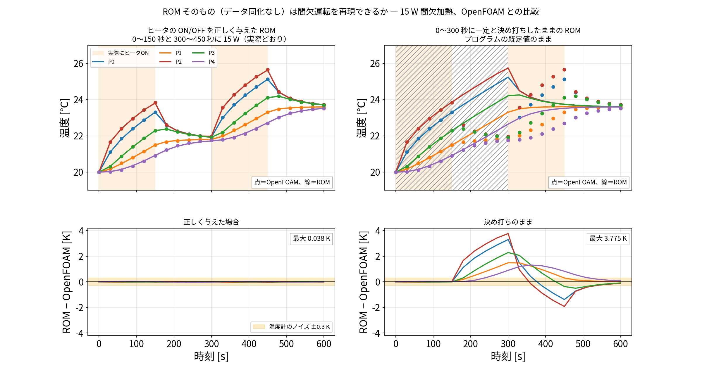
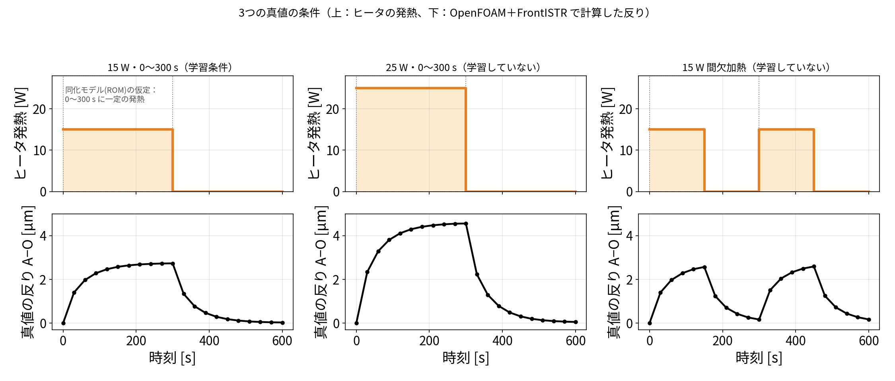
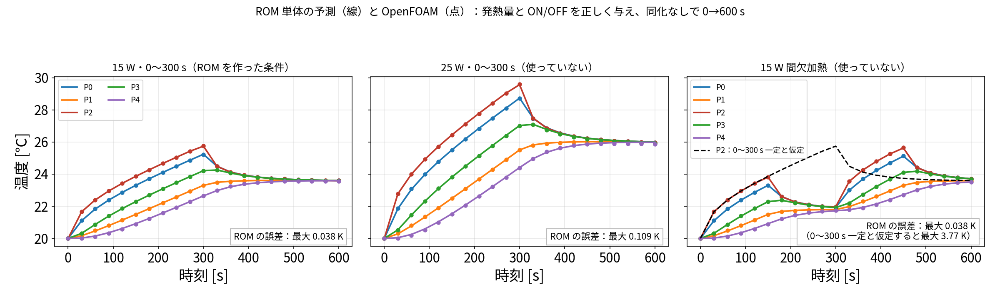
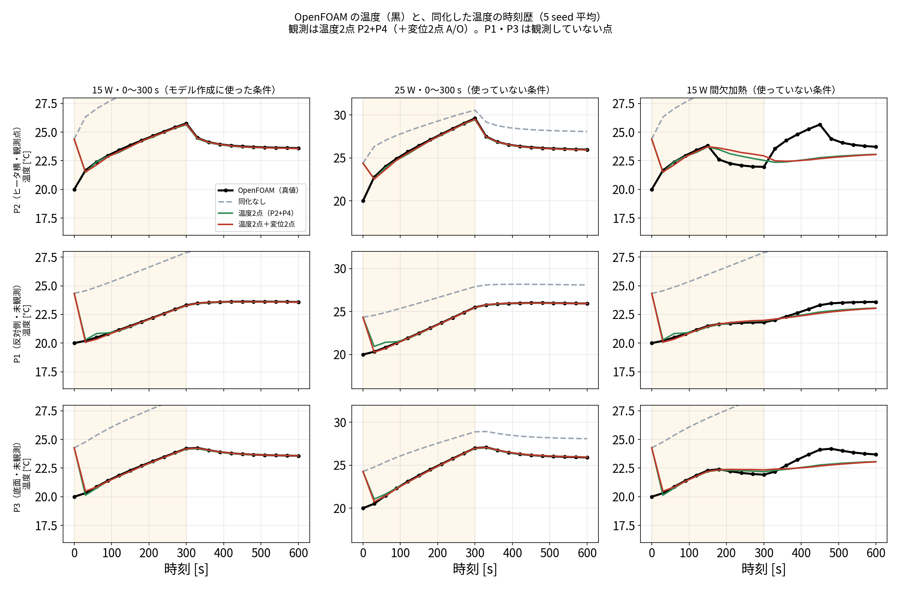
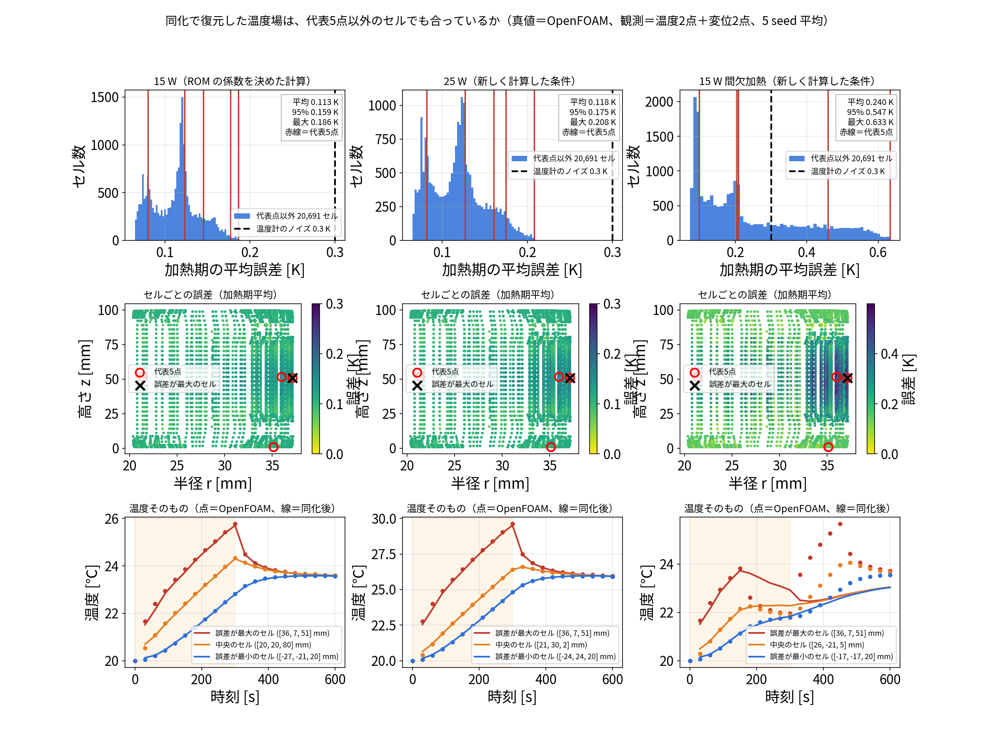
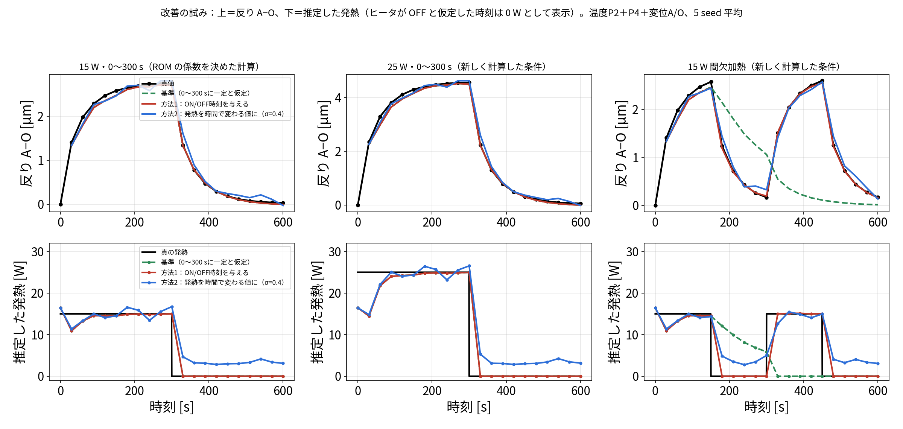
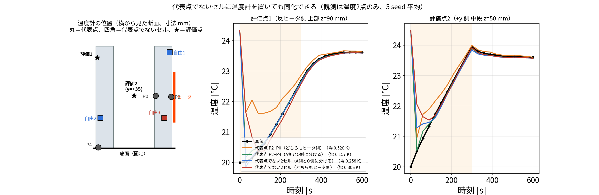

# blog_007：作った ROM はどこまで使えるか ― 適用範囲を実計算で確かめる

[blog_004](blog_004_pod_selected_rom.md) で、OpenFOAM の計算1本から **5点の熱回路モデル（ROM）** を作りました。
600 秒の計算が 31 ms で終わる軽いモデルですが、当然こう思います。

> **この ROM は、作ったときと違う条件でも使えるのか？**

この記事は、その問いに実際の計算で答えた記録です。
「確かめた」と書いたものはすべて計算した結果で、確かめていないものは「未確認」と明記しています。

## この記事で確かめること

| | 内容 |
|---|---|
| **確かめたいこと** | [blog_004](blog_004_pod_selected_rom.md) で作った ROM（5点の熱回路モデル）は、**係数を決めたときと違う条件でも使えるのか**。使えるなら何が変わっても大丈夫で、何が変わると作り直しが要るのか |
| **2つの問いを分ける** | **問い A**：ROM そのもの（同化なし）が OpenFOAM を再現できるか／**問い B**：その ROM で少数のセンサから同化できるか（§2） |
| **真値（正解）** | **OpenFOAM で新しく計算した温度場**と、それを FrontISTR に入れた変位。ROM 同士の比較ではありません |
| **比べる3条件** | ① 15 W・0〜300 秒（ROM の係数を決めた計算）／② 25 W・0〜300 秒（新しく計算）／③ 15 W 間欠加熱＝0〜150 秒と 300〜450 秒（新しく計算） |
| **使えると判断する目安** | 誤差が**温度計のノイズ 0.3 K より小さい**こと（実際に測っても読み取れない差） |
| **同化の設定**（問い B） | 温度2点（P2＋P4）＋変位2点（A・O）、EnKF・60メンバー・30 秒ごと20回・5 seed、温度ノイズ 0.30 K、変位ノイズ 0.30 µm |
| **評価** | 加熱期 30〜300 秒の平均。温度場は**全 20,696 セル**で評価（代表5点だけではない） |

---

> **この記事で分かること**
> 1. 発熱量が変わっても（15 W → 25 W）、作り直さずに使える
> 2. 加熱のしかたが変わっても使える。ただしヒータへの入力の与え方は変える必要がある
> 3. 使えるかどうかの決め手は、**温度分布の「型」が変わるかどうか**
> 4. センサは ROM の代表5点に置かなくてよい
>
> 関連記事：ROM の作り方は [blog_004](blog_004_pod_selected_rom.md)、同化の手順は [blog_006](blog_006_temp2_disp2_step_by_step.md)、センサの置き場所は [blog_005](blog_005_optimal_sensor_placement.md)。

---

## 0. この記事の前提 ― ROM は OpenFOAM の計算1本から作った

ROM（5点の熱回路モデル）は、物性値を積み上げて作ったのではありません。
**OpenFOAM で1回計算した結果に合うように、係数を逆算して作りました。**

その1回が、**ヒータ 15 W を 0〜300 秒入れ、300〜600 秒は切る**という計算です。
この結果を見ながら、POD の型・代表5点・ROM の係数・温度→変位の行列を決めました。

### この記事で比べる3つの計算

ROM を作ったあと、**別の条件で OpenFOAM を新しく計算し直して**、ROM と比べます。

| 呼び方 | ヒータ | ROM の係数を決めるときに見たか |
|---|---|---|
| **15 W・0〜300 秒** | 15 W を 0〜300 秒 | **見た**（この結果から ROM を作った） |
| **25 W・0〜300 秒** | 発熱量だけ 25 W に変更 | **見ていない**（この記事のために新しく計算） |
| **15 W 間欠加熱** | 0〜150 秒と 300〜450 秒に 15 W | **見ていない**（同上） |

### なぜ分けるのか

**15 W・0〜300 秒で合うのは当たり前**です。その結果に合わせて係数を決めたのですから、
合わなければ作り方が間違っています。

知りたいのは「**係数を決めるときに見ていない条件でも合うか**」です。
合えば実際の運転で使える見込みがあり、合わなければその条件では作り直しが要ります。

以下、表や図では次のように書きます。

- 「15 W（ROM の係数を決めた計算）」
- 「25 W（新しく計算した条件）」「間欠加熱（新しく計算した条件）」

---

## 1. 結論

### 一言でいうと

> **熱源の位置と形状が同じなら、この ROM はそのまま使えます。**
> 発熱量が変わっても、加熱のしかた（いつ入れて切るか）が変わっても、作り直しは要りません。
> ただし**加熱のしかたが変わる場合は、「いつヒータが入っているか」をモデルに教える**必要があります。
> **熱源の位置・形状・材料が変わったら作り直し**です。

### 判定の目安

ROM が「使えている」かどうかは、次の2つで判断しました。

| 見るもの | 使えると判断する目安 | なぜその目安か |
|---|---|---|
| **ROM 単体の誤差**（同化なし、発熱量を正しく与えた場合） | **温度計のノイズ 0.3 K より小さい** | 実際にセンサで測っても、その差は読み取れないため |
| **同化した後の温度場の誤差** | **0.3 K より小さい**（代表点以外も含む） | 同上 |

### 条件ごとの判定

| 条件が変わったとき | 使えるか | 根拠 |
|---|---|---|
| **発熱量**が変わる（15 W → 25 W） | **使える**（作り直し不要） | ROM 単体の誤差 0.11 K、同化すると温度場 0.14〜0.15 K、発熱量も 24.9〜25.1 W と推定（§5） |
| **加熱のしかた**が変わる（間欠加熱） | **ROM そのものは使える**（§2）。データ同化では、ヒータへの入力の与え方を変える必要がある | ON/OFF を正しく与えれば ROM 単体の誤差 0.038 K（作った条件と同じ）。同化でも反りの誤差 0.08 µm（§7） |
| 25 W より大きく外れた発熱量 | **未確認** | 同化まで回したのは 25 W だけ |
| 別の加熱のしかた（ランプ状、30 秒より短い ON/OFF など） | **未確認** | 試したのは間欠加熱1通り |
| 600 秒より長い運転 | **一部だけ確認** | 5,000 秒の試験はあるが、真値も ROM（§8） |
| **熱源の位置**が変わる | **作り直しが必要**（試していない） | 温度分布の「型」そのものが変わるため |
| **形状・メッシュ**が変わる | **作り直しが必要** | 型が 20,696 セルに結び付いているため |
| 温度分布の**型（モード）**そのものが大きく変わる | **使えない**（型を作り直す） | 型は固定で、変えられるのは混ぜ具合だけ（§9） |
| 周囲温度・取り付け（拘束）条件が変わる | **未確認** | ROM は気温 20 ℃、底面固定で作った |
| **観測点を代表5点以外にしたい** | **できる**（作り直し不要） | 代表点でない2セルでも同化できた（§10） |
| 代表5点**以外**のセルの温度も合うか | **合う** | 全20,696セルで誤差 0.3 K 未満（15 W・25 W）。代表点以外のほうがむしろ小さい（§6） |

---

## 2. まず押さえる ― ROM そのものと、データ同化は別の話

この記事では2つの問いを扱います。混ざりやすいので、先に分けておきます。

| | 問い | 何を見るか |
|---|---|---|
| **問い A** | **ROM そのもの**（モデル単体）は、この条件を再現できるか | 発熱量と ON/OFF を**正しく与えて**、同化なしで 0→600 秒を一気に計算し、OpenFOAM と比べる |
| **問い B** | その ROM を使った**データ同化**は、少ない観測から温度場を推定できるか | 発熱量は**分からないものとして**推定しながら、センサ数本で同化する |

**問い A は「モデルとして正しいか」、問い B は「実際に使えるか」**です。

### 問い A の答え（先に書きます）

> **ROM そのものは、間欠運転にも使えます。** 発熱量を変えても使えます。

理由はモデルの式にあります。

$$
C_i\frac{dT_i}{dt}=\sum_j K_{ij}(T_j-T_i)+P_i(t)-h\,(T_i-T_\mathrm{air})
$$

- 左辺と右辺の第1項・第3項（熱容量、熱の通りやすさ、放熱）は、**時間にも発熱量にもよらない定数**です。
- 加熱のしかたが入るのは **$P_i(t)$ （ヒータの発熱）だけ**です。
- つまり、 $P_i(t)$ に正しい時間変化を入れさえすれば、**どんな加熱パターンでも計算できます**。ON/OFF を何回繰り返しても、途中で大きさを変えても構いません。

### グラフで確かめる（同化なし）

OpenFOAM で新しく計算した間欠加熱（0〜150 秒と 300〜450 秒に 15 W）と、ROM を直接比べます。
**データ同化は一切していません。** 発熱量と ON/OFF を与えて、ROM を 0→600 秒まで一気に計算しただけです。



*点＝OpenFOAM、線＝ROM。左＝ヒータの ON/OFF を正しく与えた場合、右＝「0〜300 秒に一定」と決め打ちしたまま。
下段はその差で、帯は温度計のノイズ ±0.3 K。*

| ヒータへの入力の与え方 | ROM 単体の誤差（5点の最大） | 誤差の平均 |
|---|---:|---:|
| **正しい ON/OFF を与える** | **0.038 K** | 0.013 K |
| 0〜300 秒に一定と仮定したまま | 3.775 K | 0.699 K |

- **左**：5点とも、線（ROM）が点（OpenFOAM）にぴったり重なっています。150 秒でヒータを切って温度が下がり、300 秒で入れ直して上がる動きを、**そのまま再現しています**。誤差は最大 0.038 K で、温度計のノイズ（±0.3 K の帯）の中に完全に収まります。この値は、ROM の係数を決めるのに使った 15 W・0〜300 秒の計算と**まったく同じ精度**です。
- **右**：150 秒以降、ROM（線）だけが上がり続けて、OpenFOAM（点）から離れていきます。ROM の中では「まだヒータが入っている」ことになっているからです。300 秒で今度は ROM が切れるので、逆に下回ります。

**ROM そのものは間欠運転を再現できます。** 右で外れているのは、モデルの能力ではなく、与えた入力が実際と違うからです。

### では、何が問題だったのか

これまで「間欠加熱では合わない」と書いていたのは、**モデルの限界ではなく、プログラムの決め打ち**でした。

`dacore/rom_general.py` のヒータ関数が

```python
HEATER_RATED_W = 15.0
HEATER_ON_S    = 300.0        # ← 「0〜300秒だけ発熱」と決め打ち

def heater_power_W(t, q_scale=1.0):
    return np.where(np.asarray(t) < HEATER_ON_S, q_scale * HEATER_RATED_W, 0.0)
```

となっていて、「0〜300 秒だけ発熱する」と書き込まれていました。
間欠加熱のときは、この関数が実際と食い違うので外れます。**ヒータの関数を差し替えれば解決します**（§7 の方法1）。

> **まとめ**
> - **ROM そのもの（問い A）：間欠運転に使える。** 式の構造上、加熱パターンを選びません。
> - **データ同化（問い B）：ヒータの ON/OFF をモデルに教える必要がある。** 教えれば同じ精度、教えないと誤差は約10倍。

---

## 3. ROM は何から作ったか

ROM は、**OpenFOAM の計算1本**（15 W を 0〜300 秒加熱し、300〜600 秒は自然に冷やす）から作りました。

| 部品 | 何を決めたか | その1本の計算から作ったか | 条件が変わると |
|---|---|---|---|
| POD の型（モード） $U_r$ | 温度分布の「型」5つ（20,696 セル × 5） | 0〜600 秒の 121 時刻から | 熱源の位置・形状が変わると作り直し |
| 代表5点（Q-DEIM） | 測る・計算する5点 P0〜P4 | 上の型から | 型と同じ |
| ROM の係数 | 熱容量 $C_i$ 、点どうしの熱の通りやすさ $K_{ij}$ 、放熱 $h$ | 5点の温度履歴に合わせて校正 | 物性・形状・放熱の条件が変わると作り直し |
| 変位の写像 $D$ | 型ごとの FrontISTR の変位 | 型を FrontISTR に入れて6回計算 | 型・拘束条件が変わると作り直し |
| ヒータへの入力 | 「ヒータ点（P2）に $q\times15$ W、0〜300 秒だけ」 | 決め打ち | **加熱のしかたが変わると、ここを変える**（§6） |

ROM の式は次のとおりです。

$$
C_i\frac{dT_i}{dt}=\sum_j K_{ij}(T_j-T_i)+P_i(t)-h\,(T_i-T_\mathrm{air})
$$

（ $P_i(t)$ はヒータの発熱。ヒータ点 P2 だけに入る）

**発熱量と加熱のしかたは、右辺のヒータの項 $P_i(t)$ にしか入っていません。** 熱容量・熱の通りやすさ・放熱の部分は、発熱量にも加熱のしかたにもよりません。これが、§4・§5 で作り直さずに使えた理由です。

---

## 4. 確かめに使った条件

真値はすべて、OpenFOAM で計算した温度場と、それを FrontISTR に入れて計算した変位です。25 W と間欠加熱は、この確認のために新しく計算しました（`openfoam/limit/`）。



*上：ヒータの発熱。下：OpenFOAM＋FrontISTR で計算した反り A−O。*

---

## 5. 発熱量が変わる場合（25 W）

### ROM 単体（同化なし）の予測



*上：点＝OpenFOAM、線＝ROM（同化なし、0→600 秒を一気に計算）。下：その差。
帯は温度計のノイズ ±0.30 K の幅。*

**どの程度使えるか**を、この図の下段で判断できます。

| 条件 | 最大の温度上昇 | ROM の誤差（5点の最大） | 誤差の平均 | 温度上昇に対する比 | 温度計のノイズ 0.3 K との比 |
|---|---:|---:|---:|---:|---:|
| 15 W（ROM の係数を決めた計算） | 5.8 K | 0.038 K | 0.011 K | 0.7 % | **約 1/8** |
| **25 W**（新しく計算した条件） | 9.6 K | **0.109 K** | 0.026 K | **1.1 %** | **約 1/3** |
| 間欠加熱（ON/OFF を与える） | 5.7 K | 0.038 K | 0.013 K | 0.7 % | 約 1/8 |

- **どの条件でも、ROM の誤差は温度計のノイズ（±0.3 K）の帯に完全に収まっています。**
  実際にセンサで測っても、この差は読み取れない水準です。
- 25 W でも、上段の線（ROM）は点（OpenFOAM）にほぼ重なっています。
- 誤差は 0.038 K から 0.109 K へ約3倍に増えましたが、温度上昇が 5.8 K から 9.6 K に増えたぶんを考えると、**温度上昇に対する比は 0.7 % → 1.1 %** とわずかな増加です。
- 増えた理由は、空気への放熱（自然対流）が温度差で強さが変わるのに、ROM は一定の係数で近似しているためと考えています（確かめてはいません）。

> **判断**：この題材では、ROM 単体の予測は **OpenFOAM の代わりとして使える水準**です。
> 600 秒の計算が 31 ms で終わり、誤差は温度計のノイズ以下だからです。
> ただし、これは同化なしで発熱量と ON/OFF を**正しく与えた場合**の話です。実際には発熱量は分からないので、同化でそれを推定します（§4 の下の表）。

### 温度分布の型

POD の5つの型で 25 W の温度場全体を表したときの誤差は **0.003 K** でした（15 W では 0.0007 K）。固体の熱伝導は発熱量に比例するので、温度分布の形はほぼ同じで、大きさだけが変わるためです。

### 同化すると（温度 P2＋P4 ＋ 変位 A・O、5 seed 平均、30〜300 秒）

| 条件 | 温度場全体の誤差 | 反り A−O の誤差 | 推定した発熱量 |
|---|---:|---:|---:|
| 15 W | 0.13 K | 0.16 µm | 15.10 W |
| **25 W** | **0.14 K** | **0.17 µm** | **25.07 W** |

ROM 単体で増えた誤差は、同化で補正されてほとんど差がなくなりました。発熱量は同化で毎回推定しているので、ROM を作ったときの 15 W に縛られません。

### 同化した温度を、OpenFOAM の温度と時刻歴で比べる



*黒＝OpenFOAM（真値）、灰の破線＝同化なし、緑＝温度2点（P2＋P4）、赤＝温度2点＋変位2点。
行は点（P2 は観測点、P1・P3 は**観測していない点**）、列は条件。*

- **15 W（左列）と 25 W（中列）**：緑も赤も黒にほぼ重なっています。**観測していない P1・P3 まで合っています。**
  灰の破線（同化なし）は 3〜5 ℃ 高いままで、同化が効いていることが分かります。
- **25 W（中列）** は ROM を作るのに使っていない条件ですが、15 W と同じように合っています。
- **間欠加熱（右列）**：150 秒まではよく合いますが、**その後ずれます**。
  黒は 300 秒で再び加熱されて上がりますが、緑も赤も上がりません。
  ROM が「0〜300 秒に一定の発熱」と仮定しているため、2回目の加熱を予測できないからです（§5 で改善します）。

（詳細：[研究の優位性を確かめる追加検証](21_advantage_verification.md) ②）

---

## 6. 復元した温度場は、代表5点以外でも合っているか

ROM は5点の温度しか追いかけません。そこから POD で 20,696 セル全体を復元します。
では、**復元した温度は代表5点以外のセルでも合っているのか**を、全セルで確かめました（`run/check_all_cells_after_da.py`）。

真値は OpenFOAM の温度場そのものです。観測は温度2点（P2＋P4）＋変位2点（A/O）、5 seed 平均です。



*上：全セルの誤差のヒストグラム（青＝代表点以外の 20,691 セル、赤い縦線＝代表5点、破線＝温度計のノイズ 0.3 K）。
中：セルごとの誤差を半径・高さで見た分布（赤丸＝代表5点、×＝誤差が最大のセル）。
**下：温度そのものの時刻歴**（点＝OpenFOAM、線＝同化後）。誤差が最大・中央・最小のセルを1つずつ選んで描いた。*

### 結果

| 条件 | 全セルの平均 | 95%点 | 最大 | 代表5点の平均 | **代表点以外の平均** | 0.3 K 未満のセル |
|---|---:|---:|---:|---:|---:|---:|
| 15 W（ROM の係数を決めた計算） | 0.113 K | 0.159 K | 0.186 K | 0.142 K | **0.112 K** | **100 %** |
| 25 W（新しく計算した条件） | 0.118 K | 0.175 K | 0.208 K | 0.150 K | **0.118 K** | **100 %** |
| 間欠加熱（新しく計算した条件） | 0.240 K | 0.547 K | 0.633 K | 0.321 K | 0.240 K | 69.8 % |

（加熱期 30〜300 秒の平均誤差）

### 読み取れること

1. **代表点以外のほうが、むしろ誤差が小さい。**
   15 W では代表5点 0.142 K に対し、代表点以外は 0.112 K でした。25 W でも同じ傾向です。
   代表5点はヒータの近くや底面など**温度変化が大きい場所**に選ばれているので、誤差もそこで大きくなります。
   「測った点だけ合って、ほかは合っていない」という心配は**不要**でした。

2. **15 W と 25 W では、20,696 セルすべてが温度計のノイズ（0.3 K）より小さい誤差に収まりました。**
   最大でも 0.186 K・0.208 K です。中段の分布図を見ても、色が一様で、特定の場所だけ大きく外れるということはありません。

3. **間欠加熱だけは合いません。** 誤差が 0.3 K を超えるセルが 30 % あり、最大 0.633 K です。
   下段の時間変化を見ると、**300 秒以降（2回目の加熱）で誤差が 3 K 近くまで跳ね上がっています**。
   ROM が「0〜300 秒に一定の発熱」と仮定しているためで、§6 の方法で改善できます。

4. **下段を見ると、同化後の線（線）が OpenFOAM（点）にほぼ重なっています。** 15 W と 25 W では、誤差が最大のセル（ヒータ横 (36, 7, 51) mm）でも、加熱から冷却まで線と点が離れません。
   間欠加熱だけは、300 秒以降で線が点から大きく離れます（2回目の加熱を予測できないため）。

> **結論**：ROM の係数を決めた計算の条件でも、発熱量を変えた条件でも、**復元した温度場は全セルで温度計のノイズより小さい誤差**でした。
> 代表点以外も合っています。合わないのは、加熱のしかたがモデルの仮定と違う場合だけです。

---

## 7. 加熱のしかたが変わる場合（間欠加熱）

### ROM 単体（同化なし）の予測

上の図の右が間欠加熱です。

| ヒータへの入力の与え方 | ROM の誤差（5点の最大） |
|---|---:|
| **正しい ON/OFF（0〜150 秒と 300〜450 秒）を与える** | **0.038 K**（作った条件と同じ） |
| 0〜300 秒に一定と仮定したまま | 3.77 K（黒の破線） |

**ROM そのものは間欠加熱でも正しく予測できます**（誤差 0.038 K ＝ ROM を作った条件と同じ、温度計のノイズの約 1/8）。外れたのは、ヒータへの入力を 0〜300 秒に決め打ちしていたときだけで、そのときは 3.77 K ＝ ノイズの 12 倍にもなりました。

### 同化すると（反り A−O の誤差、30〜600 秒の平均）



| ヒータへの入力の与え方 | 想定している場面 | 反りの誤差 |
|---|---|---:|
| 0〜300 秒に一定と仮定 | ― | 0.91 µm |
| **ON/OFF 時刻を与える** | 主軸・モータを「いつ回したか」が NC 装置から分かる | **0.08 µm** |
| **発熱を時間で変わる値として推定**（σ=0.4） | ON/OFF 時刻も分からない | **0.18 µm** |
| （参考）従来の回帰式 | ― | 0.30 µm |

- ON/OFF 時刻が分かれば、ROM を作った条件と同じ精度です。
- 分からなくても、回帰式より小さい誤差でした。ただし、推定した発熱量はヒータを切った後も 3〜4 W 残るので、発熱量そのものを知りたい場合はそのまま使えません。σ=0.4 は、この3条件の結果を見て選んだ値です。

（詳細：[研究の優位性を確かめる追加検証](21_advantage_verification.md) ④）

---

## 8. 長い時間の場合

放熱 $h$ を推定できるかを、5,000 秒まで延ばして調べた試験があります（[研究レビュー](19_research_advantage_and_validation.md)）。 $h$ の推定誤差（3 seed 平均）は、600 秒で 56.7 %、5,000 秒で 1.30 % でした。

ただし、この試験の**真値は ROM そのもの**です。600 秒を超える OpenFOAM の計算は行っていないので、**長い時間で ROM 自体が OpenFOAM と合うかは未確認**です。

---

## 9. 使えるかどうかの決め手 ― 温度分布の「型」が変わるかどうか

ROM が使えるかどうかは、**新しい条件の温度分布が、作ったときの5つの型（モード）の組み合わせで表せるか**で決まります。

$$
T(t)\approx\bar T+U_r\,a(t)
$$

型 $U_r$ は固定で、変えられるのは混ぜ具合 $a(t)$ だけです。そのため、

- **型の組み合わせで表せる変化**（全体が強く温まる、温まり方の時間変化が違う）→ $a(t)$ が変わるだけなので**使える**
- **型そのものが変わる変化**（熱い場所が別の場所に移る、新しい形の温度分布が出る）→ $a(t)$ をどう変えても表せないので**使えない**

### 確かめ方：型で表したときに残る誤差

新しい条件の温度場（OpenFOAM の 20,696 セル全体）を、5つの型の組み合わせで最も近く表したときに残る誤差を計算しました（30〜600 秒の平均）。

| 条件 | 型で表したときに残る誤差 | 判定 |
|---|---:|---|
| 15 W（ROM を作った条件） | 0.0007 K | 型で表せる |
| 25 W | 0.0029 K | 型で表せる（温度上昇 9.6 K に対して 0.03 %） |
| 間欠加熱 | 0.0019 K | 型で表せる |

（`run/limit_realsolver_truth.py` の「近似の誤差」。温度場全体の RMSE）

25 W も間欠加熱も、**型はほとんど変わっていません**。変わったのは混ぜ具合 $a(t)$ と、ヒータへの入力だけでした。だから作り直さずに使えました。

### 型が大きく変わると考えられる場合（未確認）

| 場合 | なぜ型が変わるか |
|---|---|
| 熱源の位置・数が変わる | 熱い場所そのものが変わる |
| 冷却のしかたが変わる（ファン、クーラント） | 冷える場所と冷え方の分布が変わる |
| 温度差が非常に大きくなる | 自然対流の強さが場所ごとに変わり、温度分布の形が変わる可能性がある |
| 形状・接触状態が変わる | 熱の通り道が変わる |

これらは試していません。試すには、その条件で OpenFOAM を計算し、上の「型で表したときに残る誤差」を見れば判定できます。誤差が大きければ、その条件の計算を加えて型を作り直す必要があります。

### 実際の運転中に気づけるか（未実施）

運転中は温度場全体が分からないので、上の誤差は直接計算できません。考えられるのは、同化に使わない確認用のセンサを1本置き、その点の推定値と測定値のずれが急に大きくなったら「型が合わなくなった」と判断する方法です。**試していません。**

---

## 10. 観測点は ROM の代表5点に限られるか

**限られません。** 温度計も変位計も、好きな場所に置けます。

### なぜか

ROM が計算で追いかける状態は代表5点の温度ですが、**どのセルの温度も5点の温度の一次式で書けます**（gappy-POD 復元）。

$$
T_j=\bar T_j+\psi_j\,U_{rP}^{+}\,\big(T_P-\bar T_P\big)
$$

（ $\psi_j$ は $U_r$ の $j$ 行目＝セル $j$ の行ベクトル、 $T_P$ は代表5点の温度）

これを観測演算子として使えば、代表点でないセルに置いた温度計もそのまま同化に入れられます。
変位も同じで、FrontISTR で $D$ を作り直せば、どの節点の変位でも観測にできます。

**実際、変位の観測点はすでに代表点ではありません。**

| 観測・評価 | 場所 | 代表5点か |
|---|---|---|
| 温度 P2・P0 | ROM の代表点 | はい |
| 変位 A・O（観測） | 上面 (±28, 0, 100.5) mm | **いいえ**（FEM 節点） |
| 変位 B・C（評価、§7-4b の holdout） | 中段 z=75 mm | **いいえ** |
| 温度場の評価 | 全 20,696 セル | **いいえ** |

### どこに置いたか



*左：温度計の位置（横から見た断面）。丸＝代表点、四角＝代表点でないセル、★＝どの配置でも観測していない評価点。
中・右：評価点の温度が同化でどう合うか（5 seed 平均、黒＝真値）。*

| 記号 | 座標 [mm] | 代表点か |
|---|---|---|
| P2 | (36.5, 6.9, 50.8) | 代表点（ヒータ側） |
| P0 | (21.3, −1.6, 51.6) | 代表点（ヒータ側） |
| P4 | (−35.1, 0.8, 0.8) | 代表点（反対側の底面） |
| **自由1** | (35.1, −0.8, 94.6) | **代表点でない**（ヒータ側の上部） |
| **自由2** | (−32.9, −1.6, 29.7) | **代表点でない**（反対側の下部） |
| **自由3** | (29.8, −1.6, 29.7) | **代表点でない**（ヒータ側の下部） |
| 評価1・評価2 | (−37.5, 0, 90)、(0, 35.5, 50) | どの配置でも観測していない |

### 確かめた結果

代表点でないセルに温度計2本を置いて同化しました（温度のみ、変位なし。EnKF・5 seed 平均・加熱期30〜300秒。`run/obs_points_not_limited_to_rom.py`）。

| 温度計2本の場所 | 座標 [mm] | 温度場全体の誤差 | 推定した発熱量 |
|---|---|---:|---:|
| 代表点 P2＋P0（どちらもヒータ側） | (36.5, 6.9, 50.8)、(21.3, −1.6, 51.6) | 0.528 ± 0.198 K | 14.05 W |
| 代表点 P2＋P4（A側とO側に分ける） | (36.5, 6.9, 50.8)、(−35.1, 0.8, 0.8) | **0.157 ± 0.033 K** | 14.72 W |
| **代表点でない2セル**（A側とO側に分ける） | (35.1, −0.8, 94.6)、(−32.9, −1.6, 29.7) | **0.258 ± 0.058 K** | 14.90 W |
| **代表点でない2セル**（どちらもヒータ側） | (35.1, −0.8, 94.6)、(29.8, −1.6, 29.7) | 0.306 ± 0.047 K | 15.61 W |

- **代表点でなくても同化できます。** 代表点でない2セル（0.258 K）は、代表点 P2＋P0（0.528 K）より良い結果でした。
- 上の図の中央を見ると、**観測していない評価点1（反ヒータ側の上部）の温度**が、青（代表点でない2セル・両側）では黒の真値にほぼ重なり、橙（代表点 P2＋P0・片側）だけが加熱の前半で 0.5 K ほど外れています。
- 効いているのは代表点かどうかではなく、**A側とO側に分かれているか**です（§[blog_005 §4-6](blog_005_optimal_sensor_placement.md) と同じ傾向）。
- ただし、いちばん良いのは代表点 P2＋P4（0.157 K）でした。代表点は復元に都合のよい点なので、同じ「両側に分ける」配置なら代表点のほうが有利でした。

### 注意（未確認）

- 試したのは4通りだけで、系統的には調べていません。
- 代表点から大きく外れた場所（型がほとんど出ないセル、§7 の行ベクトルが短いセル）ばかりに置いた場合は確かめていません。復元がうまくいかない可能性があります。
- 真値は ROM の双子実験です。

### 実務上の意味

**センサは「置ける場所」に置けます。** ROM の代表点に合わせて穴を開けたり、治具を作ったりする必要はありません。置いた場所の座標が分かっていれば、その点の観測演算子を作れます。

---

## 11. 作り直しが必要なもの

| 変わるもの | 理由 | 作り直す手順 |
|---|---|---|
| 熱源の位置・数 | 温度分布の型が変わる。ROM のヒータ点も変わる | OpenFOAM（CHT）→ POD → Q-DEIM → ROM 校正 → FrontISTR で $D$ |
| 形状・メッシュ | 型が 20,696 セルに結び付いている | 同上 |
| 拘束条件（固定のしかた） | 変位の写像 $D$ が変わる | FrontISTR で $D$ を作り直す（6回） |
| 材料（熱伝導率・熱容量） | ROM の係数が変わる | OpenFOAM → ROM 校正 |

手順はすべてスクリプト化してあります（`run/select_points_qdeim.py`、`run/run_da_compare.py` など）。ただし、OpenFOAM の計算に1本あたり約1〜3時間かかります。

---

## 12. 未確認のこと

- 25 W 以外の発熱量での同化（特に大きく外れた場合）
- ランプ状に変わる発熱、30 秒より短い間隔の ON/OFF（同化の更新間隔より速い変化）
- 600 秒を超える運転での ROM 自体の精度（OpenFOAM との比較）
- 周囲温度が変わる場合（ROM は気温 20 ℃ で作った）
- 実機での精度（すべて計算で作った真値）
- 代表点から大きく外れた場所だけに温度計を置いた場合（§8）

---

## 13. 使ったスクリプト

| 内容 | スクリプト | 結果 |
|---|---|---|
| ROM 単体と OpenFOAM の比較（§4・§5 の図） | `run/make_rom_applicability_fig.py` | `results/rom_applicability.json` |
| 実ソルバを真値にした同化（§4） | `run/limit_realsolver_truth.py` | `results/limit_realsolver_<条件>.json` |
| 加熱のしかたの改善（§6） | `run/improve_heating_schedule.py` | `results/improve_heating_schedule.json` |
| 復元した温度場が全セルで合うか（§6） | `run/check_all_cells_after_da.py` | `results/check_all_cells_after_da.json` |
| 観測点は代表5点に限られるか（§10） | `run/obs_points_not_limited_to_rom.py` | `results/obs_points_not_limited_to_rom.json` |
| 25 W・間欠加熱の OpenFOAM 計算 | `openfoam/limit/q25`、`openfoam/limit/intermittent`（リポジトリには含めていない） | ― |
