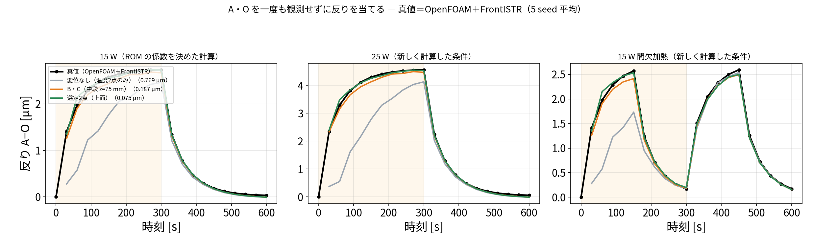
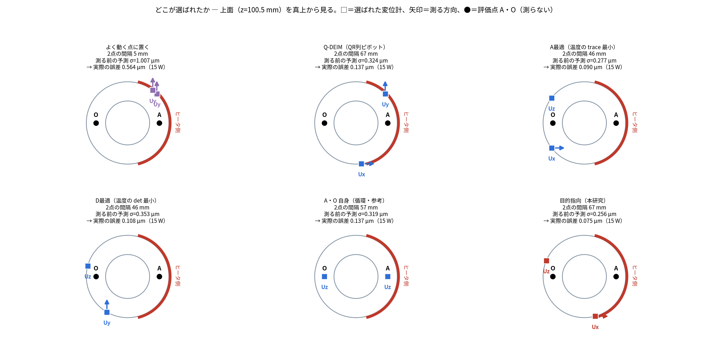
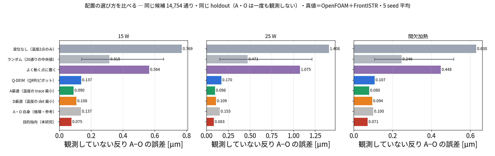

# blog_008：本研究の主張 ―「温度だけでなく変位もデータ同化の観測に使う」

更新日：2026-10-03

これまでの記事で、温度2点に変位2点を足すと推定が良くなることを示してきました。
この記事は、**それが研究の主張として成り立つのか**を、先行研究を調べたうえで整理したものです。

> **この記事は、本研究の「主張」と「先行研究との関係」をまとめた記事です。**
> 計算の中身は [blog_006](blog_006_temp2_disp2_step_by_step.md)（同化の手順）、
> [blog_007](blog_007_rom_applicability.md)（ROM の適用範囲）にあります。
> **工作機械の研究全体の中でどこに位置するか**は §6 です。

> **blog_006〜008 の役割分担**
>
> | 記事 | 扱うこと | 真値 |
> |---|---|---|
> | [blog_006](blog_006_temp2_disp2_step_by_step.md) | **同化の手順**。温度2点＋変位2点をどう使い、なぜ発熱量が直るか | ROM の双子実験 |
> | [blog_007](blog_007_rom_applicability.md) | **ROM の適用範囲**。条件が変わっても使えるか | **OpenFOAM＋FrontISTR** |
> | [blog_008](blog_008_novelty_displacement_assimilation.md) | **主張と先行研究**。研究としてどこが新しいか | ROM の双子実験 |
>
> 数値は重複を避け、各記事が担当する検証だけを載せています。

## この記事で確かめること

| | 内容 |
|---|---|
| **確かめたいこと** | 「温度だけでなく**変位も観測としてデータ同化に入れる**」ことが、研究の主張として成り立つか。先行研究にないか、そして実際に効果があるか |
| **検証1（§4）** | **同じ場所**に温度計を置くか変位計を置くかで差が出るか。センサの本数（4本）と場所をそろえ、**測る量だけ**を変える |
| **検証2（§5）** | 評価点 A・O を**一度も観測せず**、別の場所の変位2点だけで A・O の変形を当てられるか（[blog_004 §7-4](blog_004_pod_selected_rom.md) の循環を断つ） |
| **真値（正解）** | ROM で作った模擬データ（双子実験）。実機ではありません |
| **共通の観測** | 温度2点（P2・P0）。ここに変位2点を足したり、場所を変えたりする |
| **ノイズ** | 温度 0.30 K、変位 0.30 µm |
| **同化の設定** | EnKF・60メンバー・30 秒ごと20回・seed 20260913〜17 の5回平均 |
| **評価** | 加熱期 30〜300 秒の平均。全 20,696 セルの温度、反り $U_z(A)-U_z(O)$ 、個別の $U_z(A)$ ・ $U_z(O)$ |
| **文献調査の範囲** | 2026-10-03 に英語5回・日本語1回の検索。**網羅的ではありません**（§3） |

---

> **この記事の結論**
> 1. 工作機械の熱変形補正では、**温度を観測して変位を推定する**か、**変位を直接測って補正する**かのどちらかが一般的。
> 2. **温度と変位を同時に観測としてデータ同化に入れ、温度場・発熱量まで推定した例は、調べた範囲では見当たらない。**
> 3. 手法そのもの（EnKF、POD、変位の同化）は既知。新しいのは**組み合わせ方と、工作機械の熱変形に適用した点**。
> 4. **同じ場所なら、温度計と変位計はほぼ互角**だった（§4）。変位計の価値は「情報量が多いこと」ではなく、**温度計を置けない場所に置けること**。
> 5. **別の場所で変位を測れば、一度も測っていない場所の変形を、直接測るより正確に当てられた**（0.076 µm 対 0.135 µm、§5）。

---

## 1. 主張したいこと

> **熱変形を推定したいとき、観測は温度だけでなく、変位も同化に入れたほうがよい。**
> 変位計は5点すべての温度に触れるので、温度計のない点の温度まで直り、結果として温度場も発熱量も熱変形も良くなる。
> そして**変位計は、知りたい場所に置く必要がない**。別の場所で測って、測っていない場所の変形を当てられる。

この主張を支える計算結果と、先行研究との関係を以下にまとめます。

---

## 2. 主張を支える計算 ― どこに何があるか

この記事は**主張と位置づけ**を扱います。計算の中身はそれぞれの記事にあるので、ここでは一覧だけ示します。

| 主張を支える事実 | 数値 | どの記事に |
|---|---|---|
| 変位は5点の温度の足し算なので、**変位計1本が5点すべてに触れる** | 熱感度 $W$ の行が全点に非ゼロ | [blog_006 §7-1](blog_006_temp2_disp2_step_by_step.md) |
| **温度計のない点の温度が、変位計だけで直る** | $t=30$ 秒で P3 を −4.97 K、P4 を −7.67 K | [blog_006 §7-5b](blog_006_temp2_disp2_step_by_step.md) |
| 温度計のずれが 0 になった後も、変位計だけが温度場を直す | $t=150$ 秒で温度の寄与 0.000 K | 同上 |
| **変位を足すと温度も発熱量も当たる** | 温度場 0.503 → **0.160 K**、 $Q$ 14.05 → **14.89 W**（真値 15 W） | [blog_004 §7-6](blog_004_pod_selected_rom.md)、[blog_006 §15](blog_006_temp2_disp2_step_by_step.md) |
| **係数を決めていない条件でも成立**（実ソルバ真値） | 25 W で反り 0.74 → **0.09 µm**、発熱量 **24.91 W**（真値 25 W） | [blog_007](blog_007_rom_applicability.md)、[21](21_advantage_verification.md) |
| **ROM は条件が変わっても使える** | 25 W・間欠加熱とも全セルがノイズ 0.3 K 未満 | [blog_007 §6](blog_007_rom_applicability.md) |
| **配置の選び方が既存法より良い** | 目的指向 0.075 対 A最適 0.090・D最適 0.108・Q-DEIM 0.137 µm（15 W） | §5【追加】配置法の比較 |

この記事で**新しく行った検証**は §5・§6 の2つです。

| 検証 | 知りたいこと |
|---|---|
| **§5** | 同じ場所に温度計を置いたらどうなるか（変位計は本当に有利か） |
| **§6** | A・O を一度も測らずに、別の場所の変位2点で当てられるか |

---

## 3. 先行研究の調査

2026-10-03 に、英語5回・日本語1回の検索を行いました。**網羅的な調査ではありません。**

### 3-1. 見つかった近い研究

| 研究 | 手法 | **観測に使うもの** | 変位の扱い |
|---|---|---|---|
| [ETH Zurich (2024)](https://www.research-collection.ethz.ch/entities/publication/a1ddda1a-3cd6-41ad-8590-be31b19896fb) | カルマンフィルタ＋低次元化FEM | **温度のみ**（5軸機で25本中13本） | 推定結果（出力） |
| [Teshima et al. (2024) CIRP JMST](https://doi.org/10.1016/j.cirpj.2024.10.015) | ROM＋回帰、センサ配置指針 | 温度のみ | 出力 |
| [Tekniker](https://tekniker.es/es/methodology-for-the-design-of-a-thermal-distortion-compensation-for-large-machine-tools-based-in-state-space-representation-with-Kalman-filter) | 状態空間＋カルマンフィルタ | 主軸回転数・温度 | 出力 |
| [NIST の整理](https://tsapps.nist.gov/publication/get_pdf.cfm?pub_id=957076) | 直接法／間接法の分類 | 温度（間接法）**または**変位（直接法） | 直接法は変位を測って直接補正。状態推定はしない |
| [逆熱伝導問題（EKF）](https://openbooks.itmo.ru/en/article/18553/USING_THE_EXTENDED_KALMAN_FILTER_IN_NONSTATIONARY_THERMAL_MEASUREMENT_WHEN_SOLVING_INVERSE_HEAT_TRANSFER_PROBLEMS.html) | 拡張カルマンフィルタ | 温度のみ | ― |
| [Displacement Data Assimilation](https://arxiv.org/pdf/1602.02209) | EnKF | **変位のみ**（流体分野） | 観測として使用 |
| 日本（特許・論文） | 回帰・CNN・多点温度計測（302点） | 温度のみ | 出力 |

### 3-2. いちばん近いのは ETH Zurich (2024)

| 項目 | ETH Zurich (2024) | 本研究 |
|---|---|---|
| モデル | 低次元化した FEM | POD/Q-DEIM の ROM |
| 同化 | カルマンフィルタ | EnKF |
| **観測** | **温度のみ**（25本中13本） | **温度2本＋変位2本** |
| 推定するもの | 温度場 → 熱変位 | 温度場・熱変形・**発熱量** |
| 結果 | 未観測温度 RMSE 2.7 ℃、熱変位 67.4 → 33.3 µm（実機） | 温度場 0.16 K、未観測の反り 0.081 µm（計算で作った真値） |
| 実装 | 非公開 | **オープンソースで公開** |

**手法の枠組みはほぼ同じです。** 違いは「観測に変位を入れたか」「発熱量まで推定するか」「実装が公開されているか」です。
ただし ETH は**実機**で検証しており、本研究は計算で作った真値だけです。ここは明確に劣ります。

### 3-3. 分かったこと

1. 工作機械の分野では **「温度を測って変位を出す」が標準**です。
2. 変位を測る方法（直接法）もありますが、**変位をそのまま補正に使うもので、温度場の推定には戻していません**。
3. **温度と変位を同時に観測として同化に入れた例は見つかりませんでした。**
4. 変位を観測に使う同化自体は、別分野（流体、き裂）にあります。**手法として新しいわけではありません。**

---

## 4. 【検証】同じ場所に温度計を置いたらどうなるか
> **この節で知りたいこと**：「変位計は5点すべての温度に触れるから有利」は本当か。同じ場所に温度計を置いたらどうなるか
>
> **条件**：センサの本数（計4本）と場所をそろえ、**測る量だけ**を変える。温度2点（P2・P0）は共通、A・O に温度計2本 or 変位計2本。真値＝ROM の双子実験、EnKF・5 seed・加熱期 30〜300 秒

「変位計のほうが情報量が多いから良い」のかを確かめるため、**同じ場所に温度計を置いた場合**と比べました。
センサの本数（計4本）と場所をそろえ、変えるのは「そこで何を測るか」だけです（`run/disp_vs_temp_same_place.py`）。

#### どこに何を置いたか

| 記号 | 座標 [mm] | 何を測るか |
|---|---|---|
| **P2** | (36.5, 6.9, 50.8) ヒータ側・中段 | 温度（4構成すべて共通） |
| **P0** | (21.3, −1.6, 51.6) 同じヒータ側・中段 | 温度（4構成すべて共通） |
| **A** | (28.7, 0, 100.5) 上面・ヒータ側 | 構成により **温度** または **変位 $U_z$** |
| **O** | (−28.7, 0, 100.5) 上面・反対側 | 同上 |

- **変位計**は A・O の FEM 節点そのものに置きます。
- **温度計**は A・O にいちばん近い OpenFOAM セル、(26.6, −1.6, 98.8) と (−26.6, −1.6, 98.8) mm に置きます（代表5点ではないセルですが、[blog_007 §10](blog_007_rom_applicability.md) のとおり同化できます）。
- **評価しているのも同じ A・O** なので、この節の結果は循環を含みます。循環を断った試験は §5 です。

4つの構成は次のとおりです。

| 構成 | 観測の中身 | 本数 |
|---|---|---:|
| 温度2点のみ | 温度 P2・P0 | 2 |
| ＋A/O に温度計2本 | 温度 P2・P0・**A・O**（計4点とも温度） | 4 |
| ＋A/O に変位計2本（本番） | 温度 P2・P0 ＋ **変位 A・O の $U_z$** | 4 |
| ＋両方 | 温度 P2・P0・A・O ＋ 変位 A・O | 6 |

| 観測（温度2点 P2＋P0 は共通） | 温度場全体 | 反り A−O | Uz(A) | Uz(O) |
|---|---:|---:|---:|---:|
| 温度2点のみ | 0.528 K | 0.756 µm | 0.234 µm | 0.922 µm |
| ＋ A/O に**温度計**2本 | **0.132 K** | 0.201 µm | **0.113 µm** | 0.154 µm |
| ＋ A/O に**変位計**2本（本番） | 0.145 K | **0.135 µm** | 0.138 µm | **0.104 µm** |
| ＋ 両方（計6本） | 0.127 K | 0.136 µm | 0.110 µm | 0.117 µm |

seed ごとに対応をとった勝敗（変位計が温度計より良かった回数、5回中）：

| 評価する量 | 変位計が良かった回数 |
|---|---:|
| 温度場全体 | 2 / 5 |
| **反り A−O** | **4 / 5** |
| Uz(A) | 0 / 5 |
| **Uz(O)** | **5 / 5** |

### 分かったこと（主張の修正）

- **温度場全体を当てるなら、同じ場所なら温度計と変位計はほぼ互角**です（0.132 対 0.145 K、差は seed のばらつきに埋もれる）。
- **反りを当てるなら変位計のほうが良い**（0.135 対 0.201 µm、5回中4回）。知りたい量を直接測っているためです。

> **したがって「変位計は情報量が多いから優れている」とは言えません。**
> 変位計の価値は、**温度計を置けない場所に置けること**にあります。
> 工作機械では、加工中の工具先端や内部に熱電対を入れられませんが、変位計なら外側から測れます。

> **この節で分かったこと**
> - **同じ場所なら、温度計と変位計はほぼ互角**。温度場全体では温度計がわずかに良い（0.132 対 0.145 K、差は seed のばらつき内）。
> - **反りを当てるなら変位計が良い**（0.135 対 0.201 µm、5 seed 中4回）。知りたい量を直接測っているため。
> - よって「変位計は情報量が多いから優れている」とは**言えない**。
> - 変位計の価値は、**温度計を置けない場所に置けること**にある（加工中の工具先端に熱電対は入れられない）。

---

## 5. 【検証】別の場所で変位を測って、測っていない A・O を当てる
> **この節で知りたいこと**：評価点 A・O を**一度も観測せず**に、別の場所の変位2点だけで A・O の変形を当てられるか。変位計はどこに置けばよいか
>
> **条件**：温度2点（P2・P0）は共通。変位の候補は全 5,040 節点 × 3 方向＝15,120 通り（A・O から 12 mm 以内は除外）。真値＝ROM の双子実験、EnKF・5 seed・加熱期 30〜300 秒

[blog_004 §7-4](blog_004_pod_selected_rom.md) の構成は、評価している A・O をそのまま観測に使っていました（循環）。
そこで、**A・O を一度も観測せず**、別の場所の変位2点だけで A・O を当てられるかを調べました（`run/disp_elsewhere_predict_AO.py`）。

### どこを測って、どこを評価したか

*赤＝温度センサ（P2・P0）／緑＝選定した変位2点（矢印＝測る方向）／橙＝B・C／黒＝評価点 A・O。
**A・O は一度も観測していません。***

| 役割 | 場所 | 測るもの |
|---|---|---|
| 温度センサ（共通） | P2 (36.5, 6.9, 50.8)、P0 (21.3, −1.6, 51.6) mm | 温度 |
| **選定した変位1点目** | (9.7, −36.2, 100.5) mm（上面、−y 寄り） | **$U_x$ （半径方向）** |
| **選定した変位2点目** | (−34.6, 14.4, 100.5) mm（上面、ヒータの反対側） | **$U_z$ （上下方向）** |
| B・C（比較用） | (±28, 0, 75) mm（A・O の真下、25 mm 下） | $U_z$ |
| **評価点 A・O** | (±28.7, 0, 100.5) mm（上面） | **測らない** |

### 変位の候補はどう選んだか ― 実際にやった作業

やったことは**総当たり**です。難しいことはしていません。

#### ステップ1：候補を全部リストアップする（15,120 通り）

FrontISTR を**6回だけ**回しました（平均の温度場で1回、POD のモード5つで1回ずつ）。
FEM は1回解くと**全節点の変位**が出るので、この6回で

> **全 5,040 節点 × 3 方向（x, y, z）＝ 15,120 通り**

すべてについて「5点の温度が変わると、その点のその方向の変位がどれだけ動くか」が分かります。追加の FEM 計算は要りません。

A・O から 12 mm 以内の節点は「A・O を測ったのと同じ」になるので候補から外し、**14,754 通り**が残りました。

#### ステップ2：候補を1つずつ採点する

候補を1つ取り出して、こう問います。

> **「ここに変位計を1本置いたら、反り A−O はどれくらい『はっきり』するか」**

この「はっきり度」を数値で出します。単位は µm で、**小さいほど良い**です。この記事では $\sigma$ と書きます。

| 状態 | $\sigma$ の意味 |
|---|---|
| 温度2点だけ（変位なし） | **1.186 µm**。反りの振幅が 2.74 µm なので、半分近く分かっていない |
| ある候補を1本足したあと | その候補を測ると、どこまで絞り込めるか |

これを **14,754 通りすべてについて計算**します。表計算で全行に式を入れて、最小値を探すのと同じことです。

採点に使うのは次の2つだけで、**測定値は使いません**。

| 使うもの | 中身 | どこから |
|---|---|---|
| **熱感度** | 5点の温度が 1 K 変わると、その点の変位が何 µm 動くか | FrontISTR（ステップ1で作ったもの） |
| **温度のばらつき** | 発熱量や初期温度が分からないせいで、5点の温度がどれくらい・どう連動してばらつくか | ROM を 4000 通り回して数える |

採点の式（興味がある人だけ）

$$\sigma_S^2=w^{\mathsf T}\Big(B-BH_S^{\mathsf T}(H_SBH_S^{\mathsf T}+R)^{-1}H_SB\Big)w$$

$w$ ＝反り A−O に対する5点温度の熱感度 (0.47, −0.65, 0.60, 0.04, −0.46) µm/K、
$B$ ＝5点の温度のばらつき（共分散）、 $H_S$ ＝候補 $S$ を測る演算子、 $R$ ＝センサのノイズ（0.3 µm）。
括弧の中はカルマンフィルタの更新式そのもので、「測った後に残る温度のあいまいさ」です。
それを $w$ ではさむと「残る**反りの**あいまいさ」になります。

#### ステップ3：1位を選ぶ（1点目）

14,754 通りの採点結果を小さい順に並べます。

| 順位 | 候補 | $\sigma$ |
|---|---|---:|
| **1位** | **(9.7, −36.2, 100.5) mm の $U_x$** | **0.347 µm** |
| 2位 | (9.7, **+36.2**, 100.5) mm の $U_x$ | 0.347 µm |
| 3位 | (14.4, −34.6, 100.5) mm の $U_x$ | 0.347 µm |
| …（中央値） | ― | 1.026 µm |
| 最下位 | (37.5, 0, 0) mm の $U_y$ | 1.186 µm ＝ 測らないのと同じ |

1位を採用します。これで 1.186 → **0.347 µm**。1本測るだけで3分の1以下になりました。

#### ステップ4：**採点をやり直して**、2点目を選ぶ

ここが肝心です。**2位をそのまま選んではいけません。**

2位は (9.7, **+36.2**, 100.5) で、1位とは y の符号が違うだけの**ほぼ同じ場所**です。
1点目で分かったことと同じことしか分からないので、足しても意味がありません。

そこで、**1点目を測ったことにして、14,753 通りを採点し直します**。

| 順位 | 候補 | $\sigma$ |
|---|---|---:|
| **1位** | **(−34.6, 14.4, 100.5) mm の $U_z$** | **0.256 µm** |
| 2位 | (−36.2, 9.7, 100.5) mm の $U_z$ | 0.256 µm |
| …（中央値） | ― | 0.330 µm |

0.347 → **0.256 µm**。これで2点決まりました。

#### 採点し直すと、良い場所が変わる

*左＝1点目を選ぶときの採点（色が薄いほど良い）、中＝1点目を測った前提で採点し直したとき、右＝ $\sigma$ が下がる様子。*

左と中を見比べてください。**良い場所（薄い色）が移動しています。**

| | 良い場所 | なぜ |
|---|---|---|
| 1点目のとき | 上面の ±y 側 | ヒータ側と反対側の両方の影響を受ける |
| 2点目のとき | **ヒータの反対側（−x 側）** | 1点目で分からなかった「反対側の情報」が欲しくなる |

#### まとめ

> **やったこと**：候補 14,754 通りを全部採点して1位を選ぶ。選んだら採点をやり直して、また1位を選ぶ。
>
> **考え方**：いま分かっていないことを、いちばん多く教えてくれる点を選ぶ。選んだら「何が分かっていないか」を更新して、また選ぶ。

**ここまで測定値は一切使っていません。** FrontISTR の計算と ROM の計算だけで、机上で場所が決まります。
本当に当たるかは、このあと同化を回して確かめます。

### 結果

| 変位2点をどこに置くか | **観測していない反り A−O** | **観測していない Uz(A)** | 温度場全体 |
|---|---:|---:|---:|
| 変位なし（温度2点のみ） | 0.756 µm | 0.234 µm | 0.528 K |
| A・O 自身を観測（**循環**・参考） | 0.135 µm | 0.138 µm | 0.145 K |
| B・C（中段 z=75 mm の $U_z$ ） | 0.185 µm | 0.151 µm | 0.175 K |
| **選定2点**（(9.7, −36.2, 100.5) の $U_x$ と (−34.6, 14.4, 100.5) の $U_z$ ） | **0.076 µm** | **0.103 µm** | **0.126 K** |
| 側面中段 z=50 mm の $U_x$ | 0.207 µm | 0.189 µm | 0.248 K |
| 底面近く z=5 mm の $U_z$ （悪い例） | 0.559 µm | 0.196 µm | 0.408 K |

### 分かったこと

*左＝真値、中＝温度2点だけ、右＝温度2点＋変位2点（A・O は一度も測らない）。
**色＝温度、形＝熱変形**（約4,000倍に誇張）。*

| 印 | 意味 |
|---|---|
| **●赤い球** | 温度センサ（P2・P0。3枚とも共通） |
| **■緑の立方体** | 変位計（右のパネルにだけ現れる。選定した2点） |
| **●黒い球** | 評価点 A・O（**一度も測らない**。3枚とも共通） |

（seed 20260913）

形と色で、何が起きているか一目で分かります。例えば $t=150$ 秒では

| | 反り A−O | 誤差 |
|---|---:|---:|
| 真値 | 2.57 µm | ― |
| 温度2点のみ（中） | 1.38 µm | 1.19 µm |
| **温度2点＋別の場所の変位2点（右）** | **2.56 µm** | **0.01 µm** |

- **中（温度2点のみ）**：全体が緑がかっていて、真値（左）より温度が高めに出ています。形も反りが足りません。
- **右（変位2点を足す）**：色も形も左の真値とほとんど同じです。**A・O（黒球）は一度も測っていません。**

1. **A・O を一度も測らずに、反りを 0.076 µm で当てられました。** 真値の振幅 2.74 µm に対して 2.8 % です。
2. **A・O を直接測った場合（0.135 µm）より正確です。** 測る場所を選べば、知りたい場所を測らないほうが良い結果になりました。
   - 理由は信号対雑音比と考えています。A・O の反りは最大 2.7 µm ですが、変位計のノイズは 0.3 µm あります。
     選定した点は変位がもっと大きく動くので、同じノイズでも情報が多く取れます。**この解釈は確かめていません。**
3. **置き場所で大きく変わります。** 底面近く（0.559 µm）は、変位なし（0.756 µm）から少ししか改善しません。底面は固定されていてほとんど動かないためです。
4. 選定は**同化を回す前**に、FrontISTR の熱感度と ROM で作った温度のばらつきだけで計算しています（[blog_005 §4-6](blog_005_optimal_sensor_placement.md) と同じ方法）。

> **これが本研究のいちばん強い結果だと考えています。**
> 工作機械で本当に知りたいのは工具先端の変位ですが、加工中にそこは測れません。
> **測れる場所で変位を測り、測れない場所の変形を当てる**ことを、計算で示せました。

### 【追加】実ソルバを真値にして確かめ直す（2026-10-03）

上の結果は真値も ROM の双子実験でした。**真値を OpenFOAM＋FrontISTR にして**同じ試験をやり直しました
（`run/holdout_AO_realsolver.py`）。

- 温度の真値＝OpenFOAM の固体温度場
- **変位の真値＝その温度場を各時刻 FrontISTR に入れて計算した全節点の変位**（21 時刻 × 3 条件）
- 同化モデルは ROM のまま。A・O は一度も観測しない

*黒＝真値（OpenFOAM＋FrontISTR）、灰＝変位なし、橙＝B・C、緑＝選定2点。5 seed 平均。*

**反り A−O の誤差 [µm]**（加熱期 30〜300 秒の平均）

| 変位2点をどこに置くか | 15 W | 25 W | 間欠加熱 |
|---|---:|---:|---:|
| 変位なし（温度2点のみ） | 0.769 | 1.408 | 0.630 |
| A・O 自身を観測（**循環**・参考） | 0.137 | 0.153 | 0.100 |
| B・C（中段 z=75 mm） | 0.187 | 0.193 | 0.143 |
| **選定2点（上面）** | **0.075** | **0.083** | **0.071** |
| 底面近く z=5 mm（悪い例） | 0.581 | 1.096 | 0.480 |

**ROM 真値のときと同じ結論が、実ソルバ真値でも得られました。**

1. **A・O を一度も測らずに、3条件すべてで 0.07〜0.08 µm** で当てられました。
2. **3条件すべてで、A・O を直接測る（0.10〜0.15 µm）より正確**です。
3. 係数を決めていない条件（25 W・間欠加熱）でも成立します。25 W では変位なしの 1.408 µm から **17 倍**改善しました。
4. 置き場所で大きく変わります。底面近くは 25 W で 1.096 µm と、ほとんど改善しません。

> **これで切り口B（測れない場所を、測れる場所から当てる）が、実ソルバ真値でも裏づけられました。**

### 【追加】既存の配置法と比べる（2026-10-03）

#### この節は何をしたか

変位計を**どこに置くか決める方法**を6通り用意し、**決め方だけを変えて、ほかの条件は全部そろえて**比べました。

| | |
|---|---|
| **なぜやったか** | 前の節は「選定2点」と「底面近く（悪い例）」を比べただけで、**選び方そのものが良い**という証拠になっていなかった |
| **何をしたか** | 同じ候補 14,754 通りに6つの決め方を適用し、**同じ holdout 試験**（A・O を一度も観測しない）にかけた |
| **比べた相手** | 無作為配置／「よく動く点に置く」／Q-DEIM／A最適／D最適（後ろ3つは教科書的な方法） |
| **真値** | OpenFOAM＋FrontISTR。15 W・25 W・間欠加熱の3条件 × 5 seed |
| **何が得られたか** | 本研究の決め方が**3条件とも最小**（0.075／0.083／0.071 µm）。ただし2位の A最適（0.090 µm）との差は **15〜20 %** |
| **いちばんの収穫** | 「温度場全体を良く知る配置」と「反りを良く知る配置」は**別物**だと示せたこと。そして「よく動く点に置く」は**無作為より悪い**こと |

#### この節の構成

| | 何をするか | そこで何が分かるか |
|---|---|---|
| **ステップ0** | ここまでの比較の弱点を確認する | 「良い点と悪い点を比べただけ」だと分かる |
| **ステップ1** | 土俵をそろえる（候補・本数・試験・真値・乱数） | 変えるのは**決め方だけ**になる |
| **ステップ2** | 比べる6つの決め方を並べ、**何を小さくしようとしているか**で分類する | 比較の軸は「**温度場を狙う**か**反りを狙う**か」だと分かる |
| **ステップ3** | 同化を回す前に、**選ばれた場所**を図で見る | 「よく動く点に置く」は2点が **5 mm** しか離れないと分かる |
| **ステップ4** | 選ばれた2点それぞれで holdout 試験を回す | 誤差の順位が出る |
| **分かったこと** | ①〜⑥として整理する | 上の「何が得られたか」の中身 |

#### ステップ0：ここまでの比較では、何が足りないのか

前の節で比べたのは、この4つでした。

| 比べた相手 | 反り A−O の誤差（15 W） |
|---|---:|
| 変位なし | 0.769 µm |
| A・O 自身を測る | 0.137 µm |
| B・C（A・O の真下） | 0.187 µm |
| **選定2点** | **0.075 µm** |
| 底面近く（悪い例） | 0.581 µm |

これで言えるのは「**選んだ点は、適当に決めた点より良かった**」だけです。
底面近くは固定端でほとんど動かないので、負けて当たり前です。

> **本当に知りたいのは「σ を最小化するという選び方そのものが良いのか」です。**
> センサ配置の決め方には教科書的な方法がいくつもあります。それらと比べて初めて、
> 「この選び方が効いている」と言えます。

そこで、**選び方だけを変えて、ほかは全部同じにした比較**を行いました。

#### ステップ1：土俵をそろえる

比べるときに変えてよいのは「選び方」だけです。それ以外は全部そろえます。

| そろえるもの | 中身 |
|---|---|
| 候補集合 | 全 5,040 節点 × 3 方向のうち、A・O から 12 mm 以上離れた **14,754 通り**（全手法で共通） |
| 使う情報 | FrontISTR の熱感度 $W$ と、ROM を 4,000 通り回して作った温度のばらつき $B$ だけ。**測定値は使わない** |
| センサの本数 | 温度2点（P2・P0）＋ **変位2点**（全手法で共通） |
| 試験 | A・O を**一度も観測しない** holdout。同化は EnKF・60 メンバー・30 秒ごと |
| 真値 | OpenFOAM の温度場 ＋ それを FrontISTR に入れた全節点変位。15 W／25 W／間欠加熱の3条件 |
| 乱数 | 同じ 5 seed |

#### ステップ2：比べる相手を決める

**「何を小さくしようとしているか」で分類**すると、次の6つになります。

| 選び方 | 何を小さくするか | 狙っている対象 |
|---|---|---|
| **ランダム** | ― （20 通りの無作為な2点） | ― （下限の目安） |
| **よく動く点に置く** | ― 温度が変わったとき**変位がいちばん大きく動く**点 | ― |
| **Q-DEIM（QR 列ピボット）** | モード行列の条件数 | 温度場（モード係数） |
| **A最適** | 温度5点の事後共分散の **trace** | **温度場全体** |
| **D最適** | 温度5点の事後共分散の **det** | **温度場全体** |
| **目的指向（本研究）** | $\sigma_S^2=w^{\mathsf T}(\cdots)w$ | **反り A−O** |

A最適・D最適は実験計画法の教科書に出てくる基準です。Q-DEIM は ROM の分野で標準的な点の選び方で、
[blog_004 §4](blog_004_pod_selected_rom.md) で ROM の代表5点を選んだのと同じ方法です。

> **比較の軸はここです。**
> A最適・D最適・Q-DEIM は「**温度場を**いちばん良く知る配置」を選びます。
> 本研究だけが「**反り A−O を**いちばん良く知る配置」を選びます（ $w$ で目的を指定しているため）。
>
> **温度場を良く知れば、反りも良く分かるはずだ** ― これが正しいなら、A最適と本研究は同じ答えになるはずです。
> 違う答えになるなら、「目的を指定すること」に意味があることになります。

#### ステップ3：まず「どこが選ばれたか」を見る

同化を回す前に、**選ばれた場所そのもの**を見ます。選定はすべて机上の計算だけで終わっています。

*上面（z=100.5 mm）を真上から見た図。□＝選ばれた変位計、矢印＝測る方向（ $U_z$ は紙面に垂直なので矢印なし）、
●＝評価点 A・O（測らない）、赤い弧＝ヒータ側。*

| 選び方 | 1点目 | 2点目 | **2点の間隔** | 測る前の予測 $\sigma$ |
|---|---|---|---:|---:|
| よく動く点に置く | (26.5, 26.5) $U_y$ | (22.8, 29.8) $U_y$ | **5.0 mm** | 1.007 µm |
| Q-DEIM | (26.5, 26.5) $U_y$ | (4.9, −37.2) $U_x$ | 67.3 mm | 0.324 µm |
| A最適 | (−29.8, 22.8) $U_z$ | (−29.8, −22.8) $U_x$ | 45.6 mm | 0.277 µm |
| D最適 | (−36.2, 9.7) $U_z$ | (−18.8, −32.5) $U_y$ | 45.6 mm | 0.353 µm |
| A・O 自身（循環・参考） | (28.7, 0) $U_z$ | (−28.7, 0) $U_z$ | 57.4 mm | 0.319 µm |
| **目的指向（本研究）** | (9.7, −36.2) $U_x$ | (−34.6, 14.4) $U_z$ | 67.3 mm | **0.256 µm** |

座標は mm、上面なので z は省略しています。

**この時点で2つ分かります。**

**(1) 「よく動く点に置く」は、2点が 5 mm しか離れていません。**
左上のパネルで、2つの□がほとんど重なっているのが見えます。
「よく動く点」は上面の特定の向きに**固まって存在する**ので、単純に上位2つを採ると
**ほとんど同じ場所を2回測る**ことになります。 [§5 ステップ4](#ステップ4採点をやり直して2点目を選ぶ) で
「2位をそのまま選んではいけない」と書いたのは、まさにこれです。

**(2) 式は「A・O を直接測るのは最善ではない」と、同化を回す前に言っています。**
A・O 自身を測る構成の予測は 0.319 µm で、目的指向の 0.256 µm より大きい。
[§5](#5-検証別の場所で変位を測って測っていない-aobrを当てる) の「直接測るより正確」という結果は、
**測定の前に式が予言していた**ことになります。

#### ステップ4：同じ試験にかける

選ばれた2点それぞれで、A・O を一度も観測しない holdout を回します。

**観測していない反り A−O の誤差 [µm]**（加熱期 30〜300 秒の平均、5 seed）

| 選び方 | 15 W | 25 W | 間欠加熱 |
|---|---:|---:|---:|
| 変位なし（温度2点のみ） | 0.769 | 1.408 | 0.630 |
| ランダム（20 通りの中央値） | 0.315 | 0.471 | 0.246 |
| よく動く点に置く | 0.564 | 1.075 | 0.448 |
| Q-DEIM（QR 列ピボット） | 0.137 | 0.170 | 0.107 |
| D最適（det 最小） | 0.108 | 0.109 | 0.094 |
| A最適（trace 最小） | 0.090 | 0.098 | 0.080 |
| A・O 自身を観測（循環・参考） | 0.137 | 0.153 | 0.100 |
| **目的指向（本研究）** | **0.075** | **0.083** | **0.071** |

ランダムの散らばり（20 通り）：15 W で最良 0.140 / 最悪 0.655、25 W で最良 0.153 / 最悪 1.213 µm。

### 分かったこと（配置法の比較）

**① 「温度場を良く知れば反りも分かる」は、だいたい正しいが、最善ではありません。**
A最適（温度場を狙う）は 0.090 µm、目的指向（反りを狙う）は 0.075 µm。
**目的を指定したほうが良かった**ものの、差は 15〜20 % で、劇的ではありません。
ステップ2で立てた問いへの答えは「**目的の指定には意味があるが、効き目は限定的**」です。

**② はっきり差がつくのは「よく動く点に置く」に対してです。**
「よく動く点に置く」は 0.448〜1.075 µm で、**ランダム（0.246〜0.471 µm）より悪い**。
理由はステップ3で見たとおり、2点が 5 mm しか離れていないからです。
**よく動く点を2つ選ぶのではなく、違うことを教えてくれる2点を選ぶ**必要があります。

**③ 「何を最小化するか」が結果を決めます。**
D最適は自分の指標（logdet −25.284）では6つの中で最良です。**自分の土俵では勝っています。**
それでも反りの誤差では A最適にも目的指向にも負けました。
**温度場全体を良く知ることと、反りを良く知ることは別**だということです。

**④ 良い配置はすべて「ヒータの反対側（−x 側）」を含みます。**
図を見ると、上位4つ（Q-DEIM・A最適・D最適・目的指向）はどれも −x 側に点を持っています。
「よく動く点に置く」だけが両方とも +x 側（ヒータ側）を選び、失敗しました。
反りは「ヒータ側と反対側の温度差」で決まるので、**片側だけ見ていては差が分からない**、ということです。

**⑤ 測る前の予測 $\sigma$ の順位は、実際の順位をほぼ当てました。**

| | 1位 | 2位 | 3位 | 4位 | 5位 |
|---|---|---|---|---|---|
| 予測 $\sigma$ | 目的指向 0.256 | A最適 0.277 | Q-DEIM 0.324 | D最適 0.353 | よく動く点 1.007 |
| 実際（15 W） | 目的指向 0.075 | A最適 0.090 | **D最適 0.108** | **Q-DEIM 0.137** | よく動く点 0.564 |

**D最適と Q-DEIM だけが入れ替わりました**（順位相関 0.9）。完全ではありませんが、
**買う前・取り付ける前に、おおよその優劣は分かる**ということです。

**⑥ どの「まともな」選び方でも、A・O を直接測るより良い結果でした。**
Q-DEIM 0.137、D最適 0.108、A最適 0.090、目的指向 0.075 に対し、A・O 自身は 0.137 µm。
「**知りたい場所を測らないほうが良い**」のは、特定の選び方に固有の話ではなく、
**この問題の性質**だと考えられます（A・O の反りは 2.7 µm しかないのに、ノイズは 0.3 µm あるため）。

#### 言えること・言えないこと

| 言える | 言えない |
|---|---|
| この形状・この目的（反り A−O）・変位2点の場合、目的指向が3条件とも最小だった | 目的指向が一般に最適だということ（**2点・1形状・1目的量しか試していない**） |
| 「よく動く点に置く」は危険（ランダムより悪いことがある） | A最適が常に2位だということ |
| 目的を指定すると、温度場だけを狙う配置より良くなる（15〜20 %） | その差が実用上の意味を持つかどうか |
| 測る前の予測で順位をほぼ当てられる（順位相関 0.9） | 順位が完全に当たること（D最適と Q-DEIM は入れ替わった） |

### 注意（未確認）

- 上の表（0.076 µm など）は ROM の双子実験です。実ソルバ真値での結果は【追加】のとおりで、同じ結論でした。
- 「直接測るより正確」の理由（信号対雑音比）は解釈で、別の計算では確かめていません。
- 選定した2点は上面にあります。この形状では上面がよく動くためで、他の形状では変わります。

> **この節で分かったこと**
> - **A・O を一度も測らずに、反りを 0.076 µm で当てられた**（振幅 2.74 µm の 2.8 %）。
> - **A・O を直接測った場合（0.135 µm）より正確**。測る場所を選べば、知りたい場所を測らないほうが良い結果になった。
> - 置き場所で大きく変わる。底面近く（0.559 µm）は、変位なし（0.756 µm）から少ししか改善しない。
> - 置き場所は**同化を回す前**に、FrontISTR の熱感度と ROM の温度のばらつきだけで決められる。

---

## 6. 工作機械の研究全体の中での位置づけ

ここまでの検証をふまえ、**工作機械の熱変形研究のどこに本研究が入るか**を整理します。

### 6-1. 既存の4つの流派

| 流派 | やり方 | 弱点 |
|---|---|---|
| **① 回帰・機械学習** | 温度センサ多点 → 変位を回帰／CNN で予測 | 学習した運転条件の外で外れる。物理が入っていない |
| **② FEM ベースの補償** | 詳細 FEM をオフラインで解き、温度から変位を計算 | 境界条件（熱伝達率・発熱量）が合わないと外れる |
| **③ 低次元化＋状態推定** | ROM＋カルマンフィルタで温度場を推定（[ETH 2024](https://www.research-collection.ethz.ch/entities/publication/a1ddda1a-3cd6-41ad-8590-be31b19896fb) など） | **観測は温度のみ。変位は出力** |
| **④ 直接測定による補償** | 変位計で TCP を測って直接補正（[NIST の整理](https://tsapps.nist.gov/publication/get_pdf.cfm?pub_id=957076) の「直接法」） | 加工中は測れない。状態推定には戻さない |

> **③と④の間が空いています。**
> ③は変位を「出力」、④は変位を「補正対象」として扱っていて、
> **変位を「観測」として状態推定に戻す流派がありません。**

### 6-2. 切り口A：変位は「結果」ではなく「情報源」である

> **熱変形は補正すべき誤差であると同時に、温度場を知るための情報源でもある。**

**根拠は §2 の一覧表にまとめてあります。**
要点は、変位計1本が5点すべての温度に触れるので、**温度計のない点の温度まで直る**ことです。

**なぜ新しいか**：④では変位は補正量として消費され、③では観測に入っていません。
**「変位を測ると温度が分かる」という逆方向の情報の流れ**は、調べた範囲（§3）で報告が見当たりません。

> **発表での言い方**
> 従来、熱変形は補正すべき対象であった。本研究は、**熱変形を温度場推定の観測情報として用いる**ことで、
> 温度センサのない位置の温度・発熱量まで同時に推定できることを示す。

### 6-3. 切り口B：測れない場所を、測れる場所から当てる設計論（目玉）

> **工具先端は測れない。測れる場所をどこにすれば、測れない場所が当たるかを設計できる。**

| 構成 | 測っていない A−O の反りの誤差 |
|---|---:|
| 温度2点のみ | 0.756 µm |
| A・O 自身を測る（循環・参考） | 0.135 µm |
| **選定した別の2点を測る** | **0.076 µm** |

**知りたい場所を直接測るより正確**という結果です（§5）。
しかも置き場所は、**同化を回す前に机上計算だけで決められます**（全 15,120 候補から選定）。

**なぜ新しいか**：④は「測れる場所を測って、そこを補正する」。
本研究は「**測れる場所を測って、測れない場所を当てる**」。さらに**その場所を設計できる**。

> **発表での言い方**
> 加工中の工具先端に変位計は置けない。本研究は、置ける位置での変位観測から、
> **一度も測らない位置の熱変形を振幅の 2.8 % の誤差で推定**し、
> さらに**その観測位置を事前計算で設計できる**ことを示す。

### 6-4. 切り口C：運転条件が変わっても使える（①への差別化）

> **回帰モデルは学習した条件を外れると外れる。物理モデル＋同化は外挿できる。**

真値は OpenFOAM＋FrontISTR（[blog_007](blog_007_rom_applicability.md)、[21_advantage_verification.md](21_advantage_verification.md)）。

| 条件 | 回帰式 | 同化（温度2点＋変位2点） |
|---|---:|---:|
| 15 W（回帰式の係数を決めた条件） | 0.30 µm | **0.09 µm** |
| **25 W（決めていない条件）** | 0.29 µm | **0.10 µm** |
| 間欠加熱（ON/OFF を与える） | 0.30 µm | **0.08 µm** |

**約3分の1の誤差**です。さらに**発熱量そのものを 25.07 W と推定**できています（真値 25 W）。
これは回帰モデルには原理的にできません。

**なぜ新しいか**：①の弱点（外挿できない）を、実ソルバを真値にした試験で定量的に示しています。

### 6-5. 組み立て方の提案

**A を主、B を目玉、C を裏づけ**にするのが強いと考えます。

| 役割 | 内容 |
|---|---|
| **主張（A）** | 熱変形を「補正対象」から「**観測情報**」に位置づけ直す |
| **目玉（B）** | 測れない場所の変形を、測れる場所から**直接測定より正確に**推定（0.076 対 0.135 µm）。しかも置き場所を事前設計できる |
| **裏づけ（C）** | 係数を決めていない運転条件でも、従来の回帰補正の **1/3** の誤差。発熱量も同定できる |

### 6-6. 今の弱点と、埋める手段

| 弱点 | 埋める手段 | 状況 |
|---|---|---|
| 真値がすべて計算（実機なし） | `IoT/thermal_expansion_experiment/` の実験 | **未実施**（設計・試作案のみ） |
| 文献調査が英語5回・日本語1回 | 精密工学会・日本機械学会の論文を追加調査 | **未実施** |
| 切り口Bの holdout が ROM 真値のみ | §6 を OpenFOAM 真値でやり直す | **未実施** |

目玉である切り口Bは、いまのところ ROM の双子実験でしか確かめていません。
**実ソルバを真値にした holdout 試験は実施済み**で（§5 の【追加】）、3条件とも同じ結論でした。残るのは実機検証と文献調査です。

---

## 7. 主張の書き方

### 7-1. 言ってよいこと

> 工作機械の熱変形補正では、温度を観測して変位を推定する形か、変位を直接測って補正する形が一般的である。
> 本研究は**温度と変位を同時に観測としてデータ同化に入れ**、温度センサのない点の温度・測っていない点の熱変形・発熱量を同時に推定した。
> とくに、**A・O を一度も観測せずに、別の場所の変位2点から反りを 0.076 µm（振幅の2.8 %）で推定**できた。これは A・O を直接測った場合（0.135 µm）より正確である。
> **調べた範囲では、この形の報告は見当たらない。**

「調べた範囲では」を必ず付けます。英語5回・日本語1回の検索だけが根拠だからです。

### 7-2. 言ってはいけないこと

| 言わない | 理由 |
|---|---|
| 「初めて提案した」 | 網羅的な文献調査をしていない |
| 「EnKF／POD／変位の同化が新しい」 | いずれも既知の手法 |
| 「変位計は温度計より情報量が多い」 | 同じ場所では互角だった（§4） |
| 「実機で有効」 | 真値はすべて計算で作ったもの |
| 「どんな機械でも有効」 | 熱源の位置が変わると配置も変わる（[blog_007](blog_007_rom_applicability.md)） |

### 7-3. 主張を強くするには（未実施）

1. **文献調査を広げる**：精密工学会・日本機械学会の論文、構造ヘルスモニタリング分野。
2. **センサ数をそろえた比較**：「温度計3本」対「温度計2本＋変位計1本」。変位計が温度計の代わりになるかを示す。
3. ~~実ソルバを真値にした holdout 試験~~ → **実施済み**（§5 の【追加】）。
4. **実機での検証**：`IoT/thermal_expansion_experiment/` に計画があるが、未実施。

---

## 8. 発表での位置づけ（案）

| 章 | 言うこと |
|---|---|
| 背景 | 熱変形補正では温度を測って変位を推定するのが一般的 |
| 課題 | 温度計は1本で1点しか見られない。置けない場所もある |
| **本研究の主張** | **変位も観測として同化に入れる**。変位計は5点すべての温度に触れるので、温度計のない点の温度まで直る。しかも**知りたい場所に置く必要がない** |
| 結果 | 温度場 0.503 → 0.160 K、発熱量 14.05 → 14.89 W。**A・O を測らずに反り 0.076 µm**（直接測るより正確） |
| 限界 | 計算で作った真値のみ。実機は未実施。文献調査も網羅的ではない |
