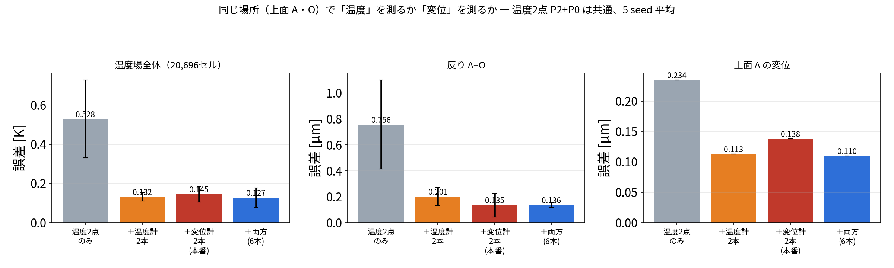
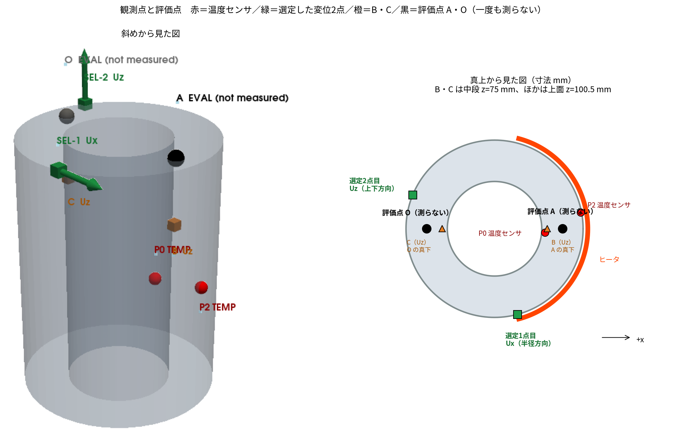
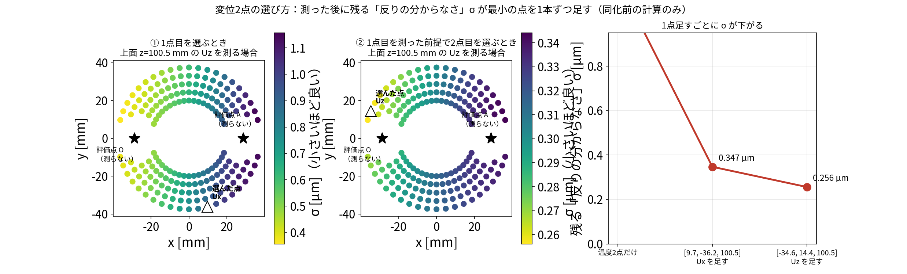
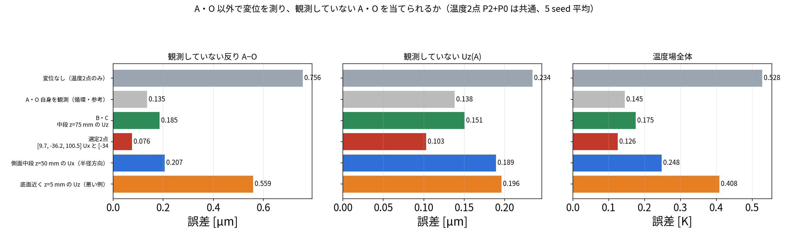
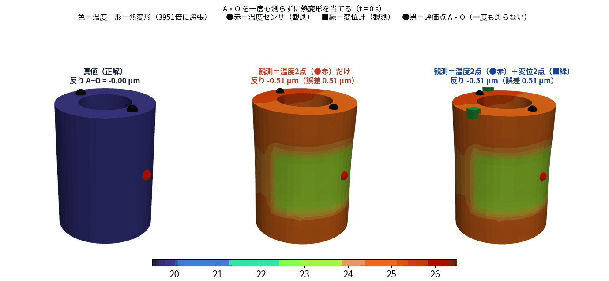

# blog_008：本研究の主張 ―「温度だけでなく変位もデータ同化の観測に使う」

更新日：2026-10-03

これまでの記事で、温度2点に変位2点を足すと推定が良くなることを示してきました。
この記事は、**それが研究の主張として成り立つのか**を、先行研究を調べたうえで整理したものです。

## この記事で確かめること

| | 内容 |
|---|---|
| **確かめたいこと** | 「温度だけでなく**変位も観測としてデータ同化に入れる**」ことが、研究の主張として成り立つか。先行研究にないか、そして実際に効果があるか |
| **検証1（§5）** | **同じ場所**に温度計を置くか変位計を置くかで差が出るか。センサの本数（4本）と場所をそろえ、**測る量だけ**を変える |
| **検証2（§6）** | 評価点 A・O を**一度も観測せず**、別の場所の変位2点だけで A・O の変形を当てられるか（[blog_004 §7-4](blog_004_pod_selected_rom.md) の循環を断つ） |
| **真値（正解）** | ROM で作った模擬データ（双子実験）。実機ではありません |
| **共通の観測** | 温度2点（P2・P0）。ここに変位2点を足したり、場所を変えたりする |
| **ノイズ** | 温度 0.30 K、変位 0.30 µm |
| **同化の設定** | EnKF・60メンバー・30 秒ごと20回・seed 20260913〜17 の5回平均 |
| **評価** | 加熱期 30〜300 秒の平均。全 20,696 セルの温度、反り $U_z(A)-U_z(O)$ 、個別の $U_z(A)$ ・ $U_z(O)$ |
| **文献調査の範囲** | 2026-10-03 に英語5回・日本語1回の検索。**網羅的ではありません**（§4） |

---

> **この記事の結論**
> 1. 工作機械の熱変形補正では、**温度を観測して変位を推定する**か、**変位を直接測って補正する**かのどちらかが一般的。
> 2. **温度と変位を同時に観測としてデータ同化に入れ、温度場・発熱量まで推定した例は、調べた範囲では見当たらない。**
> 3. 手法そのもの（EnKF、POD、変位の同化）は既知。新しいのは**組み合わせ方と、工作機械の熱変形に適用した点**。
> 4. **同じ場所なら、温度計と変位計はほぼ互角**だった（§5）。変位計の価値は「情報量が多いこと」ではなく、**温度計を置けない場所に置けること**。
> 5. **別の場所で変位を測れば、一度も測っていない場所の変形を、直接測るより正確に当てられた**（0.076 µm 対 0.135 µm、§6）。

---

## 1. 主張したいこと

> **熱変形を推定したいとき、観測は温度だけでなく、変位も同化に入れたほうがよい。**
> 変位計は5点すべての温度に触れるので、温度計のない点の温度まで直り、結果として温度場も発熱量も熱変形も良くなる。
> そして**変位計は、知りたい場所に置く必要がない**。別の場所で測って、測っていない場所の変形を当てられる。

この主張を支える計算結果と、先行研究との関係を以下にまとめます。

---

## 2. なぜ変位を入れると良いのか（仕組み）

詳しくは [blog_006 §7-5b](blog_006_temp2_disp2_step_by_step.md) にありますが、要点は3つです。

1. **変位は5点の温度の足し算**なので、**変位計1本で5点すべてに触れる**（温度計は1本で1点だけ）。

$$
U_z(A)=3.970+0.33\,T_0-0.13\,T_1+0.26\,T_2+0.64\,T_3+0.11\,T_4
$$

2. 変位がずれていれば、**5点の温度のどこかがずれている**と分かる。
3. どの点をどれだけ直すかは、60メンバーのばらつき（共分散）が決める。

その結果、**温度計を置いていない点の温度まで直ります**。

*$t=30$ 秒の更新で、温度計のない P3 を −4.97 K、P4 を −7.67 K 直しているのは変位計です。
$t=150$ 秒では温度計のずれがほぼ 0 になり、温度場を直しているのは変位計だけになります。*

---

## 3. 実計算での裏づけ

いずれも ROM 双子実験、EnKF・60メンバー・30秒ごと20回・5 seed 平均、加熱期30〜300秒です。

| 観測 | 温度場の誤差 | 推定した発熱量 | 出典 |
|---|---:|---:|---|
| 同化なし | 4.585 K | 16.45 W | [blog_004 §7-6](blog_004_pod_selected_rom.md) |
| 温度2点のみ（P2＋P0） | 0.503 K | 14.05 W | 同上 |
| **温度2点＋変位2点** | **0.160 K** | **14.89 W**（真値15 W） | 同上 |

さらに、**実ソルバ（OpenFOAM＋FrontISTR）を真値にし、新しく計算した条件**でも確かめました。

| 真値の条件 | 温度2点のみ | **温度2点＋変位2点** | 出典 |
|---|---:|---:|---|
| 25 W（反りの誤差） | 0.74 µm | **0.09 µm** | [21_advantage_verification.md](21_advantage_verification.md) |
| 25 W（発熱量） | 23.59 W | **24.91 W**（真値25 W） | 同上 |

**温度センサの置き方が悪くても（P2＋P0 はどちらもヒータ側）、変位計を足せば当たります。**

---

## 4. 先行研究の調査

2026-10-03 に、英語5回・日本語1回の検索を行いました。**網羅的な調査ではありません。**

### 4-1. 見つかった近い研究

| 研究 | 手法 | **観測に使うもの** | 変位の扱い |
|---|---|---|---|
| [ETH Zurich (2024)](https://www.research-collection.ethz.ch/entities/publication/a1ddda1a-3cd6-41ad-8590-be31b19896fb) | カルマンフィルタ＋低次元化FEM | **温度のみ**（5軸機で25本中13本） | 推定結果（出力） |
| [Teshima et al. (2024) CIRP JMST](https://doi.org/10.1016/j.cirpj.2024.10.015) | ROM＋回帰、センサ配置指針 | 温度のみ | 出力 |
| [Tekniker](https://tekniker.es/es/methodology-for-the-design-of-a-thermal-distortion-compensation-for-large-machine-tools-based-in-state-space-representation-with-Kalman-filter) | 状態空間＋カルマンフィルタ | 主軸回転数・温度 | 出力 |
| [NIST の整理](https://tsapps.nist.gov/publication/get_pdf.cfm?pub_id=957076) | 直接法／間接法の分類 | 温度（間接法）**または**変位（直接法） | 直接法は変位を測って直接補正。状態推定はしない |
| [逆熱伝導問題（EKF）](https://openbooks.itmo.ru/en/article/18553/USING_THE_EXTENDED_KALMAN_FILTER_IN_NONSTATIONARY_THERMAL_MEASUREMENT_WHEN_SOLVING_INVERSE_HEAT_TRANSFER_PROBLEMS.html) | 拡張カルマンフィルタ | 温度のみ | ― |
| [Displacement Data Assimilation](https://arxiv.org/pdf/1602.02209) | EnKF | **変位のみ**（流体分野） | 観測として使用 |
| 日本（特許・論文） | 回帰・CNN・多点温度計測（302点） | 温度のみ | 出力 |

### 4-2. いちばん近いのは ETH Zurich (2024)

| 項目 | ETH Zurich (2024) | 本研究 |
|---|---|---|
| モデル | 低次元化した FEM | POD/Q-DEIM の ROM |
| 同化 | カルマンフィルタ | EnKF |
| **観測** | **温度のみ**（25本中13本） | **温度2本＋変位2本** |
| 推定するもの | 温度場 → 熱変位 | 温度場・熱変形・**発熱量** |
| 結果 | 未観測温度 RMSE 2.7 ℃、熱変位 67.4 → 33.3 µm（実機） | 温度場 0.16 K、未観測の反り 0.081 µm（計算で作った真値） |
| 実装 | 非公開 | **オープンソースで公開** |

**手法の枠組みはほぼ同じです。** 違いは「観測に変位を入れたか」「発熱量まで推定するか」「実装が公開されているか」です。
ただし ETH は**実機**で検証しており、本研究は計算で作った真値だけです。ここは明確に劣ります。

### 4-3. 分かったこと

1. 工作機械の分野では **「温度を測って変位を出す」が標準**です。
2. 変位を測る方法（直接法）もありますが、**変位をそのまま補正に使うもので、温度場の推定には戻していません**。
3. **温度と変位を同時に観測として同化に入れた例は見つかりませんでした。**
4. 変位を観測に使う同化自体は、別分野（流体、き裂）にあります。**手法として新しいわけではありません。**

---

## 5. 【検証】同じ場所に温度計を置いたらどうなるか

「変位計のほうが情報量が多いから良い」のかを確かめるため、**同じ場所に温度計を置いた場合**と比べました。
センサの本数（計4本）と場所をそろえ、変えるのは「そこで何を測るか」だけです（`run/disp_vs_temp_same_place.py`）。

| 観測（温度2点 P2＋P0 は共通） | 温度場全体 | 反り A−O | Uz(A) | Uz(O) |
|---|---:|---:|---:|---:|
| 温度2点のみ | 0.528 K | 0.756 µm | 0.234 µm | 0.922 µm |
| ＋ A/O に**温度計**2本 | **0.132 K** | 0.201 µm | **0.113 µm** | 0.154 µm |
| ＋ A/O に**変位計**2本（本番） | 0.145 K | **0.135 µm** | 0.138 µm | **0.104 µm** |
| ＋ 両方（計6本） | 0.127 K | 0.136 µm | 0.110 µm | 0.117 µm |

seed ごとに対応をとった勝敗（変位計が温度計より良かった回数、5回中）：

| 評価する量 | 変位計が良かった回数 |
|---|---:|
| 温度場全体 | 2 / 5 |
| **反り A−O** | **4 / 5** |
| Uz(A) | 0 / 5 |
| **Uz(O)** | **5 / 5** |

### 分かったこと（主張の修正）

- **温度場全体を当てるなら、同じ場所なら温度計と変位計はほぼ互角**です（0.132 対 0.145 K、差は seed のばらつきに埋もれる）。
- **反りを当てるなら変位計のほうが良い**（0.135 対 0.201 µm、5回中4回）。知りたい量を直接測っているためです。

> **したがって「変位計は情報量が多いから優れている」とは言えません。**
> 変位計の価値は、**温度計を置けない場所に置けること**にあります。
> 工作機械では、加工中の工具先端や内部に熱電対を入れられませんが、変位計なら外側から測れます。

---

## 6. 【検証】別の場所で変位を測って、測っていない A・O を当てる

[blog_004 §7-4](blog_004_pod_selected_rom.md) の構成は、評価している A・O をそのまま観測に使っていました（循環）。
そこで、**A・O を一度も観測せず**、別の場所の変位2点だけで A・O を当てられるかを調べました（`run/disp_elsewhere_predict_AO.py`）。

### どこを測って、どこを評価したか

*赤＝温度センサ（P2・P0）／緑＝選定した変位2点（矢印＝測る方向）／橙＝B・C／黒＝評価点 A・O。
**A・O は一度も観測していません。***

| 役割 | 場所 | 測るもの |
|---|---|---|
| 温度センサ（共通） | P2 (36.5, 6.9, 50.8)、P0 (21.3, −1.6, 51.6) mm | 温度 |
| **選定した変位1点目** | (9.7, −36.2, 100.5) mm（上面、−y 寄り） | **$U_x$ （半径方向）** |
| **選定した変位2点目** | (−34.6, 14.4, 100.5) mm（上面、ヒータの反対側） | **$U_z$ （上下方向）** |
| B・C（比較用） | (±28, 0, 75) mm（A・O の真下、25 mm 下） | $U_z$ |
| **評価点 A・O** | (±28.7, 0, 100.5) mm（上面） | **測らない** |

### 変位の候補はどう選んだか ― 実際にやった作業

やったことは**総当たり**です。難しいことはしていません。

#### ステップ1：候補を全部リストアップする（15,120 通り）

FrontISTR を**6回だけ**回しました（平均の温度場で1回、POD のモード5つで1回ずつ）。
FEM は1回解くと**全節点の変位**が出るので、この6回で

> **全 5,040 節点 × 3 方向（x, y, z）＝ 15,120 通り**

すべてについて「5点の温度が変わると、その点のその方向の変位がどれだけ動くか」が分かります。追加の FEM 計算は要りません。

A・O から 12 mm 以内の節点は「A・O を測ったのと同じ」になるので候補から外し、**14,754 通り**が残りました。

#### ステップ2：候補を1つずつ採点する

候補を1つ取り出して、こう問います。

> **「ここに変位計を1本置いたら、反り A−O はどれくらい『はっきり』するか」**

この「はっきり度」を数値で出します。単位は µm で、**小さいほど良い**です。この記事では $\sigma$ と書きます。

| 状態 | $\sigma$ の意味 |
|---|---|
| 温度2点だけ（変位なし） | **1.186 µm**。反りの振幅が 2.74 µm なので、半分近く分かっていない |
| ある候補を1本足したあと | その候補を測ると、どこまで絞り込めるか |

これを **14,754 通りすべてについて計算**します。表計算で全行に式を入れて、最小値を探すのと同じことです。

採点に使うのは次の2つだけで、**測定値は使いません**。

| 使うもの | 中身 | どこから |
|---|---|---|
| **熱感度** | 5点の温度が 1 K 変わると、その点の変位が何 µm 動くか | FrontISTR（ステップ1で作ったもの） |
| **温度のばらつき** | 発熱量や初期温度が分からないせいで、5点の温度がどれくらい・どう連動してばらつくか | ROM を 4000 通り回して数える |

採点の式（興味がある人だけ）

$$\sigma_S^2=w^{\mathsf T}\Big(B-BH_S^{\mathsf T}(H_SBH_S^{\mathsf T}+R)^{-1}H_SB\Big)w$$

$w$ ＝反り A−O に対する5点温度の熱感度 (0.47, −0.65, 0.60, 0.04, −0.46) µm/K、
$B$ ＝5点の温度のばらつき（共分散）、 $H_S$ ＝候補 $S$ を測る演算子、 $R$ ＝センサのノイズ（0.3 µm）。
括弧の中はカルマンフィルタの更新式そのもので、「測った後に残る温度のあいまいさ」です。
それを $w$ ではさむと「残る**反りの**あいまいさ」になります。

#### ステップ3：1位を選ぶ（1点目）

14,754 通りの採点結果を小さい順に並べます。

| 順位 | 候補 | $\sigma$ |
|---|---|---:|
| **1位** | **(9.7, −36.2, 100.5) mm の $U_x$** | **0.347 µm** |
| 2位 | (9.7, **+36.2**, 100.5) mm の $U_x$ | 0.347 µm |
| 3位 | (14.4, −34.6, 100.5) mm の $U_x$ | 0.347 µm |
| …（中央値） | ― | 1.026 µm |
| 最下位 | (37.5, 0, 0) mm の $U_y$ | 1.186 µm ＝ 測らないのと同じ |

1位を採用します。これで 1.186 → **0.347 µm**。1本測るだけで3分の1以下になりました。

#### ステップ4：**採点をやり直して**、2点目を選ぶ

ここが肝心です。**2位をそのまま選んではいけません。**

2位は (9.7, **+36.2**, 100.5) で、1位とは y の符号が違うだけの**ほぼ同じ場所**です。
1点目で分かったことと同じことしか分からないので、足しても意味がありません。

そこで、**1点目を測ったことにして、14,753 通りを採点し直します**。

| 順位 | 候補 | $\sigma$ |
|---|---|---:|
| **1位** | **(−34.6, 14.4, 100.5) mm の $U_z$** | **0.256 µm** |
| 2位 | (−36.2, 9.7, 100.5) mm の $U_z$ | 0.256 µm |
| …（中央値） | ― | 0.330 µm |

0.347 → **0.256 µm**。これで2点決まりました。

#### 採点し直すと、良い場所が変わる

*左＝1点目を選ぶときの採点（色が薄いほど良い）、中＝1点目を測った前提で採点し直したとき、右＝ $\sigma$ が下がる様子。*

左と中を見比べてください。**良い場所（薄い色）が移動しています。**

| | 良い場所 | なぜ |
|---|---|---|
| 1点目のとき | 上面の ±y 側 | ヒータ側と反対側の両方の影響を受ける |
| 2点目のとき | **ヒータの反対側（−x 側）** | 1点目で分からなかった「反対側の情報」が欲しくなる |

#### まとめ

> **やったこと**：候補 14,754 通りを全部採点して1位を選ぶ。選んだら採点をやり直して、また1位を選ぶ。
>
> **考え方**：いま分かっていないことを、いちばん多く教えてくれる点を選ぶ。選んだら「何が分かっていないか」を更新して、また選ぶ。

**ここまで測定値は一切使っていません。** FrontISTR の計算と ROM の計算だけで、机上で場所が決まります。
本当に当たるかは、このあと同化を回して確かめます。

### 結果

| 変位2点をどこに置くか | **観測していない反り A−O** | **観測していない Uz(A)** | 温度場全体 |
|---|---:|---:|---:|
| 変位なし（温度2点のみ） | 0.756 µm | 0.234 µm | 0.528 K |
| A・O 自身を観測（**循環**・参考） | 0.135 µm | 0.138 µm | 0.145 K |
| B・C（中段 z=75 mm の $U_z$ ） | 0.185 µm | 0.151 µm | 0.175 K |
| **選定2点**（(9.7, −36.2, 100.5) の $U_x$ と (−34.6, 14.4, 100.5) の $U_z$ ） | **0.076 µm** | **0.103 µm** | **0.126 K** |
| 側面中段 z=50 mm の $U_x$ | 0.207 µm | 0.189 µm | 0.248 K |
| 底面近く z=5 mm の $U_z$ （悪い例） | 0.559 µm | 0.196 µm | 0.408 K |

### 分かったこと

*左＝真値、中＝温度2点のみ、右＝温度2点＋別の場所の変位2点（A・O は一度も測らない）。
**色＝温度、形＝熱変形**（790 倍に誇張）。赤球＝温度センサ、緑球＝観測した変位2点、黒球＝評価点 A・O。seed 20260913。*

形と色で、何が起きているか一目で分かります。例えば $t=150$ 秒では

| | 反り A−O | 誤差 |
|---|---:|---:|
| 真値 | 2.57 µm | ― |
| 温度2点のみ（中） | 1.38 µm | 1.19 µm |
| **温度2点＋別の場所の変位2点（右）** | **2.56 µm** | **0.01 µm** |

- **中（温度2点のみ）**：全体が緑がかっていて、真値（左）より温度が高めに出ています。形も反りが足りません。
- **右（変位2点を足す）**：色も形も左の真値とほとんど同じです。**A・O（黒球）は一度も測っていません。**

1. **A・O を一度も測らずに、反りを 0.076 µm で当てられました。** 真値の振幅 2.74 µm に対して 2.8 % です。
2. **A・O を直接測った場合（0.135 µm）より正確です。** 測る場所を選べば、知りたい場所を測らないほうが良い結果になりました。
   - 理由は信号対雑音比と考えています。A・O の反りは最大 2.7 µm ですが、変位計のノイズは 0.3 µm あります。
     選定した点は変位がもっと大きく動くので、同じノイズでも情報が多く取れます。**この解釈は確かめていません。**
3. **置き場所で大きく変わります。** 底面近く（0.559 µm）は、変位なし（0.756 µm）から少ししか改善しません。底面は固定されていてほとんど動かないためです。
4. 選定は**同化を回す前**に、FrontISTR の熱感度と ROM で作った温度のばらつきだけで計算しています（[blog_005 §4-6](blog_005_optimal_sensor_placement.md) と同じ方法）。

> **これが本研究のいちばん強い結果だと考えています。**
> 工作機械で本当に知りたいのは工具先端の変位ですが、加工中にそこは測れません。
> **測れる場所で変位を測り、測れない場所の変形を当てる**ことを、計算で示せました。

### 注意（未確認）

- 真値は ROM の双子実験です。実ソルバ（OpenFOAM＋FrontISTR）を真値にした試験はしていません。
- 「直接測るより正確」の理由（信号対雑音比）は解釈で、別の計算では確かめていません。
- 選定した2点は上面にあります。この形状では上面がよく動くためで、他の形状では変わります。

---

## 7. 主張の書き方

### 7-1. 言ってよいこと

> 工作機械の熱変形補正では、温度を観測して変位を推定する形か、変位を直接測って補正する形が一般的である。
> 本研究は**温度と変位を同時に観測としてデータ同化に入れ**、温度センサのない点の温度・測っていない点の熱変形・発熱量を同時に推定した。
> とくに、**A・O を一度も観測せずに、別の場所の変位2点から反りを 0.076 µm（振幅の2.8 %）で推定**できた。これは A・O を直接測った場合（0.135 µm）より正確である。
> **調べた範囲では、この形の報告は見当たらない。**

「調べた範囲では」を必ず付けます。英語5回・日本語1回の検索だけが根拠だからです。

### 7-2. 言ってはいけないこと

| 言わない | 理由 |
|---|---|
| 「初めて提案した」 | 網羅的な文献調査をしていない |
| 「EnKF／POD／変位の同化が新しい」 | いずれも既知の手法 |
| 「変位計は温度計より情報量が多い」 | 同じ場所では互角だった（§5） |
| 「実機で有効」 | 真値はすべて計算で作ったもの |
| 「どんな機械でも有効」 | 熱源の位置が変わると配置も変わる（[blog_007](blog_007_rom_applicability.md)） |

### 7-3. 主張を強くするには（未実施）

1. **文献調査を広げる**：精密工学会・日本機械学会の論文、構造ヘルスモニタリング分野。
2. **センサ数をそろえた比較**：「温度計3本」対「温度計2本＋変位計1本」。変位計が温度計の代わりになるかを示す。
3. **実ソルバを真値にした holdout 試験**：§6 を OpenFOAM＋FrontISTR の真値で確かめる。
4. **実機での検証**：`IoT/thermal_expansion_experiment/` に計画があるが、未実施。

---

## 8. 発表での位置づけ（案）

| 章 | 言うこと |
|---|---|
| 背景 | 熱変形補正では温度を測って変位を推定するのが一般的 |
| 課題 | 温度計は1本で1点しか見られない。置けない場所もある |
| **本研究の主張** | **変位も観測として同化に入れる**。変位計は5点すべての温度に触れるので、温度計のない点の温度まで直る。しかも**知りたい場所に置く必要がない** |
| 結果 | 温度場 0.503 → 0.160 K、発熱量 14.05 → 14.89 W。**A・O を測らずに反り 0.076 µm**（直接測るより正確） |
| 限界 | 計算で作った真値のみ。実機は未実施。文献調査も網羅的ではない |
