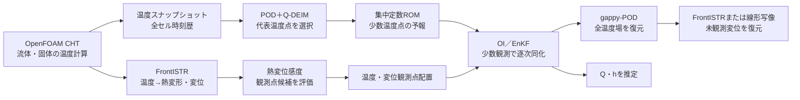

# 継続研究開発用プロンプト：オープンソースによる熱変形データ同化

この文書は、現在の研究開発を別の担当者・AI・開発セッションへ引き継ぐための作業指示書である。
既存の解析結果、図、数式、実装を確認したうえで拡張すること。**既存ファイルを削除したり、
既存の結果を別の条件の結果で上書きしたりしないこと。**新しい検証は専用の結果フォルダ、図名、
説明節を追加して管理する。

## 研究目的

本研究の目的は、OpenFOAM、FrontISTR、Pythonによるデータ同化を組み合わせ、少数の温度・変位観測から、
次の量を推定できるオープンソースの一気通貫手法を構築することである。

- 未観測点を含む全温度場
- 熱変形および未観測位置の変位
- 発熱量 $Q$
- 必要に応じて熱伝達・放熱パラメータ $h$

研究の主題は、単に温度を合わせることではない。**どの場所を観測すれば、温度場・熱変形・未知パラメータを
同時に最もよく推定できるかを、物理計算に基づく感度解析で決めること**である。

## 研究全体像

## 高忠実度計算とROMの役割

### 104：高忠実度の基準計算

`sample/104_0_openfoam_frontistr_da_enkf/` では、OpenFOAMの`chtMultiRegionFoam`で流体・固体の
共役熱伝達を計算し、固体温度をFrontISTRへ渡して熱弾性変位を計算した。温度・変位を観測値として
OpenFOAM＋FrontISTRをデータ同化ループ内で繰り返すため、計算時間が非常に大きかった。

この計算は次の目的で残す。

1. OpenFOAM＋FrontISTRの物理的な基準結果を得る。
2. 温度、変位、変位差、熱流束、熱伝達率を保存する。
3. ROM・OI・EnKFの双子実験で使う正解値（synthetic truth）を作る。
4. ROMの予測結果を高忠実度計算に対して検証する。

104の高忠実度計算を、計算時間短縮のために削除したり、ROM結果と混同したりしない。図には必ず
「実ソルバ（OpenFOAM＋FrontISTR）」か「ROM双子実験」かを明記する。

### 106：軽量ROMによる反復同化

`sample/106_0_pod_selected_rom/` では、104で得た温度スナップショットを使って、同化ループ内の予報をROMに置き換える。

1. OpenFOAMの全セル温度スナップショットを保存する。
2. 平均場を引き、SVD/PODで温度場の空間モードを抽出する。
3. Q-DEIMでモードを復元しやすい代表温度点を選ぶ。
4. 代表点の温度履歴に集中定数熱モデルを校正する。
5. ROMで5点温度、$Q$、$h$を時間積分する。
6. 5点温度からgappy-PODで全セル温度場を復元する。
7. 復元温度をFrontISTRまたは事前計算した線形温度→変位写像へ渡す。
8. OIまたはEnKFで温度・変位観測を使って状態を更新する。

ROMは物理計算を置き換えるための近似であり、物理の正解そのものではない。学会発表では、
「高忠実度計算をオフラインで一度実施し、オンラインの反復計算をROMで高速化した」と説明する。

## 感度解析と観測点配置

### 今後の研究で主役にする直接感度解析

本研究の次の段階では、経験的な有限差分だけでなく、**熱方程式を未知パラメータで直接微分して
感度方程式を解く**。中心となる研究質問は、

> 推定したい対象（全温度場、熱変位、発熱量、放熱パラメータ）によって、最適な観測位置は変わるのか。

である。したがって、温度場の再構成に最適なセンサ配置と、熱変位の推定に最適なセンサ配置が一致するとは
仮定しない。各推定対象に対する感度、感度行列の最小特異値、推定誤差、必要センサ数を比較する。

### 集中定数熱モデルのベクトル表現

5代表点の温度ベクトルを

$$
\boldsymbol T(t)=[T_0(t),T_1(t),\ldots,T_4(t)]^{\mathsf T}
$$

とし、熱容量行列を$C=\operatorname{diag}(C_0,\ldots,C_4)$、ノード間熱伝導行列を$K$、
ヒータ入力分布を$\boldsymbol b$とする。ROMの放熱は、内部ノードの放熱コンダクタンスを
$g$ [W/K] として、

$$
C\dot{\boldsymbol T}
=K\boldsymbol T+\boldsymbol b\,Q
-g(\boldsymbol T-T_{\rm air}\boldsymbol 1)
$$

と書く。加熱のON/OFFは$Q(t)=Q_0u_Q(t)$（$u_Q=1$が加熱、$u_Q=0$が停止）で表す。
ここで$g$はROMの集中定数であり、壁面の局所熱伝達率$h_s$ [W/(m²K)]とは別物である。
表面熱伝達率はOpenFOAMの面熱流束から診断し、ROMでは面積・温度差をまとめた放熱コンダクタンスとして扱う。

$A(g)=K-gI$、$\boldsymbol r(g)=gT_{\rm air}\boldsymbol1$と置けば、

$$
C\dot{\boldsymbol T}=A(g)\boldsymbol T+\boldsymbol bQ(t)+\boldsymbol r(g)
$$

となる。この形を基準に、どのパラメータを推定するかを定義する。

### 発熱量 $Q$ に対する直接感度方程式

発熱量に対する温度感度を

$$
\boldsymbol s_Q(t)=\frac{\partial\boldsymbol T(t)}{\partial Q_0}
$$

と定義する。$C$、$K$、$g$、初期温度が$Q_0$に依存しないなら、元の熱方程式を$Q_0$で微分して

$$
C\dot{\boldsymbol s}_Q
=A(g)\boldsymbol s_Q+\boldsymbol b\,u_Q(t),
\qquad \boldsymbol s_Q(0)=\boldsymbol0
$$

を得る。右辺の$\boldsymbol b u_Q(t)$が、ヒータ入力から直接入る感度の駆動項である。
したがって加熱開始直後は蓄積がなく感度が小さく、熱が蓄積するにつれて$\boldsymbol s_Q$が成長する。
ヒータを切った後は新しい入力がなく、熱拡散・放熱により感度が減衰する。

形式的には、係数が一定の区間で

$$
\boldsymbol s_Q(t)=
\int_0^t\exp\!\left[C^{-1}A(t-\tau)\right]C^{-1}\boldsymbol b\,u_Q(\tau)\,d\tau
$$

である。つまり、ある時刻の温度だけでなく、加熱開始からその時刻までの入力履歴が感度に蓄積される。

### 放熱コンダクタンス $g$ に対する直接感度方程式

同様に

$$
\boldsymbol s_g(t)=\frac{\partial\boldsymbol T(t)}{\partial g}
$$

と置く。$g$が$A$と$\boldsymbol r$にだけ現れるので、

$$
C\dot{\boldsymbol s}_g
=A(g)\boldsymbol s_g
-\boldsymbol T+T_{\rm air}\boldsymbol1,
\qquad \boldsymbol s_g(0)=\boldsymbol0
$$

となる。温度差$\boldsymbol T-T_{\rm air}\boldsymbol1$が小さい初期時刻では放熱パラメータの感度も小さい。
加熱によって温度差が大きくなると$\boldsymbol s_g$が大きくなり、冷却過程では放熱の影響が強く現れる。
このため、$Q$と$g$を同定するには加熱初期だけでなく、加熱中盤・加熱終了後の冷却時系列を含める必要がある。

より一般に、パラメータ$\theta$を含む

$$
C\dot{\boldsymbol T}=\boldsymbol f(\boldsymbol T,\theta,t)
$$

を微分すると、

$$
C\dot{\boldsymbol s}_\theta
=\frac{\partial\boldsymbol f}{\partial\boldsymbol T}\boldsymbol s_\theta
+\frac{\partial\boldsymbol f}{\partial\theta},
\qquad
\boldsymbol s_\theta=\frac{\partial\boldsymbol T}{\partial\theta}
$$

である。複数パラメータでは$S=[\boldsymbol s_{\theta_1},\ldots,\boldsymbol s_{\theta_p}]$を同時に積分する。
既存のRK4積分器を使う場合も、温度状態と各感度状態を同じRK4ステージで進める。これにより、有限差分の刻み幅に
依存しない直接感度を得られる。

### 感度から観測点配置へ

観測行列$H$で温度を取り出すと、パラメータ感度の観測行列は

$$
G(t)=H S(t)
$$

となる。複数時刻を積み重ねた

$$
G_{\rm all}=\begin{bmatrix}G(t_1)\\G(t_2)\\\vdots\\G(t_n)\end{bmatrix}
$$

の最小特異値$\sigma_{\min}(G_{\rm all})$、条件数、またはFisher情報
$G_{\rm all}^{\mathsf T}R^{-1}G_{\rm all}$を評価し、$Q$と$g$を同時に識別しやすいセンサ配置を選ぶ。
温度場再構成誤差を最小化する配置、熱変位誤差を最小化する配置、$Q,g$の識別性を最大化する配置を
別々に計算し、**推定対象依存型観測配置**として比較する。

熱変位$q=D\boldsymbol T$（またはFrontISTRの$W$写像）を評価量とする場合は、

$$
\frac{\partial q}{\partial\theta}=D S(t)
$$

を使う。これが、温度場をよく再構成するセンサ配置と、熱変位をよく推定するセンサ配置が一致しない可能性を
数式で検証する方法である。

### 温度センサの感度

代表点$i$の発熱量感度を、発熱量を微小に変えた差分から求める。

$$
S_i^T=\frac{T_i(Q+\Delta Q,t_*)-T_i(Q,t_*)}{\Delta Q}
$$

ここで$t_*$は加熱中の評価時刻である。$S_i^T$が大きい点は、発熱量の変化が温度信号に現れやすく、
$Q$の同定に有利な候補である。ただし、温度場の復元に使う5点そのものは、温度感度だけでなくPOD＋Q-DEIMで選ぶ。

### 変位観測点の熱感度

FrontISTRの熱弾性方程式を

$$K_su=H_TT$$

と書く。$K_s$は構造剛性行列、$H_T$は温度から等価熱荷重を作る行列である。温度から変位への感度は

$$W=\frac{\partial u}{\partial T}=K_s^{-1}H_T$$

である。変位観測点$r$の感度は、対応する$W$の行のノルム、または対象とする変位差に対する行で評価する。

上面AとOの変位差を$q=U_z(A)-U_z(O)$とすると、

$$
W_{q,:}=W_{A,:}-W_{O,:},\qquad
S_j^{q}=|W_{q,j}|
$$

で、温度場のどの位置の誤差が変位差に強く現れるかを評価できる。観測変位点の候補は、FrontISTRで
計算した変位感度が高く、かつ同じ情報を重複して測らない点を優先する。高感度点と低感度点を同じROM条件で比較し、
配置の効果を検証する。

### 感度解析で必ず示す図

- FrontISTRの$W$または変位差感度の3Dコンター
- 温度感度$dT/dQ$の3D分布
- 高感度・低感度の候補点を同じ形状上に表示した図
- 観測点配置ごとの温度RMSE、変位RMSE、変位差RMSE
- 観測に使わない検証点の時系列

図には、色の意味、座標系、単位、評価時刻、加熱／冷却区間、観測に使った点と検証だけの点を必ず書く。

## データ同化の説明順序

学会発表では、次の順で説明する。

1. OpenFOAM＋FrontISTRで基準となる温度・変位を計算した。
2. 高忠実度計算を同化ループで直接繰り返すと計算コストが大きいことを示した。
3. POD＋Q-DEIMと集中定数ROMで、同化ループを軽量化した。
4. FrontISTRの熱変位感度から観測点候補を選んだ。
5. 温度のみ、温度＋変位、高感度点、低感度点を同じ条件で比較した。
6. 全温度場、未観測変位、$Q$、$h$をどこまで推定できたかを示した。
7. 高忠実度結果、ROM結果、同化なし結果を区別して結論を出した。

## 結果整理の最低条件

各結果図のキャプションに、次を含める。

- 使用モデル：OpenFOAM＋FrontISTR、ROM、またはROM＋EnKF
- メンバー数、更新間隔、更新回数
- 観測点の種類と位置
- 真値の生成方法
- 加熱・冷却時間
- seedまたは平均条件
- 表示量の単位
- 黒線・色線・帯の意味

平均RMSEは、対象時刻集合$\mathcal T$と対象量$e(t)$に対して

$$
\mathrm{RMSE}_{\mathcal T}
=\sqrt{\frac{1}{|\mathcal T|}\sum_{t\in\mathcal T}e(t)^2}
$$

で計算する。複数点の温度場なら、点またはセル方向も明記する。変位差については、
$e(t)=q_{\mathrm{est}}(t)-q_{\mathrm{true}}(t)$と定義する。

## 学会発表での主張候補

### 現時点で主張できること

- オープンソースだけで、熱流体固体連成、熱弾性変位、観測点感度解析、データ同化までを一貫して構成した。
- OpenFOAM＋FrontISTRの高忠実度結果を正解値として、ROM双子実験を再現可能にした。
- POD＋Q-DEIMで、20,696セルの温度場を少数代表点から復元する手順を示した。
- FrontISTRの温度→変位感度を用いて、変位観測点の高感度・低感度を比較できるようにした。
- 温度だけでは変位に誤差が残る場合があり、変位観測を加えると未観測変位差の推定が改善する条件を示した。
- 高忠実度反復計算のコストを、ROMによってオンライン同化に適した計算へ移行した。

### まだ断定してはいけないこと

- すべての形状・流動条件で最適な観測点になるとは言わない。
- ROM双子実験の一致を、そのまま実測への妥当性とは言わない。
- $Q$や$h$が常に正確に同定できるとは言わない。
- 固定共分散OIの結果を、EnKFの結果と混同しない。
- 104の観測点選定根拠がコードで確認できない場合、「Wで選定した」と断定しない。

## 今後の実装・検証タスク

優先順位は次のとおり。

1. 高感度・低感度の温度／変位観測配置を、同一の真値・初期条件・seedで再計算する。
2. 観測に使わない別の2点間変位差を検証QoIとして追加する。
3. OpenFOAM＋FrontISTR結果に対するROM温度場・変位場の誤差を時系列で比較する。
4. $\sigma_T$、$\sigma_Q$、有限アンサンブル数、初期分布を分けて感度調査する。
5. $Q$と$h$の識別可能性を、感度行列またはFisher情報で評価する。
6. 実測または別条件の高忠実度計算を学習範囲外の検証に使う。
7. センサ配置をQ-DEIMだけでなく、変位感度、相関、非冗長性を含む多目的選定へ拡張する。
8. 各図を学会スライド用に、条件付きの横長図として再生成する。

## 作業ルール

- 既存の`results/`、`docs/img/`、スクリプトを上書きしない。新しい条件には名前付きサブフォルダを使う。
- 図を追加する前に、データの生成元と条件を確認する。
- 新しい数値には、使用したファイル、スクリプト、seed、時刻範囲を記録する。
- グラフだけを追加せず、本文に「何を計算し、何と比較し、何が分かったか」を書く。
- 主要概念には、横向きの概念図または実計算の結果図を最低1つ置く。
- GitHubで表示できるMarkdownとMermaidを使い、数式は表示確認する。
- 変更後は画像リンク、数式、図の凡例、単位、条件、`git diff --check`を確認する。

## 発表テーマ案

> **オープンソースCAEとデータ同化による、少数観測からの熱変形・発熱量逆推定**

副題の候補は、

> **OpenFOAM＋FrontISTRの高忠実度熱変形解析を、POD／Q-DEIMとEnKFで高速化する観測点感度設計**

とする。円柱モデルは工作機械そのものではなく、工作機械の熱変形監視へ展開するための基礎モデルである。
発表では、まず再現可能な円柱問題で方法を検証し、次に実機形状へ展開する道筋を示す。

## 計算工学講演会向けのテーマ候補

計算工学講演会では、工作機械の実機形状を最初から主役にせず、数式と数値手法が検証しやすい単純円柱モデルを
方法論の検証対象とする。発表の中心は、次の研究質問である。

> **熱変形データ同化で、推定したい対象（全温度場、熱変位、発熱量、放熱パラメータ）が変わると、
> 最適な観測点配置も変わるのか。**

候補タイトル：

1. **熱パラメータ推定のための直接感度解析と観測点配置：OpenFOAM–FrontISTR熱変形データ同化**
2. **推定対象依存型観測配置による熱変形データ同化：温度場再構成と変位推定の比較**
3. **熱方程式の直接感度に基づく発熱量・放熱パラメータ推定とセンサ配置設計**
4. **OpenFOAM–FrontISTRとROM–EnKFを用いた少数観測からの熱変形逆推定**

第一候補は1または2とする。これなら、単なる「EnKFを適用した」という発表ではなく、
「微分した熱方程式から感度分布を作り、推定目的ごとに観測点を設計し、その効果を数値的に比較した」
という方法論を明確に主張できる。

工作機械への展開例としては、主軸、主軸台、コラム、ベッド、軸受発熱、モータ発熱、熱変位を挙げる。
ただし本発表では、それらを実機で検証したと誤解されないよう、**円柱は工作機械熱変形へ展開するための
基礎モデル**と位置づける。実機形状を用いた検証は次段階の課題として示す。
