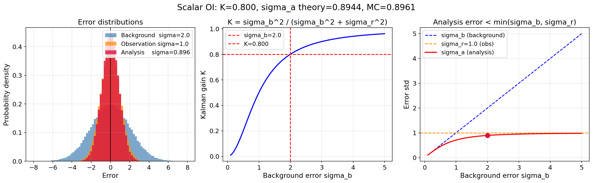
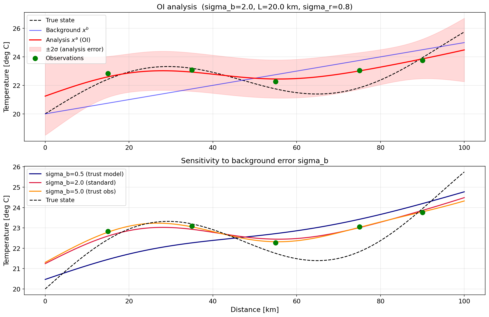

# 最適補間法（OI法）とは？データ同化の基礎を数式とPythonで徹底解説

数値シミュレーションで計算した予測値と、センサーで得た観測値——どちらも誤差を含んでいます。
**最適補間法（OI法）** は、両者の誤差の大きさを考慮して「最も確からしい状態」を求める、
データ同化の出発点となる手法です。

**この記事でわかること**
- 「最適」の意味——最小分散推定によってカルマンゲインが導かれる仕組み
- カルマンゲイン行列の意味と、背景誤差 $\mathbf{B}$ ・観測誤差 $\mathbf{R}$ が果たす役割
- PythonでOI法を実装し、補間結果をグラフで確認する方法

---

## OI法の問題設定

まず登場人物を整理します。

| 記号 | 名称 | 意味 |
|---|---|---|
| $x^t$ | 真値 | 本当の状態（直接知ることはできない） |
| $x^b$ | 背景場 | モデルによる予測値。誤差 $\epsilon_b = x^b - x^t$ を含む |
| $y$ | 観測値 | センサーで得た値。誤差 $\epsilon_r = y - x^t$ を含む |
| $x^a$ | 解析場 | OI法で求めたい最良推定値 |

誤差についての仮定：
- 背景誤差・観測誤差はともに **平均ゼロ** のランダム誤差
- 背景誤差と観測誤差は **互いに独立**

この記事ではまずスカラー（1変数）の場合で直感を掴み、その後ベクトルに拡張します。

---

## スカラー版OI法：カルマンゲインの導出

### まず「線形結合」として考える

解析場 $x^a$ を、背景場 $x^b$ と観測値 $y$ の **線形結合** で表すことにします。

$$\boxed{x^a = \alpha \, x^b + (1-\alpha) \, y} \tag{1}$$

ここで $\alpha$ は背景場への重み、$1-\alpha$ は観測への重みです。

| $\alpha$ の値 | 意味 |
|---|---|
| $\alpha = 1$ | $x^a = x^b$：背景場（モデル）を全面的に信頼 |
| $\alpha = 0$ | $x^a = y$：観測値を全面的に信頼 |
| $0 < \alpha < 1$ | 両者を混ぜる |

**問いはシンプルです：「$x^a$ の誤差を最小にする $\alpha$ はいくつか？」**

### 解析誤差の分散を $\alpha$ で表す

真値を $x^t$ として、各誤差を定義します：

$$\epsilon_b = x^b - x^t \quad (\text{背景誤差、分散 } \sigma_b^2)$$
$$\epsilon_r = y - x^t \quad (\text{観測誤差、分散 } \sigma_r^2)$$

式 (1) から解析誤差 $x^a - x^t$ を計算します：

$$x^a - x^t = \alpha(x^b - x^t) + (1-\alpha)(y - x^t)$$

$$\boxed{x^a - x^t = \alpha \, \epsilon_b + (1-\alpha) \, \epsilon_r} \tag{2}$$

$\epsilon_b$ と $\epsilon_r$ は互いに独立なので、解析誤差の分散は：

$$\sigma_a^2 = \alpha^2 \sigma_b^2 + (1-\alpha)^2 \sigma_r^2 \tag{3}$$

### $\sigma_a^2$ を最小にする $\alpha$ を求める

式 (3) を $\alpha$ で微分してゼロとおきます：

$$\frac{d\sigma_a^2}{d\alpha} = 2\alpha \sigma_b^2 - 2(1-\alpha)\sigma_r^2 = 0$$

$$\alpha \sigma_b^2 = (1-\alpha)\sigma_r^2$$

$$\alpha(\sigma_b^2 + \sigma_r^2) = \sigma_r^2$$

$$\boxed{\alpha = \frac{\sigma_r^2}{\sigma_b^2 + \sigma_r^2}} \tag{4}$$

**直感的な意味**：

| 条件 | $\alpha$ | 解釈 |
|---|---|---|
| $\sigma_b^2 \gg \sigma_r^2$（モデル誤差が大きい） | $\alpha \to 0$ | 観測を強く信頼 |
| $\sigma_b^2 \ll \sigma_r^2$（観測誤差が大きい） | $\alpha \to 1$ | モデルをほぼそのまま使う |
| $\sigma_b^2 = \sigma_r^2$ | $\alpha = 0.5$ | 半々に混ぜる |

$\alpha$ は「モデルへの重み」ですから、**モデル誤差が大きいほど $\alpha$ は小さく（観測寄り）** になります。

### 線形結合形からカルマンゲイン形へ変形する

式 (1) を少し書き換えます：

$$x^a = \alpha \, x^b + (1-\alpha) \, y$$

$$= x^b + (1-\alpha)(y - x^b)$$

ここで $K \equiv 1 - \alpha$ とおくと：

$$\boxed{x^a = x^b + K(y - x^b)} \tag{5}$$

$y - x^b$ は「観測値とモデル予測のズレ」で **イノベーション** と呼びます。
$K = 1-\alpha$ を **カルマンゲイン** と呼びます。

式 (4) より：

$$K = 1 - \alpha = 1 - \frac{\sigma_r^2}{\sigma_b^2 + \sigma_r^2} = \frac{\sigma_b^2}{\sigma_b^2 + \sigma_r^2} \tag{6}$$

**2つの式は完全に等価**——線形結合の重み $\alpha$ とカルマンゲイン $K$ は次の関係にあります：

$$\alpha = \frac{\sigma_r^2}{\sigma_b^2 + \sigma_r^2}, \qquad K = \frac{\sigma_b^2}{\sigma_b^2 + \sigma_r^2}, \qquad \alpha + K = 1$$

> **まとめ**：OI法は「背景場と観測値の線形結合 $\alpha x^b + (1-\alpha)y$」という自然な形から出発し、
> 解析誤差の分散を最小化することで最適な重み $\alpha$（＝カルマンゲイン $K$）が一意に決まります。

---

### 解析後の誤差分散はどうなるか？

式 (2) と最適 $\alpha = \sigma_r^2/(\sigma_b^2+\sigma_r^2)$（$K = \sigma_b^2/(\sigma_b^2+\sigma_r^2)$）を使うと：

$$\sigma_a^2 = \alpha^2\sigma_b^2 + (1-\alpha)^2\sigma_r^2 = \frac{\sigma_r^4\sigma_b^2 + \sigma_b^4\sigma_r^2}{(\sigma_b^2+\sigma_r^2)^2}$$

$$\boxed{\sigma_a^2 = \frac{\sigma_b^2\sigma_r^2}{\sigma_b^2+\sigma_r^2} = (1-K)\sigma_b^2} \tag{7}$$

**重要な結論**：$\sigma_a^2 < \sigma_b^2$ かつ $\sigma_a^2 < \sigma_r^2$  
→ データ同化後の不確かさは、背景場・観測値の**どちらよりも必ず小さくなります**。

---

## スカラー版をPythonで確かめる

理論値（式 (4)(5)）とモンテカルロシミュレーション（大量のサンプルで統計を計算）を比べます。
式が本当に正しいか、自分の手で確認してみてください。

```python
# oi_scalar.py
import numpy as np
import matplotlib.pyplot as plt

np.random.seed(42)
N_trial = 100_000   # 試行回数

# 誤差設定
sigma_b = 2.0   # 背景誤差の標準偏差
sigma_r = 1.0   # 観測誤差の標準偏差
x_true  = 5.0   # 真値（固定）

# カルマンゲインと解析誤差分散の理論値
K_theory      = sigma_b**2 / (sigma_b**2 + sigma_r**2)
sigma_a_theory = np.sqrt((1 - K_theory) * sigma_b**2)

print(f"カルマンゲイン K  (理論値) : {K_theory:.4f}")
print(f"解析誤差 σ_a    (理論値) : {sigma_a_theory:.4f}")

# モンテカルロシミュレーション
eps_b = np.random.normal(0, sigma_b, N_trial)   # 背景誤差
eps_r = np.random.normal(0, sigma_r, N_trial)   # 観測誤差

x_b = x_true + eps_b   # 背景場
y   = x_true + eps_r   # 観測値

x_a = x_b + K_theory * (y - x_b)  # 解析場
sigma_a_mc = np.std(x_a - x_true) # 解析誤差の標準偏差（モンテカルロ）

print(f"解析誤差 σ_a (モンテカルロ): {sigma_a_mc:.4f}")

# ヒストグラム比較
fig, axes = plt.subplots(1, 3, figsize=(12, 4), sharey=True)
for ax, data, label, color in zip(
        axes,
        [eps_b, eps_r, x_a - x_true],
        ['背景誤差 $\\epsilon_b$', '観測誤差 $\\epsilon_r$', '解析誤差 $x^a - x^t$'],
        ['steelblue', 'darkorange', 'crimson']):
    ax.hist(data, bins=100, density=True, color=color, alpha=0.7)
    ax.set_title(label)
    ax.set_xlabel('誤差')
    ax.axvline(0, color='k', lw=1)
    ax.grid(alpha=0.3)

axes[0].set_ylabel('確率密度')
plt.suptitle(f'K = {K_theory:.3f}：解析誤差はどちらよりも小さい（σ_a = {sigma_a_mc:.3f}）')
plt.tight_layout()
plt.savefig('oi_scalar_montecarlo.png', dpi=150)
plt.show()
```

実行すると `σ_a（理論値）≈ σ_a（モンテカルロ）` が一致するはずです。
これが「最適補間法」の「最適」の意味です——**分散を最小にするKを解析的に求めた**のです。

**実行結果：**
```
Kalman gain K   (theory) : 0.8000
Analysis error  (theory) : 0.8944
Analysis error  (MC)     : 0.8961   ← 理論値と一致
```



左：背景誤差・観測誤差・解析誤差のヒストグラム。解析誤差（赤）が最も幅が狭い。  
中：$K$ の $\sigma_b$ 依存性。$\sigma_b$ が大きいほど $K \to 1$（観測を信頼）。  
右：$\sigma_a$ は常に $\sigma_b$・$\sigma_r$ の両方より小さい。

---

## ベクトル版OI法への拡張

実際のシミュレーションでは状態変数は1つではなく、空間全体のグリッド点の値（ベクトル）です。
スカラー版の $\sigma^2$（スカラー）が行列（共分散行列）になります。

### 変数の定義

| スカラー | ベクトル | 意味 |
|---|---|---|
| $x^b$ | $\mathbf{x}^b \in \mathbb{R}^n$ | 背景場ベクトル（$n$ グリッド点） |
| $y$ | $\mathbf{y} \in \mathbb{R}^m$ | 観測値ベクトル（$m$ 観測点） |
| $\sigma_b^2$ | $\mathbf{B} \in \mathbb{R}^{n \times n}$ | 背景誤差共分散行列 |
| $\sigma_r^2$ | $\mathbf{R} \in \mathbb{R}^{m \times m}$ | 観測誤差共分散行列 |
| $1$ | $H \in \mathbb{R}^{m \times n}$ | 観測演算子（グリッド→観測点への写像） |
| $K$ | $\mathbf{K} \in \mathbb{R}^{n \times m}$ | カルマンゲイン行列 |

解析場の式はスカラーと同じ形：

$$\mathbf{x}^a = \mathbf{x}^b + \mathbf{K}(\mathbf{y} - H\mathbf{x}^b) \tag{6}$$

### カルマンゲイン行列の導出

スカラーと同様に、解析誤差の共分散 $\mathbf{P}^a = \langle(\mathbf{x}^a - \mathbf{x}^t)(\mathbf{x}^a - \mathbf{x}^t)^T\rangle$ を計算し、
そのトレース（対角成分の和＝総分散）を最小にする $\mathbf{K}$ を求めます。

**Step 1：解析誤差をスカラーと同様に展開する**

$$\mathbf{x}^a - \mathbf{x}^t = (I - \mathbf{K}H)(\mathbf{x}^b - \mathbf{x}^t) + \mathbf{K}(\mathbf{y} - H\mathbf{x}^t)$$

$$= (I - \mathbf{K}H)\boldsymbol{\epsilon}_b + \mathbf{K}\boldsymbol{\epsilon}_r$$

**Step 2：解析誤差共分散 $\mathbf{P}^a$ を展開する**

$$\mathbf{P}^a = \langle [(I-\mathbf{K}H)\boldsymbol{\epsilon}_b + \mathbf{K}\boldsymbol{\epsilon}_r][\cdots]^T \rangle$$

$\boldsymbol{\epsilon}_b$ と $\boldsymbol{\epsilon}_r$ は独立なので交差項はゼロ。

$$\mathbf{P}^a = (I - \mathbf{K}H)\mathbf{B}(I - \mathbf{K}H)^T + \mathbf{K}\mathbf{R}\mathbf{K}^T \tag{7}$$

**Step 3：$\text{tr}(\mathbf{P}^a)$ を $\mathbf{K}$ で微分してゼロとおく**

式 (7) を展開します：

$$\mathbf{P}^a = \mathbf{B} - \mathbf{K}H\mathbf{B} - \mathbf{B}H^T\mathbf{K}^T + \mathbf{K}(H\mathbf{B}H^T + \mathbf{R})\mathbf{K}^T$$

行列微分の公式（$\frac{\partial}{\partial \mathbf{K}}\text{tr}(\mathbf{A}\mathbf{K}^T) = \mathbf{A}$、$\frac{\partial}{\partial \mathbf{K}}\text{tr}(\mathbf{K}\mathbf{C}\mathbf{K}^T) = 2\mathbf{K}\mathbf{C}$）を使うと：

$$\frac{\partial \text{tr}(\mathbf{P}^a)}{\partial \mathbf{K}} = -2\mathbf{B}H^T + 2\mathbf{K}(H\mathbf{B}H^T + \mathbf{R}) = 0$$

$$\mathbf{K}(H\mathbf{B}H^T + \mathbf{R}) = \mathbf{B}H^T$$

$$\boxed{\mathbf{K} = \mathbf{B}H^T(H\mathbf{B}H^T + \mathbf{R})^{-1}} \tag{8}$$

これが **カルマンゲイン行列** です。スカラー版 $K = \sigma_b^2/(\sigma_b^2 + \sigma_r^2)$ と全く同じ構造をしています。

### 式 (8) の直感的な読み方

| 部分 | 意味 |
|---|---|
| $\mathbf{B}H^T$ | 背景誤差が「観測点でどれくらい相関するか」（$n \times m$ 行列） |
| $H\mathbf{B}H^T$ | 観測点間での背景誤差の共分散（$m \times m$ 行列） |
| $H\mathbf{B}H^T + \mathbf{R}$ | 観測点での「総不確かさ」（背景＋観測誤差） |
| $(H\mathbf{B}H^T + \mathbf{R})^{-1}$ | 総不確かさの逆数＝「信頼度」 |

**$\mathbf{K}$ = 「背景誤差の空間構造」 × 「観測点での信頼度」**

### 解析誤差共分散

最適 $\mathbf{K}$ を式 (7) に代入すると（スカラー版の $(1-K)\sigma_b^2$ に対応）：

$$\boxed{\mathbf{P}^a = (I - \mathbf{K}H)\mathbf{B}} \tag{9}$$

データ同化後は必ず $\text{tr}(\mathbf{P}^a) < \text{tr}(\mathbf{B})$：不確かさは常に減少します。

---

## Pythonで1次元OI法を実装する

1次元空間（0〜100 km）での温度場を推定します。
背景誤差の空間相関はガウス型で表現します。

```python
# oi_1d.py
import numpy as np
import matplotlib.pyplot as plt

# ===== 背景誤差共分散行列（ガウス型）=====
def make_B(x_grid, sigma_b, L):
    """
    sigma_b : 背景誤差の標準偏差
    L       : 相関長さ [km]
    """
    n = len(x_grid)
    B = np.zeros((n, n))
    for i in range(n):
        for j in range(n):
            B[i, j] = sigma_b**2 * np.exp(-0.5 * ((x_grid[i] - x_grid[j]) / L)**2)
    return B

# ===== OI法 =====
def optimal_interpolation(x_grid, xb, obs_locs, obs_vals, sigma_b, L, sigma_r):
    n = len(x_grid)
    m = len(obs_locs)

    # B (n×n)
    B = make_B(x_grid, sigma_b, L)

    # 観測演算子 H (m×n)：観測点に最も近いグリッド点から値を取る（最近傍補間）
    H = np.zeros((m, n))
    for i, loc in enumerate(obs_locs):
        idx = np.argmin(np.abs(x_grid - loc))
        H[i, idx] = 1.0

    # BH^T (n×m)
    BHT = B @ H.T

    # HBH^T + R (m×m)
    HBHT = H @ B @ H.T
    R = sigma_r**2 * np.eye(m)
    S = HBHT + R

    # カルマンゲイン K = BH^T (HBH^T + R)^{-1}
    K = BHT @ np.linalg.inv(S)

    # イノベーション（観測 - 背景場を観測点で評価）
    xb_at_obs = H @ xb
    innovation = obs_vals - xb_at_obs

    # 解析場
    xa = xb + K @ innovation

    # 解析誤差共分散（対角成分＝各点の分散）
    Pa = (np.eye(n) - K @ H) @ B
    sigma_a = np.sqrt(np.diag(Pa))

    return xa, sigma_a, K

# ===== 実行 =====
np.random.seed(42)
x_grid = np.linspace(0, 100, 200)      # グリッド [km]

# 真値（背景場に正弦波のずれを加えた）
x_true = 20 + 0.05 * x_grid + 2.0 * np.sin(x_grid / 15)

# 背景場（真値から外れた予測）
xb = 20 + 0.05 * x_grid

# 観測（真値にノイズを加えた）
obs_locs = np.array([15.0, 35.0, 55.0, 75.0, 90.0])
obs_vals = np.interp(obs_locs, x_grid, x_true) + np.random.normal(0, 0.8, len(obs_locs))

# OI法を実行（パラメータ設定）
sigma_b = 2.0   # 背景誤差の標準偏差 [°C]
L       = 20.0  # 相関長さ [km]
sigma_r = 0.8   # 観測誤差の標準偏差 [°C]

xa, sigma_a, K = optimal_interpolation(
    x_grid, xb, obs_locs, obs_vals, sigma_b, L, sigma_r
)

# ===== プロット =====
fig, axes = plt.subplots(2, 1, figsize=(11, 8))

# 上段：解析場の比較
ax = axes[0]
ax.plot(x_grid, x_true, 'k--', lw=1.5, label='真値')
ax.plot(x_grid, xb,     'b-',  lw=1.5, alpha=0.6, label='背景場 $x^b$')
ax.plot(x_grid, xa,     'r-',  lw=2,   label='解析場 $x^a$（OI法）')
ax.fill_between(x_grid, xa - 2*sigma_a, xa + 2*sigma_a,
                color='red', alpha=0.15, label='±2σ（解析誤差）')
ax.scatter(obs_locs, obs_vals, s=80, color='green', zorder=5,
           marker='o', label='観測値')
ax.set_ylabel('温度 [°C]')
ax.set_title('最適補間法（OI法）による解析場')
ax.legend(loc='upper left')
ax.grid(True, alpha=0.3)

# 下段：B/R比を変えたときの感度
ax = axes[1]
for sb, label, color in [(0.5, '$\\sigma_b=0.5$（モデル信頼）', 'navy'),
                          (2.0, '$\\sigma_b=2.0$（標準）',       'crimson'),
                          (5.0, '$\\sigma_b=5.0$（観測信頼）',   'darkorange')]:
    xa_s, _, _ = optimal_interpolation(
        x_grid, xb, obs_locs, obs_vals, sb, L, sigma_r)
    ax.plot(x_grid, xa_s, color=color, lw=1.8, label=label)

ax.plot(x_grid, x_true, 'k--', lw=1.5, label='真値')
ax.scatter(obs_locs, obs_vals, s=80, color='green', zorder=5, marker='o')
ax.set_xlabel('距離 [km]')
ax.set_ylabel('温度 [°C]')
ax.set_title('背景誤差 $\\sigma_b$ を変えたときの解析場の変化')
ax.legend()
ax.grid(True, alpha=0.3)

plt.tight_layout()
plt.savefig('oi_1d_result.png', dpi=150)
plt.show()
```



**上段**：観測点（緑●）付近では解析場（赤）が引き寄せられ、
観測点から離れると背景場（青）に戻ります。
±2σ帯（薄赤）は観測点付近で狭く、離れると広がります——情報量の差を表しています。

**下段**：$\sigma_b$ が大きいほど解析場が観測値に強く引き寄せられます。
$K = \sigma_b^2/(\sigma_b^2+\sigma_r^2)$ という式の意味を視覚で確認できます。

---

## OI法の限界と次のステップ

OI法はシンプルで強力ですが、**時間が止まった問題**しか扱えません。
背景誤差共分散 $\mathbf{B}$ は手動でチューニングした固定値を使います。

次の「カルマンフィルタ」では、時間発展するシステムを対象に、
$\mathbf{B}$ に相当する誤差共分散行列を毎ステップ自動で最適化する仕組みを解説します。

| 特性 | OI法 | カルマンフィルタ（次回） |
|---|---|---|
| 時間発展 | なし（静的） | あり（動的） |
| $\mathbf{B}$ の更新 | 固定 | 時間とともに自動最適化 |
| 適用問題 | 空間補間・再解析 | 時系列状態推定 |

→ [カルマンフィルタとは？](../02_kalman_filter/article.md)（次回）

---

## FAQ

**Q：OI法と通常の補間（スプライン補間など）の違いは何ですか？**  
A：スプライン補間は観測点を通る滑らかな曲線を求めますが、誤差を考慮しません。
OI法は観測誤差 $\sigma_r^2$ が大きいとき、観測点を「通り過ぎず」に適切に平滑化します。
誤差のある観測を扱う場合はOI法が理論的に優れています。

**Q：背景誤差共分散 $\mathbf{B}$ はどうやって決めるのですか？**  
A：実務では NMC法（複数の予測の差の統計）やアンサンブル法で推定します。
ガウス型相関関数を使う場合、$\sigma_b$（誤差の大きさ）と $L$（相関長さ）の2パラメータをチューニングします。

**Q：観測演算子 $H$ が非線形の場合はどうなりますか？**  
A：$H$ を非線形関数 $h(\mathbf{x})$ で置き換えてコスト関数を最小化します（非線形OI）。
ただし解析的な解は得られず、数値最適化が必要になります（→ 3D-Var）。

**Q：OI法はOpenFOAMに適用できますか？**  
A：可能です。CFDメッシュの各セルを状態ベクトルの要素として扱い、
センサーデータを観測ベクトルとして同化できます。
$\mathbf{B}$ の空間構造をCFDの物理に合わせて設計するのがポイントです。
