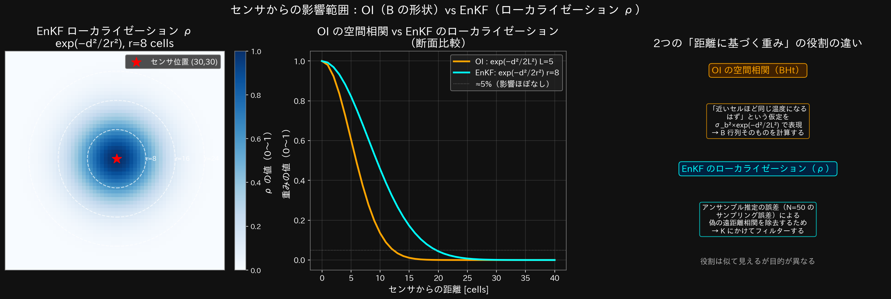
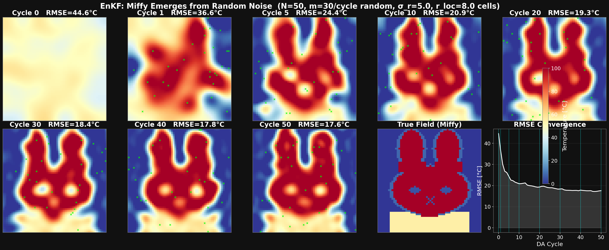
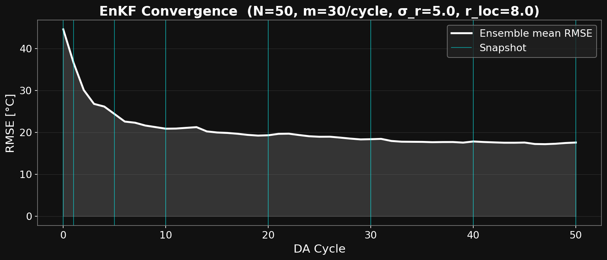
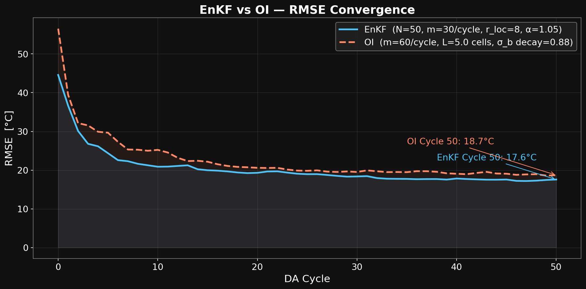

# アンサンブルカルマンフィルタ（EnKF）によるデータ同化

> **対象読者：** OI の仕組みをざっくり理解している方。[`oi_method.md`](oi_method.md) を先に読むと比較がわかりやすいです。  
> **コード：** `python/enkf_miffy.py`

---

## 1. まずゴールを見てみよう


- **左：** EnKF が推定している温度場（50 本のアンサンブルの平均）
- **右：** 正解のミッフィー温度場（アルゴリズムには直接見せない）
- **緑の×：** センサー位置（1 サイクルに 30 点、全 3600 格子点の 0.8%）

OI と同様にノイズからミッフィーが浮かび上がりますが、
EnKF は後半サイクルもじわじわ改善し続け、最終的により鮮明な輪郭を再現します。

---

## EnKFを理解する前に：基本概念

### データ同化とは何か

**データ同化（Data Assimilation, DA）** とは、
「計算機上のシミュレーション」と「現実の観測データ」を組み合わせて、
現実に近い状態を推定する手法です。

天気予報を例にすると：

```
シミュレーション（予報モデル）    観測データ（気象センサ）
      ↓                               ↓
  「予報」（モデルが予測した状態）  「観測値」（センサが測った値）
              ↓ 組み合わせる
          「解析値」（修正された、より正確な状態）
```

このデモでは：
- **シミュレーション** = 50 個の仮の温度場（アンサンブル）
- **観測データ** = グリッド上にランダムに置いた 30 個の温度センサ
- **推定したいもの** = ミッフィーの温度分布（正解場）

---

### 「状態」とは何か

このデモの「状態」は 60×60 グリッドの全セルの温度値です。

グリッドを行優先で 1 列に並べると、長さ $n = 3600$ のベクトルになります。

```
2D グリッド (60行 × 60列):          1D 状態ベクトル x（長さ3600）:

  列0  列1 ... 列59                 x = [ T[0,0], T[0,1], ..., T[0,59],
行0 [ T  ,  T , ...,  T  ]               T[1,0], T[1,1], ..., T[1,59],
行1 [ T  ,  T , ...,  T  ]               ...
...                                        T[59,0],..., T[59,59] ]
行59[ T  ,  T , ...,  T  ]
```

セルの通し番号（インデックス）と行・列の対応：

$$\text{インデックス} = i_y \times NX + i_x
\quad \Longleftrightarrow \quad
i_y = \lfloor \text{インデックス} / NX \rfloor, \quad
i_x = \text{インデックス} \bmod NX$$

例：インデックス 180 → $i_y = 180 // 60 = 3$（4行目）、$i_x = 180 \% 60 = 0$（0列目）

**ファイル：** `python/enkf_miffy.py`　行 42〜43, 95〜96

```python
NX, NY = 60, 60
n = NX * NY   # = 3600  ← 状態ベクトルの次元

iy_all = np.arange(n) // NX   # 各インデックスの行番号 shape (3600,)
ix_all = np.arange(n) % NX    # 各インデックスの列番号 shape (3600,)
```

---

### 「アンサンブル」とは何か

**アンサンブル（ensemble）** とは「複数の並行した推定値の集合」です。

正解の温度場は 1 つですが、私たちはそれを知りません。
そこで「ありえそうな温度場」を $N=50$ 個同時に持ち歩きます。

```
アンサンブルメンバー（50個の温度場の候補）:

メンバー1: [ 48°C, 51°C, 47°C, ... ]  ← 60×60=3600個の温度値
メンバー2: [ 53°C, 49°C, 52°C, ... ]
メンバー3: [ 45°C, 55°C, 50°C, ... ]
...
メンバー50:[ 50°C, 48°C, 53°C, ... ]
```

これを行列 $\mathbf{X}$ として表します：

$$\mathbf{X} = [\mathbf{x}^{(1)}, \mathbf{x}^{(2)}, \ldots, \mathbf{x}^{(N)}]
\in \mathbb{R}^{n \times N} = \mathbb{R}^{3600 \times 50}$$

**ファイル：** `python/enkf_miffy.py`　行 105

```python
X = np.zeros((n, N_ENS))   # shape (3600, 50) ← 行=セル、列=メンバー
```

各列 `X[:, i]` が 1 つのメンバーの温度場（3600 要素のベクトル）です。

---

### EnKFの基本的なアイデア

EnKF が何を繰り返すかを一言で言うと：

> 「50 個の並行推定値の**統計的なばらつきパターン**を使って、
> センサの観測値に合わせて 50 個全員を修正する」

これを 50 サイクル繰り返すと、50 個の推定値の平均がミッフィーの形に収束します。

---

## 問題設定

| パラメータ | 変数名 | 値 | なぜこの値か |
|-----------|--------|-----|------------|
| グリッドサイズ | `NX, NY` | 60, 60 | ミッフィーの絵が表現できる最小限の解像度 |
| 状態次元 | `n` | 3600 | NX × NY = 60 × 60 |
| アンサンブルサイズ | `N_ENS` | 50 | 多いほど精度が上がるが計算コストも増加。50 はトレードオフ |
| センサ数/サイクル | `M_OBS` | 30 | 3600 セルのうち 0.8%。スパース観測の典型 |
| 観測誤差標準偏差 | `SIGMA_R` | 5.0 °C | センサの測定誤差。小さいほど観測を信頼 |
| ローカライゼーション半径 | `R_LOC` | 8.0 cells | センサから遠い領域への更新を制限 |
| 初期背景誤差 | `SIGMA_B` | 30.0 °C | 初期アンサンブルの広がり。大きいほど「何も知らない」状態 |
| 空間相関長 | `CORR_L` | 5.0 cells | 初期アンサンブルの滑らかさ |
| インフレーション係数 | `INFL` | 1.05 | アンサンブルの広がりを維持するための増幅率 |
| DAサイクル数 | `N_CYC` | 50 | 観測とモデルを統合する回数 |

**ファイル：** `python/enkf_miffy.py`　行 85〜93

```python
rng     = np.random.default_rng(42)   # 乱数シード（再現性のため固定）
N_ENS   = 50
M_OBS   = 30
SIGMA_R = 5.0
N_CYC   = 50
R_LOC   = 8.0
SIGMA_B = 30.0
CORR_L  = 5.0
INFL    = 1.05
```

---

## アルゴリズムの全体像

### 計算領域とセンサ配置


- 左：正解場（ミッフィー）。アルゴリズムはこれを直接見られない
- 中：EnKF のセンサ 30 点とローカライゼーション半径 r=8 cells
- 右：OI のセンサ 60 点とガウス相関長 L=5 cells

---

### 処理の流れ

```
━━━━━━━━━━━━━━━━━━━━━━━━━━━━━━━━━━━━━━━━━━━━━━━━━━━━
 【初期化】1回だけ実行
━━━━━━━━━━━━━━━━━━━━━━━━━━━━━━━━━━━━━━━━━━━━━━━━━━━━

  x_true (3600,) = make_miffy()            ← 正解場（直接見えない）  行 79
  ↓
  X (3600×50) = 50°C ± 空間相関ノイズ×30°C ← 50本をランダム生成    行 105〜110

━━━━━━━━━━━━━━━━━━━━━━━━━━━━━━━━━━━━━━━━━━━━━━━━━━━━
 【DA サイクル × 50回】enkf_step(X)  行 115〜154
━━━━━━━━━━━━━━━━━━━━━━━━━━━━━━━━━━━━━━━━━━━━━━━━━━━━

  ┌─ STEP 1：センサ配置・観測 ─────────────────────────────────┐
  │  obs_idx (30,) = rng.choice(3600, size=30)              行 119   │
  │  y (30,) = x_true[obs_idx] + ε,  ε~N(0,5²)             行 130   │
  └────────────────────────────────────────────────────────────────┘
       ↓
  ┌─ STEP 2：アンサンブル統計量 ───────────────────────────────┐
  │  xbar (3600,1) = X.mean(axis=1)         ← 50本の平均     行 133  │
  │  Xp   (3600,50)= X - xbar              ← 各メンバー-平均 行 134  │
  │  HXp  (30,50)  = Xp[obs_idx, :]        ← センサ位置に射影行 137  │
  └────────────────────────────────────────────────────────────────┘
       ↓
  ┌─ STEP 3：ローカライゼーション行列 ρ ────────────────────────┐
  │  rho (3600,30) = exp(-d(セルi,センサj)² / 2×8²)     行 125〜127  │
  │                  近いほど1、遠いほど0                             │
  └────────────────────────────────────────────────────────────────┘
       ↓
  ┌─ STEP 4：イノベーション共分散 S ───────────────────────────┐
  │  S (30,30) = HXp@HXp.T/(N-1) + σ_r²×I               行 140     │
  │              ↑アンサンブル推定のセンサ間分散  ↑観測誤差           │
  └────────────────────────────────────────────────────────────────┘
       ↓
  ┌─ STEP 5：カルマンゲイン K ──────────────────────────────────┐
  │  K_loc (3600,30) = Xp@HXp.T/(N-1) @ inv(S) * rho     行 143    │
  │                    ↑全セル×センサ共分散  ↑S^-1   ↑ローカライズ  │
  └────────────────────────────────────────────────────────────────┘
       ↓
  ┌─ STEP 6：50本全メンバーを更新 ─────────────────────────────┐
  │  innov (30,50) = y[:,None] + ε^(i) - X[obs_idx,:]  行 146〜147  │
  │                  ↑観測値    ↑摂動    ↑各メンバーの予測値         │
  │  X_new (3600,50) = X + K_loc @ innov                  行 148    │
  └────────────────────────────────────────────────────────────────┘
       ↓
  ┌─ STEP 7：インフレーション ──────────────────────────────────┐
  │  X_new = xbar_new + 1.05×(X_new - xbar_new)        行 151〜152  │
  │          ↑平均(変えない)  ↑偏差だけ1.05倍に拡大                  │
  └────────────────────────────────────────────────────────────────┘
       ↓ X ← X_new（次サイクルへ）

━━━━━━━━━━━━━━━━━━━━━━━━━━━━━━━━━━━━━━━━━━━━━━━━━━━━
 【出力】
━━━━━━━━━━━━━━━━━━━━━━━━━━━━━━━━━━━━━━━━━━━━━━━━━━━━

  X.mean(axis=1).reshape(60,60) → ミッフィーに収束した推定値
```

---

### センサ 1 点が格子全体をどう更新するか（カルマンゲイン K の空間分布）


- **左（OI）：** センサ中心からガウス型に滑らかに広がる。形はサイクルを通じて変わらない
- **中（EnKF）：** アンサンブルが学習した実際の構造を反映。ローカライゼーション半径（白破線）外はゼロに近い

#### K の「1 列」が何を意味するか

K_loc は (3600 行 × 30 列) の行列です。  
**列 $j$ =「センサー $j$ が各セルに与える影響の空間マップ」** です。

```
K_loc (3600 × 30 の行列)

            センサー0   センサー1  ...  センサー29
  セル  0  [  0.00  ,   0.00  , ... ,  0.52  ]  ← センサー29 と同じ部位
  セル  1  [  0.00  ,   0.00  , ... ,  0.41  ]
  ...
  セル120  [  0.87  ,   0.00  , ... ,  0.00  ]  ← センサー0 と強く相関
  ...
  セル3599 [  0.00  ,   0.96  , ... ,  0.00  ]  ← センサー1 のすぐ近く

  ↑ 各列を 60×60 に reshape すると → センサー1点の「影響マップ」になる
```

#### OI の K と EnKF の K の根本的な違い

OI では K の形はガウス式で**固定**されます。
EnKF では K の形は**アンサンブルが決める**ため、サイクルが進むにつれて変わります。

```
Cycle 1 の K_loc[:, j]（まだランダムなアンサンブル）：
  センサー j のまわりにぼんやりとした影響範囲
  アンサンブルがまだ何も学んでいないので、ほぼランダムな形

                  ×（センサー j）
              ・ ・ ・ ・ ・
            ・ ・ ・ ・ ・ ・ ・
          ・ ・ ・ ・ ・ ・ ・ ・ ・    ← ぼんやりとしたブロブ
            ・ ・ ・ ・ ・ ・ ・
              ・ ・ ・ ・ ・


Cycle 50 の K_loc[:, j]（ミッフィーを学習したアンサンブル）：
  センサー j が顔（T_FUR=100°C）にある場合：
  → 同じ「顔の部位」のセルが強く相関 → K が大きい
  → 「背景の部位」のセルは相関しない → K がほぼゼロ

            ・ ・ ・ ・ ・（顔）
          ・ × ・ ・ ・ ・ ・          ← 顔のセルは影響大
          ・ ・ ・ ・ ・ ・ ・
  ───────────────────────────────  ← 境界（顔/背景の境）
           （背景）                  ← 境界を越えると K ≈ 0
```

これが EnKF が後半サイクルでも改善し続けられる理由です。
B が「ミッフィーの構造（境界・部位ごとの相関）」を学習することで、
鋭いエッジをより正確に再現できるようになります。

---

### センサからの影響範囲の違い（OI の B vs EnKF のローカライゼーション）



- **左：** EnKF ローカライゼーション ρ（r=8 cells）の空間分布
- **中：** OI の空間相関（L=5）と EnKF の ρ（r=8）の断面比較。OI の方が急速に減衰する
- **右：** 両者は「距離に基づく重み」だが**役割が全く異なる**

| | OI の B（ガウス式）| EnKF の ρ（ローカライゼーション）|
|-|------------------|---------------------------------|
| **役割** | 「近いセルは相関が強い」という仮定そのもの | アンサンブルの**サンプリング誤差を除去**するフィルター |
| **なくなったら** | K が計算できない（B が K の元）| 遠距離の偽相関が残りフィルターが発散する |
| **形** | Cycle を通じて変化しない | Cycle を通じて変化しない（距離だけで決まる）|

---

### イノベーション（観測−予測）が格子全体に伝播する様子


左から順に：
1. **正解場（ミッフィー）** — アルゴリズムには見せない
2. **初期推定値（アンサンブル平均）** — ランダムノイズ（全体が 50°C 付近）
3. **各センサーのイノベーション** — センサー位置での観測値とアンサンブル平均の差
4. **補正量が格子全体へ伝播** — `K_loc @ innov` の結果（下記で詳述）

---

#### ④ の中身：EnKF の `K_loc @ innov` で何が起きているか

OI との最大の違いは、`innov` が **(30, 50)** の行列であることです。  
50 メンバー全員がそれぞれ**自分専用のイノベーション**を持ちます。

```
innov (30 × 50 の行列)：

           メンバー1  メンバー2  ...  メンバー50
センサー0  [ -45.7  ,  -38.2  , ... ,  -51.3  ]  ← 各メンバーの予測値が違うため
センサー1  [ +32.1  ,  +28.5  , ... ,  +35.0  ]    イノベーションも全員異なる
...
センサー29 [  -8.3  ,  -12.1  , ... ,   -5.6  ]
```

**K_loc @ innov の計算：**

```
K_loc (3600 × 30) @ innov (30 × 50) = 補正量 (3600 × 50)

補正量[セル i, メンバー k]
  = K_loc[i,0]×innov[0,k] + K_loc[i,1]×innov[1,k] + ... + K_loc[i,29]×innov[29,k]
    ↑センサー0の寄与          ↑センサー1の寄与                  ↑センサー29の寄与
```

**1 サイクルの更新の流れ（3 メンバーで簡略化）：**

```
【更新前】アンサンブル X（各列が 1 メンバーの温度場）

セル i  [ メンバー1: 48°C , メンバー2: 52°C , メンバー3: 44°C ]
                ↓ それぞれのイノベーションで修正
センサー j（顔 100°C）に対して：
  メンバー1 の予測値 X[j,0] = 55°C → innov = 100 - 55 = +45°C
  メンバー2 の予測値 X[j,1] = 40°C → innov = 100 - 40 = +60°C
  メンバー3 の予測値 X[j,2] = 70°C → innov = 100 - 70 = +30°C

K_loc[i, j] = 0.8（セル i はセンサー j と同じ顔部位で強く相関）

補正量：
  メンバー1: 0.8 × 45 = +36°C
  メンバー2: 0.8 × 60 = +48°C
  メンバー3: 0.8 × 30 = +24°C

【更新後】
  メンバー1: 48 + 36 = 84°C
  メンバー2: 52 + 48 = 100°C  ← ほぼ正解（顔は 100°C）に収束
  メンバー3: 44 + 24 = 68°C
```

メンバーごとに補正量が異なるため、更新後もアンサンブルはばらつきを保ちます。
これが OI（1 本のみ更新）との根本的な違いです。

**センサーがない領域はどうなるか：**

```
センサー j（顔）からの影響マップ K_loc[:, j]：

  センサー j（顔）に近い顔のセル  → K_loc[i, j] が大きい → 大きく修正
  センサー j（顔）から遠い背景セル → ローカライゼーションで ρ ≈ 0 → 修正されない
  センサー j（顔）に近い背景セル  → ρ は大きいが、アンサンブルが
                                      「顔と背景は相関しない」を学習しているため
                                      K_loc[i, j] ≈ 0 → 修正されない  ← OI との違い！
```

OI では「距離が近い = 修正される」でしたが、
EnKF では「**距離が近い かつ 同じ部位（相関が高い）= 修正される**」という、
より物理的な条件で修正が届きます。

---

### 各ステップで扱う変数の shape

| ステップ | 変数 | shape | 意味 |
|---------|------|-------|------|
| 初期化 | `X` | (3600, 50) | アンサンブル行列（行=セル、列=メンバー） |
| STEP 1 | `obs_idx` | (30,) | センサのセル番号 |
| STEP 1 | `y` | (30,) | 観測値（センサが測った温度） |
| STEP 2 | `xbar` | (3600, 1) | アンサンブル平均 |
| STEP 2 | `Xp` | (3600, 50) | アンサンブル偏差行列（B 行列の源） |
| STEP 2 | `HXp` | (30, 50) | センサ位置での偏差（射影後） |
| STEP 3 | `rho` | (3600, 30) | ローカライゼーション重み |
| STEP 4 | `S` | (30, 30) | イノベーション共分散（≈ HBH^T + R） |
| STEP 5 | `K_loc` | (3600, 30) | ローカライズ済みカルマンゲイン |
| STEP 6 | `innov` | (30, 50) | イノベーション（観測−予測、50 メンバー分） |
| STEP 6 | `X_new` | (3600, 50) | 更新後のアンサンブル |

---

## アルゴリズム

### 初期アンサンブルの生成

**目的：** 「真の状態（ミッフィー）は全く知らない」という状態を、
50 個の異なる温度場でコンピュータ上に表現する。

#### 50個の候補はどうやって決めているか

**一言で言うと：「ランダムに生成している」です。**

正解の温度場（ミッフィー）は完全に未知という前提でスタートするので、
正解を知って決めているわけではありません。

EnKF の考え方は次の通りです：

> 「正解は知らないが、**ありえそうな範囲でバラバラな候補を用意して、
> 観測のたびに候補群を正解に近づける**」

なので候補の初期値は「よくわからないなりに合理的」であれば十分です。
重要なのは**多様性（多くのありえる状態をカバーしていること）**であり、正確さではありません。

ミッフィーの温度は 0〜100°C の範囲に分布しています。
「どのセルが何°C かは全くわからない」という状態を表現するために：

```
平均 = 50°C    ← 0〜100°C の中央値。「何も知らない」最良の出発点
スプレッド = ±30°C ← 50±30 = 20〜80°C の範囲でランダムにばらつく
```

50 個のメンバーはそれぞれ**独立に**このルールでランダム生成されます。
結果として「メンバー1は顔が高温」「メンバー2は胴体が高温」のように互いに異なる温度場になります。

| 疑問 | 答え |
|------|------|
| 何を決めているか | 何も決めていない。ランダム生成 |
| なぜランダムでよいか | 正解を知らないので、ありえる範囲を広く網羅する方が良い |
| 平均 50°C にする理由 | 温度範囲 0〜100°C の中央。偏りのない出発点 |
| 50 個ある理由 | 多いほど共分散の推定精度が上がるが計算コストも増える。50 はそのトレードオフ |
| サイクルが進むと | 観測のたびに 50 個全員が修正されて、徐々に正解に近づいていく |

#### 毎サイクル、50個のメンバーは作り直すのか

**作り直しません。最初の一度だけ生成し、その後は毎サイクル「修正（上書き）」されます。**

```
【初期化（1回だけ）】
  50個のメンバーをランダム生成 → X（3600×50 の行列）

【DAサイクル 1〜50（繰り返し）】
  X を観測に近づける方向に修正 → X が上書きされる
  ※ メンバーを捨てて作り直すわけではない
```

毎サイクル新たにランダムに決めているのは「**センサの位置**」と「**観測ノイズ**」だけです：

```python
# enkf_step() の中で毎サイクル実行される処理
obs_idx = rng.choice(n, size=M_OBS, replace=False)          # センサ位置（毎回変わる）
y       = x_true[obs_idx] + rng.normal(0.0, SIGMA_R, ...)   # 観測ノイズ（毎回変わる）
eps     = rng.normal(0.0, SIGMA_R, size=(M_OBS, N))         # 摂動観測ノイズ（毎回変わる）

# アンサンブル X 自体は上書きで更新（作り直しではない）
X_new = X + K_loc @ innov    # X に補正量を足すだけ
X = X_new                    # 次のサイクルに持ち越す
```

サイクルごとにメンバーの値がどう変化するか：

```
サイクル0  メンバー1: [48°C, 53°C, ...]  ← ランダム生成（初回のみ）
           メンバー2: [51°C, 49°C, ...]

サイクル1  メンバー1: [40°C, 45°C, ...]  ← 観測で修正（同じ50個が変化）
           メンバー2: [42°C, 41°C, ...]
              ...
サイクル50 メンバー1: [ 3°C, 98°C, ...]  ← ミッフィーに近づいた状態
           メンバー2: [ 2°C, 100°C, ...]
```

この「修正する仕組み」が次以降のセクションで説明するカルマンゲインによる更新です。

**ファイル：** `python/enkf_miffy.py`　行 105〜110

```python
X = np.zeros((n, N_ENS))           # アンサンブル行列 X の初期化 shape (3600, 50)
for i in range(N_ENS):             # 50個のメンバーを1つずつ生成
    noise     = rng.normal(0.0, 1.0, size=(NY, NX))   # 行107: 独立乱数 ξ ~ N(0,1)
    noise_cor = gaussian_filter(noise, sigma=CORR_L)   # 行108: 空間相関を付与
    noise_cor = noise_cor / (noise_cor.std() + 1e-8) * SIGMA_B  # 行109: 標準化 × σ_b
    X[:, i]   = (50.0 + noise_cor).flatten()           # 行110: 平均50°C + 摂動
```

生成される初期メンバーの式：

$$x^{(i)} = \underbrace{50}_{\text{平均温度}} + \underbrace{\sigma_b \cdot \frac{G_L * \xi^{(i)}}{\mathrm{std}(G_L * \xi^{(i)})}}_{\text{スプレッド（空間相関ノイズ）}}$$

| 要素 | 値 | 意味 |
|------|-----|------|
| 平均 50°C | — | 温度の範囲が 0〜100°C なのでその中間から出発 |
| `SIGMA_B = 30.0` | 30°C | アンサンブルの広がり。「±30°C の範囲でどの温度でもありえる」という意味 |
| `CORR_L = 5.0` | 5 cells | 空間相関長（後述） |

---

#### なぜ「空間相関ノイズ」が必要か

**問題：各セルを完全に独立な乱数で初期化した場合**

```python
# NG な初期化（独立乱数）
X[:, i] = np.random.normal(50, SIGMA_B, size=n)
# → セル0 と セル1 は全く独立なランダム値
```

この場合、離れたセル $i$ と $j$ の間の共分散がゼロになります：

$$[\mathbf{B}]_{ij}
= \frac{1}{N-1}\sum_{k=1}^{N} x'^{(k)}_i \, x'^{(k)}_j \approx 0
\quad (i \neq j)$$

共分散がゼロだと、カルマンゲイン $\mathbf{K}$ の非対角成分もゼロになります：

$$K_{ij} \approx 0
\quad \text{（センサ }j\text{ の観測が格子点 }i\text{ に全く伝わらない）}$$

結果として、センサがある 1 点だけが更新され、
周囲のセルには情報が伝播しません。これではデータ同化として機能しません。

**解決策：ガウスフィルタで空間的に滑らかなノイズを作る**

---

#### ガウスフィルタで空間相関を付与する仕組み

**ファイル：** `python/enkf_miffy.py`　行 107〜108

```python
noise     = rng.normal(0.0, 1.0, size=(NY, NX))   # 行107: 各セル独立 ξ ~ N(0,1)
noise_cor = gaussian_filter(noise, sigma=CORR_L)   # 行108: ガウスフィルタ適用
```

ガウスフィルタは各セルに対して、周囲のセルの値の**加重平均**を取ります。
重みは距離が近いほど大きく、遠いほど小さいガウス分布形状です：

$$\tilde{\xi}^{(i)} = G_L * \xi^{(i)},
\qquad G_L(d) \propto \exp\!\left(-\frac{d^2}{2L^2}\right)$$

| パラメータ $d$ | 重み $G_L(d)$ | 意味 |
|-----------|--------------|------|
| $d = 0$ | 1.0 | 自分自身（最大重み） |
| $d = L = 5$ | $e^{-0.5} \approx 0.61$ | 相関長 $L$ の距離で重みが約 61% |
| $d = 2L = 10$ | $e^{-2} \approx 0.14$ | 相関長の 2 倍で重みが約 14% |
| $d = 3L = 15$ | $e^{-4.5} \approx 0.01$ | ほぼ 0 → 無関係 |

フィルタ適用後は、隣接セルが似た値を持つ「滑らかなノイズ場」になります。
→ 隣接セル間に正の共分散が生まれ、カルマンゲインの非対角成分が非ゼロになる
→ センサ点の観測が近傍格子点にも情報を伝播できるようになる

---

#### 標準化 × σ_b の意味

ガウスフィルタを通した後、ノイズの標準偏差はフィルタの影響で変化します。
設計した値（`SIGMA_B = 30°C`）に合わせるために標準化します。

**ファイル：** `python/enkf_miffy.py`　行 109

```python
noise_cor = noise_cor / (noise_cor.std() + 1e-8) * SIGMA_B
#                      ^^^^^^^^^^^^^^^^^^^
#                      ÷ std で標準偏差を1に正規化（+1e-8 はゼロ除算防止）
#                                              ^^^^^^^^
#                                              × σ_b でスプレッドを設計値に設定
```

**ステップ1：標準化（`/ noise_cor.std()`）**

$$\frac{\tilde{\xi}^{(i)}}{\mathrm{std}(\tilde{\xi}^{(i)})}
\quad \Rightarrow \quad \mathrm{std} = 1$$

どんな入力が来ても標準偏差を 1 に揃えます。

**ステップ2：スケール設定（`* SIGMA_B`）**

$$\frac{\tilde{\xi}^{(i)}}{\mathrm{std}(\tilde{\xi}^{(i)})} \times \sigma_b
\quad \Rightarrow \quad \mathrm{std} = \sigma_b = 30\,\text{°C}$$

「初期の不確実性は ±30°C 程度」という設計意図を実現します。

**行107〜110 の全体まとめ：**

$$x^{(i)} = 50 + \sigma_b \cdot \frac{G_L * \xi^{(i)}}{\mathrm{std}(G_L * \xi^{(i)})}$$

```python
noise     = rng.normal(0.0, 1.0, size=(NY, NX))             # ξ^(i) ~ N(0,1)
noise_cor = gaussian_filter(noise, sigma=CORR_L)             # G_L * ξ^(i)
noise_cor = noise_cor / (noise_cor.std() + 1e-8) * SIGMA_B  # ÷std × σ_b
X[:, i]   = (50.0 + noise_cor).flatten()                    # 平均50°C + 摂動
```

---

### EnKF 更新式（1 サイクル）

以下の 7 ステップが `enkf_step(X)` 関数（行 115〜154）に実装されています。
1 サイクルごとに X（3600×50 の行列）が観測に近づく方向に更新されます。

---

### 観測：センサ位置をランダムに決定して計測する

**目的：** グリッドの一部のセルで温度を測り、正解場の情報を取得する。

**ファイル：** `python/enkf_miffy.py`　行 119〜130

```python
# Random sensor locations this cycle
obs_idx = np.sort(rng.choice(n, size=M_OBS, replace=False))  # 行119
obs_iy  = obs_idx // NX                                        # 行120: 各センサの行番号
obs_ix  = obs_idx % NX                                         # 行121: 各センサの列番号
R_diag  = np.full(M_OBS, SIGMA_R**2)                          # 行122: R の対角成分（σ_r²）

# Observations from true field + noise
y = x_true[obs_idx] + rng.normal(0.0, SIGMA_R, size=M_OBS)   # 行130
```

---

#### ミッフィーの温度場（正解場 x_true）

「正解の温度場」はミッフィーの各部位に固定温度を割り当てた 60×60 グリッドです。

**ファイル：** `python/enkf_miffy.py`　行 48〜49, 79〜80

```python
T_BG      =  0.0   # 背景（空気）
T_OUTLINE =  8.0   # 輪郭線（薄い影）
T_FUR     = 100.0  # 白いファー（顔・耳・胴体表面）
T_EYE     =  5.0   # 目
T_MOUTH   =  5.0   # 口
T_DRESS   = 55.0   # ワンピース（体の下半分）
T_COLLAR  = 70.0   # 襟（ワンピースの首元）

x_true_2d = make_miffy()          # shape (60, 60) の2次元温度場
x_true    = x_true_2d.flatten()   # shape (3600,)  の1次元状態ベクトル
```

`x_true` は 60×60 の2次元配列を行優先（C-order）で 1D に並べたもの：

```
x_true_2d (60×60):                    x_true (3600,):
┌─────────────────────────┐
│ 行0: T[0,0]...T[0,59]   │  →  [T[0,0], T[0,1], ..., T[0,59],
│ 行1: T[1,0]...T[1,59]   │      T[1,0], T[1,1], ..., T[1,59], ...]
│ ...                      │
└─────────────────────────┘
```

---

#### センサ位置の選択

3600 個のセルから 30 個をランダムに選びます（重複なし）。

$$obs\_idx \subset \{0, 1, \ldots, 3599\}, \quad |obs\_idx| = m = 30$$

```python
obs_idx = np.sort(rng.choice(n, size=M_OBS, replace=False))
```

例：`obs_idx = [42, 118, 305, 601, ...]`（毎サイクル変わる）

各インデックスから行・列を取り出します：

```python
obs_iy = obs_idx // NX   # 例: 118 // 60 = 1  → 1行目
obs_ix = obs_idx % NX    # 例: 118 % 60  = 58 → 58列目
```

---

#### 観測演算子 H とは

観測演算子 $H$ は「全セル（3600点）の状態から、センサ位置（30点）の値を取り出す操作」です。

数学的には $(m \times n) = (30 \times 3600)$ の行列ですが、コードでは**インデックス配列**で表現します：

$$H\mathbf{x} \quad \Longleftrightarrow \quad \texttt{x[obs\_idx]}$$

$H$ を陽に作ると $30 \times 3600 = 108000$ 要素の行列が必要ですが、
インデックス配列なら `obs_idx`（30 要素）だけで済みます。

---

#### 正解温度の取り出し

センサ位置の正解温度を取り出す操作が $H\mathbf{x}^{\text{true}}$ に対応します：

$$H\mathbf{x}^{\text{true}} \quad \Longleftrightarrow \quad \texttt{x\_true[obs\_idx]}$$

```python
x_true[obs_idx]
# → [x_true[42], x_true[118], x_true[305], ...]  shape (30,)
# → [  0.0°C,      0.0°C,      55.0°C,    ...]
#     (背景)        (背景)      (DRESS=ワンピース)
```

---

#### 観測値 y の生成

現実のセンサには測定誤差があります。これを乱数で模擬します：

$$\mathbf{y} = H\mathbf{x}^{\text{true}} + \boldsymbol{\varepsilon},
\quad \boldsymbol{\varepsilon} \sim \mathcal{N}(\mathbf{0}, \mathbf{R}),
\quad \mathbf{R} = \sigma_r^2 I_m = (5.0)^2 I_{30}$$

$\mathbf{R}$ は $m \times m = 30 \times 30$ の対角行列で、
対角成分が $\sigma_r^2 = 25\,(\text{°C})^2$（センサごとに独立な誤差）。

```python
y = x_true[obs_idx]  +  rng.normal(0.0, SIGMA_R, size=M_OBS)
#   H x_true         +  ε ~ N(0, σ_r² I)     shape (30,)
#   shape (30,)          shape (30,)
```

`R_diag = np.full(M_OBS, SIGMA_R**2)` は後で $\mathbf{R}$ の対角成分として使います：

```python
R_diag = np.full(M_OBS, SIGMA_R**2)   # [25, 25, ..., 25]  shape (30,)
```

---

#### なぜ毎サイクルランダムに再配置するか

センサを固定すると、「観測されないセル」が常に同じ場所になります。
その結果、境界付近のセルで誤った方向の更新が蓄積してしまい、RMSE が増加します。

毎サイクルランダムに変えると、誤った更新が平均化されてフィルターが安定します
（コード冒頭の docstring に "Key design choices" として記載）。

---

### アンサンブル統計量

**目的：** 50 個のメンバーから「平均（最良推定値）」と「メンバー間のばらつきパターン」を計算する。

**ファイル：** `python/enkf_miffy.py`　行 133〜137

```python
# Ensemble anomalies
xbar = X.mean(axis=1, keepdims=True)    # 行133: アンサンブル平均 shape (3600, 1)
Xp   = X - xbar                         # 行134: アンサンブル偏差 shape (3600, 50)

# Project to obs space
HXp = Xp[obs_idx, :]                    # 行137: センサ位置への射影 shape (30, 50)
```

---

#### アンサンブル平均 $\bar{\mathbf{x}}$

50 個のメンバーを平均したもの。これが「現在の最良推定値」です。

$$\bar{\mathbf{x}} = \frac{1}{N}\sum_{i=1}^N \mathbf{x}^{(i)} \in \mathbb{R}^n$$

```python
xbar = X.mean(axis=1, keepdims=True)
#            ^^^^^^^^
#            axis=1 → 列方向（メンバー方向）に平均をとる
#            keepdims=True → shape (3600,) でなく (3600, 1) にする（後でブロードキャストに使う）
```

---

#### アンサンブル偏差行列 $\mathbf{X}'$

各メンバーからアンサンブル平均を引いたもの。
「各メンバーが平均からどれだけずれているか」を表します。

$$\mathbf{X}' = \mathbf{X} - \bar{\mathbf{x}}\mathbf{1}^\top \in \mathbb{R}^{n \times N}$$

$i$ 番目の列：$\mathbf{X}'_{:,i} = \mathbf{x}^{(i)} - \bar{\mathbf{x}}$

```python
Xp = X - xbar
#        ^^^^
#        shape (3600, 1) が (3600, 50) にブロードキャストされる
#        → 各メンバー（列）から平均ベクトルを引く
```

```
X  (3600×50):                  xbar (3600×1):       Xp = X - xbar (3600×50):
         ①   ②  ... ⑳ ...⑳            ①                    ①    ②  ... ⑳
セル0  [ 48,  53, ..., 50 ]   [ 50.2 ]  →  セル0  [ -2.2,  2.8, ..., -0.2 ]
セル1  [ 51,  49, ..., 47 ]   [ 49.8 ]      セル1  [  1.2, -0.8, ..., -2.8 ]
...
```

---

#### アンサンブルによる背景誤差共分散行列 $\mathbf{B}$ の近似

$\mathbf{X}'$ を使うと、$n \times n$ の共分散行列 $\mathbf{B}$ を陽に計算せずに近似できます：

$$\mathbf{B} \approx \frac{1}{N-1}\mathbf{X}'(\mathbf{X}')^\top \in \mathbb{R}^{n \times n}$$

ただし $n \times n = 3600 \times 3600 = 12960000$ 要素は巨大なので、
**この行列は実際には作らず**、因数分解された形 $\mathbf{X}'$ のまま計算を進めます。

---

#### 観測空間への射影 $H\mathbf{X}'$

全 3600 セルの偏差行列 $\mathbf{X}'$ から、センサがある 30 行だけ抜き出します。
これが「観測空間への射影」で、コードでは行インデックスで表現します：

$$H\mathbf{X}' \quad \Longleftrightarrow \quad \texttt{Xp[obs\_idx, :]}$$

```python
HXp = Xp[obs_idx, :]   # shape (30, 50)
```

```
Xp (3600×50):                      HXp = Xp[obs_idx, :] (30×50):
         ①    ②  ... ⑳              ①    ②  ... ⑳
セル0  [ ... ]                インデックス42  [ ... ] ← センサ位置1（obs_idx[0]=42）
セル1  [ ... ]                インデックス118 [ ... ] ← センサ位置2（obs_idx[1]=118）
...                           ...            shape (30, 50)
セル3599[ ... ]
```

この操作の意味：「50 個のメンバーが、センサ位置でどれほどばらつくか」を取り出す。
これが後のカルマンゲイン計算の核心データになります。

---

### イノベーション共分散（$m \times m$ の小行列）

**目的：** 「センサ位置でのアンサンブルのばらつき」＋「センサの測定誤差」を合算した行列 $\mathbf{S}$ を作る。
この行列が「観測をどの程度信頼するか」の基準になります。

**イノベーションとは** → 「観測値と予測値の差」のこと。
$\mathbf{y} - H\bar{\mathbf{x}}$ が「センサが測った値」と「アンサンブル平均が予測した値」の差です。

**ファイル：** `python/enkf_miffy.py`　行 139〜140

```python
# Innovation covariance  (m x m)
S = (HXp @ HXp.T) / (N - 1) + np.diag(R_diag)    # 行140
#    ^^^^^^^^^^^^^   ^^^^^^^^   ^^^^^^^^^^^^^^^^
#    HX'(HX')^T    ÷(N-1)    + R（観測誤差）
#    shape(30,30)               shape(30,30)
#    センサ位置のアンサンブル分散
```

式で書くと：

$$\mathbf{S} = \frac{1}{N-1}(H\mathbf{X}')(H\mathbf{X}')^\top + \mathbf{R}
\in \mathbb{R}^{m \times m}$$

---

#### 各項の意味

**第1項：$\frac{1}{N-1}(H\mathbf{X}')(H\mathbf{X}')^\top$**

センサ位置でのアンサンブルの分散・共分散行列です。
$[S_{\text{ens}}]_{jk}$ は「センサ $j$ と センサ $k$ の温度が一緒に変動する度合い」。

具体例：
- センサ $j$ と センサ $k$ が同じ部位（例えば両方 T_FUR=100°C のセル）にあれば → 共分散大
- センサ $j$ が T_FUR=100°C の部位、センサ $k$ が T_BG=0°C の部位 → 共分散負

**第2項：$\mathbf{R} = \sigma_r^2 I_m$**

センサの測定誤差。対角行列なので「センサ間の誤差は独立」を意味します：

```python
R_diag = np.full(M_OBS, SIGMA_R**2)   # [25.0, 25.0, ..., 25.0]  30個
np.diag(R_diag)                         # (30×30) の対角行列
```

---

#### なぜ $m \times m$（30×30）の逆行列だけで済むのか

本来のカルマンフィルタでは $n \times n = 3600 \times 3600$ の逆行列が必要ですが、
EnKF では代数的な式変形により、センサ数 $m = 30$ の小さな逆行列だけで計算できます：

$$\mathbf{K} = \underbrace{\frac{1}{N-1}\mathbf{X}'(H\mathbf{X}')^\top}_{(3600 \times 30)}
\cdot \underbrace{\mathbf{S}^{-1}}_{(30 \times 30)}$$

$\mathbf{S}^{-1}$ は $(30 \times 30)$ の逆行列なので計算コストが極めて小さい。
これが「EnKF が大規模問題に適用できる」理由の 1 つです。

---

### カルマンゲイン（$n \times m$）

**目的：** 「各センサの観測値が、各セルの温度を何°C 修正すべきか」の重み行列を計算する。

$$\mathbf{K} = \frac{1}{N-1}\mathbf{X}'(H\mathbf{X}')^\top \mathbf{S}^{-1}
\in \mathbb{R}^{n \times m} = \mathbb{R}^{3600 \times 30}$$

**ファイル：** `python/enkf_miffy.py`　行 143

```python
# Localized Kalman gain  (n x m)
K_loc = (Xp @ HXp.T) / (N - 1) @ np.linalg.inv(S) * rho    # 行143
#        ^^^^^^^^^^^   ^^^^^^^^   ^^^^^^^^^^^^^^^^^   ^^^^
#        X'(HX')^T    ÷(N-1)    × S^{-1}            × ρ（ローカライゼーション）
#        (3600, 30)               (30, 30)
#        → 結果 shape (3600, 30)
```

---

#### カルマンゲインの物理的意味

$K_{ij}$ = 「セル $i$ の温度」が「センサ $j$ の温度」と一緒に変動する度合い / センサ誤差込みの分散

- $K_{ij}$ が大きい → センサ $j$ の観測がセル $i$ を大きく修正する
- $K_{ij}$ が小さい（≈0） → センサ $j$ の観測がセル $i$ にほとんど影響しない

**具体例：**
センサ $j$ がミッフィーの耳（T_FUR=100°C の領域）に置かれた場合、
顔（同じく T_FUR=100°C）のセルは一緒に高温になる傾向がある → $K_{ij}$ が大きい。
背景（T_BG=0°C）のセルとは温度が一緒に動かない → $K_{ij}$ が小さい。

---

#### 各因子の shape と意味

| 計算ステップ | shape | 意味 |
|------------|-------|------|
| `Xp @ HXp.T` | (3600, 30) | 全セルとセンサ位置の共分散（アンサンブルが推定） |
| `/ (N-1)` | — | 不偏推定量（$N$ でなく $N-1$ で割る） |
| `@ np.linalg.inv(S)` | (3600, 30) | $\mathbf{S}^{-1}$ で正規化（センサ誤差・センサ間相関を考慮） |
| `* rho` | (3600, 30) | ローカライゼーション（⑤で詳述） |

---

### ローカライゼーションの種類：B 局所化 vs R 局所化

EnKF のローカライゼーションには主に **2 種類**があります。このコードは **B 局所化（ゲインローカライゼーション）** を採用しています。

---

#### B 局所化（本コードの実装）

カルマンゲイン $\mathbf{K}$（shape: $n \times m$）に距離減衰行列 $\boldsymbol{\rho}$（同 shape）をシュール積（要素ごとの掛け算）で掛けます：

$$\mathbf{K}^{\text{loc}} = \mathbf{K} \circ \boldsymbol{\rho}$$

ここで $[\boldsymbol{\rho}]_{ij} = \exp\!\left(-\dfrac{d(i,j)^2}{2\,r_{\text{loc}}^2}\right)$ はグリッド点 $i$ と センサ $j$ の距離から計算。

- センサに近い格子点（$d \approx 0$）： $\rho \approx 1$ → $K^{\text{loc}} \approx K$（完全に更新）
- センサから遠い格子点（$d \gg r_{\text{loc}}$）： $\rho \approx 0$ → $K^{\text{loc}} \approx 0$（更新を抑制）

この方法は **共分散ローカライゼーション（covariance localization）** とも呼ばれます。背景誤差共分散行列 $\mathbf{P}_e$ に直接 $\boldsymbol{\rho}$ を掛ける形（$\boldsymbol{\rho} \circ \mathbf{P}_e$）と実質的に等価です。

---

#### R 局所化（本コードでは未使用）

各格子点 $i$ に対して、半径 $r_{\text{loc}}$ 以内のセンサだけを使って**局所解析**を行う方法です。
遠くのセンサーは「観測誤差が無限大」とみなして除外することと等価で、数式上は観測誤差共分散 $\mathbf{R}$ を変化させます：

$$R_{jj}^{(i)} = \frac{R_{jj}}{\rho(d(i,j))}$$

距離が遠い→ $\rho \to 0$ → $R_{jj}^{(i)} \to \infty$（センサ $j$ の情報をゼロにする）。
各格子点ごとにサイズの異なる局所的な連立方程式を解くため、計算コストが高い反面、大気・海洋の大規模 DA（ECMWF の LETKF など）では精度上有利になる場合があります。

---

#### B 局所化 vs R 局所化 の比較

| | B 局所化（本コード） | R 局所化 |
|---|---|---|
| **実装** | `K * rho`（$n \times m$ の要素積、一括） | 格子点ごとにローカル解析を解くループ |
| **計算コスト** | 低（行列積に付随する演算） | 高（格子点数 $n$ 倍のループ） |
| **イノベーション共分散 S** | すべてのセンサ間相関を保持（$m \times m$ の逆行列を一度だけ計算） | 局所センサのみ（小さい $m_{\text{local}} \times m_{\text{local}}$） |
| **主な用途** | 中規模以下のシステム、教育目的 | 大規模気象モデル（JMA, ECMWF 等） |

---

#### OI はローカライゼーションを使うか？

OI では背景誤差共分散行列 $\mathbf{B}$ をガウス関数で**解析的に定義**します：

$$[\mathbf{B}]_{ij} = \sigma_b^2 \exp\!\left(-\frac{d(i,j)^2}{2\,L^2}\right), \quad L = 5 \text{ cells}$$

この定義自体が「相関長 $L$ 以上の距離には相関がない」という**空間局所化を内包**しています。
したがって OI では EnKF のような「後付けのローカライゼーション」は不要であり、概念的に別物です。

| | OI の B | EnKF の ρ（ローカライゼーション）|
|---|---|---|
| **役割** | 「近いセルは相関が強い」という物理的仮定そのもの | アンサンブルのサンプリング誤差を除去するフィルター |
| **なくなったら** | K が計算できない（B が K の元） | 偽の遠距離相関が残り発散する |
| **形** | 全サイクルを通じて固定（$\sigma_b$ のみ変化） | 固定（距離だけで決まる） |
| **意味** | 「こういう空間構造があるはず」という事前知識 | 「遠くは相関しないはず」というサンプリング誤差の修正 |

---

### ガウス型ローカライゼーション（シュール積）

**目的：** アンサンブルサイズ $N=50$ が小さいことで生じる「偽の遠距離相関」を除去する。

---

#### なぜローカライゼーションが必要か

$N=50$ のアンサンブルから推定した共分散行列は**サンプリング誤差**を含みます。

例：グリッドの左上端（セル 0）と右下端（セル 3599）は、
物理的には 60√2 ≈ 85 セル離れており、温度に関係はないはずです。
しかし $N=50$ の有限サンプルでは偶然の相関（**擬似相関**）が生じます：

```
50個のメンバーで偶然、
「セル0 が高温のとき、セル3599 も高温」というパターンが見える
→ K[0, センサ] が非ゼロになり、誤った方向に更新される
```

これがローカライゼーションなしで発散する原因です。

---

#### ローカライゼーション行列 $\boldsymbol{\rho}$ の計算

センサ $j$ から格子点 $i$ までのユークリッド距離 $d(i,j)$ に基づく重み行列を計算します：

$$[\boldsymbol{\rho}]_{ij} = \exp\!\left(-\frac{d(i,j)^2}{2\,r_{loc}^2}\right)$$

- 距離 0（センサと同じセル）: $\rho = 1.0$（最大：完全に更新）
- 距離 = $r_{loc} = 8$ cells: $\rho = e^{-0.5} \approx 0.61$
- 距離 = $2 r_{loc} = 16$ cells: $\rho = e^{-2} \approx 0.14$
- 距離 = $3 r_{loc} = 24$ cells: $\rho \approx 0.01$（ほぼ無視）

**ファイル：** `python/enkf_miffy.py`　行 125〜127

```python
dy  = iy_all[:, None] - obs_iy[None, :]   # 行125: y方向距離 shape (3600, 30)
dx  = ix_all[:, None] - obs_ix[None, :]   # 行126: x方向距離 shape (3600, 30)
rho = np.exp(-0.5 * (dy**2 + dx**2) / R_LOC**2)  # 行127: ρ shape (3600, 30)
```

`iy_all[:, None]`（shape `(3600, 1)`）と `obs_iy[None, :]`（shape `(1, 30)`）の
ブロードキャストで、全セルと全センサの距離が一度に計算されます。

---

#### シュール積（要素ごとの掛け算）

カルマンゲイン $\mathbf{K}$ に $\boldsymbol{\rho}$ を要素ごとに掛けます：

$$\mathbf{K}^{\text{loc}} = \mathbf{K} \circ \boldsymbol{\rho}$$

コードでは `* rho` がシュール積に対応：

```python
K_loc = (Xp @ HXp.T) / (N - 1) @ np.linalg.inv(S) * rho
#                                                    ^^^^
#                                    K ∘ ρ（要素ごとの掛け算）
```

これにより、センサから遠いセル（$\rho \approx 0$）への更新が抑制されます。

---

### 確率的 EnKF 更新（摂動観測）

**目的：** カルマンゲインを使って 50 個全メンバーを観測値に近づける方向に修正する。

**更新式：**

$$\mathbf{x}^{a,(i)} = \mathbf{x}^{f,(i)} + \mathbf{K}^{\text{loc}}\!\left(\mathbf{y} + \boldsymbol{\varepsilon}^{(i)} - H\mathbf{x}^{f,(i)}\right),
\quad \boldsymbol{\varepsilon}^{(i)} \sim \mathcal{N}(\mathbf{0}, \mathbf{R})$$

記号の意味：

| 記号 | 意味 |
|------|------|
| $\mathbf{x}^{f,(i)}$ | 更新前（forecast）のメンバー $i$ の状態 |
| $\mathbf{x}^{a,(i)}$ | 更新後（analysis）のメンバー $i$ の状態 |
| $\mathbf{y}$ | 観測値（センサが測った 30 点の温度） |
| $\boldsymbol{\varepsilon}^{(i)}$ | メンバー $i$ に加える観測誤差の摂動（$\sigma_r = 5°C$） |
| $H\mathbf{x}^{f,(i)}$ | メンバー $i$ がセンサ位置で予測する温度 |
| $\mathbf{y} + \boldsymbol{\varepsilon}^{(i)} - H\mathbf{x}^{f,(i)}$ | イノベーション（観測と予測の差） |

---

#### イノベーション（観測と予測の差）とは

$\mathbf{y} - H\mathbf{x}^{f,(i)}$ は「センサが測った値」と「メンバー $i$ がそこで予測した値」のずれです。

```
例：センサ位置 obs_idx[0] = 42 がミッフィーの背景（T_BG = 0°C）にある場合

観測値 y[0]         = 0.0 + 2.3 = 2.3°C  （正解 + 測定誤差 2.3°C）
メンバー1 の予測値  = X[42, 0]  = 48.0°C （初期は 50°C 付近）
イノベーション[0]   = 2.3 - 48.0 = -45.7°C  ← これだけ修正が必要
```

$\mathbf{K}^{\text{loc}} \times \text{イノベーション}$ で「どのセルをどれだけ修正するか」が決まります。

---

#### コードとの対応

**ファイル：** `python/enkf_miffy.py`　行 145〜148

```python
# Stochastic EnKF update
eps   = rng.normal(0.0, SIGMA_R, size=(M_OBS, N))  # 行146: ε^(i) shape (30, 50)
innov = y[:, None] + eps - X[obs_idx, :]            # 行147: イノベーション shape (30, 50)
#       ^^^^^^^^    ^^^^^   ^^^^^^^^^^^^
#       y (30,1)   +ε^(i)  -Hx^f(i)（センサ位置の各メンバーの予測値）
X_new = X + K_loc @ innov                           # 行148: 更新 shape (3600, 50)
#       ^   ^^^^^   ^^^^^
#       x^f K_loc  ×イノベーション
```

`y[:, None]` は shape `(30,)` → `(30, 1)` への変換。
`(30, 1)` - `(30, 50)` のブロードキャストにより、
`y` の値を 50 メンバー全員に一度に適用します。

```
y[:, None] (30, 1) + eps (30, 50) - X[obs_idx, :] (30, 50)
= innov (30, 50)  ← 各メンバーに対して30センサ分のイノベーションが計算される
```

```
K_loc (3600, 30) @ innov (30, 50) = 補正量 (3600, 50)

この行列積の意味：
  補正量[セル i, メンバー k]
    = Σ_{j=0}^{29} K_loc[i,j] × innov[j,k]
      ↑                           ↑
    セル i とセンサー j の        メンバー k のセンサー j でのイノベーション
    「関係の強さ」（アンサンブルが学習）

→ セル i に「近くて相関の高いセンサー」の情報だけが届く
→ 50 メンバーが同じ K を使いつつ、それぞれ異なる innov で更新される
   = 全員が同じ方向に向かいつつ、多様性（スプレッド）が保たれる
```

---

#### なぜ観測に摂動 $\boldsymbol{\varepsilon}^{(i)}$ を加えるか（「確率的」の意味）

摂動なしで同じ $\mathbf{y}$ を使って全メンバーを更新すると、
全メンバーが同じ方向に同じ量だけ修正されてしまい、
アンサンブルのスプレッド（多様性）が不当に縮小します。

メンバーごとに異なる摂動 $\boldsymbol{\varepsilon}^{(i)}$ を加えることで、
更新後もアンサンブルが統計的に正しい共分散構造を維持します。
これが「確率的 EnKF」と呼ばれる理由です。

---

### 乗法インフレーション（更新後）

**目的：** 更新後にアンサンブルのスプレッドが縮みすぎるのを防ぐ。

---

#### アンサンブル崩壊とは何か

EnKF を繰り返すと、観測によって 50 個のメンバーが徐々に正解に近づきます。
これは良いことですが、同時にメンバー間のばらつきも小さくなっていきます。

```
サイクル0:  [ 20°C, 48°C, 75°C, 30°C, ... ]  ← ばらつきが大きい
サイクル10: [ 25°C, 27°C, 26°C, 25°C, ... ]  ← ほぼ同じ値になってしまう
```

ばらつきがゼロに近づくと $\mathbf{X}' \to \mathbf{0}$ となり、カルマンゲインもゼロに近づきます：

$$\mathbf{K} = \frac{1}{N-1}\mathbf{X}'(H\mathbf{X}')^\top \mathbf{S}^{-1} \to \mathbf{0}$$

$\mathbf{K} \approx \mathbf{0}$ になると更新量が極めて小さくなり、フィルターが「凍結」して改善しなくなります。

---

#### インフレーションの操作

更新後のアンサンブルの「偏差」だけを $\alpha = 1.05$ 倍に拡大します。
平均（最良推定値）は変えません。

$$\bar{\mathbf{x}}^a = \frac{1}{N}\sum_i \mathbf{x}^{a,(i)},
\qquad
\mathbf{X}^{\text{infl}} = \bar{\mathbf{x}}^a\mathbf{1}^\top
+ \alpha\,(\mathbf{X}^a - \bar{\mathbf{x}}^a\mathbf{1}^\top)$$

**ファイル：** `python/enkf_miffy.py`　行 151〜152

```python
# Post-update multiplicative inflation (prevents ensemble collapse)
xbar_new = X_new.mean(axis=1, keepdims=True)        # 行151: x̄^a  shape (3600, 1)
X_new    = xbar_new + INFL * (X_new - xbar_new)     # 行152: インフレーション適用
#          ^^^^^^^    ^^^^    ^^^^^^^^^^^^^^^^^^
#          x̄^a      α=1.05  (X^a - x̄^a)：更新後の偏差部分
```

具体例：

```
更新後の3セルの値:  [ 24.0, 25.0, 26.0 ]  平均 = 25.0
偏差:              [ -1.0,  0.0,  1.0 ]
α=1.05 倍:         [ -1.05, 0.0, 1.05 ]
インフレーション後: [ 23.95, 25.0, 26.05 ]  ← 平均はそのまま、スプレッドが5%拡大
```

平均 $\bar{\mathbf{x}}^a$ は変えず、**偏差だけ** $\alpha$ 倍に広げることで、
アンサンブルスプレッドを維持しながら最良推定値は保持します。

---

### 設計上の工夫と問題の対応関係

| 問題 | 原因 | コードでの対策 |
|------|------|--------------|
| フィルターが機能しない（更新が伝播しない） | 独立乱数の初期アンサンブル → $K_{ij} \approx 0$ | ガウスフィルタで空間相関ノイズを生成（行107〜108） |
| RMSE が増加する（境界の誤更新が蓄積） | 固定センサ + 境界をまたぐ誤った更新 | センサを毎サイクルランダムに再配置（行119） |
| 後半でフィルターが凍結する | アンサンブルスプレッドの崩壊 → $\mathbf{K} \to \mathbf{0}$ | 更新後に乗法インフレーション α=1.05（行151〜152） |
| 遠くのセンサが誤った更新をする | $N=50$ のサンプリング誤差による擬似相関 | ガウス型ローカライゼーション $r_{loc}=8$（行125〜127） |
| アンサンブルスプレッドが縮小しすぎる | 確率的更新なしでは全メンバーが同じ更新を受ける | 摂動観測 $\boldsymbol{\varepsilon}^{(i)}$（行146） |

---

## 収束結果

### スナップショット比較



---

#### Cycle 0 ── RMSE = 44.6°C

**何をしているか：** 50 本のアンサンブルをランダム生成するだけ。まだ観測なし。

```
50 本のメンバー（各列が 1 つの温度場）：

          メンバー1  メンバー2  ...  メンバー50
セル  0  [  48°C  ,   53°C  , ... ,   45°C  ]
セル  1  [  51°C  ,   49°C  , ... ,   52°C  ]
...                                           ← 全員 50°C ±30°C のランダムノイズ
セル3599 [  50°C  ,   48°C  , ... ,   53°C  ]

アンサンブル平均 xbar ≈ 50°C（どこも似たような値）
アンサンブルスプレッド ≈ 30°C（メンバー間のばらつき）
```

RMSE = 44.6°C は「何も知らない」状態の基準値です（OI の初期 56.5°C より低いのは
初期ノイズの生成方法が若干異なるためです）。

---

#### Cycle 1 ── RMSE = 36.6°C

**何をしているか：** 初めて 30 センサーを投入し、50 本全員を同時に更新する。

```
スプレッドが大きい（≈30°C） → K が大きい → 1 回目の修正量は大きい

センサーがミッフィーの顔（100°C）に当たった場合：
  全メンバーの平均予測値 ≈ 50°C
  イノベーション（各メンバー） ≈ 100 - 50 = +50°C（メンバーごとに多少異なる）
  → 周辺のセルが高温方向へ大きく修正される

センサーが背景（0°C）に当たった場合：
  イノベーション ≈ 0 - 50 = -50°C
  → 周辺のセルが低温方向へ大きく修正される
```

RMSE が **44.6 → 36.6°C（−8.0°C）** と大きく改善。
OI の Cycle 1（−17.1°C）より改善量が小さいのは、センサー数が半分（30 点 vs 60 点）のためです。

---

#### Cycle 5 ── RMSE = 24.4°C

**何をしているか：** 5 × 30 = **150 センサー観測**が積み重なった。

```
アンサンブル平均が正解に近づくにつれ：
  スプレッド ≈ 25°C（まだ大きい） → K もまだ大きい → 修正量も大きい

アンサンブル内に「ミッフィーらしい温度場」が増えてくる：
  → B がミッフィーの部位構造を少しずつ学習し始める
  → K の形が「ガウス型」から「部位に沿った形」に近づく
```

OI の Cycle 5（RMSE=29.7°C）よりすでに優れています（24.4°C < 29.7°C）。

---

#### Cycle 10 ── RMSE = 20.9°C

**何をしているか：** 10 × 30 = **300 センサー観測**が積み重なった。

```
アンサンブルの変化：
  初期：全員ランダムノイズ → 今：全員がミッフィーに似た形
  → B が「耳のセルどうしは相関する」「顔と背景は相関しない」を反映

K の変化（OI との違いが出始める）：
  OI の K：距離だけで決まる（形は変わらない）
  EnKF の K：アンサンブルが学習した B から計算 → 境界付近で K が小さくなる
```

ミッフィーの輪郭がかなりはっきりしてくる。

---

#### Cycle 20 ── RMSE = 19.3°C

**何をしているか：** OI が「頭打ち」になるサイクルで、EnKF はまだ改善を続けている。

```
OI の Cycle 20：
  σ_b = 3.0°C（下限クランプ）→ K が固定 → 更新がほぼ止まる

EnKF の Cycle 20：
  スプレッドはインフレーション（α=1.05）で維持 → K はゼロにならない
  B はさらにミッフィーの構造を精密に学習中
  → 境界付近のセルが少しずつ正確に修正される

  OI RMSE = 20.6°C  vs  EnKF RMSE = 19.3°C  ← EnKF がリード
```

---

#### Cycle 30〜50 ── RMSE = 18.4 → 17.6°C

**何をしているか：** アンサンブルがミッフィーの構造を十分に学習した状態で、微調整を続けている。

```
B の収束：
  50 本のメンバーはどれも「ミッフィーに似た温度場」
  → B が安定し、K の形が毎サイクルほぼ同じになる
  → 改善ペースは緩やかになるが、停止はしない（OI と違いスプレッドが維持されるため）

インフレーションの役割：
  更新のたびにスプレッドが縮むが、α=1.05 倍で補う
  → K が常に非ゼロ → 毎サイクル少しずつ修正が入り続ける

50 サイクル × 30 センサー = 1500 総観測（OI の 3000 の半分）で
  OI（18.7°C）より良い RMSE 17.6°C を達成
```

---

### RMSE の推移



| サイクル | RMSE [°C] | スプレッド | 1 サイクルの改善 | 主な要因 |
|---------|-----------|-----------|----------------|---------|
| 0 | 44.6 | ≈30°C | — | 初期状態 |
| 1 | 36.6 | ≈28°C | **−8.0** | 初回観測、K が大きい |
| 5 | 24.4 | ≈20°C | −2.4/cyc | スプレッド維持・B 学習開始 |
| 10 | 20.9 | ≈15°C | −0.7/cyc | K の形が部位構造を反映 |
| 20 | 19.3 | ≈12°C | −0.16/cyc | OI は頭打ち、EnKF は継続 |
| 30 | 18.4 | ≈10°C | −0.09/cyc | B がほぼ収束 |
| **50** | **17.6** | ≈8°C | −0.04/cyc | 微調整のみ |

OI との違い：Cycle 20 以降に**頭打ちにならない**のは、インフレーションでスプレッドが維持され、
K がゼロに落ちないためです。

---

## OI との比較

OI（最適内挿法）と EnKF は**同じ更新式**から出発します。
二者の違いは「カルマンゲイン K をどう作るか」の 1 点に集約されます。

### 更新式は共通

$$\mathbf{x}^a = \mathbf{x}^b + \mathbf{K}(\mathbf{y} - H\mathbf{x}^b)$$

どちらも「背景値 + K × イノベーション」という形で推定値を修正します。
OI は推定値が 1 本、EnKF は 50 本（全メンバー）にこの式を適用するという違いはありますが、
構造は同一です。

---

### K の計算方法が根本的に違う

$$\underbrace{\mathbf{K}_{\text{OI}}}_{\text{ガウス式}} = \underbrace{\mathbf{B}\mathbf{H}^\top}_{\text{解析的に決まる}} (\mathbf{H}\mathbf{B}\mathbf{H}^\top + \mathbf{R})^{-1}$$

$$\underbrace{\mathbf{K}_{\text{EnKF}}}_{\text{アンサンブル推定}} = \frac{1}{N-1}\mathbf{X}'(H\mathbf{X}')^\top \cdot \mathbf{S}^{-1} \circ \boldsymbol{\rho}$$

| 要素 | OI | EnKF |
|------|----|----|
| **B の計算元** | ガウス式 $\sigma_b^2 \exp(-d^2/2L^2)$（距離だけで決まる）| アンサンブル偏差 $\frac{1}{N-1}\mathbf{X}'\mathbf{X}'^\top$（実際の場から学習）|
| **B の形** | 常にガウス型で固定 | サイクルごとに変化する |
| **逆行列のサイズ** | センサ数 × センサ数（60×60）| センサ数 × センサ数（30×30）|
| **ローカライゼーション** | 不要（B 自体が局在化している）| 必要（$\circ \boldsymbol{\rho}$ でサンプリング誤差を除去）|
| **σ_b の管理** | 手動で 0.88 倍ずつ減衰させる | アンサンブルスプレッドが自動的に対応 |
| **推定値の本数** | 1 本 | 50 本（平均が最良推定値）|

---

### B 行列が「固定」か「変化する」かの意味

```
【OI】Cycle 1 の B                【OI】Cycle 50 の B
  ↓ センサー位置中心                  ↓ 形は全く同じ（距離だけで決まるため）
  ●●●●●
 ●●●●●●●                      ●●●●●
●●●●●●●●●                    ●●●●●●●
  ●●●●●                         ●●●●●●●●●
  ガウス釣り鐘型（変化なし）          ●●●●●
                                    同じガウス釣り鐘型

【EnKF】Cycle 1 の B              【EnKF】Cycle 50 の B
  ↓ ほぼランダム                   ↓ ミッフィーの構造を反映
  (アンサンブルがまだランダム)        ★→★  ← 耳のセルどうしは強く相関
                                    ★  ★  ← 顔のセルどうしも強く相関
                                    ★|   ← 境界をまたぐセルは弱い相関
                                    (ミッフィーの形に対応した B に収束)
```

EnKF のアンサンブルは観測を重ねるにつれて「ミッフィーに似た場」ばかりになっていきます。
その結果、「耳と顔は温度が一緒に動く（相関が高い）」「耳と背景は温度が逆に動く（相関が低い）」
という **B の構造を自動的に学習**します。

---

### カルマンゲインの空間分布の違い


- **左（OI）：** センサー（白の×）の中心から常にガウス型に広がる。Cycle 1 でも Cycle 50 でも形は同じ
- **中（EnKF）：** アンサンブルが場の構造を学習した結果の分布。ローカライゼーション半径（白破線）外はゼロに近い

OI では「距離が近いからこのセルを修正する」という判断しかできませんが、
EnKF では「このセンサの位置は顔の部分だから、耳のセルにも情報を伝える」という判断ができます。

---

### 収束曲線の比較



| | OI（橙）| EnKF（青）|
|-|----|------|
| **Cycle 1 の RMSE** | 39.4°C | 36.6°C |
| **Cycle 20 の RMSE** | 20.6°C | 19.3°C |
| **Cycle 50 の RMSE** | **18.7°C** | **17.6°C** |
| **Cycle 20 以降の挙動** | ほぼ頭打ち（σ_b が下限に到達）| 緩やかに継続改善 |

**OI が Cycle 20 以降に止まる理由：**

```
σ_b = 30.0 × 0.88²⁰ = 2.25°C  →  min(2.25, 3.0) = 3.0°C（下限クランプ）
K ∝ σ_b² = 9.0（固定）

→ 毎サイクルの修正量の「天井」が決まる
→ 残りの誤差（ガウス B では表現できないエッジ）は永久に残る
```

**EnKF が後半も改善し続ける理由：**

```
アンサンブルスプレッドはインフレーション（α=1.05 倍）で維持される
→ K はゼロにならない
→ B がミッフィーの構造を学習し続ける
→ 後半サイクルでエッジ付近のセルが精密に修正される
```

---

### エッジ表現の根本的な違い

ミッフィーの顔（100°C）と背景（0°C）の境界は「1 cell で急変する」鋭い構造を持ちます。

```
境界付近の 3 セル（横一列）：
  背景  │ 境界 │ 顔
   0°C  │  8°C │ 100°C

OI が計算する B[背景セル, 顔セル]：
  距離 d = 2 cells → exp(-4/50) ≈ 0.92 → 92% の相関！
  → 「背景と顔は強く相関する」と誤って判断
  → 境界付近を平均値に引き寄せる → ぼやける

EnKF が Cycle 50 に持っているアンサンブルの B[背景セル, 顔セル]：
  50 本のメンバーはどれも「ミッフィーに似た場」
  → 背景が高温のときに顔が低温になるメンバーはほぼ存在しない
  → でも「境界をまたぐ」ことは物理的にありえないので相関が自然に低くなる
  → 境界付近の急峻な変化を（完全ではないが）ある程度再現できる
```

---

### まとめ：OI と EnKF をどう使い分けるか

| 条件 | 推奨手法 |
|------|---------|
| 実装を早く試したい、発散させたくない | **OI** |
| 場の相関構造が既知（気象の climatological B など）| **OI** |
| 鋭いエッジを持つ場（境界がある熱流体）| **EnKF** |
| 不確実性（推定値の信頼度）を定量したい | **EnKF** |
| OpenFOAM 等の非線形ソルバーと連成したい | **EnKF** |
| 計算資源が限られている | **OI** |

---

## EnKF の特徴まとめ

**長所：**
- $\mathbf{B}$（$n \times n = 3600 \times 3600$）を陽に格納せず、アンサンブル偏差 $\mathbf{X}'$（$n \times N = 3600 \times 50$）だけで近似できる
- アンサンブルが実際の温度場の構造（相関パターン）を自動的に学習する
- OpenFOAM 等の forward model を組み込んで各メンバーで solver を実行する拡張が自然にできる
- 非線形モデルにも適用可能（OI や古典的 KF との大きな違い）
- アンサンブルスプレッドで推定値の不確実性を定量化できる

**短所：**
- パラメータ（インフレーション・ローカライゼーション・センサ戦略）の調整が必要
- $N$ が小さいとサンプリング誤差が大きく、ローカライゼーションが不可欠になる
- OI に比べて計算コストが $N$ 倍（50 倍）高い

---

## 参考文献

- Evensen, G. (2003). The Ensemble Kalman Filter. *Ocean Dynamics*, 53, 343–367.
- Houtekamer & Mitchell (2001). A Sequential Ensemble Kalman Filter. *Mon. Wea. Rev.*, 129, 123–137.
