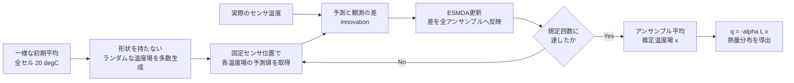
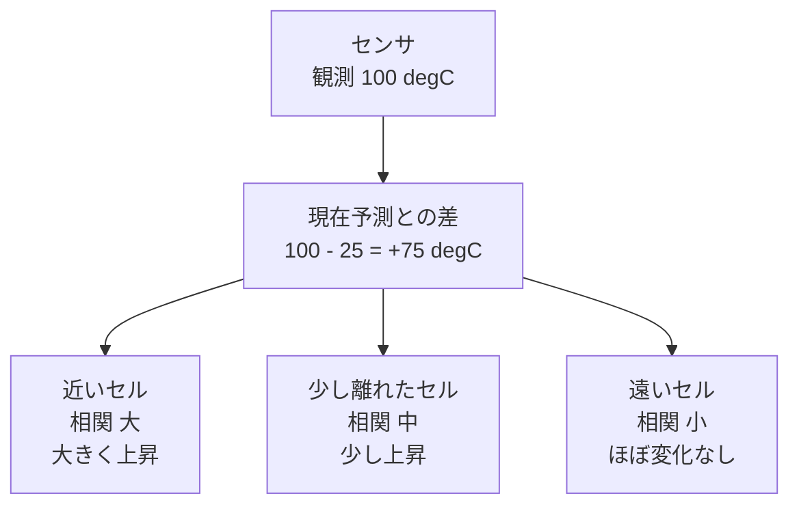
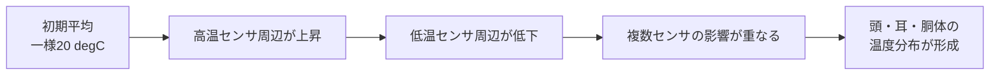
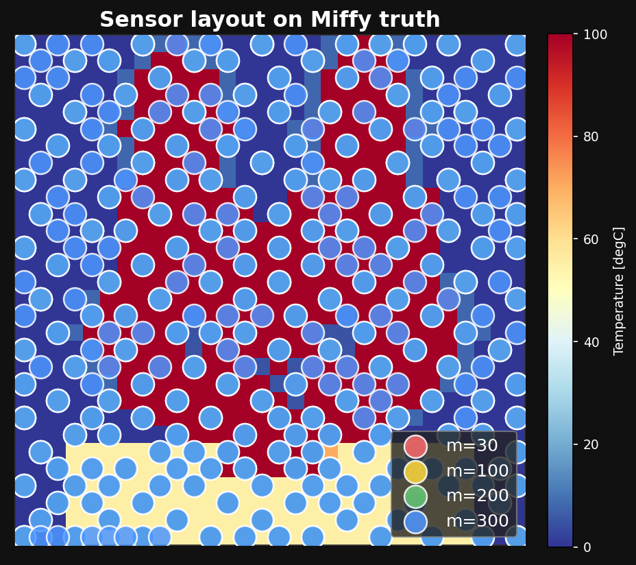
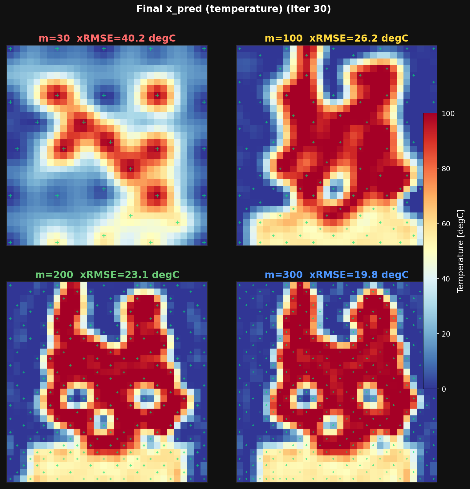
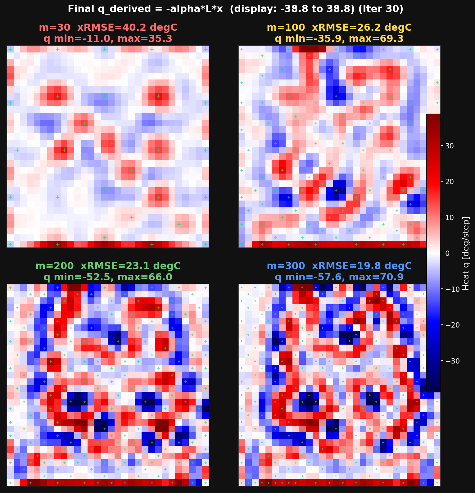

# ESMDAとは何か

ESMDAは **Ensemble Smoother with Multiple Data Assimilation** の略です。
日本語では「複数回データ同化を行うアンサンブルスムーザー」と説明できます。

このケースでは、最初はミッフィー形状を知らない一様な温度場を用意し、
固定センサで測った温度を少しずつ反映して、全体の温度分布を推定します。

> `ESMD` ではなく、末尾に `A` が付いた `ESMDA` が正式な略称です。  
> `A` は Multiple Data **Assimilation** の A です。

---

## 1. 全体の流れ



重要なのは、初期状態にミッフィー形状を入れていないことです。
形状はセンサ温度と、後述する「近い場所の温度は相関する」という仮定から
徐々に現れます。

---

## 2. アンサンブルとは

未知の温度場を1枚だけ用意するのではなく、少しずつ異なる候補を
`N_ENS` 枚用意します。各候補をアンサンブルメンバーと呼びます。

```text
メンバー1    20 degCを中心とした滑らかなランダム場
メンバー2    20 degCを中心とした別のランダム場
メンバー3    20 degCを中心とした別のランダム場
   ...
メンバーN
     │
     ├─ 平均      = 現在の推定温度場
     └─ ばらつき  = どの場所がどれだけ不確かか
```

センサ位置の温度と、センサ以外のセルの温度がアンサンブル内で一緒に
増減していれば、「その2点には相関がある」と判断できます。
ESMDAはこの相関を使って、センサがないセルも修正します。

---

## 3. 1個のセンサが周囲を修正する仕組み



本ケースでは、初期アンサンブルをガウスフィルタで滑らかにしています。
そのため、隣接セルは似た変化をしやすく、センサ情報が周辺へ広がります。

局所化係数は次式です。

$$
\rho(d)=\exp\left(-\frac{1}{2}\frac{d^2}{R_{\mathrm{loc}}^2}\right)
$$

- $d$：推定セルとセンサの距離
- $R_{\mathrm{loc}}$：局所化半径
- 近いセンサ：$\rho \approx 1$
- 遠いセンサ：$\rho \approx 0$

局所化により、有限アンサンブルが偶然作った遠距離相関を抑えます。

---

## 4. EnKFとの違い

通常のEnKFは、時間とともに変化する系で使用します。

```text
時刻0 → 物理モデル → 時刻1 → 観測更新
                      ↓
                    時刻2 → 観測更新 → ...
```

今回の問題は、1つの静的な温度分布を推定する逆問題です。
同じ観測を使って解を繰り返し改善するため、フィルタではなく
スムーザーであるESMDAが適しています。

| 手法 | 主な対象 | 観測の使用 |
|---|---|---|
| EnKF | 時間発展する状態 | 各時刻の観測を順番に使う |
| ES | 静的逆問題 | 全観測を1回で使う |
| ESMDA | 静的逆問題 | 同じ観測を弱く分けて複数回使う |

---

## 5. なぜ複数回に分けるのか

観測を1回で強く反映すると、大きな修正によってアンサンブルが崩れたり、
有限個のメンバーから計算した誤った相関が強く反映されたりします。

ESMDAでは、観測誤差共分散 $\mathbf{R}$ を各反復で膨らませます。
反復回数を $N_a$ として、すべて同じ強さで更新する場合は、

$$
\mathbf{R}_{\mathrm{eff}} = N_a\mathbf{R}
$$

標準偏差では、

$$
\sigma_{\mathrm{eff}}=\sqrt{N_a}\sigma_R
$$

です。

```text
通常の1回更新
  初期場 ───────────────→ 観測へ強く修正

ESMDA
  初期場 → 小更新 → 小更新 → 小更新 → ... → 最終推定
           1/N_a    1/N_a    1/N_a
```

各更新は弱くなりますが、全反復を合わせると元の観測情報量になります。

一般には各反復の係数を $\alpha_k$ とすると、次を満たす必要があります。

$$
\sum_{k=1}^{N_a}\frac{1}{\alpha_k}=1
$$

本ケースは全反復で $\alpha_k=N_a$ としています。

---

## 6. 更新式

アンサンブル平均を $\bar{\mathbf{x}}$、各メンバーの平均との差を
$\mathbf{X}'$ とします。

$$
\mathbf{X}' =
\begin{bmatrix}
\mathbf{x}^{(1)}-\bar{\mathbf{x}} &
\cdots &
\mathbf{x}^{(N)}-\bar{\mathbf{x}}
\end{bmatrix}
$$

センサ位置を取り出す演算子を $\mathbf{H}$ とすると、
状態と観測の標本共分散は、

$$
\mathbf{P}_{xy}
=
\frac{1}{N-1}\mathbf{X}'(\mathbf{H}\mathbf{X}')^\mathsf{T}
$$

観測側の共分散は、

$$
\mathbf{P}_{yy}
=
\frac{1}{N-1}
(\mathbf{H}\mathbf{X}')
(\mathbf{H}\mathbf{X}')^\mathsf{T}
$$

カルマンゲインは、

$$
\mathbf{K}
=
\mathbf{P}_{xy}
\left(
\mathbf{P}_{yy}+\alpha_k\mathbf{R}
\right)^{-1}
$$

です。実際には状態・観測間の距離に応じた局所化係数 $\rho$ を掛けます。

各メンバーは、

$$
\mathbf{x}_{k+1}^{(j)}
=
\mathbf{x}_k^{(j)}
+
(\rho\circ\mathbf{K})
\left[
\mathbf{y}+\boldsymbol{\epsilon}_k^{(j)}
-\mathbf{H}\mathbf{x}_k^{(j)}
\right]
$$

で更新します。

- $\mathbf{y}$：センサ観測
- $\boldsymbol{\epsilon}$：観測誤差を表すランダム摂動
- $\circ$：要素ごとの積

---

## 7. このケースでミッフィーが現れる理由



センサ位置はミッフィー形状を見て選んでいません。
格子全体を均等に覆う空間充填配置です。



センサ数が増えるほど、センサ間の未観測領域が狭くなります。



ただし、センサ間の形状は事前相関による補間です。
観測だけで任意の900セルを完全に決めているわけではありません。

---

## 8. 熱量分布との関係

ESMDAが直接推定しているのは温度場 $\mathbf{x}$ です。
熱量 $\mathbf{q}$ は、最終温度場から次式で逆算します。

$$
\mathbf{q}=-\alpha\mathbf{L}\mathbf{x}
$$



$\mathbf{L}$ は空間二階差分なので、温度場の小さなギザギザも増幅します。
そのため、温度RMSEが小さくても熱量分布にはノイズが残りやすくなります。

---

## 9. パラメータの意味

| パラメータ | 大きくした場合 | 小さくした場合 |
|---|---|---|
| `N_ENS` | 共分散が安定するが計算量増加 | 高速だが偽相関・発散が増える |
| `N_ITER` | 1回の更新が弱く安定 | 1回の修正が強い |
| `SIGMA_B` | 初期候補の幅が広い | 初期平均から動きにくい |
| `SIGMA_R` | 観測を弱く信頼 | 観測へ強く合わせる |
| `CORR_L` | センサ影響が滑らかに広がる | 細かい形を表せるが点状になりやすい |
| `R_LOC` | 遠いセンサも影響 | 近傍センサだけが影響 |

精度を上げる際は、単に反復数を増やすよりも、`N_ENS`、`CORR_L`、
`R_LOC`、センサ密度の組合せを調整することが重要です。

---

## 10. 要点

1. 初期平均にはミッフィー形状を与えない。
2. 多数のランダム場から温度の空間相関を計算する。
3. センサで得た予測誤差を、相関のある周辺セルへ配る。
4. 同じ観測を弱い更新に分けて複数回同化する。
5. 局所化により、遠距離の偶然の相関を抑える。
6. 最終温度場からラプラシアンを用いて熱量を逆算する。

